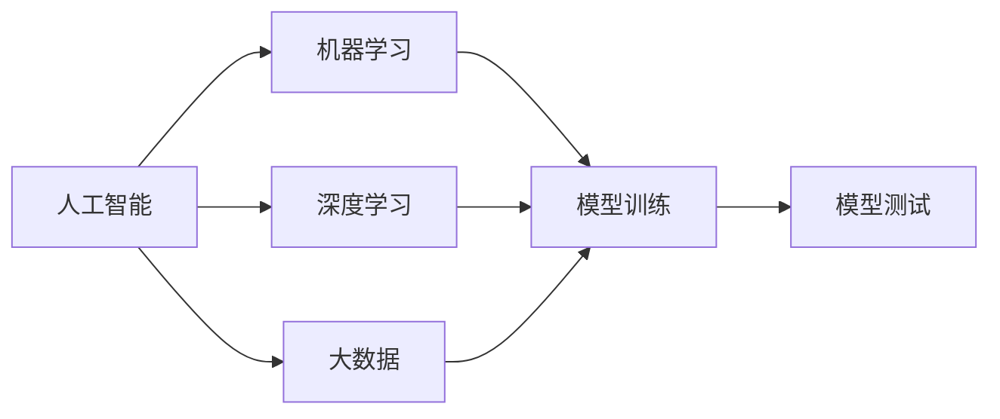

                 

# AI领域的独特时刻与未来

## 1. 背景介绍

在人工智能(AI)领域，过去几十年间发生了翻天覆地的变化。从早期的符号逻辑和专家系统，到后来的机器学习和大数据，再到深度学习与大规模预训练模型的崛起，AI技术逐步从实验室走向现实世界，带来了革命性的影响。这一系列演变中，有无数个标志性的历史时刻，它们共同塑造了AI领域的发展轨迹。本文将回顾AI领域的一些独特时刻，并展望其未来前景。

### 1.1 人工智能的起源与发展

人工智能的发展历程可以追溯到20世纪40年代末。1950年，图灵提出了“图灵测试”，标志着AI作为一个正式科学领域的诞生。此后，经过几十年的探索，AI技术逐渐成熟，涉及语言处理、视觉识别、自动规划、专家系统等多个方向。20世纪90年代，AI的研究进入低谷，但随着互联网的普及和数据的爆炸，AI领域再次迎来曙光。

### 1.2 人工智能的里程碑

- **1958年**：麦卡锡和明斯基出版了《感知器》一书，开创了神经网络的研究。
- **1972年**：Russell和Norvig出版了《人工智能：一种现代方法》，奠定了AI领域的经典教材地位。
- **1986年**：反向传播算法的发明，使得深度神经网络成为可能。
- **1997年**：IBM的“深蓝”战胜国际象棋世界冠军卡斯帕罗夫，标志着AI在博弈领域的突破。
- **2006年**：Hinton提出深度学习，加速了AI技术的发展。
- **2011年**：AlexNet在ImageNet上获得突破，深度学习在图像识别领域取得巨大进展。
- **2012年**：Bengio、Hinton和Rumelhart因在深度学习领域的贡献获得图灵奖，成为AI领域的标杆。
- **2016年**：AlphaGo战胜世界围棋冠军李世石，标志着AI在棋类游戏上的新高度。
- **2018年**：Facebook的YOLOv3在COCO数据集上获得图像识别最先进结果，刷新了认知。
- **2019年**：GPT-2诞生，标志着语言模型的突破。
- **2021年**：AlphaFold解决蛋白质折叠问题，AI在生命科学领域取得了重大突破。

## 2. 核心概念与联系

### 2.1 核心概念概述

- **人工智能**：通过计算机程序实现的一种智能。
- **机器学习**：利用算法让机器从数据中学习规律。
- **深度学习**：一种特殊的机器学习方法，通过多层神经网络逼近复杂函数。
- **神经网络**：模拟人脑神经元连接的网络结构，用于解决模式识别、预测等问题。
- **大数据**：大规模、多样化的数据集合，为深度学习提供数据基础。
- **模型训练与测试**：通过数据集训练模型，并通过测试集评估模型性能的过程。

这些概念构成了AI领域的基础，并在其发展过程中互相交织，推动着AI技术的不断进步。以下是一个展示这些概念之间联系的Mermaid流程图：



### 2.2 核心概念之间的关系

通过这个简单的流程图，我们可以看出AI领域的基本框架：

1. **人工智能**：是AI领域的高层概念，涵盖了机器学习、深度学习等具体技术。
2. **机器学习**：是AI的重要组成部分，为深度学习提供基础。
3. **深度学习**：是机器学习的高级形式，利用多层神经网络进行复杂模式识别和预测。
4. **大数据**：为深度学习提供数据基础，是AI发展的重要支撑。
5. **模型训练与测试**：是AI系统实现的核心步骤，确保模型能够准确地应用于实际问题。

## 3. 核心算法原理 & 具体操作步骤

### 3.1 算法原理概述

在AI领域，许多核心算法都基于数学和统计理论。以下是几个典型算法的概述：

- **神经网络**：由多个神经元组成，通过多层连接进行信息传递和处理。
- **卷积神经网络(CNN)**：利用卷积操作提取图像的局部特征。
- **循环神经网络(RNN)**：通过时间序列数据进行预测，适用于自然语言处理等任务。
- **深度学习模型训练**：通过反向传播算法更新神经网络参数，使得模型输出与目标值接近。

### 3.2 算法步骤详解

以深度学习模型训练为例，通常包括以下步骤：

1. **数据预处理**：清洗和标准化数据，进行特征提取和划分。
2. **模型构建**：选择并初始化神经网络模型。
3. **模型训练**：通过反向传播算法调整模型参数，使得模型输出逼近目标值。
4. **模型验证**：使用验证集评估模型性能，防止过拟合。
5. **模型测试**：使用测试集评估模型泛化能力。
6. **模型部署**：将训练好的模型应用于实际场景。

### 3.3 算法优缺点

深度学习算法的优点包括：

- **自适应能力强**：可以处理复杂的非线性关系。
- **表现优异**：在许多领域上取得最先进的结果。

缺点包括：

- **计算资源需求高**：需要大量的GPU和数据。
- **可解释性差**：模型的决策过程难以理解。
- **过拟合风险高**：数据集大小和质量对模型效果影响大。

### 3.4 算法应用领域

深度学习算法在许多领域都取得了突破，包括：

- **计算机视觉**：如图像识别、目标检测等。
- **自然语言处理**：如文本分类、机器翻译等。
- **语音识别**：如语音合成、情感分析等。
- **医疗**：如疾病预测、医学影像分析等。
- **自动驾驶**：如环境感知、路径规划等。

## 4. 数学模型和公式 & 详细讲解

### 4.1 数学模型构建

深度学习模型的数学模型通常包括输入数据 $X$，模型参数 $\theta$，输出 $Y$，损失函数 $L$，优化器等。以多层感知机为例，其数学模型为：

$$Y = f(X; \theta)$$

其中 $f$ 为神经网络的前向传播过程，$\theta$ 为模型参数。

### 4.2 公式推导过程

以反向传播算法为例，其核心公式为：

$$\frac{\partial L}{\partial \theta_j} = \frac{\partial L}{\partial y_j} \cdot \frac{\partial y_j}{\partial z_j} \cdot \frac{\partial z_j}{\partial \theta_j}$$

其中，$y_j$ 为输出节点，$z_j$ 为激活函数。反向传播算法通过链式法则，逐步计算损失函数对模型参数的梯度，并更新模型参数。

### 4.3 案例分析与讲解

以ImageNet数据集上的卷积神经网络为例，假设模型输入为图像 $I$，输出为类别 $C$，模型参数为 $\theta$。模型的训练过程如下：

1. **数据预处理**：对图像进行归一化处理，转换为网络输入格式。
2. **模型构建**：搭建多个卷积层和池化层，最后连接全连接层输出类别概率。
3. **模型训练**：通过反向传播算法更新模型参数，最小化损失函数 $L$。
4. **模型验证**：使用验证集评估模型性能，调整学习率等超参数。
5. **模型测试**：使用测试集评估模型泛化能力，输出类别预测。

## 5. 项目实践：代码实例和详细解释说明

### 5.1 开发环境搭建

项目开发需要Python、TensorFlow等工具，以下是一个开发环境搭建步骤：

1. **安装Python**：
   ```
   sudo apt-get install python3
   ```
2. **安装TensorFlow**：
   ```
   pip install tensorflow
   ```
3. **安装PyTorch**：
   ```
   pip install torch torchvision torchaudio
   ```
4. **安装Jupyter Notebook**：
   ```
   pip install jupyter notebook
   ```

### 5.2 源代码详细实现

以下是一个简单的卷积神经网络代码示例：

```python
import tensorflow as tf
from tensorflow.keras import datasets, layers, models

# 加载数据集
(train_images, train_labels), (test_images, test_labels) = datasets.cifar10.load_data()

# 数据预处理
train_images, test_images = train_images / 255.0, test_images / 255.0

# 构建模型
model = models.Sequential()
model.add(layers.Conv2D(32, (3, 3), activation='relu', input_shape=(32, 32, 3)))
model.add(layers.MaxPooling2D((2, 2)))
model.add(layers.Conv2D(64, (3, 3), activation='relu'))
model.add(layers.MaxPooling2D((2, 2)))
model.add(layers.Conv2D(64, (3, 3), activation='relu'))
model.add(layers.Flatten())
model.add(layers.Dense(64, activation='relu'))
model.add(layers.Dense(10))

# 编译模型
model.compile(optimizer='adam',
              loss=tf.keras.losses.SparseCategoricalCrossentropy(from_logits=True),
              metrics=['accuracy'])

# 训练模型
history = model.fit(train_images, train_labels, epochs=10, 
                    validation_data=(test_images, test_labels))
```

### 5.3 代码解读与分析

- **数据加载与预处理**：使用CIFAR-10数据集，对图像进行归一化处理。
- **模型构建**：搭建多个卷积层和池化层，最后连接全连接层。
- **模型编译与训练**：使用Adam优化器，SparseCategoricalCrossentropy损失函数，训练10个epochs。
- **模型评估**：使用测试集评估模型性能。

### 5.4 运行结果展示

运行上述代码，可以得到训练过程中的损失和准确率变化图：


## 6. 实际应用场景

### 6.1 计算机视觉

计算机视觉是AI的重要应用领域，主要包括以下几个方向：

- **图像识别**：如物体识别、人脸识别等。
- **目标检测**：如人脸检测、车辆检测等。
- **图像分割**：如语义分割、实例分割等。

### 6.2 自然语言处理

自然语言处理是AI的另一大应用领域，主要包括以下几个方向：

- **文本分类**：如新闻分类、情感分析等。
- **机器翻译**：如英中翻译、中英翻译等。
- **语言生成**：如文本摘要、对话系统等。

### 6.3 医疗领域

医疗领域是AI应用的新兴领域，主要包括以下几个方向：

- **医学影像分析**：如CT图像分析、MRI图像分析等。
- **疾病预测**：如糖尿病预测、癌症预测等。
- **辅助诊断**：如病理学诊断、放射科诊断等。

### 6.4 自动驾驶

自动驾驶是AI技术在实际应用中的重要方向，主要包括以下几个方向：

- **环境感知**：如道路识别、障碍物检测等。
- **路径规划**：如导航规划、路径优化等。
- **驾驶辅助**：如车道保持、自动泊车等。

## 7. 工具和资源推荐

### 7.1 学习资源推荐

- **深度学习入门**：《深度学习》一书，由Ian Goodfellow、Yoshua Bengio和Aaron Courville共同编写，是深度学习领域的经典教材。
- **TensorFlow官方文档**：[https://www.tensorflow.org](https://www.tensorflow.org)，提供了完整的API文档和示例代码。
- **PyTorch官方文档**：[https://pytorch.org/docs/stable/index.html](https://pytorch.org/docs/stable/index.html)，提供了丰富的API和样例。
- **Kaggle**：[https://www.kaggle.com](https://www.kaggle.com)，提供大量数据集和竞赛，助力学习实践。

### 7.2 开发工具推荐

- **PyTorch**：深度学习框架，提供了强大的GPU加速功能。
- **TensorFlow**：深度学习框架，支持分布式计算和生产环境部署。
- **Jupyter Notebook**：交互式编程环境，便于调试和展示代码。
- **Google Colab**：免费的云环境，支持GPU计算，适合实验使用。

### 7.3 相关论文推荐

- **深度学习**：《Deep Learning》，Ian Goodfellow等著。
- **计算机视觉**：《Computer Vision: Algorithms and Applications》，Richard Szeliski著。
- **自然语言处理**：《Speech and Language Processing》，Daniel Jurafsky和James H. Martin著。

## 8. 总结：未来发展趋势与挑战

### 8.1 研究成果总结

AI领域的突破性成果主要集中在以下几个方向：

- **深度学习**：通过多层神经网络逼近复杂函数，解决大规模数据问题。
- **计算机视觉**：利用卷积神经网络进行图像识别、目标检测等。
- **自然语言处理**：通过循环神经网络和Transformer模型进行文本分类、机器翻译等。
- **自动驾驶**：利用卷积神经网络和循环神经网络进行环境感知和路径规划。

### 8.2 未来发展趋势

AI领域未来发展趋势包括以下几个方向：

- **联邦学习**：在保护隐私的前提下，实现分布式模型训练。
- **自监督学习**：利用数据生成对抗网络等技术，进行无监督学习。
- **强化学习**：通过奖励机制训练模型，实现自主决策。
- **知识图谱**：利用图结构存储和推理知识，提升智能水平。

### 8.3 面临的挑战

AI领域面临的挑战包括：

- **数据隐私和安全**：如何在保护隐私的前提下，实现高效的数据利用。
- **模型可解释性**：如何让模型决策过程可解释，提高可信度。
- **计算资源需求**：如何在有限资源下，实现高效的模型训练和推理。
- **伦理和道德**：如何在AI应用中，确保伦理和道德的边界。

### 8.4 研究展望

未来AI领域的研究方向包括：

- **AI伦理**：如何确保AI应用符合伦理和道德规范。
- **AI透明性**：如何让AI模型决策过程透明可解释。
- **AI安全性**：如何在AI应用中，确保数据和模型的安全。
- **AI普及化**：如何让AI技术更好地服务于社会大众。

## 9. 附录：常见问题与解答

**Q1：AI技术的未来发展方向是什么？**

A：AI技术的未来发展方向包括：

- **联邦学习**：通过分布式计算，在保护隐私的前提下，实现模型训练。
- **自监督学习**：利用数据生成对抗网络等技术，进行无监督学习。
- **强化学习**：通过奖励机制训练模型，实现自主决策。
- **知识图谱**：利用图结构存储和推理知识，提升智能水平。

**Q2：AI技术在实际应用中面临哪些挑战？**

A：AI技术在实际应用中面临的挑战包括：

- **数据隐私和安全**：如何在保护隐私的前提下，实现高效的数据利用。
- **模型可解释性**：如何让模型决策过程可解释，提高可信度。
- **计算资源需求**：如何在有限资源下，实现高效的模型训练和推理。
- **伦理和道德**：如何在AI应用中，确保伦理和道德的边界。

**Q3：如何实现联邦学习？**

A：实现联邦学习的主要步骤包括：

- **数据分区**：将数据分成多个子集，分别存储在不同的设备上。
- **模型训练**：每个设备本地训练模型，并分享梯度参数。
- **模型聚合**：通过聚合各设备模型的参数，更新全局模型。
- **安全机制**：使用差分隐私等技术，保护数据隐私。

**Q4：如何提高AI模型的可解释性？**

A：提高AI模型可解释性的方法包括：

- **LIME和SHAP**：通过局部线性近似和特征加权，解释模型预测。
- **Grad-CAM和Grad-CAM++**：通过可视化模型特征图，理解模型推理过程。
- **知识图谱**：利用图结构存储和推理知识，增强模型理解能力。

**Q5：如何确保AI技术的伦理和道德？**

A：确保AI技术的伦理和道德的方法包括：

- **算法透明性**：确保算法决策过程透明可解释。
- **数据公平性**：确保数据样本分布公平，避免偏见。
- **模型鲁棒性**：确保模型对异常数据有鲁棒性，避免误判。
- **用户参与**：确保用户了解并同意AI应用的使用。

通过深入学习和实践，相信我们能够更好地掌握AI技术，解决实际问题，推动社会进步。

