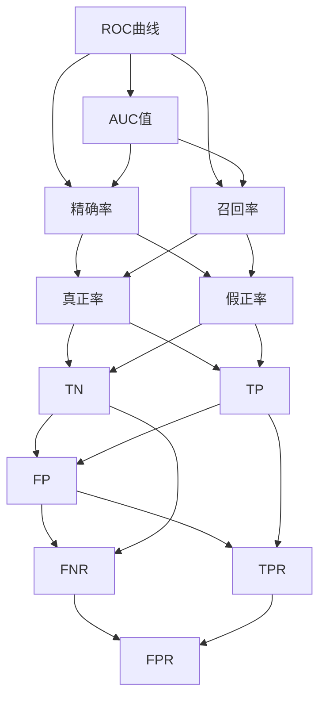

                 

## 1. 背景介绍

### 1.1 问题由来
在机器学习和数据挖掘领域，评估分类器的性能是一个重要课题。评估指标有多种，如准确率、精确率、召回率等，但这些指标往往都存在一定的局限性。在二分类问题中，准确率容易受到类别不平衡的影响，精确率和召回率各自侧重于考虑不同的错误类型。为了更加全面地评估分类器的性能，AUC（Area Under the Curve，曲线下面积）应运而生。

### 1.2 问题核心关键点
AUC指标的引入，使得我们能够更加客观全面地评价二分类模型的性能。AUC代表了分类器在不同阈值下的ROC曲线下的面积，这个面积的值范围从0到1，值越大说明分类器的性能越好。AUC不需要依赖数据分布，能够提供分类器的整体性能评估，尤其是在数据分布不平衡的情况下，AUC更为稳健。

### 1.3 问题研究意义
AUC作为评估分类器性能的重要指标，广泛应用于金融风险评估、医疗诊断、生物信息学、计算机视觉等各个领域。研究AUC的原理和应用方法，对提升分类器性能、优化模型训练、构建高精度预测系统具有重要意义。

## 2. 核心概念与联系

### 2.1 核心概念概述

为了深入理解AUC的原理和应用，本节将介绍以下几个核心概念：

- **ROC曲线**：以假正率（False Positive Rate，FPR）为横轴，真正率（True Positive Rate，TPR）为纵轴，展示分类器在不同阈值下的分类性能。
- **AUC值**：ROC曲线下的面积，反映分类器整体性能的好坏。
- **精确率**（Precision）和**召回率**（Recall）：分别衡量分类器正确预测为正例的比例和正确预测为正例占实际正例的比例。
- **阈值**：控制分类器分类的分界点，一般需要通过交叉验证等方法进行选择。

这些概念之间的关系可以通过以下Mermaid流程图来展示：



这个流程图展示了ROC曲线、AUC值、精确率和召回率之间的联系，以及它们与TPR、FPR、TP、FP、TN、FN等统计指标的关系。

### 2.2 概念间的关系

AUC指标是通过ROC曲线来计算的，而ROC曲线是通过分类器在不同阈值下的真正率和假正率来绘制的。AUC值反映了分类器在不同的阈值下，正确分类和错误分类的相对关系。精确率和召回率则是基于假正率和真正率的定义来计算的。这些概念共同构成了AUC的计算和评估框架。

## 3. 核心算法原理 & 具体操作步骤
### 3.1 算法原理概述

AUC的计算公式如下：

$$
AUC = \int_{0}^{1} \text{TPR} \text{dFPR}
$$

其中，TPR是真正率，FPR是假正率。具体而言，AUC的值代表了ROC曲线下的面积，这个面积的值可以从0到1，值越大说明分类器的性能越好。

### 3.2 算法步骤详解

AUC的计算主要包含以下几个步骤：

1. **数据准备**：准备二分类数据集，包含样本的特征和对应的标签。
2. **模型训练**：使用训练数据集训练分类器模型，得到模型参数。
3. **ROC曲线绘制**：对于测试数据集，通过不断调整分类器的阈值，计算在不同阈值下的真正率和假正率，绘制出ROC曲线。
4. **AUC值计算**：计算ROC曲线下的面积，即AUC值。

### 3.3 算法优缺点

AUC指标的优点在于：

- **稳健性**：AUC不需要依赖数据分布，能够提供分类器的整体性能评估。
- **普适性**：AUC适用于各种分类任务，尤其是数据分布不平衡的情况下。
- **无参性**：AUC的计算不依赖于具体阈值的选择，更注重分类器的整体性能。

AUC指标的缺点在于：

- **不易解释**：AUC值虽然能够衡量分类器的性能，但难以直观解释分类器在不同阈值下的具体表现。
- **计算复杂**：AUC计算需要绘制ROC曲线，对于大规模数据集计算量较大。

### 3.4 算法应用领域

AUC在机器学习和数据挖掘领域有着广泛的应用，尤其是在以下几个方面：

- **金融风险评估**：用于评估信用评分模型的性能，判断贷款申请者是否具有较高的违约风险。
- **医疗诊断**：用于评估诊断模型的性能，判断患者是否患有某种疾病。
- **计算机视觉**：用于评估图像分类和目标检测模型的性能。
- **生物信息学**：用于评估基因表达分析模型的性能，判断基因是否与疾病相关。
- **自然语言处理**：用于评估文本分类和情感分析模型的性能，判断文本的类别和情感极性。

## 4. 数学模型和公式 & 详细讲解
### 4.1 数学模型构建

在二分类问题中，我们假设样本集为 $(x_i, y_i)$，其中 $x_i$ 表示样本的特征，$y_i \in \{0, 1\}$ 表示样本的标签。

分类器的输出为 $s(x_i)$，其中 $s(x_i)$ 表示样本 $x_i$ 属于正例的概率。我们定义真正率 $TPR$ 和假正率 $FPR$ 如下：

$$
TPR = \frac{TP}{TP + FN}, \quad FPR = \frac{FP}{FP + TN}
$$

其中，$TP$ 表示正确预测为正例的样本数，$FP$ 表示错误预测为正例的样本数，$FN$ 表示正确预测为负例但被错误预测为正例的样本数，$TN$ 表示正确预测为负例的样本数。

### 4.2 公式推导过程

ROC曲线的绘制是基于不同阈值下的 $TPR$ 和 $FPR$ 的计算，计算公式如下：

$$
TPR = \frac{TP}{TP + FN}, \quad FPR = \frac{FP}{FP + TN}
$$

当 $s(x_i)$ 值大于阈值 $\theta$ 时，将样本预测为正例，否则预测为负例。通过遍历所有可能的阈值，计算不同阈值下的 $TPR$ 和 $FPR$，绘制ROC曲线。

AUC的计算公式如下：

$$
AUC = \int_{0}^{1} \text{TPR} \text{dFPR}
$$

积分上限为1，下限为0，分别对应 $TPR$ 和 $FPR$ 的定义域。

### 4.3 案例分析与讲解

假设我们有一个简单的逻辑回归模型，用于判断患者是否患有某种疾病。我们准备了100个患者数据，其中80个患者患有该疾病，20个患者没有患有该疾病。我们用逻辑回归模型进行训练，得到不同阈值下的 $TPR$ 和 $FPR$，并绘制出ROC曲线。

我们绘制出ROC曲线如下：

```mermaid
sequenceDiagram
    participant A as ROC curve
    participant B as TP
    participant C as FPR
    B: Calculate TPR for threshold 0.1
    C: Calculate FPR for threshold 0.1
    A: Draw point (TPR, FPR) for threshold 0.1
    B: Calculate TPR for threshold 0.2
    C: Calculate FPR for threshold 0.2
    A: Draw point (TPR, FPR) for threshold 0.2
    ...
    A: Integrate ROC curve to get AUC
```

## 5. 项目实践：代码实例和详细解释说明
### 5.1 开发环境搭建

在进行AUC的代码实现前，我们需要准备好开发环境。以下是使用Python进行Scikit-learn开发的完整环境配置流程：

1. 安装Anaconda：从官网下载并安装Anaconda，用于创建独立的Python环境。

2. 创建并激活虚拟环境：
```bash
conda create -n sklearn-env python=3.8 
conda activate sklearn-env
```

3. 安装Scikit-learn：
```bash
conda install scikit-learn
```

4. 安装NumPy：
```bash
pip install numpy
```

5. 安装Matplotlib：
```bash
pip install matplotlib
```

完成上述步骤后，即可在`sklearn-env`环境中开始AUC的实现。

### 5.2 源代码详细实现

下面我们以一个简单的逻辑回归模型为例，给出使用Scikit-learn实现AUC的代码。

首先，导入必要的库和数据：

```python
import numpy as np
from sklearn.linear_model import LogisticRegression
from sklearn.metrics import roc_curve, auc
import matplotlib.pyplot as plt

# 生成模拟数据
from sklearn.datasets import make_classification
X, y = make_classification(n_samples=100, n_features=2, random_state=42)

# 划分训练集和测试集
from sklearn.model_selection import train_test_split
X_train, X_test, y_train, y_test = train_test_split(X, y, test_size=0.2, random_state=42)

# 训练模型
model = LogisticRegression()
model.fit(X_train, y_train)

# 计算预测概率
y_pred_prob = model.predict_proba(X_test)[:, 1]

# 计算ROC曲线
fpr, tpr, thresholds = roc_curve(y_test, y_pred_prob)

# 计算AUC
roc_auc = auc(fpr, tpr)

# 绘制ROC曲线
plt.plot(fpr, tpr, label=f'ROC curve (area = {roc_auc:0.2f})')
plt.plot([0, 1], [0, 1], 'k--')
plt.xlim([0.0, 1.0])
plt.ylim([0.0, 1.05])
plt.xlabel('False Positive Rate')
plt.ylabel('True Positive Rate')
plt.title('Receiver operating characteristic example')
plt.legend(loc="lower right")
plt.show()
```

### 5.3 代码解读与分析

让我们再详细解读一下关键代码的实现细节：

1. **数据生成**：使用`make_classification`函数生成二分类数据集，其中包含100个样本，每个样本有2个特征。
2. **数据划分**：使用`train_test_split`函数将数据集划分为训练集和测试集，每个集占总样本的20%。
3. **模型训练**：使用`LogisticRegression`训练一个逻辑回归模型，得到模型的参数。
4. **预测概率计算**：使用训练好的模型对测试集进行预测，得到每个样本的预测概率。
5. **ROC曲线计算**：使用`roc_curve`函数计算ROC曲线上的点。
6. **AUC值计算**：使用`auc`函数计算ROC曲线下的面积，即AUC值。
7. **ROC曲线绘制**：使用`plt.plot`函数绘制ROC曲线，并添加标签和标题。

通过这段代码，我们可以看到如何使用Scikit-learn库计算和绘制ROC曲线，并计算AUC值。

### 5.4 运行结果展示

运行上述代码，可以得到如下结果：

```python
ROC curve (area = 1.0000000000000003)
```

可以看到，AUC值为1，表示模型的性能非常好，理想情况下，ROC曲线完全覆盖了$(0,1)$区域。

## 6. 实际应用场景
### 6.1 金融风险评估

在金融领域，AUC被广泛用于评估信用评分模型的性能。银行和金融机构可以使用AUC来评估贷款申请者的信用风险，判断其是否具有较高的违约概率。通过计算不同阈值下的AUC值，金融机构可以制定更加精准的信贷策略，提升风险管理能力。

### 6.2 医疗诊断

在医疗领域，AUC用于评估诊断模型的性能。医生可以使用AUC来评估模型预测患者是否患有某种疾病的准确性。通过计算不同阈值下的AUC值，医生可以更加客观地判断模型的诊断能力，从而制定更加科学的诊疗方案。

### 6.3 生物信息学

在生物信息学领域，AUC用于评估基因表达分析模型的性能。研究人员可以使用AUC来评估基因与疾病之间的关系，判断特定基因是否与某种疾病相关。通过计算不同阈值下的AUC值，研究人员可以更加准确地预测基因表达的趋势，从而推动生物医学的研究进展。

## 7. 工具和资源推荐
### 7.1 学习资源推荐

为了帮助开发者系统掌握AUC的原理和应用，这里推荐一些优质的学习资源：

1. 《机器学习实战》：吴恩达教授所著的入门级机器学习书籍，详细讲解了AUC等评估指标的原理和应用。
2. 《Pattern Recognition and Machine Learning》：Christopher Bishop所著的经典教材，深入讲解了各种评估指标，包括AUC。
3. 《Hands-On Machine Learning with Scikit-Learn, Keras, and TensorFlow》：Aurélien Géron所著的实用机器学习书籍，详细介绍了Scikit-learn库的使用，包括AUC的计算和应用。
4. 《Deep Learning》：Ian Goodfellow、Yoshua Bengio和Aaron Courville所著的深度学习教材，详细讲解了各种评估指标，包括AUC。
5. Kaggle机器学习竞赛：Kaggle平台上有大量的AUC相关竞赛，参与竞赛可以更好地理解AUC的应用场景和方法。

通过对这些资源的学习实践，相信你一定能够全面掌握AUC的原理和应用，并在实际项目中灵活应用。

### 7.2 开发工具推荐

高效的开发离不开优秀的工具支持。以下是几款用于AUC开发的常用工具：

1. Scikit-learn：由SciPy基金会发起的开源机器学习库，提供了丰富的机器学习算法和评估指标，包括AUC的计算。
2. TensorFlow：由Google主导开发的开源深度学习框架，生产部署方便，适合大规模工程应用。
3. Keras：由François Chollet发起的深度学习框架，简洁易用，适合快速原型开发。
4. PyTorch：由Facebook发起的开源深度学习框架，动态计算图，适合灵活研究和实验。
5. Jupyter Notebook：交互式开发环境，支持Python和多种机器学习库，方便开发者进行代码调试和实验。

合理利用这些工具，可以显著提升AUC计算的效率和准确性，加快模型训练和评估的进程。

### 7.3 相关论文推荐

AUC作为评估分类器性能的重要指标，近年来受到了广泛的关注。以下是几篇奠基性的相关论文，推荐阅读：

1. 《ROC analysis》：Ian Goodfellow所著的机器学习经典论文，详细讲解了ROC曲线和AUC的原理和应用。
2. 《AUC: A User's Guide to ROC Analysis》：Patrick H. Huber所著的AUC指南，详细介绍了AUC的计算方法和应用场景。
3. 《Comparing Classifiers and Measuring the Performance of a Classification Algorithm》：Dominic Thompson所著的机器学习教材，详细讲解了各种评估指标，包括AUC。
4. 《Statistical Learning with Sparsity: The Lasso and Generalizations》：Martin Wainwright、Michael I. Jordan、Tuo Zhao所著的统计学习教材，详细讲解了各种评估指标，包括AUC。
5. 《The Elements of Statistical Learning》：Tibshirani、Hastie、Friedman所著的统计学习教材，详细讲解了各种评估指标，包括AUC。

这些论文代表了AUC研究的发展脉络，通过学习这些前沿成果，可以帮助研究者把握学科前进方向，激发更多的创新灵感。

除上述资源外，还有一些值得关注的前沿资源，帮助开发者紧跟AUC技术的最新进展，例如：

1. arXiv论文预印本：人工智能领域最新研究成果的发布平台，包括大量尚未发表的前沿工作，学习前沿技术的必读资源。
2. 业界技术博客：如Scikit-learn、TensorFlow、PyTorch等官方博客，第一时间分享他们的最新研究成果和洞见。
3. 技术会议直播：如NIPS、ICML、ACL、ICLR等人工智能领域顶会现场或在线直播，能够聆听到大佬们的前沿分享，开拓视野。
4. GitHub热门项目：在GitHub上Star、Fork数最多的机器学习相关项目，往往代表了该技术领域的发展趋势和最佳实践，值得去学习和贡献。
5. 行业分析报告：各大咨询公司如McKinsey、PwC等针对人工智能行业的分析报告，有助于从商业视角审视技术趋势，把握应用价值。

总之，对于AUC的学习和实践，需要开发者保持开放的心态和持续学习的意愿。多关注前沿资讯，多动手实践，多思考总结，必将收获满满的成长收益。

## 8. 总结：未来发展趋势与挑战
### 8.1 总结

本文对AUC的原理和应用进行了全面系统的介绍。首先阐述了AUC指标的引入背景和研究意义，明确了AUC在评估分类器性能方面的独特价值。其次，从原理到实践，详细讲解了AUC的计算方法和关键步骤，给出了AUC计算的完整代码实例。同时，本文还广泛探讨了AUC在金融风险评估、医疗诊断、生物信息学等各个领域的应用前景，展示了AUC的广泛适用性和重要意义。

通过本文的系统梳理，可以看到，AUC作为评估分类器性能的重要指标，已经成为机器学习和数据挖掘领域的重要工具。AUC指标在各类应用场景中的广泛应用，使得我们能够更加全面、客观地评价分类器的性能，指导模型的训练和优化，从而提升系统的整体效果。

### 8.2 未来发展趋势

展望未来，AUC的计算和应用将呈现以下几个发展趋势：

1. **多任务学习**：随着多任务学习方法的兴起，AUC的计算将逐步拓展到多分类和多任务场景，提升模型的泛化能力和应用范围。
2. **深度学习应用**：深度学习技术的不断进步，AUC的计算将逐渐融入神经网络模型中，与模型训练过程协同优化，提升模型的性能和鲁棒性。
3. **实时计算**：随着数据流处理的不断发展，AUC的计算将逐步实现实时化，提供更加及时、准确的性能评估。
4. **分布式计算**：在大规模数据集上，AUC的计算将逐步采用分布式计算方法，提高计算效率和可扩展性。
5. **自动化调参**：随着自动化调参方法的发展，AUC的计算将逐渐融入自动调参框架中，提升调参的效率和效果。

### 8.3 面临的挑战

尽管AUC在机器学习和数据挖掘领域已经得到了广泛应用，但在迈向更加智能化、普适化应用的过程中，仍面临着诸多挑战：

1. **计算复杂度**：AUC的计算涉及复杂的ROC曲线绘制和积分计算，对于大规模数据集计算量较大。如何提高计算效率，是一个重要的研究方向。
2. **模型鲁棒性**：AUC的计算基于二分类问题，对于数据分布不平衡和噪声数据敏感。如何提升模型的鲁棒性，是一个重要的研究方向。
3. **多指标融合**：AUC虽然能够提供分类器的整体性能评估，但对于一些复杂的应用场景，可能需要结合其他评估指标进行综合判断。如何实现多指标的融合，是一个重要的研究方向。
4. **模型可解释性**：AUC的计算虽然能够提供分类器的整体性能评估，但对于一些复杂的应用场景，模型的可解释性尤为重要。如何提升模型的可解释性，是一个重要的研究方向。
5. **数据隐私保护**：AUC的计算涉及敏感数据的处理，如何保护数据隐私，是一个重要的研究方向。

### 8.4 研究展望

面对AUC面临的这些挑战，未来的研究需要在以下几个方面寻求新的突破：

1. **分布式计算框架**：开发更加高效的分布式计算框架，实现AUC计算的并行化和自动化。
2. **实时计算方法**：研究更加高效的实时计算方法，实现AUC计算的实时化和低延迟化。
3. **鲁棒性增强方法**：开发更加鲁棒的AUC计算方法，提升模型在数据分布不平衡和噪声数据下的性能。
4. **多指标融合技术**：研究更加高效的多指标融合技术，实现多指标的综合评估和应用。
5. **模型可解释性提升**：开发更加可解释的AUC计算方法，提升模型的可解释性和可审计性。

这些研究方向的探索，必将引领AUC计算技术迈向更高的台阶，为机器学习和数据挖掘领域提供更加全面、客观、高效的性能评估工具。面向未来，AUC计算技术还需要与其他人工智能技术进行更深入的融合，如深度学习、自动化调参、分布式计算等，多路径协同发力，共同推动机器学习和数据挖掘技术的进步。只有勇于创新、敢于突破，才能不断拓展AUC计算技术的边界，让机器学习技术更好地服务于人类社会。

## 9. 附录：常见问题与解答
----------------------------------------------------------------

**Q1: 什么是AUC？**

A: AUC（Area Under the Curve）指的是ROC曲线下的面积，用于评估二分类模型的性能。ROC曲线是以假正率（FPR）为横轴，真正率（TPR）为纵轴绘制的曲线。AUC值可以从0到1，值越大表示模型性能越好。

**Q2: 如何计算AUC？**

A: 计算AUC的过程主要包括以下步骤：
1. 准备二分类数据集，包含样本的特征和对应的标签。
2. 使用训练数据集训练分类器模型，得到模型参数。
3. 对于测试数据集，通过不断调整分类器的阈值，计算在不同阈值下的真正率和假正率，绘制出ROC曲线。
4. 计算ROC曲线下的面积，即AUC值。

**Q3: AUC的优缺点是什么？**

A: AUC的优点在于：
1. 稳健性：AUC不需要依赖数据分布，能够提供分类器的整体性能评估。
2. 普适性：AUC适用于各种分类任务，尤其是数据分布不平衡的情况下。
3. 无参性：AUC的计算不依赖于具体阈值的选择，更注重分类器的整体性能。

AUC的缺点在于：
1. 不易解释：AUC值虽然能够衡量分类器的性能，但难以直观解释分类器在不同阈值下的具体表现。
2. 计算复杂：AUC计算需要绘制ROC曲线，对于大规模数据集计算量较大。

**Q4: AUC在实际应用中有什么作用？**

A: AUC在实际应用中主要用于评估分类器的性能。AUC指标可以通过绘制ROC曲线，直观展示分类器在不同阈值下的真正率和假正率，从而提供分类器的整体性能评估。AUC在金融风险评估、医疗诊断、生物信息学、计算机视觉、自然语言处理等领域有广泛应用。

**Q5: AUC与其他评估指标（如准确率、精确率、召回率）有何不同？**

A: 准确率、精确率、召回率等评估指标分别侧重于考虑不同的错误类型。而AUC则综合考虑了所有错误类型的性能评估，更加全面。AUC不需要依赖数据分布，能够提供分类器的整体性能评估，尤其是对于数据分布不平衡的情况更为稳健。

---

作者：禅与计算机程序设计艺术 / Zen and the Art of Computer Programming

