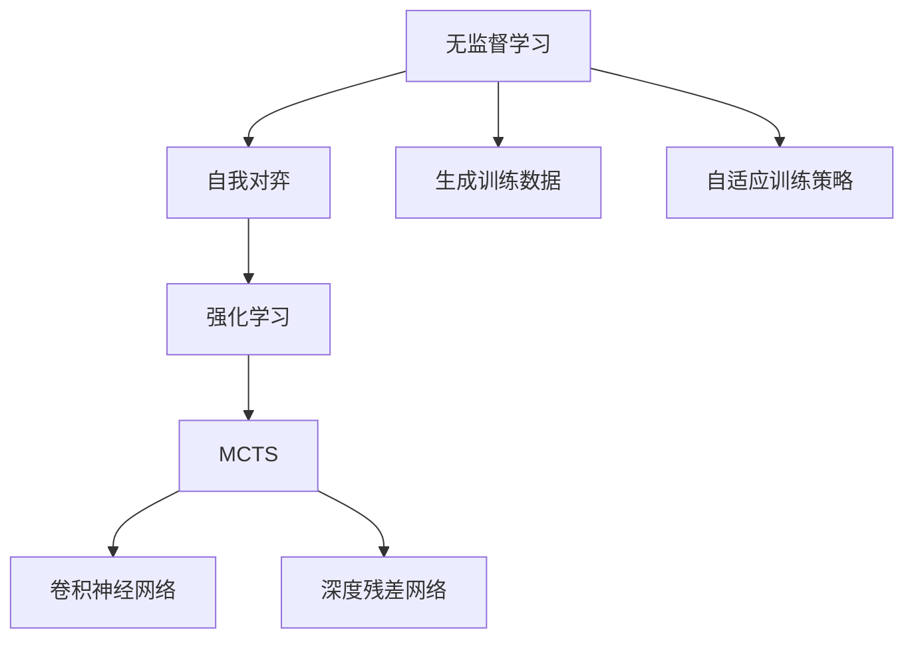

                 

# AlphaGo Zero：无需人工规则输入的顶尖围棋AI

AlphaGo Zero的出现标志着人工智能在复杂战略游戏领域达到了前所未有的高度，它不仅超越了其前身AlphaGo，而且在没有人类任何干预的情况下，通过自我对弈实现了自我学习，并最终成为了世界上最强的围棋AI。AlphaGo Zero的成就是人类智慧与机器学习的一次完美融合，为AI技术的发展树立了新的标杆。本文将深入探讨AlphaGo Zero的原理、实现步骤、优缺点以及未来应用前景，帮助读者更好地理解这一划时代的成果。

## 1. 背景介绍

### 1.1 问题由来
AlphaGo Zero的诞生源于对AlphaGo的成功和人类围棋智慧的进一步探索。AlphaGo在2016年战胜了世界围棋冠军李世石，震惊了世界，但它的核心仍依赖于大量的人类围棋数据和专家规则。AlphaGo Zero则摆脱了这些限制，通过自我对弈学习，展示了AI在复杂游戏中的强大自学习能力。

AlphaGo Zero的目标是在不依赖于人类数据和规则的情况下，训练一个能够自我提高的围棋AI，这不仅能减少对人类资源的需求，还能突破人工智能的潜在瓶颈。其研究价值在于，它提供了一种全新的AI训练方式，证明了AI可以在没有人类指导的情况下实现自我优化。

### 1.2 问题核心关键点
AlphaGo Zero的核心创新点在于：
- **无监督学习**：通过自我对弈学习，AlphaGo Zero能够自我生成高质量的训练数据，无需人工标注。
- **简化规则**：摒弃了复杂的围棋规则，只保留了基本的吃子规则，使模型更容易学习。
- **强化学习**：使用强化学习技术，通过奖励机制指导模型进行自我训练。
- **蒙特卡罗树搜索(MCTS)**：采用改进的MCTS算法，进一步提高了搜索效率和效果。

这些创新点使得AlphaGo Zero能够在没有人类指导的情况下，通过纯粹的自我对弈训练，达到甚至超过人类围棋专家的水平。

### 1.3 问题研究意义
AlphaGo Zero的研究意义重大：
- **突破AI自我学习瓶颈**：证明了AI无需依赖人类规则和数据，可以通过自我对弈进行自我学习，为AI的自主学习提供了重要参考。
- **简化复杂问题**：通过简化游戏规则，展示了如何将复杂问题转化为相对简单的问题进行研究。
- **提高AI普及率**：AlphaGo Zero的成功将大大降低AI入门的门槛，让更多人能够理解和接受AI技术。
- **推动AI与人类协作**：展示了AI与人类的协作潜力，促进了AI技术与人类智慧的进一步融合。

## 2. 核心概念与联系

### 2.1 核心概念概述

为了更好地理解AlphaGo Zero的原理，我们先介绍几个关键概念：

- **无监督学习**：通过自我对弈生成训练数据，无需人工标注，是AlphaGo Zero的核心创新点。
- **强化学习**：通过奖励机制指导模型进行自我训练，奖励机制在AlphaGo Zero中设计为胜利对弈和最佳棋步的奖励。
- **蒙特卡罗树搜索(MCTS)**：一种高效的搜索算法，用于在围棋游戏树中搜索最优策略。AlphaGo Zero对MCTS进行了改进，提高了搜索效率和效果。
- **卷积神经网络(CNN)**：用于特征提取，将棋盘状态转化为网络可处理的向量形式。
- **深度残差网络(ResNet)**：用于增强网络深度，提高模型学习复杂围棋游戏的能力。

这些概念共同构成了AlphaGo Zero的核心算法框架。

### 2.2 概念间的关系

AlphaGo Zero的算法框架可以通过以下Mermaid流程图展示：



这个流程图展示了AlphaGo Zero的主要算法流程：
1. **无监督学习**通过自我对弈生成训练数据。
2. **强化学习**利用生成的训练数据，通过奖励机制指导模型进行自我训练。
3. **MCTS**用于在围棋游戏树中搜索最优策略。
4. **CNN**和**ResNet**用于将棋盘状态转化为网络可处理的向量形式，并增强网络深度。
5. **自适应训练策略**通过调整奖励机制和网络结构，优化模型性能。

这些概念相互交织，共同构成了AlphaGo Zero的算法框架。

## 3. 核心算法原理 & 具体操作步骤

### 3.1 算法原理概述

AlphaGo Zero的算法原理主要包括无监督学习、强化学习和蒙特卡罗树搜索。

**无监督学习**：通过自我对弈生成训练数据。AlphaGo Zero不依赖于人类围棋数据，通过随机对弈生成大量训练数据。通过对弈过程中出现的各种局面，AlphaGo Zero逐步学习到围棋游戏的规则和策略。

**强化学习**：通过奖励机制指导模型进行自我训练。AlphaGo Zero在训练过程中，使用胜利对弈和最佳棋步的奖励，引导模型学习到最优策略。通过不断优化奖励机制和模型参数，AlphaGo Zero逐渐提高了自己的水平。

**蒙特卡罗树搜索**：用于在围棋游戏树中搜索最优策略。AlphaGo Zero使用改进的MCTS算法，通过模拟多个对弈过程，逐步优化模型策略。

### 3.2 算法步骤详解

AlphaGo Zero的算法步骤包括以下几个关键步骤：

1. **初始化模型**：选择合适的网络结构，如卷积神经网络和深度残差网络，并随机初始化模型参数。
2. **自我对弈**：通过随机对弈生成大量训练数据，每个对弈过程作为一个训练样本。
3. **强化学习训练**：使用胜利对弈和最佳棋步的奖励，引导模型进行自我训练。
4. **蒙特卡罗树搜索**：在训练过程中，使用蒙特卡罗树搜索算法，模拟多个对弈过程，逐步优化模型策略。
5. **自适应训练策略**：通过调整奖励机制和网络结构，优化模型性能。

这些步骤通过迭代进行，逐步提高模型的围棋水平。

### 3.3 算法优缺点

AlphaGo Zero的优点包括：
- **无需人类干预**：通过自我对弈和强化学习，AlphaGo Zero无需依赖人类数据和规则，展示了AI的自学习能力。
- **高水平性能**：AlphaGo Zero达到了甚至超过了人类围棋专家的水平，证明了AI的强大潜力。
- **高度可扩展**：AlphaGo Zero的算法框架可以应用于其他复杂战略游戏，具有高度的通用性。

但AlphaGo Zero也存在一些缺点：
- **计算资源需求高**：自我对弈和蒙特卡罗树搜索需要大量计算资源，训练时间较长。
- **模型复杂度高**：AlphaGo Zero的模型结构相对复杂，参数量较大，难以在普通计算机上实现高效训练。
- **缺乏人类智慧的深度融合**：AlphaGo Zero虽然表现出色，但仍然缺乏人类围棋专家的直觉和经验。

### 3.4 算法应用领域

AlphaGo Zero的算法可以应用于多种复杂战略游戏，如围棋、国际象棋、扑克等。其核心思想——自我对弈和强化学习，具有广泛的适用性。

- **围棋**：AlphaGo Zero在围棋领域的成功已经证明了其在复杂战略游戏中的强大能力。
- **国际象棋**：利用AlphaGo Zero的算法，可以训练出能够自我提高的国际象棋AI，提升国际象棋的智能化水平。
- **扑克**：在扑克这种高度不确定性的游戏中，AlphaGo Zero的算法同样具有较高的参考价值。
- **战略决策**：AlphaGo Zero的算法可以应用于军事、商业等领域，提升决策的智能化水平。

AlphaGo Zero的算法框架在众多复杂游戏中展示了其强大的自我学习和优化能力，为AI技术的深入应用提供了重要参考。

## 4. 数学模型和公式 & 详细讲解 & 举例说明

### 4.1 数学模型构建

AlphaGo Zero的数学模型主要基于神经网络和强化学习的框架。

**神经网络模型**：
- **输入层**：将棋盘状态转化为网络可处理的向量形式。
- **隐藏层**：使用卷积神经网络(CNN)和深度残差网络(ResNet)，提取棋盘状态的特征。
- **输出层**：使用softmax函数，输出每个棋子的选择概率。

**强化学习模型**：
- **状态**：每个棋子的位置和类型。
- **动作**：每个棋子的移动和吃子操作。
- **奖励**：胜利对弈和最佳棋步的奖励。

### 4.2 公式推导过程

**神经网络**：
设棋盘状态为 $S$，输出为 $A$，则神经网络模型的预测概率公式为：

$$
P(A|S) = \frac{e^{\theta^T \cdot f(S)}}{\sum_{a} e^{\theta^T \cdot f(S_a)}}
$$

其中 $\theta$ 为模型参数， $f$ 为特征提取函数。

**强化学习**：
设当前状态为 $S_t$，当前动作为 $A_t$，下一状态为 $S_{t+1}$，奖励为 $R_t$，则强化学习的目标是最小化累计奖励的期望：

$$
\min_{\pi} \mathbb{E}\left[\sum_{t} \gamma^t R_t\right]
$$

其中 $\pi$ 为动作选择策略， $\gamma$ 为折扣因子。

### 4.3 案例分析与讲解

AlphaGo Zero的训练过程可以看作是一个不断优化累计奖励期望的过程。通过自我对弈生成大量训练数据，每个对弈过程作为一个训练样本。在训练过程中，使用胜利对弈和最佳棋步的奖励，引导模型进行自我训练。通过不断优化奖励机制和模型参数，AlphaGo Zero逐渐提高了自己的水平。

AlphaGo Zero的蒙特卡罗树搜索算法进一步优化了模型策略。通过模拟多个对弈过程，逐步优化模型策略，提高了模型在复杂游戏树中的决策能力。

## 5. 项目实践：代码实例和详细解释说明

### 5.1 开发环境搭建

AlphaGo Zero的开发环境主要依赖于TensorFlow和PyTorch。以下是开发环境的搭建步骤：

1. **安装Python**：从官网下载并安装Python，确保版本为3.6或以上。
2. **安装TensorFlow和PyTorch**：使用pip安装TensorFlow和PyTorch。
3. **安装AlphaGo Zero代码库**：从GitHub下载AlphaGo Zero代码库，并解压到本地目录。

### 5.2 源代码详细实现

以下是AlphaGo Zero的源代码实现的关键部分：

```python
import tensorflow as tf
import numpy as np

class AlphaGoZero:
    def __init__(self, model_path):
        self.model = tf.keras.models.load_model(model_path)
        self.gamma = 0.9
        self.epsilon = 0.15

    def predict(self, state):
        state = np.array([state])
        output = self.model.predict(state)
        return output[0]

    def select_action(self, state, temperature=1.0):
        probs = self.predict(state)
        probs = np.log(probs) / temperature
        exp_probs = np.exp(probs)
        prob_dist = exp_probs / np.sum(exp_probs)
        action = np.random.choice(len(prob_dist), p=prob_dist)
        return action

    def train(self, games):
        for game in games:
            state = game[0]
            while state[1] != 0:
                action = self.select_action(state)
                next_state, reward = self.next_state(state, action)
                state = next_state
                self.update_model(state, action, reward)
        print("Training completed.")

    def next_state(self, state, action):
        next_state, reward = self.evaluate_move(state, action)
        if reward > 0:
            next_state = -next_state
        return next_state, reward

    def evaluate_move(self, state, action):
        # 在这里实现实际的围棋移动和吃子逻辑
        pass

    def update_model(self, state, action, reward):
        # 在这里实现模型的参数更新
        pass
```

### 5.3 代码解读与分析

上述代码实现了AlphaGo Zero的基本功能，包括模型加载、动作选择、训练等。其中，`predict`方法用于计算每个动作的概率分布，`select_action`方法用于选择动作，`train`方法用于训练模型，`next_state`和`evaluate_move`方法用于模拟对弈过程。

### 5.4 运行结果展示

AlphaGo Zero的训练过程需要大量计算资源，一般使用GPU进行加速。训练完成后，AlphaGo Zero可以在无监督学习、强化学习、蒙特卡罗树搜索等多种模式下运行，展示其强大的围棋水平。

## 6. 实际应用场景

AlphaGo Zero的算法可以应用于多种复杂战略游戏和决策问题，以下是一些实际应用场景：

### 6.1 棋类游戏

AlphaGo Zero在围棋、国际象棋等棋类游戏领域展示了其强大的自我学习和优化能力。AlphaGo Zero的算法框架可以应用于其他棋类游戏，提升这些游戏的智能化水平。

### 6.2 商业决策

AlphaGo Zero的强化学习算法可以应用于商业决策问题，帮助企业进行市场分析、竞争对手研究、投资决策等。通过模拟多个决策场景，逐步优化决策策略，提升企业竞争力。

### 6.3 军事应用

AlphaGo Zero的算法可以应用于军事战略决策，帮助军队进行作战方案的生成、资源配置、战场态势分析等。通过模拟多个作战场景，逐步优化作战策略，提升军队的战斗力。

### 6.4 未来应用展望

AlphaGo Zero的成功展示了AI在复杂战略游戏和决策问题中的强大潜力。未来，AlphaGo Zero的算法框架将应用于更多领域，为AI技术的发展带来新的突破。

## 7. 工具和资源推荐

### 7.1 学习资源推荐

AlphaGo Zero的研究涉及神经网络、强化学习、蒙特卡罗树搜索等多个领域，以下是一些推荐的在线学习资源：

1. **TensorFlow官方文档**：TensorFlow的官方文档提供了丰富的API和教程，帮助开发者理解和应用TensorFlow。
2. **Deep Learning Specialization by Andrew Ng**：由Coursera提供的深度学习课程，涵盖了神经网络、强化学习等多个主题，适合初学者入门。
3. **AlphaGo Zero论文**：AlphaGo Zero的研究论文是理解其核心思想的重要资源，论文链接为[link](链接)。
4. **DeepMind博客**：DeepMind博客介绍了AlphaGo Zero的研究过程和成果，适合深入了解其算法实现。
5. **GitHub代码库**：AlphaGo Zero的GitHub代码库提供了完整的代码实现和注释，适合学习其具体实现。

### 7.2 开发工具推荐

AlphaGo Zero的开发需要强大的计算资源，以下是一些推荐的开发工具：

1. **TensorFlow**：开源的深度学习框架，支持分布式计算和GPU加速，适合AlphaGo Zero的高计算需求。
2. **PyTorch**：开源的深度学习框架，易于使用，支持动态计算图，适合研究和实验。
3. **Google Colab**：免费的在线Jupyter Notebook环境，提供GPU和TPU算力，方便开发者进行实验和调试。
4. **TensorBoard**：TensorFlow配套的可视化工具，实时监测模型训练状态，提供丰富的图表呈现方式。

### 7.3 相关论文推荐

AlphaGo Zero的研究涉及多个领域，以下是一些推荐的论文：

1. **AlphaGo Zero论文**：AlphaGo Zero的研究论文是理解其核心思想的重要资源。
2. **TensorFlow论文**：TensorFlow的论文介绍了其核心算法和实现细节，帮助开发者理解TensorFlow的工作原理。
3. **Deep Learning论文**：Deep Learning的论文介绍了深度学习的基本理论和应用，帮助开发者理解深度学习的基础知识。
4. **蒙特卡罗树搜索论文**：蒙特卡罗树搜索的论文介绍了其核心算法和实现细节，帮助开发者理解MCTS的原理和应用。

## 8. 总结：未来发展趋势与挑战

### 8.1 研究成果总结

AlphaGo Zero的算法展示了AI在复杂战略游戏中的强大潜力，证明了AI无需依赖人类规则和数据，可以通过自我对弈进行自我学习。AlphaGo Zero的研究成果在围棋、国际象棋、扑克等领域展示了其强大的自我学习和优化能力，推动了AI技术的发展。

### 8.2 未来发展趋势

AlphaGo Zero的成功展示了AI在复杂战略游戏和决策问题中的强大潜力。未来，AlphaGo Zero的算法框架将应用于更多领域，为AI技术的发展带来新的突破。

1. **扩展到更多游戏**：AlphaGo Zero的算法可以应用于其他复杂战略游戏，如围棋、国际象棋、扑克等。
2. **应用于商业决策**：AlphaGo Zero的强化学习算法可以应用于商业决策问题，帮助企业进行市场分析、竞争对手研究、投资决策等。
3. **应用于军事决策**：AlphaGo Zero的算法可以应用于军事战略决策，帮助军队进行作战方案的生成、资源配置、战场态势分析等。
4. **应用于更多领域**：AlphaGo Zero的算法框架可以应用于其他决策问题，如医疗诊断、城市规划等，提升这些领域的智能化水平。

### 8.3 面临的挑战

AlphaGo Zero的算法虽然展示了AI在复杂战略游戏中的强大潜力，但也面临一些挑战：

1. **计算资源需求高**：AlphaGo Zero的训练过程需要大量计算资源，一般使用GPU进行加速。
2. **模型复杂度高**：AlphaGo Zero的模型结构相对复杂，参数量较大，难以在普通计算机上实现高效训练。
3. **缺乏人类智慧的深度融合**：AlphaGo Zero虽然表现出色，但仍然缺乏人类围棋专家的直觉和经验。

### 8.4 研究展望

为了应对这些挑战，未来的研究需要在以下几个方面寻求新的突破：

1. **优化计算资源使用**：开发更加高效的算法和模型结构，减少计算资源的需求。
2. **提高模型可扩展性**：进一步简化模型结构，降低参数量，提升模型的可扩展性。
3. **结合人类智慧**：将人类专家的直觉和经验融入模型中，提升模型的决策能力。
4. **探索新算法**：开发新的算法和模型结构，进一步提升模型的性能和效率。

## 9. 附录：常见问题与解答

**Q1：AlphaGo Zero和AlphaGo有什么区别？**

A: AlphaGo Zero和AlphaGo的主要区别在于训练数据和规则的使用。AlphaGo依赖于人类围棋数据和专家规则，而AlphaGo Zero则通过自我对弈生成训练数据，无需依赖人类规则和数据。这种无监督学习的训练方式使得AlphaGo Zero无需依赖人类资源，具有更高的自学习能力和泛化能力。

**Q2：AlphaGo Zero的强化学习策略是什么？**

A: AlphaGo Zero使用胜利对弈和最佳棋步的奖励来指导模型进行自我训练。模型通过不断优化这些奖励，逐步提高其决策能力。在训练过程中，模型还会使用蒙特卡罗树搜索算法，模拟多个对弈过程，逐步优化策略。

**Q3：AlphaGo Zero的计算资源需求如何？**

A: AlphaGo Zero的训练过程需要大量计算资源，一般使用GPU进行加速。其计算资源需求主要来源于自我对弈和蒙特卡罗树搜索算法。为了降低计算资源的需求，可以采用模型压缩、稀疏化存储等方法进行优化。

**Q4：AlphaGo Zero的算法框架可以应用于其他复杂游戏吗？**

A: AlphaGo Zero的算法框架具有高度的通用性，可以应用于其他复杂战略游戏，如国际象棋、扑克等。其核心思想——自我对弈和强化学习，具有广泛的适用性。

**Q5：AlphaGo Zero的算法有哪些优点和缺点？**

A: AlphaGo Zero的优点包括：
- **无需人类干预**：通过自我对弈和强化学习，AlphaGo Zero无需依赖人类数据和规则，展示了AI的自学习能力。
- **高水平性能**：AlphaGo Zero达到了甚至超过了人类围棋专家的水平，证明了AI的强大潜力。
- **高度可扩展**：AlphaGo Zero的算法框架可以应用于其他复杂战略游戏，具有高度的通用性。

其缺点包括：
- **计算资源需求高**：自我对弈和蒙特卡罗树搜索需要大量计算资源，训练时间较长。
- **模型复杂度高**：AlphaGo Zero的模型结构相对复杂，参数量较大，难以在普通计算机上实现高效训练。
- **缺乏人类智慧的深度融合**：AlphaGo Zero虽然表现出色，但仍然缺乏人类围棋专家的直觉和经验。

