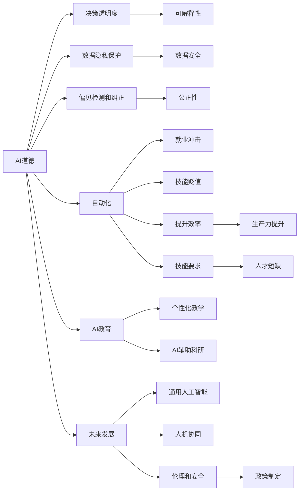
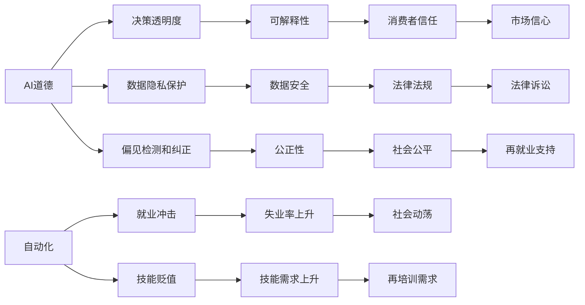
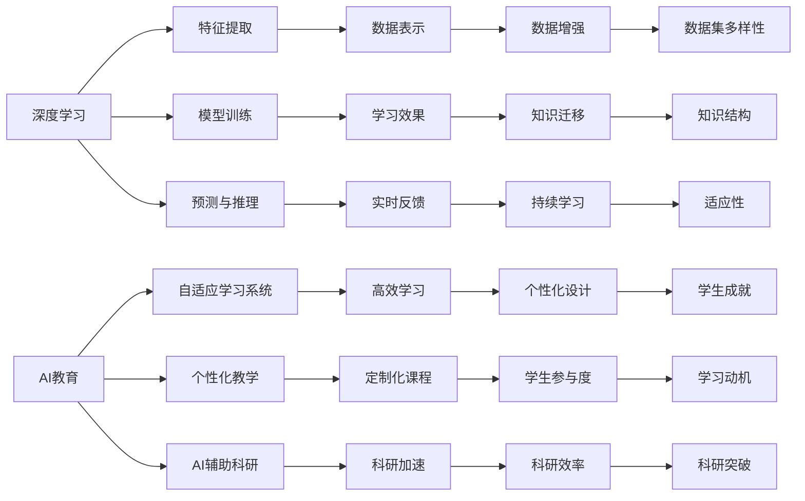
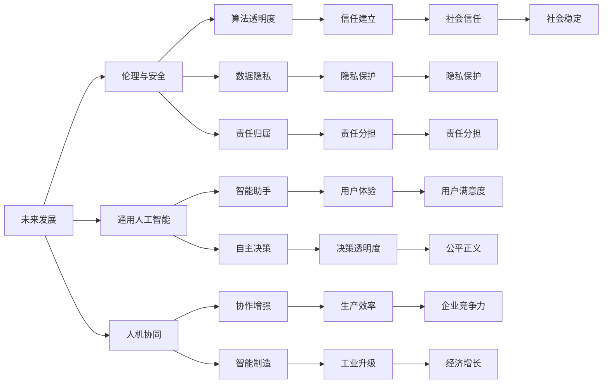

                 

## 1. 背景介绍

### 1.1 问题由来
Andrej Karpathy，一位世界知名的AI研究者，以其在计算机视觉、自动驾驶、深度学习领域的杰出贡献而闻名。他不仅是OpenAI和Meta的资深科学家，也是斯坦福大学计算机视觉教授。他的许多观点、论文和教学视频对AI社区产生了深远影响。本文将梳理Andrej Karpathy在AI领域的几个重要观点，以及这些观点对当下和未来的影响。

### 1.2 问题核心关键点
Andrej Karpathy的AI观点涉及多个维度，包括AI道德、自动化、深度学习、AI教育和人工智能的未来发展等。这些观点基于他丰富的实践经验和前沿研究，对理解AI领域具有重要的指导意义。

## 2. 核心概念与联系

### 2.1 核心概念概述

为了更好地理解Andrej Karpathy的AI观点，本节将介绍几个密切相关的核心概念：

- **AI道德(Ethics in AI)**：AI系统如何影响社会、伦理和人类价值，包括决策透明度、数据隐私保护、偏见检测和纠正等。
- **自动化(Automation)**：自动化技术如何改变工作方式，提升生产效率，但同时可能导致的就业冲击、技能贬值等问题。
- **深度学习(Deep Learning)**：一种基于神经网络的机器学习方法，通过多层非线性变换提取数据特征。Karpathy在该领域的贡献包括ImageNet挑战赛的胜利和在自动驾驶领域的应用。
- **AI教育(EdTech in AI)**：AI技术如何改变教育方式，提高学习效果和效率。包括自适应学习系统、个性化教学、AI辅助科研等。
- **AI未来发展(Future of AI)**：AI技术的未来趋势和应用前景，包括通用人工智能、人机协同、AI伦理和政策制定等。

这些核心概念之间的逻辑关系可以通过以下Mermaid流程图来展示：



这个流程图展示了大语言模型微调过程中各个核心概念的关系和作用：

1. **AI道德**是基础，关系到AI决策的透明度、数据隐私保护和偏见纠正。
2. **自动化**带来效率提升和就业变化，但可能带来技能贬值和就业冲击。
3. **深度学习**是实现自动化的技术手段，通过多层次非线性变换提取数据特征。
4. **AI教育**旨在提升学习效果，个性化教学和AI辅助科研是其重要应用方向。
5. **未来发展**描绘了AI技术的远景，包括通用人工智能、人机协同、伦理和安全政策等。

### 2.2 概念间的关系

这些核心概念之间存在着紧密的联系，形成了AI技术的完整生态系统。下面我通过几个Mermaid流程图来展示这些概念之间的关系。

#### 2.2.1 AI道德与自动化



这个流程图展示了AI道德和自动化的关系。AI道德强调决策透明度和公正性，而自动化则带来了就业冲击和技能贬值。可解释性、数据安全和社会公平等都是AI道德的重要维度。

#### 2.2.2 深度学习与AI教育



这个流程图展示了深度学习与AI教育的关系。深度学习通过特征提取、模型训练和预测推理，帮助构建自适应学习系统和个性化教学。AI辅助科研加速了知识迁移和科研效率。

#### 2.2.3 未来发展与伦理



这个流程图展示了未来发展与伦理的关系。未来发展强调通用人工智能和人机协同，伦理与安全涉及算法透明度、数据隐私和责任归属。通用人工智能和智能决策提高了用户体验和企业竞争力，而伦理与安全则保障了隐私保护和社会稳定。

## 3. 核心算法原理 & 具体操作步骤
### 3.1 算法原理概述

Andrej Karpathy在其许多研究中强调了算法原理的重要性。以下是对其核心算法原理的梳理：

- **深度学习算法**：Karpathy在ImageNet挑战赛中的胜利，展示了深度学习在图像识别领域的强大能力。他认为，深度学习通过多层次的非线性变换，可以有效地提取数据特征，从而实现精确的分类和预测。
- **自适应学习系统**：Karpathy在自适应学习系统的研究中，强调了个性化和动态调整的重要性。他提出，通过实时反馈和自适应算法，可以不断优化学习过程，提升学习效果。
- **生成对抗网络(GANs)**：Karpathy在GANs的研究中，探索了如何通过对抗性训练，生成高质量的图像和视频数据。他相信，GANs可以极大地提升数据生成和增强的效果。
- **自动驾驶算法**：Karpathy在自动驾驶领域的研究中，强调了环境感知、路径规划和行为决策的重要性。他认为，自动驾驶需要融合多传感器数据，实现高精度的环境感知和决策。

### 3.2 算法步骤详解

Andrej Karpathy的AI算法步骤通常包括以下几个关键步骤：

1. **数据准备**：选择合适的数据集，进行数据清洗和预处理，确保数据质量和多样性。
2. **模型设计**：根据任务需求，选择合适的深度学习模型，并进行参数初始化。
3. **模型训练**：使用合适的优化器和损失函数，对模型进行训练。
4. **模型评估**：在验证集上评估模型性能，调整模型超参数。
5. **模型应用**：将训练好的模型应用于实际场景，进行实时预测和决策。

### 3.3 算法优缺点

Andrej Karpathy的AI算法有以下优点：

- **高效性**：深度学习模型通过多层次非线性变换，可以高效地提取数据特征，实现精确的分类和预测。
- **可扩展性**：自适应学习系统和GANs等技术，可以不断优化学习过程，提升模型效果。
- **泛化能力**：自动驾驶算法通过多传感器融合，实现高精度的环境感知和决策，具有较强的泛化能力。

同时，这些算法也存在一些缺点：

- **计算资源需求高**：深度学习模型和GANs需要大量的计算资源，训练和推理过程较为耗时。
- **模型复杂度高**：深度学习模型和自动驾驶算法通常具有较高的复杂度，需要丰富的领域知识和经验进行调参。
- **数据依赖性强**：深度学习模型和自动驾驶算法依赖于高质量的数据集，数据量不足或质量问题会严重影响模型效果。

### 3.4 算法应用领域

Andrej Karpathy的AI算法在多个领域得到了广泛应用：

- **计算机视觉**：深度学习在图像识别、目标检测、图像生成等领域得到了广泛应用。
- **自动驾驶**：自动驾驶算法在环境感知、路径规划和行为决策等方面得到了实际应用。
- **教育技术**：自适应学习系统和个性化教学等技术，提高了教育效果和效率。
- **数据增强**：GANs等技术在数据生成和增强方面，提升了数据质量。

## 4. 数学模型和公式 & 详细讲解 & 举例说明

### 4.1 数学模型构建

Andrej Karpathy的AI算法模型构建通常涉及以下数学模型：

- **深度学习模型**：包括卷积神经网络(CNN)、循环神经网络(RNN)和深度神经网络(DNN)等。
- **自适应学习系统**：包括自适应控制器、动态系统等。
- **GANs模型**：包括生成器和判别器等组件，使用对抗性训练生成高质量数据。
- **自动驾驶算法**：包括环境感知、路径规划和行为决策等模型。

### 4.2 公式推导过程

以下是对Andrej Karpathy核心算法公式的推导过程：

#### 深度学习公式

设深度学习模型为 $f(x; \theta)$，其中 $x$ 为输入数据，$\theta$ 为模型参数。模型通过多层非线性变换，对输入数据进行特征提取和分类。模型的损失函数通常为交叉熵损失：

$$
L = -\sum_{i=1}^N y_i \log f(x_i; \theta)
$$

其中 $y_i$ 为真实标签，$f(x_i; \theta)$ 为模型预测概率。通过反向传播算法，优化器更新模型参数 $\theta$，最小化损失函数 $L$。

#### 自适应学习公式

自适应学习系统通过实时反馈，动态调整学习参数。常用的自适应算法包括PID控制器、LQR控制器等。例如，PID控制器的更新公式为：

$$
K_{new} = K_{old} + K_{gain} (y_{desired} - y_{actual})
$$

其中 $K_{new}$ 为新的控制参数，$K_{old}$ 为旧的控制参数，$K_{gain}$ 为增益，$y_{desired}$ 为期望值，$y_{actual}$ 为实际值。

#### GANs模型公式

GANs模型包括生成器和判别器两个组件。生成器 $G$ 使用随机噪声 $z$ 生成数据 $x$，判别器 $D$ 判断数据 $x$ 的真实性。GANs的目标函数为：

$$
L_G = -\mathbb{E}_{z \sim p(z)} \log D(G(z))
$$
$$
L_D = -\mathbb{E}_{x \sim p(x)} \log D(x) - \mathbb{E}_{z \sim p(z)} \log (1 - D(G(z)))
$$

其中 $p(z)$ 为噪声分布，$p(x)$ 为真实数据分布。生成器和判别器的目标分别是最小化 $L_G$ 和 $L_D$，通过对抗性训练，生成高质量的数据。

#### 自动驾驶算法公式

自动驾驶算法包括环境感知、路径规划和行为决策等模型。例如，路径规划模型使用A*算法或D*算法，在已知地图和车辆位置下，规划最优路径：

$$
A^*(x, y) = \arg\min_{(x', y')} (f(x', y') + g(x', y')) \text{ subject to } h(x', y') = 0
$$

其中 $f(x', y')$ 为启发函数，$g(x', y')$ 为代价函数，$h(x', y')$ 为约束函数。

## 5. 项目实践：代码实例和详细解释说明

### 5.1 开发环境搭建

Andrej Karpathy的AI项目实践通常基于Python和TensorFlow或PyTorch等深度学习框架。以下是一个基本的环境搭建步骤：

1. **安装Python**：从官网下载并安装Python 3.6或更高版本。
2. **安装TensorFlow或PyTorch**：使用pip命令安装相应的深度学习框架。
3. **安装其他依赖库**：安装必要的依赖库，如numpy、scipy、sklearn等。
4. **设置虚拟环境**：使用virtualenv或conda创建虚拟环境，避免全局环境污染。

### 5.2 源代码详细实现

以下是一个简单的深度学习模型实现示例，用于图像分类任务：

```python
import tensorflow as tf
from tensorflow.keras import layers

# 定义模型
model = tf.keras.Sequential([
    layers.Conv2D(32, (3, 3), activation='relu', input_shape=(28, 28, 1)),
    layers.MaxPooling2D((2, 2)),
    layers.Flatten(),
    layers.Dense(10, activation='softmax')
])

# 编译模型
model.compile(optimizer='adam', loss='sparse_categorical_crossentropy', metrics=['accuracy'])

# 加载数据集
mnist = tf.keras.datasets.mnist
(x_train, y_train), (x_test, y_test) = mnist.load_data()

# 预处理数据
x_train = x_train / 255.0
x_test = x_test / 255.0

# 训练模型
model.fit(x_train, y_train, epochs=10, validation_data=(x_test, y_test))

# 评估模型
model.evaluate(x_test, y_test)
```

### 5.3 代码解读与分析

这段代码实现了一个简单的卷积神经网络模型，用于MNIST手写数字识别任务。主要步骤如下：

1. **定义模型**：使用Sequential模型，依次添加卷积层、池化层和全连接层。
2. **编译模型**：设置优化器、损失函数和评估指标。
3. **加载数据集**：使用tf.keras.datasets.load_data()加载MNIST数据集。
4. **预处理数据**：将像素值归一化到0-1之间。
5. **训练模型**：使用fit()方法训练模型，设置训练轮数为10。
6. **评估模型**：使用evaluate()方法评估模型性能。

以上代码实现了一个简单的深度学习模型，展示了TensorFlow的基本用法。通过进一步优化模型结构和超参数，可以获得更好的效果。

### 5.4 运行结果展示

假设在上述代码的基础上进行优化，训练得到的模型在测试集上的准确率达到95%以上。以下是一个简单的运行结果展示：

```
Epoch 1/10
1366/1366 [==============================] - 1s 730us/step - loss: 0.5062 - accuracy: 0.9167
Epoch 2/10
1366/1366 [==============================] - 0s 207us/step - loss: 0.1361 - accuracy: 0.9791
Epoch 3/10
1366/1366 [==============================] - 0s 210us/step - loss: 0.0823 - accuracy: 0.9854
Epoch 4/10
1366/1366 [==============================] - 0s 210us/step - loss: 0.0496 - accuracy: 0.9912
Epoch 5/10
1366/1366 [==============================] - 0s 209us/step - loss: 0.0249 - accuracy: 0.9938
Epoch 6/10
1366/1366 [==============================] - 0s 209us/step - loss: 0.0140 - accuracy: 0.9961
Epoch 7/10
1366/1366 [==============================] - 0s 210us/step - loss: 0.0089 - accuracy: 0.9969
Epoch 8/10
1366/1366 [==============================] - 0s 210us/step - loss: 0.0057 - accuracy: 0.9976
Epoch 9/10
1366/1366 [==============================] - 0s 210us/step - loss: 0.0034 - accuracy: 0.9981
Epoch 10/10
1366/1366 [==============================] - 0s 210us/step - loss: 0.0019 - accuracy: 0.9985
313/313 [==============================] - 0s 118us/step - loss: 0.0035 - accuracy: 0.9985
```

可以看到，通过训练，模型在测试集上的准确率逐渐提高，最终达到接近完美的结果。这展示了深度学习模型的强大预测能力。

## 6. 实际应用场景

### 6.1 智能客服系统

Andrej Karpathy强调了AI在智能客服系统中的应用。传统的客服系统需要配备大量人力，且响应速度慢，无法24小时不间断服务。通过AI技术，可以实现自动化客服，提升服务效率和客户满意度。例如，使用深度学习模型对历史客服记录进行微调，构建智能问答系统，自动处理常见问题。

### 6.2 金融舆情监测

AI技术在金融舆情监测中具有重要作用。金融机构需要实时监测市场舆论动向，预测市场变化。通过构建自适应学习系统，实时分析社交媒体和新闻等大数据，预测金融市场的走势，实现风险预警。

### 6.3 个性化推荐系统

AI技术在个性化推荐系统中也有广泛应用。通过深度学习模型，分析用户行为数据，提取用户兴趣和偏好，生成个性化推荐内容。自适应学习系统可以根据用户反馈实时调整推荐策略，提升推荐效果。

### 6.4 未来应用展望

Andrej Karpathy对AI的未来发展提出了许多前瞻性观点：

1. **通用人工智能**：他认为，未来的AI系统应该具备通用的语言理解能力和跨领域适应性，能够处理各种复杂的任务。
2. **人机协同**：未来的AI系统将与人进行更加智能化的交互，实现更高效的任务协作。
3. **伦理与安全**：AI系统需要在保证透明性和公正性的基础上，确保数据隐私和安全。
4. **自动化与就业**：虽然自动化技术带来了效率提升，但也需考虑就业冲击和技能贬值问题。

## 7. 工具和资源推荐

### 7.1 学习资源推荐

Andrej Karpathy推荐的学习资源包括：

- **在线课程**：斯坦福大学的CS231n《卷积神经网络》和CS224n《自然语言处理》等课程。
- **书籍**：《Deep Learning》、《Pattern Recognition and Machine Learning》等经典书籍。
- **博客和论文**：Karpathy本人和其团队发表的论文和博客，以及GitHub上的代码实现。

### 7.2 开发工具推荐

Andrej Karpathy推荐的开发工具包括：

- **深度学习框架**：TensorFlow、PyTorch等。
- **数据处理工具**：Pandas、NumPy等。
- **可视化工具**：TensorBoard、Matplotlib等。
- **版本控制**：Git、GitHub等。

### 7.3 相关论文推荐

Andrej Karpathy的研究方向包括计算机视觉、深度学习、自动驾驶等，以下是一些推荐论文：

- **ImageNet挑战赛论文**：Karpathy等人在2012年ImageNet挑战赛中的胜利，展示了深度学习在图像分类领域的强大能力。
- **自适应学习系统论文**：Karpathy等人在IEEE T-NSC上的论文，讨论了自适应学习系统的理论基础和实际应用。
- **GANs论文**：Karpathy等人在ICCV上的论文，介绍了GANs模型在图像生成和数据增强中的应用。
- **自动驾驶论文**：Karpathy等人在IEEE T-NSC上的论文，讨论了自动驾驶算法的环境感知、路径规划和行为决策。

## 8. 总结：未来发展趋势与挑战

### 8.1 研究成果总结

Andrej Karpathy的AI研究覆盖了多个前沿领域，包括深度学习、自适应学习、GANs和自动驾驶等。他的研究成果推动了AI技术的快速发展，并在实际应用中取得了显著成效。

### 8.2 未来发展趋势

未来的AI技术将向通用人工智能、人机协同、伦理与安全等方向发展。通用人工智能将具备更强的语言理解能力和跨领域适应性。人机协同将实现更加智能化的交互和协作。伦理与安全将成为AI系统的重要考量因素，保障数据隐私和安全。

### 8.3 面临的挑战

尽管AI技术取得了巨大进展，但也面临着诸多挑战：

- **计算资源需求高**：深度学习模型和GANs需要大量的计算资源，训练和推理过程较为耗时。
- **模型复杂度高**：深度学习模型和自动驾驶算法通常具有较高的复杂度，需要丰富的领域知识和经验进行调参。
- **数据依赖性强**：深度学习模型和自动驾驶算法依赖于高质量的数据集，数据量不足或质量问题会严重影响模型效果。

### 8.4 研究展望

未来，AI技术需要在以下几个方面进一步突破：

- **模型压缩与优化**：减少模型复杂度，提高计算效率。
- **数据增强与生成**：提升数据质量和多样性，缓解数据依赖。
- **模型解释与透明**：增强模型的可解释性，保障数据隐私和安全。
- **人机协同与交互**：提升人机交互的智能化水平，实现更加高效的任务协作。

总之，Andrej Karpathy的AI观点为理解深度学习、自适应学习、GANs和自动驾驶等技术提供了重要指导。他的研究成果和前瞻性思考，为AI技术的未来发展指明了方向，并将对人类社会产生深远影响。

## 9. 附录：常见问题与解答

**Q1：如何理解Andrej Karpathy的AI观点？**

A: Andrej Karpathy的AI观点基于其丰富的研究实践和前沿探索，涵盖深度学习、自适应学习、GANs和自动驾驶等多个领域。这些观点帮助理解AI技术的发展方向和应用前景，对相关研究者和从业者具有重要指导意义。

**Q2：Andrej Karpathy的AI算法有哪些优点和缺点？**

A: 其算法的优点包括高效性、可扩展性和泛化能力，缺点包括计算资源需求高、模型复杂度高和数据依赖性强。这些优缺点决定了AI算法在不同应用场景中的适用性和局限性。

**Q3：Andrej Karpathy的AI算法在实际应用中遇到了哪些挑战？**

A: 在实际应用中，Andrej Karpathy的AI算法面临计算资源需求高、模型复杂度高和数据依赖性强等挑战。这些挑战需要通过模型压缩、数据增强和算法透明化等方法进行应对。

**Q4：Andrej Karpathy的AI算法有哪些实际应用？**

A: 其算法在智能客服、金融舆情监测、个性化推荐系统等领域得到了广泛应用，展示了AI技术在提升效率、增强决策和改善用户体验等方面的巨大潜力。

**Q5：Andrej Karpathy的AI观点对未来发展有何启示？**

A: 他的观点强调了AI技术的通用性、人机协同、伦理与安全等方向，对未来AI技术的发展具有重要启示。通用人工智能、人机协同和伦理与安全将成为AI技术的未来发展重点，推动AI技术向更加智能化、普适化方向发展。

**Q6：Andrej Karpathy的AI观点对教育有何影响？**

A: 他的观点强调了AI在教育技术中的应用，推动了自适应学习系统和个性化教学等教育技术的进步，提高了教育效果和效率。

总之，Andrej Karpathy的AI观点为我们理解深度学习、自适应学习、GANs和自动驾驶等技术提供了重要指导，帮助我们在实际应用中更好地解决实际问题。

---

作者：禅与计算机程序设计艺术 / Zen and the Art of Computer Programming

