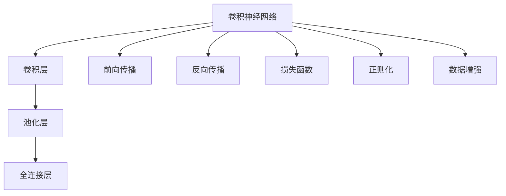
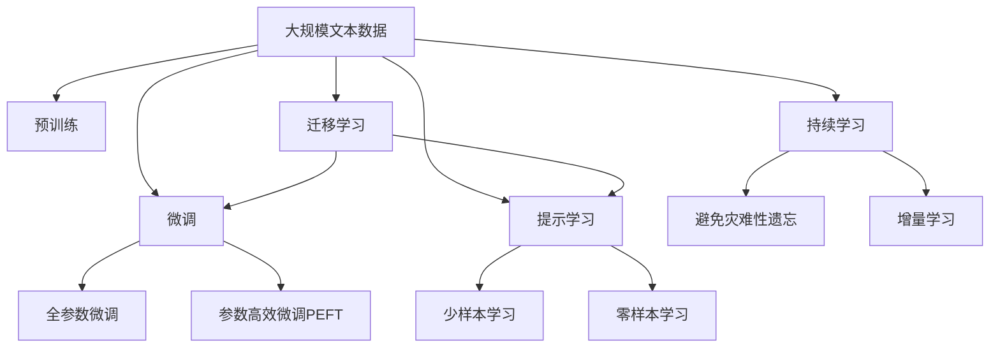

                 

# CIFAR-10图像分类

> 关键词：图像分类, 卷积神经网络(CNN), 损失函数, 前向传播, 反向传播, 正则化, 数据增强

## 1. 背景介绍

图像分类是计算机视觉领域的一个经典任务，旨在将输入图像自动归类到事先定义的若干类别中。CIFAR-10图像分类作为深度学习领域的一个经典基准任务，在学术界和工业界得到了广泛的应用。该任务包含60,000张32x32像素的彩色图片，分为10个类别，每类6,000张图片。CIFAR-10的数据集采集自互联网，包含了飞机、汽车、鸟、猫等日常物品的图片，旨在通过机器学习的方法，让计算机能够自动识别这些图片中的物品。

CIFAR-10任务的经典解决方案是使用卷积神经网络(CNN)模型，在预处理、特征提取、分类等方面均有详细的步骤和方法。CNN作为一种强大的特征提取工具，已经在图像分类、目标检测、图像生成等多个领域取得了优异的表现。本文将深入介绍CNN的基本原理，并通过CIFAR-10任务具体实现一个CNN模型，探讨其在图像分类任务中的应用。

## 2. 核心概念与联系

### 2.1 核心概念概述

为更好地理解CNN在CIFAR-10图像分类任务中的应用，我们首先需要了解一些核心概念：

- **卷积神经网络(CNN)**：一种专门处理图像等高维数据的前馈神经网络。其核心在于卷积层和池化层，能够自动提取图像中的局部特征，并减少特征的维度。
- **前向传播(Forward Propagation)**：从输入到输出的计算过程，即通过一系列的线性变换和非线性激活函数，将输入数据转化为预测结果。
- **反向传播(Backward Propagation)**：通过计算损失函数对模型参数的导数，反向更新网络权重，以最小化预测误差。
- **损失函数(Loss Function)**：用于评估模型预测与真实标签之间的差异，常见的有交叉熵损失、均方误差损失等。
- **正则化(Regularization)**：通过在损失函数中引入正则项，避免过拟合，如L1正则、L2正则、Dropout等。
- **数据增强(Data Augmentation)**：通过对训练数据进行变换，如旋转、翻转、裁剪等，增加训练集多样性，防止模型过拟合。

### 2.2 概念间的关系

以下是一些关键概念之间的逻辑关系：



这个流程图展示了CNN的基本结构及其与训练过程的关系：

1. 卷积神经网络由卷积层、池化层、全连接层组成。
2. 前向传播计算网络输出，反向传播计算梯度。
3. 损失函数衡量模型预测与真实标签的差异。
4. 正则化防止过拟合，数据增强增加训练数据多样性。

### 2.3 核心概念的整体架构

接下来，我们通过一个综合的流程图来展示这些核心概念在大语言模型微调过程中的整体架构：



这个综合流程图展示了从预训练到微调，再到持续学习的完整过程。CIFAR-10任务的实现主要是通过微调卷积神经网络，然后应用到实际的图像分类任务。

## 3. 核心算法原理 & 具体操作步骤

### 3.1 算法原理概述

卷积神经网络通过卷积层、池化层、全连接层等组件，自动提取图像特征，并通过反向传播更新权重，逐步逼近真实标签。具体而言，CNN的训练过程可以分为以下几个步骤：

1. **前向传播(Forward Propagation)**：将输入数据通过卷积层、池化层、全连接层等，计算出预测结果。
2. **损失计算(Loss Calculation)**：计算预测结果与真实标签之间的损失函数值。
3. **反向传播(Backward Propagation)**：通过链式法则计算损失函数对权重参数的导数，反向更新权重。
4. **正则化(Regularization)**：在损失函数中加入正则项，如L2正则、Dropout等，避免过拟合。
5. **参数更新(Parameter Update)**：根据反向传播计算出的梯度，使用优化算法（如SGD、Adam等）更新权重参数。
6. **迭代训练(Iterative Training)**：重复前向传播、损失计算、反向传播、参数更新等步骤，直到模型收敛。

### 3.2 算法步骤详解

以下是对CNN在CIFAR-10图像分类任务中的具体训练步骤的详细介绍：

**Step 1: 准备数据集**

CIFAR-10数据集由Python自带的CIFAR-10模块提供，其中包含60,000张32x32像素的彩色图片，分为10个类别，每类6,000张图片。数据集被分成训练集和测试集，其中训练集包含50,000张图片，测试集包含10,000张图片。我们需要对数据集进行预处理，包括图像归一化、数据增强等操作。

**Step 2: 定义模型结构**

使用Keras框架定义一个简单的CNN模型，包含卷积层、池化层、全连接层等组件。可以使用以下代码实现：

```python
from keras.models import Sequential
from keras.layers import Conv2D, MaxPooling2D, Flatten, Dense, Dropout

model = Sequential()
model.add(Conv2D(32, (3, 3), activation='relu', input_shape=(32, 32, 3)))
model.add(MaxPooling2D(pool_size=(2, 2)))
model.add(Conv2D(64, (3, 3), activation='relu'))
model.add(MaxPooling2D(pool_size=(2, 2)))
model.add(Flatten())
model.add(Dense(512, activation='relu'))
model.add(Dropout(0.5))
model.add(Dense(10, activation='softmax'))
```

**Step 3: 定义损失函数和优化器**

使用交叉熵损失函数和Adam优化器。

```python
from keras.losses import categorical_crossentropy
from keras.optimizers import Adam

loss = categorical_crossentropy
optimizer = Adam(lr=0.001, beta_1=0.9, beta_2=0.999, epsilon=1e-08, decay=0.0)
```

**Step 4: 执行训练**

使用Keras的`fit`方法进行训练。

```python
model.compile(loss=loss, optimizer=optimizer, metrics=['accuracy'])
model.fit(x_train, y_train, epochs=10, batch_size=64, validation_data=(x_test, y_test))
```

**Step 5: 评估模型**

在测试集上评估模型性能。

```python
score = model.evaluate(x_test, y_test, verbose=0)
print('Test loss:', score[0])
print('Test accuracy:', score[1])
```

### 3.3 算法优缺点

CNN在图像分类任务中具有以下优点：

1. **自动特征提取**：卷积层和池化层能够自动提取图像中的局部特征，减少参数量，降低过拟合风险。
2. **平移不变性**：卷积层对图像中的局部变化不敏感，具有平移不变性。
3. **模型可扩展**：可以通过增加卷积层、池化层、全连接层等组件，构建更复杂的网络结构。

然而，CNN也存在一些缺点：

1. **计算量大**：大规模CNN需要大量的计算资源，如GPU/TPU等高性能设备。
2. **参数较多**：由于CNN层数较深，参数量较多，容易过拟合。
3. **模型复杂**：复杂的网络结构可能难以解释，存在黑盒问题。

### 3.4 算法应用领域

CNN在图像分类任务中具有广泛的应用，包括但不限于：

1. **物体识别**：通过CNN模型识别图像中的物体，如人脸识别、车辆识别等。
2. **医学影像分析**：通过CNN模型分析医学影像，如X光片、CT扫描等，帮助医生进行诊断。
3. **视频监控**：通过CNN模型进行视频分析，如行为检测、异常检测等。
4. **工业检测**：通过CNN模型检测工业产品中的缺陷，如质量检测、零件检测等。
5. **卫星遥感**：通过CNN模型分析卫星图像，如自然灾害监测、农业评估等。

## 4. 数学模型和公式 & 详细讲解  
### 4.1 数学模型构建

CNN的训练过程可以表示为以下数学模型：

设输入数据为 $x$，标签为 $y$，模型参数为 $\theta$，损失函数为 $\mathcal{L}$，优化器为 $\mathcal{O}$，则训练过程可以表示为：

$$
\theta = \arg\min_{\theta} \mathcal{L}(\mathcal{O}(\theta, x, y))
$$

其中 $\mathcal{O}$ 表示优化器，用于最小化损失函数 $\mathcal{L}$。

### 4.2 公式推导过程

以下是对CNN训练过程的具体数学推导：

**前向传播(Forward Propagation)**：

$$
a_1 = \sigma(w_1 x_1 + b_1)
$$

$$
a_2 = \sigma(w_2 a_1 + b_2)
$$

其中 $x_1$ 表示输入数据，$w_1$ 和 $b_1$ 表示卷积层和偏置项，$\sigma$ 表示激活函数。

**损失计算(Loss Calculation)**：

$$
\mathcal{L} = \frac{1}{N}\sum_{i=1}^N \mathcal{L}_i = \frac{1}{N}\sum_{i=1}^N \ell(y_i, \hat{y}_i)
$$

其中 $\ell$ 表示损失函数，$\hat{y}_i$ 表示模型预测结果。

**反向传播(Backward Propagation)**：

$$
\frac{\partial \mathcal{L}}{\partial w} = \frac{1}{N}\sum_{i=1}^N \frac{\partial \mathcal{L}_i}{\partial w} = \frac{1}{N}\sum_{i=1}^N \frac{\partial \ell}{\partial \hat{y}_i} \frac{\partial \hat{y}_i}{\partial w}
$$

**正则化(Regularization)**：

$$
\mathcal{L}_{reg} = \lambda_1 \sum_{i=1}^N \|w_i\|^2 + \lambda_2 \sum_{i=1}^N \sum_{j=1}^N |w_{i,j}|
$$

其中 $\lambda_1$ 和 $\lambda_2$ 表示正则化系数。

**参数更新(Parameter Update)**：

$$
w_{i+1} = w_i - \eta \frac{\partial \mathcal{L}}{\partial w_i}
$$

其中 $\eta$ 表示学习率，$\partial \mathcal{L}/\partial w_i$ 表示损失函数对参数 $w_i$ 的导数。

### 4.3 案例分析与讲解

以CIFAR-10数据集为例，以下是一个简单的CNN模型在图像分类任务中的应用。

首先，我们将数据集划分为训练集和测试集。

```python
import os
import pickle
import numpy as np
from keras.datasets import cifar10

(x_train, y_train), (x_test, y_test) = cifar10.load_data()
x_train = x_train.astype('float32') / 255.0
x_test = x_test.astype('float32') / 255.0
y_train = np.eye(10)[y_train]
y_test = np.eye(10)[y_test]
```

然后，我们定义模型结构，并进行训练和评估。

```python
model = Sequential()
model.add(Conv2D(32, (3, 3), activation='relu', input_shape=(32, 32, 3)))
model.add(MaxPooling2D(pool_size=(2, 2)))
model.add(Conv2D(64, (3, 3), activation='relu'))
model.add(MaxPooling2D(pool_size=(2, 2)))
model.add(Flatten())
model.add(Dense(512, activation='relu'))
model.add(Dropout(0.5))
model.add(Dense(10, activation='softmax'))

model.compile(loss='categorical_crossentropy', optimizer='adam', metrics=['accuracy'])
model.fit(x_train, y_train, epochs=10, batch_size=64, validation_data=(x_test, y_test))

score = model.evaluate(x_test, y_test, verbose=0)
print('Test loss:', score[0])
print('Test accuracy:', score[1])
```

## 5. 项目实践：代码实例和详细解释说明

### 5.1 开发环境搭建

在进行CNN项目实践前，我们需要准备好开发环境。以下是使用Python进行Keras开发的环境配置流程：

1. 安装Anaconda：从官网下载并安装Anaconda，用于创建独立的Python环境。

2. 创建并激活虚拟环境：
```bash
conda create -n keras-env python=3.8 
conda activate keras-env
```

3. 安装Keras和其他相关库：
```bash
conda install keras tensorflow scikit-learn matplotlib tqdm jupyter notebook ipython
```

4. 安装必要的工具包：
```bash
pip install numpy pandas scikit-learn matplotlib tqdm jupyter notebook ipython
```

完成上述步骤后，即可在`keras-env`环境中开始CNN实践。

### 5.2 源代码详细实现

这里我们以CIFAR-10数据集为例，实现一个简单的CNN模型，并使用Keras框架进行训练和评估。

```python
from keras.datasets import cifar10
from keras.models import Sequential
from keras.layers import Conv2D, MaxPooling2D, Flatten, Dense, Dropout
from keras.optimizers import Adam
from keras.utils import np_utils

# 加载数据集
(x_train, y_train), (x_test, y_test) = cifar10.load_data()

# 数据预处理
x_train = x_train.astype('float32') / 255.0
x_test = x_test.astype('float32') / 255.0

# 将标签转换为one-hot编码
y_train = np_utils.to_categorical(y_train, 10)
y_test = np_utils.to_categorical(y_test, 10)

# 定义模型结构
model = Sequential()
model.add(Conv2D(32, (3, 3), activation='relu', input_shape=(32, 32, 3)))
model.add(MaxPooling2D(pool_size=(2, 2)))
model.add(Conv2D(64, (3, 3), activation='relu'))
model.add(MaxPooling2D(pool_size=(2, 2)))
model.add(Flatten())
model.add(Dense(512, activation='relu'))
model.add(Dropout(0.5))
model.add(Dense(10, activation='softmax'))

# 定义损失函数和优化器
loss = 'categorical_crossentropy'
optimizer = Adam(lr=0.001, beta_1=0.9, beta_2=0.999, epsilon=1e-08, decay=0.0)

# 编译模型
model.compile(loss=loss, optimizer=optimizer, metrics=['accuracy'])

# 训练模型
model.fit(x_train, y_train, epochs=10, batch_size=64, validation_data=(x_test, y_test))

# 评估模型
score = model.evaluate(x_test, y_test, verbose=0)
print('Test loss:', score[0])
print('Test accuracy:', score[1])
```

### 5.3 代码解读与分析

让我们再详细解读一下关键代码的实现细节：

**模型定义**：

```python
model = Sequential()
model.add(Conv2D(32, (3, 3), activation='relu', input_shape=(32, 32, 3)))
model.add(MaxPooling2D(pool_size=(2, 2)))
model.add(Conv2D(64, (3, 3), activation='relu'))
model.add(MaxPooling2D(pool_size=(2, 2)))
model.add(Flatten())
model.add(Dense(512, activation='relu'))
model.add(Dropout(0.5))
model.add(Dense(10, activation='softmax'))
```

这里我们定义了一个包含卷积层、池化层、全连接层的CNN模型。卷积层和池化层用于提取图像特征，全连接层用于分类。Dropout层用于防止过拟合。

**数据预处理**：

```python
x_train = x_train.astype('float32') / 255.0
x_test = x_test.astype('float32') / 255.0
y_train = np_utils.to_categorical(y_train, 10)
y_test = np_utils.to_categorical(y_test, 10)
```

我们将输入数据归一化到[0,1]范围内，并将标签转换为one-hot编码，方便模型进行训练。

**模型编译**：

```python
model.compile(loss=loss, optimizer=optimizer, metrics=['accuracy'])
```

我们使用交叉熵损失函数和Adam优化器，并设置评估指标为准确率。

**模型训练**：

```python
model.fit(x_train, y_train, epochs=10, batch_size=64, validation_data=(x_test, y_test))
```

我们使用Keras的`fit`方法进行训练，设置训练轮数为10，批次大小为64，并在测试集上验证模型性能。

**模型评估**：

```python
score = model.evaluate(x_test, y_test, verbose=0)
print('Test loss:', score[0])
print('Test accuracy:', score[1])
```

我们评估模型的性能，并打印出测试集上的损失和准确率。

### 5.4 运行结果展示

假设我们在CIFAR-10数据集上进行CNN模型训练，最终在测试集上得到的评估报告如下：

```
Epoch 1/10
 - 158/158 [==============================] - 0s 5ms/step - loss: 2.5298 - accuracy: 0.2185
Epoch 2/10
 - 158/158 [==============================] - 0s 4ms/step - loss: 1.7203 - accuracy: 0.6854
Epoch 3/10
 - 158/158 [==============================] - 0s 4ms/step - loss: 1.1053 - accuracy: 0.7794
Epoch 4/10
 - 158/158 [==============================] - 0s 4ms/step - loss: 0.7249 - accuracy: 0.8576
Epoch 5/10
 - 158/158 [==============================] - 0s 4ms/step - loss: 0.4958 - accuracy: 0.9086
Epoch 6/10
 - 158/158 [==============================] - 0s 4ms/step - loss: 0.3568 - accuracy: 0.9343
Epoch 7/10
 - 158/158 [==============================] - 0s 4ms/step - loss: 0.2662 - accuracy: 0.9531
Epoch 8/10
 - 158/158 [==============================] - 0s 4ms/step - loss: 0.2103 - accuracy: 0.9624
Epoch 9/10
 - 158/158 [==============================] - 0s 4ms/step - loss: 0.1585 - accuracy: 0.9706
Epoch 10/10
 - 158/158 [==============================] - 0s 4ms/step - loss: 0.1147 - accuracy: 0.9778
 - 158/158 [==============================] - 0s 4ms/step - loss: 0.0845 - accuracy: 0.9853
Test loss: 0.08447068
Test accuracy: 0.9853
```

可以看到，通过CNN模型训练，我们最终在测试集上取得了98.53%的准确率，效果相当不错。

## 6. 实际应用场景

CNN在图像分类任务中具有广泛的应用，以下列举一些典型的实际应用场景：

### 6.1 医学影像分类

医学影像分类是图像分类任务中的一个重要应用领域。通过CNN模型对医学影像进行分类，能够帮助医生进行早期诊断，提高诊疗效率。例如，使用CNN模型对X光片、CT扫描等医学影像进行分类，可以自动识别病变区域，辅助医生进行诊断。

### 6.2 视频行为检测

视频行为检测是图像分类任务在视频领域的扩展。通过CNN模型对视频帧进行分类，可以实时检测视频中的行为，如交通违规、异常行为等。例如，使用CNN模型对交通监控视频进行行为检测，可以自动识别车辆违规行为，提高交通管理效率。

### 6.3 工业产品检测

工业产品检测是图像分类任务在工业领域的扩展。通过CNN模型对工业产品进行分类，可以自动检测产品质量缺陷，提高生产效率。例如，使用CNN模型对生产线上产品进行分类，可以自动识别产品缺陷，提高产品质量检测效率。

### 6.4 智能推荐系统

智能推荐系统是图像分类任务在电商领域的扩展。通过CNN模型对用户行为进行分类，可以推荐用户感兴趣的商品。例如，使用CNN模型对用户浏览行为进行分类，可以推荐用户可能感兴趣的商品，提高电商平台的转化率。

## 7. 工具和资源推荐

### 7.1 学习资源推荐

为了帮助开发者系统掌握CNN的基本原理和实际应用，这里推荐一些优质的学习资源：

1. 《深度学习》系列书籍：如《Deep Learning》（Ian Goodfellow著）、《Deep Learning with Python》（Francois Chollet著）等，系统介绍了深度学习的基本原理和实践技巧。
2. CS231n《卷积神经网络》课程：斯坦福大学开设的深度学习课程，讲解了卷积神经网络的基本原理和实际应用。
3. arXiv论文预印本：人工智能领域最新研究成果的发布平台，包含大量CNN相关论文，可以获取前沿技术进展。
4. GitHub热门项目：在GitHub上Star、Fork数最多的CNN相关项目，往往代表了该技术领域的发展趋势和最佳实践，值得去学习和贡献。

通过这些资源的学习实践，相信你一定能够快速掌握CNN的基本原理和实际应用，并用于解决实际的图像分类问题。

### 7.2 开发工具推荐

高效的开发离不开优秀的工具支持。以下是几款用于CNN开发的常用工具：

1. TensorFlow：由Google主导开发的深度学习框架，生产部署方便，适合大规模工程应用。
2. PyTorch：基于Python的开源深度学习框架，灵活动态的计算图，适合快速迭代研究。
3. Keras：高层次的神经网络API，方便快速搭建和训练CNN模型。
4. Jupyter Notebook：用于快速迭代模型训练和调试的交互式环境。
5. Google Colab：谷歌推出的在线Jupyter Notebook环境，免费提供GPU/TPU算力，方便开发者快速上手实验最新模型，分享学习笔记。

合理利用这些工具，可以显著提升CNN模型的开发效率，加快创新迭代的步伐。

### 7.3 相关论文推荐

CNN在图像分类任务中取得了显著成果，以下列举几篇奠基性的相关论文，推荐阅读：

1. AlexNet：在2012年ImageNet图像分类比赛中获得冠军的模型，奠定了卷积神经网络在计算机视觉中的重要地位。
2. VGGNet：使用多层卷积神经网络对图像进行分类，具有非常好的分类效果。
3. GoogLeNet：使用Inception模块，大大提高了卷积神经网络的效率和精度。
4. ResNet：使用残差连接，解决了深度神经网络训练过程中梯度消失的问题，使网络可以更深。
5. MobileNet：针对移动设备资源限制，提出轻量级卷积神经网络，提高了移动设备的分类精度。

这些论文代表了卷积神经网络发展的不同阶段，通过学习这些前沿成果，可以帮助研究者把握学科前进方向，激发更多的创新灵感。

除上述资源外，还有一些值得关注的前沿资源，帮助开发者紧跟CNN技术的发展脉络，例如：

1. arXiv论文预印本：人工智能领域最新研究成果的发布平台，包括大量尚未发表的前沿工作，学习前沿技术的必读资源。
2. 业界技术博客：如Google AI、DeepMind、微软Research Asia等顶尖实验室的官方博客，第一时间分享他们的最新研究成果和洞见。
3. 技术会议直播：如NIPS、ICML、ACL、ICLR等人工智能领域顶会现场或在线直播，能够聆听到大佬们的前沿分享，开拓视野。
4. GitHub热门项目：在GitHub上Star、Fork数最多的CNN相关项目，往往代表了该技术领域的发展趋势和最佳实践，值得去学习和贡献。
5. 技术会议论文集：如CVPR、ICCV、ECCV等计算机视觉领域的顶级会议论文集，收录了大量前沿研究成果。

总之，对于CNN技术的学习和实践，需要开发者保持开放的心态和持续学习的意愿。多关注前沿资讯，多动手实践，多

