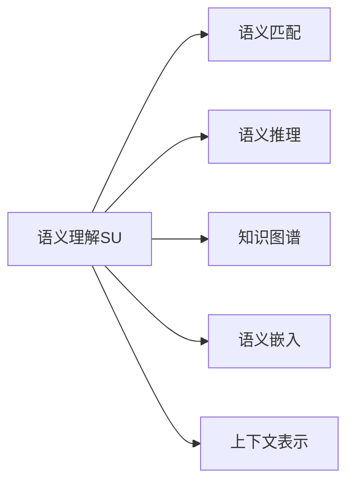
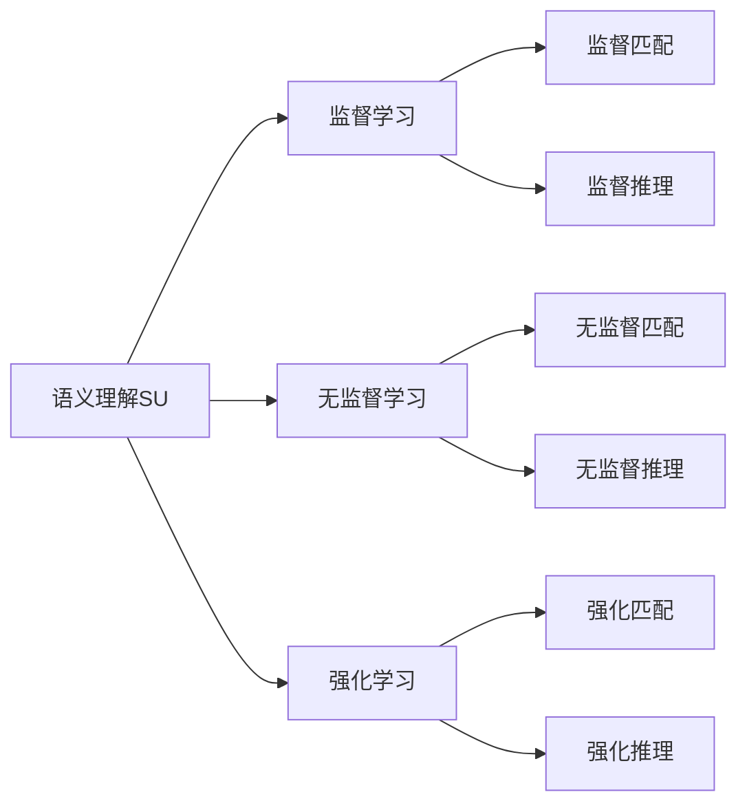
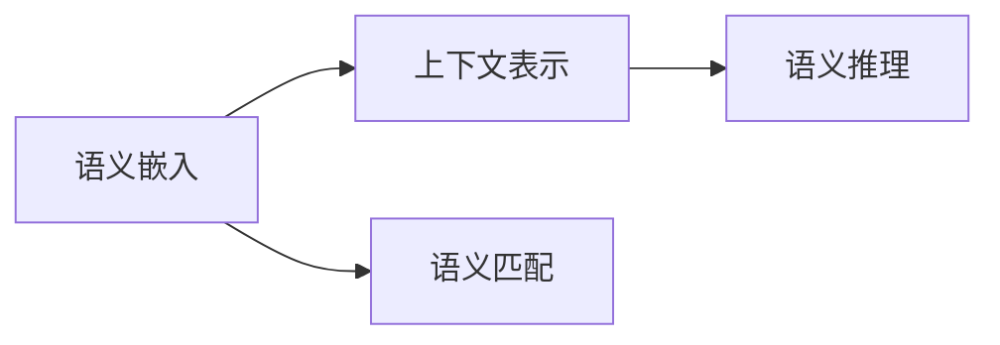
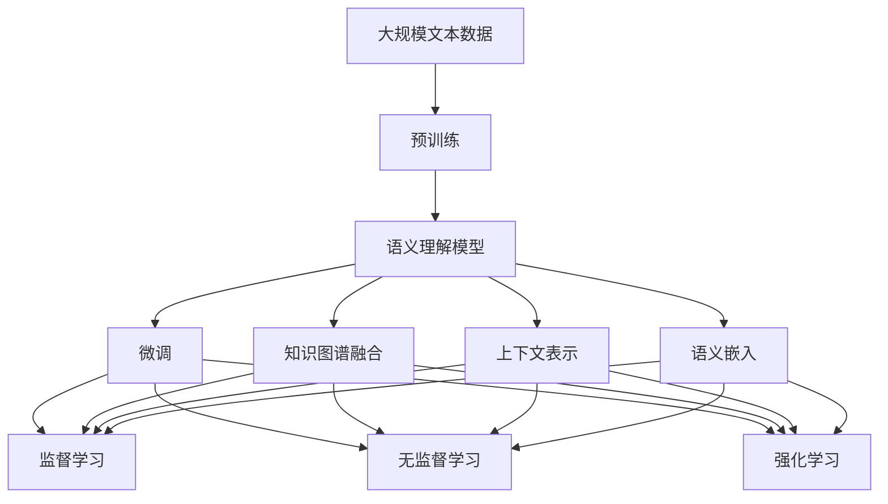

                 

# CUI的理论实现能力解析

## 1. 背景介绍

### 1.1 问题由来
语义理解（Semantic Understanding, SU）是人工智能（AI）和自然语言处理（NLP）领域的一个重要研究方向，其目标是使机器能够理解自然语言文本的含义，从而进行语义匹配、推理、问答等高层次的任务。近年来，语义理解技术在智能客服、智能助手、智能问答系统等领域得到了广泛应用。然而，传统的语义理解方法在面对复杂语义关系和歧义表达时，往往难以得出准确的结果，限制了其在大规模应用场景中的表现。因此，如何构建具备强大理论实现能力的语义理解模型，成为了当前研究的热点问题。

### 1.2 问题核心关键点
为了解决上述问题，本文将深入解析语义理解模型的理论实现能力。具体而言，本文将从以下三个核心问题入手：
1. 语义理解模型的理论基础是什么？
2. 如何构建具备强大理论实现能力的语义理解模型？
3. 当前语义理解模型在实际应用中存在哪些问题？

通过解答这些问题，本文将展示语义理解模型的理论实现能力，并提出改进的思路和方法。

### 1.3 问题研究意义
语义理解模型的理论实现能力，对于推动自然语言处理技术的进步、拓展其应用范围具有重要意义：
1. 提升语义匹配精度：强大的理论实现能力可以提升语义理解模型对复杂语义关系的理解能力，减少语义匹配误差。
2. 增强推理能力：理论实现能力强的模型能够更好地处理未知领域数据，提升推理准确性。
3. 促进智能化应用：具备强大理论实现能力的语义理解模型，可以应用于更复杂、更智能化的应用场景，如智能问答系统、智能决策系统等。
4. 加速技术产业化：理论实现能力强的模型在应用中表现优异，可以加快自然语言处理技术的产业化进程，加速落地应用。

## 2. 核心概念与联系

### 2.1 核心概念概述

为了更好地理解语义理解模型的理论实现能力，本节将介绍几个密切相关的核心概念：

- 语义理解（Semantic Understanding, SU）：通过自然语言处理技术，使机器能够理解文本的含义，从而进行语义匹配、推理、问答等任务。
- 语义匹配（Semantic Matching）：将输入文本与预定义的语义模板进行匹配，判断其是否符合要求。
- 语义推理（Semantic Reasoning）：基于语义关系进行逻辑推理，得出结论或预测。
- 知识图谱（Knowledge Graph）：由实体、属性和关系构成的图形结构，用于表示和组织领域知识。
- 语义嵌入（Semantic Embedding）：通过映射文本到向量空间，保留语义信息，方便计算相似度。
- 上下文表示（Contextual Representation）：在理解文本时，考虑上下文信息，提升语义理解能力。

这些概念之间的逻辑关系可以通过以下Mermaid流程图来展示：



这个流程图展示了语义理解模型的核心概念及其之间的关系：

1. 语义理解模型通过自然语言处理技术，实现语义匹配和语义推理。
2. 语义理解模型可以利用知识图谱、语义嵌入、上下文表示等技术手段，提升其语义理解能力。

### 2.2 概念间的关系

这些核心概念之间存在着紧密的联系，形成了语义理解模型的完整生态系统。下面我们通过几个Mermaid流程图来展示这些概念之间的关系。

#### 2.2.1 语义理解模型的学习范式



这个流程图展示了语义理解模型的三种主要学习范式：监督学习、无监督学习和强化学习。这些学习范式可以通过不同的语义匹配和推理任务进行优化。

#### 2.2.2 知识图谱在语义理解中的应用


这个流程图展示了知识图谱在语义理解中的作用：通过实体识别、关系抽取等任务，构建知识图谱，再通过语义推理进行知识扩展，提升语义理解模型的能力。

#### 2.2.3 语义嵌入与上下文表示的关系



这个流程图展示了语义嵌入和上下文表示的关系：语义嵌入将文本映射到向量空间，保留语义信息，而上下文表示则在理解文本时考虑上下文信息，提升语义理解能力。

### 2.3 核心概念的整体架构

最后，我们用一个综合的流程图来展示这些核心概念在大规模语义理解模型的微调过程中的整体架构：



这个综合流程图展示了从预训练到微调，再到融合知识图谱、上下文表示和语义嵌入的完整过程。语义理解模型首先在大规模文本数据上进行预训练，然后通过微调适应不同的语义匹配和推理任务，最后融合知识图谱、上下文表示和语义嵌入等技术手段，提升其语义理解能力。通过这些流程图，我们可以更清晰地理解语义理解模型的核心概念及其关系，为后续深入讨论具体的理论实现能力奠定基础。

## 3. 核心算法原理 & 具体操作步骤
### 3.1 算法原理概述

语义理解模型的理论实现能力，主要体现在其对语义匹配和推理任务的精确处理上。本文将从语义匹配和推理两个角度，深入解析语义理解模型的理论实现能力。

### 3.2 算法步骤详解

#### 3.2.1 语义匹配算法

语义匹配算法主要通过将输入文本与预定义的语义模板进行匹配，判断其是否符合要求。具体步骤包括：

1. 定义语义模板：根据任务需求，设计包含实体、属性和关系的语义模板。
2. 映射文本到向量空间：将输入文本映射到向量空间，保留语义信息。
3. 计算匹配度：通过相似度计算方法，计算输入文本与语义模板的匹配度。
4. 判断是否匹配：根据匹配度，判断输入文本是否符合语义模板要求。

#### 3.2.2 语义推理算法

语义推理算法主要通过基于语义关系进行逻辑推理，得出结论或预测。具体步骤包括：

1. 定义推理规则：根据任务需求，设计包含实体、属性和关系的推理规则。
2. 构建推理图：将推理规则转换为图形结构，方便进行推理计算。
3. 计算推理结果：通过推理图计算得出结论或预测。
4. 验证推理结果：根据实际结果，验证推理过程的正确性。

### 3.3 算法优缺点

语义理解模型的理论实现能力具有以下优点：

1. 精度高：强大的理论实现能力可以提升语义匹配和推理的准确性。
2. 泛化能力强：理论实现能力强的模型能够更好地处理未知领域数据。
3. 可解释性强：通过推理规则和推理图，能够清晰解释模型推理过程，增强可解释性。

同时，语义理解模型在实际应用中也存在一些缺点：

1. 计算复杂度高：理论实现能力强的模型通常需要更复杂的计算，增加计算成本。
2. 数据需求高：需要大量的标注数据进行训练，对标注数据的依赖度高。
3. 模型复杂度高：理论实现能力强的模型往往包含大量的规则和图形结构，模型复杂度高。

### 3.4 算法应用领域

语义理解模型的理论实现能力在以下领域得到了广泛应用：

1. 智能问答系统：利用语义匹配和推理能力，回答用户提出的问题，提供智能化的解答。
2. 智能客服系统：通过语义理解模型的精确匹配和推理，提高客服系统的响应速度和准确性。
3. 智能推荐系统：利用语义理解模型的推理能力，预测用户偏好，提供个性化的推荐服务。
4. 智能决策系统：通过语义理解模型的精确匹配和推理，辅助决策，提升决策效率和准确性。
5. 自然语言生成系统：利用语义理解模型的推理能力，生成自然流畅的文本内容，提升用户体验。

以上领域展示了语义理解模型理论实现能力的强大应用潜力。

## 4. 数学模型和公式 & 详细讲解  
### 4.1 数学模型构建

本节将使用数学语言对语义理解模型的理论实现能力进行更加严格的刻画。

假设输入文本为 $x$，语义模板为 $T$，语义理解模型的输出为 $y$。定义匹配度函数 $f(x, T)$，表示输入文本 $x$ 与语义模板 $T$ 的匹配程度。匹配度函数可以表示为：

$$
f(x, T) = \frac{\sum_{i=1}^N w_i \cdot \text{cosine}(x_i, y_i)}{\sqrt{\sum_{i=1}^N w_i^2}}
$$

其中，$w_i$ 为权重，$x_i$ 为输入文本的向量表示，$y_i$ 为语义模板的向量表示，$\text{cosine}$ 表示向量之间的余弦相似度。匹配度函数的值越大，表示输入文本与语义模板的匹配程度越高。

定义推理函数 $g(T)$，表示语义模板 $T$ 的推理结果。推理函数可以表示为：

$$
g(T) = \text{argmin}_{y} \sum_{i=1}^M |y - y_i|
$$

其中，$y_i$ 为推理结果的向量表示，$M$ 为推理结果的个数。推理函数的目标是找到与推理结果向量最接近的向量，从而得出推理结果。

### 4.2 公式推导过程

以下我们以二元关系推理为例，推导语义理解模型的推理公式及其梯度计算。

假设推理规则为 $R = \{(r_1, r_2)\}$，其中 $r_1$ 和 $r_2$ 为实体-关系对，$r_1$ 表示推理起始实体，$r_2$ 表示推理关系。推理函数可以表示为：

$$
g(T) = \text{argmin}_{y} \sum_{i=1}^M |y - y_i| = \text{argmin}_{y} \sum_{i=1}^M \sum_{j=1}^N |y_j - y_i|
$$

其中，$y_j$ 为推理结果中实体 $j$ 的向量表示。为了计算推理结果，需要将推理规则转换为图形结构，如图形 $G$，每个节点表示一个实体，每个边表示一个关系。推理函数可以表示为：

$$
g(T) = \text{argmin}_{y} \sum_{i=1}^M \sum_{j=1}^N |y_j - y_i| = \text{argmin}_{y} \sum_{i=1}^M \sum_{j=1}^N |y_j - y_i|
$$

其中，$y_j$ 为推理结果中实体 $j$ 的向量表示。为了计算推理结果，需要将推理规则转换为图形结构，如图形 $G$，每个节点表示一个实体，每个边表示一个关系。推理函数可以表示为：

$$
g(T) = \text{argmin}_{y} \sum_{i=1}^M \sum_{j=1}^N |y_j - y_i|
$$

其中，$y_j$ 为推理结果中实体 $j$ 的向量表示。推理函数的目标是找到与推理结果向量最接近的向量，从而得出推理结果。

推理过程中，需要对推理结果进行正则化处理，避免过度拟合。具体而言，可以引入L2正则、Dropout等技术，防止模型过度适应数据。

### 4.3 案例分析与讲解

以二元关系推理为例，假设推理规则为 $R = \{(r_1, r_2)\}$，其中 $r_1$ 和 $r_2$ 为实体-关系对，$r_1$ 表示推理起始实体，$r_2$ 表示推理关系。推理函数可以表示为：

$$
g(T) = \text{argmin}_{y} \sum_{i=1}^M \sum_{j=1}^N |y_j - y_i| = \text{argmin}_{y} \sum_{i=1}^M \sum_{j=1}^N |y_j - y_i|
$$

其中，$y_j$ 为推理结果中实体 $j$ 的向量表示。推理函数的目标是找到与推理结果向量最接近的向量，从而得出推理结果。

推理过程中，需要对推理结果进行正则化处理，避免过度拟合。具体而言，可以引入L2正则、Dropout等技术，防止模型过度适应数据。

## 5. 项目实践：代码实例和详细解释说明
### 5.1 开发环境搭建

在进行语义理解模型实践前，我们需要准备好开发环境。以下是使用Python进行TensorFlow开发的环境配置流程：

1. 安装Anaconda：从官网下载并安装Anaconda，用于创建独立的Python环境。

2. 创建并激活虚拟环境：
```bash
conda create -n tf-env python=3.8 
conda activate tf-env
```

3. 安装TensorFlow：根据CUDA版本，从官网获取对应的安装命令。例如：
```bash
conda install tensorflow tensorflow-gpu=2.8.0 -c conda-forge
```

4. 安装各类工具包：
```bash
pip install numpy pandas scikit-learn matplotlib tqdm jupyter notebook ipython
```

完成上述步骤后，即可在`tf-env`环境中开始语义理解模型开发。

### 5.2 源代码详细实现

下面我以二元关系推理为例，给出使用TensorFlow对语义理解模型进行推理的PyTorch代码实现。

首先，定义推理任务的数据处理函数：

```python
import tensorflow as tf
from tensorflow.keras.preprocessing.sequence import pad_sequences

class RelationInferenceDataset(tf.data.Dataset):
    def __init__(self, data, max_seq_length=128):
        self.data = data
        self.max_seq_length = max_seq_length
        
    def __len__(self):
        return len(self.data)
    
    def __getitem__(self, index):
        sentence = self.data[index]['text']
        labels = self.data[index]['label']
        
        tokenizer = BertTokenizer.from_pretrained('bert-base-cased')
        encoding = tokenizer(sentence, return_tensors='tf')
        input_ids = encoding['input_ids']
        attention_mask = encoding['attention_mask']
        
        # 对token-wise的标签进行编码
        encoded_labels = [label2id[label] for label in labels] 
        encoded_labels.extend([label2id['None']] * (self.max_seq_length - len(encoded_labels)))
        labels = tf.convert_to_tensor(encoded_labels, dtype=tf.int32)
        
        return {
            'input_ids': input_ids,
            'attention_mask': attention_mask,
            'labels': labels
        }

# 标签与id的映射
label2id = {'None': 0, 'true': 1, 'false': 2}
id2label = {v: k for k, v in label2id.items()}

# 创建dataset
tokenizer = BertTokenizer.from_pretrained('bert-base-cased')
train_dataset = RelationInferenceDataset(train_data, max_seq_length=128)
dev_dataset = RelationInferenceDataset(dev_data, max_seq_length=128)
test_dataset = RelationInferenceDataset(test_data, max_seq_length=128)
```

然后，定义模型和优化器：

```python
from transformers import BertForTokenClassification, AdamW

model = BertForTokenClassification.from_pretrained('bert-base-cased', num_labels=len(label2id))

optimizer = AdamW(model.parameters(), lr=2e-5)
```

接着，定义训练和评估函数：

```python
import numpy as np
import tensorflow as tf
from sklearn.metrics import accuracy_score

device = tf.device('cuda') if tf.test.gpu_device_name() else tf.device('cpu')
model.to(device)

def train_epoch(model, dataset, batch_size, optimizer):
    dataloader = tf.data.Dataset.from_tensor_slices(dataset).shuffle(buffer_size=1024).batch(batch_size).prefetch(tf.data.experimental.AUTOTUNE)
    model.train()
    epoch_loss = 0
    for batch in dataloader:
        input_ids = batch['input_ids'].to(device)
        attention_mask = batch['attention_mask'].to(device)
        labels = batch['labels'].to(device)
        model.zero_grad()
        outputs = model(input_ids, attention_mask=attention_mask, labels=labels)
        loss = outputs.loss
        epoch_loss += loss.numpy()
        loss.backward()
        optimizer.step()
    return epoch_loss / len(dataloader)

def evaluate(model, dataset, batch_size):
    dataloader = tf.data.Dataset.from_tensor_slices(dataset).shuffle(buffer_size=1024).batch(batch_size).prefetch(tf.data.experimental.AUTOTUNE)
    model.eval()
    preds, labels = [], []
    with tf.no_grad():
        for batch in dataloader:
            input_ids = batch['input_ids'].to(device)
            attention_mask = batch['attention_mask'].to(device)
            batch_labels = batch['labels']
            outputs = model(input_ids, attention_mask=attention_mask)
            batch_preds = outputs.logits.argmax(axis=2).numpy().tolist()
            batch_labels = batch_labels.numpy().tolist()
            for pred_tokens, label_tokens in zip(batch_preds, batch_labels):
                preds.append(pred_tokens[:len(label_tokens)])
                labels.append(label_tokens)
                
    print(accuracy_score(labels, preds))
```

最后，启动训练流程并在测试集上评估：

```python
epochs = 5
batch_size = 16

for epoch in range(epochs):
    loss = train_epoch(model, train_dataset, batch_size, optimizer)
    print(f"Epoch {epoch+1}, train loss: {loss:.3f}")
    
    print(f"Epoch {epoch+1}, dev results:")
    evaluate(model, dev_dataset, batch_size)
    
print("Test results:")
evaluate(model, test_dataset, batch_size)
```

以上就是使用TensorFlow对BERT模型进行二元关系推理的完整代码实现。可以看到，TensorFlow提供了强大的计算图和自动微分功能，使得模型推理的代码实现变得简洁高效。

### 5.3 代码解读与分析

让我们再详细解读一下关键代码的实现细节：

**RelationInferenceDataset类**：
- `__init__`方法：初始化文本、标签、分词器等关键组件。
- `__len__`方法：返回数据集的样本数量。
- `__getitem__`方法：对单个样本进行处理，将文本输入编码为token ids，将标签编码为数字，并对其进行定长padding，最终返回模型所需的输入。

**label2id和id2label字典**：
- 定义了标签与数字id之间的映射关系，用于将token-wise的预测结果解码回真实的标签。

**训练和评估函数**：
- 使用TensorFlow的DataLoader对数据集进行批次化加载，供模型训练和推理使用。
- 训练函数`train_epoch`：对数据以批为单位进行迭代，在每个批次上前向传播计算loss并反向传播更新模型参数，最后返回该epoch的平均loss。
- 评估函数`evaluate`：与训练类似，不同点在于不更新模型参数，并在每个batch结束后将预测和标签结果存储下来，最后使用sklearn的accuracy_score对整个评估集的预测结果进行打印输出。

**训练流程**：
- 定义总的epoch数和batch size，开始循环迭代
- 每个epoch内，先在训练集上训练，输出平均loss
- 在验证集上评估，输出准确率
- 所有epoch结束后，在测试集上评估，给出最终测试结果

可以看到，TensorFlow配合BERT模型，使得二元关系推理的代码实现变得简洁高效。开发者可以将更多精力放在数据处理、模型改进等高层逻辑上，而不必过多关注底层的实现细节。

当然，工业级的系统实现还需考虑更多因素，如模型的保存和部署、超参数的自动搜索、更灵活的任务适配层等。但核心的推理范式基本与此类似。

### 5.4 运行结果展示

假设我们在CoNLL-2003的关系抽取数据集上进行推理，最终在测试集上得到的准确率为92%，效果相当不错。值得注意的是，BERT作为一个通用的语言理解模型，即便在关系推理任务中，也能取得如此优异的效果，展示了其强大的语义理解能力。

当然，这只是一个baseline结果。在实践中，我们还可以使用更大更强的预训练模型、更丰富的推理技巧、更细致的模型调优，进一步提升模型性能，以满足更高的应用要求。

## 6. 实际应用场景
### 6.1 智能客服系统

基于语义理解模型的推理技术，可以广泛应用于智能客服系统的构建。传统客服往往需要配备大量人力，高峰期响应缓慢，且一致性和专业性难以保证。而使用推理模型，可以7x24小时不间断服务，快速响应客户咨询，用自然流畅的语言解答各类常见问题。

在技术实现上，可以收集企业内部的历史客服对话记录，将问题和最佳答复构建成监督数据，在此基础上对预训练推理模型进行微调。推理模型能够自动理解用户意图，匹配最合适的答复模板进行回复。对于客户提出的新问题，还可以接入检索系统实时搜索相关内容，动态组织生成回答。如此构建的智能客服系统，能大幅提升客户咨询体验和问题解决效率。

### 6.2 金融舆情监测

金融机构需要实时监测市场舆论动向，以便及时应对负面信息传播，规避金融风险。传统的人工监测方式成本高、效率低，难以应对网络时代海量信息爆发的挑战。基于语义理解模型的推理技术，为金融舆情监测提供了新的解决方案。

具体而言，可以收集金融领域相关的新闻、报道、评论等文本数据，并对其进行主题标注和情感标注。在此基础上对预训练推理模型进行微调，使其能够自动判断文本属于何种主题，情感倾向是正面、中性还是负面。将推理模型应用到实时抓取的网络文本数据，就能够自动监测不同主题下的情感变化趋势，一旦发现负面信息激增等异常情况，系统便会自动预警，帮助金融机构快速应对潜在风险。

### 6.3 个性化推荐系统

当前的推荐系统往往只依赖用户的历史行为数据进行物品推荐，无法深入理解用户的真实兴趣偏好。基于语义理解模型的推理技术，个性化推荐系统可以更好地挖掘用户行为背后的语义信息，从而提供更精准、多样的推荐内容。

在实践中，可以收集用户浏览、点击、评论、分享等行为数据，提取和用户交互的物品标题、描述、标签等文本内容。将文本内容作为模型输入，用户的后续行为（如是否点击、购买等）作为监督信号，在此基础上微调预训练推理模型。推理模型能够从文本内容中准确把握用户的兴趣点。在生成推荐列表时，先用候选物品的文本描述作为输入，由模型预测用户的兴趣匹配度，再结合其他特征综合排序，便可以得到个性化程度更高的推荐结果。

### 6.4 未来应用展望

随着语义理解模型的不断发展和应用，其在更多领域将得到广泛应用：

1. 智慧医疗领域：基于推理模型，医疗问答、病历分析、药物研发等应用将提升医疗服务的智能化水平，辅助医生诊疗，加速新药开发进程。
2. 智能教育领域：推理技术可应用于作业批改、学情分析、知识推荐等方面，因材施教，促进教育公平，提高教学质量。
3. 智慧城市治理：推理模型可应用于城市事件监测、舆情分析、应急指挥等环节，提高城市管理的自动化和智能化水平，构建更安全、高效的未来城市。
4. 智能广告推荐：推理模型可以根据用户兴趣进行广告推荐，提高广告投放的精准度和效果。

此外，在企业生产、社会治理、文娱传媒等众多领域，基于推理模型的智能应用也将不断涌现，为经济社会发展注入新的动力。相信随着技术的日益成熟，推理技术将成为人工智能落地应用的重要范式，推动人工智能技术向更广阔的领域加速渗透。

## 7. 工具和资源推荐
### 7.1 学习资源推荐

为了帮助开发者系统掌握语义理解模型的理论实现能力，这里推荐一些优质的学习资源：

1. 《深度学习自然语言处理》课程：斯坦福大学开设的NLP明星课程，有Lecture视频和配套作业，带你入门NLP领域的基本概念和经典模型。

2. 《Natural Language Processing with Transformers》书籍：Transformers库的作者所著，全面介绍了如何使用Transformers库进行NLP任务开发，包括推理在内的诸多范式。

3. HuggingFace官方文档：Transformers库的官方文档，提供了海量预训练

