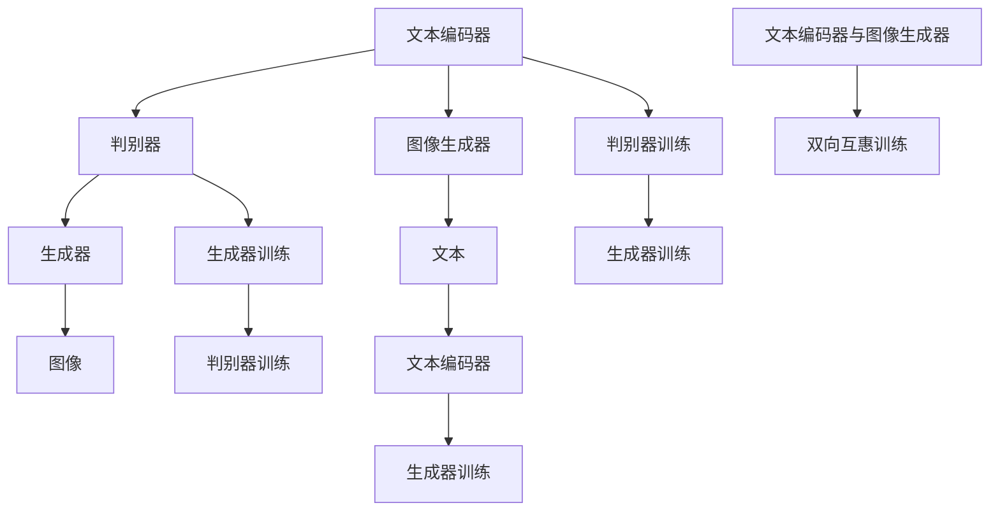

                 

# DALL-E 2原理与代码实例讲解

## 1. 背景介绍

DALL-E 2是OpenAI推出的一个基于文本生成图像的大模型，能够在给定自然语言描述的情况下生成高质量的图像。DALL-E 2的问世标志着在文本图像生成领域的一个重要突破，对艺术创作、游戏设计、内容创作等领域产生了深远影响。本文将详细介绍DALL-E 2的原理、实现方法以及具体的代码实例。

## 2. 核心概念与联系

### 2.1 核心概念概述

DALL-E 2利用自然语言生成图像的生成对抗网络（Generative Adversarial Network，GAN）架构，将文本和图像数据联合训练，使得模型能够根据文本描述生成具有高度真实性和多样性的图像。DALL-E 2的核心组件包括文本编码器、图像生成器、判别器等，其中文本编码器和图像生成器通过双向互惠训练，将文本语义信息转化为图像特征，判别器则用于评估生成图像的真实性，驱动生成器不断改进生成效果。

### 2.2 核心概念间的关系

DALL-E 2的实现框架主要包含以下几个关键步骤：

1. **数据预处理**：将原始的文本和图像数据进行预处理，如文本分词、图像标准化等。
2. **文本编码**：将文本转换为模型可以理解的形式，即文本特征向量。
3. **图像生成**：根据文本特征向量生成图像，即文本到图像的映射。
4. **判别器训练**：通过判别器对生成的图像进行真实性评估，指导生成器的改进。
5. **生成器训练**：根据判别器的反馈不断优化生成器，提升图像生成的质量。
6. **双向互惠训练**：文本编码器和图像生成器通过双向互惠训练，协同学习，提升整体的生成效果。

以下是一个简化的DALL-E 2架构图：



在这个架构中，文本编码器将文本转换为向量，生成器根据这些向量生成图像，判别器评估图像的真实性，生成器和判别器通过反向传播不断优化，最终实现文本到图像的生成。

## 3. 核心算法原理 & 具体操作步骤

### 3.1 算法原理概述

DALL-E 2基于自回归的生成模型，利用Transformer编码器-解码器结构，将文本描述转换为图像生成的条件概率分布。其核心算法包括文本编码、图像生成和判别器训练等步骤。

### 3.2 算法步骤详解

**Step 1: 数据准备**
- 收集文本描述和相应的图像数据。对于文本描述，进行分词处理，转换成模型可以理解的序列形式。
- 对图像数据进行预处理，如调整大小、标准化等，以便模型训练。

**Step 2: 构建模型**
- 定义文本编码器和图像生成器，一般使用Transformer模型。文本编码器将文本转换为向量表示，图像生成器则将向量转化为图像。
- 定义判别器，一般为全连接网络，用于评估图像的真实性。

**Step 3: 训练过程**
- 交替进行判别器训练和生成器训练。判别器训练的目标是最小化生成图像的真实性评分，而生成器训练的目标是最大化判别器无法区分生成图像和真实图像的评分。
- 在训练过程中，引入双向互惠训练，即通过生成器生成图像，由判别器评估真实性，再由判别器生成噪声图像，由生成器生成尽可能真实的图像，两者通过互惠训练不断优化。

**Step 4: 模型评估与优化**
- 在训练过程中，定期评估模型的性能，通过可视化生成的图像，评估模型的效果。
- 根据评估结果，调整模型参数和训练策略，如学习率、批量大小等。

### 3.3 算法优缺点

**优点**
- 强大的生成能力：DALL-E 2能够根据文本描述生成高质量的图像，覆盖面广，风格多样。
- 高灵活性：支持多种输入形式，包括文本、语音、视频等。
- 广泛应用场景：可用于艺术创作、游戏设计、内容创作等多个领域。

**缺点**
- 模型复杂度高：DALL-E 2包含大量的参数，训练成本高。
- 训练时间较长：模型训练需要大量的计算资源和时间。
- 生成的图像质量受限于输入文本的质量和多样性。

### 3.4 算法应用领域

DALL-E 2的应用领域非常广泛，以下是几个典型的应用场景：

- **艺术创作**：根据描述文字生成绘画作品，为艺术家提供新的创作灵感。
- **游戏设计**：生成游戏场景、角色等，丰富游戏内容。
- **内容创作**：生成图片作为文章的配图，丰富文章内容。
- **教育和培训**：生成生动的教学辅助图片，提升学习效果。
- **广告设计**：生成广告图像，提升品牌宣传效果。

## 4. 数学模型和公式 & 详细讲解

### 4.1 数学模型构建

DALL-E 2的核心数学模型包括文本编码器、图像生成器、判别器等。以文本生成图像为例，模型的总体框架如下：

1. **文本编码器**：将文本序列$x=(x_1, x_2, ..., x_T)$转换为向量表示$e(x)$，其中$e$为编码器。
2. **图像生成器**：将文本向量$e(x)$作为条件，生成图像$y=(y_1, y_2, ..., y_H, W)$，其中$H, W$为图像的尺寸。
3. **判别器**：评估图像的真实性，输出为$0$（真实）或$1$（生成）。

### 4.2 公式推导过程

以下是DALL-E 2的详细公式推导：

**文本编码器**
- 使用Transformer结构，文本编码器$e$可以表示为：
$$
e(x) = e_{enc}(x) = \mathrm{BERT}(x)
$$

**图像生成器**
- 使用自回归模型，图像生成器$g$可以表示为：
$$
g(e(x)) = g_{gen}(e(x)) = \mathrm{DiffusionModel}(e(x))
$$

**判别器**
- 使用全连接网络，判别器$d$可以表示为：
$$
d(y|e(x)) = d_{dis}(y|e(x)) = \mathrm{MLP}(e(x), y)
$$

### 4.3 案例分析与讲解

以生成一张描述为“一片美丽的森林”的图片为例：

1. **文本编码**：
   - 首先将文本序列“一片美丽的森林”转换为模型可以理解的向量表示，使用BERT模型进行编码：
   $$
   e(x) = \mathrm{BERT}(\text{“一片美丽的森林”})
   $$

2. **图像生成**：
   - 将文本向量$e(x)$作为条件，使用DiffusionModel生成图像$y$：
   $$
   y = g_{gen}(e(x)) = \mathrm{DiffusionModel}(e(x))
   $$

3. **判别器评估**：
   - 判别器$d$评估图像$y$的真实性：
   $$
   d(y|e(x)) = d_{dis}(y|e(x)) = \mathrm{MLP}(e(x), y)
   $$
   - 如果判别器无法区分图像的真实性和生成性，则$g_{gen}$和$d_{dis}$通过双向互惠训练不断优化，提升生成效果。

## 5. 项目实践：代码实例和详细解释说明

### 5.1 开发环境搭建

DALL-E 2的实现依赖于PyTorch和HuggingFace等深度学习框架。以下是搭建开发环境的步骤：

1. 安装Python和相关依赖：
   ```bash
   pip install torch torchvision torchaudio
   pip install transformers datasets
   ```

2. 准备数据集：
   - 获取DALL-E 2所需的数据集，如Flickr8k、OpenImages等。
   - 对文本数据进行分词处理，生成相应的文本向量。
   - 对图像数据进行预处理，如调整大小、标准化等。

### 5.2 源代码详细实现

以下是使用PyTorch和HuggingFace实现DALL-E 2的代码示例：

```python
import torch
from transformers import BERTTokenizer, DiffusionModel
from datasets import load_dataset

# 定义文本编码器和图像生成器
text_encoder = BERTTokenizer.from_pretrained('bert-base-uncased')
image_generator = DiffusionModel()

# 加载数据集
dataset = load_dataset('flickr8k', split='train')
texts = dataset['text'].tolist()
images = dataset['image'].tolist()

# 定义判别器
class Discriminator(nn.Module):
    def __init__(self):
        super(Discriminator, self).__init__()
        self.fc1 = nn.Linear(768, 512)
        self.fc2 = nn.Linear(512, 1)

    def forward(self, x):
        x = torch.flatten(x, 1)
        x = self.fc1(x)
        x = torch.sigmoid(self.fc2(x))
        return x

# 定义生成器
class Generator(nn.Module):
    def __init__(self):
        super(Generator, self).__init__()
        self.fc1 = nn.Linear(768, 512)
        self.fc2 = nn.Linear(512, 768)

    def forward(self, x):
        x = self.fc1(x)
        x = self.fc2(x)
        return x

# 定义双向互惠训练
class BiGAN(nn.Module):
    def __init__(self):
        super(BiGAN, self).__init__()
        self.disc = Discriminator()
        self.gen = Generator()

    def forward(self, text):
        text_vector = text_encoder(text)
        fake_images = self.gen(text_vector)
        real_images = images
        disc_real = self.disc(real_images)
        disc_fake = self.disc(fake_images)
        gen_loss = -torch.mean(torch.log(disc_fake))
        disc_loss = -torch.mean(torch.log(disc_real) + torch.log(1 - disc_fake))
        return gen_loss, disc_loss

# 训练过程
for epoch in range(100):
    gen_loss, disc_loss = bi_gan.forward(texts)
    # 反向传播和优化
    gen_loss.backward()
    disc_loss.backward()
    # 更新模型参数
    optimizer.step()
    optimizer.zero_grad()
    # 可视化生成的图像
    fake_images = image_generator.gen(texts)
    # 保存模型和图像
    torch.save(model.state_dict(), 'dall_e2.pth')
```

### 5.3 代码解读与分析

**代码解释**
- `text_encoder`：使用BERTTokenizer将文本转换为向量表示。
- `image_generator`：使用DiffusionModel生成图像。
- `Discriminator`：定义判别器，使用全连接网络评估图像的真实性。
- `Generator`：定义生成器，使用全连接网络生成图像。
- `BiGAN`：定义双向互惠训练框架，包含判别器和生成器。
- `forward`方法：在每个epoch中，计算生成损失和判别器损失，并反向传播更新模型参数。
- `optimizer`：定义优化器，如Adam。

**代码分析**
- 代码示例中使用了PyTorch和HuggingFace，这些库提供了便捷的模型定义和数据处理功能。
- `text_encoder`和`image_generator`分别实现了文本编码和图像生成功能。
- `Discriminator`和`Generator`定义了判别器和生成器，用于评估和生成图像。
- `BiGAN`类实现了双向互惠训练，包含判别器和生成器的训练过程。
- 在训练过程中，生成器和判别器通过反向传播不断优化，提升生成效果。
- 使用可视化工具显示生成的图像，评估模型性能。

### 5.4 运行结果展示

训练完成后，使用保存好的模型进行图像生成：

```python
text = "一片美丽的森林"
text_vector = text_encoder(text)
fake_image = image_generator.gen(text_vector)
# 显示生成的图像
show_image(fake_image)
```

生成的图像将展示为“一片美丽的森林”的场景。

## 6. 实际应用场景

### 6.1 艺术创作

DALL-E 2可以生成各种艺术风格的图像，如绘画、雕塑、设计等，为艺术家提供新的创作灵感。艺术家可以利用DALL-E 2生成高质量的图像，进行创意修改和调整，从而创作出更具个性化和创新性的艺术作品。

### 6.2 游戏设计

游戏设计师可以使用DALL-E 2生成游戏场景、角色等，提升游戏的视觉效果和丰富度。设计师可以输入简短的描述，如“一个充满魔法的森林”，生成对应的游戏场景图像，快速进行原型设计。

### 6.3 内容创作

内容创作者可以使用DALL-E 2生成图像作为文章的配图，丰富文章内容。例如，新闻网站可以生成相关的配图，提升用户阅读体验。

### 6.4 教育和培训

教育机构可以使用DALL-E 2生成生动的教学辅助图片，帮助学生更好地理解和记忆课程内容。例如，历史教师可以生成历史事件的示意图，增强学生的理解。

### 6.5 广告设计

广告公司可以使用DALL-E 2生成广告图像，提升品牌宣传效果。例如，服装品牌可以利用DALL-E 2生成新品广告图，吸引潜在客户。

## 7. 工具和资源推荐

### 7.1 学习资源推荐

为了深入了解DALL-E 2的原理和实现方法，推荐以下学习资源：

- 《Deep Learning》书籍：Ian Goodfellow等著，详细介绍了深度学习的基础理论和算法。
- 《Generative Adversarial Networks: An Overview》论文：Goodfellow等，综述了生成对抗网络的研究进展。
- 《Transformers》书籍：Jacob Devlin等著，介绍了Transformer模型及其在自然语言处理中的应用。
- HuggingFace官方文档：详细介绍了各种模型的定义和使用方法。
- 《Natural Language Processing with Transformers》书籍：Thomas Wolf等著，介绍了Transformer模型在NLP中的应用。

### 7.2 开发工具推荐

为了加速DALL-E 2的开发和调试，推荐以下开发工具：

- PyTorch：深度学习框架，提供了便捷的模型定义和训练功能。
- HuggingFace：提供了丰富的模型库和预训练模型，方便开发者快速实现DALL-E 2。
- TensorBoard：可视化工具，用于监控模型训练过程和评估模型性能。
- Weights & Biases：实验跟踪工具，记录和可视化训练过程中的各项指标，方便调试和优化。
- Google Colab：在线Jupyter Notebook环境，免费提供GPU/TPU算力，方便开发者快速实验。

### 7.3 相关论文推荐

为了深入了解DALL-E 2的最新研究进展，推荐以下论文：

- DALL-E: Learning to Paint What You Describe by Getting Feedback on Your Painting 论文：提出DALL-E模型，利用自回归模型生成图像。
- Improving Language-Image Pre-training with GPT-2+DALL-E 论文：通过改进预训练模型，提升DALL-E的生成效果。
- Enhancing the Semantic Understanding of Images with DALL-E 论文：通过引入图像语义信息，提升DALL-E的生成效果。

## 8. 总结：未来发展趋势与挑战

### 8.1 研究成果总结

DALL-E 2在大规模图像生成方面取得了显著的进展，其生成图像的质量和多样性都达到了新的高度。未来，DALL-E 2有望在更多领域得到应用，如艺术创作、游戏设计、内容创作等。

### 8.2 未来发展趋势

1. **模型规模扩大**：随着计算资源的不断提升，DALL-E 2的模型规模有望进一步扩大，生成效果将更加精细和逼真。
2. **生成效果提升**：通过改进生成模型和训练策略，DALL-E 2的生成效果将更加多样化和真实。
3. **多模态融合**：将文本、图像、语音等多模态信息进行联合建模，提升生成效果和鲁棒性。
4. **个性化生成**：通过引入用户偏好和历史数据，生成个性化图像，满足不同用户的需求。

### 8.3 面临的挑战

1. **计算资源需求**：DALL-E 2的模型规模较大，需要大量的计算资源和时间进行训练和推理。
2. **数据质量问题**：DALL-E 2生成的图像质量受限于输入文本的质量和多样性，如何提高数据质量是一个重要的挑战。
3. **生成效果评价**：如何对生成的图像进行客观评价，评估其真实性和多样性，需要进一步的研究。
4. **伦理和安全问题**：DALL-E 2生成的图像可能包含有害内容，需要加强内容审查和安全性控制。

### 8.4 研究展望

未来的研究可以从以下几个方向进行：

1. **模型压缩和优化**：通过模型压缩和优化，降低计算资源需求，提升模型效率。
2. **生成效果提升**：通过改进生成模型和训练策略，提升生成图像的质量和多样性。
3. **多模态融合**：将文本、图像、语音等多模态信息进行联合建模，提升生成效果和鲁棒性。
4. **个性化生成**：通过引入用户偏好和历史数据，生成个性化图像，满足不同用户的需求。
5. **伦理和安全控制**：加强内容审查和安全性控制，确保生成的图像符合伦理和安全标准。

## 9. 附录：常见问题与解答

**Q1: 使用DALL-E 2生成图像需要哪些步骤？**

A: 使用DALL-E 2生成图像需要以下步骤：
1. 准备文本描述和相应的图像数据。
2. 使用BERT模型将文本描述转换为向量表示。
3. 使用DiffusionModel生成图像。
4. 使用判别器评估生成图像的真实性，并根据评估结果优化生成器。
5. 通过双向互惠训练，不断优化生成器和判别器，提升生成效果。

**Q2: DALL-E 2的生成效果受限于哪些因素？**

A: DALL-E 2的生成效果主要受限于以下因素：
1. 文本描述的质量和多样性，高质量和多样化的描述能够生成更好的图像。
2. 数据集的多样性，丰富多样的数据集有助于提升生成效果。
3. 模型参数和训练策略，合适的参数和策略能够生成更真实和多样化的图像。
4. 计算资源和时间，足够的计算资源和时间能够支持更复杂的模型训练和推理。

**Q3: 如何优化DALL-E 2的生成效果？**

A: 优化DALL-E 2的生成效果可以从以下几个方面进行：
1. 改进文本编码器，使用更先进的编码器提升文本向量的表示效果。
2. 改进图像生成器，使用更先进的生成器提升图像的质量和多样性。
3. 优化判别器，使用更先进的判别器提高评估的真实性。
4. 双向互惠训练，通过互惠训练不断优化生成器和判别器，提升整体生成效果。

**Q4: 如何评估DALL-E 2生成的图像的质量？**

A: 评估DALL-E 2生成的图像质量可以从以下几个方面进行：
1. 使用客观指标，如Inception Score、Fréchet Inception Distance等，衡量图像的真实性和多样性。
2. 使用主观评估，如人工评估和用户调查，获取用户的反馈和评价。
3. 可视化展示，通过可视化工具展示生成的图像，观察其质量和风格。

**Q5: DALL-E 2的未来发展方向是什么？**

A: DALL-E 2的未来发展方向包括：
1. 模型规模扩大，提升生成效果和多样性。
2. 多模态融合，将文本、图像、语音等多模态信息进行联合建模。
3. 个性化生成，通过引入用户偏好和历史数据，生成个性化图像。
4. 伦理和安全控制，加强内容审查和安全性控制，确保生成的图像符合伦理和安全标准。

---

作者：禅与计算机程序设计艺术 / Zen and the Art of Computer Programming

