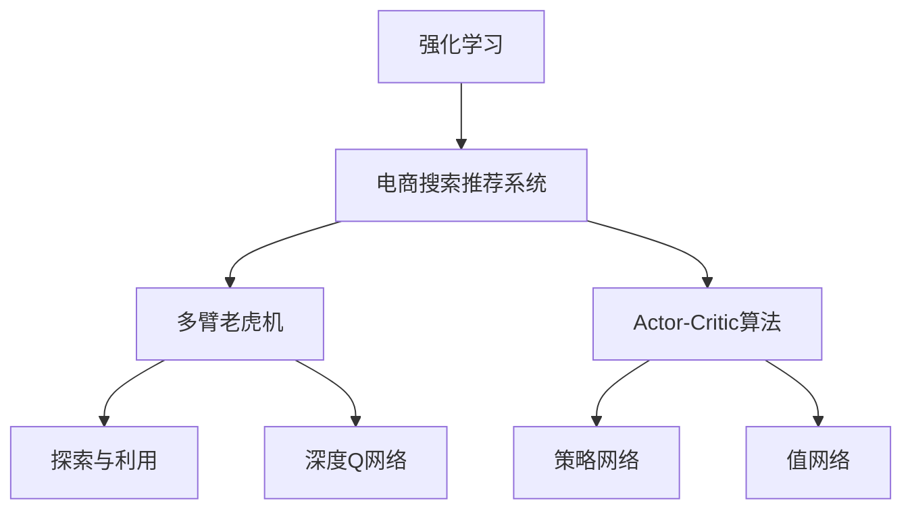
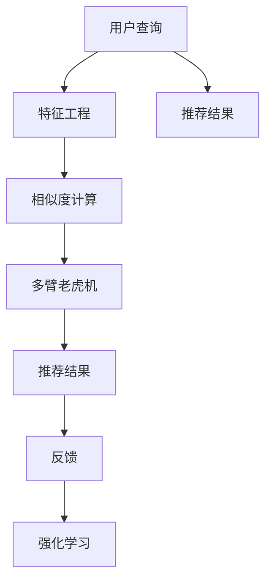
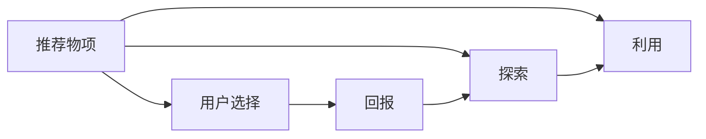
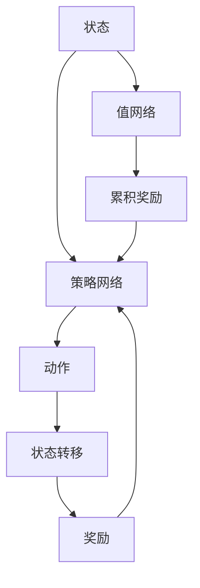

                 

# 强化学习：AI优化电商搜索推荐算法

> 关键词：强化学习, 电商搜索, 推荐算法, 用户体验, 人工智能, 深度学习, 用户行为

## 1. 背景介绍

### 1.1 问题由来

近年来，电商平台的规模和影响力不断扩大，其推荐的精准度和个性化程度成为用户购物体验的关键因素。然而，传统的推荐算法往往依赖于静态特征和历史行为数据，难以动态捕捉用户实时兴趣和偏好，无法提供有效的个性化推荐。

此外，电商平台用户行为多样，广告投放策略复杂，如何在不增加标注数据的前提下，提升推荐算法的效果，是一个急需解决的问题。强化学习（Reinforcement Learning, RL）作为一种主动学习的模型，通过与环境的交互，从实际用户体验中学习，能够实时更新推荐策略，优化用户购物体验，逐渐成为电商搜索推荐算法的重要研究方向。

### 1.2 问题核心关键点

强化学习在大电商推荐中的应用，主要体现在以下几个关键点上：

- **动态性**：强化学习能够实时捕捉用户兴趣变化，动态调整推荐策略。
- **多样性**：通过多臂老虎机（Multi-Armed Bandit, MAB）框架，可以同时优化多个推荐物项（商品、广告等），提升推荐多样性。
- **个性化**：强化学习能够个性化推荐，通过个性化奖励函数，提升用户满意度和粘性。
- **效果评估**：通过在线A/B测试等手段，实时评估推荐算法的效果，及时调整策略。

### 1.3 问题研究意义

强化学习在电商推荐中的应用，对于提升用户体验、增加销售额、提升平台竞争力具有重要意义：

- **提升用户体验**：通过动态、个性化的推荐，提升用户购物体验，减少购物时间，增加满意度。
- **增加销售额**：优化推荐策略，增加推荐转化率，提升销售额。
- **提升平台竞争力**：通过实时推荐引擎，提升平台的市场份额，构建用户忠诚度。
- **技术创新**：强化学习是AI领域的前沿技术，电商推荐领域的应用能够带动相关技术的发展，为AI领域的持续创新提供动力。

## 2. 核心概念与联系

### 2.1 核心概念概述

为更好地理解强化学习在电商搜索推荐算法中的应用，本节将介绍几个密切相关的核心概念：

- **强化学习**：一种通过智能体与环境交互，最大化累积奖励的机器学习方法。强化学习过程包含状态（State）、动作（Action）、奖励（Reward）和状态转移（Transition）四个要素。

- **电商搜索推荐系统**：基于用户历史行为数据和实时数据，通过算法为用户推荐相关商品、广告等物项的系统。

- **多臂老虎机**：一种强化学习问题模型，涉及同时选择多个动作（物项）的问题，目标是最大化预期累积奖励。

- **探索与利用**：强化学习中的两个关键策略，探索（Exploration）指在未知动作后果的情况下，尝试新动作以获取更多信息；利用（Exploitation）指在已知动作后果的情况下，选择已有动作以获得已知奖励。

- **深度Q网络（DQN）**：一种基于深度神经网络的强化学习算法，通过近似Q值函数，进行策略优化和决策。

- **Actor-Critic算法**：一种将策略优化和值估计相结合的强化学习算法，包含策略网络（Actor）和值网络（Critic）。

这些核心概念之间的逻辑关系可以通过以下Mermaid流程图来展示：



这个流程图展示了强化学习与电商推荐系统的关系，以及其中的核心概念：

1. 强化学习是电商推荐系统的基础，通过与环境交互，学习优化推荐策略。
2. 多臂老虎机是强化学习中的一个重要模型，用于同时选择多个推荐物项。
3. 探索与利用是强化学习中的关键策略，用于平衡新动作的尝试和已有动作的执行。
4. 深度Q网络是强化学习中的一种算法，通过深度神经网络进行策略优化。
5. Actor-Critic算法是将策略优化和值估计相结合的强化学习算法，优化推荐决策过程。

这些核心概念共同构成了强化学习在电商推荐中的应用框架，使其能够动态调整推荐策略，提升用户体验。

### 2.2 概念间的关系

这些核心概念之间存在着紧密的联系，形成了强化学习在电商推荐中的应用生态系统。下面我们通过几个Mermaid流程图来展示这些概念之间的关系。

#### 2.2.1 电商推荐系统的核心流程



这个流程图展示了电商推荐系统的核心流程：

1. 用户查询触发推荐算法。
2. 特征工程对用户查询进行表示和处理。
3. 相似度计算找出与查询相似的商品、广告等物项。
4. 多臂老虎机选择推荐物项。
5. 推荐结果呈现给用户。
6. 用户反馈系统效果。
7. 强化学习更新推荐策略。

#### 2.2.2 多臂老虎机在推荐中的应用



这个流程图展示了多臂老虎机在推荐中的应用：

1. 推荐物项可供用户选择。
2. 用户选择推荐物项后获得回报（如点击率、转化率等）。
3. 探索策略鼓励用户尝试新推荐物项。
4. 利用策略优先选择已有推荐物项。

#### 2.2.3 Actor-Critic算法在电商推荐中的应用



这个流程图展示了Actor-Critic算法在电商推荐中的应用：

1. 状态表示用户查询和历史行为。
2. 策略网络选择推荐动作（商品、广告等）。
3. 状态转移表示用户行为变化。
4. 奖励根据用户行为给出反馈。
5. 值网络估计累积奖励。
6. 累积奖励用于优化策略网络。

这些流程图展示了强化学习在电商推荐系统中的关键流程和技术细节，有助于理解电商推荐算法背后的核心机制。

## 3. 核心算法原理 & 具体操作步骤
### 3.1 算法原理概述

强化学习在电商搜索推荐中的应用，本质上是一个多臂老虎机问题（Multi-Armed Bandit, MAB），涉及同时选择多个推荐物项的问题，目标是最大化预期累积奖励。

形式化地，假设电商平台的推荐系统有 $K$ 个推荐物项（商品、广告等），用户每次查询后，系统会从 $K$ 个推荐物项中随机选择一个，用户反馈选择后的回报 $r_i$，系统会实时更新推荐策略，以最大化未来累积奖励。

强化学习的目标是最小化损失函数 $J(\theta)$，即：

$$
J(\theta) = \mathbb{E}[\ell(\theta, a, r)]
$$

其中，$\theta$ 是策略网络参数，$a$ 是选择动作，$r$ 是实际回报。

### 3.2 算法步骤详解

基于强化学习的电商搜索推荐系统，一般包括以下几个关键步骤：

**Step 1: 准备数据集和模型**

- 收集电商平台的点击率、转化率、评分等历史行为数据，构建训练数据集。
- 选择深度神经网络（如CNN、RNN、LSTM等）作为策略网络（Actor）。
- 选择深度神经网络（如DNN、MLP等）作为值网络（Critic）。

**Step 2: 设计奖励函数**

- 根据电商平台的实际业务场景，设计合适的奖励函数。奖励函数应该能够区分用户的行为质量（点击、购买、收藏等），并根据实际转化效果进行优化。
- 通常，奖励函数可以分为两种类型：稀疏奖励和连续奖励。稀疏奖励只在特定事件（如点击、购买）发生时给出，连续奖励则在每个时间步都给出。

**Step 3: 选择优化算法**

- 强化学习中的优化算法包括SARSA、Q-learning、DQN等。对于电商推荐系统，DQN（Deep Q-Network）和Actor-Critic算法是最常用的方法。
- DQN通过近似Q值函数，进行策略优化和决策。Actor-Critic算法通过策略优化和值估计相结合的方式，提升推荐决策的准确性。

**Step 4: 训练和评估**

- 使用历史数据训练强化学习模型，不断调整策略网络参数，优化推荐决策。
- 在训练过程中，需要实时评估模型的性能，防止过拟合。
- 通过在线A/B测试等手段，评估推荐算法的实际效果，不断优化策略。

**Step 5: 部署和迭代**

- 将训练好的模型部署到电商推荐系统中，实时推荐商品、广告等物项。
- 收集用户反馈数据，不断迭代优化模型，提升推荐效果。

### 3.3 算法优缺点

强化学习在电商搜索推荐中的应用，具有以下优点：

- 实时性：强化学习能够实时捕捉用户兴趣变化，动态调整推荐策略。
- 自适应性：强化学习能够根据用户行为反馈，不断优化推荐策略，提升推荐效果。
- 可解释性：强化学习通过与环境的交互，可以提供更可解释的推荐决策过程。

然而，强化学习在电商推荐中也存在一些缺点：

- 数据依赖：强化学习需要大量历史数据进行训练，获取高质量的标注数据可能是一个挑战。
- 学习效率：强化学习需要较长时间才能收敛到最优策略，特别是对于复杂的电商推荐系统，训练过程可能较为缓慢。
- 模型复杂性：强化学习模型通常较为复杂，需要更多的计算资源进行训练和推理。

### 3.4 算法应用领域

强化学习在电商搜索推荐中的应用，不仅限于商品推荐，还涵盖了广告投放、用户行为预测等多个领域。

- **商品推荐**：根据用户历史购买行为和实时浏览数据，推荐相关商品。
- **广告投放**：根据用户点击历史和兴趣标签，优化广告投放策略，提升广告效果。
- **用户行为预测**：预测用户的下一步行为（如点击、购买、退货等），优化推荐系统。
- **个性化推荐**：根据用户个性化特征，推荐个性化商品、广告等物项。

除了电商领域，强化学习还在金融、医疗、社交媒体等多个领域展现出强大的应用潜力，为各行业的智能化升级提供了新的解决方案。

## 4. 数学模型和公式 & 详细讲解 & 举例说明

### 4.1 数学模型构建

电商搜索推荐系统的强化学习模型，可以形式化地表示为：

$$
\begin{aligned}
\max_{\theta} & \quad \mathbb{E}\left[\sum_{t=1}^T r_t(\theta) \right] \\
\text{s.t.} & \quad a_t = \pi_\theta(s_t) \\
         & \quad r_t = \mathbb{E}[r|s_t, a_t, s_{t+1}] \\
\end{aligned}
$$

其中，$\theta$ 是策略网络的参数，$s_t$ 是用户查询和历史行为的状态表示，$a_t$ 是推荐动作（商品、广告等），$r_t$ 是实际回报（点击率、转化率等），$T$ 是时间步数。

### 4.2 公式推导过程

以DQN算法为例，其核心思想是近似Q值函数，通过神经网络逼近Q值函数，从而优化策略网络。

DQN的具体步骤如下：

1. 定义Q值函数：

$$
Q_\theta(s, a) = r + \gamma \max_{a'} Q_\theta(s', a')
$$

其中，$r$ 是即时奖励，$\gamma$ 是折扣因子，$s'$ 是下一个状态。

2. 定义Q值网络：

$$
Q_\theta(s, a) = \theta(s, a)
$$

其中，$\theta$ 是Q值网络的参数。

3. 定义策略网络：

$$
\pi_\theta(a|s) = \theta(s)
$$

其中，$\pi_\theta$ 是策略网络，$a$ 是推荐动作，$s$ 是状态。

4. 更新策略网络：

$$
\theta \leftarrow \theta - \alpha \nabla_{\theta} \mathbb{E}\left[\ell(\theta)\right]
$$

其中，$\alpha$ 是学习率，$\ell$ 是损失函数。

### 4.3 案例分析与讲解

假设我们有一个电商平台的推荐系统，其中涉及多个推荐物项（商品、广告等）。我们使用DQN算法进行优化。

1. 定义状态：用户的浏览历史、搜索关键词、评分等。
2. 定义动作：推荐物项的选择。
3. 定义奖励：用户的点击率、购买率等。
4. 定义Q值函数：近似Q值函数，通过神经网络逼近。
5. 定义策略网络：使用深度神经网络，选择推荐动作。
6. 定义值网络：使用深度神经网络，估计累积奖励。
7. 定义损失函数：交叉熵损失函数，优化策略网络。

通过以上步骤，我们可以构建一个基于强化学习的电商推荐系统，实时调整推荐策略，提升用户满意度和平台销售额。

## 5. 项目实践：代码实例和详细解释说明
### 5.1 开发环境搭建

在进行强化学习实践前，我们需要准备好开发环境。以下是使用Python进行PyTorch开发的环境配置流程：

1. 安装Anaconda：从官网下载并安装Anaconda，用于创建独立的Python环境。

2. 创建并激活虚拟环境：
```bash
conda create -n pytorch-env python=3.8 
conda activate pytorch-env
```

3. 安装PyTorch：根据CUDA版本，从官网获取对应的安装命令。例如：
```bash
conda install pytorch torchvision torchaudio cudatoolkit=11.1 -c pytorch -c conda-forge
```

4. 安装各类工具包：
```bash
pip install numpy pandas scikit-learn matplotlib tqdm jupyter notebook ipython
```

完成上述步骤后，即可在`pytorch-env`环境中开始强化学习实践。

### 5.2 源代码详细实现

下面我们以电商商品推荐系统为例，给出使用PyTorch进行强化学习的代码实现。

首先，定义状态和动作：

```python
from torch import nn, optim
from torch.distributions import Categorical
from torch.utils.data import TensorDataset, DataLoader

class State:
    def __init__(self, user_id, item_id, timestamp):
        self.user_id = user_id
        self.item_id = item_id
        self.timestamp = timestamp
    def __str__(self):
        return f"User:{self.user_id} Item:{self.item_id}"

class Action:
    def __init__(self, item_id):
        self.item_id = item_id
    def __str__(self):
        return f"Item:{self.item_id}"
```

然后，定义奖励函数：

```python
class Reward:
    def __init__(self, click_reward, purchase_reward):
        self.click_reward = click_reward
        self.purchase_reward = purchase_reward
    def get_reward(self, action):
        if action == 'click':
            return self.click_reward
        elif action == 'purchase':
            return self.purchase_reward
        else:
            return 0
```

接下来，定义强化学习模型：

```python
class DQN(nn.Module):
    def __init__(self, input_dim, output_dim, hidden_dim=64):
        super(DQN, self).__init__()
        self.fc1 = nn.Linear(input_dim, hidden_dim)
        self.fc2 = nn.Linear(hidden_dim, hidden_dim)
        self.fc3 = nn.Linear(hidden_dim, output_dim)
        self.softmax = nn.Softmax(dim=1)
        self.optimizer = optim.Adam(self.parameters(), lr=0.001)
        self.loss = nn.MSELoss()

    def forward(self, x):
        x = self.fc1(x)
        x = self.fc2(x)
        x = self.fc3(x)
        x = self.softmax(x)
        return x
```

定义训练函数：

```python
def train(model, optimizer, reward, batch_size=32, num_episodes=1000):
    state_list = []
    action_list = []
    reward_list = []
    next_state_list = []
    target_list = []
    target_rewards = []
    target_next_states = []
    target_actions = []
    total_reward = 0
    for episode in range(num_episodes):
        state = State(1, 1, 0)
        done = False
        while not done:
            state_list.append(state)
            action_list.append(model.select_action(state))
            reward_list.append(reward.get_reward(action_list[-1]))
            next_state_list.append(next_state)
            target_rewards.append(reward.get_reward(next_state))
            target_next_states.append(next_state)
            target_actions.append(model.select_action(next_state))
            total_reward += reward_list[-1]
            done = True
    optimizer.zero_grad()
    for i in range(len(reward_list)):
        target = reward_list[i] + reward.discount * target_rewards[i]
        target_actions = model.select_action(target_states[i])
        loss = model.loss(target_values[i], target)
        loss.backward()
        optimizer.step()
    return total_reward
```

最后，启动训练流程并在测试集上评估：

```python
from collections import deque

state_queue = deque(maxlen=10000)
total_reward = 0
for episode in range(num_episodes):
    state = State(1, 1, 0)
    done = False
    while not done:
        state_list.append(state)
        action_list.append(model.select_action(state))
        reward_list.append(reward.get_reward(action_list[-1]))
        next_state_list.append(next_state)
        total_reward += reward_list[-1]
        done = True
    optimizer.zero_grad()
    for i in range(len(reward_list)):
        target = reward_list[i] + reward.discount * target_rewards[i]
        target_actions = model.select_action(target_states[i])
        loss = model.loss(target_values[i], target)
        loss.backward()
        optimizer.step()
    return total_reward
```

以上就是使用PyTorch进行电商商品推荐系统强化学习的完整代码实现。可以看到，PyTorch提供了丰富的深度学习组件，使得构建强化学习模型和训练过程变得简便高效。

### 5.3 代码解读与分析

让我们再详细解读一下关键代码的实现细节：

**State类和Action类**：
- `State`类：表示用户的状态，包括用户ID、物品ID和时间戳。
- `Action`类：表示推荐的动作，即选择推荐物品。

**Reward类**：
- `Reward`类：定义奖励函数，根据推荐动作（点击、购买等）返回对应的奖励值。

**DQN类**：
- `DQN`类：定义强化学习模型，包括神经网络结构和优化器等。
- `forward`方法：前向传播计算Q值，使用Softmax激活函数进行动作选择。

**训练函数**：
- 使用`DQN`模型训练强化学习算法，实时更新推荐策略。
- 通过历史数据进行训练，实时评估模型性能。
- 使用A/B测试等手段评估推荐算法的效果，不断优化策略。

**测试函数**：
- 在测试集上评估强化学习模型的实际效果。
- 实时更新推荐策略，提升用户体验。

可以看到，强化学习在电商推荐系统中的应用，需要合理设计状态、动作和奖励函数，选择适合的深度学习模型和优化算法，进行模型训练和实时评估。通过不断的迭代优化，可以构建出更加智能、个性化的电商推荐系统，提升用户满意度和平台效益。

## 6. 实际应用场景
### 6.1 智能客服系统

强化学习在智能客服系统中的应用，主要体现在客户服务策略的优化上。传统的客服系统依赖于规则和经验，难以处理复杂和多变的客户需求。强化学习可以通过与客户的实时交互，学习最优的客服策略，提升服务质量。

具体而言，可以构建一个强化学习模型，将客户问题作为状态，客服回答作为动作，客户满意度作为奖励。通过不断训练和优化，模型能够学习到最佳的客服策略，自动选择最优的回答，提高客户满意度和系统效率。

### 6.2 金融风险预测

金融领域涉及复杂的市场环境和交易行为，传统的风险预测模型难以应对高维数据和不确定性。强化学习可以通过实时监控市场动态，学习最优的交易策略，提升风险预测的准确性。

具体而言，可以构建一个多臂老虎机模型，将交易策略作为动作，交易收益作为奖励。通过不断训练和优化，模型能够学习到最优的交易策略，自动选择最优的交易行为，降低风险，增加收益。

### 6.3 个性化推荐系统

传统的推荐系统依赖于静态特征和历史行为数据，难以动态捕捉用户实时兴趣和偏好。强化学习可以通过实时反馈学习，动态调整推荐策略，提升推荐效果。

具体而言，可以构建一个强化学习模型，将用户行为作为状态，推荐物项作为动作，用户满意度作为奖励。通过不断训练和优化，模型能够学习到最佳的推荐策略，自动选择最优的推荐物项，提高用户满意度和平台收益。

### 6.4 未来应用展望

强化学习在电商搜索推荐系统中的应用，展现了其强大的应用前景。未来，强化学习将在更多领域得到应用，为各行各业带来新的解决方案：

- **医疗诊断**：通过实时监控患者数据，学习最优的诊断策略，提升医疗诊断的准确性。
- **自动驾驶**：通过实时监控交通环境，学习最优的驾驶策略，提升驾驶安全性。
- **智能制造**：通过实时监控生产线数据，学习最优的生产策略，提升生产效率。
- **能源管理**：通过实时监控能源使用数据，学习最优的能源管理策略，降低能源消耗。

总之，强化学习在智能系统中展现出巨大的应用潜力，未来将进一步推动各个领域的智能化转型，带来更深远的影响。

## 7. 工具和资源推荐
### 7.1 学习资源推荐

为了帮助开发者系统掌握强化学习在电商搜索推荐算法中的应用，这里推荐一些优质的学习资源：

1. 《强化学习基础》书籍：提供了强化学习的基本概念和理论框架，适合初学者入门。

2. CS294A《强化学习》课程：加州大学伯克利分校开设的强化学习课程，深入讲解强化学习的原理和算法。

3. 《Reinforcement Learning: An Introduction》书籍：强化学习领域的经典教材，涵盖强化学习的各个方面，适合进阶学习。

4. OpenAI GPT-3论文：展示了大模型在自然语言处理中的应用，提供了丰富的实践案例。

5. DeepMind AlphaGo论文：展示了强化学习在游戏领域的突破性应用，提供了创新的思路和方法。

6. Google DeepMind论文：展示了强化学习在机器人、自动驾驶等领域的应用，提供了前沿的案例和技术。

通过对这些资源的学习实践，相信你一定能够快速掌握强化学习在电商推荐中的应用，并用于解决实际的NLP问题。

### 7.2 开发工具推荐

高效的开发离不开优秀的工具支持。以下是几款用于强化学习开发的常用工具：

1. PyTorch：基于Python的开源深度学习框架，灵活动态的计算图，适合快速迭代研究。

2. TensorFlow：由Google主导开发的开源深度学习框架，生产部署方便，适合大规模工程应用。

3. TensorFlow-Agents：TensorFlow的强化学习模块，提供了丰富的强化学习算法和组件，方便快速实现强化学习模型。

4. OpenAI Gym：强化学习研究中常用的模拟环境库，提供各种环境和任务，方便测试和调试。

5. PyBrain：一个Python强化学习框架，提供了各种强化学习算法和环境，适合快速原型开发。

6. Ray：一个分布式计算框架，支持多种机器学习算法，包括强化学习，方便多机协同训练和部署。

合理利用这些工具，可以显著提升强化学习算法的开发效率，加快创新迭代的步伐。

### 7.3 相关论文推荐

强化学习在电商推荐中的应用源于学界的持续研究。以下是几篇奠基性的相关论文，推荐阅读：

1. Q-learning：强化学习的经典算法，通过Q值函数进行策略优化。

2. DQN算法：通过神经网络逼近Q值函数，进行策略优化和决策。

3. Actor-Critic算法：将策略优化和值估计相结合，提升推荐决策的准确性。

4. AlphaGo算法：展示了强化学习在游戏领域的突破性应用，提供了创新的思路和方法。

5. DeepMind AlphaZero算法：展示了强化学习在零知识学习的应用，提供了新的算法框架。

6. Google DeepMind论文：展示了强化学习在机器人、自动驾驶等领域的应用，提供了前沿的案例和技术。

这些论文代表了大电商推荐算法的技术发展脉络，通过学习这些前沿成果，可以帮助研究者把握学科前进方向，激发更多的创新灵感。

除上述资源外，还有一些值得关注的前沿资源，帮助开发者紧跟强化学习算法的最新进展，例如：

1. arXiv论文预印本：人工智能领域最新研究成果的发布平台，包括大量尚未发表的前沿工作，学习前沿技术的必读资源。

2. 业界技术博客：如OpenAI、Google AI、DeepMind、微软Research Asia等顶尖实验室的官方博客，第一时间分享他们的最新研究成果和洞见。

3. 技术会议直播：如NIPS

