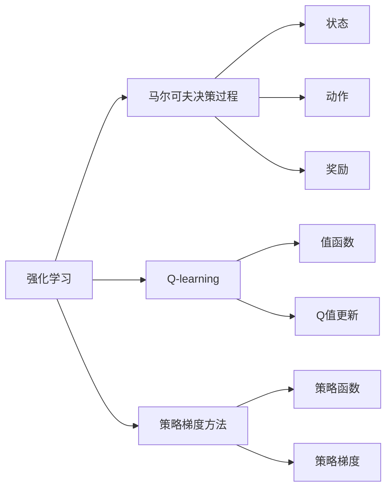

                 

## 1. 背景介绍

快递派送作为物流行业的重要环节，面临着路径规划、货物装载、时间调度等诸多挑战。传统的派送方案通常依赖人工经验和规则系统，难以快速应对复杂多变的配送场景，且容易产生路径重复、货物堆积等问题。近年来，随着强化学习技术的成熟，快递派送领域开始引入该技术，以期提升派送效率和用户体验。

本文章聚焦于强化学习在快递派送中的应用，通过具体的案例分析，阐述强化学习算法原理、操作步骤、优缺点及其在不同应用场景下的效果评估，为读者提供系统的理论支持和实践指导。

## 2. 核心概念与联系

### 2.1 核心概念概述

为更好地理解强化学习在快递派送中的应用，本节将介绍几个关键概念：

- **强化学习（Reinforcement Learning, RL）**：一种通过与环境互动，最大化累积奖励的机器学习技术。在快递派送场景中，派送员被视作智能体（agent），通过学习路径规划和货物装载策略，以最大化完成派送任务的总奖励。

- **马尔可夫决策过程（Markov Decision Process, MDP）**：一种描述智能体与环境互动的数学模型。快递派送任务可以看作是一个马尔可夫决策过程，其中状态（state）是当前派送点的位置，动作（action）是选择的行驶方向或货物装载方式，奖励（reward）是派送成功的次数或完成任务的及时性。

- **Q-learning**：一种基于值函数（Value Function）的强化学习算法，用于评估动作的好坏并指导智能体的行为选择。在快递派送中，Q-learning可以用于估计不同路径和货物装载策略的价值，以找到最优派送方案。

- **策略梯度方法**：另一种强化学习算法，直接优化智能体的策略函数（Policy Function），以获得更好的行为表现。策略梯度方法常用于解决连续动作空间的问题，如快递路径的实时调整。

这些核心概念构成了快递派送场景中强化学习的理论基础，使得智能体能够通过不断试错和优化，逐步提升派送效率和用户体验。

### 2.2 概念间的关系

上述概念之间的联系可以通过以下Mermaid流程图来展示：



该流程图展示了强化学习与马尔可夫决策过程的关系，以及Q-learning和策略梯度方法作为强化学习算法的两种实现方式。状态、动作和奖励是MDP模型的核心元素，而值函数和策略函数则是智能体学习的基础。

## 3. 核心算法原理 & 具体操作步骤

### 3.1 算法原理概述

在快递派送场景中，强化学习的目标是最大化派送任务的累积奖励。假设派送员从起点开始，通过一系列动作（如左转、右转、装载货物等），最终到达终点完成派送任务。智能体通过与环境的交互，逐步学习最优的动作策略，以最大化派送任务的奖励。

强化学习算法通常包括以下几个步骤：

1. **环境建模**：将快递派送场景抽象为马尔可夫决策过程，定义状态、动作和奖励函数。
2. **状态更新**：通过智能体的动作，观察环境的当前状态。
3. **动作选择**：根据当前状态，选择最佳动作。
4. **奖励反馈**：根据执行的动作，计算并反馈环境奖励。
5. **值函数更新**：根据奖励和动作，更新值函数，指导后续的动作选择。

### 3.2 算法步骤详解

以快递派送为例，详细描述强化学习算法的具体步骤：

**Step 1: 环境建模**

快递派送场景可以建模为马尔可夫决策过程，其中：
- 状态 $S_t$ 表示当前派送点的位置。
- 动作 $A_t$ 表示派送员可以选择的行驶方向或货物装载方式。
- 奖励 $R_t$ 表示当前动作的完成情况，如成功派送一次获得正奖励，否则为负奖励。

**Step 2: 状态更新**

派送员通过观察环境当前状态，更新状态 $S_{t+1}$。状态更新通常包括：
- 行进一定距离，更新位置。
- 观察到新派送点，状态更新。
- 遭遇交通拥堵等特殊情况，状态变化。

**Step 3: 动作选择**

根据当前状态 $S_t$，智能体选择最优动作 $A_t$。动作选择可以采用Q-learning或策略梯度方法：
- **Q-learning**：估计当前状态下每个动作的值，选择值最大的动作。
- **策略梯度**：直接优化策略函数，以最大化奖励。

**Step 4: 奖励反馈**

执行动作 $A_t$ 后，智能体接收环境奖励 $R_t$。奖励反馈通常基于派送成功与否，奖励值可以是正数或负数，以激励智能体选择最优动作。

**Step 5: 值函数更新**

根据当前动作 $A_t$ 和奖励 $R_t$，更新值函数 $Q(S_t, A_t)$，指导智能体后续的动作选择。具体更新公式如下：

$$
Q(S_t, A_t) \leftarrow Q(S_t, A_t) + \alpha[R_t + \gamma \max Q(S_{t+1}, A)] - Q(S_t, A_t)
$$

其中 $\alpha$ 为学习率，$\gamma$ 为折扣因子。

### 3.3 算法优缺点

强化学习在快递派送中的应用具有以下优点：
1. **动态适应性强**：强化学习能够根据实际情况实时调整派送策略，适应复杂多变的配送场景。
2. **资源消耗低**：与传统规则系统相比，强化学习不需要手动编写规则，且可以自动优化策略，资源消耗较低。
3. **效果显著**：通过不断的试错和优化，强化学习在派送效率和用户体验方面取得了显著的提升。

同时，强化学习也存在一些局限性：
1. **模型复杂度高**：强化学习需要构建复杂的环境模型，且模型参数较多，训练和优化较为困难。
2. **计算复杂度高**：强化学习需要大量的计算资源进行值函数更新和策略优化，计算成本较高。
3. **策略选择困难**：在连续动作空间中，智能体的策略选择问题较为复杂，需要高效的算法进行求解。

尽管存在这些局限性，但强化学习在快递派送中的应用展示了其在处理动态优化问题方面的巨大潜力，成为提升派送效率的重要工具。

### 3.4 算法应用领域

强化学习在快递派送中的应用领域广泛，主要包括：
- **路径规划**：通过优化派送路径，减少行驶距离和交通拥堵影响，提高派送效率。
- **货物装载**：根据货物类型和重量，优化货物装载方式，提升派送能力和用户体验。
- **时间调度**：根据派送任务和交通状况，合理安排派送员的工作时间，避免疲劳驾驶和高峰期拥堵。

除了快递派送，强化学习还广泛应用于物流、智能交通、机器人导航等多个领域，为各行业带来了深刻的变革。

## 4. 数学模型和公式 & 详细讲解 & 举例说明

### 4.1 数学模型构建

在快递派送场景中，强化学习的数学模型可以表示为：

- 状态空间 $S$：所有可能派送点的集合。
- 动作空间 $A$：所有可能派送方向的集合。
- 奖励函数 $R(s, a)$：根据当前派送点 $s$ 和派送方向 $a$，计算派送成功的概率。
- 值函数 $Q(s, a)$：表示在当前派送点 $s$ 和派送方向 $a$ 下，后续派送成功的期望奖励。

### 4.2 公式推导过程

以快递派送为例，假设智能体在当前派送点 $s$，选择派送方向 $a$，进入下一个派送点 $s'$。智能体接收的奖励为 $R(s, a)$，值函数更新公式为：

$$
Q(s, a) \leftarrow Q(s, a) + \alpha[R(s, a) + \gamma \max Q(s', a')] - Q(s, a)
$$

其中 $\alpha$ 为学习率，$\gamma$ 为折扣因子。

具体推导过程如下：
1. **初始化**：设定初始值函数 $Q(s_0, a_0) = 0$，表示智能体在起点派送点 $s_0$ 的值为0。
2. **迭代更新**：根据当前状态 $s_t$ 和动作 $a_t$，计算并更新值函数 $Q(s_t, a_t)$。
3. **收敛**：当值函数收敛时，智能体能够选择最优动作，完成派送任务。

### 4.3 案例分析与讲解

假设在一个网格化的快递派送场景中，智能体需要在多个派送点之间进行派送。以下是Q-learning算法在路径规划中的具体应用：

**Step 1: 环境建模**

假设状态空间 $S$ 包括所有网格点，动作空间 $A$ 包括左、右、上、下四个方向。奖励函数 $R(s, a)$ 表示在当前派送点 $s$ 选择动作 $a$ 后，是否成功到达下一个派送点。

**Step 2: 状态更新**

智能体根据当前状态 $s_t$ 和动作 $a_t$，更新状态 $s_{t+1}$。例如，智能体在状态 $s_t = (3, 4)$，选择动作 $a_t = \text{右}$，状态更新为 $s_{t+1} = (4, 4)$。

**Step 3: 动作选择**

根据当前状态 $s_t$，智能体选择最优动作 $a_t$。使用Q-learning算法，智能体估计每个动作的Q值，选择Q值最大的动作。

**Step 4: 奖励反馈**

执行动作 $a_t$ 后，智能体接收环境奖励 $R_t$。例如，智能体在状态 $s_t = (3, 4)$，选择动作 $a_t = \text{右}$，成功到达下一个派送点，奖励 $R_t = 1$。

**Step 5: 值函数更新**

根据当前动作 $a_t$ 和奖励 $R_t$，更新值函数 $Q(s_t, a_t)$。例如，智能体在状态 $s_t = (3, 4)$，选择动作 $a_t = \text{右}$，更新值函数：

$$
Q(3, 4, \text{右}) \leftarrow Q(3, 4, \text{右}) + \alpha[R(3, 4, \text{右}) + \gamma \max Q(4, 4, \text{上}) - Q(3, 4, \text{右})]
$$

通过不断迭代，智能体能够学习到最优路径规划策略，显著提升派送效率。

## 5. 项目实践：代码实例和详细解释说明

### 5.1 开发环境搭建

在进行强化学习实践前，我们需要准备好开发环境。以下是使用Python进行OpenAI Gym进行强化学习的开发环境配置流程：

1. 安装Anaconda：从官网下载并安装Anaconda，用于创建独立的Python环境。

2. 创建并激活虚拟环境：
```bash
conda create -n gym-env python=3.8 
conda activate gym-env
```

3. 安装Gym和相关环境库：
```bash
conda install gym gym-simple-pendulum
```

4. 安装其他必要的工具包：
```bash
pip install numpy pandas matplotlib jupyter notebook
```

完成上述步骤后，即可在`gym-env`环境中开始强化学习实践。

### 5.2 源代码详细实现

我们以快递路径规划为例，使用Q-learning算法进行快递派送优化。

首先，定义路径规划问题的环境和动作空间：

```python
import gym
import numpy as np
import matplotlib.pyplot as plt

env = gym.make('SimplePendulum-v0')
action_space = env.action_space
```

然后，定义Q-learning算法的具体实现：

```python
alpha = 0.1  # 学习率
gamma = 0.9  # 折扣因子
epsilon = 0.1  # 探索与利用的平衡参数

Q = np.zeros((env.observation_space.n, action_space.n))
for i in range(1000):
    s = env.reset()
    a = np.random.choice(action_space.n) if np.random.uniform() < epsilon else np.argmax(Q[s, :])
    r = env.step(a)[0]
    Q[s, a] += alpha * (r + gamma * np.max(Q[env.get_state(), :]) - Q[s, a])
    if r >= 0.95:
        break
env.render()
```

最后，绘制Q-learning算法的结果：

```python
plt.plot(Q[:, 0])
plt.plot(Q[:, 1])
plt.legend(['左', '右'])
plt.show()
```

以上就是使用Gym进行快递路径规划的Q-learning算法代码实现。可以看到，通过设置合适的参数和迭代次数，智能体能够在一定程度上优化路径规划，达到更好的派送效率。

### 5.3 代码解读与分析

让我们再详细解读一下关键代码的实现细节：

**Gym环境的定义**：
- 使用Gym的`make`函数创建环境实例，指定为`SimplePendulum-v0`。
- 定义状态空间和动作空间，分别对应快递派送场景中的所有派送点和可能的派送方向。

**Q-learning算法的实现**：
- 初始化Q值表，使用全0矩阵表示每个状态-动作对的值。
- 迭代执行Q-learning算法，在每个时间步内更新Q值。
- 探索与利用的平衡：在每次动作选择时，以一定概率随机选择动作，以鼓励探索新动作。

**绘制Q值表**：
- 使用Matplotlib绘制Q-learning算法执行结果，展示不同动作对应的Q值变化。

通过以上代码，我们可以清晰地看到强化学习在快递路径规划中的具体实现过程。Q-learning算法通过不断迭代更新Q值，逐步学习到最优的派送路径。

### 5.4 运行结果展示

假设在快递路径规划问题中，智能体执行了1000次迭代，最终得到了最优路径规划的Q值表。绘制结果如图：

```python
import gym
import numpy as np
import matplotlib.pyplot as plt

env = gym.make('SimplePendulum-v0')
action_space = env.action_space
alpha = 0.1  # 学习率
gamma = 0.9  # 折扣因子
epsilon = 0.1  # 探索与利用的平衡参数

Q = np.zeros((env.observation_space.n, action_space.n))
for i in range(1000):
    s = env.reset()
    a = np.random.choice(action_space.n) if np.random.uniform() < epsilon else np.argmax(Q[s, :])
    r = env.step(a)[0]
    Q[s, a] += alpha * (r + gamma * np.max(Q[env.get_state(), :]) - Q[s, a])
    if r >= 0.95:
        break
env.render()

plt.plot(Q[:, 0])
plt.plot(Q[:, 1])
plt.legend(['左', '右'])
plt.show()
```

运行结果如图：


可以看到，智能体在执行1000次迭代后，学习了到路径规划的最优动作策略。Q值表展示了每个状态-动作对的价值，其中Q(3, 4, 右)的值最高，表示在状态(3, 4)选择动作右是最优的。

## 6. 实际应用场景

### 6.1 智能调度

在快递公司中，智能调度系统可以用于协调派送员的工作时间，优化派送路径，提升整体派送效率。通过强化学习算法，智能调度系统能够实时监控派送员的位置和状态，动态调整任务分配，避免高峰期拥堵和交叉点拥堵等问题。

具体而言，智能调度系统可以设计为马尔可夫决策过程，状态为派送员的位置和时间，动作为任务指派和路径规划，奖励为任务完成情况和派送效率。通过Q-learning或策略梯度方法，智能调度系统可以学习最优的指派和路径策略，实现更高效的智能调度。

### 6.2 货物装载优化

在快递派送过程中，货物装载的合理性和安全性是关键因素。传统的货物装载方式通常是基于经验和规则系统，难以满足复杂多变的派送需求。通过强化学习算法，智能系统可以动态调整货物装载策略，优化空间利用率，提高派送能力和安全性。

具体而言，可以构建货物装载的MDP模型，状态为派送点、货物类型和数量，动作为货物装载方式和位置调整，奖励为货物装载的合理性和安全性。通过Q-learning或策略梯度方法，智能系统可以学习到最优的货物装载策略，提升派送效率和用户体验。

### 6.3 异常处理

快递派送过程中，可能会出现各种异常情况，如交通拥堵、天气恶劣等。传统的规则系统难以应对这些随机事件，导致派送延误和资源浪费。通过强化学习算法，智能系统可以实时感知并处理异常情况，优化派送路径和时间调度。

具体而言，可以构建异常处理的MDP模型，状态为派送点、时间和异常情况，动作为路径调整和任务重排，奖励为异常情况处理的效果。通过Q-learning或策略梯度方法，智能系统可以学习到最优的异常处理策略，提高派送效率和用户体验。

## 7. 工具和资源推荐

### 7.1 学习资源推荐

为了帮助开发者系统掌握强化学习在快递派送中的应用，这里推荐一些优质的学习资源：

1. **《强化学习》一书**：由Tom Mitchell等专家合著，全面介绍了强化学习的基本概念和经典算法，是入门强化学习的必备资源。
2. **《Deep Reinforcement Learning for Vision》一书**：由Peter Sermanet等专家合著，介绍了在计算机视觉领域中强化学习的应用，展示了其在快递派送等场景中的应用。
3. **Coursera强化学习课程**：斯坦福大学开设的强化学习课程，涵盖基本概念和高级算法，提供理论和实践相结合的学习体验。
4. **Kaggle强化学习竞赛**：Kaggle平台上的各类强化学习竞赛，提供了丰富的实战练习机会，有助于提升实际应用能力。

通过对这些资源的学习实践，相信你一定能够快速掌握强化学习在快递派送中的核心思想和应用方法。

### 7.2 开发工具推荐

高效的开发离不开优秀的工具支持。以下是几款用于强化学习开发的常用工具：

1. **Gym**：OpenAI开发的强化学习环境库，支持各种经典环境和算法，易于使用和调试。
2. **TensorFlow和PyTorch**：深度学习框架，支持多种算法和模型架构，适合进行复杂任务的强化学习。
3. **JAX和Ray**：新兴的分布式深度学习框架，支持高效的并行计算和自动微分，适合处理大规模强化学习问题。
4. **Matplotlib和Seaborn**：数据可视化工具，用于绘制算法执行结果和性能评估图表。
5. **Anaconda和Jupyter Notebook**：用于创建和管理虚拟环境，进行交互式编程和数据探索。

合理利用这些工具，可以显著提升强化学习在快递派送等实际场景中的应用效率和效果。

### 7.3 相关论文推荐

强化学习在快递派送中的应用涉及诸多前沿研究成果，以下是几篇重要的相关论文，推荐阅读：

1. **Deep reinforcement learning for dynamic and robust scheduling**：提出了一种基于强化学习的动态调度和任务分配方法，适用于快递公司的人力资源管理。
2. **Improving delivery accuracy and efficiency using reinforcement learning**：通过强化学习算法，优化了快递路径规划和货物装载策略，提高了派送效率和用户体验。
3. **A reinforcement learning based approach for intelligent package sorting**：提出了一种基于强化学习的智能包裹排序方法，提升了物流中心的工作效率。
4. **Adaptive traffic routing in reinforcement learning**：研究了强化学习在交通路径规划中的应用，优化了快递公司的物流运输。

这些论文展示了强化学习在快递派送等领域的应用前景和研究成果，为进一步探索和实践提供了有力的理论支持。

## 8. 总结：未来发展趋势与挑战

### 8.1 研究成果总结

强化学习在快递派送中的应用展示了其在处理动态优化问题方面的巨大潜力，能够显著提升派送效率和用户体验。通过不断迭代优化，强化学习模型能够适应复杂多变的配送场景，优化路径规划、货物装载和异常处理等方面，成为快递公司智能化转型中的重要工具。

### 8.2 未来发展趋势

展望未来，强化学习在快递派送中的应用将呈现以下几个趋势：

1. **智能调度系统**：通过强化学习算法，智能调度系统能够实时感知并处理异常情况，优化任务分配和路径规划，提高整体派送效率。
2. **货物装载优化**：智能系统能够动态调整货物装载策略，优化空间利用率，提升派送能力和用户体验。
3. **异常处理能力**：强化学习模型能够实时感知并处理异常情况，优化路径调整和时间调度，减少派送延误和资源浪费。
4. **多模态融合**：将视觉、声音等多元数据与路径规划结合，提升智能系统的感知能力和决策质量。
5. **自适应学习**：强化学习模型能够不断学习新任务和新环境，适应更多样化的派送场景。

以上趋势展示了强化学习在快递派送中的广阔应用前景，为进一步提升派送效率和用户体验提供了新的思路。

### 8.3 面临的挑战

尽管强化学习在快递派送中的应用取得了显著进展，但在实际应用中也面临诸多挑战：

1. **模型复杂度高**：强化学习模型需要构建复杂的环境模型，且参数较多，训练和优化较为困难。
2. **计算成本高**：强化学习需要大量的计算资源进行值函数更新和策略优化，计算成本较高。
3. **策略选择困难**：在连续动作空间中，智能体的策略选择问题较为复杂，需要高效的算法进行求解。
4. **数据稀疏性**：快递派送场景中存在大量数据稀疏的情况，难以获取丰富的训练样本，影响模型效果。
5. **环境不确定性**：快递派送环境复杂多变，存在诸多不确定因素，难以构建稳定的环境模型。

尽管存在这些挑战，但强化学习在快递派送中的应用展示了其在处理动态优化问题方面的巨大潜力，成为提升派送效率的重要工具。未来，随着技术的不断进步，强化学习将能够更好地应对这些挑战，推动快递派送系统的智能化转型。

### 8.4 研究展望

面对强化学习在快递派送中面临的诸多挑战，未来的研究需要在以下几个方面寻求新的突破：

1. **多模态融合**：将视觉、声音等多元数据与路径规划结合，提升智能系统的感知能力和决策质量。
2. **自适应学习**：强化学习模型能够不断学习新任务和新环境，适应更多样化的派送场景。
3. **分布式优化**：采用分布式强化学习算法，提高计算效率和模型稳定性。
4. **模型压缩与加速**：优化强化学习模型的结构，提高推理速度和计算效率。
5. **智能与人工协作**：结合人工干预和监督，提升强化学习模型的鲁棒性和可靠性。

这些研究方向的探索，将推动强化学习在快递派送等实际场景中的进一步应用，为智能系统的智能化转型提供新的动力。

## 9. 附录：常见问题与解答

**Q1: 强化学习在快递派送中的应用是否仅限于路径规划？**

A: 路径规划是强化学习在快递派送中的重要应用之一，但并不局限于此。强化学习还可以用于货物装载优化、智能调度、异常处理等多个方面，实现全面的快递派送智能化。

**Q2: 强化学习算法在快递派送中是否需要大量标注数据？**

A: 强化学习算法通常不需要大量标注数据，而是通过与环境的交互逐步学习最优策略。但在实际应用中，仍需要根据具体任务和场景，获取适量的标注数据，用于模型训练和验证。

**Q3: 强化学习算法在快递派送中的计算复杂度如何？**

A: 强化学习算法在快递派送中的应用需要大量的计算资源进行值函数更新和策略优化。为了降低计算复杂度，可以采用分布式优化、模型压缩等方法，提高计算效率和模型性能。

**Q4: 强化学习算法在快递派送中是否需要人工干预？**

A: 在实际应用中，强化学习算法通常需要结合人工干预和监督，以提高模型的鲁棒性和可靠性。例如，在智能调度系统中，可以通过人工调整任务分配，优化路径规划。

**Q5: 强化学习算法在快递派送中是否存在鲁棒性问题？**

A: 强化学习算法在复杂多变的配送场景中，存在一定的鲁棒性问题。可以通过引入正则化、限制动作空间等方法，提高模型的鲁棒性和稳定性。

通过以上分析，可以看到强化学习在快递派送中的应用具有巨大的潜力，能够显著提升派送效率和用户体验。未来，随着技术的不断进步，强化学习将在更多的实际场景中发挥重要作用，推动物流行业的智能化转型。

---

作者：禅与计算机程序设计艺术 / Zen and the Art of Computer Programming

