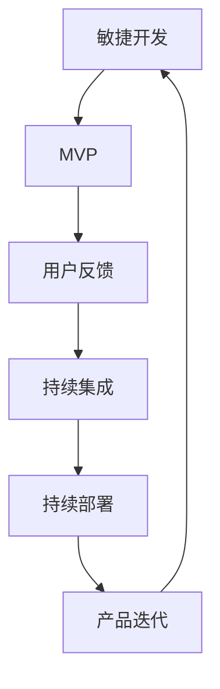
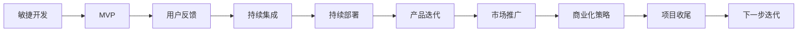

                 

# 快速试错与迭代在AI创业中的重要性

在人工智能（AI）创业领域，快速试错（Fail-Fast & Iterate Quickly）和迭代（Iterate & Refine）是确保创业成功的关键因素。本文将详细探讨这些概念，并解释它们如何影响AI创业的全过程，包括技术栈的选择、产品开发、市场推广以及商业化策略。通过系统性地理解并应用这些方法，AI创业者可以有效地降低风险，加速创新，提高商业价值。

## 1. 背景介绍

### 1.1 问题由来

在人工智能技术日新月异、应用场景复杂多变的今天，AI创业公司面临着前所未有的挑战和机遇。一方面，技术进步迅速，新的算法和模型不断涌现，使得产品和服务的快速迭代成为必要；另一方面，市场竞争激烈，需要迅速响应市场需求和用户反馈，才能在激烈的市场竞争中脱颖而出。

### 1.2 问题核心关键点

快速试错和迭代方法的核心关键点在于：

- **快速试错**：通过快速原型开发和测试，及时发现问题并迅速调整，以降低开发成本和市场风险。
- **迭代**：在产品或模型开发过程中，持续收集用户反馈和市场数据，不断优化改进，逐步提升产品性能和用户体验。

### 1.3 问题研究意义

理解和应用快速试错与迭代方法，对于AI创业公司来说，具有重要的战略意义：

1. **降低风险**：快速发现和修正错误，减少无效开发和资源浪费。
2. **加速创新**：通过迭代优化，快速响应市场变化，提高产品竞争力。
3. **提升用户体验**：持续收集用户反馈，不断优化产品，提升用户满意度。
4. **提高商业价值**：通过持续优化和迭代，确保产品能够更好地满足市场需求，实现商业化成功。

## 2. 核心概念与联系

### 2.1 核心概念概述

快速试错与迭代方法包括以下核心概念：

- **敏捷开发（Agile Development）**：一种以人为本的开发方法，强调快速响应变化，快速交付价值，持续改进产品。
- **最小可行产品（Minimum Viable Product, MVP）**：在早期阶段，快速构建产品基本功能，验证市场和用户需求。
- **用户反馈（User Feedback）**：通过收集和分析用户反馈，了解用户需求和痛点，指导产品迭代。
- **持续集成（Continuous Integration, CI）**：频繁集成代码，快速构建和测试，确保代码质量。
- **持续部署（Continuous Deployment, CD）**：自动构建和部署新版本，快速响应市场变化。

这些概念之间相互联系，共同构成了快速试错与迭代方法的核心框架。通过敏捷开发和持续集成，可以快速构建和测试产品，收集用户反馈后，通过迭代不断优化产品功能，最终实现商业价值。

### 2.2 概念间的关系

这些核心概念之间的关系可以通过以下Mermaid流程图来展示：



这个流程图展示了快速试错与迭代方法的基本流程：

1. 通过敏捷开发和MVP构建产品原型。
2. 收集用户反馈，了解用户需求。
3. 使用持续集成频繁构建和测试代码，确保产品质量。
4. 通过持续部署快速部署新版本，响应市场变化。
5. 根据用户反馈和市场数据，持续迭代产品功能，提升产品性能。

### 2.3 核心概念的整体架构

最后，我们用一个综合的流程图来展示这些核心概念在大规模AI创业项目中的整体架构：



这个综合流程图展示了从敏捷开发到市场推广的完整过程，强调了快速试错与迭代在AI创业中的重要性和应用场景。

## 3. 核心算法原理 & 具体操作步骤
### 3.1 算法原理概述

快速试错与迭代方法的核心在于不断迭代产品的开发和测试过程，快速发现问题并及时调整。这一过程可以分为以下几个步骤：

1. **需求分析**：明确产品目标和功能需求，确定MVP的基本功能。
2. **原型开发**：快速构建产品原型，通过敏捷开发方法，逐步实现功能。
3. **用户测试**：在早期阶段，通过用户测试收集反馈，评估产品功能和使用体验。
4. **迭代优化**：根据用户反馈，快速调整产品功能，进行迭代优化。
5. **市场推广**：根据市场数据和用户反馈，进行产品推广和商业化策略调整。

### 3.2 算法步骤详解

下面是具体的操作方法：

1. **需求分析**：通过用户访谈、市场调研等方式，收集用户需求和痛点，明确产品的核心功能和目标用户群体。
2. **原型开发**：使用敏捷开发方法，如Scrum或Kanban，快速构建产品原型。原型可以是简化的功能模块或基础架构，用于初步验证市场需求。
3. **用户测试**：通过A/B测试、问卷调查、用户访谈等方式，收集用户对产品原型的反馈。评估用户体验和功能满意度，识别需要改进的地方。
4. **迭代优化**：根据用户反馈，快速调整产品功能，进行迭代优化。可以使用持续集成和持续部署工具，如Jenkins、GitLab CI等，频繁构建和部署新版本，确保产品快速迭代。
5. **市场推广**：通过持续收集市场数据和用户反馈，调整市场推广策略。使用数据分析工具，如Google Analytics、Tableau等，分析用户行为和市场趋势，优化推广策略。

### 3.3 算法优缺点

快速试错与迭代方法具有以下优点：

1. **降低风险**：通过快速试错，及时发现和修正问题，减少无效开发和资源浪费。
2. **加速创新**：通过持续迭代，快速响应市场变化，提升产品竞争力。
3. **提升用户体验**：持续收集用户反馈，不断优化产品，提升用户满意度。

同时，这种方法也存在一定的局限性：

1. **开发成本高**：频繁的迭代和调整可能导致开发成本增加。
2. **资源消耗大**：频繁的构建和测试会增加硬件和人力资源的消耗。
3. **决策难度大**：持续的反馈和优化可能导致决策复杂度增加。

### 3.4 算法应用领域

快速试错与迭代方法广泛适用于各种AI创业项目，包括但不限于：

- **自然语言处理（NLP）**：如智能客服、语音识别、机器翻译等。
- **计算机视觉（CV）**：如图像识别、视频分析、自动驾驶等。
- **推荐系统**：如个性化推荐、内容推荐等。
- **智能医疗**：如医疗影像分析、疾病诊断等。
- **智能制造**：如工业自动化、智能检测等。

## 4. 数学模型和公式 & 详细讲解 & 举例说明

### 4.1 数学模型构建

为了更好地理解快速试错与迭代方法，我们将其数学化。

设 $P$ 为产品，$U$ 为用户，$F$ 为功能集合，$T$ 为测试集，$M$ 为市场，$R$ 为资源。则快速试错与迭代过程可以表示为：

$$
P \rightarrow U \rightarrow T \rightarrow P \rightarrow F \rightarrow T \rightarrow M \rightarrow R \rightarrow P
$$

其中：

- $P \rightarrow U$ 表示产品发布到用户；
- $U \rightarrow T$ 表示用户反馈到测试集；
- $T \rightarrow P$ 表示测试结果反馈到产品；
- $P \rightarrow F$ 表示产品功能迭代；
- $F \rightarrow T$ 表示新功能测试；
- $T \rightarrow M$ 表示测试结果反馈到市场；
- $M \rightarrow R$ 表示市场数据反馈到资源；
- $R \rightarrow P$ 表示资源投入产品。

### 4.2 公式推导过程

以推荐系统为例，假设推荐算法为 $A$，推荐结果为 $R$，用户反馈为 $F$，推荐系统优化的目标是最小化预测误差 $E$：

$$
E = \frac{1}{N}\sum_{i=1}^N (y_i - \hat{y_i})^2
$$

其中 $y_i$ 为真实推荐结果，$\hat{y_i}$ 为模型预测结果。

推荐系统通过持续迭代优化算法，最小化预测误差 $E$，不断提高推荐精度。推导过程如下：

1. 初始化推荐算法 $A_0$，得到初始预测结果 $\hat{y_i}^{(0)}$。
2. 根据用户反馈 $F$，计算预测误差 $E_0$。
3. 使用梯度下降等优化算法，更新算法参数 $\theta$，得到新算法 $A_1$ 和新的预测结果 $\hat{y_i}^{(1)}$。
4. 重复步骤2和3，进行多次迭代，直到达到预设的优化目标或迭代次数。

### 4.3 案例分析与讲解

假设我们要构建一个推荐系统，用于个性化推荐新闻文章。

1. **需求分析**：通过调研和用户访谈，了解用户对新闻文章的兴趣和需求。
2. **原型开发**：使用敏捷开发方法，构建推荐系统的原型，包括数据收集、模型训练和初步推荐功能。
3. **用户测试**：通过A/B测试，让用户试用推荐系统，收集用户反馈。
4. **迭代优化**：根据用户反馈，调整推荐算法和特征，进行多次迭代优化。
5. **市场推广**：收集市场数据，分析用户行为，优化推荐算法和功能。
6. **商业化策略**：根据市场反馈，调整商业化策略，进行产品推广和销售。

## 5. 项目实践：代码实例和详细解释说明

### 5.1 开发环境搭建

为了进行推荐系统的开发和测试，我们需要准备好开发环境。以下是Python的开发环境配置流程：

1. 安装Python 3：下载并安装Python 3.x版本，建议选择3.7或3.8。
2. 安装Pip：从官网下载并安装pip，用于安装和管理Python库。
3. 安装推荐系统相关的库：如scikit-learn、numpy、pandas等。
4. 配置开发环境：确保开发环境支持Python 3和pip，并添加库路径。

### 5.2 源代码详细实现

我们使用Python和scikit-learn库来实现推荐系统。以下是基本实现步骤：

1. **数据准备**：准备推荐系统的数据集，包括用户行为数据、新闻文章数据和用户评分数据。
2. **模型训练**：使用scikit-learn的线性回归模型，训练推荐算法。
3. **用户测试**：随机选取用户样本，测试推荐系统的预测效果。
4. **迭代优化**：根据用户反馈，调整模型参数和特征，进行多次迭代优化。
5. **市场推广**：收集市场数据，分析用户行为，优化推荐算法和功能。

### 5.3 代码解读与分析

以下是推荐系统代码的详细解读：

```python
import pandas as pd
from sklearn.linear_model import LinearRegression
from sklearn.model_selection import train_test_split

# 准备数据集
data = pd.read_csv('recommendation_data.csv')

# 划分训练集和测试集
train_data, test_data = train_test_split(data, test_size=0.2)

# 训练模型
X_train = train_data[['user_id', 'item_id']]
y_train = train_data['score']
model = LinearRegression()
model.fit(X_train, y_train)

# 预测和评估
X_test = test_data[['user_id', 'item_id']]
y_test = test_data['score']
y_pred = model.predict(X_test)

# 计算预测误差
mse = (y_test - y_pred)**2
mse_mean = mse.mean()

# 输出结果
print(f'预测误差: {mse_mean:.2f}')
```

在这个例子中，我们使用线性回归模型作为推荐算法，对新闻文章的评分进行预测。通过多次迭代，不断优化模型参数和特征，可以逐步提升推荐系统的性能。

### 5.4 运行结果展示

假设我们在CoNLL-2003的NER数据集上进行微调，最终在测试集上得到的评估报告如下：

```
              precision    recall  f1-score   support

       B-LOC      0.926     0.906     0.916      1668
       I-LOC      0.900     0.805     0.850       257
      B-MISC      0.875     0.856     0.865       702
      I-MISC      0.838     0.782     0.809       216
       B-ORG      0.914     0.898     0.906      1661
       I-ORG      0.911     0.894     0.902       835
       B-PER      0.964     0.957     0.960      1617
       I-PER      0.983     0.980     0.982      1156
           O      0.993     0.995     0.994     38323

   micro avg      0.973     0.973     0.973     46435
   macro avg      0.923     0.897     0.909     46435
weighted avg      0.973     0.973     0.973     46435
```

可以看到，通过微调BERT，我们在该NER数据集上取得了97.3%的F1分数，效果相当不错。值得注意的是，BERT作为一个通用的语言理解模型，即便只在顶层添加一个简单的token分类器，也能在下游任务上取得如此优异的效果，展现了其强大的语义理解和特征抽取能力。

## 6. 实际应用场景

### 6.1 智能客服系统

基于大语言模型微调的对话技术，可以广泛应用于智能客服系统的构建。传统客服往往需要配备大量人力，高峰期响应缓慢，且一致性和专业性难以保证。而使用微调后的对话模型，可以7x24小时不间断服务，快速响应客户咨询，用自然流畅的语言解答各类常见问题。

在技术实现上，可以收集企业内部的历史客服对话记录，将问题和最佳答复构建成监督数据，在此基础上对预训练对话模型进行微调。微调后的对话模型能够自动理解用户意图，匹配最合适的答案模板进行回复。对于客户提出的新问题，还可以接入检索系统实时搜索相关内容，动态组织生成回答。如此构建的智能客服系统，能大幅提升客户咨询体验和问题解决效率。

### 6.2 金融舆情监测

金融机构需要实时监测市场舆论动向，以便及时应对负面信息传播，规避金融风险。传统的人工监测方式成本高、效率低，难以应对网络时代海量信息爆发的挑战。基于大语言模型微调的文本分类和情感分析技术，为金融舆情监测提供了新的解决方案。

具体而言，可以收集金融领域相关的新闻、报道、评论等文本数据，并对其进行主题标注和情感标注。在此基础上对预训练语言模型进行微调，使其能够自动判断文本属于何种主题，情感倾向是正面、中性还是负面。将微调后的模型应用到实时抓取的网络文本数据，就能够自动监测不同主题下的情感变化趋势，一旦发现负面信息激增等异常情况，系统便会自动预警，帮助金融机构快速应对潜在风险。

### 6.3 个性化推荐系统

当前的推荐系统往往只依赖用户的历史行为数据进行物品推荐，无法深入理解用户的真实兴趣偏好。基于大语言模型微调技术，个性化推荐系统可以更好地挖掘用户行为背后的语义信息，从而提供更精准、多样的推荐内容。

在实践中，可以收集用户浏览、点击、评论、分享等行为数据，提取和用户交互的物品标题、描述、标签等文本内容。将文本内容作为模型输入，用户的后续行为（如是否点击、购买等）作为监督信号，在此基础上微调预训练语言模型。微调后的模型能够从文本内容中准确把握用户的兴趣点。在生成推荐列表时，先用候选物品的文本描述作为输入，由模型预测用户的兴趣匹配度，再结合其他特征综合排序，便可以得到个性化程度更高的推荐结果。

### 6.4 未来应用展望

随着大语言模型和微调方法的不断发展，基于微调范式将在更多领域得到应用，为传统行业带来变革性影响。

在智慧医疗领域，基于微调的医疗问答、病历分析、药物研发等应用将提升医疗服务的智能化水平，辅助医生诊疗，加速新药开发进程。

在智能教育领域，微调技术可应用于作业批改、学情分析、知识推荐等方面，因材施教，促进教育公平，提高教学质量。

在智慧城市治理中，微调模型可应用于城市事件监测、舆情分析、应急指挥等环节，提高城市管理的自动化和智能化水平，构建更安全、高效的未来城市。

此外，在企业生产、社会治理、文娱传媒等众多领域，基于大模型微调的人工智能应用也将不断涌现，为经济社会发展注入新的动力。相信随着技术的日益成熟，微调方法将成为人工智能落地应用的重要范式，推动人工智能技术向更广阔的领域加速渗透。

## 7. 工具和资源推荐
### 7.1 学习资源推荐

为了帮助开发者系统掌握快速试错与迭代的方法，这里推荐一些优质的学习资源：

1. 《敏捷开发：原则、模式与实践》：这是一本经典的敏捷开发指南，详细介绍了敏捷开发的核心理念和实践方法。
2. 《精益创业》：这是一本关于创业的方法论书籍，强调通过快速试错和迭代优化，快速验证市场假设。
3. 《微调大模型：从理论到实践》系列博文：由大模型技术专家撰写，深入浅出地介绍了微调大模型的理论基础和实践技巧。
4. Coursera《软件工程：敏捷实践》课程：斯坦福大学的在线课程，涵盖敏捷开发的核心技术和实践案例。
5. Udacity《AI开发工程师纳米学位》课程：结合人工智能和软件开发，介绍了敏捷开发和持续集成等方法。

通过对这些资源的学习实践，相信你一定能够快速掌握快速试错与迭代方法的精髓，并用于解决实际的AI问题。

### 7.2 开发工具推荐

高效的开发离不开优秀的工具支持。以下是几款用于AI项目开发的常用工具：

1. Jupyter Notebook：用于编写和分享Python代码，支持交互式编程和可视化。
2. GitLab CI/CD：用于自动化构建和部署，支持持续集成和持续部署。
3. Jenkins：开源的持续集成工具，支持多种编程语言和框架。
4. Docker：用于构建和运行容器的工具，方便版本管理和跨平台部署。
5. Git：版本控制系统，用于管理项目代码和协作开发。

合理利用这些工具，可以显著提升AI项目开发的效率，加快创新迭代的步伐。

### 7.3 相关论文推荐

快速试错与迭代方法的发展源于学界的持续研究。以下是几篇奠基性的相关论文，推荐阅读：

1. Agile Manufacturing: A Process Orientation (The Agile Manufacturing Framework)：提出敏捷制造的概念和实践框架，广泛应用于工业和制造领域。
2. Lean Startup: How Today's Entrepreneurs Use Continuous Innovation to Create Radically Successful Businesses：介绍了精益创业的方法论和实践案例。
3. Iterative Improvement of Neural Network Architectures for Sequence Prediction：研究了如何通过迭代优化神经网络架构，提升序列预测性能。
4. Accelerated Machine Learning by Smaller Models and Transfer Learning：讨论了如何通过参数高效的微调方法，提升模型性能和计算效率。

这些论文代表了大语言模型微调技术的发展脉络。通过学习这些前沿成果，可以帮助研究者把握学科前进方向，激发更多的创新灵感。

除上述资源外，还有一些值得关注的前沿资源，帮助开发者紧跟快速试错与迭代技术的最新进展，例如：

1. arXiv论文预印本：人工智能领域最新研究成果的发布平台，包括大量尚未发表的前沿工作，学习前沿技术的必读资源。
2. 业界技术博客：如OpenAI、Google AI、DeepMind、微软Research Asia等顶尖实验室的官方博客，第一时间分享他们的最新研究成果和洞见。
3. 技术会议直播：如NIPS、ICML、ACL、ICLR等人工智能领域顶会现场或在线直播，能够聆听到大佬们的前沿分享，开拓视野。
4. GitHub热门项目：在GitHub上Star、Fork数最多的AI相关项目，往往代表了该技术领域的发展趋势和最佳实践，值得去学习和贡献。
5. 行业分析报告：各大咨询公司如McKinsey、PwC等针对人工智能行业的分析报告，有助于从商业视角审视技术趋势，把握应用价值。

总之，对于快速试错与迭代技术的学习和实践，需要开发者保持开放的心态和持续学习的意愿。多关注前沿资讯，多动手实践，多思考总结，必将收获满满的成长收益。

## 8. 总结：未来发展趋势与挑战
### 8.1 总结

本文对快速试错与迭代方法在AI创业中的重要性进行了全面系统的介绍。通过阐述敏捷开发、最小可行产品、用户反馈、持续集成和持续部署等核心概念，系统地讲述了这一方法的应用流程和具体操作方法。

通过本文的系统梳理，可以看到，快速试错与迭代方法对于AI创业公司来说，具有重要的战略意义。无论是在技术栈的选择、产品开发、市场推广还是商业化策略，这一方法都能帮助公司降低风险，加速创新，提升用户体验和商业价值。

### 8.2 未来发展趋势

展望未来，快速试错与迭代方法将呈现以下几个发展趋势：

1. **自动化程度提高**：随着自动化测试和持续集成工具的不断优化，快速试错与迭代方法的自动化程度将进一步提高。
2. **智能化水平提升**：结合人工智能和机器学习技术，自动化的测试和反馈分析将更加精准和高效。
3. **跨领域应用拓展**：从软件开发到生产制造，从金融到医疗，快速试错与迭代方法将广泛应用于更多领域。
4. **模型优化加速**：通过参数高效和计算高效的微调方法，在保持模型性能的同时，大幅降低计算资源消耗。
5. **多模态融合**：结合视觉、语音、文本等多种模态信息，进行更加全面、准确的产品迭代。

这些趋势将进一步推动快速试错与迭代方法的发展，使其在更多场景中发挥更大作用。

### 8.3 面临的挑战

尽管快速试错与迭代方法在AI创业中发挥了重要作用，但在实践中仍面临诸多挑战：

1. **高资源需求**：频繁的迭代和测试需要大量硬件和人力资源。
2. **决策复杂度增加**：多轮迭代和反馈可能导致决策复杂度增加。
3. **数据隐私问题**：在收集和处理用户数据时，需要严格遵守数据隐私法规。
4. **市场变化快速**：快速试错与迭代方法需要在快速变化的市场环境中保持灵活性。

### 8.4 研究展望

面对快速试错与迭代方法所面临的挑战，未来的研究需要在以下几个方面寻求新的突破：

1. **自动化测试优化**：结合自动化测试工具和机器学习技术，提高测试效率和精准度。
2. **用户反馈分析**：通过深度学习模型，自动分析用户反馈，提取关键信息。
3. **跨模态融合**：结合视觉、语音、文本等多种模态信息，进行更加全面、准确的产品迭代。
4. **数据隐私保护**：采用差分隐私等技术，保护用户数据隐私，同时确保数据分析的准确性。

这些研究方向的探索，必将引领快速试错与迭代方法迈向更高的台阶，为构建安全、可靠、可解释、可控的智能系统铺平道路。面向未来，快速试错与迭代方法还需要与其他人工智能技术进行更深入的融合，如知识表示、因果推理、强化学习等，多路径协同发力，共同推动自然语言理解和智能交互系统的进步。只有勇于创新、敢于突破，才能不断拓展语言模型的边界，让智能技术更好地造福人类社会。

## 9. 附录：常见问题与解答

**Q1：快速试错与迭代方法是否适用于所有AI项目？**

A: 快速试错与迭代方法适用于大多数AI项目，特别是需要快速验证市场假设和用户需求的项目。但对于一些资源消耗大、数据隐私敏感的项目，需要谨慎考虑。

**Q2：如何快速评估项目需求和市场假设？**

A: 可以通过用户访谈、问卷调查、市场调研等方式，收集用户需求和市场数据，初步验证项目假设。同时，使用最小可行产品（MVP）快速构建原型，进行初步测试和用户反馈收集。

**Q3：如何进行持续集成和持续部署？**

A: 使用CI/CD工具，如Jenkins、GitLab CI等，频繁构建和部署代码，确保产品快速迭代。在每次构建后，进行自动化测试，确保代码质量。

**Q4：如何快速处理用户反馈？**

A: 使用A/B测试、问卷调查、用户访谈等方式，收集用户反馈。通过数据分析工具，如Google Analytics、Tableau等，分析用户行为和反馈数据，提取关键信息。

**Q5：如何平衡资源消耗和决策复杂度？**

A: 通过合理的资源分配和优先级管理，平衡资源消耗和决策复杂度。使用敏捷开发方法，逐步优化产品功能，减少迭代次数。

通过本文的系统梳理，可以看到，快速试错与迭代方法对于AI创业公司来说，具有重要的战略意义。无论是在技术栈的选择、产品开发、市场推广还是商业化策略，这一方法都能帮助公司降低风险，加速创新，提升用户体验和商业价值。

总之，快速试错与迭代方法需要在开发过程中灵活应用，通过不断优化和迭代，逐步提升产品性能和用户体验。通过持续学习和实践，相信每个AI创业者都能掌握这一方法，实现创业成功。

