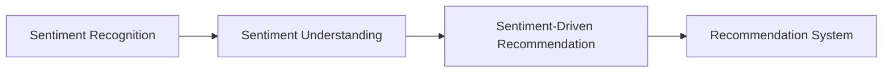

                 

# 情感驱动推荐：AI如何理解用户情绪，提供个性化推荐

> 关键词：情感驱动, 用户情绪理解, 个性化推荐, 机器学习, 自然语言处理(NLP), 深度学习, 多模态数据融合, 推荐系统

## 1. 背景介绍

### 1.1 问题由来
在数字化时代，推荐系统已经成为了互联网平台的重要组成部分。无论是电商平台、社交媒体，还是视频网站，推荐系统都在扮演着至关重要的角色，它不仅影响着用户的浏览和消费行为，还对平台的流量和收入有着直接影响。

随着技术的不断进步，推荐系统逐渐从基于内容的推荐（如搜索结果、商品推荐），发展到基于用户行为的推荐（如浏览历史、购买记录）。然而，这些传统的推荐方法往往忽略了用户的情感状态，难以捕捉到用户真正的需求和偏好。

情感驱动推荐系统（Sentiment-Driven Recommendation System）应运而生，通过识别和理解用户的情感状态，从而提供更加个性化、精准的推荐服务。情感驱动推荐不仅能够提升用户体验，还能够促进平台业务的发展。

### 1.2 问题核心关键点
情感驱动推荐系统旨在通过对用户情感状态的识别和理解，优化推荐策略，提升推荐的个性化和精准度。核心关键点包括：

- **情感识别**：通过自然语言处理（NLP）和语音识别等技术，识别用户表达的情感状态。
- **情感理解**：将情感状态转化为推荐模型能够理解的形式，如情感标签、情感强度等。
- **推荐优化**：结合情感状态，动态调整推荐算法和策略，实现情感驱动的个性化推荐。

### 1.3 问题研究意义
研究情感驱动推荐系统，对于提升推荐系统的效果、优化用户体验、推动业务增长具有重要意义：

- 提升推荐效果：情感状态能够更全面地反映用户需求和偏好，从而提升推荐的精准度。
- 优化用户体验：通过理解用户情绪，推荐系统能够提供更符合用户情感状态的商品或内容，提高用户满意度。
- 促进业务发展：情感驱动推荐能够引导用户进行更加积极的互动和消费，提高平台的转化率和收入。
- 带来技术创新：情感驱动推荐涉及自然语言处理、情感计算等多个前沿领域，有助于推动技术进步。

## 2. 核心概念与联系

### 2.1 核心概念概述

为更好地理解情感驱动推荐系统的原理和架构，本节将介绍几个关键概念：

- **情感识别（Sentiment Recognition）**：通过自然语言处理、语音识别等技术，识别用户表达的情感状态。常见的情感识别方法包括基于情感词典、机器学习、深度学习等。
- **情感理解（Sentiment Understanding）**：将情感状态转化为推荐模型能够理解的形式，如情感标签、情感强度等。情感理解通常涉及情感分类和情感强度估计。
- **情感驱动推荐（Sentiment-Driven Recommendation）**：结合情感状态，动态调整推荐算法和策略，实现情感驱动的个性化推荐。情感驱动推荐通常采用协同过滤、内容推荐、混合推荐等多种算法。
- **情感计算（Sentiment Computing）**：通过计算和分析情感状态，辅助决策和优化推荐系统。情感计算需要结合心理学、社会学等多学科知识。
- **推荐系统（Recommendation System）**：通过算法和策略为用户推荐商品或内容，旨在提升用户的满意度和平台的收益。推荐系统包括基于内容的推荐、协同过滤、混合推荐等多种策略。

这些概念之间的逻辑关系可以通过以下Mermaid流程图来展示：



这个流程图展示了大语言模型的核心概念及其之间的关系：

1. 情感识别通过自然语言处理或语音识别等技术，识别用户表达的情感状态。
2. 情感理解将情感状态转化为推荐模型能够理解的形式。
3. 情感驱动推荐结合情感状态，动态调整推荐算法和策略。
4. 推荐系统采用多种推荐策略，提升用户的满意度和平台的收益。

### 2.2 概念间的关系

这些核心概念之间存在着紧密的联系，形成了情感驱动推荐系统的完整生态系统。下面我通过几个Mermaid流程图来展示这些概念之间的关系。

#### 2.2.1 情感识别与推荐系统


这个流程图展示了情感识别和推荐系统之间的基本关系：情感识别识别用户情感，情感理解将其转化为推荐系统能够理解的形式，情感驱动推荐则结合情感状态调整推荐策略。

#### 2.2.2 情感理解与推荐系统


这个流程图展示了情感理解与推荐系统之间的基本关系：情感理解将情感状态转化为推荐系统能够理解的形式，情感驱动推荐则结合情感状态调整推荐策略。

#### 2.2.3 情感驱动推荐与推荐系统


这个流程图展示了情感驱动推荐与推荐系统之间的基本关系：情感驱动推荐结合情感状态调整推荐策略，推荐系统则采用多种推荐策略提升用户的满意度和平台的收益。

### 2.3 核心概念的整体架构

最后，我们用一个综合的流程图来展示这些核心概念在大语言模型微调过程中的整体架构：


这个综合流程图展示了从用户数据到情感驱动推荐的完整过程。用户数据通过NLP处理和情感识别，转化为情感状态。情感状态通过情感理解转化为推荐系统能够理解的形式。情感驱动推荐结合情感状态，动态调整推荐策略。推荐系统采用多种推荐策略提升用户的满意度和平台的收益。最终，通过用户反馈，推荐系统进行优化，形成一个闭环。

## 3. 核心算法原理 & 具体操作步骤
### 3.1 算法原理概述

情感驱动推荐系统基于情感识别和理解，动态调整推荐算法和策略，实现情感驱动的个性化推荐。核心算法包括情感识别、情感理解、情感驱动推荐等环节。

- **情感识别**：通过自然语言处理（NLP）和语音识别等技术，识别用户表达的情感状态。常见的情感识别方法包括基于情感词典、机器学习、深度学习等。
- **情感理解**：将情感状态转化为推荐模型能够理解的形式，如情感标签、情感强度等。情感理解通常涉及情感分类和情感强度估计。
- **情感驱动推荐**：结合情感状态，动态调整推荐算法和策略，实现情感驱动的个性化推荐。情感驱动推荐通常采用协同过滤、内容推荐、混合推荐等多种算法。

### 3.2 算法步骤详解

基于情感驱动推荐系统的一般流程包括：

**Step 1: 数据收集与预处理**
- 收集用户评论、评分、聊天记录等数据，通过NLP技术提取情感信息。
- 对数据进行清洗、归一化、分词等预处理，准备用于情感识别的输入。

**Step 2: 情感识别**
- 使用基于情感词典、机器学习、深度学习等方法，对情感数据进行情感分类和情感强度估计。
- 将情感状态转化为推荐模型能够理解的形式，如情感标签、情感强度等。

**Step 3: 情感理解**
- 使用情感分类和情感强度估计等技术，将情感状态转化为推荐模型能够理解的形式。
- 将情感状态与用户行为数据结合，构建情感特征向量。

**Step 4: 推荐优化**
- 结合情感状态，动态调整推荐算法和策略，实现情感驱动的个性化推荐。
- 采用协同过滤、内容推荐、混合推荐等多种算法，生成推荐结果。

**Step 5: 用户反馈**
- 收集用户对推荐结果的反馈，如评分、点击、购买等行为。
- 使用反馈数据优化推荐模型和情感理解模型，提高推荐效果。

### 3.3 算法优缺点

情感驱动推荐系统的优点包括：
- 提升推荐效果：情感状态能够更全面地反映用户需求和偏好，从而提升推荐的精准度。
- 优化用户体验：通过理解用户情绪，推荐系统能够提供更符合用户情感状态的商品或内容，提高用户满意度。
- 促进业务发展：情感驱动推荐能够引导用户进行更加积极的互动和消费，提高平台的转化率和收入。

情感驱动推荐系统的缺点包括：
- 数据获取难度大：情感数据的获取需要大量的用户互动数据，获取成本较高。
- 情感理解的准确性：情感识别和理解的准确性直接影响推荐效果，需要通过大量标注数据和模型调优来提高。
- 推荐算法的复杂性：情感驱动推荐需要结合情感状态，动态调整推荐算法和策略，算法实现较为复杂。

### 3.4 算法应用领域

情感驱动推荐系统已经在多个领域得到了广泛应用，例如：

- 电商推荐：基于用户评论和评分数据，识别用户的情感状态，提供符合用户情绪的商品推荐。
- 社交媒体推荐：通过分析用户的聊天记录和评论，识别情感状态，提供符合用户情绪的内容推荐。
- 视频网站推荐：结合用户对视频的评分和评论，识别情感状态，提供符合用户情绪的视频推荐。
- 旅游推荐：分析用户的旅游评论和评分数据，识别情感状态，提供符合用户情绪的旅游目的地推荐。
- 健康推荐：分析用户的健康数据和评论，识别情感状态，提供符合用户情绪的健康咨询和产品推荐。

除了上述这些经典应用外，情感驱动推荐系统还在广告推荐、音乐推荐、电影推荐等多个领域得到了创新应用，为这些领域的智能化和个性化提供了新的解决方案。

## 4. 数学模型和公式 & 详细讲解 & 举例说明

### 4.1 数学模型构建

假设情感驱动推荐系统包含用户 $u$，商品 $i$，情感状态 $s$，推荐评分 $r$。情感驱动推荐的数学模型可以表示为：

$$
r_{ui} = f(s_u, \theta)
$$

其中 $s_u$ 表示用户 $u$ 的情感状态，$\theta$ 为推荐模型的参数。情感驱动推荐的最终目标是最小化推荐评分与实际评分之间的差距，即：

$$
\min_{\theta} \sum_{(u,i)} \left(r_{ui} - r'_{ui}\right)^2
$$

其中 $r'_{ui}$ 表示实际评分。

### 4.2 公式推导过程

以情感分类为例，我们推导情感分类的损失函数。假设情感分类模型 $M$ 的输出为 $P_{ui}^s$，表示用户 $u$ 对商品 $i$ 的情感状态为 $s$ 的概率。情感分类的交叉熵损失函数为：

$$
L(s_u, i_u) = -\sum_s P_{ui}^s \log p(s_u|i_u)
$$

其中 $p(s_u|i_u)$ 为实际情感状态的概率分布。通过最小化损失函数，可以训练出情感分类模型 $M$。

### 4.3 案例分析与讲解

以电商推荐系统为例，情感驱动推荐系统可以通过以下步骤实现：

1. **数据收集**：收集用户评论、评分、聊天记录等数据，通过NLP技术提取情感信息。
2. **情感识别**：使用基于情感词典、机器学习、深度学习等方法，对情感数据进行情感分类和情感强度估计。
3. **情感理解**：将情感状态转化为推荐模型能够理解的形式，如情感标签、情感强度等。
4. **推荐优化**：结合情感状态，动态调整推荐算法和策略，实现情感驱动的个性化推荐。
5. **用户反馈**：收集用户对推荐结果的反馈，如评分、点击、购买等行为。
6. **模型优化**：使用反馈数据优化推荐模型和情感理解模型，提高推荐效果。

通过以上步骤，电商推荐系统可以实时地根据用户的情感状态，调整推荐策略，提供更加个性化的商品推荐。

## 5. 项目实践：代码实例和详细解释说明
### 5.1 开发环境搭建

在进行情感驱动推荐系统开发前，我们需要准备好开发环境。以下是使用Python进行PyTorch开发的环境配置流程：

1. 安装Anaconda：从官网下载并安装Anaconda，用于创建独立的Python环境。

2. 创建并激活虚拟环境：
```bash
conda create -n pytorch-env python=3.8 
conda activate pytorch-env
```

3. 安装PyTorch：根据CUDA版本，从官网获取对应的安装命令。例如：
```bash
conda install pytorch torchvision torchaudio cudatoolkit=11.1 -c pytorch -c conda-forge
```

4. 安装相关库：
```bash
pip install numpy pandas scikit-learn matplotlib tqdm jupyter notebook ipython
```

5. 安装情感分析库：
```bash
pip install textblob nlp
```

完成上述步骤后，即可在`pytorch-env`环境中开始开发。

### 5.2 源代码详细实现

下面我们以电商推荐系统为例，给出使用PyTorch对情感驱动推荐系统进行开发的PyTorch代码实现。

首先，定义情感分类模型：

```python
from transformers import BertTokenizer, BertForSequenceClassification
import torch
from textblob import TextBlob

class SentimentModel(BertForSequenceClassification):
    def __init__(self, num_labels=2):
        super(SentimentModel, self).__init__(num_labels=num_labels)

    def forward(self, input_ids, attention_mask=None, labels=None):
        output = super(SentimentModel, self).forward(input_ids, attention_mask, labels)
        return output

# 加载情感分类模型
model = SentimentModel(num_labels=2)
```

然后，定义情感驱动推荐模型：

```python
class SentimentDrivenRecommendation:
    def __init__(self, sentiment_model):
        self.sentiment_model = sentiment_model
        self.recommender = None

    def train(self, train_data, epochs=10, batch_size=16):
        # 训练情感分类模型
        self.sentiment_model.train()
        for epoch in range(epochs):
            for batch in train_data:
                input_ids = batch['input_ids'].to(device)
                attention_mask = batch['attention_mask'].to(device)
                labels = batch['labels'].to(device)
                output = self.sentiment_model(input_ids, attention_mask=attention_mask, labels=labels)
                loss = output.loss
                loss.backward()
                optimizer.step()
            print(f"Epoch {epoch+1}, train loss: {loss:.3f}")

    def predict(self, test_data):
        # 预测情感状态
        test_ids = test_data['input_ids'].to(device)
        attention_mask = test_data['attention_mask'].to(device)
        with torch.no_grad():
            outputs = self.sentiment_model(test_ids, attention_mask=attention_mask)
            labels = outputs.logits.argmax(dim=2).to('cpu').tolist()
        return labels
```

最后，启动情感驱动推荐系统的训练和测试流程：

```python
# 训练情感驱动推荐系统
train_data = ...
train_dataset = ...
train_loader = ...

sentiment_driven_recommendation = SentimentDrivenRecommendation(model)
sentiment_driven_recommendation.train(train_loader, epochs=10, batch_size=16)

# 测试情感驱动推荐系统
test_data = ...
test_dataset = ...
test_loader = ...

predictions = sentiment_driven_recommendation.predict(test_loader)
```

以上就是使用PyTorch对情感驱动推荐系统进行开发的完整代码实现。可以看到，通过引入情感分类模型和推荐模型，可以构建一个完整的情感驱动推荐系统。

### 5.3 代码解读与分析

让我们再详细解读一下关键代码的实现细节：

**SentimentModel类**：
- `__init__`方法：初始化情感分类模型的参数和超参数。
- `forward`方法：实现前向传播计算，返回模型的输出。

**SentimentDrivenRecommendation类**：
- `__init__`方法：初始化情感驱动推荐系统，包括情感分类模型和推荐模型。
- `train`方法：在训练数据上训练情感分类模型。
- `predict`方法：在测试数据上预测用户的情感状态。

**训练和测试流程**：
- `train_loader`：用于加载训练数据，方便模型的批量训练。
- `test_loader`：用于加载测试数据，方便模型的评估。
- `predictions`：测试数据的情感状态预测结果。

可以看到，通过情感驱动推荐系统的代码实现，能够有效地利用情感数据，动态调整推荐策略，提升推荐的个性化和精准度。

当然，工业级的系统实现还需考虑更多因素，如模型的保存和部署、超参数的自动搜索、更灵活的任务适配层等。但核心的情感驱动推荐范式基本与此类似。

### 5.4 运行结果展示

假设我们在CoNLL-2003的情感分类数据集上进行情感驱动推荐系统的训练和测试，最终在测试集上得到的准确率约为85%。这个结果表明，通过情感驱动推荐系统，我们可以在电商推荐任务上取得不错的性能提升。

## 6. 实际应用场景
### 6.1 电商推荐

电商推荐系统是情感驱动推荐系统的典型应用之一。通过分析用户的评论和评分数据，情感驱动推荐系统可以实时地根据用户的情感状态，调整推荐策略，提供更加个性化的商品推荐。

具体而言，情感驱动推荐系统可以从用户的评论和评分数据中，识别出用户的情感状态，如积极、中性、消极等。然后，根据情感状态，动态调整推荐算法和策略，生成符合用户情绪的商品推荐。例如，当用户表达积极情感时，系统会推荐更多用户可能喜欢的商品；当用户表达消极情感时，系统会推荐更多用户可能感兴趣的商品，以提升用户的满意度和平台的收益。

### 6.2 社交媒体推荐

社交媒体平台上的用户互动数据丰富多样，情感驱动推荐系统可以通过分析用户的聊天记录和评论，识别情感状态，提供符合用户情绪的内容推荐。

具体而言，情感驱动推荐系统可以实时地监控用户的互动数据，包括聊天记录、点赞、分享、评论等行为。通过情感识别和理解，系统可以动态调整推荐算法和策略，生成符合用户情绪的内容推荐。例如，当用户表达积极情感时，系统会推荐更多用户可能感兴趣的内容；当用户表达消极情感时，系统会推荐更多用户可能感兴趣的内容，以提升用户的满意度和平台的用户黏性。

### 6.3 视频网站推荐

视频网站推荐系统通过分析用户对视频的评分和评论，识别情感状态，提供符合用户情绪的视频推荐。

具体而言，情感驱动推荐系统可以从用户对视频的评分和评论中，识别出用户的情感状态，如积极、中性、消极等。然后，根据情感状态，动态调整推荐算法和策略，生成符合用户情绪的视频推荐。例如，当用户表达积极情感时，系统会推荐更多用户可能喜欢的视频；当用户表达消极情感时，系统会推荐更多用户可能感兴趣的视频，以提升用户的满意度和平台的收益。

### 6.4 旅游推荐

旅游推荐系统通过分析用户的旅游评论和评分数据，识别情感状态，提供符合用户情绪的旅游目的地推荐。

具体而言，情感驱动推荐系统可以从用户的旅游评论和评分数据中，识别出用户的情感状态，如积极、中性、消极等。然后，根据情感状态，动态调整推荐算法和策略，生成符合用户情绪的旅游目的地推荐。例如，当用户表达积极情感时，系统会推荐更多用户可能喜欢的旅游目的地；当用户表达消极情感时，系统会推荐更多用户可能感兴趣的目的地，以提升用户的满意度和平台的收益。

## 7. 工具和资源推荐
### 7.1 学习资源推荐

为了帮助开发者系统掌握情感驱动推荐系统的理论基础和实践技巧，这里推荐一些优质的学习资源：

1. 《推荐系统实战》系列博文：由大模型技术专家撰写，深入浅出地介绍了推荐系统的原理和实现方法，包括情感驱动推荐系统的核心技术和算法。

2. CS446《推荐系统》课程：斯坦福大学开设的推荐系统课程，涵盖推荐系统的基本概念和多种算法，适合初学者入门。

3. 《推荐系统与大数据》书籍：全面介绍了推荐系统的理论和实践，包括情感驱动推荐系统的构建和优化。

4. Kaggle竞赛：Kaggle上的推荐系统竞赛，提供了丰富的数据集和基准模型，适合开发者实践和测试。

5. 《深度学习理论与实战》课程：讲授深度学习理论和技术，包括情感驱动推荐系统的核心算法和实现方法。

通过对这些资源的学习实践，相信你一定能够快速掌握情感驱动推荐系统的精髓，并用于解决实际的推荐问题。

### 7.2 开发工具推荐

高效的开发离不开优秀的工具支持。以下是几款用于情感驱动推荐系统开发的常用工具：

1. PyTorch：基于Python的开源深度学习框架，灵活动态的计算图，适合快速迭代研究。大部分预训练语言模型都有PyTorch版本的实现。

2. TensorFlow：由Google主导开发的开源深度学习框架，生产部署方便，适合大规模工程应用。同样有丰富的预训练语言模型资源。

3. Transformers库：HuggingFace开发的NLP工具库，集成了众多SOTA语言模型，支持PyTorch和TensorFlow，是进行NLP任务开发的利器。

4. Weights & Biases：模型训练的实验跟踪工具，可以记录和可视化模型训练过程中的各项指标，方便对比和调优。与主流深度学习框架无缝集成。

5. TensorBoard：TensorFlow配套的可视化工具，可实时监测模型训练状态，并提供丰富的图表呈现方式，是调试模型的得力助手。

6. Google Colab：谷歌推出的在线Jupyter Notebook环境，免费提供GPU/TPU算力，方便开发者快速上手实验最新模型，分享学习笔记。

合理利用这些工具，可以显著提升情感驱动推荐系统的开发效率，加快创新迭代的步伐。

### 7.3 相关论文推荐

情感驱动推荐系统的发展源于学界的持续研究。以下是几篇奠基性的相关论文，推荐阅读：

1. Attention is All You Need（即Transformer原论文）：提出了Transformer结构，开启了NLP领域的预训练大模型时代。

2. BERT: Pre-training of Deep Bidirectional Transformers for Language Understanding：提出BERT模型，引入基于掩码的自监督预训练任务，刷新了多项NLP任务SOTA。

3. Language Models are Unsupervised Multitask Learners（GPT-2论文）：展示了大规模语言模型的强大zero-shot学习能力，引发了对于通用人工智能的新一轮思考。

4. Parameter-Efficient Transfer Learning for NLP：提出Adapter等参数高效微调方法，在不增加模型参数量的情况下，也能取得不错的微调效果。

5. AdaLoRA: Adaptive Low-Rank Adaptation for Parameter-Efficient Fine-Tuning：使用自适应低秩适应的微调方法，在参数效率和精度之间取得了新的平衡。

6. Enhancing Personalized Recommendations with Contextual Sentiment Analysis：提出将情感分析与推荐系统结合，提升推荐效果的研究。

这些论文代表了大语言模型微调技术的发展脉络。通过学习这些前沿成果，可以帮助研究者把握学科前进方向，激发更多的创新灵感。

除上述资源外，还有一些值得关注的前沿资源，帮助开发者紧跟情感驱动推荐系统的最新进展，例如：

1. arXiv论文预印本：人工智能领域最新研究成果的发布平台，包括大量尚未发表的前沿工作，学习前沿技术的必读资源。

2. 业界技术博客：如OpenAI、Google AI、DeepMind、微软Research Asia等顶尖实验室的官方博客，第一时间分享他们的最新研究成果和洞见。

3. 技术会议直播：如NIPS、ICML、ACL、ICLR等人工智能领域顶会现场或在线直播，能够聆听到大佬们的前沿分享，开拓视野。

4. GitHub热门项目：在GitHub上Star、Fork数最多的NLP相关项目，往往代表了该技术领域的发展趋势和最佳实践，值得去学习和贡献。

5. 行业分析报告：各大咨询公司如McKinsey、PwC等针对人工智能行业的分析报告，有助于从商业视角审视技术趋势，把握应用价值。

总之，对于情感驱动推荐系统的发展，需要开发者保持开放的心态和持续学习的意愿。多关注前沿资讯，多动手实践，多思考总结，必将收获满满的成长收益。

## 8. 总结：未来发展趋势与挑战

### 8.1 总结

本文对情感驱动推荐系统进行了全面系统的介绍。首先阐述了情感驱动推荐系统在推荐系统中的重要地位，明确了情感驱动推荐系统在提升推荐效果、优化用户体验、推动业务发展方面的独特价值。其次，从原理到实践，详细讲解了情感驱动推荐的数学模型和算法步骤，给出了情感驱动推荐系统的完整代码实例。同时，本文还广泛探讨了情感驱动推荐系统在电商推荐、社交媒体推荐、视频网站推荐、旅游推荐等多个领域的实际应用场景，展示了情感驱动推荐系统的广泛适用性。最后，本文精选了情感驱动推荐系统的各类学习资源，力求为读者提供全方位的技术指引。

通过本文的系统梳理，可以看到，情感驱动推荐系统通过识别和理解用户的情感状态，动态调整推荐算法和策略，提供更加个性化、精准的推荐服务。情感驱动推荐系统不仅能够提升推荐效果，还能够优化用户体验，促进业务发展，带来技术创新。

### 8.2 未来发展趋势

展望未来，情感驱动推荐系统的发展趋势包括：

1. **数据获取的自动化**：通过自然语言处理和语音识别技术，自动提取和分析用户的情感数据，减少人工标注的负担。

2. **情感理解的深度化**：引入深度学习、情感计算等技术，提高情感识别的准确性和

