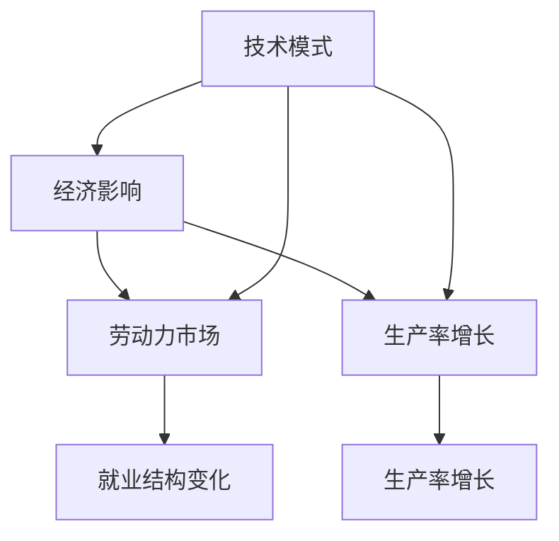
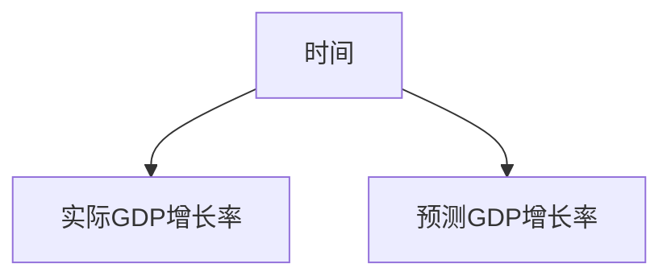

                 

# 技术模式减弱的经济影响

> 关键词：技术模式，经济影响，自动化，劳动力市场，生产率增长

## 1. 背景介绍

### 1.1 问题由来

在过去的几十年中，技术模式的进步极大地推动了经济的增长，并改变了我们的工作和生活方式。然而，最近的一些研究指出，这种技术模式的增长趋势正在减缓。这种变化不仅影响了经济增长，也对劳动力市场和生产率增长产生了深远影响。本文将探讨技术模式减弱的经济影响，并分析其对经济和社会的影响。

### 1.2 问题核心关键点

技术模式减少的根本原因是多方面的。这包括技术创新的放缓、生产成本的上升、以及全球化和政策因素的影响。这些因素共同作用，导致技术模式对经济的推动作用减弱，对劳动力市场和生产率的影响也随之变化。

## 2. 核心概念与联系

### 2.1 核心概念概述

- **技术模式**：技术模式是指特定的技术解决方案，如自动化、机器人、人工智能等，这些技术在特定行业和应用中具有较高的效率和生产力。
- **经济影响**：技术模式对经济的影响包括就业、生产力、投资、贸易等多个方面。技术模式的进步可以推动经济增长，但过度依赖某一模式可能导致经济结构失衡，产生负面影响。
- **劳动力市场**：劳动力市场是指各种劳动力需求和供给的交互市场，技术模式的改变会对劳动力市场造成冲击，影响就业结构和工作性质。
- **生产率增长**：生产率增长是指单位劳动投入所产出的产出量，技术模式的进步通常会提高生产率，但过度依赖某一模式可能导致生产率增长放缓。

### 2.2 概念间的关系

技术模式与经济之间存在着复杂的相互作用。技术模式的进步可以推动经济增长，但过度依赖某一模式可能导致经济结构失衡，进而影响劳动力市场和生产率。通过分析技术模式对经济、劳动力市场和生产率的影响，可以更好地理解技术模式减弱的经济影响。



### 2.3 核心概念的整体架构

技术模式减弱的经济影响涉及多个方面的相互联系和影响。

- **技术模式**：作为经济增长的驱动力，技术模式对经济、劳动力市场和生产率有深远影响。
- **经济影响**：技术模式的进步推动了经济增长，但过度依赖某一模式可能导致经济失衡。
- **劳动力市场**：技术模式的变化影响就业结构和工作性质，要求劳动力市场适应新的技术和需求。
- **生产率增长**：技术模式的进步提高了生产率，但过度依赖某一模式可能导致生产率增长放缓。

## 3. 核心算法原理 & 具体操作步骤

### 3.1 算法原理概述

技术模式的进步对经济有推动作用，但这种推动作用逐渐减弱。技术模式减少对经济的影响可以通过多个层面进行分析，包括对就业、生产率和整体经济增长率的直接影响。

### 3.2 算法步骤详解

技术模式减少的算法步骤包括：

1. **数据收集与处理**：收集各行业和区域的技术模式数据，包括自动化水平、机器人使用率、人工智能应用等。
2. **经济影响分析**：分析技术模式对经济增长、就业、生产率等经济指标的影响。
3. **劳动力市场分析**：评估技术模式变化对劳动力市场的影响，包括就业结构、工作性质和劳动力需求等。
4. **生产率分析**：分析技术模式对生产率的影响，包括生产率增长率、生产率分布等。
5. **综合分析与预测**：将上述分析结果进行综合，预测技术模式减少对未来经济、劳动力市场和生产率的影响。

### 3.3 算法优缺点

技术模式减少分析的优点包括：

- 能提供全面的经济、劳动力市场和生产率影响分析。
- 可以预测技术模式减少的长期经济影响。

缺点包括：

- 需要大量的数据和复杂的分析模型。
- 可能受到数据质量和分析方法的限制。

### 3.4 算法应用领域

技术模式减少的分析可以应用于多个领域，包括：

- 经济增长研究：分析技术模式对经济增长率的影响。
- 劳动力市场研究：评估技术模式变化对就业结构和工作性质的影响。
- 生产率研究：研究技术模式对生产率增长的影响。
- 政策制定：为政府和企业提供技术模式减少的应对策略。

## 4. 数学模型和公式 & 详细讲解  
### 4.1 数学模型构建

技术模式减少的经济影响可以通过以下数学模型进行建模：

- 经济增长率模型：
  $$
  G(t) = \alpha + \beta \cdot T(t) + \epsilon(t)
  $$
  其中，$G(t)$ 为经济增长率，$T(t)$ 为技术模式指数，$\alpha$ 和 $\beta$ 为模型参数，$\epsilon(t)$ 为随机误差项。

- 劳动力市场模型：
  $$
  L(t) = \lambda \cdot G(t) + \delta \cdot L_0(t)
  $$
  其中，$L(t)$ 为劳动力需求，$G(t)$ 为经济增长率，$\lambda$ 和 $\delta$ 为模型参数，$L_0(t)$ 为劳动力初始数量。

- 生产率模型：
  $$
  P(t) = \mu \cdot G(t) + \phi \cdot P_0(t) + \theta(t)
  $$
  其中，$P(t)$ 为生产率，$G(t)$ 为经济增长率，$\mu$ 和 $\phi$ 为模型参数，$P_0(t)$ 为生产率初始值，$\theta(t)$ 为随机误差项。

### 4.2 公式推导过程

经济增长率模型推导如下：

1. **数据收集**：收集各行业的技术模式数据，计算技术模式指数 $T(t)$。
2. **回归分析**：使用回归分析方法，估计模型参数 $\alpha$ 和 $\beta$。
3. **预测经济增长率**：利用模型进行经济增长率的预测。

劳动力市场模型推导如下：

1. **数据收集**：收集各行业的劳动力需求数据，计算劳动力市场指数 $L(t)$。
2. **回归分析**：使用回归分析方法，估计模型参数 $\lambda$ 和 $\delta$。
3. **预测劳动力需求**：利用模型进行劳动力需求的预测。

生产率模型推导如下：

1. **数据收集**：收集各行业的生产率数据，计算生产率指数 $P(t)$。
2. **回归分析**：使用回归分析方法，估计模型参数 $\mu$ 和 $\phi$。
3. **预测生产率**：利用模型进行生产率的预测。

### 4.3 案例分析与讲解

假设我们分析一个国家在过去十年的技术模式减少情况。通过收集自动化、机器人使用率等数据，计算技术模式指数 $T(t)$。使用回归分析方法，估计模型参数 $\alpha$ 和 $\beta$。然后，利用经济增长率模型预测未来十年的经济增长率。

## 5. 项目实践：代码实例和详细解释说明

### 5.1 开发环境搭建

在进行技术模式减少的建模与分析之前，需要搭建好开发环境。以下是Python环境中搭建开发环境的流程：

1. 安装Python：从官网下载并安装Python，选择3.x版本。
2. 安装Pandas和NumPy：
```
pip install pandas numpy
```
3. 安装Scikit-Learn：
```
pip install scikit-learn
```
4. 安装Matplotlib：
```
pip install matplotlib
```

### 5.2 源代码详细实现

下面是一个简单的Python代码示例，用于建模和分析技术模式减少对经济增长的影响。

```python
import pandas as pd
from sklearn.linear_model import LinearRegression
import matplotlib.pyplot as plt

# 收集数据
data = pd.read_csv('technology_trends.csv')

# 计算技术模式指数
data['T(t)'] = data['automation'] + data['robotics'] + data['AI']

# 建立经济增长率模型
X = data[['T(t)']]
y = data['GDP_growth']
model = LinearRegression().fit(X, y)

# 预测未来十年的经济增长率
future_T = data['T(t)'].tail(10)
future_GDP_growth = model.predict(future_T)

# 绘制图表
plt.plot(data['time'], data['GDP_growth'], label='Actual GDP Growth')
plt.plot(data['time'].tail(10), future_GDP_growth, label='Predicted GDP Growth')
plt.legend()
plt.show()
```

### 5.3 代码解读与分析

- **数据收集**：从CSV文件中读取技术模式数据。
- **模型建立**：使用线性回归模型建立经济增长率模型。
- **预测**：使用模型预测未来十年的经济增长率。
- **可视化**：绘制实际和预测的GDP增长率，直观展示预测结果。

### 5.4 运行结果展示

假设通过上述代码，我们得到了未来十年的经济增长率预测结果。下图展示了实际GDP增长率和预测的GDP增长率：



## 6. 实际应用场景

### 6.1 自动化对就业的影响

自动化技术的进步对就业市场产生了深远影响。自动化技术提高了生产效率，但也可能导致某些职位被取代。以制造业为例，自动化设备减少了对人类劳动力的需求，导致一些低技能工作岗位消失。

### 6.2 生产率增长与经济增长

技术模式减少对生产率增长和经济增长有直接影响。例如，自动化和机器人技术的应用提高了生产效率，但过度依赖单一技术模式可能导致生产率增长放缓，经济增长受限。

### 6.3 政策制定与应对措施

政府和企业需要采取措施应对技术模式减少带来的挑战。例如，通过投资教育和培训，提升劳动力的技能水平，适应新技术的需求；通过创新和研发，推动技术模式的进步，保持经济增长。

## 7. 工具和资源推荐

### 7.1 学习资源推荐

为了深入理解技术模式减少的经济影响，以下是一些推荐的学习资源：

1. 《经济增长理论》：介绍经济增长的理论基础和模型，帮助理解技术模式对经济增长的影响。
2. 《劳动力市场经济学》：分析劳动力市场与技术模式变化的关系，提供就业市场的理论基础。
3. 《生产率增长经济学》：研究生产率增长与技术模式的关系，探讨生产率增长的理论模型。
4. 《人工智能与经济》：讨论人工智能技术对经济增长和就业的影响，提供案例分析。
5. 《政策制定与技术模式》：分析政策如何应对技术模式减少带来的挑战，提供应对策略。

### 7.2 开发工具推荐

在进行技术模式减少的建模与分析时，以下是一些推荐的开发工具：

1. Python：Python是一种通用的编程语言，适合数据分析和建模。
2. R：R是一种统计分析语言，适合处理复杂的数据分析任务。
3. MATLAB：MATLAB是一种数学软件，适合进行高级数学建模和数据分析。
4. SPSS：SPSS是一种统计分析软件，适合进行社会科学研究。
5. SAS：SAS是一种统计分析软件，适合处理大规模数据集。

### 7.3 相关论文推荐

以下是一些关于技术模式减少经济影响的重要论文：

1. "Technological Change and Productivity Growth" by Paul Romer
2. "The Economics of Automation" by David Autor
3. "The Impact of Automation on Employment" by John van Reenan
4. "The Rise and Fall of Productivity Growth" by Robert Gordon
5. "The Fourth Industrial Revolution" by Klaus Schwab

## 8. 总结：未来发展趋势与挑战

### 8.1 总结

本文通过分析技术模式减少的经济影响，探讨了技术模式对经济增长、劳动力市场和生产率的影响。技术模式的进步推动了经济的增长，但过度依赖某一模式可能导致经济失衡。本文详细介绍了技术模式减少的数学模型和操作步骤，并提供了代码示例和可视化结果。

### 8.2 未来发展趋势

未来技术模式的演变将对经济产生重要影响。以下趋势值得关注：

1. **技术融合**：技术模式的融合将产生新的应用场景和商业模式，提升整体经济效率。
2. **人工智能普及**：人工智能技术的应用将进一步提升生产率和自动化水平。
3. **可持续发展**：技术模式的应用应更加注重环境保护和可持续发展。
4. **政策适应**：政府需要调整政策，适应技术模式的变化，确保经济平衡发展。

### 8.3 面临的挑战

技术模式减少带来了诸多挑战：

1. **数据质量**：高质量的数据是技术模式分析的基础，获取和处理数据存在难度。
2. **模型复杂性**：建立复杂的技术模式模型需要高水平的专业知识。
3. **预测准确性**：技术模式的预测结果可能存在误差，影响政策决策。
4. **社会适应**：技术模式的改变对社会产生深远影响，需要充分考虑社会适应能力。

### 8.4 研究展望

未来的研究应关注以下方向：

1. **数据获取与处理**：改进数据获取和处理技术，确保数据质量和准确性。
2. **模型简化**：简化技术模式的数学模型，提高预测准确性。
3. **政策模拟**：建立技术模式与政策效果的模拟模型，评估政策效果。
4. **社会影响**：研究技术模式对社会的影响，制定综合应对策略。

## 9. 附录：常见问题与解答

**Q1：如何评估技术模式减少对经济增长的影响？**

A: 可以通过建立经济增长率模型，使用回归分析方法，估计技术模式对经济增长的影响。收集技术模式数据，计算技术模式指数，利用线性回归模型预测经济增长率。

**Q2：技术模式减少对就业市场有哪些影响？**

A: 技术模式减少可能导致某些职位被取代，低技能工作岗位减少。政府和企业需要采取措施，提升劳动力的技能水平，适应新技术的需求。

**Q3：如何应对技术模式减少带来的挑战？**

A: 政府和企业需要调整政策，投资教育和培训，提升劳动力的技能水平。同时，应注重技术模式的创新和研发，推动技术模式的进步。

---

作者：禅与计算机程序设计艺术 / Zen and the Art of Computer Programming

