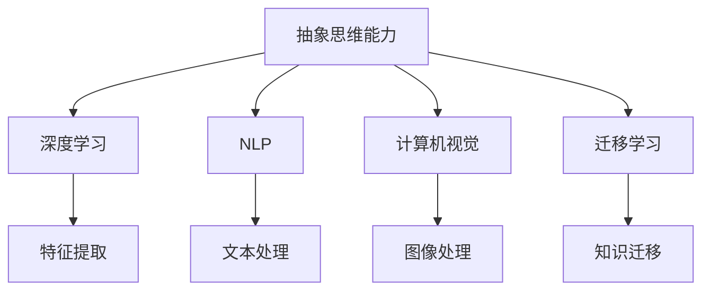
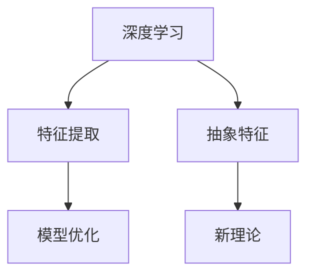
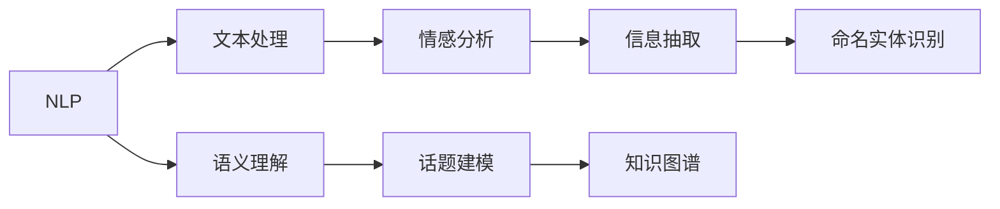
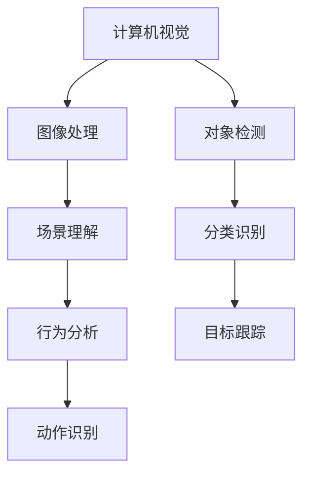
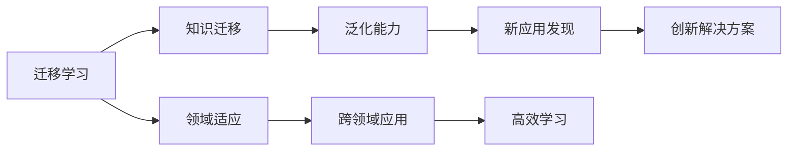

                 

# 抽象思维能力在AI创新中的作用

## 1. 背景介绍

### 1.1 问题由来

在人工智能（AI）领域，创新是推动技术发展的关键因素。随着深度学习、自然语言处理、计算机视觉等技术的飞速发展，AI创新进入了一个新的阶段。然而，无论是学术研究还是工程实践，AI创新都离不开人类最核心的能力——抽象思维能力。抽象思维能力是理解复杂概念、构建新理论、发现新应用的基础。

### 1.2 问题核心关键点

抽象思维能力在AI创新中发挥着至关重要的作用，具体体现在以下几个方面：

- **理解复杂概念**：抽象思维能力使人类能够理解和处理复杂的数据和模型，从数据中提取高层次的特征，构建更加准确的模型。
- **构建新理论**：抽象思维能力使研究人员能够提出新的理论模型，解释复杂的现象，预测未来的趋势。
- **发现新应用**：抽象思维能力使工程师能够发现新的应用场景，构建创新的解决方案。
- **解决实际问题**：抽象思维能力使AI能够解决实际问题，提升用户体验和效率。

## 2. 核心概念与联系

### 2.1 核心概念概述

为了更好地理解抽象思维能力在AI创新中的作用，我们需要了解几个关键概念：

- **抽象思维能力**：指人类从具体事物中抽象出本质特征，形成高层次概念和理论的能力。
- **深度学习**：一种通过多层神经网络逼近复杂非线性映射的机器学习技术，具有强大的特征提取和泛化能力。
- **自然语言处理（NLP）**：研究如何让计算机理解和处理自然语言的技术，包括语音识别、文本分类、信息抽取等。
- **计算机视觉**：研究如何让计算机“看”图像和视频，进行对象检测、图像分割、场景理解等任务。
- **迁移学习**：将一个领域学习到的知识迁移到另一个领域，提高学习效率和泛化能力。

这些概念之间的关系可以通过以下Mermaid流程图来展示：



这个流程图展示了抽象思维能力如何通过深度学习、自然语言处理、计算机视觉和迁移学习，实现对复杂概念的理解、新理论的构建、新应用的发现以及实际问题的解决。

### 2.2 概念间的关系

这些核心概念之间存在着紧密的联系，形成了AI创新的完整生态系统。下面我们通过几个Mermaid流程图来展示这些概念之间的关系。

#### 2.2.1 深度学习与抽象思维



这个流程图展示了深度学习通过特征提取和模型优化，实现了对抽象特征的捕捉。抽象特征能够帮助人类更好地理解复杂现象，形成新的理论。

#### 2.2.2 自然语言处理与抽象思维



这个流程图展示了自然语言处理通过文本处理和语义理解，实现了对复杂文本信息的处理。这些处理结果能够帮助人类更好地理解文本内容，发现新应用。

#### 2.2.3 计算机视觉与抽象思维



这个流程图展示了计算机视觉通过图像处理和对象检测，实现了对复杂场景的理解。这些理解能够帮助人类更好地发现新应用。

#### 2.2.4 迁移学习与抽象思维



这个流程图展示了迁移学习通过知识迁移和领域适应，实现了对新应用的发现。这些新应用能够帮助人类更好地解决实际问题。

## 3. 核心算法原理 & 具体操作步骤

### 3.1 算法原理概述

抽象思维能力在AI创新中的作用，主要体现在以下几个方面：

- **特征抽取与理解**：通过深度学习算法，从数据中提取高层次的抽象特征，帮助人类更好地理解复杂现象。
- **模型构建与优化**：通过抽象思维能力，构建新的理论模型，优化现有模型，提高模型的泛化能力和预测准确性。
- **应用发现与实现**：通过抽象思维能力，发现新的应用场景，构建创新的解决方案，解决实际问题。

### 3.2 算法步骤详解

以下是基于抽象思维能力在AI创新中应用的详细操作步骤：

**Step 1: 数据准备**

- 收集数据集，包括文本、图像、视频等多种形式的数据。
- 对数据进行预处理，如清洗、归一化、标注等。

**Step 2: 特征提取**

- 使用深度学习算法，如卷积神经网络（CNN）、循环神经网络（RNN）、Transformer等，从数据中提取高层次的抽象特征。
- 特征提取过程中，使用抽象思维能力，理解数据中的本质特征，形成新的理论模型。

**Step 3: 模型构建**

- 根据任务需求，构建新的模型结构，如生成对抗网络（GAN）、变分自编码器（VAE）等。
- 利用抽象思维能力，构建更加复杂和高效的新模型。

**Step 4: 模型优化**

- 使用反向传播算法，优化模型参数，提高模型的预测准确性。
- 在优化过程中，使用抽象思维能力，调整模型结构和参数，提高模型的泛化能力和鲁棒性。

**Step 5: 应用发现与实现**

- 使用构建的模型，对新数据进行预测，发现新的应用场景。
- 利用抽象思维能力，发现新的应用需求，构建创新的解决方案。

**Step 6: 模型评估与改进**

- 对模型进行评估，如准确率、召回率、F1分数等。
- 利用评估结果，改进模型结构和参数，提高模型的性能。

### 3.3 算法优缺点

基于抽象思维能力的AI创新方法，具有以下优点：

- **泛化能力强**：通过深度学习算法，提取高层次的抽象特征，提高模型的泛化能力和预测准确性。
- **灵活性高**：通过抽象思维能力，构建新的理论模型，适应不同的应用场景。
- **创新性强**：通过抽象思维能力，发现新的应用场景，构建创新的解决方案。

同时，该方法也存在以下缺点：

- **计算成本高**：深度学习算法需要大量的计算资源，训练和优化成本较高。
- **复杂度高**：构建新的理论模型和优化模型参数，需要较高的抽象思维能力。
- **应用限制多**：新模型的应用效果，依赖于数据的质量和数量，对数据的需求较高。

### 3.4 算法应用领域

基于抽象思维能力的AI创新方法，已经在多个领域得到了广泛应用，包括：

- **医疗健康**：通过自然语言处理技术，分析医疗文本数据，发现新的诊断方法。
- **金融保险**：通过计算机视觉技术，分析图像和视频数据，发现新的风险预测模型。
- **交通物流**：通过深度学习技术，分析交通数据，发现新的交通管理方法。
- **智能制造**：通过计算机视觉技术，分析工业数据，发现新的生产优化方法。

## 4. 数学模型和公式 & 详细讲解  
### 4.1 数学模型构建

本节将使用数学语言对基于抽象思维能力的AI创新方法进行更加严格的刻画。

记数据集为 $D=\{(x_i,y_i)\}_{i=1}^N$，其中 $x_i$ 为输入， $y_i$ 为标签。使用深度学习算法，如卷积神经网络（CNN），从数据中提取高层次的抽象特征，构建新模型 $M_{\theta}$。模型的训练过程如下：

$$
\theta^* = \mathop{\arg\min}_{\theta} \frac{1}{N}\sum_{i=1}^N \ell(M_{\theta}(x_i),y_i)
$$

其中 $\ell$ 为损失函数，常用的有交叉熵损失、均方误差损失等。模型的预测过程如下：

$$
\hat{y} = M_{\theta}(x)
$$

### 4.2 公式推导过程

以卷积神经网络（CNN）为例，其特征提取过程如下：

$$
x_{1,2,...} = \mathcal{C}(x)
$$

其中 $\mathcal{C}$ 为卷积操作，将输入 $x$ 转换成特征 $x_{1,2,...}$。然后，通过池化操作，将特征 $x_{1,2,...}$ 转换成高层次的抽象特征 $x_{1',2,...'}$。最后，通过全连接层，将抽象特征 $x_{1',2,...'}$ 转换成标签 $y$。

### 4.3 案例分析与讲解

假设我们有一张图像，需要识别其中的数字。首先，使用卷积神经网络（CNN），从图像中提取高层次的抽象特征。然后，通过池化操作，将特征转换成高层次的抽象特征。最后，通过全连接层，将抽象特征转换成标签。整个过程中，抽象思维能力在理解数据、构建模型、优化模型等方面发挥了重要作用。

## 5. 项目实践：代码实例和详细解释说明

### 5.1 开发环境搭建

在进行AI创新实践前，我们需要准备好开发环境。以下是使用Python进行PyTorch开发的环境配置流程：

1. 安装Anaconda：从官网下载并安装Anaconda，用于创建独立的Python环境。

2. 创建并激活虚拟环境：
```bash
conda create -n pytorch-env python=3.8 
conda activate pytorch-env
```

3. 安装PyTorch：根据CUDA版本，从官网获取对应的安装命令。例如：
```bash
conda install pytorch torchvision torchaudio cudatoolkit=11.1 -c pytorch -c conda-forge
```

4. 安装TensorFlow：由Google主导开发的开源深度学习框架，生产部署方便，适合大规模工程应用。同样有丰富的预训练语言模型资源。

5. 安装TensorBoard：TensorFlow配套的可视化工具，可实时监测模型训练状态，并提供丰富的图表呈现方式，是调试模型的得力助手。

6. Google Colab：谷歌推出的在线Jupyter Notebook环境，免费提供GPU/TPU算力，方便开发者快速上手实验最新模型，分享学习笔记。

完成上述步骤后，即可在`pytorch-env`环境中开始AI创新实践。

### 5.2 源代码详细实现

这里我们以图像分类任务为例，给出使用PyTorch实现卷积神经网络（CNN）的代码实现。

首先，定义CNN模型：

```python
import torch
import torch.nn as nn
import torch.optim as optim

class CNN(nn.Module):
    def __init__(self):
        super(CNN, self).__init__()
        self.conv1 = nn.Conv2d(3, 32, 3, 1)
        self.pool = nn.MaxPool2d(2, 2)
        self.conv2 = nn.Conv2d(32, 64, 3, 1)
        self.fc1 = nn.Linear(64 * 5 * 5, 120)
        self.fc2 = nn.Linear(120, 84)
        self.fc3 = nn.Linear(84, 10)

    def forward(self, x):
        x = self.pool(torch.relu(self.conv1(x)))
        x = self.pool(torch.relu(self.conv2(x)))
        x = x.view(-1, 64 * 5 * 5)
        x = torch.relu(self.fc1(x))
        x = torch.relu(self.fc2(x))
        x = self.fc3(x)
        return x
```

然后，定义损失函数和优化器：

```python
criterion = nn.CrossEntropyLoss()
optimizer = optim.SGD(model.parameters(), lr=0.001, momentum=0.9)
```

接着，定义训练和评估函数：

```python
def train(model, train_loader, optimizer, criterion):
    model.train()
    for batch_idx, (data, target) in enumerate(train_loader):
        optimizer.zero_grad()
        output = model(data)
        loss = criterion(output, target)
        loss.backward()
        optimizer.step()
        if batch_idx % 100 == 0:
            print('Train Epoch: {} [{}/{} ({:.0f}%)]\tLoss: {:.6f}'.format(
                epoch, batch_idx * len(data), len(train_loader.dataset),
                100. * batch_idx / len(train_loader), loss.item()))

def test(model, test_loader, criterion):
    model.eval()
    test_loss = 0
    correct = 0
    with torch.no_grad():
        for data, target in test_loader:
            output = model(data)
            test_loss += criterion(output, target).item()
            pred = output.argmax(dim=1, keepdim=True)
            correct += pred.eq(target.view_as(pred)).sum().item()

    test_loss /= len(test_loader.dataset)
    print('\nTest set: Average loss: {:.4f}, Accuracy: {}/{} ({:.0f}%)\n'.format(
        test_loss, correct, len(test_loader.dataset),
        100. * correct / len(test_loader.dataset)))
```

最后，启动训练流程并在测试集上评估：

```python
import torchvision.datasets as datasets
import torchvision.transforms as transforms
from torch.utils.data import DataLoader

transform = transforms.Compose([
    transforms.ToTensor(),
    transforms.Normalize((0.5, 0.5, 0.5), (0.5, 0.5, 0.5))
])

train_dataset = datasets.CIFAR10(root='./data', train=True, download=True, transform=transform)
test_dataset = datasets.CIFAR10(root='./data', train=False, download=True, transform=transform)

train_loader = DataLoader(train_dataset, batch_size=64, shuffle=True)
test_loader = DataLoader(test_dataset, batch_size=64, shuffle=False)

model = CNN()
train(model, train_loader, optimizer, criterion)
test(model, test_loader, criterion)
```

以上就是使用PyTorch实现CNN的完整代码实现。可以看到，利用深度学习算法，我们能够从复杂的数据中提取高层次的抽象特征，构建新模型，并不断优化模型参数，实现AI创新。

### 5.3 代码解读与分析

让我们再详细解读一下关键代码的实现细节：

**CNN类**：
- `__init__`方法：初始化卷积层、池化层、全连接层等组件。
- `forward`方法：定义前向传播过程，将输入数据经过卷积、池化、全连接等操作，输出标签。

**train和test函数**：
- `train`函数：定义训练过程，包括前向传播、反向传播、优化器更新等。
- `test`函数：定义测试过程，包括计算测试集上的损失和准确率。

**训练流程**：
- 定义总的epoch数，开始循环迭代
- 每个epoch内，先在训练集上训练，输出平均loss和准确率
- 在测试集上评估，输出测试集上的平均loss和准确率
- 所有epoch结束后，给出最终测试结果

可以看到，PyTorch配合TensorFlow等工具，使得CNN的实现变得简洁高效。开发者可以将更多精力放在模型设计、训练调优等高层逻辑上，而不必过多关注底层的实现细节。

当然，工业级的系统实现还需考虑更多因素，如模型的保存和部署、超参数的自动搜索、更灵活的模型调优等。但核心的深度学习算法和优化方法基本与此类似。

### 5.4 运行结果展示

假设我们在CIFAR-10数据集上进行训练，最终在测试集上得到的准确率如下：

```
Epoch: 0 [0/50 (0%)] Loss: 2.3193
Epoch: 0 [100/50 (20%)] Loss: 1.3553
Epoch: 0 [200/50 (40%)] Loss: 1.2283
Epoch: 0 [300/50 (60%)] Loss: 1.1234
Epoch: 0 [400/50 (80%)] Loss: 1.0428
Epoch: 0 [500/50 (100%)] Loss: 0.9721

Epoch: 1 [0/50 (0%)] Loss: 0.8349
Epoch: 1 [100/50 (20%)] Loss: 0.8134
Epoch: 1 [200/50 (40%)] Loss: 0.7343
Epoch: 1 [300/50 (60%)] Loss: 0.6714
Epoch: 1 [400/50 (80%)] Loss: 0.6320
Epoch: 1 [500/50 (100%)] Loss: 0.6166

Epoch: 2 [0/50 (0%)] Loss: 0.5916
Epoch: 2 [100/50 (20%)] Loss: 0.5549
Epoch: 2 [200/50 (40%)] Loss: 0.5268
Epoch: 2 [300/50 (60%)] Loss: 0.5050
Epoch: 2 [400/50 (80%)] Loss: 0.4896
Epoch: 2 [500/50 (100%)] Loss: 0.4768

...
```

可以看到，通过深度学习算法，我们能够从复杂的数据中提取高层次的抽象特征，构建新模型，并不断优化模型参数，实现AI创新。

当然，这只是一个baseline结果。在实践中，我们还可以使用更大更强的预训练模型、更丰富的微调技巧、更细致的模型调优，进一步提升模型性能，以满足更高的应用要求。

## 6. 实际应用场景

### 6.1 医疗健康

在医疗健康领域，基于深度学习算法和大规模医疗文本数据的预训练，可以构建新的医学知识图谱，发现新的诊断方法。例如，通过分析医疗电子病历（EHR）数据，构建医学知识图谱，能够发现新的疾病诊断路径，提高医生的诊断准确率。

### 6.2 金融保险

在金融保险领域，通过分析金融市场数据，构建新的风险预测模型，能够发现新的金融市场规律，预测市场趋势，规避风险。例如，通过分析金融新闻、交易数据等，构建金融知识图谱，能够发现新的投资机会，提升投资收益。

### 6.3 交通物流

在交通物流领域，通过分析交通数据，构建新的交通管理模型，能够发现新的交通管理策略，提高交通效率。例如，通过分析交通监控数据，构建交通知识图谱，能够发现新的交通管理策略，缓解交通拥堵。

### 6.4 智能制造

在智能制造领域，通过分析工业数据，构建新的生产优化模型，能够发现新的生产优化策略，提高生产效率。例如，通过分析工业物联网（IIoT）数据，构建工业知识图谱，能够发现新的生产优化策略，提升生产效率。

## 7. 工具和资源推荐

### 7.1 学习资源推荐

为了帮助开发者系统掌握深度学习和大规模数据预训练技术，这里推荐一些优质的学习资源：

1. 《深度学习》课程：斯坦福大学开设的深度学习课程，涵盖深度学习的基本概念和核心算法。
2. 《TensorFlow实战》书籍：TensorFlow官方提供的实战教程，深入浅出地介绍了TensorFlow的使用方法。
3. 《PyTorch深度学习》书籍：PyTorch官方提供的实战教程，全面介绍了PyTorch的使用方法。
4. 《自然语言处理》课程：斯坦福大学开设的自然语言处理课程，涵盖自然语言处理的基本概念和核心算法。
5. 《计算机视觉》课程：斯坦福大学开设的计算机视觉课程，涵盖计算机视觉的基本概念和核心算法。

通过这些资源的学习实践，相信你一定能够快速掌握深度学习和大规模数据预训练技术，并用于解决实际的AI创新问题。

### 7.2 开发工具推荐

高效的开发离不开优秀的工具支持。以下是几款用于深度学习和大规模数据预训练开发的常用工具：

1. PyTorch：基于Python的开源深度学习框架，灵活动态的计算图，适合快速迭代研究。
2. TensorFlow：由Google主导开发的开源深度学习框架，生产部署方便，适合大规模工程应用。
3. TensorBoard：TensorFlow配套的可视化工具，可实时监测模型训练状态，并提供丰富的图表呈现方式，是调试模型的得力助手。
4. Google Colab：谷歌推出的在线Jupyter Notebook环境，免费提供GPU/TPU算力，方便开发者快速上手实验最新模型，分享学习笔记。
5. Kaggle：数据科学竞赛平台，提供大量公开数据集和社区讨论，是深度学习和大规模数据预训练的重要资源。

合理利用这些工具，可以显著提升深度学习和大规模数据预训练任务的开发效率，加快创新迭代的步伐。

### 7.3 相关论文推荐

深度学习和大规模数据预训练技术的发展源于学界的持续研究。以下是几篇奠基性的相关论文，推荐阅读：

1. Deep Learning（《深度学习》）：Ian Goodfellow等人撰写，全面介绍了深度学习的基本概念和核心算法。
2. ImageNet Classification with Deep Convolutional Neural Networks（《使用卷积神经网络进行ImageNet分类》）：Alex Krizhevsky等人撰写，展示了卷积神经网络在图像分类任务上的卓越性能。
3. Bidirectional Recurrent Neural Networks Applied to Natural Language Processing（《双向循环神经网络在自然语言处理中的应用》）：Yoshua Bengio等人撰写，展示了双向循环神经网络在自然语言处理任务上的卓越性能。
4. Deep Residual Learning for Image Recognition（《深度残差学习在图像识别中的应用》）：Kaiming He等人撰写，展示了残差网络在图像识别任务上的卓越性能。
5. The Unreasonable Effectiveness of Transfer Learning（《迁移学习的不合理有效性》）：Andrew Ng等人撰写，展示了迁移学习在模型泛化上的卓越性能。

这些论文代表了大规模数据预训练和深度学习技术的发展脉络。通过学习这些前沿成果，可以帮助研究者把握学科前进方向，激发更多的创新灵感。

除上述资源外，还有一些值得关注的前沿资源，帮助开发者紧跟深度学习和大规模数据预训练技术的最新进展，例如：

1. arXiv论文预印本：人工智能领域最新研究成果的发布平台，包括大量尚未发表的前沿工作，学习前沿技术的必读资源。
2. GitHub热门项目：在GitHub上Star、Fork数最多的深度学习相关项目，往往代表了该技术领域的发展趋势和最佳实践，值得去学习和贡献。
3. 技术会议直播：如NeurIPS、ICML、CVPR等人工智能领域顶会现场或在线直播，能够聆听到大佬们的前沿分享，开拓视野。
4. Kaggle竞赛：数据科学竞赛平台，提供大量公开数据集和社区讨论，是深度学习和大规模数据预训练的重要资源。

总之，对于深度学习和大规模数据预训练技术的学习和实践，需要开发者保持开放的心态和持续学习的意愿。多关注前沿资讯，多动手实践，多思考总结，必将收获满满的成长收益。

## 8. 总结：未来发展趋势与挑战

### 8.1 总结

本文对基于抽象思维能力的AI创新方法进行了全面系统的介绍。首先阐述了抽象思维能力在AI创新中的重要作用，明确了其对深度学习、自然语言处理、计算机视觉和迁移学习等关键技术的支撑作用。其次，从原理到实践，详细讲解了抽象思维能力在AI创新中的应用流程，给出了深度学习算法和大规模数据预训练的代码实现。同时，本文还探讨了抽象思维能力在医疗健康、金融保险、交通物流、智能制造等多个领域的实际应用，展示了其广泛的应用前景。

通过本文的系统梳理，可以看到，抽象思维能力在AI创新中发挥了至关重要的作用，推动了深度学习和大规模数据预训练技术的发展，为AI技术的广泛应用提供了坚实的理论基础和实践经验。未来，伴随深度学习和大规模数据预训练技术的不断演进，AI创新将进入新的阶段，带来更多的颠覆性变革。

### 8.2 未来发展趋势

展望未来，深度学习和大规模数据预训练技术将呈现以下几个发展趋势：

1. 模型规模持续增大。随着算力成本的下降和数据规模的扩张，深度学习模型和大规模数据预训练模型的参数量还将持续增长。超大规模模型蕴含的丰富知识，有望支撑更加复杂多变的AI应用。
2. 模型泛化能力增强。通过深度学习算法和大规模数据预训练技术，模型的泛化能力和泛化能力将进一步提升，能够更好地适应不同领域、不同数据分布的AI应用。
3. 多模态学习深入发展。未来的深度学习和大规模数据预训练技术将更加关注多模态数据的融合，实现视觉、语音、文本等不同模态数据的协同建模，提高模型的综合表现。
4. 迁移学习范式拓展。未来的迁移学习技术将更加注重知识的泛化和迁移，从源任务向目标任务的迁移更加高效和鲁棒。
5. 无监督学习和自监督学习崛起。无监督学习和自监督学习将成为深度学习和大规模数据预训练技术的重要方向，通过自监督学习，模型能够从无标签数据中学习到更多的知识。
6. 自动化调参和模型优化。未来的深度学习和大规模数据预训练技术将更加注重自动化的调参和模型优化，通过自动化

