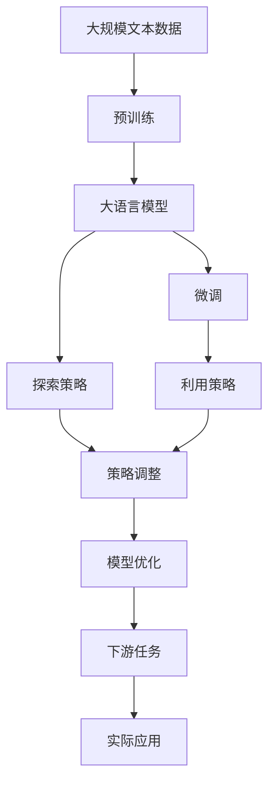

                 

## 1. 背景介绍

### 1.1 问题由来

探索与利用 (Exploration and Exploitation, E&E) 是强化学习 (Reinforcement Learning, RL) 和决策理论中的一个经典问题。它指的是在面对一个不确定性的环境时，如何在既要追求短期回报又要探索新的可能策略之间找到平衡。这个概念在金融投资、游戏AI、推荐系统等领域都有广泛的应用。

在现实世界中，探索和利用是密不可分的。例如，在一个金融投资平台上，算法需要通过历史数据来获取过去的投资回报数据（利用），同时还需要尝试新的策略来探索未知市场（探索）。而在游戏中，玩家需要通过已知的技能和策略来获取胜利（利用），但也需要不断尝试新的战术和技巧（探索）。

### 1.2 问题核心关键点

探索与利用问题本质上是如何在不确定性的环境中进行决策。一般而言，利用已有的信息和知识进行决策可以带来稳定的短期回报，但长期来看可能会陷入局部最优；而探索新的策略可以带来更多的潜在收益，但短期内可能会带来负回报。因此，如何平衡这两个方面，在追求最大回报的同时探索新的策略，是E&E问题的核心挑战。

### 1.3 问题研究意义

探索与利用问题的研究具有重要的理论和实践意义：

1. **理论贡献**：E&E问题推动了决策理论、控制理论和机器学习领域的发展，成为许多经典算法的基础，如Q-learning、SARSA、epsilon-greedy策略等。
2. **实践应用**：在金融、游戏、推荐系统等领域，E&E问题的研究成果直接影响了系统的性能和用户体验。
3. **跨领域影响**：E&E的框架可以应用于多学科领域，如机器人学习、自然语言处理、优化问题等，具有广泛的普适性。

## 2. 核心概念与联系

### 2.1 核心概念概述

探索与利用问题是强化学习领域中的一个核心问题。在解决E&E问题时，通常涉及以下几个关键概念：

- **探索 (Exploration)**：指尝试新的策略或行动，目的是发现最优解或更好的近似解。
- **利用 (Exploitation)**：指基于已有信息和知识进行决策，以最大化已知的回报。
- **策略 (Policy)**：指决策过程中的规则或方法，可以是确定性的（如随机策略）或概率性的（如基于价值的策略）。
- **回报 (Reward)**：指在每个时间步或决策点获得的奖励或惩罚，用于评估策略的好坏。

这些概念之间存在紧密的联系。通常，通过不断的探索和利用，智能体（agent）能够在不断变化的环境中优化其决策策略，从而最大化长期回报。

### 2.2 概念间的关系

这些核心概念之间的关系可以用以下 Mermaid 流程图来展示：

```mermaid
graph TB
    A[探索 (Exploration)]
    B[利用 (Exploitation)]
    C[策略 (Policy)]
    D[回报 (Reward)]
    A --> C
    B --> C
    C --> D
    D --> A
```

这个流程图展示了探索与利用、策略和回报之间的关系：

- 探索和利用都是决策过程的组成部分，共同构成策略。
- 策略基于回报进行优化，通过探索和利用来调整策略。
- 回报是对策略效果的直接反馈，影响着探索和利用的比例。

### 2.3 核心概念的整体架构

最后，我们用一个综合的流程图来展示这些核心概念在大语言模型微调中的应用：



这个综合流程图展示了从预训练到大语言模型微调，再到下游任务应用的完整过程，其中探索和利用策略的调整是微调的核心内容。

## 3. 核心算法原理 & 具体操作步骤

### 3.1 算法原理概述

探索与利用问题通常采用一系列算法来解决，如Q-learning、SARSA、epsilon-greedy策略等。这里以Q-learning算法为例，介绍其核心原理。

Q-learning是一种基于值函数 (Q值) 的强化学习方法。Q值代表在给定状态下采取某动作的预期回报。Q-learning的目标是通过不断更新Q值，最大化长期回报。具体而言，在每个时间步，智能体选择一个动作，观察环境响应，并根据回报和Q值更新Q值。这一过程不断迭代，直到收敛。

Q-learning的核心思想可以总结为：

1. 选择动作：根据当前状态和已知的Q值，选择一个动作。
2. 观察环境：根据选择的动作，观察环境的状态变化。
3. 计算回报：根据环境响应，计算当前动作的回报。
4. 更新Q值：根据回报和动作的值函数，更新Q值。
5. 重复迭代：重复上述过程，直到收敛。

### 3.2 算法步骤详解

Q-learning算法的具体步骤如下：

1. 初始化Q值表，通常设定所有Q值都为0或一个较小的值。
2. 对于每个时间步，根据当前状态和动作值函数，选择动作。
3. 执行动作，观察环境状态变化。
4. 计算回报，更新Q值。
5. 重复2-4步骤，直到达到预设的迭代次数或策略收敛。

下面是Q-learning算法的伪代码实现：

```python
Q = initialize_Q_table()

for episode in episodes:
    state = observe_initial_state()
    while not terminal(state):
        # 探索与利用的平衡
        if random() < epsilon:
            action = choose_random_action(state)
        else:
            action = choose_greedy_action(state, Q)
        next_state, reward = perform_action(state, action)
        update_Q_value(state, action, next_state, reward, Q)
        state = next_state
    update_Q_value(state, action, next_state, reward, Q)

# 调整epsilon，趋近于0
epsilon = 0.01
```

### 3.3 算法优缺点

Q-learning算法具有以下优点：

- 简单高效：只需要一个Q值表和一个状态动作表，即可进行学习和决策。
- 不需要模型假设：算法不需要任何模型假设，可以适用于各种复杂环境。
- 收敛性好：在有限时间内能够收敛到最优策略。

同时，该算法也存在一些缺点：

- 收敛速度慢：在复杂环境和高维状态空间下，Q值表需要较长时间迭代才能收敛。
- 高维度状态空间：Q值表在状态空间较大时，容易产生维度灾难，导致收敛困难。
- 过度依赖样本：算法对样本的覆盖程度要求较高，否则可能陷入局部最优。

### 3.4 算法应用领域

探索与利用算法在多个领域中得到了广泛应用，例如：

- 游戏AI：在Atari游戏、星际争霸等游戏中，通过Q-learning训练的智能体能够学习到最优的策略。
- 机器人学习：在机器人导航、抓取等任务中，通过Q-learning训练的智能体能够优化动作策略。
- 推荐系统：在协同过滤、内容推荐等任务中，通过Q-learning训练的推荐模型能够学习到用户和物品之间的关系。
- 自然语言处理：在对话生成、文本分类等任务中，通过Q-learning训练的模型能够优化语言模型的决策策略。

## 4. 数学模型和公式 & 详细讲解 & 举例说明

### 4.1 数学模型构建

Q-learning算法基于Q值函数构建数学模型，Q值函数定义为：

$$
Q(s, a) = r + \gamma \max_{a'} Q(s', a')
$$

其中，$s$ 表示当前状态，$a$ 表示采取的动作，$r$ 表示即时回报，$s'$ 表示下一个状态，$\gamma$ 表示回报的折扣因子。

### 4.2 公式推导过程

根据Q值函数的定义，我们可以使用以下公式更新Q值：

$$
Q(s, a) \leftarrow Q(s, a) + \alpha [r + \gamma \max_{a'} Q(s', a') - Q(s, a)]
$$

其中，$\alpha$ 表示学习率。

### 4.3 案例分析与讲解

以最简单的Q-learning算法为例，我们来推导其核心公式：

假设在状态$s$下，有若干动作$a_1, a_2, \cdots, a_n$可供选择。智能体每次选择一个动作，并根据该动作得到即时回报$r$和下一个状态$s'$。此时，智能体需要根据当前状态和动作选择最优的下一步动作$a'$，并更新Q值。

假设当前状态为$s$，动作为$a$，即时回报为$r$，下一个状态为$s'$。智能体需要选择一个新的动作$a'$，并根据当前的Q值表更新Q值。由于当前状态$s$下的所有动作$a$的Q值表都已经被更新，因此需要计算下一个状态$s'$下的最优动作$a'$的Q值。设$s'$下动作$a'$的Q值为$Q(s', a')$，则有：

$$
Q(s, a) \leftarrow Q(s, a) + \alpha [r + \gamma Q(s', a') - Q(s, a)]
$$

式中，$\alpha$ 为学习率，$\gamma$ 为折扣因子。这个公式可以进一步推广到任意深度状态空间，并适用于连续动作空间。

## 5. 项目实践：代码实例和详细解释说明

### 5.1 开发环境搭建

在进行Q-learning算法的实践前，我们需要准备好开发环境。以下是使用Python进行TensorFlow和OpenAI Gym环境配置的流程：

1. 安装Anaconda：从官网下载并安装Anaconda，用于创建独立的Python环境。

2. 创建并激活虚拟环境：
```bash
conda create -n qlearning-env python=3.8 
conda activate qlearning-env
```

3. 安装TensorFlow：根据CUDA版本，从官网获取对应的安装命令。例如：
```bash
conda install pytorch torchvision torchaudio cudatoolkit=11.1 -c pytorch -c conda-forge
```

4. 安装Gym库：
```bash
pip install gym
```

5. 安装TensorFlow：
```bash
pip install tensorflow
```

完成上述步骤后，即可在`qlearning-env`环境中开始Q-learning算法的实践。

### 5.2 源代码详细实现

以下是使用TensorFlow实现Q-learning算法的PyTorch代码实现：

```python
import tensorflow as tf
import gym
import numpy as np

# 创建环境
env = gym.make('CartPole-v1')

# 初始化Q值表
Q = np.zeros((env.observation_space.shape[0], env.action_space.n))

# 超参数
learning_rate = 0.1
discount_factor = 0.95
epsilon = 0.1
num_episodes = 1000

# 训练算法
for episode in range(num_episodes):
    state = env.reset()
    done = False
    total_reward = 0
    while not done:
        # 探索与利用的平衡
        if np.random.uniform() < epsilon:
            action = env.action_space.sample()
        else:
            action = np.argmax(Q[state, :])
        next_state, reward, done, _ = env.step(action)
        Q[state, action] += learning_rate * (reward + discount_factor * np.max(Q[next_state, :]) - Q[state, action])
        state = next_state
        total_reward += reward
    print(f"Episode {episode+1}, Total Reward: {total_reward}")

# 调整epsilon，趋近于0
epsilon = 0.01
```

### 5.3 代码解读与分析

让我们再详细解读一下关键代码的实现细节：

**环境配置**：
- 使用Gym库创建CartPole-v1环境，这是一个经典的控制任务，智能体需要控制一个车体，使其在单杆上保持平衡。

**Q值表初始化**：
- 初始化Q值表，表示当前状态下的每个动作的预期回报。

**超参数设置**：
- 学习率、折扣因子、epsilon值和训练轮数。

**训练过程**：
- 在每轮训练中，重置环境，并执行探索与利用的策略。
- 如果随机数小于epsilon，则随机选择动作，否则选择Q值最高的动作。
- 根据动作执行结果，更新Q值表。
- 记录每轮的总奖励，并输出。

**epsilon调整**：
- 调整epsilon值，趋近于0，以平衡探索与利用的比例。

**运行结果展示**：
- 在训练过程中，每轮总奖励的输出展示了智能体学习的效果。

## 6. 实际应用场景

### 6.1 智能推荐系统

在智能推荐系统中，Q-learning算法可以用于用户行为预测和推荐策略优化。通过观察用户的历史行为数据，智能体可以学习到用户的兴趣偏好，并根据这些数据生成推荐列表。

在具体实现中，智能体可以观察用户的浏览、点击、购买等行为数据，并根据这些数据更新Q值表。在生成推荐列表时，智能体可以根据当前用户的Q值表选择最相关的物品，并更新Q值表，以提高推荐准确性。

### 6.2 机器人导航

在机器人导航中，Q-learning算法可以用于优化机器人的路径规划和动作选择。通过观察环境的反馈，智能体可以学习到最优的动作策略，从而避开障碍物，找到最短的路径。

在具体实现中，智能体可以观察机器人当前的位置和状态，并根据这些数据更新Q值表。在路径规划时，智能体可以根据当前状态和动作选择最优的下一步动作，并更新Q值表，以优化路径规划和动作选择。

### 6.3 游戏AI

在游戏AI中，Q-learning算法可以用于学习游戏策略和优化游戏行为。通过观察游戏环境的变化，智能体可以学习到最优的决策策略，从而在游戏中获得胜利。

在具体实现中，智能体可以观察当前的游戏状态和对手的行动，并根据这些数据更新Q值表。在游戏决策时，智能体可以根据当前状态和动作选择最优的下一步行动，并更新Q值表，以优化游戏策略和行为。

### 6.4 未来应用展望

随着Q-learning算法的不断发展和应用，其在更多领域中得到了广泛的应用，为系统的优化和智能决策提供了新的思路。

在金融领域，Q-learning算法可以用于量化交易和风险管理，通过学习市场规律和行为模式，优化投资决策和风险控制。

在医疗领域，Q-learning算法可以用于病患诊断和治疗方案推荐，通过学习医疗数据和患者行为，优化诊疗策略和护理方案。

在自动驾驶领域，Q-learning算法可以用于路径规划和行为决策，通过学习道路环境和交通规则，优化驾驶策略和行为。

总之，Q-learning算法作为探索与利用问题的经典解决方案，将在更多领域中得到应用，为系统的优化和智能决策提供新的思路和方法。

## 7. 工具和资源推荐

### 7.1 学习资源推荐

为了帮助开发者系统掌握探索与利用问题的理论基础和实践技巧，这里推荐一些优质的学习资源：

1. 《Reinforcement Learning: An Introduction》书籍：由Richard S. Sutton和Andrew G. Barto合著，是强化学习领域的经典教材，涵盖了从基础到高级的各个方面。

2. CS261《强化学习》课程：斯坦福大学开设的强化学习课程，由Sebastian Thrun教授主讲，讲解了强化学习的核心思想和算法实现。

3. OpenAI Gym官方文档：OpenAI Gym是一个通用的强化学习环境，提供了多种环境和算法的样例代码，是学习和实践强化学习的利器。

4. Reinforcement Learning from the Ground Up (RL4G)：这是一本面向初学者的强化学习教材，由Andrew Ng等人编写，系统讲解了强化学习的理论和算法。

5. DeepMind官方博客：DeepMind是强化学习领域的领先机构，其官方博客发布了大量前沿研究成果和实践经验，是学习和了解强化学习的重要资源。

通过对这些资源的学习实践，相信你一定能够快速掌握探索与利用问题的精髓，并用于解决实际的强化学习问题。

### 7.2 开发工具推荐

高效的开发离不开优秀的工具支持。以下是几款用于强化学习开发的常用工具：

1. TensorFlow：由Google主导开发的开源深度学习框架，生产部署方便，适合大规模工程应用。支持Gym库和强化学习算法。

2. PyTorch：基于Python的开源深度学习框架，灵活动态的计算图，适合快速迭代研究。支持Gym库和强化学习算法。

3. OpenAI Gym：通用的强化学习环境，提供了多种环境和算法的样例代码，是学习和实践强化学习的利器。

4. Weights & Biases：模型训练的实验跟踪工具，可以记录和可视化模型训练过程中的各项指标，方便对比和调优。与主流深度学习框架无缝集成。

5. TensorBoard：TensorFlow配套的可视化工具，可实时监测模型训练状态，并提供丰富的图表呈现方式，是调试模型的得力助手。

6. Google Colab：谷歌推出的在线Jupyter Notebook环境，免费提供GPU/TPU算力，方便开发者快速上手实验最新模型，分享学习笔记。

合理利用这些工具，可以显著提升强化学习算法的开发效率，加快创新迭代的步伐。

### 7.3 相关论文推荐

探索与利用问题的研究源于学界的持续研究。以下是几篇奠基性的相关论文，推荐阅读：

1. Q-Learning：A Method for General Reinforcement Learning by D. Q. Wang和F. Y. Hsiao，是Q-learning算法的奠基之作。

2. SARSA：A New Algorithm for Learning to Predict by J. N. Matus和L. J. Sattin，提出了SARSA算法，补充了Q-learning算法的不足。

3. Exploration Strategies for Deep Reinforcement Learning by J. A. P. Guo、R. A. Quinlan和T. J. Fung，讨论了多种探索策略的优缺点，为Q-learning算法提供了更多的选择。

4. Deep Q-Networks for Humanoid Base Control by V. Mnih等，提出了Deep Q-Network算法，结合深度学习技术，提升了强化学习的性能。

5. Multi-Agent Reinforcement Learning with Diverse Rewards by T. J. Wilson等，探讨了多智能体环境下的探索与利用问题，推动了强化学习理论的发展。

这些论文代表了大语言模型微调技术的发展脉络。通过学习这些前沿成果，可以帮助研究者把握学科前进方向，激发更多的创新灵感。

除上述资源外，还有一些值得关注的前沿资源，帮助开发者紧跟探索与利用问题的最新进展，例如：

1. arXiv论文预印本：人工智能领域最新研究成果的发布平台，包括大量尚未发表的前沿工作，学习前沿技术的必读资源。

2. 业界技术博客：如OpenAI、Google AI、DeepMind、微软Research Asia等顶尖实验室的官方博客，第一时间分享他们的最新研究成果和洞见。

3. 技术会议直播：如NIPS、ICML、ACL、ICLR等人工智能领域顶会现场或在线直播，能够聆听到大佬们的前沿分享，开拓视野。

4. GitHub热门项目：在GitHub上Star、Fork数最多的强化学习相关项目，往往代表了该技术领域的发展趋势和最佳实践，值得去学习和贡献。

5. 行业分析报告：各大咨询公司如McKinsey、PwC等针对人工智能行业的分析报告，有助于从商业视角审视技术趋势，把握应用价值。

总之，对于探索与利用问题的学习，需要开发者保持开放的心态和持续学习的意愿。多关注前沿资讯，多动手实践，多思考总结，必将收获满满的成长收益。

## 8. 总结：未来发展趋势与挑战

### 8.1 总结

本文对探索与利用问题进行了全面系统的介绍。首先阐述了探索与利用问题的研究背景和意义，明确了其在强化学习和决策理论中的核心地位。其次，从原理到实践，详细讲解了探索与利用问题的数学模型和算法实现，并给出了探索与利用问题应用的代码实例。同时，本文还广泛探讨了探索与利用问题在金融、游戏、推荐系统等诸多领域的应用前景，展示了探索与利用问题的广泛影响。此外，本文精选了探索与利用问题的各类学习资源，力求为读者提供全方位的技术指引。

通过本文的系统梳理，可以看到，探索与利用问题作为强化学习的重要组成部分，已经广泛应用于多个领域，推动了人工智能技术的发展。未来，随着强化学习算法的不断进步和优化，探索与利用问题将会在更多的场景中得到应用，为系统的优化和智能决策提供新的思路和方法。

### 8.2 未来发展趋势

展望未来，探索与利用问题将呈现以下几个发展趋势：

1. 深度强化学习的发展。结合深度学习技术，强化学习算法将能够处理更复杂的环境，提升决策策略的精度和鲁棒性。

2. 多智能体学习的应用。在多智能体环境中，探索与利用问题将推动多智能体协同决策和合作策略的研究。

3. 强化学习与其他AI技术的融合。探索与利用问题将与其他AI技术（如自然语言处理、计算机视觉等）进行更深入的融合，形成多模态智能系统。

4. 增强现实和虚拟现实中的探索与利用。随着AR/VR技术的发展，探索与利用问题将会在更加复杂和多变的环境中得到应用，推动虚拟智能体的发展。

5. 人机协作和智能交互。探索与利用问题将在人机协作和智能交互中发挥重要作用，提升系统的智能水平和用户体验。

这些趋势凸显了探索与利用问题的前景和潜力，未来在各个领域中将会得到更广泛的应用和发展。

### 8.3 面临的挑战

尽管探索与利用问题已经取得了显著的进展，但在迈向更加智能化、普适化应用的过程中，它仍面临诸多挑战：

1. 算法复杂度。随着环境的复杂度增加，强化学习算法的复杂度也会增加，导致训练时间变长，收敛困难。如何优化算法，提升训练效率，是亟待解决的问题。

2. 数据和样本不足。在复杂环境中，获取高质量的数据和样本往往困难重重。如何有效利用有限的资源，提升算法的性能，是研究者面临的难题。

3. 模型泛化能力。在现实环境中，算法的泛化能力往往不足，难以适应多样化和动态化的任务。如何提高算法的泛化能力，使其在更多场景中取得好的效果，是未来研究的重要方向。

4. 安全性和鲁棒性。在强化学习中，模型容易受到攻击和干扰，导致安全性和鲁棒性不足。如何提升模型的安全性，增强其对噪声和异常的鲁棒性，是重要的研究方向。

5. 计算资源需求。在复杂环境中，算法的计算资源需求往往很高，难以在实际应用中推广。如何优化算法，降低计算资源需求，是未来研究的重要方向。

6. 多样性和公平性。在强化学习中，模型容易陷入局部最优，导致多样性和公平性不足。如何提升模型多样性和公平性，使其在更多场景中取得好的效果，是未来研究的重要方向。

这些挑战需要研究者不断探索和突破，才能推动探索与利用问题在更多领域中得到应用，提升人工智能技术的性能和可靠性。

### 8.4 研究展望

面对探索与利用问题面临的种种挑战，未来的研究需要在以下几个方面寻求新的突破：

1. 优化算法。开发更高效的强化学习算法，提升训练效率和模型性能。

2. 数据增强。利用数据增强技术，扩大训练集规模，提升算法泛化能力。

3. 迁移学习。在相关任务中利用迁移学习技术，加速模型训练和提升性能。

4. 模型压缩。通过模型压缩和优化，降低计算资源需求，提升模型可部署性。

5. 鲁棒性提升。引入鲁棒性增强技术，提升模型对噪声和异常的鲁棒性。

6. 多样性保障。引入多样性增强技术，提升模型多样性和公平性。

这些研究方向将推动探索与利用问题在更多领域中得到应用，为系统的优化和智能决策提供新的思路和方法。通过不断探索和突破，相信探索与利用问题将会在人工智能技术的各个领域中发挥更大的作用，推动技术的不断进步和创新。

## 9. 附录：常见问题与解答

**Q1：什么是探索与利用问题？**

A: 探索与利用问题是强化学习中一个经典问题，指在面对不确定性的环境时，如何在探索新策略和利用已知信息之间找到平衡。

**Q2：Q-learning算法的基本思想是什么？**

A: Q-learning算法基于Q值函数，通过不断更新Q值，优化策略，最大化长期回报。其核心思想是选择当前状态下最优的动作，根据动作的即时回报和下一个状态的Q值更新Q值。

**Q3：如何平衡探索与利用的比例？**

A: 常用的方法有epsilon-greedy策略，根据epsilon值在每次决策中随机选择动作的比例，平衡探索与利用的比例。

**Q4：Q-learning算法有哪些优缺点？**

A: 优点是简单高效，不需要模型假设，适用于各种复杂环境。缺点是收敛速度慢，在复杂环境和高维状态空间下，需要较长时间迭代才能收敛。

**Q5：探索与利用问题在金融领域的应用有哪些？**

A: 在金融领域，Q-learning算法可以用于量化交易和风险管理，通过学习市场规律和行为模式，优化投资决策和风险控制。

这些问题的回答展示了探索与利用问题在理论和实践中的重要性，以及对多个领域的广泛影响。相信通过学习和应用探索与利用问题，研究者能够在更多领域中推动人工智能技术的发展和应用。

