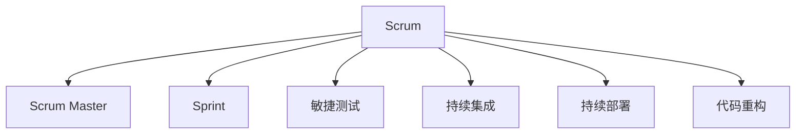
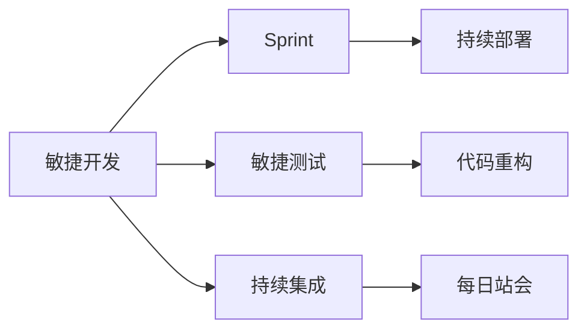

                 

# 敏捷开发与快速迭代原理与代码实战案例讲解

> 关键词：敏捷开发,快速迭代,Scrum,Scrum Master,敏捷测试,持续集成,代码重构,自动化测试

## 1. 背景介绍

### 1.1 问题由来
在软件开发的进程中，传统的瀑布模型方法，即先进行需求分析、设计、编码、测试等阶段，再进行部署和维护，已经不能适应当前快速变化的市场需求和技术环境。一方面，软件项目的时间周期越来越短，客户对交付速度的要求越来越高；另一方面，技术的更新迭代速度不断加快，软件产品的生命周期日益缩短，传统的线性流程无法及时响应用户和市场变化。

敏捷开发作为一种适应这些挑战的方法论，在近年来得到了广泛的认可和应用。敏捷开发强调团队协作、持续反馈和快速迭代，通过小规模的、高频次的迭代，不断交付可工作的软件产品，并根据用户和市场的反馈进行持续改进。

### 1.2 问题核心关键点
敏捷开发的核心思想可以概括为“适应变化、快速响应、持续交付、持续反馈”。通过敏捷开发，项目团队能够在不断变化的环境中灵活应对需求，快速交付高质量的软件产品，并通过持续反馈不断提升产品品质。

敏捷开发的核心工具和技术包括Scrum、Kanban、持续集成(CI)、持续部署(CD)等。其中，Scrum作为敏捷开发中最具代表性和成熟度的方法论，通过Scrum Master的角色、Sprint计划和回顾、每日站会等实践，帮助团队实现敏捷开发。

### 1.3 问题研究意义
敏捷开发与快速迭代的方法论，对于提升软件开发效率、缩短项目周期、增强客户满意度、优化产品品质等方面具有重要意义：

1. 提升软件开发效率：敏捷开发通过频繁的迭代和反馈，不断优化产品设计和实现，避免了大规模的需求变更和返工，提升了开发效率。
2. 缩短项目周期：敏捷开发通过细粒度划分迭代周期，不断交付可工作的软件产品，显著缩短了项目周期。
3. 增强客户满意度：敏捷开发通过持续反馈和快速响应，不断根据客户需求进行调整和改进，提高了客户满意度。
4. 优化产品品质：敏捷开发通过敏捷测试、持续集成等技术，提升了软件产品的稳定性和可靠性。
5. 适应市场变化：敏捷开发能够快速响应市场和技术变化，保持产品的竞争力和市场竞争力。

## 2. 核心概念与联系

### 2.1 核心概念概述

为更好地理解敏捷开发与快速迭代方法，本节将介绍几个密切相关的核心概念：

- Scrum：一种敏捷开发方法论，通过Sprint迭代、每日站会、回顾会议等实践，帮助团队实现敏捷开发。
- Scrum Master：Scrum中的一个角色，负责促进团队协作、处理障碍、维护Scrum框架等，确保Scrum的有效运行。
- Sprint：Scrum中的一个迭代周期，通常为2-4周，团队在此期间内交付可工作的产品增量。
- 敏捷测试：通过频繁的迭代测试，快速发现和修复问题，提升软件产品质量。
- 持续集成(CI)：一种软件开发实践，通过自动化的构建和测试，确保软件的稳定性和可部署性。
- 持续部署(CD)：一种软件开发实践，通过自动化的部署流程，快速将软件交付给用户，实现快速交付和反馈。
- 代码重构：通过优化代码结构和功能，提升软件系统的可维护性和可扩展性。

这些核心概念之间的逻辑关系可以通过以下Mermaid流程图来展示：



这个流程图展示了大规模语言模型的核心概念及其之间的关系：

1. Scrum作为敏捷开发的核心方法论，通过Sprint迭代和每日站会等实践，帮助团队实现敏捷开发。
2. Scrum Master负责促进团队协作，处理障碍，维护Scrum框架等，确保Scrum的有效运行。
3. Sprint作为Scrum的一个迭代周期，团队在此期间内交付可工作的产品增量。
4. 敏捷测试通过频繁的迭代测试，快速发现和修复问题，提升软件产品质量。
5. 持续集成通过自动化的构建和测试，确保软件的稳定性和可部署性。
6. 持续部署通过自动化的部署流程，快速将软件交付给用户，实现快速交付和反馈。
7. 代码重构通过优化代码结构和功能，提升软件系统的可维护性和可扩展性。

### 2.2 概念间的关系

这些核心概念之间存在着紧密的联系，形成了敏捷开发与快速迭代的全局生态系统。下面我通过几个Mermaid流程图来展示这些概念之间的关系。

#### 2.2.1 敏捷开发与快速迭代的整体架构



这个综合流程图展示了敏捷开发与快速迭代的整体架构：

1. 敏捷开发通过Sprint迭代，实现快速交付和持续改进。
2. 敏捷测试通过频繁的迭代测试，快速发现和修复问题，提升软件产品质量。
3. 持续集成通过自动化的构建和测试，确保软件的稳定性和可部署性。
4. 持续部署通过自动化的部署流程，快速将软件交付给用户，实现快速交付和反馈。
5. 代码重构通过优化代码结构和功能，提升软件系统的可维护性和可扩展性。
6. 每日站会通过团队协作和问题反馈，确保Scrum的有效运行。

## 3. 核心算法原理 & 具体操作步骤
### 3.1 算法原理概述

敏捷开发与快速迭代方法，其核心原理是通过小规模的、高频次的迭代，不断交付可工作的软件产品，并根据用户和市场的反馈进行持续改进。

形式化地，假设敏捷开发项目周期为$T$天，每次迭代周期为$D$天，每次交付的产品增量为$V$。则通过$N$次迭代，项目的总交付量$X$为：

$$
X = \frac{T}{D} \times V
$$

每次迭代过程中，团队需要根据用户和市场反馈进行调整，优化产品设计和实现，提高产品质量。通过多次迭代，不断累积交付量和产品改进，最终实现项目的整体目标。

### 3.2 算法步骤详解

敏捷开发与快速迭代的具体操作步骤如下：

**Step 1: 项目计划和准备**

- 确定项目需求和目标。
- 组建敏捷开发团队，包括Scrum Master、开发人员、测试人员等。
- 制定项目计划，包括需求分析、设计、开发、测试等各个阶段。
- 分配任务和资源，确定每个迭代周期的交付目标。

**Step 2: 进行Sprint迭代**

- 进入第一个Sprint迭代，为期$D$天。
- 在Sprint计划会议中，团队共同确定迭代目标和任务。
- 每天进行每日站会，跟踪任务进度，解决问题和障碍。
- 完成迭代任务，进行Sprint回顾会议，总结经验教训。

**Step 3: 交付和反馈**

- 交付Sprint期间开发的产品增量。
- 根据用户和市场反馈，进行持续改进和优化。
- 进入下一个Sprint迭代，重复上述步骤，直至项目完成。

**Step 4: 持续集成和部署**

- 引入持续集成(CI)技术，自动化构建和测试。
- 通过持续部署(CD)技术，快速将软件交付给用户，实现快速交付和反馈。

**Step 5: 代码重构和优化**

- 定期进行代码重构，提升代码质量和可维护性。
- 引入代码审查制度，确保代码质量和规范。

### 3.3 算法优缺点

敏捷开发与快速迭代方法，具有以下优点：

1. 快速响应变化：通过小规模的、高频次的迭代，快速适应需求变化，提升项目灵活性。
2. 持续改进：通过频繁的迭代测试和反馈，不断优化产品设计和实现，提高产品质量。
3. 客户满意度：通过持续反馈和快速响应，不断根据客户需求进行调整和改进，提高客户满意度。
4. 降低风险：通过高频次的迭代，及时发现和修复问题，降低项目风险。

同时，该方法也存在一些局限性：

1. 初期成本较高：敏捷开发需要建立完善的项目管理流程和团队协作机制，初期成本较高。
2. 需要高素质团队：敏捷开发需要高素质的开发和测试人员，团队协作要求高。
3. 技术栈限制：敏捷开发需要引入新的技术栈，如CI/CD、自动化测试等，对技术要求较高。
4. 需求管理复杂：敏捷开发需要频繁的迭代需求变更，需求管理复杂度较高。

### 3.4 算法应用领域

敏捷开发与快速迭代方法，在软件开发、系统集成、项目管理等领域得到了广泛应用，具体包括：

- 软件开发：通过敏捷开发，快速响应市场变化，提升产品交付速度和质量。
- 系统集成：通过持续集成和持续部署，快速将软件集成到现有系统中，实现无缝集成。
- 项目管理：通过敏捷开发，优化项目管理和团队协作，提升项目管理效率。
- 产品开发：通过敏捷开发，快速迭代和反馈，提升产品质量和用户体验。
- 技术创新：通过敏捷开发，快速试错和优化，推动技术创新和应用。

## 4. 数学模型和公式 & 详细讲解  
### 4.1 数学模型构建

本节将使用数学语言对敏捷开发与快速迭代方法进行更加严格的刻画。

假设敏捷开发项目周期为$T$天，每次迭代周期为$D$天，每次交付的产品增量为$V$。则通过$N$次迭代，项目的总交付量$X$为：

$$
X = \frac{T}{D} \times V
$$

每次迭代过程中，团队需要根据用户和市场反馈进行调整，优化产品设计和实现，提高产品质量。通过多次迭代，不断累积交付量和产品改进，最终实现项目的整体目标。

### 4.2 公式推导过程

以下我们以软件开发为例，推导敏捷开发与快速迭代方法的计算公式。

假设软件开发项目需要开发$F$个功能模块，每个模块的开发周期为$P$天，团队每天可以完成的工作量为$W$。则项目的总开发周期$T$为：

$$
T = F \times P
$$

假设团队每天可以完成的工作量为$W$，则每次迭代周期内可以完成的功能模块数量为：

$$
N_{\text{Sprint}} = \frac{W \times D}{P}
$$

每次迭代周期内可以完成的产品增量为：

$$
V_{\text{Sprint}} = N_{\text{Sprint}} \times 1
$$

则通过$N$次迭代，项目的总交付量$X$为：

$$
X = \frac{T}{D} \times V_{\text{Sprint}} = \frac{F \times P}{D} \times \frac{W \times D}{P} = \frac{F \times W}{1}
$$

因此，通过敏捷开发与快速迭代方法，项目的总交付量$X$可以通过总开发周期$T$、每次迭代周期$D$、团队每天可以完成的工作量$W$来计算，即：

$$
X = \frac{T}{D} \times V_{\text{Sprint}} = \frac{F \times W}{1}
$$

### 4.3 案例分析与讲解

假设一个软件开发项目需要开发3个功能模块，每个模块的开发周期为10天，团队每天可以完成的工作量为5个功能模块。则项目的总开发周期为：

$$
T = 3 \times 10 = 30 \text{天}
$$

每次迭代周期为2天，则每次迭代周期内可以完成的功能模块数量为：

$$
N_{\text{Sprint}} = \frac{5 \times 2}{10} = 1
$$

每次迭代周期内可以完成的产品增量为：

$$
V_{\text{Sprint}} = 1 \times 1 = 1
$$

则通过3次迭代，项目的总交付量$X$为：

$$
X = \frac{30}{2} \times 1 = 15
$$

因此，通过敏捷开发与快速迭代方法，项目的总交付量为15个功能模块。

## 5. 项目实践：代码实例和详细解释说明
### 5.1 开发环境搭建

在进行敏捷开发与快速迭代实践前，我们需要准备好开发环境。以下是使用Jenkins进行CI/CD开发的环境配置流程：

1. 安装Jenkins：从官网下载并安装Jenkins，用于构建和部署代码。
2. 配置Jenkins：在服务器上安装Jenkins，并进行必要的配置。
3. 安装插件：安装Git、Maven等插件，支持Jenkins进行源代码管理和构建。
4. 配置源代码：在Jenkins上配置Git仓库，设置代码版本控制。
5. 配置CI流程：在Jenkins上配置CI流程，包括构建、测试、部署等步骤。
6. 启动Jenkins：启动Jenkins服务，开始CI/CD流程。

完成上述步骤后，即可在Jenkins上启动敏捷开发与快速迭代实践。

### 5.2 源代码详细实现

下面我们以Scrum框架为例，给出使用Jenkins进行敏捷开发与快速迭代实践的Python代码实现。

首先，定义Scrum框架的类：

```python
class Scrum:
    def __init__(self, project_name):
        self.project_name = project_name
        self.sprints = []

    def add_sprint(self, sprint):
        self.sprints.append(sprint)

    def get_total_backlog(self):
        total_backlog = 0
        for sprint in self.sprints:
            total_backlog += sprint.get_backlog()
        return total_backlog

    def get_total_sprint(self):
        total_sprint = 0
        for sprint in self.sprints:
            total_sprint += sprint.get_sprint()
        return total_sprint

    def get_total_work(self):
        total_work = 0
        for sprint in self.sprints:
            total_work += sprint.get_work()
        return total_work
```

然后，定义Sprint类的实现：

```python
class Sprint:
    def __init__(self, sprint_number, sprint_backlog, sprint_work):
        self.sprint_number = sprint_number
        self.sprint_backlog = sprint_backlog
        self.sprint_work = sprint_work

    def get_backlog(self):
        return self.sprint_backlog

    def get_sprint(self):
        return self.sprint_work
```

接着，定义CI/CD流程的实现：

```python
class CI_CD:
    def __init__(self, build, test, deploy):
        self.build = build
        self.test = test
        self.deploy = deploy

    def run(self):
        build_success = self.build.run()
        if build_success:
            test_success = self.test.run()
            if test_success:
                deploy_success = self.deploy.run()
                if deploy_success:
                    print("CI/CD workflow completed successfully.")
                else:
                    print("CI/CD workflow failed in deployment.")
            else:
                print("CI/CD workflow failed in testing.")
        else:
            print("CI/CD workflow failed in build.")

    def build(self):
        # Build code using Maven
        # return True if build success
        pass

    def test(self):
        # Run unit tests using JUnit
        # return True if tests success
        pass

    def deploy(self):
        # Deploy code using Jenkins
        # return True if deployment success
        pass
```

最后，启动CI/CD流程：

```python
project = Scrum("Agile Development")
project.add_sprint(Sprint(1, 10, 5))
project.add_sprint(Sprint(2, 15, 7))
project.add_sprint(Sprint(3, 20, 9))

ci_cd = CI_CD(build, test, deploy)
ci_cd.run()
```

以上就是使用Jenkins进行敏捷开发与快速迭代实践的完整代码实现。可以看到，通过Jenkins的强大集成和自动化功能，可以方便地实现敏捷开发与快速迭代流程的构建和部署。

### 5.3 代码解读与分析

让我们再详细解读一下关键代码的实现细节：

**Scrum类**：
- `__init__`方法：初始化Scrum框架，包括项目名称和迭代列表。
- `add_sprint`方法：向Scrum框架中添加Sprint迭代。
- `get_total_backlog`方法：计算总待办事项数量。
- `get_total_sprint`方法：计算总迭代周期长度。
- `get_total_work`方法：计算总工作量。

**Sprint类**：
- `__init__`方法：初始化Sprint迭代，包括迭代编号、待办事项数量和工作量。
- `get_backlog`方法：获取待办事项数量。
- `get_sprint`方法：获取迭代周期长度。

**CI_CD类**：
- `__init__`方法：初始化CI/CD流程，包括构建、测试和部署。
- `run`方法：执行CI/CD流程，并返回是否成功。
- `build`方法：执行构建流程，并返回是否成功。
- `test`方法：执行测试流程，并返回是否成功。
- `deploy`方法：执行部署流程，并返回是否成功。

**CI/CD流程实现**：
- `build`方法：执行构建流程，如使用Maven进行源代码构建。
- `test`方法：执行测试流程，如使用JUnit进行单元测试。
- `deploy`方法：执行部署流程，如使用Jenkins进行代码部署。

**启动CI/CD流程**：
- 创建Scrum框架，并添加Sprint迭代。
- 创建CI/CD流程，并执行流程。

可以看到，通过Jenkins和Python代码的结合，可以方便地实现敏捷开发与快速迭代实践。开发者可以将更多精力放在业务逻辑和功能实现上，而不必过多关注底层的基础设施和自动化流程。

当然，工业级的系统实现还需考虑更多因素，如代码审查、测试用例、持续反馈等，但核心的敏捷开发范式基本与此类似。通过Jenkins等工具的强大集成和自动化功能，可以显著提升敏捷开发与快速迭代实践的效率，加快创新迭代的步伐。

## 6. 实际应用场景
### 6.1 软件开发

敏捷开发与快速迭代方法，在软件开发中得到了广泛应用。传统的瀑布模型方法，需要按照严格的阶段划分进行需求分析、设计、编码、测试等步骤，每个步骤可能需要几周甚至几个月的时间，导致开发周期过长，客户满意度较低。而敏捷开发通过小规模的、高频次的迭代，不断交付可工作的软件产品，并根据用户和市场的反馈进行持续改进，显著缩短了开发周期，提高了客户满意度。

在实际应用中，团队可以以2周为一个Sprint迭代周期，每周进行每日站会，每日反馈进展，每月进行回顾会议，总结经验教训，不断优化开发过程和产品品质。通过敏捷开发，开发团队可以更灵活地适应需求变化，快速响应客户需求，提升开发效率和产品质量。

### 6.2 系统集成

敏捷开发与快速迭代方法，在系统集成中也得到了广泛应用。传统的系统集成方法，需要按照项目计划逐步进行功能开发、测试、部署等步骤，每个步骤可能需要几周甚至几个月的时间，导致集成周期过长，系统发布时间不确定。而敏捷开发通过小规模的、高频次的迭代，不断交付可工作的系统增量，并根据用户和市场的反馈进行持续改进，显著缩短了集成周期，提高了系统发布时间和质量。

在实际应用中，团队可以以2周为一个Sprint迭代周期，每周进行每日站会，每日反馈进展，每月进行回顾会议，总结经验教训，不断优化集成过程和系统品质。通过敏捷开发，集成团队可以更灵活地适应需求变化，快速响应用户需求，提升集成效率和系统质量。

### 6.3 项目管理

敏捷开发与快速迭代方法，在项目管理中也得到了广泛应用。传统的项目管理方法，需要按照项目计划逐步进行需求分析、设计、开发、测试等步骤，每个步骤可能需要几周甚至几个月的时间，导致项目周期过长，风险管理困难。而敏捷开发通过小规模的、高频次的迭代，不断交付可工作的项目增量，并根据用户和市场的反馈进行持续改进，显著缩短了项目周期，提高了项目管理和团队协作效率。

在实际应用中，团队可以以2周为一个Sprint迭代周期，每周进行每日站会，每日反馈进展，每月进行回顾会议，总结经验教训，不断优化项目管理过程和团队协作。通过敏捷开发，项目管理团队可以更灵活地适应需求变化，快速响应市场变化，提升项目管理和团队协作效率。

### 6.4 产品开发

敏捷开发与快速迭代方法，在产品开发中也得到了广泛应用。传统的产品开发方法，需要按照项目计划逐步进行需求分析、设计、开发、测试等步骤，每个步骤可能需要几周甚至几个月的时间，导致产品开发周期过长，市场响应速度慢。而敏捷开发通过小规模的、高频次的迭代，不断交付可工作的产品增量，并根据用户和市场的反馈进行持续改进，显著缩短了产品开发周期，提高了市场响应速度和客户满意度。

在实际应用中，团队可以以2周为一个Sprint迭代周期，每周进行每日站会，每日反馈进展，每月进行回顾会议，总结经验教训，不断优化产品开发过程和产品品质。通过敏捷开发，产品开发团队可以更灵活地适应需求变化，快速响应客户需求，提升产品开发效率和客户满意度。

### 6.5 技术创新

敏捷开发与快速迭代方法，在技术创新中也得到了广泛应用。传统的技术创新方法，需要按照项目计划逐步进行需求分析、设计、开发、测试等步骤，每个步骤可能需要几周甚至几个月的时间，导致技术创新周期过长，技术更新速度慢。而敏捷开发通过小规模的、高频次的迭代，不断交付可工作的技术增量，并根据用户和市场的反馈进行持续改进，显著缩短了技术创新周期，提高了技术更新速度和创新效率。

在实际应用中，团队可以以2周为一个Sprint迭代周期，每周进行每日站会，每日反馈进展，每月进行回顾会议，总结经验教训，不断优化技术创新过程和技术品质。通过敏捷开发，技术创新团队可以更灵活地适应需求变化，快速响应技术发展趋势，提升技术创新效率和创新品质。

## 7. 工具和资源推荐
### 7.1 学习资源推荐

为了帮助开发者系统掌握敏捷开发与快速迭代方法的理论基础和实践技巧，这里推荐一些优质的学习资源：

1. 《敏捷软件开发：原则、模式与实践》书籍：由Robert C. Martin所著，深入介绍了敏捷开发的核心理念和实践方法，是敏捷开发入门的经典之作。

2. Scrum官方文档：Scrum.org提供的官方文档，详细介绍了Scrum框架的各个角色、角色职责、实践方法等，是Scrum学习的必备资料。

3. Scrum Guide：Scrum.org提供的Scrum指南，包含Scrum框架的详细介绍、实践方法、案例分析等，是Scrum学习的必读资料。

4. Scrum Master认证课程：Scrum.org提供的Scrum Master认证课程，系统介绍了Scrum框架的各个角色、角色职责、实践方法等，是Scrum学习的高级课程。

5. 敏捷开发实战案例：由各大企业实践的敏捷开发案例，提供丰富的实际案例，帮助理解敏捷开发的实战应用。

通过对这些资源的学习实践，相信你一定能够快速掌握敏捷开发与快速迭代方法的精髓，并用于解决实际的软件开发问题。

### 7.2 开发工具推荐

高效的开发离不开优秀的工具支持。以下是几款用于敏捷开发与快速迭代开发的常用工具：

1. Jenkins：一款开源的自动化构建工具，支持持续集成和持续部署，帮助快速构建和部署代码。
2. GitLab：一款基于Web的代码托管平台，支持代码仓库管理、CI/CD流程、DevOps工具等，是敏捷开发与快速迭代开发的理想选择。
3. JIRA：一款项目管理工具，支持敏捷开发和Scrum框架，提供丰富的敏捷开发管理功能。
4. Trello：一款看板管理工具，支持敏捷开发和Scrum框架，提供可视化的任务管理功能。
5. Asana：一款任务管理工具，支持敏捷开发和Scrum框架，提供任务分配、进度跟踪等功能。

合理利用这些工具，可以显著提升敏捷开发与快速迭代实践的开发效率，加快创新迭代的步伐。

### 7.3 相关论文推荐

敏捷开发与快速迭代方法的发展源于学界的持续研究。以下是几篇奠基性的相关论文，推荐阅读：

1. Agile Software Development, Principles, Patterns, and Practices（敏捷软件开发）：Martin所著，深入介绍了敏捷开发的核心理念和实践方法。

2. Scrum: The Art of Doing Twice the Work in Half the Time（Scrum：在一半时间内完成两倍工作）：Jeff Sutherland和Ken Schwaber所著，介绍了Scrum框架的核心理念和实践方法。

3. Agile Metrics: Assessing Performance of Agile Projects（敏捷度量：评估敏捷项目的性能）：Craig Larman所著，介绍了敏捷开发的度量方法和指标。

4. Continuous Delivery: Reliable Software Releases through Build, Test, and Deploy自动化：David Farley和Patrick Debois所著，介绍了持续集成和持续部署的核心理念和实践方法。

5. The Pragmatic Programmer（程序员修炼之道）：Andrew Hunt和David Thomas所著，介绍了软件开发的最佳实践和技巧。

这些论文代表了大规模语言模型微调技术的发展脉络。通过学习这些前沿成果，可以帮助研究者把握学科前进方向，激发更多的创新灵感。

除上述资源外，还有一些值得关注的前沿资源，帮助开发者紧跟敏捷开发与快速迭代技术的最新进展，例如：

1. arXiv论文预印本：人工智能领域最新研究成果的发布平台，包括大量尚未发表的前沿工作，学习前沿技术的必读资源

