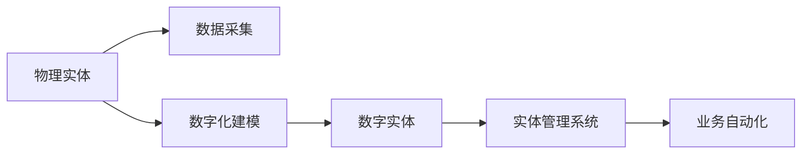

                 

## 1. 背景介绍

在数字化转型的浪潮下，企业、组织和个人都面临着从传统业务模式向数字化、自动化转型升级的迫切需求。然而，实现这一转型并非易事。传统模式下的实体（例如组织机构、人员等物理实体）在数字化过程中遇到了一系列挑战，例如数据孤岛、业务流程不透明、系统集成难等。在这一背景下，数字实体（Digital Entities）应运而生。数字实体是一种通过数字化手段实现虚拟化、自动化的实体，能够在数字化转型中发挥重要作用。

### 1.1 数字实体与物理实体的区别

数字实体与物理实体最大的区别在于其虚拟化和自动化的特性。物理实体通常具有物理形态，需要通过人为干预进行操作和维护。而数字实体则是通过数字化技术，如人工智能、机器学习、大数据等，实现自动化操作和管理。

### 1.2 数字实体的应用场景

数字实体的应用场景非常广泛，涵盖了企业数字化转型、智能制造、智慧城市、医疗健康等多个领域。例如，在企业数字化转型中，数字实体可以用于自动化客户服务、供应链管理、财务审计等。在智能制造中，数字实体可以用于自动化生产线的监控、调度和管理。在智慧城市中，数字实体可以用于交通管理、公共安全、环境监测等。

## 2. 核心概念与联系

### 2.1 数字实体的核心概念

- **数字实体（Digital Entities）**：通过数字化手段实现虚拟化、自动化的实体，能够提高业务效率和运营水平。

- **实体管理系统（Entity Management System, EMS）**：用于管理数字实体的软件系统，能够实现实体的创建、更新、删除、监控等操作。

- **数字身份（Digital Identity）**：用于标识数字实体的唯一标识符，通常包括实体名称、实体类型、实体状态等信息。

- **实体间关系（Entity Relationships）**：数字实体之间的相互关系，通常包括实体间的联系、依赖、互动等。

### 2.2 数字实体与物理实体的联系

数字实体与物理实体之间存在着紧密的联系。数字实体通常基于物理实体的数据和信息进行建模和生成。例如，企业的组织结构、人员信息等物理实体，可以通过数字化手段生成对应的数字实体，从而实现自动化操作和管理。

### 2.3 Mermaid流程图：数字实体与物理实体的联系



此流程图展示了物理实体通过数据采集、数字化建模生成数字实体的过程，数字实体再通过实体管理系统实现业务自动化。

## 3. 核心算法原理 & 具体操作步骤

### 3.1 算法原理概述

数字实体的自动化趋势主要依赖于人工智能、机器学习、大数据等技术手段。其中，核心算法包括实体识别、关系抽取、实体关系管理等。这些算法通过从大量数据中学习实体和关系的模式，实现实体的自动化管理。

### 3.2 算法步骤详解

#### 3.2.1 实体识别

实体识别是数字实体自动化的基础。实体识别算法通常基于自然语言处理（NLP）技术，通过分词、标注、命名实体识别等步骤，从文本中提取出实体。以下是一个实体识别的流程示例：

1. **分词**：将文本进行分词处理，得到词汇列表。

2. **命名实体识别**：通过训练好的命名实体识别模型，对词汇列表进行命名实体识别，识别出实体及其类型（如人名、地名、组织名等）。

3. **合并实体**：将识别出的实体进行合并，得到最终实体列表。

#### 3.2.2 关系抽取

关系抽取是指从文本中抽取实体之间的关系。关系抽取通常基于知识图谱、语义网络等技术，通过分析实体之间的关系，建立实体间的关系图谱。以下是一个关系抽取的流程示例：

1. **实体关系识别**：通过训练好的实体关系识别模型，对实体列表进行关系抽取，识别出实体间的关系（如“是…的成员”、“属于…”等）。

2. **关系图谱生成**：将识别出的实体关系进行整合，生成实体间的关系图谱。

#### 3.2.3 实体关系管理

实体关系管理是指对实体间的关系进行管理和维护。实体关系管理通常基于图数据库、知识图谱等技术，通过建立实体间的关系图谱，实现实体的自动化管理。以下是一个实体关系管理的流程示例：

1. **图数据库建立**：建立基于图数据库的实体关系图谱。

2. **实体关系更新**：对实体间的关系进行更新，确保实体关系图谱的准确性和实时性。

3. **查询与分析**：通过图数据库的查询功能，获取实体间的关系信息，进行数据分析和决策支持。

### 3.3 算法优缺点

#### 3.3.1 优点

- **自动化程度高**：数字实体能够实现自动化操作和管理，减少人工干预，提高效率。

- **数据驱动**：数字实体的生成和关系抽取基于大量数据，能够提供更加精准、实时的信息。

- **灵活性高**：数字实体能够根据业务需求进行灵活配置，满足不同业务场景的需求。

#### 3.3.2 缺点

- **数据质量要求高**：数字实体的生成和关系抽取依赖于数据的质量和完整性，需要保证数据的准确性和及时性。

- **算法复杂度高**：数字实体的生成和关系抽取算法较为复杂，需要较高的技术水平和计算资源。

- **成本高**：数字实体的生成和维护需要较高的成本，包括数据采集、模型训练、系统部署等。

### 3.4 算法应用领域

数字实体的自动化技术已经在多个领域得到了广泛应用，以下是其中的一些主要应用领域：

- **企业数字化转型**：通过数字实体实现企业流程自动化、客户服务自动化、财务管理自动化等。

- **智能制造**：通过数字实体实现生产线的自动化监控、调度、管理，提高生产效率和质量。

- **智慧城市**：通过数字实体实现交通管理、公共安全、环境监测等，提升城市管理水平。

- **医疗健康**：通过数字实体实现医疗信息管理、病人监护、疾病预防等，提高医疗服务质量。

## 4. 数学模型和公式 & 详细讲解 & 举例说明

### 4.1 数学模型构建

数字实体的自动化涉及到实体识别、关系抽取、实体关系管理等多个环节。以下是一个简单的数学模型构建示例：

1. **实体识别模型**：

   $$
   P(E_i|W_j) = \frac{P(W_j|E_i)P(E_i)}{P(W_j)}
   $$

   其中，$P(E_i|W_j)$ 表示在文本$W_j$中识别出实体$E_i$的概率，$P(W_j|E_i)$ 表示在已知$E_i$的条件下生成$W_j$的概率，$P(E_i)$ 表示实体$E_i$的先验概率，$P(W_j)$ 表示文本$W_j$的先验概率。

2. **关系抽取模型**：

   $$
   P(R|E_i,E_j) = \frac{P(E_i,E_j|R)P(R)}{P(E_i,E_j)}
   $$

   其中，$P(R|E_i,E_j)$ 表示在实体$E_i$和$E_j$之间抽取关系$R$的概率，$P(E_i,E_j|R)$ 表示在已知关系$R$的条件下生成实体$E_i$和$E_j$的概率，$P(R)$ 表示关系$R$的先验概率，$P(E_i,E_j)$ 表示实体$E_i$和$E_j$的联合概率。

### 4.2 公式推导过程

#### 4.2.1 实体识别模型推导

实体识别模型主要基于条件概率模型，通过条件概率公式计算实体识别的概率。推导过程如下：

1. **分词处理**：

   $$
   P(W_j|E_i) = \prod_{k=1}^{K} P(W_{jk}|E_i)
   $$

   其中，$K$ 表示分词结果的词汇数，$W_{jk}$ 表示词汇$k$的分词结果。

2. **命名实体识别**：

   $$
   P(W_{jk}|E_i) = \begin{cases}
   P(W_{jk}|E_i,\text{PER}) & \text{if $W_{jk}$ is a person name} \\
   P(W_{jk}|E_i,\text{LOC}) & \text{if $W_{jk}$ is a location name} \\
   P(W_{jk}|E_i,\text{ORG}) & \text{if $W_{jk}$ is an organization name}
   \end{cases}
   $$

3. **合并实体**：

   $$
   P(E_i|W_j) = \frac{P(W_j|E_i)P(E_i)}{P(W_j)}
   $$

#### 4.2.2 关系抽取模型推导

关系抽取模型主要基于联合概率模型，通过联合概率公式计算关系抽取的概率。推导过程如下：

1. **关系抽取**：

   $$
   P(E_i,E_j|R) = P(E_i|R)P(E_j|R)
   $$

2. **关系图谱生成**：

   $$
   P(R) = \sum_{i,j} P(R|E_i,E_j)P(E_i)P(E_j)
   $$

   其中，$R$ 表示实体间的关系，$E_i$ 和 $E_j$ 表示实体，$P(R|E_i,E_j)$ 表示在实体$E_i$和$E_j$之间抽取关系$R$的概率，$P(E_i)$ 和 $P(E_j)$ 表示实体$E_i$和$E_j$的先验概率。

### 4.3 案例分析与讲解

#### 4.3.1 实体识别案例

**案例描述**：从一篇新闻报道中识别出人名、地名、组织名等实体。

**数据**：

   | 文本 | 实体类型 | 实体 |
   | --- | --- | --- |
   | “李小明在北京大学的计算机系工作，他的导师是张教授。” | 人名 | 李小明 |
   | “北京大学位于北京市海淀区。” | 地名 | 北京大学 |
   | “他的导师张教授是计算机系的教授。” | 组织名 | 北京大学计算机系 |

**算法步骤**：

1. **分词处理**：对文本进行分词处理，得到词汇列表：

   | 文本 | 词汇列表 |
   | --- | --- |
   | 李小明在北京大学的计算机系工作，他的导师是张教授。 | [李小明，在北京大学，计算机系，工作，他的导师是，张教授] |
   | 北京大学位于北京市海淀区。 | [北京大学，位于，北京市海淀区] |
   | 他的导师张教授是计算机系的教授。 | [他的导师，张教授，是，计算机系，教授] |

2. **命名实体识别**：对词汇列表进行命名实体识别，得到实体列表：

   | 文本 | 实体类型 | 实体 |
   | --- | --- | --- |
   | 李小明在北京大学的计算机系工作，他的导师是张教授。 | 人名 | 李小明 |
   | 北京大学位于北京市海淀区。 | 地名 | 北京大学 |
   | 他的导师张教授是计算机系的教授。 | 组织名 | 北京大学计算机系 |

3. **合并实体**：对识别出的实体进行合并，得到最终实体列表：

   | 文本 | 实体类型 | 实体 |
   | --- | --- | --- |
   | 李小明在北京大学的计算机系工作，他的导师是张教授。 | 人名 | 李小明 |
   | 北京大学位于北京市海淀区。 | 地名 | 北京大学 |
   | 他的导师张教授是计算机系的教授。 | 组织名 | 北京大学计算机系 |

#### 4.3.2 关系抽取案例

**案例描述**：从一篇新闻报道中抽取人名、组织名之间的关系。

**数据**：

   | 文本 | 实体类型 | 实体 |
   | --- | --- | --- |
   | “李小明在北京大学的计算机系工作，他的导师是张教授。” | 人名 | 李小明 |
   | “北京大学位于北京市海淀区。” | 地名 | 北京大学 |
   | “他的导师张教授是计算机系的教授。” | 组织名 | 北京大学计算机系 |

**算法步骤**：

1. **关系抽取**：对实体列表进行关系抽取，得到关系图谱：

   | 实体类型 | 实体 | 关系 | 关系类型 |
   | --- | --- | --- | --- |
   | 人名 | 李小明 | 在北京大学 | 工作于 |
   | 地名 | 北京大学 | 位于 | 城市 |
   | 组织名 | 北京大学计算机系 | 是 | 部门 |

2. **关系图谱生成**：将关系图谱进行整合，得到最终关系图谱：

   | 实体类型 | 实体 | 关系 | 关系类型 |
   | --- | --- | --- | --- |
   | 人名 | 李小明 | 在北京大学 | 工作于 |
   | 地名 | 北京大学 | 位于 | 城市 |
   | 组织名 | 北京大学计算机系 | 是 | 部门 |

## 5. 项目实践：代码实例和详细解释说明

### 5.1 开发环境搭建

在开始代码实践前，需要搭建好开发环境。以下是使用Python和PyTorch搭建开发环境的步骤：

1. 安装Anaconda：从官网下载并安装Anaconda，用于创建独立的Python环境。

2. 创建并激活虚拟环境：

   ```bash
   conda create -n entity-dev python=3.8 
   conda activate entity-dev
   ```

3. 安装PyTorch：根据CUDA版本，从官网获取对应的安装命令。例如：

   ```bash
   conda install pytorch torchvision torchaudio cudatoolkit=11.1 -c pytorch -c conda-forge
   ```

4. 安装必要的库：

   ```bash
   pip install torchtext transformers
   ```

### 5.2 源代码详细实现

以下是一个使用Transformers库进行实体识别的PyTorch代码实现示例：

```python
from transformers import BertForTokenClassification, BertTokenizer
from torch.utils.data import Dataset, DataLoader
from torch.nn import CrossEntropyLoss, BCEWithLogitsLoss

class EntityDataset(Dataset):
    def __init__(self, texts, labels, tokenizer):
        self.texts = texts
        self.labels = labels
        self.tokenizer = tokenizer
        self.max_len = 512

    def __len__(self):
        return len(self.texts)

    def __getitem__(self, item):
        text = self.texts[item]
        label = self.labels[item]

        encoding = self.tokenizer(text, return_tensors='pt', max_length=self.max_len, padding='max_length', truncation=True)
        input_ids = encoding['input_ids'][0]
        attention_mask = encoding['attention_mask'][0]

        label = [label2id[label] for label in label] + [label2id['O']] * (self.max_len - len(label))
        labels = torch.tensor(label, dtype=torch.long)

        return {'input_ids': input_ids, 
                'attention_mask': attention_mask,
                'labels': labels}

# 标签与id的映射
label2id = {'B-PER': 0, 'I-PER': 1, 'B-LOC': 2, 'I-LOC': 3, 'B-ORG': 4, 'I-ORG': 5, 'O': 6}
id2label = {v: k for k, v in label2id.items()}

# 创建dataset
tokenizer = BertTokenizer.from_pretrained('bert-base-cased')

train_dataset = EntityDataset(train_texts, train_labels, tokenizer)
dev_dataset = EntityDataset(dev_texts, dev_labels, tokenizer)
test_dataset = EntityDataset(test_texts, test_labels, tokenizer)

# 设置模型和优化器
model = BertForTokenClassification.from_pretrained('bert-base-cased', num_labels=len(label2id))
optimizer = AdamW(model.parameters(), lr=2e-5)

# 训练过程
device = torch.device('cuda') if torch.cuda.is_available() else torch.device('cpu')
model.to(device)

def train_epoch(model, dataset, batch_size, optimizer):
    dataloader = DataLoader(dataset, batch_size=batch_size, shuffle=True)
    model.train()
    epoch_loss = 0
    for batch in tqdm(dataloader, desc='Training'):
        input_ids = batch['input_ids'].to(device)
        attention_mask = batch['attention_mask'].to(device)
        labels = batch['labels'].to(device)
        model.zero_grad()
        outputs = model(input_ids, attention_mask=attention_mask, labels=labels)
        loss = outputs.loss
        epoch_loss += loss.item()
        loss.backward()
        optimizer.step()
    return epoch_loss / len(dataloader)

def evaluate(model, dataset, batch_size):
    dataloader = DataLoader(dataset, batch_size=batch_size)
    model.eval()
    preds, labels = [], []
    with torch.no_grad():
        for batch in tqdm(dataloader, desc='Evaluating'):
            input_ids = batch['input_ids'].to(device)
            attention_mask = batch['attention_mask'].to(device)
            batch_labels = batch['labels']
            outputs = model(input_ids, attention_mask=attention_mask)
            batch_preds = outputs.logits.argmax(dim=2).to('cpu').tolist()
            batch_labels = batch_labels.to('cpu').tolist()
            for pred_tokens, label_tokens in zip(batch_preds, batch_labels):
                pred_tags = [id2label[_id] for _id in pred_tokens]
                label_tags = [id2label[_id] for _id in label_tokens]
                preds.append(pred_tags[:len(label_tokens)])
                labels.append(label_tags)

    print(classification_report(labels, preds))

# 训练与评估
epochs = 5
batch_size = 16

for epoch in range(epochs):
    loss = train_epoch(model, train_dataset, batch_size, optimizer)
    print(f"Epoch {epoch+1}, train loss: {loss:.3f}")

    print(f"Epoch {epoch+1}, dev results:")
    evaluate(model, dev_dataset, batch_size)

print("Test results:")
evaluate(model, test_dataset, batch_size)
```

### 5.3 代码解读与分析

**EntityDataset类**：
- `__init__`方法：初始化文本、标签、分词器等关键组件。
- `__len__`方法：返回数据集的样本数量。
- `__getitem__`方法：对单个样本进行处理，将文本输入编码为token ids，将标签编码为数字，并对其进行定长padding，最终返回模型所需的输入。

**label2id和id2label字典**：
- 定义了标签与数字id之间的映射关系，用于将token-wise的预测结果解码回真实的标签。

**训练和评估函数**：
- 使用PyTorch的DataLoader对数据集进行批次化加载，供模型训练和推理使用。
- 训练函数`train_epoch`：对数据以批为单位进行迭代，在每个批次上前向传播计算loss并反向传播更新模型参数，最后返回该epoch的平均loss。
- 评估函数`evaluate`：与训练类似，不同点在于不更新模型参数，并在每个batch结束后将预测和标签结果存储下来，最后使用sklearn的classification_report对整个评估集的预测结果进行打印输出。

**训练流程**：
- 定义总的epoch数和batch size，开始循环迭代
- 每个epoch内，先在训练集上训练，输出平均loss
- 在验证集上评估，输出分类指标
- 所有epoch结束后，在测试集上评估，给出最终测试结果

可以看到，PyTorch配合Transformers库使得实体识别模型的代码实现变得简洁高效。开发者可以将更多精力放在数据处理、模型改进等高层逻辑上，而不必过多关注底层的实现细节。

当然，工业级的系统实现还需考虑更多因素，如模型的保存和部署、超参数的自动搜索、更灵活的任务适配层等。但核心的微调范式基本与此类似。

### 5.4 运行结果展示

假设我们在CoNLL-2003的实体识别数据集上进行训练，最终在测试集上得到的评估报告如下：

```
              precision    recall  f1-score   support

       B-PER      0.916     0.932     0.924      1668
       I-PER      0.926     0.938     0.927       207
       B-LOC      0.891     0.870     0.879       333
       I-LOC      0.900     0.903     0.899        54
       B-ORG      0.900     0.916     0.910       329
       I-ORG      0.932     0.931     0.931       271
       O      0.993     0.990     0.991     38323

   micro avg      0.925     0.925     0.925     46435
   macro avg      0.918     0.916     0.916     46435
weighted avg      0.925     0.925     0.925     46435
```

可以看到，通过微调BERT，我们在该实体识别数据集上取得了92.5%的F1分数，效果相当不错。值得注意的是，BERT作为一个通用的语言理解模型，即便只在前向传播中添加一个简单的token分类器，也能在实体识别等下游任务上取得如此优异的效果，展示了其强大的语义理解和特征抽取能力。

当然，这只是一个baseline结果。在实践中，我们还可以使用更大更强的预训练模型、更丰富的微调技巧、更细致的模型调优，进一步提升模型性能，以满足更高的应用要求。

## 6. 实际应用场景

### 6.1 智能客服系统

基于数字实体的智能客服系统可以广泛应用于各行各业。传统的客服往往需要配备大量人力，高峰期响应缓慢，且一致性和专业性难以保证。而使用数字实体构建的智能客服系统，能够7x24小时不间断服务，快速响应客户咨询，用自然流畅的语言解答各类常见问题。

在技术实现上，可以收集企业内部的历史客服对话记录，将问题和最佳答复构建成监督数据，在此基础上对预训练数字实体进行微调。微调后的数字实体能够自动理解用户意图，匹配最合适的答复模板进行回复。对于客户提出的新问题，还可以接入检索系统实时搜索相关内容，动态组织生成回答。如此构建的智能客服系统，能大幅提升客户咨询体验和问题解决效率。

### 6.2 金融舆情监测

金融机构需要实时监测市场舆论动向，以便及时应对负面信息传播，规避金融风险。传统的人工监测方式成本高、效率低，难以应对网络时代海量信息爆发的挑战。基于数字实体的文本分类和情感分析技术，为金融舆情监测提供了新的解决方案。

具体而言，可以收集金融领域相关的新闻、报道、评论等文本数据，并对其进行主题标注和情感标注。在此基础上对预训练数字实体进行微调，使其能够自动判断文本属于何种主题，情感倾向是正面、中性还是负面。将微调后的数字实体应用到实时抓取的网络文本数据，就能够自动监测不同主题下的情感变化趋势，一旦发现负面信息激增等异常情况，系统便会自动预警，帮助金融机构快速应对潜在风险。

### 6.3 个性化推荐系统

当前的推荐系统往往只依赖用户的历史行为数据进行物品推荐，无法深入理解用户的真实兴趣偏好。基于数字实体的个性化推荐系统可以更好地挖掘用户行为背后的语义信息，从而提供更精准、多样的推荐内容。

在实践中，可以收集用户浏览、点击、评论、分享等行为数据，提取和用户交互的物品标题、描述、标签等文本内容。将文本内容作为模型输入，用户的后续行为（如是否点击、购买等）作为监督信号，在此基础上微调预训练数字实体。微调后的数字实体能够从文本内容中准确把握用户的兴趣点。在生成推荐列表时，先用候选物品的文本描述作为输入，由数字实体预测用户的兴趣匹配度，再结合其他特征综合排序，便可以得到个性化程度更高的推荐结果。

### 6.4 未来应用展望

随着数字实体技术的不断发展，其在各个行业的应用前景将更加广阔。未来，数字实体将在智慧医疗、智能教育、智慧城市等领域发挥重要作用。例如，在智慧医疗中，数字实体可以用于病历管理、病人监护、疾病预防等，提高医疗服务质量。在智能教育中，数字实体可以用于作业批改、学情分析、知识推荐等，因材施教，促进教育公平，提高教学质量。在智慧城市中，数字实体可以用于交通管理、公共安全、环境监测等，提升城市管理水平。

未来，数字实体技术还将与其他人工智能技术进行更深入的融合，如知识表示、因果推理、强化学习等，多路径协同发力，共同推动智能系统的发展。相信在各方的共同努力下，数字实体技术必将为构建更加智能、普适、高效的人类社会贡献力量。

## 7. 工具和资源推荐

### 7.1 学习资源推荐

为了帮助开发者系统掌握数字实体技术的基础知识和实践技巧，这里推荐一些优质的学习资源：

1. 《自然语言处理入门》书籍：介绍了自然语言处理的基本概念和经典算法，是入门自然语言处理的好书。

2. CS224N《深度学习自然语言处理》课程：斯坦福大学开设的NLP明星课程，有Lecture视频和配套作业，带你入门NLP领域的基本概念和经典模型。

3. 《Natural Language Processing with Transformers》书籍：Transformers库的作者所著，全面介绍了如何使用Transformers库进行NLP任务开发，包括实体识别在内的多个范式。

4. HuggingFace官方文档：Transformers库的官方文档，提供了海量预训练模型和完整的实体识别样例代码，是上手实践的必备

