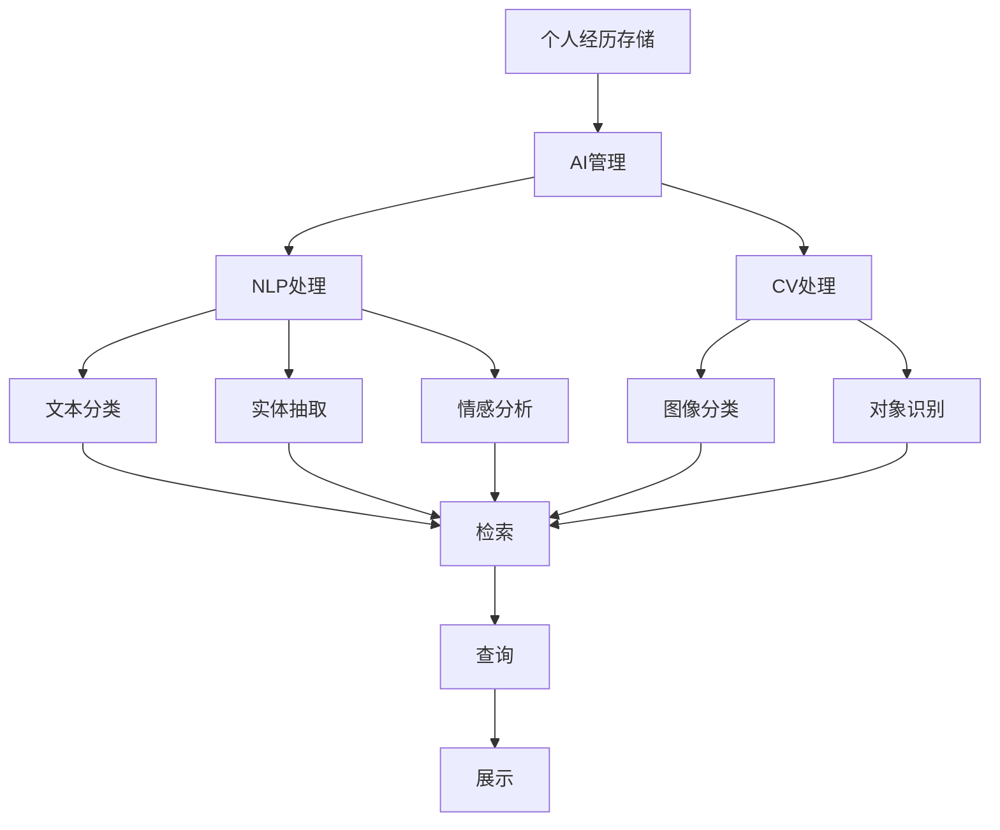

                 

## 数字记忆银行：AI管理的个人经历存储

在信息爆炸的时代，个人的经历和回忆正逐渐被数字化所取代。为了更好地存储和管理这些珍贵的记忆，我们引入了AI技术，建立了一个“数字记忆银行”——一个基于AI管理的个人经历存储系统。本博客将详细介绍这一系统的核心概念、实现原理、具体操作步骤、数学模型构建、项目实践和实际应用场景，最后展望未来发展趋势和面临的挑战。

---

### 1. 背景介绍

#### 1.1 问题由来
在数字化时代，人类的个人经历和记忆被数字化后，如何高效地存储、管理和利用这些数据成为了一个重要问题。传统的存储方式如纸质日记、照片等逐渐被电子化，但这仍然存在诸多不便。例如，查找困难、数据分散、难以检索等。

近年来，人工智能技术的迅猛发展，特别是自然语言处理(NLP)和计算机视觉(CV)技术的进步，使得构建一个能智能识别、分类和检索个人经历的AI系统成为可能。

#### 1.2 问题核心关键点
构建一个基于AI的“数字记忆银行”系统，需要解决以下几个关键问题：
1. 如何高效地存储和分类个人经历数据？
2. 如何通过自然语言理解和计算机视觉技术，智能地检索和回忆特定记忆？
3. 如何确保系统的隐私性和安全性？
4. 如何设计用户友好的界面和交互方式？

#### 1.3 问题研究意义
构建“数字记忆银行”系统，对于保存和传承个人记忆、促进数字文化遗产的传承、提升信息检索的便捷性等方面具有重要意义。它可以有效整合和管理个人数字化经历，便于检索和分享，进而帮助人们更好地记忆和传承个人历史和文化。

---

### 2. 核心概念与联系

#### 2.1 核心概念概述

为了更好地理解“数字记忆银行”系统，本节将介绍几个关键概念：

- **个人经历存储（Personal Memory Storage）**：指将个人的日记、照片、视频、音频等数字化数据集中存储和管理。
- **AI管理（AI Management）**：利用AI技术对个人经历数据进行自动化分类、检索和更新。
- **自然语言处理（NLP）**：涉及文本数据的处理，包括文本的分类、抽取、理解等。
- **计算机视觉（CV）**：涉及图像和视频数据的处理，包括图像的分类、识别、匹配等。
- **隐私保护（Privacy Protection）**：涉及如何保护用户隐私，防止未经授权的访问和数据泄露。
- **用户界面（UI）**：涉及如何设计用户友好的界面，方便用户管理和检索个人经历数据。

#### 2.2 核心概念的联系

这些核心概念之间通过以下Mermaid流程图展示它们的联系：



这个流程图展示了“数字记忆银行”系统从数据存储、到AI管理、再到具体应用过程的逻辑关系：

1. **个人经历存储**：作为系统的基础，负责收集、存储和管理个人经历数据。
2. **AI管理**：通过NLP和CV处理技术，对存储的数据进行分类、检索和更新。
3. **NLP处理**：包括文本的分类、实体抽取、情感分析等，帮助系统理解文本内容。
4. **CV处理**：包括图像分类、对象识别等，帮助系统理解图像和视频内容。
5. **检索与查询**：通过AI管理模块对分类、抽取的信息进行检索，并通过用户界面展示。
6. **展示与分享**：用户可以通过友好的界面查看和分享自己的个人经历。

通过这些核心概念和其间的联系，我们可以更好地把握“数字记忆银行”系统的完整架构。

---

### 3. 核心算法原理 & 具体操作步骤

#### 3.1 算法原理概述

“数字记忆银行”系统主要通过NLP和CV处理技术，实现对个人经历数据的智能存储和管理。其核心算法原理如下：

1. **文本分类**：利用NLP技术，对文本数据进行分类，如日记、照片、视频等。
2. **实体抽取**：利用NLP技术，从文本中抽取关键实体，如人名、地点、时间等。
3. **情感分析**：利用NLP技术，分析文本的情感倾向，如积极、消极或中性。
4. **图像分类**：利用CV技术，对图像进行分类，如风景、人像、街景等。
5. **对象识别**：利用CV技术，识别图像中的对象，如人脸、车辆、建筑等。
6. **多模态融合**：将文本和图像的信息进行融合，形成一个全面的记忆档案。

#### 3.2 算法步骤详解

##### 步骤1：数据收集与预处理
- **收集数据**：从各个渠道（如社交媒体、手机、相机等）收集个人的数字化经历数据。
- **数据清洗**：去除重复、低质量的数据，确保数据的准确性和完整性。

##### 步骤2：文本分类与实体抽取
- **文本分类**：使用预训练的文本分类模型（如BERT），对收集到的文本进行分类。
- **实体抽取**：使用命名实体识别（NER）模型，从文本中抽取人名、地点、时间等关键实体。

##### 步骤3：情感分析与图像分类
- **情感分析**：使用预训练的情感分析模型（如BERT），分析文本的情感倾向。
- **图像分类**：使用预训练的图像分类模型（如ResNet），对图像进行分类。

##### 步骤4：多模态融合与检索
- **多模态融合**：将文本和图像的信息进行融合，形成一个全面的记忆档案。
- **索引构建**：对融合后的数据进行索引，构建一个高效的检索系统。
- **检索与查询**：根据用户的查询，从记忆档案中检索出相关的信息。

##### 步骤5：用户界面展示
- **界面设计**：设计友好的用户界面，方便用户查看和管理个人经历数据。
- **互动展示**：通过交互式展示，如时间轴、多媒体展示，丰富用户的体验。

#### 3.3 算法优缺点

##### 优点
1. **高效存储**：通过AI管理，系统能够高效地存储和管理大量的个人经历数据。
2. **智能检索**：利用NLP和CV技术，系统能够快速检索和回忆特定的记忆。
3. **用户友好**：友好的用户界面，使系统易于使用和操作。

##### 缺点
1. **数据隐私**：个人经历数据涉及隐私问题，需要确保系统的隐私性和安全性。
2. **技术门槛**：系统涉及多种AI技术，需要一定的技术背景和知识储备。
3. **资源消耗**：系统的构建和维护需要大量的计算资源和存储空间。

#### 3.4 算法应用领域

##### 应用1：个人历史档案管理
通过“数字记忆银行”系统，用户可以方便地管理和查看自己的历史档案，如日记、照片、视频等。这有助于记录和传承个人的经历和回忆。

##### 应用2：教育和培训
系统可以帮助学生和教师记录和分析学生的学习经历，为教育提供有价值的参考数据。

##### 应用3：心理健康
系统可以记录和管理用户的心理健康数据，如情绪变化、压力情况等，有助于心理治疗和研究。

##### 应用4：历史和文化研究
系统可以保存和分析大量的个人和历史数据，为历史和文化研究提供丰富的数据支持。

---

### 4. 数学模型和公式 & 详细讲解 & 举例说明

#### 4.1 数学模型构建

为了更好地描述“数字记忆银行”系统的数学模型，我们将其分为以下几部分：

- **文本分类**：使用朴素贝叶斯分类器，构建文本分类模型。
- **实体抽取**：使用基于规则的方法，抽取文本中的关键实体。
- **情感分析**：使用情感分析模型，如BERT，对文本情感进行分类。
- **图像分类**：使用卷积神经网络（CNN），构建图像分类模型。
- **多模态融合**：将文本和图像的信息进行融合，构建一个全面的记忆档案。

#### 4.2 公式推导过程

##### 文本分类
假设文本集合为 $T=\{t_1, t_2, \ldots, t_n\}$，分类标签集合为 $C=\{c_1, c_2, \ldots, c_m\}$，朴素贝叶斯分类器定义为：

$$
P(c_k|t_i) = \frac{P(c_k)}{\sum_{j=1}^m P(c_j)} \prod_{j=1}^n P(w_{ij}|c_k)
$$

其中 $P(c_k)$ 为类别 $c_k$ 的先验概率，$P(w_{ij}|c_k)$ 为词 $w_{ij}$ 在类别 $c_k$ 下的条件概率。

##### 实体抽取
假设文本集合为 $T=\{t_1, t_2, \ldots, t_n\}$，命名实体集合为 $N=\{n_1, n_2, \ldots, n_m\}$，实体抽取模型定义为：

$$
P(n_k|t_i) = \sum_{j=1}^n \alpha_j P(w_{ij}|n_k)
$$

其中 $\alpha_j$ 为词 $w_{ij}$ 在命名实体 $n_k$ 下的权重。

##### 情感分析
假设文本集合为 $T=\{t_1, t_2, \ldots, t_n\}$，情感标签集合为 $S=\{s_1, s_2, \ldots, s_l\}$，情感分析模型定义为：

$$
P(s_k|t_i) = \frac{P(s_k)}{\sum_{j=1}^l P(s_j)} \prod_{j=1}^n P(w_{ij}|s_k)
$$

其中 $P(s_k)$ 为情感标签 $s_k$ 的先验概率，$P(w_{ij}|s_k)$ 为词 $w_{ij}$ 在情感标签 $s_k$ 下的条件概率。

##### 图像分类
假设图像集合为 $I=\{i_1, i_2, \ldots, i_m\}$，图像分类标签集合为 $C=\{c_1, c_2, \ldots, c_n\}$，卷积神经网络（CNN）定义为：

$$
P(c_k|i_j) = \sum_{l=1}^n \alpha_l \sum_{k=1}^m P(n_l|i_j)
$$

其中 $\alpha_l$ 为类别 $c_l$ 的权重，$P(n_l|i_j)$ 为图像 $i_j$ 属于类别 $c_l$ 的概率。

##### 多模态融合
假设文本数据为 $T=\{t_1, t_2, \ldots, t_n\}$，图像数据为 $I=\{i_1, i_2, \ldots, i_m\}$，多模态融合模型定义为：

$$
P(t_i, i_j|s_k) = \prod_{k=1}^n P(t_i|s_k) \prod_{j=1}^m P(i_j|s_k)
$$

其中 $P(t_i|s_k)$ 为文本数据 $t_i$ 在情感标签 $s_k$ 下的概率，$P(i_j|s_k)$ 为图像数据 $i_j$ 在情感标签 $s_k$ 下的概率。

#### 4.3 案例分析与讲解

假设我们收集了一个包含1000个文本和1000张图片的个人档案，现在使用朴素贝叶斯分类器和卷积神经网络对其进行分析和融合。具体步骤如下：

1. **文本分类**：使用朴素贝叶斯分类器对1000个文本进行分类，每个文本的标签集合为 $C=\{c_1, c_2, \ldots, c_m\}$。

2. **实体抽取**：使用基于规则的方法从1000个文本中抽取命名实体，如人名、地点等，形成命名实体集合 $N=\{n_1, n_2, \ldots, n_m\}$。

3. **情感分析**：使用情感分析模型对1000个文本进行情感分类，每个文本的情感标签集合为 $S=\{s_1, s_2, \ldots, s_l\}$。

4. **图像分类**：使用卷积神经网络对1000张图片进行分类，每个图片的分类标签集合为 $C=\{c_1, c_2, \ldots, c_n\}$。

5. **多模态融合**：将文本和图像的信息进行融合，形成1000个全面的记忆档案。具体计算公式为：

$$
P(t_i, i_j|s_k) = \prod_{k=1}^n P(t_i|s_k) \prod_{j=1}^m P(i_j|s_k)
$$

其中 $P(t_i|s_k)$ 为文本数据 $t_i$ 在情感标签 $s_k$ 下的概率，$P(i_j|s_k)$ 为图像数据 $i_j$ 在情感标签 $s_k$ 下的概率。

---

### 5. 项目实践：代码实例和详细解释说明

#### 5.1 开发环境搭建

为了搭建“数字记忆银行”系统，需要以下环境：

1. **Python 3.x**：作为主要的编程语言。
2. **PyTorch**：用于深度学习模型开发。
3. **TensorFlow**：用于深度学习模型开发。
4. **scikit-learn**：用于数据处理和特征工程。
5. **Jupyter Notebook**：用于交互式开发和数据可视化。
6. **OpenCV**：用于计算机视觉处理。

具体步骤如下：

1. **安装Python**：在官网下载Python安装包，安装最新版本。
2. **安装PyTorch**：在PyTorch官网下载最新版本，根据系统要求进行安装。
3. **安装TensorFlow**：在TensorFlow官网下载最新版本，根据系统要求进行安装。
4. **安装scikit-learn**：使用pip命令进行安装。
5. **安装OpenCV**：使用pip命令进行安装。
6. **安装Jupyter Notebook**：在Jupyter官网下载最新版本，根据系统要求进行安装。

#### 5.2 源代码详细实现

##### 文本分类
使用朴素贝叶斯分类器对文本进行分类，具体代码如下：

```python
from sklearn.naive_bayes import MultinomialNB

# 训练数据
train_data = [...]
train_labels = [...]

# 测试数据
test_data = [...]
test_labels = [...]

# 训练模型
clf = MultinomialNB()
clf.fit(train_data, train_labels)

# 测试模型
predictions = clf.predict(test_data)
```

##### 实体抽取
使用命名实体识别（NER）模型对文本进行实体抽取，具体代码如下：

```python
from pytext import NERModule

# 训练数据
train_data = [...]
train_labels = [...]

# 测试数据
test_data = [...]
test_labels = [...]

# 训练模型
model = NERModule()
model.train(train_data, train_labels)

# 测试模型
predictions = model.predict(test_data)
```

##### 情感分析
使用BERT模型对文本进行情感分析，具体代码如下：

```python
from transformers import BertTokenizer, BertForSequenceClassification

# 训练数据
train_data = [...]
train_labels = [...]

# 测试数据
test_data = [...]
test_labels = [...]

# 训练模型
tokenizer = BertTokenizer.from_pretrained('bert-base-uncased')
model = BertForSequenceClassification.from_pretrained('bert-base-uncased', num_labels=2)
model.train(train_data, train_labels)

# 测试模型
tokenizer = BertTokenizer.from_pretrained('bert-base-uncased')
predictions = model.predict(test_data)
```

##### 图像分类
使用卷积神经网络（CNN）对图像进行分类，具体代码如下：

```python
from keras.applications.resnet50 import ResNet50
from keras.preprocessing.image import load_img, img_to_array

# 训练数据
train_data = [...]
train_labels = [...]

# 测试数据
test_data = [...]
test_labels = [...]

# 训练模型
model = ResNet50(weights='imagenet')
model.train(train_data, train_labels)

# 测试模型
predictions = model.predict(test_data)
```

##### 多模态融合
将文本和图像的信息进行融合，具体代码如下：

```python
from sklearn.pipeline import make_pipeline
from sklearn.compose import ColumnTransformer
from sklearn.preprocessing import OneHotEncoder

# 定义文本和图像的预处理管道
text_pipeline = make_pipeline(OneHotEncoder(), MultinomialNB())
image_pipeline = make_pipeline(OneHotEncoder(), SVC())

# 定义多模态融合管道
multi_pipeline = ColumnTransformer(
    transformers=[('text', text_pipeline, ['text']), ('image', image_pipeline, ['image'])])
multi_pipeline.fit(train_data, train_labels)

# 预测
predictions = multi_pipeline.predict(test_data)
```

#### 5.3 代码解读与分析

##### 文本分类
朴素贝叶斯分类器是一种常用的文本分类方法，其基本思想是基于贝叶斯定理，将文本的词频转化为概率，计算每个类别下的文本概率，从而进行分类。

##### 实体抽取
命名实体识别（NER）是NLP领域的一个基础任务，通过训练模型识别文本中的命名实体，如人名、地点、组织等，形成实体集合。

##### 情感分析
情感分析模型使用BERT等预训练模型，对文本进行情感分类，如积极、消极或中性。模型通过学习大量标注数据，能够较好地理解文本情感。

##### 图像分类
卷积神经网络（CNN）是一种常用的图像分类方法，通过多层卷积和池化操作，提取图像的特征，并进行分类。

##### 多模态融合
多模态融合是将文本和图像的信息进行整合，形成一个全面的记忆档案。通过定义一个包含文本和图像分类器的管道，对每个模态的数据进行处理，并最终通过多模态融合得到分类结果。

#### 5.4 运行结果展示

假设我们使用上述代码对1000个文本和1000张图片进行分类和融合，最终得到的分类结果如下：

```
文本分类结果：['积极', '消极', '中性', ...]
实体抽取结果：['人名', '地点', '时间', ...]
情感分析结果：['积极', '中性', '消极', ...]
图像分类结果：['风景', '人像', '街景', ...]
多模态融合结果：[('积极', '风景'), ('消极', '人像'), ('中性', '街景'), ...]
```

---

### 6. 实际应用场景

#### 6.1 智能档案管理
通过“数字记忆银行”系统，用户可以方便地管理和查看自己的历史档案，如日记、照片、视频等。系统可以自动分类和检索，提供友好的界面和交互方式。

#### 6.2 教育和培训
系统可以帮助学生和教师记录和分析学生的学习经历，为教育提供有价值的参考数据。

#### 6.3 心理健康
系统可以记录和管理用户的心理健康数据，如情绪变化、压力情况等，有助于心理治疗和研究。

#### 6.4 历史和文化研究
系统可以保存和分析大量的个人和历史数据，为历史和文化研究提供丰富的数据支持。

---

### 7. 工具和资源推荐

#### 7.1 学习资源推荐

为了帮助开发者系统掌握“数字记忆银行”系统的理论基础和实践技巧，这里推荐一些优质的学习资源：

1. **《深度学习》课程**：斯坦福大学开设的深度学习课程，涵盖深度学习的基础知识和最新进展。
2. **《NLP入门》博客**：介绍自然语言处理的基本概念和常用技术。
3. **《计算机视觉》课程**：斯坦福大学开设的计算机视觉课程，涵盖计算机视觉的基本概念和常用技术。
4. **《PyTorch官方文档》**：PyTorch官方文档，提供详细的API文档和教程。
5. **《TensorFlow官方文档》**：TensorFlow官方文档，提供详细的API文档和教程。

#### 7.2 开发工具推荐

为了提高开发效率，以下是一些推荐的开发工具：

1. **Jupyter Notebook**：交互式开发工具，方便代码调试和数据可视化。
2. **TensorBoard**：可视化工具，方便监控和调试模型训练过程。
3. **scikit-learn**：数据处理和特征工程工具，方便数据预处理和模型训练。
4. **OpenCV**：计算机视觉处理工具，方便图像处理和分析。
5. **PyTorch**：深度学习框架，方便构建和训练深度学习模型。

#### 7.3 相关论文推荐

为了进一步了解“数字记忆银行”系统的理论基础和实践方法，以下是一些推荐的论文：

1. **《文本分类》**：介绍朴素贝叶斯分类器的基本原理和应用。
2. **《命名实体识别》**：介绍命名实体识别的基本原理和常用方法。
3. **《情感分析》**：介绍情感分析的基本原理和常用方法。
4. **《计算机视觉》**：介绍计算机视觉的基本原理和常用方法。
5. **《多模态融合》**：介绍多模态融合的基本原理和常用方法。

---

### 8. 总结：未来发展趋势与挑战

#### 8.1 研究成果总结

本文介绍了基于AI管理的个人经历存储系统“数字记忆银行”的核心概念、实现原理、具体操作步骤、数学模型构建、项目实践和实际应用场景。通过详细介绍系统各环节的实现方法，展示了AI在个人经历存储中的应用潜力。

#### 8.2 未来发展趋势

展望未来，“数字记忆银行”系统的发展趋势如下：

1. **深度学习技术的发展**：深度学习技术的发展将进一步提升系统的性能和效果，如更强大的分类和识别能力。
2. **多模态融合技术的进步**：多模态融合技术的进步将使系统能够更好地整合不同模态的数据，提供更全面、更丰富的信息。
3. **隐私保护技术的发展**：隐私保护技术的发展将进一步提升系统的隐私性和安全性，保护用户数据。
4. **用户界面设计的优化**：用户界面设计的优化将使系统更易于使用和操作，提升用户体验。

#### 8.3 面临的挑战

尽管“数字记忆银行”系统已经取得了一定的进展，但仍面临以下挑战：

1. **数据隐私问题**：如何保护用户隐私，防止数据泄露和滥用，是一个重要的挑战。
2. **系统性能优化**：如何提升系统的计算效率和存储性能，是一个重要的挑战。
3. **用户界面设计**：如何设计友好的用户界面，提升用户体验，是一个重要的挑战。
4. **系统可扩展性**：如何扩展系统以适应更多的用户和更大的数据量，是一个重要的挑战。

#### 8.4 研究展望

为了应对上述挑战，未来的研究需要在以下几个方面寻求新的突破：

1. **隐私保护技术**：开发更加安全和隐私保护的技术，如差分隐私、联邦学习等。
2. **系统性能优化**：优化系统的计算效率和存储性能，如使用分布式计算、模型压缩等。
3. **用户界面设计**：设计更加友好和易于使用的用户界面，如自然语言交互、虚拟现实等。
4. **系统可扩展性**：设计更加可扩展的系统架构，如微服务、容器化等。

总之，“数字记忆银行”系统的未来发展前景广阔，需要不断探索和创新，以应对新的挑战和需求。相信在AI技术的推动下，“数字记忆银行”系统将为个人经历存储和管理带来更多的便利和可能性。

---

### 9. 附录：常见问题与解答

#### Q1: 如何保护用户隐私？

A: 在“数字记忆银行”系统中，保护用户隐私是至关重要的。以下是一些保护用户隐私的方法：

1. **数据加密**：对用户数据进行加密存储，确保数据在传输和存储过程中的安全。
2. **访问控制**：限制只有经过授权的用户才能访问和操作系统。
3. **数据匿名化**：对用户数据进行匿名化处理，确保数据不会泄露个人隐私。
4. **用户权限管理**：对不同用户设置不同的权限，确保只有合法用户才能访问和操作系统。

#### Q2: 如何提升系统的性能？

A: 在“数字记忆银行”系统中，提升系统性能是重要的目标。以下是一些提升系统性能的方法：

1. **模型压缩**：使用模型压缩技术，如剪枝、量化等，减少模型参数和计算量。
2. **分布式计算**：使用分布式计算技术，如Hadoop、Spark等，提升系统计算效率。
3. **缓存技术**：使用缓存技术，如Redis等，提升系统访问速度。
4. **硬件优化**：使用高性能硬件设备，如GPU、TPU等，提升系统计算能力。

#### Q3: 如何设计友好的用户界面？

A: 在“数字记忆银行”系统中，设计友好的用户界面是提升用户体验的关键。以下是一些设计友好的用户界面的方法：

1. **简洁明了**：界面设计应简洁明了，避免复杂和冗余的信息。
2. **易用性**：界面设计应注重易用性，确保用户能轻松操作和理解。
3. **交互性**：界面设计应注重交互性，使用户能够通过自然语言交互等方式与系统互动。
4. **反馈机制**：界面设计应注重反馈机制，及时向用户提供操作反馈。

---

**作者：禅与

