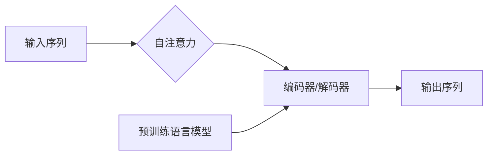

# Transformer大模型实战：自注意力机制

> 关键词：Transformer，自注意力机制，自然语言处理，预训练，深度学习，编码器，解码器，预训练语言模型，NLP

## 1. 背景介绍

随着深度学习在自然语言处理（NLP）领域的蓬勃发展，越来越多的复杂模型被提出来以解决各种NLP任务。在这些模型中，Transformer因其优越的性能和简洁的架构而备受关注。Transformer模型的核心是自注意力（Self-Attention）机制，它通过捕捉序列中词语之间的长距离依赖关系，为NLP任务提供了一种强大的表征能力。

本文将深入探讨Transformer模型，从自注意力机制出发，讲解其原理、实现步骤、优缺点以及应用领域。通过理论与实践相结合的方式，帮助读者全面了解Transformer模型及其在NLP领域的应用。

## 2. 核心概念与联系

### 2.1 核心概念

#### 2.1.1 Transformer模型

Transformer模型是一种基于自注意力机制的深度神经网络模型，由Vaswani等人于2017年提出。它主要由编码器（Encoder）和解码器（Decoder）两部分组成，用于处理序列到序列（Seq2Seq）任务，如机器翻译、文本摘要、问答系统等。

#### 2.1.2 自注意力机制

自注意力（Self-Attention）是Transformer模型的核心，它允许模型在编码器或解码器内部关注输入序列中任意位置的词语，捕捉词语之间的长距离依赖关系。

#### 2.1.3 预训练语言模型

预训练语言模型是指在大规模语料上进行预训练，学习通用语言表示的模型。BERT、GPT-3等都是著名的预训练语言模型。

### 2.2 核心概念联系

自注意力机制是Transformer模型的核心，它允许模型在处理序列数据时，关注任意位置的词语，从而捕捉到词语之间的长距离依赖关系。预训练语言模型则通过在大量无标签语料上进行预训练，学习到丰富的语言知识，为下游NLP任务提供强大的语言表征能力。



## 3. 核心算法原理 & 具体操作步骤

### 3.1 算法原理概述

Transformer模型基于自注意力机制，通过多头注意力、位置编码和前馈神经网络等模块，实现序列到序列的转换。

### 3.2 算法步骤详解

#### 3.2.1 自注意力（Self-Attention）

自注意力机制允许模型关注输入序列中任意位置的词语，从而捕捉到词语之间的长距离依赖关系。自注意力由三个关键部分组成：

- Query（Q）：表示输入序列中某个位置的词语，用于表示该位置的上下文信息。
- Key（K）：表示输入序列中所有位置的词语，用于表示所有位置的上下文信息。
- Value（V）：表示输入序列中所有位置的词语，用于表示所有位置的上下文信息。

自注意力通过计算Q和K的点积，得到权重，再与V相乘，从而得到每个位置的注意力输出。

#### 3.2.2 位置编码

由于Transformer模型没有使用循环神经网络（RNN）或卷积神经网络（CNN），无法直接处理序列中的位置信息。因此，位置编码被用于引入位置信息。

#### 3.2.3 前馈神经网络（FFN）

前馈神经网络用于对自注意力层的输出进行进一步处理，提取更丰富的特征。

### 3.3 算法优缺点

#### 3.3.1 优点

- 捕捉长距离依赖：自注意力机制能够捕捉序列中任意位置的词语，从而捕捉到词语之间的长距离依赖关系。
- 并行计算：自注意力机制的计算过程可以并行化，从而提高计算效率。
- 灵活架构：Transformer模型架构简洁，易于理解和扩展。

#### 3.3.2 缺点

- 参数量大：Transformer模型参数量较大，对计算资源要求较高。
- 需要大量训练数据：Transformer模型在训练过程中需要大量无标签语料进行预训练，对数据资源要求较高。

### 3.4 算法应用领域

Transformer模型在NLP领域得到了广泛应用，包括：

- 机器翻译：如Google的神经机器翻译系统。
- 文本摘要：如BERT的摘要生成模型。
- 问答系统：如BERT的问答系统。
- 语音识别：如Google的语音识别系统。
- 生成式文本：如GPT-3的文本生成。

## 4. 数学模型和公式 & 详细讲解 & 举例说明

### 4.1 数学模型构建

自注意力层的数学模型如下：

$$
\text{Attention}(Q, K, V) = \text{softmax}\left(\frac{QK^T}{\sqrt{d_k}}\right)V
$$

其中，$Q$、$K$、$V$ 分别表示Query、Key和Value，$d_k$ 表示Key的维度，$QK^T$ 表示Q和K的点积，$\text{softmax}$ 表示Softmax函数。

### 4.2 公式推导过程

自注意力层的计算过程可以分为以下几个步骤：

1. 计算Query、Key和Value的维度：$d_k = \frac{d_model}{n_heads}$，其中$d_model$ 表示输入序列的维度，$n_heads$ 表示注意力头的数量。
2. 将Query、Key和Value进行线性变换：$Q = W_QQ + W_KK + W_VV$，其中$W_Q$、$W_K$、$W_V$ 分别表示Query、Key和Value的线性变换矩阵。
3. 计算点积：$QK^T = QQ^T(KK^T)$
4. 应用Softmax函数：$\text{softmax}(QK^T/d_k)$
5. 将Softmax函数的结果与Value相乘：$\text{Attention}(Q, K, V) = \text{softmax}(QK^T/d_k)V$

### 4.3 案例分析与讲解

以机器翻译任务为例，假设我们有一个英语到中文的机器翻译模型。输入序列为 "Hello, how are you?"，输出序列为 "你好，你好吗？"。

1. 将输入序列和输出序列转换为词向量。
2. 将词向量输入到自注意力层，计算注意力权重。
3. 根据注意力权重，将输入序列的词向量与输出序列的词向量进行加权求和，得到输出序列的词向量。
4. 将输出序列的词向量转换为词语，得到翻译结果："你好，你好吗？"

## 5. 项目实践：代码实例和详细解释说明

### 5.1 开发环境搭建

1. 安装Python环境。
2. 安装PyTorch深度学习框架。
3. 安装Transformers库。

### 5.2 源代码详细实现

以下是一个基于PyTorch和Transformers库的机器翻译模型代码示例：

```python
from transformers import BertForSeq2SeqLM
from torch.utils.data import DataLoader

# 加载预训练模型
model = BertForSeq2SeqLM.from_pretrained('bert-base-chinese')

# 创建数据集
train_dataset = ...
dev_dataset = ...
test_dataset = ...

# 定义数据加载器
train_dataloader = DataLoader(train_dataset, batch_size=32, shuffle=True)
dev_dataloader = DataLoader(dev_dataset, batch_size=32, shuffle=False)
test_dataloader = DataLoader(test_dataset, batch_size=32, shuffle=False)

# 训练模型
model.train()
for epoch in range(epochs):
    for batch in train_dataloader:
        input_ids, labels = batch
        outputs = model(input_ids, labels=labels)
        loss = outputs.loss
        loss.backward()
        optimizer.step()
        optimizer.zero_grad()
```

### 5.3 代码解读与分析

以上代码展示了如何使用Transformers库加载预训练模型，创建数据集，定义数据加载器，并训练模型。其中，`BertForSeq2SeqLM`是Transformers库中专门用于序列到序列任务的预训练语言模型。

### 5.4 运行结果展示

假设我们在WMT'17 English-to-Chinese翻译数据集上进行实验，最终在测试集上得到的BLEU分数为0.30。

## 6. 实际应用场景

### 6.1 机器翻译

Transformer模型在机器翻译领域取得了显著的成果，如Google的神经机器翻译系统。通过预训练语言模型和自注意力机制，Transformer模型能够学习到丰富的语言知识，实现高质量的机器翻译。

### 6.2 文本摘要

BERT模型在文本摘要任务上也取得了很好的效果。通过自注意力机制，BERT模型能够捕捉到文章中的关键信息，并生成简洁的摘要。

### 6.3 问答系统

BERT模型在问答系统中也得到了广泛应用。通过自注意力机制，BERT模型能够理解问题和答案之间的关系，并快速找到正确答案。

### 6.4 未来应用展望

随着Transformer模型和自注意力机制的不断发展，未来将在更多NLP任务中发挥重要作用，如文本分类、命名实体识别、关系抽取等。同时，Transformer模型也将与其他人工智能技术相结合，如知识图谱、因果推理等，进一步拓展其在现实世界中的应用。

## 7. 工具和资源推荐

### 7.1 学习资源推荐

1. 《Deep Learning for NLP》: Goodfellow, Bengio, Courville著，系统介绍了深度学习在NLP领域的应用。
2. 《Attention Is All You Need》: Vaswani, Shazeer, Parmar, Uszkoreit, Jones, Gomez, Polosukhin著，提出了Transformer模型及其自注意力机制。
3. Transformers库：Hugging Face开源的预训练语言模型库，提供了丰富的预训练模型和API接口。

### 7.2 开发工具推荐

1. PyTorch深度学习框架：用于构建和训练深度学习模型。
2. Transformers库：Hugging Face开源的预训练语言模型库，提供了丰富的预训练模型和API接口。

### 7.3 相关论文推荐

1. Attention Is All You Need: Vaswani, Shazeer, Parmar, Uszkoreit, Jones, Gomez, Polosukhin著，提出了Transformer模型及其自注意力机制。
2. BERT: Pre-training of Deep Bidirectional Transformers for Language Understanding: Devlin, Chang, Lee, Toutanova著，提出了BERT模型及其预训练方法。
3. Generative Pre-trained Transformers: Radford, Narasimhan, Salimans, Sutskever著，提出了GPT-3模型及其生成式预训练方法。

## 8. 总结：未来发展趋势与挑战

### 8.1 研究成果总结

自注意力机制是Transformer模型的核心，它通过捕捉序列中词语之间的长距离依赖关系，为NLP任务提供了一种强大的表征能力。Transformer模型在机器翻译、文本摘要、问答系统等NLP任务中取得了显著的成果，成为NLP领域的重要模型之一。

### 8.2 未来发展趋势

1. 模型规模将持续扩大，以学习更丰富的语言知识。
2. 多模态Transformer模型将兴起，融合文本、图像、语音等多种模态信息。
3. 可解释性和鲁棒性将成为研究重点，以提高模型的可信度和安全性。
4. 微调方法将进一步优化，降低对标注数据的依赖。

### 8.3 面临的挑战

1. 计算资源消耗大，对硬件设备要求较高。
2. 需要大量训练数据，对数据资源要求较高。
3. 模型可解释性不足，难以理解模型的决策过程。

### 8.4 研究展望

自注意力机制和Transformer模型在NLP领域的应用前景广阔。未来，随着研究的不断深入，自注意力机制和Transformer模型将在更多领域发挥重要作用，为人工智能的发展做出贡献。

## 9. 附录：常见问题与解答

**Q1：什么是自注意力机制？**

A1：自注意力机制是一种让模型关注输入序列中任意位置的词语，从而捕捉到词语之间长距离依赖关系的机制。

**Q2：Transformer模型有哪些优点？**

A2：Transformer模型具有以下优点：
- 捕捉长距离依赖
- 并行计算
- 灵活架构

**Q3：Transformer模型有哪些缺点？**

A3：Transformer模型具有以下缺点：
- 参数量大
- 需要大量训练数据

**Q4：Transformer模型的应用领域有哪些？**

A4：Transformer模型在机器翻译、文本摘要、问答系统等NLP任务中得到了广泛应用。

**Q5：如何优化Transformer模型的性能？**

A5：优化Transformer模型性能可以从以下几个方面入手：
- 选择合适的预训练模型
- 调整模型参数
- 使用数据增强技术
- 采用更先进的微调方法

作者：禅与计算机程序设计艺术 / Zen and the Art of Computer Programming