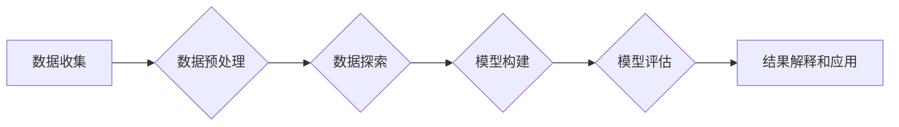

# 【AI大数据计算原理与代码实例讲解】数据挖掘

> 关键词：数据挖掘，大数据，机器学习，算法，Python，Hadoop，Spark

## 1. 背景介绍

随着互联网技术的飞速发展，数据已经成为现代社会的重要资源。如何从海量数据中挖掘出有价值的信息，成为了企业决策、科学研究和社会管理等领域的关键问题。数据挖掘（Data Mining）作为人工智能和机器学习领域的一个重要分支，旨在通过算法和统计方法，从大量数据中提取出有用的模式和知识。

本篇文章将深入探讨数据挖掘的基本原理、核心算法、实践案例，并介绍相关工具和资源，帮助读者全面了解数据挖掘的魅力和应用。

## 2. 核心概念与联系

### 2.1 数据挖掘的基本概念

数据挖掘是指从大量数据中提取出有价值信息的过程。它涉及多个学科领域，包括统计学、机器学习、数据库管理、人工智能等。

### 2.2 数据挖掘的流程

数据挖掘的流程通常包括以下步骤：

1. **数据收集**：收集原始数据，包括结构化数据、半结构化数据和非结构化数据。
2. **数据预处理**：对原始数据进行清洗、转换和整合，以提高数据质量和可用性。
3. **数据探索**：对数据进行分析，发现数据中存在的规律和趋势。
4. **模型构建**：选择合适的算法和模型，对数据进行挖掘。
5. **模型评估**：评估模型的性能，选择最优模型。
6. **结果解释和应用**：解释挖掘结果，并将其应用于实际问题中。

### 2.3 Mermaid 流程图



## 3. 核心算法原理 & 具体操作步骤

### 3.1 算法原理概述

数据挖掘涉及多种算法，主要包括以下几类：

1. **关联规则挖掘**：发现数据集中不同项目之间的关联关系。
2. **聚类分析**：将相似的数据划分为一组，形成聚类。
3. **分类与回归**：根据已有数据对未知数据进行预测。
4. **异常检测**：识别数据中的异常值或异常模式。
5. **社交网络分析**：分析社交网络中的用户关系和互动。

### 3.2 算法步骤详解

#### 3.2.1 关联规则挖掘

关联规则挖掘的目的是发现数据集中不同项目之间的关联关系。其基本步骤如下：

1. **确定支持度和置信度**：支持度表示一个规则在数据集中出现的频率，置信度表示规则的前件出现时，后件出现的概率。
2. **生成频繁项集**：从数据集中生成所有支持度大于设定阈值的项集。
3. **生成关联规则**：从频繁项集中生成关联规则，并根据置信度过滤掉不满足条件的规则。

#### 3.2.2 聚类分析

聚类分析的目标是将相似的数据划分为一组。常用的聚类算法包括K-means、层次聚类、DBSCAN等。

#### 3.2.3 分类与回归

分类与回归是两种常见的预测任务。分类的目标是判断数据属于哪个类别，回归的目标是预测一个连续值。

#### 3.2.4 异常检测

异常检测的目标是识别数据中的异常值或异常模式。常用的异常检测算法包括孤立森林、LOF等。

#### 3.2.5 社交网络分析

社交网络分析旨在分析社交网络中的用户关系和互动。常用的社交网络分析算法包括度分析、社区发现等。

### 3.3 算法优缺点

每种数据挖掘算法都有其优缺点。以下是一些常见算法的优缺点：

| 算法 | 优点 | 缺点 |
| --- | --- | --- |
| 关联规则挖掘 | 简单易懂，可解释性强 | 可能会产生大量的无关规则 |
| K-means | 简单快速，易于实现 | 可能产生局部最优解，对初始聚类中心敏感 |
| 决策树 | 可解释性强，易于理解 | 容易过拟合，容易受到噪声影响 |
| 支持向量机 | 泛化能力强，性能稳定 | 模型复杂度高，参数调优难度大 |

### 3.4 算法应用领域

数据挖掘算法广泛应用于各个领域，包括：

- 零售业：客户细分、推荐系统、促销策略等。
- 金融业：信用评估、风险管理、欺诈检测等。
- 医疗保健：疾病预测、患者分类、药物发现等。
- 交通领域：交通流量预测、路线规划、事故检测等。
- 社交网络：用户画像、社区发现、舆情分析等。

## 4. 数学模型和公式 & 详细讲解 & 举例说明

### 4.1 数学模型构建

数据挖掘涉及多种数学模型，包括概率论、统计学、线性代数等。以下是一些常见数学模型的简要介绍：

- **概率论**：研究随机事件及其规律性。
- **统计学**：通过数据收集、分析和解释，推断总体特征。
- **线性代数**：研究向量、矩阵等数学对象及其运算。

### 4.2 公式推导过程

以下以K-means聚类算法为例，介绍公式推导过程。

#### 4.2.1 K-means算法

K-means算法是一种基于距离的聚类算法。其基本思想是将数据集划分为K个簇，使得每个簇内的数据点距离其质心的距离最小。

#### 4.2.2 质心计算

假设数据集D包含N个数据点，将其划分为K个簇，第k个簇的质心计算公式如下：

$$
c_k = \frac{1}{|C_k|} \sum_{x \in C_k} x
$$

其中，$C_k$ 表示第k个簇，$|C_k|$ 表示第k个簇中数据点的数量。

#### 4.2.3 聚类过程

1. 随机选择K个数据点作为初始质心。
2. 将每个数据点分配到与其最近的质心所属的簇。
3. 计算每个簇的新质心。
4. 重复步骤2和3，直到质心不再发生显著变化。

### 4.3 案例分析与讲解

以下以一个简单的客户细分案例，演示数据挖掘在零售业中的应用。

#### 4.3.1 案例背景

某电商平台希望根据客户购买行为进行客户细分，以便进行精准营销。

#### 4.3.2 数据预处理

1. 收集客户购买历史数据，包括购买时间、商品类别、购买金额等。
2. 对数据进行清洗，去除缺失值和异常值。
3. 对数据进行转换，如将商品类别进行编码。

#### 4.3.3 模型构建

选择K-means算法对客户进行聚类。

#### 4.3.4 模型评估

根据聚类结果，分析不同客户群体的购买行为，如购买频率、购买金额等。

#### 4.3.5 结果解释和应用

根据客户细分结果，针对不同客户群体制定相应的营销策略，如推出个性化推荐、优惠活动等。

## 5. 项目实践：代码实例和详细解释说明

### 5.1 开发环境搭建

1. 安装Python环境。
2. 安装NumPy、Pandas、Scikit-learn等Python库。

### 5.2 源代码详细实现

以下是一个使用Scikit-learn库实现K-means聚类算法的代码实例：

```python
from sklearn.cluster import KMeans
from sklearn.datasets import make_blobs
import matplotlib.pyplot as plt

# 生成模拟数据
X, _ = make_blobs(n_samples=300, centers=4, cluster_std=0.60, random_state=0)

# 创建KMeans聚类对象
kmeans = KMeans(n_clusters=4, random_state=0).fit(X)

# 绘制聚类结果
plt.scatter(X[:, 0], X[:, 1], c=kmeans.labels_, cmap='viridis')
plt.show()
```

### 5.3 代码解读与分析

- `make_blobs`函数用于生成模拟数据。
- `KMeans`类创建一个KMeans聚类对象。
- `fit`方法对数据进行聚类。
- `labels_`属性存储聚类结果。
- `scatter`函数绘制聚类结果。

### 5.4 运行结果展示

运行上述代码，将生成一个散点图，展示聚类结果。

## 6. 实际应用场景

### 6.1 金融风控

数据挖掘在金融风控领域的应用非常广泛，包括：

- 信用卡欺诈检测
- 信用评分
- 信贷风险预警
- 保险欺诈检测

### 6.2 零售业客户细分

数据挖掘可以帮助零售企业对客户进行细分，以便进行精准营销和个性化服务。

### 6.3 医疗保健

数据挖掘在医疗保健领域的应用包括：

- 疾病预测
- 病情分析
- 药物发现
- 医疗资源分配

### 6.4 交通领域

数据挖掘在交通领域的应用包括：

- 交通流量预测
- 路线规划
- 交通事故检测
- 交通信号控制

### 6.5 社交网络

数据挖掘在社交网络领域的应用包括：

- 用户画像
- 社区发现
- 舆情分析
- 推荐系统

## 7. 工具和资源推荐

### 7.1 学习资源推荐

1. 《数据挖掘：概念与技术》
2. 《Python数据分析基础教程》
3. 《机器学习实战》
4. 《Scikit-learn手册》

### 7.2 开发工具推荐

1. Python
2. Jupyter Notebook
3. Scikit-learn
4. Pandas
5. NumPy

### 7.3 相关论文推荐

1. K-means clustering process
2. Data mining: A neural network perspective
3. An overview of data mining techniques
4. An overview of machine learning techniques

## 8. 总结：未来发展趋势与挑战

### 8.1 研究成果总结

数据挖掘作为一种跨学科的技术，在各个领域都取得了显著的成果。随着算法和技术的不断进步，数据挖掘将在未来发挥更加重要的作用。

### 8.2 未来发展趋势

1. 大数据与人工智能的结合
2. 跨领域数据挖掘
3. 实时数据挖掘
4. 可解释性数据挖掘

### 8.3 面临的挑战

1. 数据质量问题
2. 算法选择和调优
3. 模型可解释性
4. 隐私保护

### 8.4 研究展望

数据挖掘技术将在未来发挥更加重要的作用，为人类社会带来更多价值。

## 9. 附录：常见问题与解答

**Q1：数据挖掘与机器学习的区别是什么？**

A：数据挖掘和机器学习是密切相关的两个领域。数据挖掘侧重于从大量数据中提取有用信息，而机器学习侧重于通过算法和模型学习数据中的规律。数据挖掘通常需要用到机器学习算法来实现。

**Q2：如何选择合适的数据挖掘算法？**

A：选择合适的数据挖掘算法需要根据具体任务和数据特点来确定。可以参考以下因素：

- 数据类型：结构化数据、半结构化数据或非结构化数据
- 目标：分类、回归、聚类或异常检测
- 数据规模：小规模数据、中等规模数据或大规模数据

**Q3：数据挖掘在哪些领域应用广泛？**

A：数据挖掘在金融、医疗保健、零售业、交通领域、社交网络等领域应用广泛。

**Q4：如何提高数据挖掘模型的性能？**

A：提高数据挖掘模型性能的方法包括：

- 数据预处理：对数据进行清洗、转换和整合
- 算法选择和调优：选择合适的算法，并进行参数调优
- 模型集成：结合多个模型，提高预测准确性

**Q5：如何确保数据挖掘过程中的数据安全和隐私保护？**

A：确保数据安全和隐私保护的方法包括：

- 数据脱敏：对敏感数据进行加密或替换
- 访问控制：限制对敏感数据的访问权限
- 数据审计：监控数据使用情况，及时发现异常行为

---

作者：禅与计算机程序设计艺术 / Zen and the Art of Computer Programming