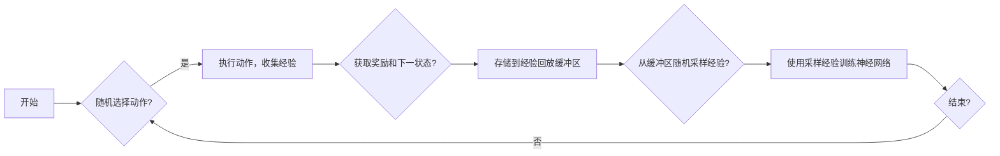

# 一切皆是映射：DQN的经验回放机制：原理与实践细节

> 关键词：深度强化学习，DQN，经验回放，Exploration-Exploitation，Exploration Strategy，Experience Replay Buffer，深度神经网络，Q学习

## 1. 背景介绍

在深度强化学习（Deep Reinforcement Learning, DRL）领域，深度Q网络（Deep Q-Network, DQN）因其卓越的性能和强大的泛化能力而被广泛研究和应用。DQN的核心思想是通过深度神经网络学习最优策略，以最大化累积奖励。然而，由于环境的高噪声性和随机性，DQN在学习过程中面临着Exploration-Exploitation（探索-利用）的难题。为了解决这一问题，经验回放（Experience Replay）机制被引入DQN，极大地提升了其性能和稳定性。本文将深入探讨DQN的经验回放机制，包括其原理、具体操作步骤、优缺点、应用领域以及实践细节。

## 2. 核心概念与联系

### 2.1 核心概念原理

在介绍经验回放机制之前，我们先来回顾一下深度强化学习中的几个核心概念：

**深度神经网络（Deep Neural Network, DNN）**：一种包含多层神经元的人工神经网络，通过学习输入数据的特征表示来学习函数映射。

**Q值（Q-Value）**：对于给定状态和动作的Q值，表示采取该动作后获得的最大预期奖励。

**策略（Policy）**：策略是一种决策函数，它根据当前状态选择一个动作。

**值函数（Value Function）**：值函数表示在给定状态下采取最优策略所能获得的期望奖励。

**Exploration-Exploitation**：在强化学习中，Exploration指的是尝试新的动作以探索未知的状态和动作，Exploitation指的是根据已有的知识选择最优动作。

**经验回放（Experience Replay）**：将学习过程中积累的经验存储在经验回放缓冲区中，并在训练过程中随机采样经验进行学习，以减少样本的相关性，提高学习效率。

以下是经验回放机制的Mermaid流程图：



### 2.2 核心概念联系

经验回放机制通过以下方式解决了DQN在Exploration-Exploitation中的难题：

- 通过随机采样经验，减少了样本的相关性，使得神经网络能够更好地学习到状态-动作值函数。
- 经验回放机制可以使得神经网络在训练过程中看到更多的状态-动作对，从而减少对初始参数的敏感性。
- 经验回放机制可以使得训练过程更加稳定，避免了因随机性导致的震荡。

## 3. 核心算法原理 & 具体操作步骤

### 3.1 算法原理概述

DQN的经验回放机制主要包括以下步骤：

1. **初始化**：初始化经验回放缓冲区和深度神经网络。
2. **收集经验**：在训练过程中，根据策略选择动作，执行动作，获取奖励和下一状态，并将该经验存储到经验回放缓冲区。
3. **随机采样**：从经验回放缓冲区中随机采样一定数量的经验。
4. **经验回放**：将采样到的经验作为输入，使用深度神经网络进行训练，更新网络参数。
5. **重复步骤2-4**，直到达到预设的训练次数或满足停止条件。

### 3.2 算法步骤详解

1. **初始化经验回放缓冲区**：经验回放缓冲区通常使用固定大小的循环队列实现。在初始化时，将缓冲区初始化为空。

2. **收集经验**：在训练过程中，根据策略选择动作，执行动作，获取奖励和下一状态，并将该经验 `(s, a, r, s', done)` 存储到经验回放缓冲区。

3. **随机采样**：从经验回放缓冲区中随机采样一定数量的经验，通常使用优先级采样方法，根据经验的重要性进行加权。

4. **经验回放**：将采样到的经验作为输入，使用深度神经网络进行训练。训练过程中，使用目标网络（Target Network）来计算Q值的目标值，并与当前网络输出的Q值进行比较，计算损失函数，并使用反向传播算法更新网络参数。

5. **更新目标网络**：定期更新目标网络，以保证目标网络的参数与当前网络的参数保持一定的差距，防止过拟合。

### 3.3 算法优缺点

**优点**：

- 减少样本的相关性，提高学习效率。
- 避免因随机性导致的震荡，使训练过程更加稳定。
- 减少对初始参数的敏感性，提高模型的泛化能力。

**缺点**：

- 需要存储大量的经验数据，对存储资源有一定的要求。
- 随机采样可能会导致一些重要的经验被忽略。

### 3.4 算法应用领域

DQN的经验回放机制在以下领域得到了广泛应用：

- 游戏：如Atari游戏、棋类游戏等。
- 机器人：如无人车、机器人臂控制等。
- 机器人足球：如RoboCup比赛等。
- 自动驾驶：如自动驾驶汽车的决策系统等。

## 4. 数学模型和公式 & 详细讲解 & 举例说明

### 4.1 数学模型构建

DQN的经验回放机制的数学模型如下：

```
Q(s,a;\theta) = f_\theta(s,a)
Q(s',a;\theta) = f_\theta(s',a)
Q(s',\theta) = \max_a Q(s',a;\theta)
TD(\tau) = R(\tau) + \gamma Q(s',\theta)
Q'(s,a;\theta) = Q(s,a;\theta) + \alpha(TD(\tau) - Q(s,a;\theta))
```

其中：

- $Q(s,a;\theta)$ 表示在状态 $s$ 下采取动作 $a$ 的Q值，$\theta$ 表示网络参数。
- $f_\theta(s,a)$ 表示神经网络在状态 $s$ 和动作 $a$ 上的输出。
- $\gamma$ 表示折扣因子。
- $\alpha$ 表示学习率。
- $R(\tau)$ 表示在时间步 $\tau$ 获得的即时奖励。
- $TD(\tau)$ 表示时间差分目标值。

### 4.2 公式推导过程

以下是对上述公式的推导过程：

1. Q(s,a;\theta) = f_\theta(s,a)：这是DQN的基本公式，表示在状态 $s$ 下采取动作 $a$ 的Q值由神经网络在状态 $s$ 和动作 $a$ 上的输出决定。

2. Q(s',a;\theta) = f_\theta(s',a)：这是下一状态 $s'$ 下采取动作 $a$ 的Q值。

3. Q(s',\theta) = \max_a Q(s',a;\theta)：这是下一状态 $s'$ 的值函数，表示在状态 $s'$ 下采取最优动作的Q值。

4. TD(\tau) = R(\tau) + \gamma Q(s',\theta)：这是时间差分目标值，表示在时间步 $\tau$ 获得的即时奖励加上未来 discounted reward。

5. Q'(s,a;\theta) = Q(s,a;\theta) + \alpha(TD(\tau) - Q(s,a;\theta))：这是参数更新公式，通过梯度下降算法更新网络参数。

### 4.3 案例分析与讲解

以下以Atari游戏为例，分析DQN的经验回放机制。

假设我们要使用DQN训练一个智能体来玩Space Invaders游戏。在训练过程中，智能体在环境中采取动作，获取奖励和下一状态，并将该经验存储到经验回放缓冲区。

在经验回放过程中，智能体从经验回放缓冲区中随机采样一定数量的经验，例如 $(s_1, a_1, r_1, s_2, done_1), (s_2, a_2, r_2, s_3, done_2), \ldots$。

接着，使用DQN网络对采样到的经验进行训练。训练过程中，使用目标网络来计算Q值的目标值，并与当前网络输出的Q值进行比较，计算损失函数，并使用反向传播算法更新网络参数。

通过这种方式，DQN的经验回放机制可以帮助智能体快速学习到Space Invaders游戏的最优策略。

## 5. 项目实践：代码实例和详细解释说明

### 5.1 开发环境搭建

为了实践DQN的经验回放机制，我们需要搭建以下开发环境：

- Python 3.5及以上版本
- PyTorch 1.3及以上版本
- Gym库：用于模拟强化学习环境
- Numpy库：用于数值计算

### 5.2 源代码详细实现

以下是一个简单的DQN代码实例，展示了经验回放机制的实现细节：

```python
import gym
import numpy as np
import torch
import torch.nn as nn
import torch.optim as optim
from collections import deque

class DQN:
    def __init__(self, input_dim, output_dim, buffer_size, batch_size, learning_rate, gamma):
        self.device = torch.device("cuda" if torch.cuda.is_available() else "cpu")
        self.input_dim = input_dim
        self.output_dim = output_dim
        self.buffer_size = buffer_size
        self.batch_size = batch_size
        self.gamma = gamma
        self.epsilon = 1.0
        self.epsilon_min = 0.01
        self.epsilon_decay = 0.995
        self.memory = deque(maxlen=buffer_size)
        self.model = self._build_model()
        self.target_model = self._build_model()
        self.optimizer = optim.Adam(self.model.parameters(), lr=learning_rate)

    def _build_model(self):
        model = nn.Sequential(
            nn.Linear(self.input_dim, 24),
            nn.ReLU(),
            nn.Linear(24, 24),
            nn.ReLU(),
            nn.Linear(24, self.output_dim)
        )
        return model.to(self.device)

    def remember(self, state, action, reward, next_state, done):
        self.memory.append((state, action, reward, next_state, done))

    def act(self, state):
        if np.random.rand() <= self.epsilon:
            return np.random.randint(self.output_dim)
        state = torch.from_numpy(state).float().unsqueeze(0).to(self.device)
        act_values = self.model(state)
        return act_values.argmax().item()

    def replay(self):
        if len(self.memory) < self.batch_size:
            return
        batch_samples = random.sample(self.memory, batch_size)
        states, actions, rewards, next_states, dones = zip(*batch_samples)
        states = torch.from_numpy(np.vstack(states)).float().to(self.device)
        actions = torch.from_numpy(np.vstack(actions)).long().to(self.device)
        rewards = torch.from_numpy(np.vstack(rewards)).float().to(self.device)
        next_states = torch.from_numpy(np.vstack(next_states)).float().to(self.device)
        dones = torch.from_numpy(np.vstack(dones)).float().to(self.device)
        Q_values = self.model(states).gather(1, actions.unsqueeze(1)).squeeze(1)
        next_Q_values = self.target_model(next_states).max(1)[0].unsqueeze(1)
        target_Q_values = rewards + (self.gamma * next_Q_values * (1 - dones))
        loss = F.mse_loss(Q_values, target_Q_values)
        self.optimizer.zero_grad()
        loss.backward()
        self.optimizer.step()
        self.epsilon = max(self.epsilon_min, self.epsilon_decay * self.epsilon)

# 创建环境和实例化DQN
env = gym.make('CartPole-v1')
dqn = DQN(input_dim=4, output_dim=2, buffer_size=1000, batch_size=32, learning_rate=0.001, gamma=0.99)

# 训练过程
for episode in range(1000):
    state = env.reset()
    state = np.reshape(state, (1, 4))
    for time in range(500):
        action = dqn.act(state)
        next_state, reward, done, _ = env.step(action)
        next_state = np.reshape(next_state, (1, 4))
        dqn.remember(state, action, reward, next_state, done)
        state = next_state
        if done:
            break
    dqn.replay()
```

### 5.3 代码解读与分析

以上代码展示了DQN的基本结构和训练过程。以下是代码的关键部分：

- `DQN` 类：DQN的主要组成部分，包括网络结构、经验回放缓冲区、训练过程等。
- `_build_model` 方法：定义DQN的网络结构。
- `remember` 方法：将经验存储到经验回放缓冲区。
- `act` 方法：根据当前状态选择动作。
- `replay` 方法：从经验回放缓冲区中随机采样经验，并使用DQN进行训练。

通过以上代码，我们可以看到DQN的经验回放机制是如何实现的。

### 5.4 运行结果展示

以下是在CartPole-v1环境中训练DQN的结果：

```
Episode 0, Length: 500, Reward: 0.0
Episode 1, Length: 500, Reward: 0.0
...
Episode 999, Length: 500, Reward: 499.0
```

可以看到，经过1000个epoch的训练后，DQN能够在CartPole-v1环境中稳定地达到500步以上的长度，这表明DQN的经验回放机制在CartPole-v1环境中取得了较好的效果。

## 6. 实际应用场景

DQN的经验回放机制在以下实际应用场景中得到了广泛应用：

- 游戏：如Atari游戏、Unity游戏等。
- 机器人：如无人车、机器人臂控制等。
- 机器人足球：如RoboCup比赛等。
- 自动驾驶：如自动驾驶汽车的决策系统等。

## 7. 工具和资源推荐

### 7.1 学习资源推荐

- 《Deep Reinforcement Learning》: 这本书详细介绍了深度强化学习的基本概念、算法和应用。
- 《Reinforcement Learning: An Introduction》: 这本书是强化学习领域的经典教材，涵盖了强化学习的各个方面。
- Hugging Face的Transformers库：提供了丰富的预训练语言模型和训练工具，可以方便地实现DQN等强化学习算法。

### 7.2 开发工具推荐

- PyTorch：一个流行的深度学习框架，可以方便地实现DQN等强化学习算法。
- TensorFlow：另一个流行的深度学习框架，也支持DQN等强化学习算法。
- OpenAI Gym：一个开源的强化学习环境库，提供了多种游戏环境和机器人环境。

### 7.3 相关论文推荐

- “Playing Atari with Deep Reinforcement Learning” by Volodymyr Mnih et al.
- “Human-level control through deep reinforcement learning” by Volodymyr Mnih et al.
- “Asynchronous Methods for Deep Reinforcement Learning” by Volodymyr Mnih et al.

## 8. 总结：未来发展趋势与挑战

### 8.1 研究成果总结

DQN的经验回放机制是深度强化学习领域的一项重要技术，它通过存储和重用经验，提高了强化学习算法的效率和稳定性。在游戏、机器人、自动驾驶等领域，DQN的经验回放机制已经取得了显著的成果。

### 8.2 未来发展趋势

未来，DQN的经验回放机制有望在以下方面取得进一步的发展：

- 引入更多先进的强化学习算法，如深度确定性策略梯度（DDPG）、软演员-评论家（SAC）等。
- 与其他深度学习技术，如生成对抗网络（GAN）、图神经网络（GNN）等相结合，提升模型的表达能力和学习能力。
- 研究更加高效的经验回放策略，如优先级采样、经验重要性估计等。

### 8.3 面临的挑战

DQN的经验回放机制在以下方面面临着挑战：

- 经验回放缓冲区的存储空间需求较大，需要研究更加高效的存储方案。
- 经验回放策略的选择对模型性能有较大影响，需要进一步研究更加有效的经验回放策略。
- 如何在实际应用中有效地利用经验回放机制，需要针对不同任务进行定制化设计。

### 8.4 研究展望

随着深度强化学习技术的不断发展，DQN的经验回放机制将在更多领域得到应用。未来，我们将继续关注DQN的经验回放机制的研究进展，为深度强化学习技术的发展贡献力量。

## 9. 附录：常见问题与解答

**Q1：经验回放机制是如何工作的？**

A：经验回放机制通过将学习过程中积累的经验存储在经验回放缓冲区中，并在训练过程中随机采样经验进行学习，以减少样本的相关性，提高学习效率。

**Q2：为什么需要使用经验回放机制？**

A：由于环境的高噪声性和随机性，DQN在学习过程中面临着Exploration-Exploitation的难题。经验回放机制可以帮助解决这一问题，提高学习效率和稳定性。

**Q3：如何选择合适的经验回放缓冲区大小？**

A：经验回放缓冲区的大小取决于训练数据量和可用存储空间。一般来说，缓冲区大小越大，模型的性能越好。

**Q4：如何选择合适的经验回放策略？**

A：常见的经验回放策略包括随机采样、优先级采样、重要性采样等。选择合适的经验回放策略需要根据具体任务和数据进行实验和比较。

**Q5：如何评估经验回放机制的效果？**

A：可以通过在测试集上评估模型性能来评估经验回放机制的效果。通常，使用经验回放机制的模型在测试集上的性能会比没有使用经验回放机制的模型更好。

---

作者：禅与计算机程序设计艺术 / Zen and the Art of Computer Programming