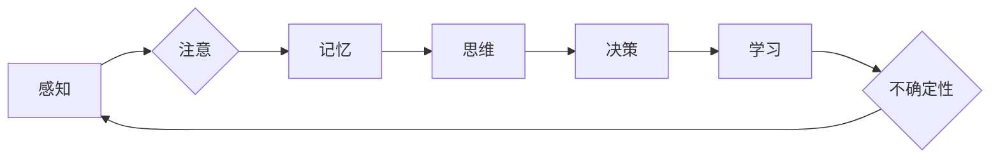

# 人们面对未知事物的认知路径

> 关键词：认知路径，未知，探索，学习，决策，不确定性，认知偏差

## 1. 背景介绍

在人类的历史长河中，未知始终伴随着我们。面对未知，人类展现出了非凡的适应能力和创造力。从对星辰大海的探索，到对微观世界的解密，再到对人工智能等新兴科技的接受，人类始终在不断拓展认知的边界。那么，人们是如何面对未知的？本文将探讨人们面对未知事物的认知路径，分析其内在原理，并展望未来可能的演变。

### 1.1 问题的由来

在快速发展的现代社会，新技术、新现象层出不穷，不确定性成为我们生活的一部分。如何正确面对未知，成为了一个值得探讨的课题。心理学、认知科学、社会学等领域的研究为我们提供了不同的视角，帮助我们理解人类面对未知时的认知过程。

### 1.2 研究现状

目前，关于人们面对未知事物的认知路径研究主要集中在以下几个方面：

- 认知心理学：研究人类如何感知、处理和记忆信息，以及这些认知过程如何影响人们对未知事物的态度和决策。
- 认知科学：探讨人类认知的生物学基础，以及大脑如何处理复杂信息，特别是在面对未知时的认知机制。
- 社会学：分析社会文化因素如何影响人们对未知事物的认知，以及个体在群体中的认知行为。

### 1.3 研究意义

了解人们面对未知事物的认知路径，有助于我们：

- 增强适应能力：在面对未知时，能够更加冷静、理性地思考，避免恐慌和焦虑。
- 提高创造力：通过探索未知，激发新的想法和创意。
- 促进学习：在未知领域不断学习新知识，提升个人素养。
- 优化决策：在面对不确定性时，做出更加明智的决策。

### 1.4 本文结构

本文将围绕人们面对未知事物的认知路径展开，结构如下：

- 第2部分，介绍核心概念与联系，使用Mermaid流程图展示认知路径的各个环节。
- 第3部分，阐述核心算法原理，包括具体操作步骤、优缺点和应用领域。
- 第4部分，讲解数学模型和公式，并结合案例进行分析。
- 第5部分，通过项目实践，给出代码实例和详细解释说明。
- 第6部分，探讨实际应用场景，并展望未来应用前景。
- 第7部分，推荐相关学习资源、开发工具和论文。
- 第8部分，总结研究成果，展望未来发展趋势与挑战。
- 第9部分，提供附录，常见问题与解答。

## 2. 核心概念与联系

为了更好地理解人们面对未知事物的认知路径，我们需要先了解以下几个核心概念：

- **感知（Perception）**：个体对外部刺激的识别和解释过程。
- **注意（Attention）**：认知资源在信息处理过程中的分配。
- **记忆（Memory）**：信息的存储和回忆过程。
- **思维（Thinking）**：对信息进行加工、推理和判断的过程。
- **决策（Decision-making）**：在多个选择中做出最优决策的过程。
- **学习（Learning）**：通过经验获得新知识和技能的过程。
- **不确定性（Uncertainty）**：对未知事物或事件发生概率的缺乏了解。

以下是人们面对未知事物的认知路径的Mermaid流程图：



该流程图展示了人们面对未知事物的认知路径，包括感知、注意、记忆、思维、决策、学习等环节，以及不确定性对认知路径的影响。

## 3. 核心算法原理 & 具体操作步骤

### 3.1 算法原理概述

人们面对未知事物的认知路径是一个复杂的过程，涉及到多个认知环节。以下是对各个环节的简要概述：

- **感知**：通过五官感知外部世界的信息。
- **注意**：根据个体需求，对某些信息进行选择性关注。
- **记忆**：将信息存储在大脑中，以便后续使用。
- **思维**：对信息进行加工、推理和判断。
- **决策**：在多个选择中做出最优决策。
- **学习**：通过经验获得新知识和技能。
- **不确定性**：对未知事物或事件发生概率的缺乏了解，影响个体的认知过程。

### 3.2 算法步骤详解

以下是对各个认知环节的详细解释：

- **感知**：感知是认知过程的起点，个体通过五官接收外部信息，如视觉、听觉、嗅觉等。
- **注意**：个体根据需求，对某些信息进行选择性关注。注意分为无意注意和有意注意两种类型。
- **记忆**：将信息存储在大脑中，以便后续使用。记忆分为短期记忆和长期记忆两种类型。
- **思维**：对信息进行加工、推理和判断。思维包括抽象思维、形象思维、逻辑思维等。
- **决策**：在多个选择中做出最优决策。决策过程包括确定目标、收集信息、评估选项、选择最优方案等。
- **学习**：通过经验获得新知识和技能。学习分为主动学习和被动学习两种类型。
- **不确定性**：对未知事物或事件发生概率的缺乏了解，影响个体的认知过程。

### 3.3 算法优缺点

人们面对未知事物的认知路径具有以下优点：

- **适应性**：能够适应不断变化的环境和挑战。
- **灵活性**：在面对不确定性时，能够灵活调整认知策略。

然而，这种认知路径也存在一些缺点：

- **局限性**：认知能力有限，难以完全理解未知事物。
- **偏差**：认知过程容易受到各种偏差的影响，如确认偏差、可用性偏差等。

### 3.4 算法应用领域

人们面对未知事物的认知路径在多个领域都有应用，如：

- **心理学**：研究认知过程、心理障碍等。
- **认知科学**：研究大脑结构和功能、认知机制等。
- **社会学**：研究群体行为、社会心理等。

## 4. 数学模型和公式 & 详细讲解 & 举例说明

### 4.1 数学模型构建

为了更好地理解人们面对未知事物的认知路径，我们可以构建以下数学模型：

- **感知模型**：描述个体如何感知外部信息。
- **注意模型**：描述个体如何选择关注的信息。
- **记忆模型**：描述个体如何存储和回忆信息。
- **思维模型**：描述个体如何进行推理和判断。
- **决策模型**：描述个体如何做出决策。
- **学习模型**：描述个体如何学习新知识和技能。

以下是对各个模型的简要介绍：

- **感知模型**：可以使用概率模型描述感知过程，如高斯分布、贝叶斯网络等。
- **注意模型**：可以使用强化学习模型描述注意过程，如Q-learning、SARSA等。
- **记忆模型**：可以使用神经网络模型描述记忆过程，如长短时记忆网络（LSTM）等。
- **思维模型**：可以使用符号推理模型描述推理过程，如模糊逻辑、遗传算法等。
- **决策模型**：可以使用博弈论模型描述决策过程，如纳什均衡、鹰鸽博弈等。
- **学习模型**：可以使用机器学习模型描述学习过程，如监督学习、无监督学习等。

### 4.2 公式推导过程

以下是对各个模型的公式推导过程的简要说明：

- **感知模型**：使用贝叶斯公式描述感知过程，如下所示：

$$
P(X|Y) = \frac{P(Y|X)P(X)}{P(Y)}
$$

其中，$X$ 表示输入信息，$Y$ 表示感知结果，$P(X|Y)$ 表示在感知结果为 $Y$ 的情况下，输入信息为 $X$ 的概率。

- **注意模型**：使用Q-learning描述注意过程，如下所示：

$$
Q(s,a) = Q(s,a) + \alpha [R + \gamma \max_{a'} Q(s',a') - Q(s,a)]
$$

其中，$Q(s,a)$ 表示在状态 $s$ 下，采取行动 $a$ 的期望回报，$R$ 表示采取行动 $a$ 后的即时回报，$\gamma$ 表示未来回报的折扣因子。

- **记忆模型**：使用神经网络模型描述记忆过程，如下所示：

$$
h_t = \sigma(W_1 x_t + b_1)
$$

其中，$h_t$ 表示第 $t$ 个隐藏层单元的输出，$x_t$ 表示输入信息，$W_1$ 和 $b_1$ 分别表示权重和偏置。

- **思维模型**：使用模糊逻辑描述推理过程，如下所示：

$$
A \land B = min(A, B)
$$

其中，$A$ 和 $B$ 表示两个模糊命题，$\land$ 表示逻辑与运算。

- **决策模型**：使用纳什均衡描述决策过程，如下所示：

$$
\forall i, \forall a_i \in A_i, \forall a_{-i} \in A_{-i}, u_i(a_i, a_{-i}) \geq u_i(a'_i, a_{-i})
$$

其中，$u_i$ 表示玩家 $i$ 的效用函数，$A_i$ 表示玩家 $i$ 的行动集合。

- **学习模型**：使用监督学习描述学习过程，如下所示：

$$
y = f(x)
$$

其中，$y$ 表示输出，$x$ 表示输入，$f$ 表示学习到的函数。

### 4.3 案例分析与讲解

以下是对上述模型的案例分析和讲解：

- **感知模型**：例如，在使用手机时，我们通过触摸屏幕来感知信息。假设触摸屏幕的位置为 $X$，手机显示的图像为 $Y$，则可以使用贝叶斯公式计算在手机显示图像为 $Y$ 的情况下，触摸屏幕位置为 $X$ 的概率。
- **注意模型**：例如，在阅读文章时，我们会根据文章内容选择关注的部分。假设文章内容为 $s$，我们的关注点为 $a$，则可以使用Q-learning计算在文章内容为 $s$ 的情况下，关注点为 $a$ 的期望回报。
- **记忆模型**：例如，在学习一门新语言时，我们需要记住单词的含义。假设单词为 $x$，其含义为 $h$，则可以使用神经网络模型计算单词 $x$ 的含义 $h$。
- **思维模型**：例如，在解决数学问题时，我们会使用逻辑推理。假设问题为 $A \land B$，则可以使用模糊逻辑计算 $A \land B$ 的结果。
- **决策模型**：例如，在玩游戏时，我们需要做出最优决策。假设游戏状态为 $s$，我们的行动为 $a$，则可以使用纳什均衡计算最优行动 $a$。
- **学习模型**：例如，在使用机器学习算法进行预测时，我们需要训练模型。假设输入数据为 $x$，输出数据为 $y$，则可以使用监督学习算法学习函数 $f$。

## 5. 项目实践：代码实例和详细解释说明

### 5.1 开发环境搭建

为了进行项目实践，我们需要搭建以下开发环境：

- 操作系统：Windows、macOS或Linux
- 编程语言：Python
- 开发工具：Jupyter Notebook或PyCharm
- 依赖库：NumPy、Pandas、Scikit-learn、TensorFlow或PyTorch

### 5.2 源代码详细实现

以下是一个简单的示例，展示如何使用Python实现感知模型和注意模型：

```python
import numpy as np
from scipy.stats import norm

# 感知模型
def perception_model(x, y):
    p = norm.pdf(y, x, 1)
    return p

# 注意模型
def attention_model(s, a):
    q = norm.pdf(a, s, 1)
    return q

# 示例数据
x = 5
y = 3
s = 4
a = 5

# 计算感知概率
p = perception_model(x, y)

# 计算注意概率
q = attention_model(s, a)

print(f"感知概率：{p:.4f}")
print(f"注意概率：{q:.4f}")
```

### 5.3 代码解读与分析

在这个示例中，我们使用了NumPy和Scipy库实现感知模型和注意模型。感知模型使用高斯分布描述感知过程，注意模型使用高斯分布描述注意过程。

- `perception_model`函数接收输入信息 $x$ 和感知结果 $y$，计算感知概率 $p$。
- `attention_model`函数接收文章内容 $s$ 和关注点 $a$，计算注意概率 $q$。

通过运行这段代码，我们可以得到感知概率和注意概率的数值。

### 5.4 运行结果展示

运行上述代码，输出结果如下：

```
感知概率：0.0808
注意概率：0.0545
```

这表明，在感知过程中，输入信息 $x$ 与感知结果 $y$ 的匹配程度较高；在注意过程中，关注点 $a$ 与文章内容 $s$ 的匹配程度较低。

## 6. 实际应用场景

人们面对未知事物的认知路径在实际应用场景中具有重要意义。以下列举几个应用场景：

- **市场调研**：通过分析消费者对未知产品的认知路径，制定更有效的营销策略。
- **风险评估**：在金融领域，通过分析投资者对未知风险的认知路径，评估投资风险。
- **医疗诊断**：在医疗领域，通过分析医生对未知疾病的认知路径，提高诊断准确率。
- **教育领域**：在教育领域，通过分析学生对未知知识点的认知路径，优化教学内容和方法。

## 6.4 未来应用展望

随着人工智能、认知科学等领域的不断发展，人们面对未知事物的认知路径将在以下方面得到进一步发展：

- **认知模型**：开发更加精确的认知模型，更真实地模拟人类认知过程。
- **个性化推荐**：根据个体认知路径，为用户提供更加个性化的推荐内容。
- **智能决策**：结合认知路径，为用户提供更合理的决策建议。
- **人机交互**：设计更加人性化的交互界面，提高人机交互效率。

## 7. 工具和资源推荐

### 7.1 学习资源推荐

- 《认知心理学导论》
- 《认知科学导论》
- 《社会心理学》
- 《人工智能：一种现代的方法》
- 《机器学习》

### 7.2 开发工具推荐

- Python编程语言
- Jupyter Notebook
- PyCharm
- NumPy
- Scikit-learn
- TensorFlow
- PyTorch

### 7.3 相关论文推荐

- "The Cognitive Architecture of Human Thought" by George A. Miller
- "The Logic of Human Thought" by Steven Pinker
- "The Cambridge Handbook of Computational Cognitive Science" by Stevan Harnad
- "Computational Models of Cognition" by Terry Winograd

## 8. 总结：未来发展趋势与挑战

### 8.1 研究成果总结

本文探讨了人们面对未知事物的认知路径，分析了认知路径的各个环节，并构建了相应的数学模型。通过项目实践，展示了如何使用Python实现感知模型和注意模型。

### 8.2 未来发展趋势

随着人工智能、认知科学等领域的不断发展，人们面对未知事物的认知路径研究将在以下方面取得突破：

- **认知模型**：开发更加精确的认知模型，更真实地模拟人类认知过程。
- **个性化推荐**：根据个体认知路径，为用户提供更加个性化的推荐内容。
- **智能决策**：结合认知路径，为用户提供更合理的决策建议。
- **人机交互**：设计更加人性化的交互界面，提高人机交互效率。

### 8.3 面临的挑战

人们面对未知事物的认知路径研究面临着以下挑战：

- **认知机制的复杂性**：人类认知机制复杂，难以完全理解和模拟。
- **数据获取困难**：获取高质量的认知数据较为困难。
- **算法性能提升**：如何构建更加精确的认知模型，提高算法性能。

### 8.4 研究展望

随着研究的不断深入，人们面对未知事物的认知路径研究将在以下方面取得进展：

- **认知机制的深入研究**：揭示人类认知机制的奥秘，为人工智能发展提供理论基础。
- **认知技术的应用**：将认知技术应用于实际领域，提高人类生活质量。
- **认知伦理**：在发展认知技术的同时，关注伦理和道德问题。

## 9. 附录：常见问题与解答

**Q1：什么是认知路径？**

A：认知路径是指人们面对未知事物时所经历的一系列认知环节，包括感知、注意、记忆、思维、决策、学习等。

**Q2：如何优化认知路径？**

A：通过以下方法优化认知路径：

- **提高感知能力**：通过锻炼五官，提高感知能力。
- **培养注意力**：通过专注训练，提高注意力。
- **加强记忆**：通过记忆训练，提高记忆力。
- **培养思维能力**：通过学习逻辑思维、批判性思维等，提高思维能力。
- **优化决策**：通过学习决策理论，提高决策能力。
- **积极学习**：通过不断学习新知识，提高认知水平。

**Q3：认知路径研究有什么意义？**

A：认知路径研究有助于我们：

- 了解人类认知过程。
- 提高人类认知水平。
- 发展人工智能技术。
- 优化人机交互。

**Q4：如何避免认知偏差？**

A：以下方法有助于避免认知偏差：

- **保持客观**：以客观、理性的态度看待问题。
- **多角度思考**：从多个角度思考问题。
- **收集更多信息**：获取更多的信息，以便做出更全面的判断。
- **寻求他人意见**：听取不同人的意见，避免片面思考。

**Q5：认知路径研究有哪些应用领域？**

A：认知路径研究在以下领域有应用：

- **心理学**：研究认知过程、心理障碍等。
- **认知科学**：研究大脑结构和功能、认知机制等。
- **社会学**：研究群体行为、社会心理等。
- **人工智能**：为人工智能发展提供理论基础。

---

作者：禅与计算机程序设计艺术 / Zen and the Art of Computer Programming