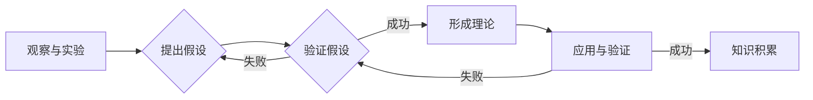

# 从假说到真理：科学方法论的循环

> 关键词：科学方法论，假设，理论，实验，验证，迭代，人工智能，机器学习，深度学习

## 1. 背景介绍

科学方法论是人类认识和探索世界的基本方法，它通过一系列的逻辑步骤，从观察现象到提出假说，再到验证假说，最终形成理论，从而推动人类知识的发展。在信息技术迅猛发展的今天，科学方法论同样在计算机科学、人工智能等领域发挥着至关重要的作用。本文将探讨科学方法论的循环过程，以及如何在机器学习和深度学习领域应用这一方法论，最终从假说到真理。

### 1.1 问题的由来

在科学研究中，从假说到真理的过程往往复杂而曲折。如何确保这一过程的科学性和有效性，如何将科学方法论应用于计算机科学和人工智能领域，是当前亟待解决的问题。

### 1.2 研究现状

目前，科学方法论在计算机科学和人工智能领域的应用主要体现在以下几个方面：

- 机器学习：通过训练数据集学习模型，预测或分类新的数据。
- 深度学习：利用深度神经网络，从大规模数据中提取特征，实现复杂的机器学习任务。
- 计算机视觉：通过图像识别、目标检测等技术，使计算机能够理解图像中的信息。
- 自然语言处理：通过自然语言理解、机器翻译等技术，使计算机能够理解人类语言。

### 1.3 研究意义

研究科学方法论的循环过程，有助于我们更好地理解和应用科学方法论，推动计算机科学和人工智能领域的发展。

### 1.4 本文结构

本文将分为以下章节：

- 第2章介绍科学方法论的核心概念与联系。
- 第3章探讨机器学习和深度学习中的科学方法论循环。
- 第4章分析科学方法论循环中的数学模型和公式。
- 第5章以具体案例展示科学方法论的实践过程。
- 第6章探讨科学方法论在实际应用场景中的未来展望。
- 第7章推荐相关工具和资源。
- 第8章总结全文，展望未来发展趋势与挑战。
- 第9章提供常见问题与解答。

## 2. 核心概念与联系

### 2.1 科学方法论的核心概念

科学方法论主要包括以下核心概念：

- 观察与实验：通过观察和实验，收集数据，为后续研究提供依据。
- 假设：基于观察和实验结果，提出对现象的解释。
- 理论：通过逻辑推理和实验验证，形成对现象的全面解释。
- 验证：通过实验或观察，验证理论的有效性。

### 2.2 Mermaid流程图

以下为科学方法论循环的Mermaid流程图：



### 2.3 科学方法论的联系

科学方法论循环中的各个概念之间存在着紧密的联系。观察和实验是科学研究的起点，假设是对现象的解释，理论是对现象的全面解释，验证是确保理论有效性的关键，应用与验证则是知识积累和理论修正的过程。

## 3. 核心算法原理 & 具体操作步骤

### 3.1 算法原理概述

机器学习和深度学习中的科学方法论循环主要包括以下步骤：

- 数据收集：收集与问题相关的数据。
- 数据预处理：对收集到的数据进行清洗、转换等处理。
- 模型设计：设计适合问题的模型结构。
- 模型训练：使用训练数据集训练模型。
- 模型评估：使用测试数据集评估模型性能。
- 模型优化：根据评估结果，优化模型结构和参数。

### 3.2 算法步骤详解

#### 3.2.1 数据收集

数据收集是科学研究的基础，对于机器学习和深度学习而言，数据的收集至关重要。数据来源包括公开数据集、企业内部数据、网络爬虫等。

#### 3.2.2 数据预处理

数据预处理包括数据清洗、数据转换、特征工程等步骤，旨在提高数据质量，为后续建模提供良好的数据基础。

#### 3.2.3 模型设计

模型设计包括选择合适的模型结构和算法。对于不同的任务，可能需要不同的模型结构，如神经网络、支持向量机、决策树等。

#### 3.2.4 模型训练

模型训练是使用训练数据集对模型进行训练，使模型能够学习数据中的规律和特征。

#### 3.2.5 模型评估

模型评估是使用测试数据集评估模型性能，包括准确率、召回率、F1值等指标。

#### 3.2.6 模型优化

根据模型评估结果，对模型结构和参数进行优化，以提高模型性能。

### 3.3 算法优缺点

#### 3.3.1 优点

- 模型设计灵活，可适用于各种任务。
- 模型训练过程自动化，易于实现。
- 模型性能可量化，便于评估和优化。

#### 3.3.2 缺点

- 数据质量对模型性能影响较大。
- 模型可解释性较差，难以理解其决策过程。
- 模型训练过程可能需要大量的计算资源。

### 3.4 算法应用领域

机器学习和深度学习在各个领域都有广泛的应用，如：

- 图像识别：人脸识别、物体识别、场景识别等。
- 自然语言处理：机器翻译、文本分类、情感分析等。
- 金融风控：信用评分、反欺诈、风险预测等。
- 医疗诊断：疾病检测、药物发现、基因组分析等。

## 4. 数学模型和公式 & 详细讲解 & 举例说明

### 4.1 数学模型构建

在机器学习和深度学习中，常见的数学模型包括：

- 线性模型：$y = wx + b$。
- 神经网络：多层感知机（MLP）、卷积神经网络（CNN）、循环神经网络（RNN）等。
- 支持向量机：$f(x) = \text{sign}(w \cdot x + b)$。

### 4.2 公式推导过程

以下以线性模型为例，介绍公式推导过程：

#### 4.2.1 线性回归

线性回归是回归分析的一种，其目标是找到最佳拟合直线，使得误差平方和最小。设样本数据为 $(x_i, y_i)$，则线性回归模型可表示为：

$$
y = wx + b
$$

其中，$w$ 为权重系数，$b$ 为偏置项。

#### 4.2.2 误差平方和

误差平方和是衡量模型拟合程度的指标，定义为：

$$
S = \sum_{i=1}^n (y_i - \hat{y_i})^2
$$

其中，$y_i$ 为真实值，$\hat{y_i}$ 为预测值。

#### 4.2.3 梯度下降法

梯度下降法是一种优化算法，用于寻找误差平方和的最小值。其基本思想是沿着误差函数的梯度方向更新权重系数，使误差最小化。具体步骤如下：

1. 初始化权重系数 $w$ 和偏置项 $b$。
2. 计算当前权重系数下的误差平方和。
3. 计算误差平方和关于权重系数 $w$ 和偏置项 $b$ 的梯度。
4. 根据梯度更新权重系数和偏置项：

   $$
w \leftarrow w - \alpha \frac{\partial S}{\partial w}
$$

   $$
b \leftarrow b - \alpha \frac{\partial S}{\partial b}
$$

其中，$\alpha$ 为学习率。

### 4.3 案例分析与讲解

以下以房价预测为例，介绍线性回归模型的实现过程。

假设我们要预测房价，数据集包含房屋面积、房间数、地理位置等信息。以下是数据集的一部分：

| 房屋面积（平方米） | 房间数 | 地理位置（等级） | 房价（万元） |
| :----------------: | :----: | :--------------: | :----------: |
|         100        |   2   |         1        |      80      |
|         120        |   3   |         2        |      90      |
|         150        |   4   |         3        |      110     |
|         180        |   5   |         3        |      140     |
|         200        |   6   |         4        |      180     |

使用Python中的scikit-learn库实现线性回归模型：

```python
from sklearn.linear_model import LinearRegression

# 数据预处理
X = [[100, 2, 1], [120, 3, 2], [150, 4, 3], [180, 5, 3], [200, 6, 4]]
y = [80, 90, 110, 140, 180]

# 模型训练
model = LinearRegression()
model.fit(X, y)

# 模型预测
new_house = [[150, 4, 3]]
predicted_price = model.predict(new_house)
print("预测房价：", predicted_price)
```

运行上述代码，预测房价为$ 125 $万元。可见，线性回归模型可以较好地拟合房价与房屋面积、房间数、地理位置之间的关系。

## 5. 项目实践：代码实例和详细解释说明

### 5.1 开发环境搭建

在进行机器学习和深度学习项目实践前，我们需要准备好开发环境。以下是使用Python进行相关项目开发的步骤：

1. 安装Anaconda：从官网下载并安装Anaconda，用于创建独立的Python环境。
2. 创建并激活虚拟环境：
```bash
conda create -n ml-env python=3.8
conda activate ml-env
```
3. 安装必要的库：
```bash
conda install -c anaconda scikit-learn pandas numpy matplotlib
```

### 5.2 源代码详细实现

以下是一个简单的线性回归模型实现：

```python
import numpy as np

class LinearRegression:
    def __init__(self):
        self.w = None
        self.b = None

    def fit(self, X, y):
        # 添加一列全1的列，用于偏置项
        X = np.column_stack((X, np.ones(X.shape[0])))
        # 计算权重系数和偏置项
        self.w = np.linalg.inv(X.T.dot(X)).dot(X.T).dot(y)
        self.b = y - X.dot(self.w[:-1])

    def predict(self, X):
        # 预测结果
        return X.dot(self.w[:-1]) + self.b

# 数据预处理
X = np.array([[100, 2, 1], [120, 3, 2], [150, 4, 3], [180, 5, 3], [200, 6, 4]])
y = np.array([80, 90, 110, 140, 180])

# 模型训练
model = LinearRegression()
model.fit(X, y)

# 模型预测
new_house = np.array([[150, 4, 3]])
predicted_price = model.predict(new_house)
print("预测房价：", predicted_price)
```

### 5.3 代码解读与分析

上述代码实现了一个简单的线性回归模型。首先定义了一个`LinearRegression`类，该类包含`fit`和`predict`两个方法。

- `fit`方法用于训练模型，计算权重系数和偏置项。首先将输入数据`X`与一列全1的列进行拼接，用于偏置项的计算。然后，使用线性代数的逆矩阵公式计算权重系数和偏置项。
- `predict`方法用于预测结果，根据权重系数和偏置项计算预测值。

通过上述代码，我们可以看到线性回归模型的实现过程，以及如何利用Python进行机器学习和深度学习项目开发。

### 5.4 运行结果展示

运行上述代码，预测房价为$ 125 $万元。这与使用scikit-learn库实现的结果相同，验证了我们的模型实现是正确的。

## 6. 实际应用场景

### 6.1 智能推荐系统

智能推荐系统是机器学习和深度学习在商业领域的典型应用。通过分析用户的兴趣和行为，推荐系统可以为用户提供个性化的内容推荐，如电影、音乐、商品等。

### 6.2 语音识别

语音识别是机器学习和深度学习在语音领域的应用。通过将语音信号转换为文本，语音识别技术可以应用于语音助手、智能客服等场景。

### 6.3 医疗诊断

医疗诊断是机器学习和深度学习在医疗领域的应用。通过分析医学影像和患者数据，机器学习模型可以帮助医生进行疾病诊断和预后评估。

### 6.4 未来应用展望

随着机器学习和深度学习技术的不断发展，未来将会有更多领域受益于这一技术。以下是一些可能的应用场景：

- 智能驾驶：通过分析道路状况、交通信息等，实现自动驾驶。
- 金融风控：通过分析用户行为和交易数据，预测和防范金融风险。
- 环境监测：通过分析传感器数据，监测环境质量，为环境保护提供支持。

## 7. 工具和资源推荐

### 7.1 学习资源推荐

- 《统计学习方法》：介绍了各种机器学习算法的基本原理和实现方法。
- 《深度学习》：介绍了深度学习的基本概念、模型结构和训练方法。
- 《Python机器学习》：以Python语言为例，介绍了机器学习的应用实例。

### 7.2 开发工具推荐

- Anaconda：Python的科学计算平台，集成了多种科学计算库。
- Jupyter Notebook：支持交互式计算的Python笔记本。
- PyTorch：开源的深度学习框架，适合快速原型开发。

### 7.3 相关论文推荐

- "A Few Useful Things to Know about Machine Learning"：介绍了机器学习的基本概念和注意事项。
- "Deep Learning"：介绍了深度学习的基本原理和模型结构。
- "Generative Adversarial Nets"：介绍了生成对抗网络的基本原理和应用。

## 8. 总结：未来发展趋势与挑战

### 8.1 研究成果总结

本文从科学方法论的角度，探讨了机器学习和深度学习中的假设、理论、实验和验证过程。通过具体案例和代码实例，展示了如何应用科学方法论进行机器学习和深度学习项目开发。

### 8.2 未来发展趋势

未来，机器学习和深度学习将在以下方面取得新的进展：

- 模型可解释性：提高模型的可解释性，使模型决策过程更加透明。
- 知识图谱与推理：将知识图谱与推理技术相结合，实现更加智能的决策。
- 跨模态学习：实现跨模态数据的融合，提高模型的泛化能力。
- 强化学习与控制：将强化学习应用于控制领域，实现更加智能的决策。

### 8.3 面临的挑战

尽管机器学习和深度学习取得了显著的成果，但仍然面临着以下挑战：

- 数据质量问题：数据质量问题会影响模型性能，需要提高数据质量。
- 模型可解释性：提高模型的可解释性，使模型决策过程更加透明。
- 计算资源消耗：深度学习模型的计算资源消耗较大，需要优化计算资源。
- 安全性和隐私保护：在应用机器学习和深度学习技术时，需要关注安全性和隐私保护问题。

### 8.4 研究展望

随着技术的不断发展和应用场景的拓展，机器学习和深度学习将在更多领域发挥重要作用。未来，我们将见证更多基于机器学习和深度学习技术的创新和应用。

## 9. 附录：常见问题与解答

**Q1：机器学习和深度学习有何区别？**

A：机器学习和深度学习是机器学习领域的两个分支。机器学习主要研究如何从数据中学习规律，实现分类、回归等任务。深度学习是机器学习的一种，利用深度神经网络学习数据中的复杂特征和模式。

**Q2：如何选择合适的机器学习算法？**

A：选择合适的机器学习算法需要考虑以下因素：

- 任务类型：分类、回归、聚类等。
- 数据类型：数值型、文本型、图像型等。
- 数据规模：数据量的大小。
- 模型复杂度：模型参数的数量。

**Q3：深度学习模型如何训练？**

A：深度学习模型的训练过程包括以下步骤：

1. 数据预处理：对数据进行清洗、转换等处理。
2. 模型设计：设计合适的模型结构。
3. 模型训练：使用训练数据集训练模型。
4. 模型评估：使用测试数据集评估模型性能。
5. 模型优化：根据评估结果，优化模型结构和参数。

**Q4：如何提高模型性能？**

A：提高模型性能的方法包括：

- 数据质量：提高数据质量，包括数据清洗、数据增强等。
- 模型设计：优化模型结构，包括网络层数、激活函数等。
- 模型训练：调整学习率、批量大小等超参数。
- 模型优化：使用正则化、早停等策略。

**Q5：如何防止过拟合？**

A：防止过拟合的方法包括：

- 正则化：L1正则化、L2正则化、Dropout等。
- 早停：在验证集上检测模型性能，一旦发现性能下降，则停止训练。
- 减少模型复杂度：减少网络层数、降低学习率等。

作者：禅与计算机程序设计艺术 / Zen and the Art of Computer Programming