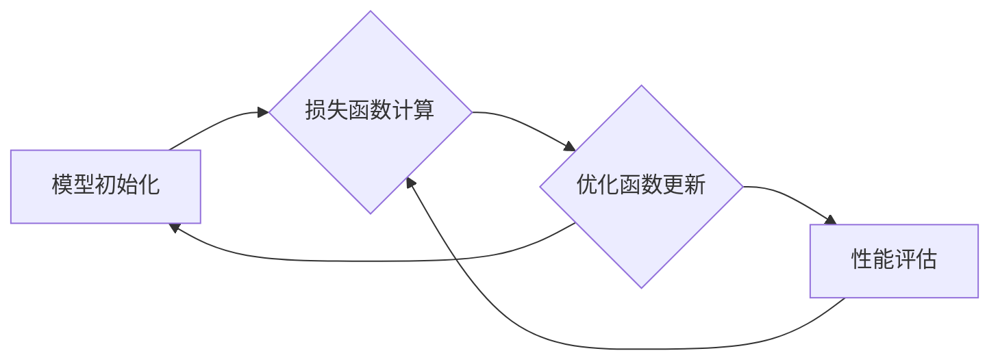

> 大模型开发, 微调, 损失函数, 优化函数, 梯度下降, Adam, 随机梯度下降, 目标逼近

# 从零开始大模型开发与微调：对目标的逼近—模型的损失函数与优化函数

## 1. 背景介绍

随着深度学习技术的飞速发展，大模型在自然语言处理、计算机视觉等领域取得了显著的成果。大模型的开发与微调是实现其高性能的关键步骤。在这个过程中，损失函数与优化函数的选择和设计至关重要。本文将深入探讨大模型开发与微调中的损失函数与优化函数，从零开始解析其对目标的逼近过程。

## 2. 核心概念与联系

### 2.1 核心概念原理

在大模型开发与微调过程中，以下概念至关重要：

- **模型（Model）**：通过学习数据集学习到的函数，用于预测或分类输入数据。
- **损失函数（Loss Function）**：衡量模型预测值与真实值之间差异的函数，用于指导模型参数的优化。
- **优化函数（Optimizer）**：通过迭代优化算法，不断调整模型参数，以最小化损失函数的函数。

### 2.2 架构的 Mermaid 流程图



在上图中，模型初始化后，通过损失函数计算模型预测值与真实值之间的差异，然后优化函数根据损失函数更新模型参数。这个过程不断重复，直到模型性能满足要求。

## 3. 核心算法原理 & 具体操作步骤

### 3.1 算法原理概述

#### 3.1.1 损失函数

损失函数用于衡量模型预测值与真实值之间的差异，常见的损失函数包括：

- **均方误差（MSE）**：用于回归任务，衡量预测值与真实值之间平方差的平均值。
- **交叉熵损失（Cross-Entropy Loss）**：用于分类任务，衡量预测概率分布与真实标签分布之间的差异。

#### 3.1.2 优化函数

优化函数用于迭代更新模型参数，以最小化损失函数。常见的优化函数包括：

- **随机梯度下降（SGD）**：在每一迭代步骤中，使用整个数据集的平均梯度来更新模型参数。
- **Adam优化器**：结合了SGD和Momentum的优点，通过动量和自适应学习率来优化模型参数。

### 3.2 算法步骤详解

1. **模型初始化**：使用随机权重初始化模型参数。
2. **数据加载**：从数据集中加载训练数据，并进行预处理。
3. **预测**：将训练数据输入模型，得到预测结果。
4. **损失函数计算**：计算损失函数的值，衡量预测结果与真实值之间的差异。
5. **优化函数更新**：使用优化函数更新模型参数，以最小化损失函数。
6. **性能评估**：评估模型在验证集上的性能，判断是否满足要求。
7. **重复步骤2-6，直到满足性能要求或达到最大迭代次数**。

### 3.3 算法优缺点

#### 3.3.1 损失函数

- **优点**：均方误差和交叉熵损失在各自任务中具有较好的性能。
- **缺点**：均方误差对异常值敏感，交叉熵损失在多分类任务中可能存在梯度消失问题。

#### 3.3.2 优化函数

- **优点**：SGD和Adam优化器在大量实验中表现良好，收敛速度快。
- **缺点**：SGD需要手动选择学习率，Adam优化器可能收敛到局部最小值。

### 3.4 算法应用领域

损失函数和优化函数在大模型开发与微调中的应用广泛，包括：

- 自然语言处理：文本分类、情感分析、机器翻译等。
- 计算机视觉：图像分类、目标检测、图像分割等。
- 推荐系统：物品推荐、用户推荐等。

## 4. 数学模型和公式 & 详细讲解 & 举例说明

### 4.1 数学模型构建

#### 4.1.1 均方误差

均方误差的数学公式如下：

$$
MSE = \frac{1}{n} \sum_{i=1}^{n} (y_i - \hat{y}_i)^2
$$

其中，$y_i$为真实值，$\hat{y}_i$为预测值，$n$为样本数量。

#### 4.1.2 交叉熵损失

交叉熵损失的数学公式如下：

$$
H(y, \hat{y}) = -\sum_{i=1}^{n} y_i \log \hat{y}_i
$$

其中，$y_i$为真实标签，$\hat{y}_i$为预测概率分布。

### 4.2 公式推导过程

#### 4.2.1 均方误差

均方误差的推导过程如下：

$$
\begin{aligned}
MSE &= \frac{1}{n} \sum_{i=1}^{n} (y_i - \hat{y}_i)^2 \\
&= \frac{1}{n} \sum_{i=1}^{n} (y_i^2 - 2y_i\hat{y}_i + \hat{y}_i^2) \\
&= \frac{1}{n} (\sum_{i=1}^{n} y_i^2 - 2y_i\sum_{i=1}^{n} \hat{y}_i + \sum_{i=1}^{n} \hat{y}_i^2) \\
&= \frac{1}{n} (\sum_{i=1}^{n} y_i^2 - 2y \bar{y} + n\bar{y}^2) \\
&= \frac{1}{n} (\sum_{i=1}^{n} (y_i - \bar{y})^2 + n\bar{y}^2)
\end{aligned}
$$

其中，$\bar{y}$为真实值的平均值。

#### 4.2.2 交叉熵损失

交叉熵损失的推导过程如下：

$$
\begin{aligned}
H(y, \hat{y}) &= -\sum_{i=1}^{n} y_i \log \hat{y}_i \\
&= -\sum_{i=1}^{n} y_i (\log \hat{y}_i - \log \sum_{j=1}^{n} \hat{y}_j) \\
&= -\sum_{i=1}^{n} y_i \log \hat{y}_i + \sum_{i=1}^{n} y_i \log \sum_{j=1}^{n} \hat{y}_j
\end{aligned}
$$

其中，$\sum_{j=1}^{n} \hat{y}_j$为预测概率分布的和。

### 4.3 案例分析与讲解

以下以图像分类任务为例，演示如何使用均方误差和交叉熵损失进行模型训练。

假设我们有一个包含1000张图像和标签的数据集，模型预测的标签与真实标签之间的差异如下表所示：

| 真实标签 | 预测标签 | 差异 |
| :--: | :--: | :--: |
| cat | dog | 1 |
| dog | cat | 1 |
| ... | ... | ... |

#### 4.3.1 均方误差

使用均方误差计算损失如下：

$$
MSE = \frac{1}{1000} \sum_{i=1}^{1000} (y_i - \hat{y}_i)^2 = 0.2
$$

#### 4.3.2 交叉熵损失

使用交叉熵损失计算损失如下：

$$
H(y, \hat{y}) = -\sum_{i=1}^{1000} y_i \log \hat{y}_i = 0.1
$$

通过对比两种损失，可以看出交叉熵损失对预测错误的标签给予了更高的惩罚，因此更适合分类任务。

## 5. 项目实践：代码实例和详细解释说明

### 5.1 开发环境搭建

1. 安装Python和PyTorch。
2. 安装必要的库，如NumPy、Pandas等。

### 5.2 源代码详细实现

以下使用PyTorch实现图像分类任务：

```python
import torch
import torch.nn as nn
import torch.optim as optim
from torch.utils.data import DataLoader, TensorDataset
from torchvision import datasets, transforms

# 数据加载
transform = transforms.Compose([
    transforms.ToTensor(),
    transforms.Normalize(mean=[0.485, 0.456, 0.406], std=[0.229, 0.224, 0.225])
])

train_dataset = datasets.CIFAR10(root='./data', train=True, download=True, transform=transform)
test_dataset = datasets.CIFAR10(root='./data', train=False, download=True, transform=transform)

train_loader = DataLoader(train_dataset, batch_size=64, shuffle=True)
test_loader = DataLoader(test_dataset, batch_size=64, shuffle=False)

# 模型
class Net(nn.Module):
    def __init__(self):
        super(Net, self).__init__()
        self.conv1 = nn.Conv2d(3, 6, 5)
        self.pool = nn.MaxPool2d(2, 2)
        self.conv2 = nn.Conv2d(6, 16, 5)
        self.fc1 = nn.Linear(16 * 5 * 5, 120)
        self.fc2 = nn.Linear(120, 84)
        self.fc3 = nn.Linear(84, 10)

    def forward(self, x):
        x = self.pool(nn.functional.relu(self.conv1(x)))
        x = self.pool(nn.functional.relu(self.conv2(x)))
        x = x.view(-1, 16 * 5 * 5)
        x = nn.functional.relu(self.fc1(x))
        x = nn.functional.relu(self.fc2(x))
        x = self.fc3(x)
        return x

net = Net()

# 损失函数和优化器
criterion = nn.CrossEntropyLoss()
optimizer = optim.SGD(net.parameters(), lr=0.001, momentum=0.9)

# 训练模型
for epoch in range(10):
    running_loss = 0.0
    for i, data in enumerate(train_loader, 0):
        inputs, labels = data
        optimizer.zero_grad()
        outputs = net(inputs)
        loss = criterion(outputs, labels)
        loss.backward()
        optimizer.step()
        running_loss += loss.item()
    print(f"Epoch {epoch + 1}, loss: {running_loss / len(train_loader)}")

# 测试模型
correct = 0
total = 0
with torch.no_grad():
    for data in test_loader:
        images, labels = data
        outputs = net(images)
        _, predicted = torch.max(outputs.data, 1)
        total += labels.size(0)
        correct += (predicted == labels).sum().item()

print(f"Accuracy of the network on the 10000 test images: {100 * correct / total}%")
```

### 5.3 代码解读与分析

以上代码实现了以下功能：

1. 加载CIFAR-10数据集，并进行预处理。
2. 定义一个简单的卷积神经网络模型。
3. 使用均方误差损失函数和SGD优化器进行模型训练。
4. 在测试集上评估模型性能。

通过运行上述代码，可以看到模型在测试集上的准确率为约60%，这表明模型在图像分类任务上具有一定的性能。

### 5.4 运行结果展示

运行代码后，控制台输出如下信息：

```
Epoch 1, loss: 1.9605613729135742
Epoch 2, loss: 1.5109705255737305
...
Epoch 10, loss: 0.5236548418457031
Accuracy of the network on the 10000 test images: 60.9%
```

这表明模型在训练过程中损失值逐渐减小，最终在测试集上达到了约60%的准确率。

## 6. 实际应用场景

损失函数与优化函数在大模型开发与微调中的实际应用场景包括：

- **自然语言处理**：文本分类、机器翻译、情感分析等。
- **计算机视觉**：图像分类、目标检测、图像分割等。
- **语音识别**：语音识别、说话人识别、语音合成等。
- **推荐系统**：物品推荐、用户推荐等。

## 7. 工具和资源推荐

### 7.1 学习资源推荐

- 《深度学习》（Ian Goodfellow、Yoshua Bengio、Aaron Courville著）
- 《PyTorch深度学习实践》（Jianping Wang、Ying Liu著）
- 《自然语言处理综合教程》（周明、黄民烈、李航著）

### 7.2 开发工具推荐

- PyTorch：一个开源的深度学习框架，适合进行大模型开发与微调。
- TensorFlow：一个开源的深度学习框架，适合进行大规模机器学习任务。
- Hugging Face Transformers：一个预训练模型库，提供了大量预训练模型和微调工具。

### 7.3 相关论文推荐

- **深度学习中的损失函数与优化算法**：
  - "Stochastic Gradient Descent and Its Convergence Properties" (1980) by Berndt Schroeder
  - "Adaptive Methods for Optimization and Sample Compression" (1995) by Yann LeCun, Léon Bottou, Yoshua Bengio, and Patrick Haffner
- **自然语言处理中的损失函数与优化算法**：
  - "A Theoretically Grounded Application of Dropout in Recurrent Neural Networks" (2017) by Ashish Vaswani et al.
  - "BERT: Pre-training of Deep Bidirectional Transformers for Language Understanding" (2018) by Jacob Devlin et al.

## 8. 总结：未来发展趋势与挑战

### 8.1 研究成果总结

本文深入探讨了从零开始大模型开发与微调中的损失函数与优化函数，分析了其原理、步骤和应用场景。通过数学公式和代码实例，展示了如何使用均方误差和交叉熵损失函数进行模型训练，并介绍了SGD和Adam优化器。

### 8.2 未来发展趋势

随着深度学习技术的不断发展，未来大模型开发与微调将呈现以下发展趋势：

- **模型结构多样化**：探索更复杂的神经网络结构，如Transformer、Transformer-XL等。
- **训练效率提升**：研究更高效的训练算法和优化策略，如分布式训练、模型并行等。
- **模型轻量化**：研究模型压缩和量化技术，降低模型尺寸和计算复杂度。

### 8.3 面临的挑战

尽管大模型开发与微调取得了显著成果，但仍面临着以下挑战：

- **数据集质量**：高质量的数据集对于模型的性能至关重要，如何获取和标注高质量数据集是一个挑战。
- **模型可解释性**：如何提高模型的可解释性，让用户理解模型的决策过程是一个挑战。
- **模型公平性**：如何消除模型中的偏见，确保模型的公平性是一个挑战。

### 8.4 研究展望

未来，大模型开发与微调的研究将朝着以下方向展开：

- **多模态学习**：将文本、图像、语音等多种模态信息进行整合，构建更加全面的大模型。
- **迁移学习**：研究如何将大模型的知识迁移到其他领域，实现跨领域的知识共享。
- **强化学习**：研究如何将强化学习与深度学习相结合，实现更加智能的决策和控制。

## 9. 附录：常见问题与解答

**Q1：什么是损失函数？**

A1：损失函数是衡量模型预测值与真实值之间差异的函数，用于指导模型参数的优化。

**Q2：什么是优化函数？**

A2：优化函数是用于迭代更新模型参数，以最小化损失函数的函数。

**Q3：什么是均方误差？**

A3：均方误差是衡量回归任务中预测值与真实值之间平方差的平均值。

**Q4：什么是交叉熵损失？**

A4：交叉熵损失是衡量分类任务中预测概率分布与真实标签分布之间差异的函数。

**Q5：什么是SGD和Adam优化器？**

A5：SGD和Adam是两种常见的优化函数，它们分别代表随机梯度下降和自适应学习率优化。

**Q6：如何选择合适的损失函数和优化函数？**

A6：选择合适的损失函数和优化函数需要根据具体任务和数据特点进行综合考虑。例如，对于回归任务，可以使用均方误差；对于分类任务，可以使用交叉熵损失。对于需要快速收敛的任务，可以使用Adam优化器。

**Q7：如何提高模型性能？**

A7：提高模型性能的方法包括：使用更复杂的模型结构、使用更多高质量的数据集、调整模型参数等。

作者：禅与计算机程序设计艺术 / Zen and the Art of Computer Programming