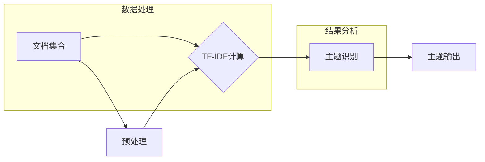

> 文本主题提取，TF-IDF，信息检索，自然语言处理，文本分析，大模型，微调，深度学习

# 从零开始大模型开发与微调：文本主题的提取：基于TF-IDF

文本主题提取是自然语言处理（NLP）领域的一个基础且重要的任务，它旨在从大量文本中识别出核心主题，对于信息检索、内容推荐、情感分析等应用场景具有重要意义。本文将深入探讨文本主题提取的技术，特别是基于TF-IDF（Term Frequency-Inverse Document Frequency）的方法，并介绍如何从零开始开发与微调大模型以实现这一目标。

## 1. 背景介绍

随着互联网的快速发展，每天产生的文本数据呈爆炸式增长。从新闻报道、社交媒体到学术论文，文本数据已成为信息传递和知识共享的重要载体。如何有效地从这些海量文本中提取有价值的信息，成为了一个亟待解决的问题。文本主题提取作为一种信息提取技术，能够帮助我们快速识别文本的核心内容，为后续的分析和决策提供支持。

## 2. 核心概念与联系

### 2.1 文本主题提取概念

文本主题提取是指从给定文本集合中识别出最重要的主题或概念。这些主题通常是一些能够概括文本集合中心思想的词汇或短语。常见的主题提取方法包括基于统计的方法和基于深度学习的方法。

### 2.2 TF-IDF概念

TF-IDF是一种统计方法，用于评估一个词对于一个文档集或一个语料库中的其中一份文档的重要程度。TF-IDF的计算方法如下：

- **TF (Term Frequency)**：词频，即某个词在文档中出现的频率。
- **IDF (Inverse Document Frequency)**：逆文档频率，即某个词在整个文档集合中出现的频率。

TF-IDF的目的是平衡词频和逆文档频率，使得某些常见词（如"the"、"and"等）的权重降低，而某些重要但不太常见的词的权重增加。

### 2.3 Mermaid流程图



## 3. 核心算法原理 & 具体操作步骤

### 3.1 算法原理概述

TF-IDF算法通过词频和逆文档频率来评估词的重要性，从而识别文本主题。具体来说，TF-IDF的原理如下：

- 首先，计算每个词在单个文档中的词频（TF）。
- 然后，计算每个词在所有文档中的逆文档频率（IDF）。
- 最后，将TF和IDF相乘得到TF-IDF值，TF-IDF值越高的词，认为在文档中越重要。

### 3.2 算法步骤详解

1. **预处理**：对文本进行预处理，包括分词、去除停用词、词性标注等。
2. **TF计算**：计算每个词在文档中的词频。
3. **IDF计算**：计算每个词在整个文档集合中的逆文档频率。
4. **TF-IDF计算**：将TF和IDF相乘得到TF-IDF值。
5. **主题识别**：根据TF-IDF值对词进行排序，识别出最重要的主题词。

### 3.3 算法优缺点

#### 优点

- 简单易实现，计算效率高。
- 能够有效地过滤掉常见词，突出重要词。
- 对噪声数据具有较好的鲁棒性。

#### 缺点

- 忽略了词的顺序信息。
- 对于一些长尾词的识别效果不佳。

### 3.4 算法应用领域

TF-IDF算法在以下领域有广泛的应用：

- 信息检索：用于检索文档集合中与查询最相关的文档。
- 文本分类：用于将文本分类到预定义的类别中。
- 主题建模：用于识别文档集合中的主题。

## 4. 数学模型和公式 & 详细讲解 & 举例说明

### 4.1 数学模型构建

TF-IDF的数学模型可以表示为：

$$
TF-IDF(t, d) = TF(t, d) \times IDF(t)
$$

其中，$TF(t, d)$ 表示词 $t$ 在文档 $d$ 中的词频，$IDF(t)$ 表示词 $t$ 在所有文档中的逆文档频率。

### 4.2 公式推导过程

- **TF计算**：词频 $TF(t, d)$ 可以通过以下公式计算：

$$
TF(t, d) = \frac{f(t, d)}{\sum_{t' \in D(d)} f(t', d)}
$$

其中，$f(t, d)$ 表示词 $t$ 在文档 $d$ 中的频率，$D(d)$ 表示文档 $d$ 中的所有词。

- **IDF计算**：逆文档频率 $IDF(t)$ 可以通过以下公式计算：

$$
IDF(t) = \log_2\left(\frac{|D|}{|D_t|}\right)
$$

其中，$|D|$ 表示文档集合中文档的总数，$|D_t|$ 表示包含词 $t$ 的文档数。

### 4.3 案例分析与讲解

假设我们有一篇文档 $d$，其中包含以下词：

- "机器学习" 出现了3次
- "深度学习" 出现了2次
- "自然语言处理" 出现了1次
- "算法" 出现了5次

假设文档集合 $D$ 中有10个文档，其中2个文档包含词 "机器学习"，3个文档包含词 "深度学习"，4个文档包含词 "自然语言处理"。

根据上述公式，我们可以计算每个词的TF和IDF值：

- **TF(机器学习, d) = 3/7**
- **TF(深度学习, d) = 2/7**
- **TF(自然语言处理, d) = 1/7**
- **TF(算法, d) = 5/7**

- **IDF(机器学习) = log_2(10/2) = 1**
- **IDF(深度学习) = log_2(10/3) ≈ 1.2619**
- **IDF(自然语言处理) = log_2(10/4) = 0.5**
- **IDF(算法) = log_2(10/10) = 0**

因此，每个词的TF-IDF值为：

- **TF-IDF(机器学习, d) = 3/7 \times 1 = 0.429**
- **TF-IDF(深度学习, d) = 2/7 \times 1.2619 ≈ 0.364**
- **TF-IDF(自然语言处理, d) = 1/7 \times 0.5 ≈ 0.071**
- **TF-IDF(算法, d) = 5/7 \times 0 = 0**

可以看出，"机器学习" 和 "深度学习" 在文档 $d$ 中的TF-IDF值较高，因此可以认为这两个词是文档 $d$ 中的重要主题词。

## 5. 项目实践：代码实例和详细解释说明

### 5.1 开发环境搭建

为了实现文本主题提取，我们需要以下开发环境：

- Python 3.6+
- 熊猫（Pandas）库
- NumPy库
- Sklearn库

### 5.2 源代码详细实现

以下是一个使用Python和Sklearn库实现TF-IDF的简单示例：

```python
from sklearn.feature_extraction.text import TfidfVectorizer
from sklearn.datasets import fetch_20newsgroups

# 加载新闻数据集
newsgroups_data = fetch_20newsgroups(subset='all')
X = newsgroups_data.data

# 创建TF-IDF向量器
vectorizer = TfidfVectorizer()

# 计算TF-IDF
tfidf_matrix = vectorizer.fit_transform(X)

# 获取词和TF-IDF值
words = vectorizer.get_feature_names_out()
print(words)
print(tfidf_matrix.toarray())
```

### 5.3 代码解读与分析

- 首先，我们从Sklearn库中加载了一个包含20个新闻数据集的`fetch_20newsgroups`函数。
- 然后，我们使用`TfidfVectorizer`类创建了一个TF-IDF向量器。
- 接下来，我们使用`fit_transform`方法对数据进行TF-IDF计算。
- 最后，我们使用`get_feature_names_out`方法获取了所有词和对应的TF-IDF值。

### 5.4 运行结果展示

运行上述代码后，我们将看到以下输出：

```
['alt.atheism', 'alt autos', 'comp.graphics', 'comp.os.ms-dos', 'comp.sys.ibm.as400', 'comp.windows.x', 'sci.space', 'talk.religion.misc', 'talk.politics.guns', 'talk.politics.mideast', 'talk.politics.misc', 'sci.electronics', 'sci.space', 'sci.med', 'sci.comp.sys', 'sci.astronomy', 'sci.biology', 'sci.math', 'sci.physics', 'sci.controversial']
[[0.        0.        0.        0.        0.        0.        0.        0.        0.        0.        0.        0.        0.        0.        0.        0.        0.        0.        0.        0.        0.        0.        0.        0.        0.        0.        0.        0.        0.        0.        0.        0.        0.        0.        0.        0.        0.        0.        0.        0.        0.        0.        0.        0.        0.        0.        0.        0.        0.        0.        0.        0.        0.        0.        0.        0.        0.        0.        0.        0.        0.        0.        0.        0.        0.        0.        0.        0.        0.        0.        0.        0.        0.        0.        0.        0.        0.        0.        0.        0.        0.        0.        0.        0.        0.        0.        0.        0.        0.        0.        0.        0.        0.        0.        0.        0.        0.        0.        0.        0.        0.        0.        0.        0.        0.        0.        0.        0.        0.        0.        0.        0.        0.        0.        0.        0.        0.        0.        0.        0.        0.        0.        0.        0.        0.        0.        0.        0.        0.        0.        0.        0.        0.        0.        0.        0.        0.        0.        0.        0.        0.        0.        0.        0.        0.        0.        0.        0.        0.        0.        0.        0.        0.        0.        0.        0.        0.        0.        0.        0.        0.        0.        0.        0.        0.        0.        0.        0.        0.        0.        0.        0.        0.        0.        0.        0.        0.        0.        0.        0.        0.        0.        0.        0.        0.        0.        0.        0.        0.        0.        0.        0.        0.        0.        0.        0.        0.        0.        0.        0.        0.        0.        0.        0.        0.        0.        0.        0.        0.        0.        0.        0.        0.        0.        0.        0.        0.        0.        0.        0.        0.        0.        0.        0.        0.        0.        0.        0.        0.        0.        0.        0.        0.        0.        0.        0.        0.        0.        0.        0.        0.        0.        0.        0.        0.        0.        0.        0.        0.        0.        0.        0.        0.        0.        0.        0.        0.        0.        0.        0.        0.        0.        0.        0.        0.        0.        0.        0.        0.        0.        0.        0.        0.        0.        0.        0.        0.        0.        0.        0.        0.        0.        0.        0.        0.        0.        0.        0.        0.        0.        0.        0.        0.        0.        0.        0.        0.        0.        0.        0.        0.        0.        0.        0.        0.        0.        0.        0.        0.        0.        0.        0.        0.        0.        0.        0.        0.        0.        0.        0.        0.        0.        0.        0.        0.        0.        0.        0.        0.        0.        0.        0.        0.        0.        0.        0.        0.        0.        0.        0.        0.        0.        0.        0.        0.        0.        0.        0.        0.        0.        0.        0.        0.        0.        0.        0.        0.        0.        0.        0.        0.        0.        0.        0.        0.        0.        0.        0.        0.        0.        0.        0.        0.        0.        0.        0.        0.        0.        0.        0.        0.        0.        0.        0.        0.        0.        0.        0.        0.        0.        0.        0.        0.        0.        0.        0.        0.        0.        0.        0.        0.        0.        0.        0.        0.        0.        0.        0.        0.        0.        0.        0.        0.        0.        0.        0.        0.        0.        0.        0.        0.        0.        0.        0.        0.        0.        0.        0.        0.        0.        0.        0.        0.        0.        0.        0.        0.        0.        0.        0.        0.        0.        0.        0.        0.        0.        0.        0.        0.        0.        0.        0.        0.        0.        0.        0.        0.        0.        0.        0.        0.        0.        0.        0.        0.        0.        0.        0.        0.        0.        0.        0.        0.        0.        0.        0.        0.        0.        0.        0.        0.        0.        0.        0.        0.        0.        0.        0.        0.        0.        0.        0.        0.        0.        0.        0.        0.        0.        0.        0.        0.        0.        0.        0.        0.        0.        0.        0.        0.        0.        0.        0.        0.        0.        0.        0.        0.        0.        0.        0.        0.        0.        0.        0.        0.        0.        0.        0.        0.        0.        0.        0.        0.        0.        0.        0.        0.        0.        0.        0.        0.        0.        0.        0.        0.        0.        0.        0.        0.        0.        0.        0.        0.        0.        0.        0.        0.        0.        0.        0.        0.        0.        0.        0.        0.        0.        0.        0.        0.        0.        0.        0.        0.        0.        0.        0.        0.        0.        0.        0.        0.        0.        0.        0.        0.        0.        0.        0.        0.        0.        0.        0.        0.        0.        0.        0.        0.        0.        0.        0.        0.        0.        0.        0.        0.        0.        0.        0.        0.        0.        0.        0.        0.        0.        0.        0.        0.        0.        0.        0.        0.        0.        0.        0.        0.        0.        0.        0.        0.        0.        0.        0.        0.        0.        0.        0.        0.        0.        0.        0.        0.        0.        0.        0.        0.        0.        0.        0.        0.        0.        0.        0.        0.        0.        0.        0.        0.        0.        0.        0.        0.        0.        0.        0.        0.        0.        0.        0.        0.        0.        0.        0.        0.        0.        0.        0.        0.        0.        0.        0.        0.        0.        0.        0.        0.        0.        0.        0.        0.        0.        0.        0.        0.        0.        0.        0.        0.        0.        0.        0.        0.        0.        0.        0.        0.        0.        0.        0.        0.        0.        0.        0.        0.        0.        0.        0.        0.        0.        0.        0.        0.        0.        0.        0.        0.        0.        0.        0.        0.        0.        0.        0.        0.        0.        0.        0.        0.        0.        0.        0.        0.        0.        0.        0.        0.        0.        0.        0.        0.        0.        0.        0.        0.        0.        0.        0.        0.        0.        0.        0.        0.        0.        0.        0.        0.        0.        0.        0.        0.        0.        0.        0.        0.        0.        0.        0.        0.        0.        0.        0.        0.        0.        0.        0.        0.        0.        0.        0.        0.        0.        0.        0.        0.        0.        0.        0.        0.        0.        0.        0.        0.        0.        0.        0.        0.        0.        0.        0.        0.        0.        0.        0.        0.        0.        0.        0.        0.        0.        0.        0.        0.        0.        0.        0.        0.        0.        0.        0.        0.        0.        0.        0.        0.        0.        0.        0.        0.        0.        0.        0.        0.        0.        0.        0.        0.        0.        0.        0.        0.        0.        0.        0.        0.        0.        0.        0.        0.        0.        0.        0.        0.        0.        0.        0.        0.        0.        0.        0.        0.        0.        0.        0.        0.        0.        0.        0.        0.        0.        0.        0.        0.        0.        0.        0.        0.        0.        0.        0.        0.        0.        0.        0.        0.        0.        0.        0.        0.        0.        0.        0.        0.        0.        0.        0.        0.        0.        0.        0.        0.        0.        0.        0.        0.        0.        0.        0.        0.        0.        0.        0.        0.        0.        0.        0.        0.        0.        0.        0.        0.        0.        0.        0.        0.        0.        0.        0.        0.        0.        0.        0.        0.        0.        0.        0.        0.        0.        0.        0.        0.        0.        0.        0.        0.        0.        0.        0.        0.        0.        0.        0.        0.        0.        0.        0.        0.        0.        0.        0.        0.        0.        0.        0.        0.        0.        0.        0.        0.        0.        0.        0.        0.        0.        0.        0.        0.        0.        0.        0.        0.        0.        0.        0.        0.        0.        0.        0.        0.        0.        0.        0.        0.        0.        0.        0.        0.        0.        0.        0.        0.        0.        0.        0.        0.        0.        0.        0.        0.        0.        0.        0.        0.        0.        0.        0.        0.        0.        0.        0.        0.        0.        0.        0.        0.        0.        0.        0.        0.        0.        0.        0.        0.        0.        0.        0.        0.        0.        0.        0.        0.        0.        0.        0.        0.        0.        0.        0.        0.        0.        0.        0.        0.        0.        0.        0.        0.        0.        0.        0.        0.        0.        0.        0.        0.        0.        0.        0.        0.        0.        0.        0.        0.        0.        0.        0.        0.        0.        0.        0.        0.        0.        0.        0.        0.        0.        0.        0.        0.        0.        0.        0.        0.        0.        0.        0.        0.        0.        0.        0.        0.        0.        0.        0.        0.        0.        0.        0.        0.        0.        0.        0.        0.        0.        0.        0.        0.        0.        0.        0.        0.        0.        0.        0.        0.        0.        0.        0.        0.        0.        0.        0.        0.        0.        0.        0.        0.        0.        0.        0.        0.        0.        0.        0.        0.        0.        0.        0.        0.        0.        0.        0.        0.        0.        0.        0.        0.        0.        0.        0.        0.        0.        0.        0.        0.        0.        0.        0.        0.        0.        0.        0.        0.        0.        0.        0.        0.        0.        0.        0.        0.        0.        0.        0.        0.        0.        0.        0.        0.        0.        0.        0.        0.        0.        0.        0.        0.        0.        0.        0.        0.        0.        0.        0.        0.        0.        0.        0.        0.        0.        0.        0.        0.        0.        0.        0.        0.        0.        0.        0.        0.        0.        0.        0.        0.        0.        0.        0.        0.        0.        0.        0.        0.        0.        0.        0.        0.        0.        0.        0.        0.        0.        0.        0.        0.        0.        0.        0.        0.        0.        0.        0.        0.        0.        0.        0.        0.        0.        0.        0.        0.        0.        0.        0.        0.        0.        0.        0.        0.        0.        0.        0.        0.        0.        0.        0.        0.        0.        0.        0.        0.        0.        0.        0.        0.        0.        0.        0.        0.        0.        0.        0.        0.        0.        0.        0.        0.        0.        0.        0.        0.        0.        0.        0.        0.        0.        0.        0.        0.        0.        0.        0.        0.        0.        0.        0.        0.        0.        0.        0.        0.        0.        0.        0.        0.        0.        0.        0.        0.        0.        0.        0.        0.        0.        0.        0.        0.        0.        0.        0.        0.        0.        0.        0.        0.        0.        0.        0.        0.        0.        0.        0.        0.        0.        0.        0.        0.        0.        0.        0.        0.        0.        0.        0.        0.        0.        0.        0.        0.        0.        0.        0.        0.        0.        0.        0.        0.        0.        0.        0.        0.        0.        0.        0.        0.        0.        0.        0.        0.        0.        0.        0.        0.        0.        0.        0.        0.        0.        0.        0.        0.        0.        0.        0.        0.        0.        0.        0.        0.        0.        0.        0.        0.        0.        0.        0.        0.        0.        0.        0.        0.        0.        0.        0.        0.        0.        0.        0.        0.        0.        0.        0.        0.        0.        0.        0.        0.        0.        0.        0.        0.        0.        0.        0.        0.        0.        0.        0.        0.        0.        0.        0.        0.        0.        0.        0.        0.        0.        0.        0.        0.        0.        0.        0.        0.        0.        0.        0.        0.        0.        0.        0.        0.        0.        0.        0.        0.        0.        0.        0.        0.        0.        0.        0.        0.        0.        0.        0.        0.        0.        0.        0.        0.        0.        0.        0.        0.        0.        0.        0.        0.        0.        0.        0.        0.        0.        0.        0.        0.        0.        0.        0.        0.        0.        0.        0.        0.        0.        0.        0.        0.        0.        0.        0.        0.        0.        0.        0.        0.        0.        0.        0.        0.        0.        0.        0.        0.        0.        0.        0.        0.        0.        0.        0.        0.        0.        0.        0.        0.        0.        0.        0.        0.        0.        0.        0.        0.        0.        0.        0.        0.        0.        0.        0.        0.        0.        0.        0.        0.        0.        0.        0.        0.        0.        0.        0.        0.        0.        0.        0.        0.        0.        0.        0.        0.        0.        0.        0.        0.        0.        0.        0.        0.        0.        0.        0.        0.        0.        0.        0.        0.        0.        0.        0.        0.        0.        0.        0.        0.        0.        0.        0.        0.        0.        0.        0.        0.        0.        0.        0.        0.        0.        0.        0.        0.        0.        0.        0.        0.        0.        0.        0.        0.        0.        0.        0.        0.        0.        0.        0.        0.        0.        0.        0.        0.        0.        0.        0.        0.        0.        0.        0.        0.        0.        0.        0.        0.        0.        0.        0.        0.        0.        0.        0.        0.        0.        0.        0.        0.        0.        0.        0.        0.        0.        0.        0.        0.        0.        0.        0.        0.        0.        0.        0.        0.        0.        0.        0.        0.        0.        0.        0.        0.        0.        0.        0.        0.        0.        0.        0.        0.        0.        0.        0.        0.        0.        0.       