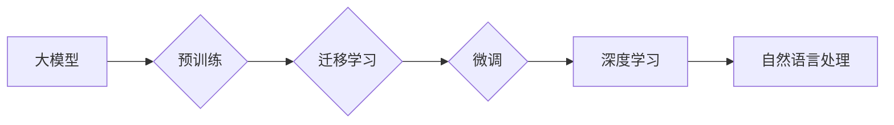

> - 大模型开发
> - 微调技术
> - 深度学习
> - 人工智能
> - 预训练
> - 迁移学习
> - 自然语言处理

# 从零开始大模型开发与微调：深度学习与人工智能

### 1. 背景介绍

随着深度学习技术的飞速发展，大模型（Large Language Models，LLMs）在自然语言处理（NLP）领域取得了突破性的进展。大模型通过在庞大的语料库上进行预训练，学习到丰富的语言模式和知识，从而在下游任务中展现出惊人的性能。本文将深入探讨大模型的开发与微调技术，帮助读者从零开始，掌握深度学习与人工智能的核心原理和应用。

### 2. 核心概念与联系

#### 2.1 核心概念原理

**大模型**：大模型是一种规模庞大、参数数量巨大的神经网络，能够处理复杂的输入数据，并在多个任务上展现出出色的性能。

**预训练**：预训练是指在大量未标注数据上训练模型的过程，使模型学习到通用的特征和知识。

**迁移学习**：迁移学习是指将预训练模型的知识迁移到新的任务上，减少对新数据的需求。

**微调**：微调是指在预训练模型的基础上，使用少量标注数据进一步训练模型，以适应特定任务。

**深度学习**：深度学习是一种模拟人脑神经元结构的学习算法，通过多层神经网络自动提取特征和模式。

**自然语言处理**：自然语言处理是人工智能的一个分支，旨在使计算机能够理解、解释和生成人类语言。

以下是大模型、预训练、迁移学习、微调、深度学习和自然语言处理之间的Mermaid流程图：



### 3. 核心算法原理 & 具体操作步骤

#### 3.1 算法原理概述

大模型开发与微调的核心是构建和优化深度学习模型。以下是该过程的原理概述：

1. **数据收集**：收集大量未标注的文本数据，用于预训练模型。
2. **模型构建**：选择合适的深度学习模型架构，如Transformer。
3. **预训练**：在未标注数据上训练模型，学习通用的语言模式和知识。
4. **微调**：在少量标注数据上进一步训练模型，以适应特定任务。
5. **评估**：评估微调后的模型在特定任务上的性能。

#### 3.2 算法步骤详解

以下是具体操作步骤：

1. **数据收集**：收集大量未标注的文本数据，如维基百科、新闻文章、社交媒体等。
2. **模型构建**：选择合适的深度学习模型架构，如BERT、GPT等。
3. **预训练**：在未标注数据上训练模型，学习通用的语言模式和知识。
4. **微调**：在少量标注数据上进一步训练模型，以适应特定任务。
5. **评估**：使用验证集评估微调后的模型在特定任务上的性能。
6. **优化**：根据评估结果调整模型结构、超参数等，以提高性能。

#### 3.3 算法优缺点

**优点**：

- 高性能：大模型在多个任务上展现出优异的性能。
- 泛化能力强：预训练过程使模型学习到通用的语言模式和知识，从而在下游任务中表现出良好的泛化能力。

**缺点**：

- 计算资源需求大：大模型需要大量的计算资源和存储空间。
- 需要大量未标注数据：预训练过程需要大量的未标注数据。

#### 3.4 算法应用领域

大模型在多个领域都有广泛应用，包括：

- 文本分类：如情感分析、主题分类、垃圾邮件检测等。
- 机器翻译：将一种语言翻译成另一种语言。
- 问答系统：根据用户问题回答问题。
- 文本摘要：将长文本压缩成简短摘要。
- 生成式任务：如文本生成、诗歌创作等。

### 4. 数学模型和公式 & 详细讲解 & 举例说明

#### 4.1 数学模型构建

大模型通常采用深度神经网络作为其核心架构。以下是一个简单的深度神经网络模型：

$$
y = f(W \cdot x + b)
$$

其中，$W$ 是权重矩阵，$x$ 是输入特征，$b$ 是偏置项，$f$ 是激活函数。

#### 4.2 公式推导过程

以下是一个简单的神经网络前向传播和反向传播的推导过程：

**前向传播**：

$$
z = W \cdot x + b
$$
$$
a = f(z)
$$

**反向传播**：

$$
\delta_w = \frac{\partial J}{\partial W} = x^T \cdot \delta_a
$$
$$
\delta_b = \frac{\partial J}{\partial b} = \delta_a
$$

其中，$J$ 是损失函数，$\delta_a$ 是梯度。

#### 4.3 案例分析与讲解

以下是一个简单的文本分类任务的例子：

假设我们有一个文本分类任务，有两个类别：正面和负面。

输入文本：这是一个很好的产品。

目标类别：正面。

模型输出：0.8（表示正面类别的概率）。

损失函数：交叉熵损失。

通过反向传播和梯度下降，模型将不断调整权重和偏置项，以降低损失。

### 5. 项目实践：代码实例和详细解释说明

#### 5.1 开发环境搭建

以下是使用Python和TensorFlow搭建开发环境的步骤：

1. 安装Anaconda。
2. 创建并激活虚拟环境。
3. 安装TensorFlow和其他必要的库。

#### 5.2 源代码详细实现

以下是一个简单的文本分类任务的代码示例：

```python
import tensorflow as tf
from tensorflow.keras.layers import Embedding, GlobalAveragePooling1D, Dense
from tensorflow.keras.models import Sequential

# 构建模型
model = Sequential([
    Embedding(input_dim=vocab_size, output_dim=embedding_dim, input_length=max_sequence_length),
    GlobalAveragePooling1D(),
    Dense(64, activation='relu'),
    Dense(2, activation='softmax')
])

# 编译模型
model.compile(optimizer='adam', loss='categorical_crossentropy', metrics=['accuracy'])

# 训练模型
model.fit(X_train, y_train, epochs=10, batch_size=32, validation_data=(X_val, y_val))

# 评估模型
loss, accuracy = model.evaluate(X_test, y_test)
print(f"Test accuracy: {accuracy:.2f}")
```

#### 5.3 代码解读与分析

以上代码展示了如何使用TensorFlow构建、编译、训练和评估一个简单的文本分类模型。模型使用嵌入层将文本转换为向量，然后使用全局平均池化和全连接层进行分类。

#### 5.4 运行结果展示

运行上述代码后，模型将在训练集和验证集上进行训练，并在测试集上进行评估。最终输出测试集上的准确率。

### 6. 实际应用场景

大模型在多个领域都有广泛应用，以下是一些例子：

- **新闻摘要**：自动生成新闻摘要，提高新闻阅读效率。
- **问答系统**：根据用户问题回答问题，提供便捷的服务。
- **机器翻译**：将一种语言翻译成另一种语言，促进跨语言交流。
- **情感分析**：分析用户评论，了解用户对产品或服务的看法。
- **推荐系统**：根据用户的历史行为，推荐相关内容或产品。

### 6.4 未来应用展望

未来，大模型将在更多领域得到应用，例如：

- **医疗**：辅助医生进行诊断和治疗。
- **教育**：个性化学习，提高教育质量。
- **金融**：风险评估，欺诈检测。
- **自动驾驶**：提高自动驾驶的感知和决策能力。

### 7. 工具和资源推荐

#### 7.1 学习资源推荐

- 《深度学习》（Ian Goodfellow、Yoshua Bengio和Aaron Courville著）
- 《神经网络与深度学习》（邱锡鹏著）
- 《自然语言处理综论》（Daniel Jurafsky和James H. Martin著）

#### 7.2 开发工具推荐

- TensorFlow
- PyTorch
- Keras

#### 7.3 相关论文推荐

- "BERT: Pre-training of Deep Bidirectional Transformers for Language Understanding"（2018）
- "Generative Pre-trained Transformers"（2018）
- "Attention Is All You Need"（2017）

### 8. 总结：未来发展趋势与挑战

#### 8.1 研究成果总结

大模型开发与微调技术为深度学习和人工智能领域带来了巨大的突破。通过预训练和微调，模型在多个任务上展现出惊人的性能，并逐渐应用于更多领域。

#### 8.2 未来发展趋势

- 模型规模将进一步增大，参数数量可能达到数十亿甚至更多。
- 微调技术将更加高效，减少对标注数据的需求。
- 模型将更加鲁棒，能够处理更多类型的输入数据。

#### 8.3 面临的挑战

- 计算资源需求大，需要更高效的训练算法。
- 模型可解释性差，难以理解模型的决策过程。
- 模型存在偏见，需要解决伦理和社会问题。

#### 8.4 研究展望

未来，大模型开发与微调技术将在以下方向取得突破：

- 开发更高效的训练算法，降低计算资源需求。
- 提高模型可解释性，使其更易于理解和控制。
- 消除模型偏见，使其更加公平和公正。

作者：禅与计算机程序设计艺术 / Zen and the Art of Computer Programming