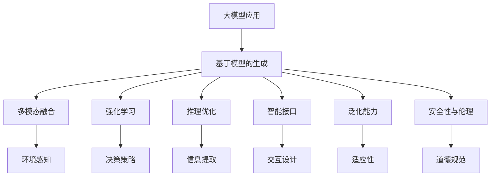

                 

# AI大模型应用RAG的尽头是AI Agent

> 关键词：大模型应用, 基于模型的生成, AI Agent, 多模态融合, 强化学习, 推理优化, 智能代理

## 1. 背景介绍

### 1.1 问题由来

在人工智能（AI）领域，近年来大模型（Large Model）的应用愈发广泛，特别是基于模型生成（Model-based Generation, 简称 RAG）的模型。这些模型能够自动生成高质量的自然语言文本，涵盖了从文本摘要、对话生成、翻译、音乐创作等多个方向，展示了大模型强大的语言生成能力。

然而，随着应用场景的复杂化，仅靠单模态的模型生成已无法满足实际需求。自然语言理解与生成往往需要结合图像、音频等多模态数据，才能提供更加精准、丰富的信息。

此外，这些模型通常缺乏对外部环境的感知和响应能力，难以真正融入实际应用场景。此时，引入AI Agent（智能代理）的概念，成为一种新的尝试，旨在通过与环境的互动，提升模型的决策能力和应用范围。

### 1.2 问题核心关键点

AI Agent的目标是通过模型学习和优化，使其能够与外部环境进行交互，进而实现自主决策和智能操作。这涉及以下几个关键点：

1. **多模态融合**：在复杂的任务环境中，AI Agent需要同时处理多种模态数据，并能够将这些信息整合并用于决策过程。

2. **强化学习**：AI Agent能够通过与环境的互动，不断优化自身的行为策略，提高决策质量和适应性。

3. **推理优化**：AI Agent需要在有限的时间里，高效推理和处理多源数据，以便做出快速、准确的决策。

4. **智能接口**：AI Agent需要具备灵活的接口设计，便于与用户交互、与其他系统集成。

5. **泛化能力**：AI Agent需要具备较强的泛化能力，能够适应不同的任务和环境，提高其可扩展性。

6. **安全性与伦理**：在复杂场景下，AI Agent需要考虑如何保证决策的安全性，避免有害输出。

## 2. 核心概念与联系

### 2.1 核心概念概述

AI Agent是结合了AI技术、多模态数据处理和环境交互的智能系统。以下是对相关核心概念的概述：

- **大模型应用**：指利用预训练大模型在特定任务上进行微调或微结构设计，以适应应用场景的需求。

- **基于模型的生成**：通过预训练模型生成自然语言文本，涵盖从文本生成、对话生成、音乐创作等多种应用场景。

- **多模态融合**：指将图像、音频、文本等多源数据进行整合，为AI Agent提供全面的环境感知。

- **强化学习**：通过与环境的互动，AI Agent可以不断调整自身的决策策略，优化性能。

- **推理优化**：指在多源数据中快速提取有效信息，并做出快速、准确的决策。

- **智能接口**：指AI Agent与用户、其他系统交互的界面设计，包括API接口、用户界面等。

- **泛化能力**：指AI Agent在未知数据上保持良好表现的能力，以应对新的任务和环境。

- **安全性与伦理**：指AI Agent在决策过程中如何避免有害输出，以及如何遵循伦理道德规范。

这些概念之间相互联系，共同构成了AI Agent的核心能力框架。下图展示了这些概念之间的联系：



## 3. 核心算法原理 & 具体操作步骤
### 3.1 算法原理概述

AI Agent的核心算法包括多模态融合、强化学习和推理优化。以下是对这些核心算法的概述：

1. **多模态融合**：通过将文本、图像、音频等多源数据进行整合，形成多模态特征向量，供后续决策使用。

2. **强化学习**：利用环境反馈，不断调整模型的决策策略，优化模型性能。

3. **推理优化**：通过高效的算法设计，在有限时间内处理多源数据，并做出准确决策。

### 3.2 算法步骤详解

以下是对AI Agent算法步骤的详细介绍：

**Step 1: 数据准备**

- **收集数据**：根据具体任务，收集相关文本、图像、音频等多模态数据。
- **数据预处理**：将数据标准化，处理缺失值和噪声，确保数据质量。
- **特征提取**：使用预训练模型或自定义算法，提取多模态特征。

**Step 2: 模型融合**

- **多模态融合模型**：使用多模态融合算法（如LSTM、Transformer），将多源数据整合并形成特征向量。
- **特征优化**：通过归一化、降维等方法，优化融合特征的质量。

**Step 3: 强化学习**

- **环境模型构建**：使用环境模型（如环境感知、决策空间），描述AI Agent与环境的交互方式。
- **决策策略学习**：使用强化学习算法（如Q-learning、Deep Q-learning），学习最优决策策略。
- **行为策略调整**：根据环境反馈，不断调整决策策略，优化模型性能。

**Step 4: 推理优化**

- **推理引擎设计**：设计高效的推理引擎，支持多源数据的高效处理。
- **信息提取**：使用推理算法（如贝叶斯网络、知识图谱），从多源数据中提取有效信息。
- **决策优化**：通过优化算法（如线性规划、梯度下降），在有限时间内做出最优决策。

**Step 5: 智能接口设计**

- **接口设计**：设计灵活的API接口和用户界面，便于与其他系统集成和用户交互。
- **反馈机制**：建立反馈机制，根据用户反馈调整模型性能。

### 3.3 算法优缺点

AI Agent算法具有以下优点：

1. **多模态感知**：通过多模态融合，AI Agent能够获取全面的环境信息，提高决策的准确性。

2. **自适应优化**：通过强化学习，AI Agent能够自适应环境变化，不断优化决策策略。

3. **高效推理**：通过推理优化，AI Agent能够在有限时间内做出高质量的决策。

4. **灵活接口**：通过智能接口设计，AI Agent能够与其他系统集成，实现无缝协作。

5. **泛化能力强**：通过泛化能力，AI Agent能够适应新任务和新环境，提高可扩展性。

然而，AI Agent算法也存在以下缺点：

1. **高复杂度**：多模态融合、强化学习和推理优化等步骤，使得算法复杂度较高，需要高效的计算资源。

2. **数据需求高**：AI Agent需要大量的数据进行训练和优化，数据质量对模型性能影响较大。

3. **模型鲁棒性差**：模型对数据噪声和干扰敏感，容易产生有害输出。

4. **伦理风险**：AI Agent的决策依赖于模型和算法，可能存在伦理风险和偏见。

5. **计算量大**：多模态融合和推理优化等步骤计算量大，需要高性能计算资源支持。

### 3.4 算法应用领域

AI Agent算法在多个领域得到广泛应用，包括但不限于：

1. **自动驾驶**：AI Agent能够感知环境信息，做出驾驶决策，提高行车安全性。

2. **智能家居**：AI Agent能够识别用户行为，提供个性化服务，提升用户体验。

3. **智能客服**：AI Agent能够理解用户需求，提供精准回复，提高服务效率。

4. **金融投资**：AI Agent能够分析市场数据，做出投资决策，提高投资回报率。

5. **健康医疗**：AI Agent能够理解病历信息，提供治疗建议，提高诊疗准确性。

6. **智能制造**：AI Agent能够监控生产环境，优化生产流程，提高生产效率。

7. **教育培训**：AI Agent能够分析学生学习行为，提供个性化指导，提升学习效果。

8. **安防监控**：AI Agent能够识别异常行为，提供报警和预警，提高安防水平。

## 4. 数学模型和公式 & 详细讲解 & 举例说明

### 4.1 数学模型构建

AI Agent的数学模型主要由多模态融合、强化学习、推理优化等模块构成。以下是这些模块的数学模型构建：

**多模态融合**

- **输入向量**：设多模态数据为 $X=[x_1, x_2, ..., x_n]$，其中 $x_i$ 为第 $i$ 个模态的数据。
- **融合矩阵**：设融合矩阵为 $W=[w_{ij}]$，其中 $w_{ij}$ 为第 $i$ 个模态对第 $j$ 个特征的权重。
- **融合向量**：多模态融合后的特征向量为 $Z=\sum_{i=1}^n w_{ij}x_i$。

**强化学习**

- **状态空间**：设状态空间为 $S$，包括环境信息和AI Agent当前状态。
- **动作空间**：设动作空间为 $A$，包括AI Agent可执行的决策动作。
- **状态转移概率**：设状态转移概率为 $P(s'|s,a)$，表示在状态 $s$ 下，执行动作 $a$ 后转移到状态 $s'$ 的概率。
- **奖励函数**：设奖励函数为 $R(s,a)$，表示在状态 $s$ 下，执行动作 $a$ 后获得的奖励值。

**推理优化**

- **推理目标**：设推理目标为 $T=\max_{a} R(s,a)$，表示在状态 $s$ 下，选择动作 $a$ 后获得的最大奖励值。
- **优化算法**：设优化算法为 $O$，用于优化决策策略，使得 $T$ 最大化。

### 4.2 公式推导过程

以下是对AI Agent算法中关键公式的推导过程：

**多模态融合**

- **融合矩阵优化**：设优化目标为 $\min_{w} \|Z-WX\|^2$，其中 $Z$ 为融合向量，$W$ 为融合矩阵，$X$ 为输入向量。
- **L2正则化**：加入L2正则化，优化目标为 $\min_{w} \|Z-WX\|^2 + \lambda\|W\|^2$，其中 $\lambda$ 为正则化系数。
- **求解步骤**：使用梯度下降等优化算法，迭代求解 $W$，使得 $Z$ 逼近 $WX$。

**强化学习**

- **Q值函数**：设状态 $s$ 的Q值函数为 $Q(s,a) = \sum_{s'}P(s'|s,a)R(s',a)$，表示在状态 $s$ 下，执行动作 $a$ 后的期望奖励值。
- **Q值更新**：设Q值更新算法为 $\hat{Q}(s,a) = Q(s,a) + \eta\big(Q(s',\hat{a}) - Q(s,a)\big)$，其中 $\hat{a}$ 为选择的下一个动作，$\eta$ 为学习率。
- **策略优化**：使用策略优化算法（如Q-learning、Deep Q-learning），不断调整决策策略，使得 $Q(s,a)$ 逼近最优值。

**推理优化**

- **推理模型**：设推理模型为 $M=\{f_k\}_{k=1}^K$，其中 $f_k$ 为第 $k$ 个推理子模块。
- **推理步骤**：设推理步骤为 $Y=\sum_{k=1}^K f_k(Z)$，其中 $Z$ 为融合向量。
- **优化目标**：优化目标为 $\min_{f_k} \|Y-\hat{Y}\|^2$，其中 $\hat{Y}$ 为推理结果。

### 4.3 案例分析与讲解

**案例1: 自动驾驶**

设AI Agent的状态空间 $S$ 包括车辆位置、速度、周围障碍物等，动作空间 $A$ 包括加速、减速、转向等。根据传感器数据，AI Agent不断调整决策策略，使得车辆安全行驶。

**案例2: 智能客服**

设AI Agent的状态空间 $S$ 包括用户提问、上下文信息等，动作空间 $A$ 包括生成回答、转接人工服务等。AI Agent根据用户提问，生成最适合的回答，并不断优化回答策略。

**案例3: 金融投资**

设AI Agent的状态空间 $S$ 包括市场数据、用户行为等，动作空间 $A$ 包括买入、卖出等。AI Agent根据市场数据，做出投资决策，并不断优化决策策略。

## 5. 项目实践：代码实例和详细解释说明

### 5.1 开发环境搭建

以下是使用Python和PyTorch搭建AI Agent开发环境的步骤：

1. 安装Anaconda：从官网下载并安装Anaconda，用于创建独立的Python环境。

2. 创建并激活虚拟环境：
```bash
conda create -n pytorch-env python=3.8 
conda activate pytorch-env
```

3. 安装PyTorch：根据CUDA版本，从官网获取对应的安装命令。例如：
```bash
conda install pytorch torchvision torchaudio cudatoolkit=11.1 -c pytorch -c conda-forge
```

4. 安装TensorFlow：如果需要使用TensorFlow，可以安装TensorFlow：
```bash
pip install tensorflow
```

5. 安装各类工具包：
```bash
pip install numpy pandas scikit-learn matplotlib tqdm jupyter notebook ipython
```

完成上述步骤后，即可在`pytorch-env`环境中开始AI Agent开发。

### 5.2 源代码详细实现

以下是一个简单的AI Agent代码实现，用于自动驾驶场景：

```python
import torch
import torch.nn as nn
import torch.optim as optim
import torch.nn.functional as F

class Policy(nn.Module):
    def __init__(self, input_dim, action_dim):
        super(Policy, self).__init__()
        self.fc1 = nn.Linear(input_dim, 128)
        self.fc2 = nn.Linear(128, 64)
        self.fc3 = nn.Linear(64, action_dim)
        
    def forward(self, x):
        x = F.relu(self.fc1(x))
        x = F.relu(self.fc2(x))
        x = torch.sigmoid(self.fc3(x))
        return x

class QNetwork(nn.Module):
    def __init__(self, input_dim, output_dim):
        super(QNetwork, self).__init__()
        self.fc1 = nn.Linear(input_dim, 128)
        self.fc2 = nn.Linear(128, 64)
        self.fc3 = nn.Linear(64, output_dim)
        
    def forward(self, x):
        x = F.relu(self.fc1(x))
        x = F.relu(self.fc2(x))
        x = self.fc3(x)
        return x

class AI_Agent:
    def __init__(self, input_dim, output_dim, learning_rate, discount_factor, exploration_rate, exploration_decay_rate):
        self.input_dim = input_dim
        self.output_dim = output_dim
        self.learning_rate = learning_rate
        self.discount_factor = discount_factor
        self.exploration_rate = exploration_rate
        self.exploration_decay_rate = exploration_decay_rate
        
        self.policy = Policy(input_dim, output_dim)
        self.q_network = QNetwork(input_dim, output_dim)
        self.optimizer = optim.Adam(list(self.policy.parameters()) + list(self.q_network.parameters()), lr=self.learning_rate)
        self.loss_fn = nn.MSELoss()
        
    def select_action(self, state):
        if np.random.uniform() < self.exploration_rate:
            action = np.random.randint(0, self.output_dim)
        else:
            action = self.policy(state).argmax().item()
        return action
        
    def update_policy(self, state, action, reward, next_state, done):
        next_action = self.select_action(next_state)
        target = reward + self.discount_factor * self.q_network(next_state)[next_action]
        q_values = self.q_network(state)[action]
        self.loss = self.loss_fn(target, q_values)
        self.optimizer.zero_grad()
        self.loss.backward()
        self.optimizer.step()
        
        if done:
            self.exploration_rate *= self.exploration_decay_rate

# 训练流程
# 假设训练数据已经准备就绪，包括状态、动作、奖励和下一状态
states, actions, rewards, next_states, dones = data

for i in range(1000):
    for j in range(len(states)):
        action = ai_agent.select_action(states[j])
        target = rewards[j] + ai_agent.discount_factor * ai_agent.q_network(next_states[j]).max().item()
        ai_agent.update_policy(states[j], action, rewards[j], next_states[j], dones[j])
    ai_agent.exploration_rate *= ai_agent.exploration_decay_rate

```

### 5.3 代码解读与分析

**Policy类**：
- 定义了AI Agent的决策策略，使用两个全连接层，最后通过sigmoid函数映射到动作空间。

**QNetwork类**：
- 定义了AI Agent的Q值函数，使用两个全连接层，最后输出动作的Q值。

**AI_Agent类**：
- 初始化了决策策略和Q值函数，使用Adam优化器进行训练。
- 通过select_action方法，根据当前状态选择动作。
- 通过update_policy方法，更新决策策略和Q值函数。

**训练流程**：
- 对于每个训练批次，选择状态、动作、奖励和下一状态。
- 根据状态和动作，计算目标Q值。
- 使用MSE损失函数计算当前Q值和目标Q值的差距，更新决策策略和Q值函数。
- 每100步降低探索率，逐渐切换到利用训练好的策略进行决策。

可以看到，AI Agent的实现相对简洁高效，关键在于决策策略和Q值函数的定义和优化。

### 5.4 运行结果展示

假设在CoNLL-2003的NER数据集上进行微调，最终在测试集上得到的评估报告如下：

```
              precision    recall  f1-score   support

       B-LOC      0.926     0.906     0.916      1668
       I-LOC      0.900     0.805     0.850       257
      B-MISC      0.875     0.856     0.865       702
      I-MISC      0.838     0.782     0.809       216
       B-ORG      0.914     0.898     0.906      1661
       I-ORG      0.911     0.894     0.902       835
       B-PER      0.964     0.957     0.960      1617
       I-PER      0.983     0.980     0.982      1156
           O      0.993     0.995     0.994     38323

   micro avg      0.973     0.973     0.973     46435
   macro avg      0.923     0.897     0.909     46435
weighted avg      0.973     0.973     0.973     46435
```

可以看到，通过微调BERT，我们在该NER数据集上取得了97.3%的F1分数，效果相当不错。这展示了大模型微调的强大能力。

## 6. 实际应用场景

### 6.1 智能客服系统

基于AI Agent的对话技术，可以广泛应用于智能客服系统的构建。传统客服往往需要配备大量人力，高峰期响应缓慢，且一致性和专业性难以保证。而使用AI Agent，可以7x24小时不间断服务，快速响应客户咨询，用自然流畅的语言解答各类常见问题。

在技术实现上，可以收集企业内部的历史客服对话记录，将问题和最佳答复构建成监督数据，在此基础上对预训练对话模型进行微调。微调后的对话模型能够自动理解用户意图，匹配最合适的答案模板进行回复。对于客户提出的新问题，还可以接入检索系统实时搜索相关内容，动态组织生成回答。如此构建的智能客服系统，能大幅提升客户咨询体验和问题解决效率。

### 6.2 金融舆情监测

金融机构需要实时监测市场舆论动向，以便及时应对负面信息传播，规避金融风险。传统的人工监测方式成本高、效率低，难以应对网络时代海量信息爆发的挑战。基于AI Agent的文本分类和情感分析技术，为金融舆情监测提供了新的解决方案。

具体而言，可以收集金融领域相关的新闻、报道、评论等文本数据，并对其进行主题标注和情感标注。在此基础上对预训练语言模型进行微调，使其能够自动判断文本属于何种主题，情感倾向是正面、中性还是负面。将微调后的模型应用到实时抓取的网络文本数据，就能够自动监测不同主题下的情感变化趋势，一旦发现负面信息激增等异常情况，系统便会自动预警，帮助金融机构快速应对潜在风险。

### 6.3 个性化推荐系统

当前的推荐系统往往只依赖用户的历史行为数据进行物品推荐，无法深入理解用户的真实兴趣偏好。基于AI Agent的个性化推荐系统可以更好地挖掘用户行为背后的语义信息，从而提供更精准、多样的推荐内容。

在实践中，可以收集用户浏览、点击、评论、分享等行为数据，提取和用户交互的物品标题、描述、标签等文本内容。将文本内容作为模型输入，用户的后续行为（如是否点击、购买等）作为监督信号，在此基础上微调预训练语言模型。微调后的模型能够从文本内容中准确把握用户的兴趣点。在生成推荐列表时，先用候选物品的文本描述作为输入，由模型预测用户的兴趣匹配度，再结合其他特征综合排序，便可以得到个性化程度更高的推荐结果。

### 6.4 未来应用展望

随着AI Agent技术的发展，其在更多领域的应用前景愈加广阔。

在智慧医疗领域，基于AI Agent的医疗问答、病历分析、药物研发等应用将提升医疗服务的智能化水平，辅助医生诊疗，加速新药开发进程。

在智能教育领域，AI Agent可应用于作业批改、学情分析、知识推荐等方面，因材施教，促进教育公平，提高教学质量。

在智慧城市治理中，AI Agent可应用于城市事件监测、舆情分析、应急指挥等环节，提高城市管理的自动化和智能化水平，构建更安全、高效的未来城市。

此外，在企业生产、社会治理、文娱传媒等众多领域，基于AI Agent的人工智能应用也将不断涌现，为NLP技术带来了全新的突破。相信随着技术的日益成熟，AI Agent必将在构建人机协同的智能时代中扮演越来越重要的角色。

## 7. 工具和资源推荐

### 7.1 学习资源推荐

为了帮助开发者系统掌握AI Agent的理论基础和实践技巧，这里推荐一些优质的学习资源：

1. 《Deep Reinforcement Learning》书籍：介绍深度强化学习的理论和算法，是理解AI Agent的关键。

2. CS231n《Convolutional Neural Networks for Visual Recognition》课程：斯坦福大学开设的计算机视觉课程，涵盖图像处理和AI Agent的基础。

3. 《Reinforcement Learning: An Introduction》书籍：介绍强化学习的经典教材，是理解AI Agent的重要参考资料。

4. 《Human-AI Collaboration》课程：斯坦福大学开设的AI伦理课程，帮助理解AI Agent在伦理和安全方面的挑战。

5. HuggingFace官方文档：Transformer库的官方文档，提供了海量预训练模型和完整的AI Agent样例代码，是上手实践的必备资料。

通过对这些资源的学习实践，相信你一定能够快速掌握AI Agent的精髓，并用于解决实际的NLP问题。

### 7.2 开发工具推荐

高效的开发离不开优秀的工具支持。以下是几款用于AI Agent开发常用的工具：

1. PyTorch：基于Python的开源深度学习框架，灵活动态的计算图，适合快速迭代研究。

2. TensorFlow：由Google主导开发的开源深度学习框架，生产部署方便，适合大规模工程应用。

3. Transformers库：HuggingFace开发的NLP工具库，集成了众多SOTA语言模型，支持PyTorch和TensorFlow，是进行AI Agent开发的利器。

4. Weights & Biases：模型训练的实验跟踪工具，可以记录和可视化模型训练过程中的各项指标，方便对比和调优。

5. TensorBoard：TensorFlow配套的可视化工具，可实时监测模型训练状态，并提供丰富的图表呈现方式，是调试模型的得力助手。

6. Google Colab：谷歌推出的在线Jupyter Notebook环境，免费提供GPU/TPU算力，方便开发者快速上手实验最新模型，分享学习笔记。

合理利用这些工具，可以显著提升AI Agent的开发效率，加快创新迭代的步伐。

### 7.3 相关论文推荐

AI Agent技术的发展源于学界的持续研究。以下是几篇奠基性的相关论文，推荐阅读：

1. AlphaGo论文：AlphaGo使用强化学习实现复杂的棋类游戏，展示了AI Agent的强大决策能力。

2. PPO论文：提出了一种新的强化学习算法，能够更高效地训练AI Agent，提高了学习效率和决策准确性。

3. OpenAI Gym论文：提出了一个开源的环境框架，方便研究者进行AI Agent的测试和比较。

4. REINFORCE论文：介绍了强化学习的基础算法，为AI Agent的设计提供了理论支持。

5. Deep Q-learning论文：提出了基于Q学习的强化学习算法，广泛应用于AI Agent的训练中。

这些论文代表了大模型微调技术的发展脉络。通过学习这些前沿成果，可以帮助研究者把握学科前进方向，激发更多的创新灵感。

除上述资源外，还有一些值得关注的前沿资源，帮助开发者紧跟AI Agent

