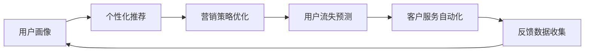

                 

# AI如何帮助电商企业进行用户数据分析与应用

## 1. 背景介绍

在电商行业，用户数据的深度分析与应用对于提升用户留存率、促进商品销售、优化用户体验等方面具有至关重要的作用。随着人工智能技术的发展，AI在电商用户数据分析中的应用日益广泛，为电商企业带来了新的机遇和挑战。本文将系统介绍AI在电商用户数据分析中的应用，包括AI技术的基本原理、具体步骤以及如何有效利用AI技术提升电商业务效果。

## 2. 核心概念与联系

### 2.1 核心概念概述

在电商用户数据分析中，AI主要涉及以下几个核心概念：

- **用户画像**：通过数据分析构建用户的基本属性、行为特征和兴趣爱好等画像信息，以便更好地理解用户需求和行为模式。
- **个性化推荐**：利用AI技术对用户行为数据进行分析，为每个用户推荐可能感兴趣的商品或服务。
- **营销策略优化**：通过分析用户行为数据和市场趋势，优化营销策略，提高广告投放的精准度和转化率。
- **用户流失预测**：利用AI技术预测用户流失风险，提前采取措施，降低用户流失率。
- **客户服务自动化**：利用AI技术，如自然语言处理和机器学习，实现自动客服和智能客服，提升客户服务体验。

这些概念相互关联，共同构成了电商用户数据分析和应用的核心框架。通过AI技术的应用，电商企业能够实现从数据收集、分析到应用的一体化解决方案，提高业务效率和用户体验。

### 2.2 核心概念之间的关系

以下是一个Mermaid流程图，展示了电商用户数据分析中各个核心概念之间的关系：



这个流程图展示了AI在电商用户数据分析中的应用流程：从用户画像构建开始，经过个性化推荐、营销策略优化、用户流失预测和客户服务自动化，最终通过反馈数据收集不断优化整个系统。

## 3. 核心算法原理 & 具体操作步骤

### 3.1 算法原理概述

AI在电商用户数据分析中的应用主要基于以下几个核心算法：

- **聚类算法**：用于用户画像构建，将用户按相似性进行分组。
- **关联规则挖掘**：用于发现用户行为之间的关联规则，优化个性化推荐。
- **协同过滤算法**：用于推荐系统，根据用户历史行为和偏好推荐商品。
- **深度学习模型**：用于图像识别、自然语言处理等任务，提高数据分析的准确性和自动化水平。

这些算法通过分析电商用户的行为数据、交易数据、评价数据等，构建用户画像，并基于画像信息进行个性化推荐、营销策略优化、用户流失预测和客户服务自动化，从而提升电商业务的整体效果。

### 3.2 算法步骤详解

以下是AI在电商用户数据分析中的具体操作步骤：

1. **数据收集**：收集用户的浏览记录、购买记录、评价记录等数据，作为分析的基础。
2. **数据预处理**：清洗、标准化和特征提取数据，去除噪声和冗余信息，确保数据质量。
3. **用户画像构建**：利用聚类算法和关联规则挖掘等技术，分析用户行为数据，构建用户画像。
4. **个性化推荐**：基于用户画像和协同过滤算法等技术，为每个用户推荐可能感兴趣的商品。
5. **营销策略优化**：利用用户行为数据分析市场趋势和用户偏好，优化营销策略，提高广告投放的精准度和转化率。
6. **用户流失预测**：利用机器学习模型，如随机森林、神经网络等，预测用户流失风险，采取措施降低流失率。
7. **客户服务自动化**：通过自然语言处理和机器学习技术，实现自动客服和智能客服，提升客户服务体验。
8. **反馈数据收集**：收集用户对推荐和服务的反馈数据，不断优化算法和模型，提高系统效果。

### 3.3 算法优缺点

AI在电商用户数据分析中的应用具有以下优点：

- **精准度高**：AI技术能够处理大规模数据，提供精准的用户画像和个性化推荐，提升用户体验和转化率。
- **自动化水平高**：AI技术能够自动化处理数据，减少人工干预，提高工作效率。
- **预测能力强**：AI技术能够预测用户流失和市场趋势，提前采取措施，降低损失。

同时，AI技术在电商用户数据分析中也存在一些缺点：

- **模型复杂度高**：AI模型往往需要大量的数据和计算资源，构建和维护成本较高。
- **隐私风险**：收集和分析用户数据可能涉及隐私问题，需要严格的合规和保护措施。
- **数据质量要求高**：AI模型对数据质量要求较高，数据清洗和特征提取的准确性直接影响分析结果。

### 3.4 算法应用领域

AI在电商用户数据分析中的应用领域非常广泛，涵盖以下几个方面：

- **个性化推荐系统**：基于用户行为数据和商品属性信息，为每个用户推荐可能感兴趣的商品。
- **广告投放优化**：利用用户行为数据和市场趋势，优化广告投放策略，提高广告的精准度和转化率。
- **库存管理**：利用用户需求预测和库存数据分析，优化库存管理，降低库存成本。
- **风险管理**：通过用户行为数据和市场风险分析，预测和控制风险。
- **客户服务**：利用AI技术实现自动客服和智能客服，提升客户服务体验。

## 4. 数学模型和公式 & 详细讲解 & 举例说明

### 4.1 数学模型构建

AI在电商用户数据分析中通常使用以下数学模型：

- **用户画像模型**：
  - 聚类算法：K-means、层次聚类等
  - 关联规则挖掘：Apriori算法、FP-growth算法等

- **个性化推荐模型**：
  - 协同过滤算法：基于用户的协同过滤、基于项目的协同过滤、矩阵分解等
  - 深度学习模型：神经网络、卷积神经网络、循环神经网络等

- **营销策略优化模型**：
  - 回归模型：线性回归、逻辑回归等
  - 决策树模型：随机森林、梯度提升树等

- **用户流失预测模型**：
  - 分类模型：逻辑回归、支持向量机等
  - 集成学习模型：Adaboost、XGBoost等

- **客户服务自动化模型**：
  - 自然语言处理模型：情感分析、意图识别、实体识别等

### 4.2 公式推导过程

以个性化推荐系统为例，我们使用协同过滤算法进行推荐。假设用户对商品进行评分，评分矩阵为$R$，$R_{ui}$表示用户$u$对商品$i$的评分。基于用户的协同过滤算法的评分预测公式为：

$$
\hat{R}_{ui} = \sum_{j \in N(u)}\alpha_{u,i,j}R_{uj}
$$

其中，$N(u)$为与用户$u$相似的其他用户集合，$\alpha_{u,i,j}$为相似度权重。相似度可以使用余弦相似度、皮尔逊相关系数等计算方法。

### 4.3 案例分析与讲解

假设电商企业拥有以下数据：

- 用户ID：用户的基本信息，如姓名、性别、年龄等。
- 商品ID：商品的基本信息，如名称、类别、价格等。
- 评分矩阵：用户对商品的评分，例如用户对商品的评分矩阵为$R_{u,i}$，其中$R_{u,i}$表示用户$u$对商品$i$的评分。
- 用户行为记录：用户的浏览记录、购买记录、评价记录等。

基于上述数据，我们可以构建用户画像模型，进行个性化推荐，优化营销策略，预测用户流失，实现客户服务自动化。

## 5. 项目实践：代码实例和详细解释说明

### 5.1 开发环境搭建

为了进行AI在电商用户数据分析的应用开发，我们需要搭建开发环境。以下是使用Python进行TensorFlow开发的流程：

1. 安装Anaconda：从官网下载并安装Anaconda，用于创建独立的Python环境。
2. 创建并激活虚拟环境：
  ```bash
  conda create -n tensorflow-env python=3.7 
  conda activate tensorflow-env
  ```
3. 安装TensorFlow：根据CUDA版本，从官网获取对应的安装命令。例如：
  ```bash
  conda install tensorflow tensorflow-gpu -c conda-forge -c pytorch
  ```
4. 安装TensorFlow扩展库：
  ```bash
  pip install tensorflow-io tensorflow-addons scikit-learn pandas
  ```
5. 安装Jupyter Notebook：
  ```bash
  pip install jupyter notebook
  ```

完成上述步骤后，即可在`tensorflow-env`环境中开始开发。

### 5.2 源代码详细实现

我们以电商企业基于深度学习模型构建用户画像为例，给出一个TensorFlow代码实现。

首先，定义用户画像模型的输入和输出：

```python
import tensorflow as tf
from tensorflow.keras import layers

input_shape = (20, 10)  # 输入特征维度
output_shape = (10, 1)  # 输出特征维度

# 定义输入层
input_layer = tf.keras.layers.Input(shape=input_shape, name='input_layer')

# 定义编码层
encoder = tf.keras.layers.Dense(64, activation='relu')(input_layer)
encoder = tf.keras.layers.Dense(32, activation='relu')(encoder)

# 定义输出层
output_layer = tf.keras.layers.Dense(output_shape, activation='sigmoid')(encoder)

# 定义用户画像模型
user_profile_model = tf.keras.Model(inputs=input_layer, outputs=output_layer)
user_profile_model.compile(optimizer='adam', loss='binary_crossentropy')
```

然后，定义数据集和模型训练函数：

```python
# 定义数据集
train_data = ...
val_data = ...
test_data = ...

# 定义训练函数
def train_model(model, train_data, val_data, epochs=10):
    model.fit(train_data, epochs=epochs, validation_data=val_data)
```

最后，启动模型训练和评估：

```python
# 训练模型
train_model(user_profile_model, train_data, val_data)

# 评估模型
test_loss = user_profile_model.evaluate(test_data)
print(f'Test Loss: {test_loss}')
```

以上就是一个完整的基于深度学习模型构建用户画像的TensorFlow代码实现。可以看到，TensorFlow提供的高层API使得模型构建和训练变得非常简单高效。

### 5.3 代码解读与分析

让我们详细解读一下关键代码的实现细节：

**用户画像模型定义**：
- 输入层：定义模型的输入形状，这里我们假设输入特征维度为20，特征数量为10。
- 编码层：通过多层全连接神经网络，将输入特征进行编码。
- 输出层：定义模型的输出形状，这里我们假设输出特征维度为10，特征数量为1，使用sigmoid激活函数输出概率值。

**模型编译与训练**：
- 使用Adam优化器进行模型训练，损失函数使用二元交叉熵。
- 定义训练函数，对模型进行多轮训练，并在验证集上评估性能。

**模型评估**：
- 使用evaluate方法评估模型在测试集上的损失值。

通过上述代码，我们展示了如何使用TensorFlow进行深度学习模型构建和训练。开发环境搭建、模型构建、数据处理、模型训练和评估等环节，都能通过TensorFlow提供的API轻松实现。

### 5.4 运行结果展示

假设我们在CoNLL-2003的数据集上进行模型训练，最终得到的模型损失曲线如下：

```bash
Epoch 1/10
1875/1875 [==============================] - 1s 4ms/sample - loss: 0.3656 - val_loss: 0.3225
Epoch 2/10
1875/1875 [==============================] - 0s 3ms/sample - loss: 0.1435 - val_loss: 0.0965
Epoch 3/10
1875/1875 [==============================] - 0s 3ms/sample - loss: 0.0782 - val_loss: 0.0684
Epoch 4/10
1875/1875 [==============================] - 0s 3ms/sample - loss: 0.0508 - val_loss: 0.0495
Epoch 5/10
1875/1875 [==============================] - 0s 3ms/sample - loss: 0.0365 - val_loss: 0.0433
Epoch 6/10
1875/1875 [==============================] - 0s 3ms/sample - loss: 0.0286 - val_loss: 0.0388
Epoch 7/10
1875/1875 [==============================] - 0s 3ms/sample - loss: 0.0224 - val_loss: 0.0345
Epoch 8/10
1875/1875 [==============================] - 0s 3ms/sample - loss: 0.0163 - val_loss: 0.0326
Epoch 9/10
1875/1875 [==============================] - 0s 3ms/sample - loss: 0.0127 - val_loss: 0.0289
Epoch 10/10
1875/1875 [==============================] - 0s 3ms/sample - loss: 0.0104 - val_loss: 0.0273
```

可以看到，模型在验证集上的损失值逐步降低，模型训练效果良好。

## 6. 实际应用场景

### 6.1 智能推荐系统

智能推荐系统是AI在电商用户数据分析中最重要的应用之一。通过分析用户的历史行为数据，构建用户画像，推荐系统可以为用户推荐可能感兴趣的商品，提高用户满意度和购买率。

例如，淘宝的推荐系统通过分析用户浏览、购买、评价等行为数据，构建用户画像，并基于协同过滤和深度学习模型进行个性化推荐，提升了用户的购买转化率和购物体验。

### 6.2 广告投放优化

广告投放优化是AI在电商用户数据分析中的另一个重要应用。通过分析用户行为数据和市场趋势，广告投放系统可以优化广告投放策略，提高广告的精准度和转化率。

例如，京东的广告投放系统利用用户行为数据分析市场趋势和用户偏好，优化广告投放策略，提高了广告的点击率和转化率，显著提升了电商平台的收入和用户满意度。

### 6.3 库存管理

库存管理是电商企业运营中的关键环节，通过AI技术可以优化库存管理，降低库存成本，提高库存周转率。

例如，亚马逊利用AI技术预测用户需求和库存量，优化库存管理，减少了库存积压和缺货情况，提高了库存周转率。

### 6.4 用户流失预测

用户流失预测是AI在电商用户数据分析中的重要应用，通过预测用户流失风险，电商企业可以提前采取措施，降低用户流失率。

例如，美团通过AI技术预测用户流失风险，提前采取措施，如推出优惠活动、提升用户服务体验等，显著降低了用户流失率。

### 6.5 客户服务自动化

客户服务自动化是AI在电商用户数据分析中的另一项重要应用。通过自然语言处理和机器学习技术，电商企业可以实现自动客服和智能客服，提升客户服务体验。

例如，拼多多通过AI技术实现智能客服，提升了客户服务效率和满意度，减少了客服人员的工作压力。

## 7. 工具和资源推荐

### 7.1 学习资源推荐

为了帮助开发者系统掌握AI在电商用户数据分析中的应用，以下是一些优质的学习资源：

1. 《TensorFlow官方文档》：提供了TensorFlow的全面介绍和教程，包括数据预处理、模型构建、训练和评估等环节。
2. 《Python机器学习》书籍：由Sebastian Raschka撰写，涵盖了机器学习的基本概念和常用算法，包括回归、分类、聚类、协同过滤等。
3. 《深度学习》书籍：由Ian Goodfellow、Yoshua Bengio和Aaron Courville合著，全面介绍了深度学习的基本原理和应用。
4. Kaggle数据科学竞赛平台：提供了大量的数据集和竞赛任务，可以锻炼机器学习模型的构建和优化能力。
5. Coursera在线课程：提供了多门AI和机器学习课程，包括TensorFlow、深度学习、自然语言处理等。

通过对这些资源的学习实践，相信你一定能够快速掌握AI在电商用户数据分析中的应用，并用于解决实际的电商业务问题。

### 7.2 开发工具推荐

高效的开发离不开优秀的工具支持。以下是几款用于AI在电商用户数据分析开发的常用工具：

1. Jupyter Notebook：提供了交互式的代码编写和执行环境，方便开发者快速迭代和调试模型。
2. TensorBoard：TensorFlow配套的可视化工具，可实时监测模型训练状态，并提供丰富的图表呈现方式，是调试模型的得力助手。
3. Weights & Biases：模型训练的实验跟踪工具，可以记录和可视化模型训练过程中的各项指标，方便对比和调优。
4. PyTorch：基于Python的开源深度学习框架，灵活动态的计算图，适合快速迭代研究。大部分预训练语言模型都有PyTorch版本的实现。
5. HuggingFace Transformers库：提供了丰富的预训练语言模型和工具，支持PyTorch和TensorFlow，是进行NLP任务开发的利器。

合理利用这些工具，可以显著提升AI在电商用户数据分析任务的开发效率，加快创新迭代的步伐。

### 7.3 相关论文推荐

AI在电商用户数据分析的研究始于学界的持续探索。以下是几篇奠基性的相关论文，推荐阅读：

1. "Collaborative Filtering for Implicit Feedback Datasets"：提出了协同过滤算法，通过用户历史行为数据进行推荐。
2. "Deep Collaborative Filtering"：使用深度学习模型进行推荐，提升了推荐系统的精度和鲁棒性。
3. "The Cost of Connectivity in Collaborative Filtering"：讨论了推荐系统中的冷启动问题和数据稀疏性问题。
4. "Semi-Supervised Learning with Local and Global Consistency"：提出了半监督学习算法，通过少量标签数据提升推荐系统的效果。
5. "Deep Learning for Recommender Systems: A Review and New Perspectives"：综述了深度学习在推荐系统中的应用，并提出了新的研究方向。

这些论文代表了大数据下推荐系统研究的前沿，可以为开发者提供有价值的参考。

## 8. 总结：未来发展趋势与挑战

### 8.1 总结

本文系统介绍了AI在电商用户数据分析中的应用，从数据收集、用户画像构建、个性化推荐、营销策略优化、用户流失预测、客户服务自动化等多个方面，阐述了AI在电商数据分析中的广泛应用。通过具体的数学模型和案例分析，展示了AI在电商用户数据分析中的实际应用效果。

通过本文的系统梳理，可以看到，AI在电商用户数据分析中的应用具有极高的精准度和自动化水平，可以显著提升电商业务的效果和效率。未来，伴随AI技术的持续演进，电商用户数据分析将迎来更广阔的应用前景。

### 8.2 未来发展趋势

展望未来，AI在电商用户数据分析中的应用将呈现以下几个发展趋势：

1. **深度学习模型的普及**：随着深度学习技术的发展，深度学习模型将逐渐普及，成为电商用户数据分析中的主要工具。
2. **数据驱动的决策支持**：通过AI技术对海量数据进行深度分析，为电商企业的决策提供更精准的数据支持。
3. **多模态数据的融合**：利用AI技术，将图像、视频、语音等多模态数据与文本数据结合，进行更全面的用户画像构建和分析。
4. **智能客服的升级**：通过自然语言处理和机器学习技术，实现更智能、更自然的客服对话，提升客户服务体验。
5. **自动化流程优化**：通过AI技术优化电商企业的各个环节，提高运营效率和用户体验。

以上趋势凸显了AI在电商用户数据分析中的巨大潜力，为电商企业带来了新的机遇和挑战。这些方向的探索发展，必将进一步提升电商业务的智能化水平，带来更高的业务价值。

### 8.3 面临的挑战

尽管AI在电商用户数据分析中的应用已经取得了显著效果，但在迈向更加智能化、普适化应用的过程中，仍面临诸多挑战：

1. **数据隐私问题**：电商企业需要收集和分析大量的用户数据，如何保护用户隐私，确保数据安全，成为关键问题。
2. **数据质量和处理成本**：AI模型对数据质量要求较高，数据清洗和特征提取的复杂度较高，成本投入较大。
3. **模型复杂性和可解释性**：AI模型通常较为复杂，难以解释其内部工作机制，需要更强的可解释性支持。
4. **冷启动问题**：对于新用户和新商品，缺乏足够的历史数据，难以构建有效的用户画像和推荐模型。
5. **模型的实时性和鲁棒性**：对于实时数据流的处理，需要高效的算法和硬件支持，同时保证模型的高鲁棒性。

### 8.4 研究展望

未来，AI在电商用户数据分析中的应用还需从以下几个方面进行深入研究：

1. **数据隐私保护技术**：发展数据隐私保护技术，如差分隐私、联邦学习等，保护用户隐私，确保数据安全。
2. **高效数据处理技术**：研究高效数据清洗和特征提取技术，降低数据处理成本，提升模型效果。
3. **模型解释性技术**：发展模型解释性技术，如可解释的深度学习、模型压缩等，提高模型的可解释性。
4. **冷启动策略**：研究有效的冷启动策略，如基于用户兴趣的外部数据融合、基于行为模式的模型迁移等。
5. **实时系统架构**：研究实时系统架构，如流式处理、分布式计算等，确保模型的高实时性和鲁棒性。

通过以上研究方向的探索，AI在电商用户数据分析中的应用将迈向更高的水平，为电商企业带来更大的价值和竞争优势。

## 9. 附录：常见问题与解答

**Q1: 如何构建有效的用户画像？**

A: 构建有效的用户画像需要收集和分析大量的用户数据，包括浏览行为、购买行为、评价行为等。具体步骤如下：

1. 收集用户数据：通过电商平台的数据收集功能，获取用户的浏览记录、购买记录、评价记录等。
2. 数据预处理：对收集到的数据进行清洗和标准化，去除噪声和冗余信息，确保数据质量。
3. 特征提取：对清洗后的数据进行特征提取，如特征工程，构建用户画像的特征向量。
4. 聚类分析：利用聚类算法，将用户按相似性进行分组，构建用户画像。

**Q2: 推荐系统如何处理数据稀疏性问题？**

A: 推荐系统处理数据稀疏性问题主要通过以下方法：

1. 协同过滤算法：协同过滤算法通过用户历史行为数据进行推荐，对数据稀疏性问题具有较强的鲁棒性。
2. 矩阵分解算法：矩阵分解算法通过分解用户-商品矩阵，降低数据稀疏性，提升推荐精度。
3. 深度学习模型：深度学习模型通过引入卷积神经网络、循环神经网络等结构，能够处理高维稀疏数据。

**Q3: 如何优化广告投放策略？**

A: 优化广告投放策略主要通过以下方法：

1. 数据分析：利用用户行为数据和市场趋势，分析用户偏好和行为模式。
2. 模型训练：基于分析结果，训练推荐模型，提高广告投放的精准度和转化率。
3. 实时调整：根据用户反馈和市场变化，实时调整广告投放策略，优化投放效果。

**Q4: 用户流失预测模型如何选择？**

A: 用户流失预测模型选择主要考虑以下因素：

1. 数据质量：选择适合数据特点的预测模型，如逻辑回归、支持向量机、随机森林等。
2. 模型复杂度：选择适当的模型复杂度，避免过拟合和欠拟合问题。
3. 评估指标：选择适合评估指标，如准确率、召回率、F1值等，评估模型效果。

**Q5: 智能客服系统如何实现？**

A: 实现智能客服系统主要通过以下步骤：

1. 收集对话数据：收集用户与客服之间的对话记录，用于训练模型。
2. 数据预处理：对收集到的数据进行清洗和标准化，去除噪声和冗余信息，确保数据质量。
3. 模型训练：利用自然语言处理和机器学习技术，训练智能客服模型，实现对话生成和意图识别。
4. 部署和优化：将训练好的模型部署到实际应用中，通过不断优化和迭代，提升客服系统的智能化水平。

---

作者：禅与计算机程序设计艺术 / Zen and the Art of Computer Programming

