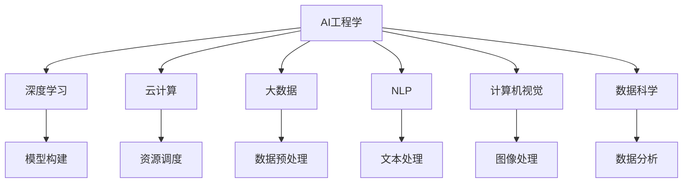
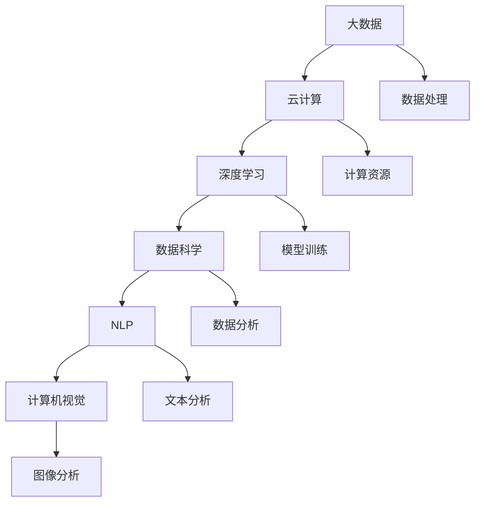
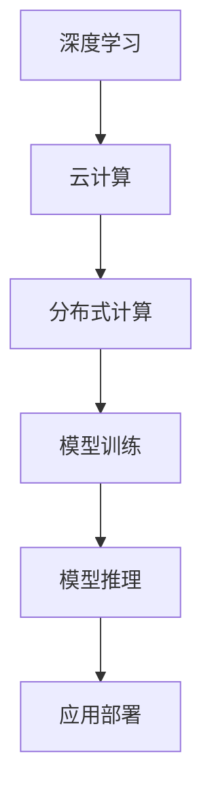
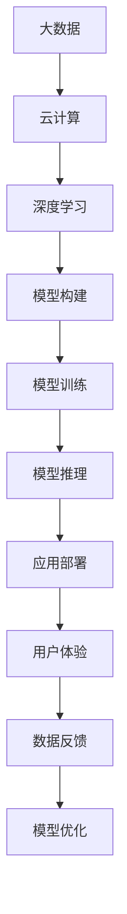
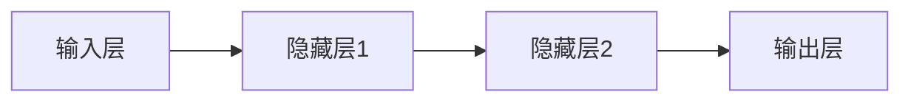

                 

# AI工程学：应用开发实战手册

> 关键词：AI工程、应用开发、深度学习、云计算、大数据、人工智能、机器学习、自然语言处理、计算机视觉、数据科学、软件开发

## 1. 背景介绍

随着人工智能技术的迅猛发展，越来越多的企业开始重视AI技术的应用，并将其融入到业务运营和产品开发中。AI工程学（AI Engineering）作为一门交叉学科，旨在将AI技术转化为实际生产力和业务价值，满足企业的应用需求。本文将从背景介绍、核心概念、算法原理、项目实践、实际应用、工具推荐、未来展望等多个角度，深入探讨AI工程学的应用开发实战技巧。

### 1.1 问题由来

AI工程学源于AI领域与工程实践的结合，旨在将复杂的AI技术转化为易于理解和实现的生产力。传统上，AI技术的开发主要依赖于研究人员的知识和经验，难以在短时间内实现大规模应用。AI工程学的出现，通过系统化、工程化的方式，将AI技术与工程实践相结合，帮助企业快速部署和优化AI应用。

AI工程学的兴起，得益于以下几个方面的推动：

- 大数据技术的发展：海量数据为AI模型训练提供了丰富的素材，推动了深度学习等技术的突破。
- 云计算平台的成熟：云计算平台提供了高性能计算资源和弹性扩展能力，降低了AI开发的门槛。
- 跨学科融合：AI工程学结合了计算机科学、统计学、数学、心理学等领域的知识，形成了一门综合性学科。
- 需求驱动：企业对AI应用的需求日益强烈，AI工程学成为满足这些需求的重要手段。

### 1.2 问题核心关键点

AI工程学的核心在于将复杂的AI技术转化为易用的产品和服务，其关键点包括以下几个方面：

- 系统化方法：通过系统化的方法，将AI技术从研究到应用的全流程进行规范化、标准化。
- 工程化实践：将AI技术封装为软件组件，提供易于集成和部署的解决方案。
- 可扩展性：在保障AI系统性能的同时，实现业务模型的可扩展和优化。
- 可解释性：赋予AI系统更高的可解释性和可审计性，满足合规和信任需求。
- 用户体验：注重用户体验设计，提升AI产品的易用性和接受度。

通过解决以上关键点，AI工程学帮助企业更高效、更可靠地应用AI技术，推动AI技术在各行各业的广泛落地。

### 1.3 问题研究意义

AI工程学的研究与实践，对于推动AI技术的产业化进程，提升企业的技术实力和市场竞争力，具有重要意义：

1. **降低开发成本**：AI工程学通过工程化、标准化的方法，大幅降低了AI技术的开发和部署成本，使更多企业能够轻松进入AI领域。
2. **提升应用效果**：通过系统化的设计、工程化的实施，AI工程学能够保证AI应用的效果和性能，满足实际应用需求。
3. **加速技术迭代**：AI工程学帮助企业快速迭代和优化AI模型，加速技术的市场应用和产业升级。
4. **促进创新发展**：AI工程学为AI技术的跨领域应用提供了支撑，推动更多创新应用的涌现。
5. **增强企业竞争力**：AI工程学能够为企业提供灵活、高效的AI技术解决方案，提升企业的市场竞争力。

## 2. 核心概念与联系

### 2.1 核心概念概述

为更好地理解AI工程学的应用开发实战技巧，本节将介绍几个核心概念：

- **AI工程学（AI Engineering）**：将AI技术转化为实际生产力的方法和实践，包括模型构建、数据处理、系统集成、应用部署等多个环节。
- **深度学习（Deep Learning）**：一种基于神经网络结构的机器学习方法，能够自动学习数据中的高级抽象特征，广泛应用于计算机视觉、自然语言处理等领域。
- **云计算（Cloud Computing）**：通过互联网提供按需、弹性、可扩展的计算资源，支持AI模型的训练和推理。
- **大数据（Big Data）**：指规模巨大、类型多样的数据集合，为AI模型提供了丰富的训练数据。
- **自然语言处理（Natural Language Processing, NLP）**：使计算机能够理解和处理人类语言的技术，包括文本分类、情感分析、机器翻译等应用。
- **计算机视觉（Computer Vision）**：使计算机能够理解和处理视觉数据的技术，包括图像识别、目标检测、图像生成等应用。
- **数据科学（Data Science）**：通过数据挖掘、统计分析等手段，从数据中提取知识和洞见，支持AI模型的设计和优化。

这些核心概念之间的逻辑关系可以通过以下Mermaid流程图来展示：

这个流程图展示了AI工程学的核心概念及其之间的关系：

1. AI工程学作为顶层概念，涵盖了深度学习、云计算、大数据、NLP、计算机视觉、数据科学等多个子领域。
2. 深度学习是AI工程学中的关键技术之一，涉及模型的构建和优化。
3. 云计算和大数据提供了模型训练和推理所需的计算资源和数据集。
4. NLP和计算机视觉是深度学习的重要应用领域，通过工程化实践实现实际应用。
5. 数据科学通过数据处理和分析，为模型训练提供数据支撑。

### 2.2 概念间的关系

这些核心概念之间存在着紧密的联系，形成了AI工程学的完整生态系统。下面我通过几个Mermaid流程图来展示这些概念之间的关系。

#### 2.2.1 AI工程学的整体架构

这个综合流程图展示了从大数据到计算机视觉的AI工程学应用全流程：

1. 大数据通过云计算提供计算资源，支持深度学习的模型训练。
2. 数据科学通过数据分析和处理，为模型训练提供数据支撑。
3. NLP和计算机视觉通过深度学习模型进行文本和图像处理。
4. AI工程学整合各个环节的技术和资源，实现模型构建、集成和部署。

#### 2.2.2 深度学习与云计算的关系

这个流程图展示了深度学习与云计算的紧密联系：

1. 深度学习模型通过云计算提供的分布式计算资源进行训练。
2. 模型训练后，通过云计算的存储和推理服务进行推理。
3. 最终，训练好的模型被部署到云计算平台上，供实际应用使用。

#### 2.2.3 云计算与大数据的关系

这个流程图展示了云计算与大数据的协作关系：

1. 云计算提供了数据存储和处理服务，支持大数据的应用。
2. 大数据通过云计算进行高效存储和处理，为深度学习模型提供训练数据。
3. 数据分析和可视化结果通过云计算平台提供，方便用户理解和使用。

### 2.3 核心概念的整体架构

最后，我们用一个综合的流程图来展示这些核心概念在大规模数据训练和应用部署中的整体架构：

这个综合流程图展示了从数据到大规模应用的全流程：

1. 大数据通过云计算提供计算资源，支持深度学习模型的训练。
2. 深度学习模型通过模型构建和训练，得到初步模型。
3. 初步模型通过推理服务进行部署和应用。
4. 通过用户体验和数据反馈，不断优化模型和应用，实现持续改进。

## 3. 核心算法原理 & 具体操作步骤

### 3.1 算法原理概述

AI工程学的核心算法原理主要围绕模型构建、数据处理、系统集成、应用部署等多个环节展开。本节将详细阐述这些核心算法原理及其具体操作步骤。

#### 3.1.1 模型构建

模型构建是AI工程学的第一步，旨在设计和实现适合特定应用的深度学习模型。模型构建一般包括以下几个关键步骤：

1. **需求分析**：确定应用场景、业务需求和关键指标，明确模型的目标和要求。
2. **数据准备**：收集和预处理训练数据，确保数据质量和多样性。
3. **模型选择**：根据需求选择合适的模型结构，如卷积神经网络（CNN）、循环神经网络（RNN）、长短时记忆网络（LSTM）、Transformer等。
4. **超参数优化**：通过交叉验证等方法，寻找最优的超参数组合。
5. **模型训练**：在准备好的数据集上，使用优化算法（如随机梯度下降）训练模型，并根据验证集性能进行迭代优化。

#### 3.1.2 数据处理

数据处理是AI工程学中的重要环节，直接影响模型的性能和效果。数据处理一般包括以下几个关键步骤：

1. **数据清洗**：去除噪音数据，修正数据错误，确保数据质量。
2. **特征工程**：提取和选择关键特征，提高数据表达能力。
3. **数据增强**：通过数据增强技术（如旋转、裁剪、噪声添加等）丰富数据集，防止过拟合。
4. **数据标准化**：对数据进行标准化处理，确保输入数据的一致性。

#### 3.1.3 系统集成

系统集成是AI工程学的关键步骤，旨在将模型和数据集成到实际应用系统中。系统集成一般包括以下几个关键步骤：

1. **模型部署**：将训练好的模型部署到服务器或云端，进行推理计算。
2. **接口设计**：设计模型API，支持模型的接入和使用。
3. **系统集成**：将模型API集成到实际应用系统中，进行业务流程优化和功能增强。
4. **性能优化**：对模型推理和系统集成进行性能优化，确保系统的高效运行。

#### 3.1.4 应用部署

应用部署是AI工程学的最后一步，旨在将模型和系统部署到实际应用场景中，提供稳定可靠的服务。应用部署一般包括以下几个关键步骤：

1. **环境搭建**：在服务器或云平台上搭建应用环境，配置必要的资源。
2. **模型部署**：将模型部署到服务器或云平台，进行实时推理计算。
3. **用户界面**：设计用户界面，方便用户与系统的交互。
4. **监控维护**：对系统进行实时监控和维护，确保系统稳定运行。

### 3.2 算法步骤详解

#### 3.2.1 模型构建步骤详解

1. **需求分析**
   - 明确应用场景和业务需求，确定模型目标和要求。
   - 确定模型的关键指标，如精度、召回率、F1分数等。

2. **数据准备**
   - 收集和整理训练数据，确保数据的质量和多样性。
   - 对数据进行预处理，包括数据清洗、特征工程和数据增强。

3. **模型选择**
   - 根据需求选择合适的模型结构，如CNN、RNN、LSTM、Transformer等。
   - 根据数据类型和任务特点，选择合适的模型层数、神经元数量等。

4. **超参数优化**
   - 使用交叉验证等方法，寻找最优的超参数组合。
   - 常用超参数包括学习率、批大小、迭代次数等。

5. **模型训练**
   - 在准备好的数据集上，使用优化算法（如随机梯度下降）训练模型。
   - 根据验证集性能，进行迭代优化，直到达到预设的性能指标。

#### 3.2.2 数据处理步骤详解

1. **数据清洗**
   - 去除噪音数据，修正数据错误，确保数据质量。
   - 处理缺失值、异常值，确保数据完整性。

2. **特征工程**
   - 提取关键特征，提高数据表达能力。
   - 使用特征选择技术（如PCA、LDA等），降低特征维度，提高模型效率。

3. **数据增强**
   - 通过数据增强技术（如旋转、裁剪、噪声添加等）丰富数据集，防止过拟合。
   - 使用数据增强库（如Keras、TensorFlow等），实现自动化增强。

4. **数据标准化**
   - 对数据进行标准化处理，确保输入数据的一致性。
   - 使用标准化技术（如Z-score标准化），将数据转化为标准正态分布。

#### 3.2.3 系统集成步骤详解

1. **模型部署**
   - 在服务器或云平台上搭建应用环境，配置必要的资源。
   - 将训练好的模型部署到服务器或云平台，进行实时推理计算。

2. **接口设计**
   - 设计模型API，支持模型的接入和使用。
   - 使用RESTful API，提供API文档和接口测试工具。

3. **系统集成**
   - 将模型API集成到实际应用系统中，进行业务流程优化和功能增强。
   - 使用Docker等容器技术，实现应用的快速部署和扩展。

4. **性能优化**
   - 对模型推理和系统集成进行性能优化，确保系统的高效运行。
   - 使用缓存技术、负载均衡等方法，提高系统响应速度和稳定性。

#### 3.2.4 应用部署步骤详解

1. **环境搭建**
   - 在服务器或云平台上搭建应用环境，配置必要的资源。
   - 使用虚拟化技术（如VM、容器等），确保环境的一致性和稳定性。

2. **模型部署**
   - 将训练好的模型部署到服务器或云平台，进行实时推理计算。
   - 使用自动化工具（如Jenkins、Kubernetes等），实现模型的自动化部署和更新。

3. **用户界面**
   - 设计用户界面，方便用户与系统的交互。
   - 使用Web开发框架（如React、Angular等），实现友好的用户界面。

4. **监控维护**
   - 对系统进行实时监控和维护，确保系统稳定运行。
   - 使用监控工具（如Prometheus、Grafana等），实时监测系统性能和异常。

### 3.3 算法优缺点

#### 3.3.1 算法优点

1. **高效性**：AI工程学通过系统化方法，大幅提高了AI技术的开发和部署效率，降低了时间和成本。
2. **可靠性**：系统化的设计和工程化的实施，提高了AI系统的稳定性和可靠性。
3. **可扩展性**：通过云计算等技术，实现了模型的灵活扩展和优化，满足大规模应用需求。
4. **可解释性**：通过模型解释技术，提高了AI系统的可解释性和可审计性，满足合规和信任需求。
5. **用户体验**：注重用户体验设计，提升了AI产品的易用性和接受度。

#### 3.3.2 算法缺点

1. **复杂性**：AI工程学涉及多个环节，需要跨学科知识和技能，技术门槛较高。
2. **资源需求**：AI工程学的应用需要高性能计算资源和数据集，成本较高。
3. **模型限制**：目前的AI模型往往依赖大量标注数据和高质量特征，数据获取和处理成本较高。
4. **应用局限**：AI工程学主要聚焦于传统机器学习模型，对于新兴的深度学习和强化学习技术，需要进一步探索和实践。
5. **市场依赖**：AI工程学的成功应用依赖于云计算平台和数据服务提供商，存在一定的市场依赖性。

### 3.4 算法应用领域

AI工程学的应用领域非常广泛，涉及多个行业和技术领域。以下是几个典型的应用领域：

1. **金融领域**：用于信用评估、风险管理、反欺诈、智能投顾等应用。
2. **医疗领域**：用于疾病预测、治疗方案推荐、智能诊断等应用。
3. **零售领域**：用于客户画像、商品推荐、库存管理、销售预测等应用。
4. **智能制造**：用于生产过程监控、设备维护、质量控制等应用。
5. **智慧城市**：用于交通管理、环境监测、公共安全等应用。
6. **教育领域**：用于学习分析、智能推荐、语言教育等应用。

## 4. 数学模型和公式 & 详细讲解  
### 4.1 数学模型构建

AI工程学中的数学模型构建主要涉及深度学习模型的设计和训练。本节将详细阐述数学模型构建的各个步骤和关键公式。

#### 4.1.1 神经网络结构

神经网络是深度学习模型的核心，由多个神经元组成的网络结构。以下是一个典型的神经网络结构：

神经网络由输入层、隐藏层和输出层组成。输入层接收原始数据，隐藏层进行特征提取和处理，输出层输出最终结果。

#### 4.1.2 损失函数

损失函数是衡量模型预测与真实标签之间差异的指标，常用的损失函数包括：

1. **均方误差损失（Mean Squared Error, MSE）**：
   $$
   L_{MSE} = \frac{1}{N} \sum_{i=1}^N (y_i - \hat{y}_i)^2
   $$
   其中 $y_i$ 为真实标签，$\hat{y}_i$ 为模型预测值，$N$ 为样本数量。

2. **交叉熵损失（Cross-Entropy Loss）**：
   $$
   L_{CE} = -\frac{1}{N} \sum_{i=1}^N (y_i \log \hat{y}_i + (1 - y_i) \log (1 - \hat{y}_i))
   $$
   其中 $y_i$ 为真实标签，$\hat{y}_i$ 为模型预测值，$N$ 为样本数量。

3. **二元交叉熵损失（Binary Cross-Entropy Loss）**：
   $$
   L_{BCE} = -\frac{1}{N} \sum_{i=1}^N (y_i \log \hat{y}_i + (1 - y_i) \log (1 - \hat{y}_i))
   $$
   其中 $y_i$ 为真实标签，$\hat{y}_i$ 为模型预测值，$N$ 为样本数量。

#### 4.1.3 优化算法

优化算法用于更新模型参数，使得损失函数最小化。常用的优化算法包括：

1. **随机梯度下降（Stochastic Gradient Descent, SGD）**：
   $$
   \theta \leftarrow \theta - \eta \nabla_{\theta} L
   $$
   其中 $\theta$ 为模型参数，$\eta$ 为学习率，$\nabla_{\theta} L$ 为损失函数对参数的梯度。

2. **Adam优化算法**：
   $$
   \theta \leftarrow \theta - \eta \frac{m}{\sqrt{v}} = \theta - \eta \frac{1}{\sqrt{v}} \left(\frac{m}{2} + \frac{v}{2}\right)
   $$
   其中 $m$ 为梯度的一阶动量，$v$ 为梯度的二阶动量，$\eta$ 为学习率。

3. **Adagrad优化算法**：
   $$
   \theta \leftarrow \theta - \frac{\eta}{\sqrt{g_i + \epsilon}} g_i
   $$
   其中 $g_i$ 为梯度向量，$\epsilon$ 为防止除数为零的常数，$\eta$ 为学习率。

### 4.2 公式推导过程

#### 4.2.1 均方误差损失推导

均方误差损失是衡量回归问题中模型预测与真实标签之间差异的常用指标。以下是均方误差损失的推导过程：

设模型预测值为 $\hat{y}_i$，真实标签为 $y_i$，样本数量为 $N$，则均方误差损失为：

$$
L_{MSE} = \frac{1}{N} \sum_{i=1}^N (y_i - \hat{y}_i)^2
$$

通过对均方误差损失的梯度计算，可以得到模型参数的更新公式：

$$
\frac{\partial L_{MSE}}{\partial \theta} = -\frac{2}{N} \sum_{i=1}^N (y_i - \hat{y}_i)
$$

将梯度代入优化算法中，得到参数更新公式：

$$
\theta \leftarrow \theta - \eta \frac{2}{N} \sum_{i=1}^N (y_i - \hat{y}_i)
$$

#### 4.2.2 交叉熵损失推导

交叉熵损失是衡量分类问题中模型预测与真实标签之间差异的常用指标。以下是交叉熵损失的推导过程：

设模型预测值为 $\hat{y}_i$，真实标签为 $y_i$，样本数量为 $N$，则交叉熵损失为：

$$
L_{CE} = -\frac{1}{N} \sum_{i=1}^N (y_i \log \hat{y}_i + (1 - y_i) \log (1 - \hat{y}_i))
$$

通过对交叉熵损失的梯度计算，可以得到模型参数的更新公式：

$$
\frac{\partial L_{CE}}{\partial \theta} = -\frac{1}{N} \sum_{i=1}^N (y_i - \hat{y}_i) \frac{\partial \hat{y}_i}{\partial \theta}
$$

将梯度代入优化算法中，得到参数更新公式：

$$
\theta \leftarrow \theta - \eta \frac{1}{N} \sum_{i=1}^N (y_i - \hat{y}_i) \frac{\partial \hat{y}_i}{\partial \theta}
$$

#### 4.2.3 二元交叉熵损失推导

二元交叉熵损失是用于二分类问题的常用指标。以下是二元交叉熵损失的推导过程：

设模型预测值为 $\hat{y}_i$，真实标签为 $y_i$，样本数量为 $N$，则二元交叉熵损失为：

$$
L_{BCE} = -\frac{1}{N} \sum_{i=1}^N (y_i \log \hat{y}_i + (1 - y_i) \log (1 - \hat{y}_i))
$$

通过对二元交叉熵损失的梯度计算，可以得到模型参数的更新公式：

$$
\frac{\partial L_{BCE}}{\partial \theta} = -\frac{1}{N} \sum_{i=1}^N (y_i - \hat{y}_i) \frac{\partial \hat{y}_i}{\partial \theta}
$$

将梯度代入优化算法中，得到参数更新公式：

$$
\theta \leftarrow \theta - \eta \frac{1}{N} \sum_{i=1}^N (y_i - \hat{y}_i) \frac{\partial \hat{y}_i}{\partial \theta}
$$

### 4.3 案例分析与讲解

#### 4.3.1 文本分类

文本分类是自然语言处理中的经典任务，广泛应用于垃圾邮件过滤、情感分析、新闻分类等领域。以下是文本分类的详细讲解：

设文本为 $x$，标签为 $y$，模型参数为 $\theta$，文本分类任务的目标是学习模型 $M_{\theta}(x)$ 对文本 $x$ 进行分类。

1. **数据准备**
   - 收集和整理训练数据，包括文本和标签。
   - 对文本进行预处理，包括分词、去除停用词、词向量化等。

2. **模型选择**
   - 选择文本分类模型，如朴素贝叶斯、支持向量机、卷积神经网络等。
   - 根据任务特点选择合适的模型结构和超参数。

3. **训练模型**
   - 使用交叉验证等方法，对模型进行训练和调优。
   - 使用优化算法（如随机梯度下降）更新模型参数，最小化损失函数。

4. **测试模型**
   - 在测试集上对模型进行测试，评估分类准确率和召回率等指标。
   - 使用混淆矩阵、ROC曲线等方法分析模型性能。

#### 4.3.2 图像识别

图像识别是计算机视觉中的经典任务，广泛应用于自动驾驶、安防监控、医学诊断等领域。以下是图像识别的详细讲解：

设图像为 $x$，标签为 $y$，模型参数为 $\theta$，图像识别任务的目标是学习模型 $M_{\theta}(x)$ 对图像 $x$ 进行分类。

1. **数据准备**
   - 收集和整理训练数据，包括图像和标签。
   - 对图像进行预处理，

