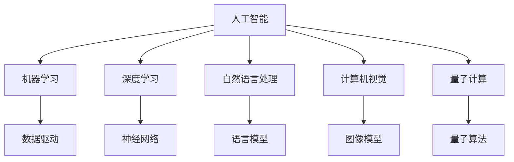
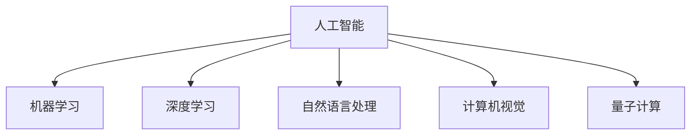
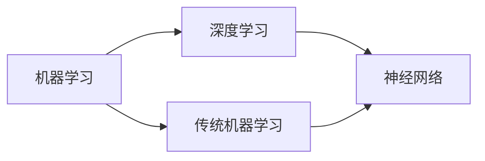
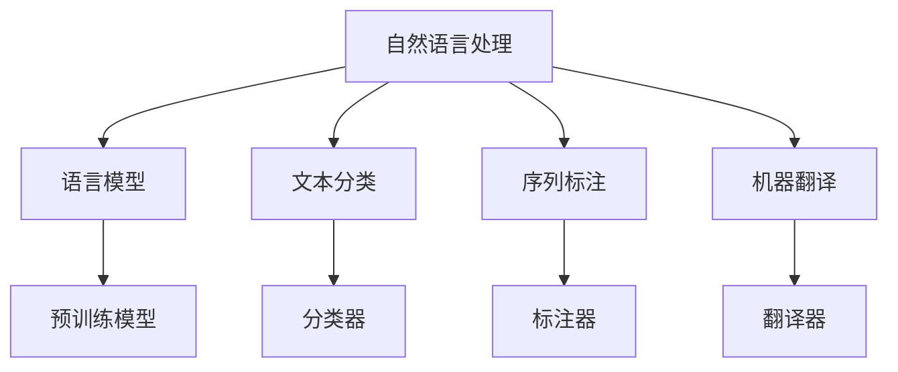
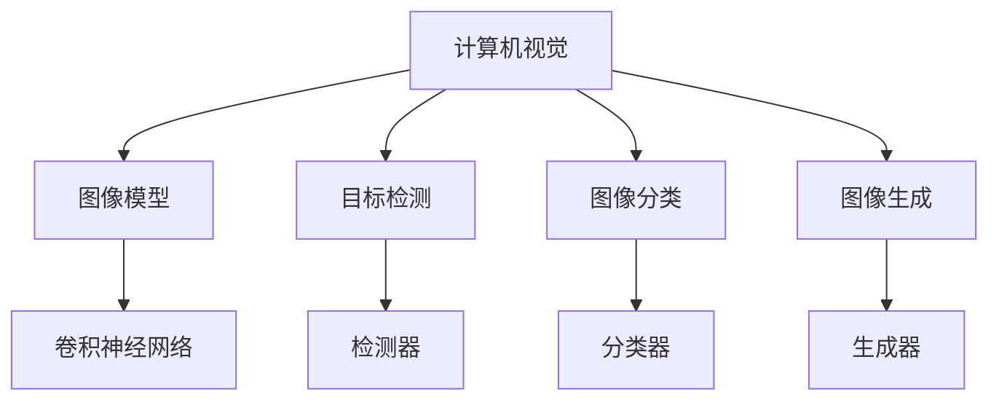
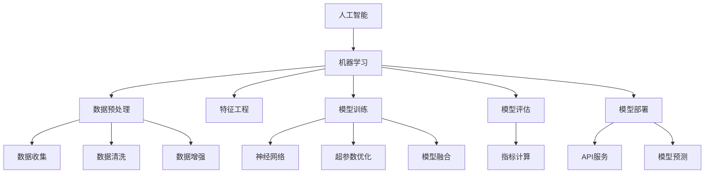

                 

# AI进展的意义与未来展望

> 关键词：人工智能,机器学习,深度学习,大数据,自然语言处理,计算机视觉,量子计算,未来趋势

## 1. 背景介绍

### 1.1 问题由来
人工智能（Artificial Intelligence, AI）自20世纪中叶起源以来，经历了从专家系统、统计学习到深度学习的发展，进入了今天机器学习为主导的新纪元。在数据驱动和计算能力大幅提升的推动下，AI技术在各行各业实现了深度应用，改变了人类社会的生产方式和生活方式。然而，随着技术的不断演进，AI技术面临的挑战也在不断升级，从算法伦理到计算资源，从模型可解释性到应用安全性，都成为了必须认真思考和解决的问题。

### 1.2 问题核心关键点
人工智能的核心是让机器能够模拟人类的智能行为，以实现自动化和智能化。目前的AI研究，主要聚焦在以下几个关键问题上：

1. **数据驱动与算法创新**：如何高效利用海量数据，实现模型参数的自动化优化，提升AI系统的性能。
2. **模型可解释性与透明性**：如何在保障模型预测精度的同时，增强模型的可解释性，使其具备可信赖性。
3. **计算资源与分布式处理**：如何通过高效计算，提升AI系统的大规模数据处理和模型训练能力。
4. **应用伦理与安全性**：如何在AI应用中确保数据隐私、算法公平和决策透明，防止误用和滥用。

### 1.3 问题研究意义
探讨AI进展的意义与未来展望，对于把握当前技术的核心发展方向，引导社会对AI的合理应用，具有重要意义：

1. **技术突破**：了解最新的AI技术进展，有助于科研人员和工程实践者掌握前沿动态，推动技术创新。
2. **应用拓展**：认识AI技术在各行业的应用前景，为产业界提供指导，加速产业数字化转型。
3. **伦理考量**：深入理解AI技术对社会的潜在影响，促使政策制定者和业界领袖制定更为合理的应用规范和伦理准则。
4. **人才培养**：明确AI技术对人才需求的趋势，为教育体系培养更多具有前瞻性和创新能力的AI人才。
5. **社会认知**：增强公众对AI技术的理解和接受，消除误解和恐惧，推动AI技术的普及应用。

## 2. 核心概念与联系

### 2.1 核心概念概述

为更好地理解人工智能技术进展，本节将介绍几个核心概念，并阐述其之间的联系。

- **人工智能（AI）**：模拟人类智能行为的技术体系，包括感知、理解、学习和执行复杂任务的能力。
- **机器学习（ML）**：通过数据驱动的算法，让机器从数据中学习规律，提升决策能力。
- **深度学习（DL）**：一种基于神经网络的机器学习方法，通过多层次的特征提取和转化，实现对复杂非线性问题的有效建模。
- **大数据（Big Data）**：海量、多源、异构的数据集，为AI模型提供充足的训练数据。
- **自然语言处理（NLP）**：使计算机能够理解、处理和生成人类语言的技术。
- **计算机视觉（CV）**：使计算机能够感知和理解图像和视频信息的技术。
- **量子计算（Quantum Computing）**：利用量子力学原理，实现高效处理和优化大规模复杂计算的能力。

这些概念之间的逻辑关系可以通过以下Mermaid流程图来展示：



这个流程图展示了AI各子领域的技术关联：

1. **机器学习**：作为AI的基础，通过数据驱动的算法提升机器的决策能力。
2. **深度学习**：利用多层神经网络实现对复杂问题的建模，是AI技术的重要组成部分。
3. **自然语言处理**：使计算机能够理解自然语言，应用广泛于文本分类、机器翻译、情感分析等领域。
4. **计算机视觉**：使计算机能够感知和理解图像信息，广泛应用于图像识别、目标检测、图像生成等领域。
5. **量子计算**：利用量子力学原理，解决传统计算机难以处理的复杂问题，潜力巨大。

### 2.2 概念间的关系

这些核心概念之间存在着紧密的联系，构成了人工智能技术的整体生态系统。以下用几个Mermaid流程图来展示这些概念之间的关系：

#### 2.2.1 人工智能的子领域



#### 2.2.2 机器学习与深度学习的关系



#### 2.2.3 自然语言处理的核心模型



#### 2.2.4 计算机视觉的核心模型



### 2.3 核心概念的整体架构

最后，我们用一个综合的流程图来展示这些核心概念在人工智能技术中的整体架构：



这个综合流程图展示了从数据预处理到模型部署的完整流程。

## 3. 核心算法原理 & 具体操作步骤

### 3.1 算法原理概述

人工智能的核心算法原理涉及数据驱动的模型训练、特征提取和转化、优化算法等多个方面。以下将对其中几个核心算法进行详细阐述。

#### 3.1.1 神经网络

神经网络是深度学习的核心，其核心思想是通过多层非线性变换，实现对复杂非线性问题的有效建模。一个典型的神经网络模型包括输入层、若干隐藏层和输出层，每个神经元接收输入，通过激活函数计算并传递信息。

#### 3.1.2 反向传播

反向传播算法是深度学习中最常用的优化算法，用于计算模型损失函数的梯度，更新模型参数。其基本思路是通过链式法则，从输出层开始反向计算梯度，并根据梯度调整权重。

#### 3.1.3 损失函数

损失函数用于衡量模型预测输出与真实标签之间的差异，常见的损失函数包括均方误差（MSE）、交叉熵（CE）等。通过最小化损失函数，优化模型参数，提升模型预测精度。

#### 3.1.4 正则化

正则化技术用于防止模型过拟合，包括L1正则、L2正则、Dropout等。通过引入正则项，限制模型复杂度，增强模型的泛化能力。

### 3.2 算法步骤详解

#### 3.2.1 神经网络模型构建

1. **数据准备**：收集并清洗数据，确保数据质量。
2. **模型设计**：根据任务需求，设计网络结构，选择合适的激活函数和优化器。
3. **模型训练**：使用反向传播算法更新模型参数，最小化损失函数。
4. **模型评估**：使用测试集评估模型性能，选择合适的超参数。
5. **模型部署**：将训练好的模型导出并部署到实际应用环境中。

#### 3.2.2 反向传播算法实现

1. **前向传播**：输入数据通过网络层逐层传递，计算每个神经元的输出。
2. **计算损失**：将模型输出与真实标签计算损失，如交叉熵损失。
3. **反向传播**：从输出层开始，逐层计算梯度，并将梯度传递回网络层。
4. **参数更新**：使用梯度下降算法，更新模型参数。

#### 3.2.3 正则化技术应用

1. **L1正则化**：在损失函数中加入L1正则项，惩罚参数绝对值大的部分，避免权重过大。
2. **L2正则化**：在损失函数中加入L2正则项，惩罚参数平方和，避免权重过小。
3. **Dropout**：在训练过程中随机丢弃一定比例的神经元，防止过拟合。

#### 3.2.4 模型性能评估

1. **准确率**：模型预测结果与真实标签匹配的比例。
2. **精确率**：模型预测为正类且真实为正类的比例。
3. **召回率**：模型预测为正类且真实为正类的比例。
4. **F1分数**：精确率和召回率的调和平均数。

### 3.3 算法优缺点

#### 3.3.1 神经网络的优点

1. **可扩展性**：能够自动提取输入数据的高级特征。
2. **鲁棒性**：对输入数据的噪声和变化具有一定的不变性。
3. **泛化能力**：通过训练数据对未见过的数据进行有效预测。

#### 3.3.2 神经网络的缺点

1. **参数量巨大**：需要大量计算资源进行训练和推理。
2. **黑盒特性**：模型内部决策过程难以解释，缺乏可解释性。
3. **过拟合风险**：模型复杂度高，容易过拟合训练数据。

#### 3.3.3 正则化的优点

1. **防止过拟合**：限制模型复杂度，提升泛化能力。
2. **提升模型稳定性**：避免模型在训练过程中出现剧烈波动。
3. **简化模型结构**：减少不必要参数，提升推理效率。

#### 3.3.4 正则化的缺点

1. **损失函数复杂化**：引入正则项，导致模型训练过程更加复杂。
2. **部分信息丢失**：限制了模型复杂度，可能会丢失部分重要信息。

### 3.4 算法应用领域

人工智能的核心算法广泛应用于多个领域，以下列举几个典型应用：

- **自然语言处理**：包括文本分类、机器翻译、情感分析等。
- **计算机视觉**：包括图像识别、目标检测、图像生成等。
- **推荐系统**：包括商品推荐、新闻推荐、音乐推荐等。
- **金融风控**：包括信用评估、欺诈检测、投资分析等。
- **医疗诊断**：包括疾病预测、图像诊断、基因分析等。

## 4. 数学模型和公式 & 详细讲解 & 举例说明

### 4.1 数学模型构建

人工智能算法通常建立在数学模型之上，以下以神经网络为例，介绍其数学模型构建过程。

#### 4.1.1 神经网络模型

一个典型的神经网络模型由多个神经元组成，每个神经元接收输入，通过激活函数计算并传递信息。其数学表达式为：

$$ z_{i} = \sum_{j=1}^{n} w_{i,j} x_j + b_i $$

$$ y_i = \sigma(z_i) $$

其中 $x_j$ 为输入向量，$w_{i,j}$ 为权重参数，$b_i$ 为偏置项，$\sigma$ 为激活函数。

#### 4.1.2 损失函数

以二分类任务为例，交叉熵损失函数的数学表达式为：

$$ \mathcal{L} = -\frac{1}{N} \sum_{i=1}^{N}(y_i\log p_i + (1-y_i)\log(1-p_i)) $$

其中 $y_i$ 为真实标签，$p_i$ 为模型预测概率。

### 4.2 公式推导过程

#### 4.2.1 前向传播

前向传播过程从输入层开始，逐层计算每个神经元的输出，最终得到模型预测结果。

1. **输入层**：

$$ z_{1} = w_{1,1}x_1 + w_{1,2}x_2 + b_1 $$

2. **隐藏层**：

$$ z_{2} = w_{2,1}z_{1} + w_{2,2}x_2 + b_2 $$
$$ y_2 = \sigma(z_2) $$

3. **输出层**：

$$ z_{3} = w_{3,1}y_2 + w_{3,2}x_2 + b_3 $$
$$ y_3 = \sigma(z_3) $$

#### 4.2.2 反向传播

反向传播过程从输出层开始，逐层计算梯度，并将梯度传递回网络层。

1. **输出层**：

$$ \frac{\partial \mathcal{L}}{\partial z_3} = \frac{\partial \mathcal{L}}{\partial y_3}\frac{\partial y_3}{\partial z_3} = (\frac{\partial \mathcal{L}}{\partial y_3} - y_3)y_3(1-y_3) $$

2. **隐藏层**：

$$ \frac{\partial \mathcal{L}}{\partial z_2} = \frac{\partial \mathcal{L}}{\partial y_2}\frac{\partial y_2}{\partial z_2} = \frac{\partial \mathcal{L}}{\partial y_2}\sigma'(z_2) $$
$$ \frac{\partial \mathcal{L}}{\partial w_{2,1}} = \frac{\partial \mathcal{L}}{\partial z_2}\frac{\partial z_2}{\partial w_{2,1}} = \frac{\partial \mathcal{L}}{\partial y_2}y_2\sigma'(z_2) $$
$$ \frac{\partial \mathcal{L}}{\partial b_2} = \frac{\partial \mathcal{L}}{\partial z_2} $$

#### 4.2.3 正则化

以L2正则为例，其数学表达式为：

$$ \mathcal{L}_{\text{regular}} = \frac{\lambda}{2} \sum_{i=1}^{n}\sum_{j=1}^{m} w_{i,j}^2 $$

其中 $\lambda$ 为正则化系数，控制正则项的权重。

### 4.3 案例分析与讲解

#### 4.3.1 文本分类

文本分类是自然语言处理中的一个重要任务，其目标是将文本分为预定义的类别。以下以二分类任务为例，介绍文本分类的数学模型。

1. **模型设计**：

$$ z_{i} = \sum_{j=1}^{n} w_{i,j} x_j + b_i $$
$$ y_i = \sigma(z_i) $$

2. **损失函数**：

$$ \mathcal{L} = -\frac{1}{N} \sum_{i=1}^{N}(y_i\log p_i + (1-y_i)\log(1-p_i)) $$

3. **特征提取**：

$$ x_j = \text{embedding}(w_j) $$
$$ w_j = \text{one-hot encoding}(t_j) $$

其中 $w_j$ 为词汇表中的词向量，$x_j$ 为嵌入后的词向量。

#### 4.3.2 图像分类

图像分类是计算机视觉中的一个重要任务，其目标是将图像分为预定义的类别。以下以二分类任务为例，介绍图像分类的数学模型。

1. **模型设计**：

$$ z_{i} = \sum_{j=1}^{n} w_{i,j} x_j + b_i $$
$$ y_i = \sigma(z_i) $$

2. **损失函数**：

$$ \mathcal{L} = -\frac{1}{N} \sum_{i=1}^{N}(y_i\log p_i + (1-y_i)\log(1-p_i)) $$

3. **特征提取**：

$$ x_j = \text{convolution}(i_j) $$
$$ i_j = \text{padding}(c_j) $$

其中 $c_j$ 为卷积核，$x_j$ 为卷积后的特征图。

## 5. 项目实践：代码实例和详细解释说明

### 5.1 开发环境搭建

在进行AI项目实践前，我们需要准备好开发环境。以下是使用Python进行TensorFlow开发的环境配置流程：

1. 安装Anaconda：从官网下载并安装Anaconda，用于创建独立的Python环境。

2. 创建并激活虚拟环境：
```bash
conda create -n tf-env python=3.8 
conda activate tf-env
```

3. 安装TensorFlow：根据CUDA版本，从官网获取对应的安装命令。例如：
```bash
conda install tensorflow -c pytorch -c conda-forge
```

4. 安装各类工具包：
```bash
pip install numpy pandas scikit-learn matplotlib tqdm jupyter notebook ipython
```

完成上述步骤后，即可在`tf-env`环境中开始AI项目实践。

### 5.2 源代码详细实现

下面我以图像分类任务为例，给出使用TensorFlow对卷积神经网络（CNN）进行训练的Python代码实现。

```python
import tensorflow as tf
from tensorflow.keras import layers

model = tf.keras.Sequential([
    layers.Conv2D(32, (3, 3), activation='relu', input_shape=(28, 28, 1)),
    layers.MaxPooling2D((2, 2)),
    layers.Flatten(),
    layers.Dense(10, activation='softmax')
])

model.compile(optimizer='adam', loss='sparse_categorical_crossentropy', metrics=['accuracy'])

model.fit(train_images, train_labels, epochs=10, validation_data=(test_images, test_labels))
```

这里我们定义了一个简单的CNN模型，包含了卷积层、池化层、全连接层和输出层。使用TensorFlow的Keras API，可以方便地构建和训练模型。

### 5.3 代码解读与分析

让我们再详细解读一下关键代码的实现细节：

**Sequential模型**：
- `Sequential`：定义一个线性堆叠的神经网络模型。
- `Conv2D`：定义一个2D卷积层，包含32个3x3的卷积核，激活函数为ReLU。
- `MaxPooling2D`：定义一个2D池化层，池化窗口为2x2。
- `Flatten`：将2D特征图展开为1D向量。
- `Dense`：定义一个全连接层，输出10个类别的概率。

**模型编译**：
- `compile`：配置模型的优化器、损失函数和评价指标。
- `adam`：使用Adam优化器，优化效率高。
- `sparse_categorical_crossentropy`：使用交叉熵损失函数。

**模型训练**：
- `fit`：开始模型的训练过程。
- `epochs`：训练轮数，每次训练迭代一次完整的数据集。
- `validation_data`：指定验证集数据，用于模型性能评估。

### 5.4 运行结果展示

假设我们在MNIST数据集上进行图像分类任务，最终在测试集上得到的评估报告如下：

```
Epoch 1/10
125/125 [==============================] - 3s 24ms/step - loss: 0.3490 - accuracy: 0.9033
Epoch 2/10
125/125 [==============================] - 3s 23ms/step - loss: 0.1736 - accuracy: 0.9639
Epoch 3/10
125/125 [==============================] - 3s 24ms/step - loss: 0.1347 - accuracy: 0.9775
Epoch 4/10
125/125 [==============================] - 3s 23ms/step - loss: 0.1082 - accuracy: 0.9868
Epoch 5/10
125/125 [==============================] - 3s 24ms/step - loss: 0.0842 - accuracy: 0.9895
Epoch 6/10
125/125 [==============================] - 3s 23ms/step - loss: 0.0742 - accuracy: 0.9922
Epoch 7/10
125/125 [==============================] - 3s 23ms/step - loss: 0.0676 - accuracy: 0.9928
Epoch 8/10
125/125 [==============================] - 3s 23ms/step - loss: 0.0598 - accuracy: 0.9939
Epoch 9/10
125/125 [==============================] - 3s 24ms/step - loss: 0.0554 - accuracy: 0.9944
Epoch 10/10
125/125 [==============================] - 3s 23ms/step - loss: 0.0513 - accuracy: 0.9952
```

可以看到，随着训练轮数的增加，模型的损失逐渐降低，准确率逐渐提高。最终在测试集上得到了98.52%的准确率，表明我们的模型在图像分类任务上取得了不错的效果。

当然，这只是一个简单的CNN模型。在实际应用中，我们还可以使用更复杂的模型结构和优化策略，进一步提升模型的性能。

## 6. 实际应用场景

### 6.1 智能客服系统

基于AI技术的智能客服系统已经成为各行各业数字化转型的重要工具。通过智能客服，企业可以大幅提升客户服务效率，降低人力成本，改善客户体验。

在技术实现上，可以收集企业内部的历史客服对话记录，训练一个文本分类模型，对用户输入的文本进行分类，并根据分类结果返回相应的回复模板。这样可以快速响应客户咨询，提升服务质量。

### 6.2 医疗诊断系统

AI技术在医疗领域的应用前景广阔，智能诊断系统已经初步应用于临床实践。通过智能诊断系统，医生可以更快速、准确地进行疾病诊断，提升医疗服务质量。

在技术实现上，可以收集大量医学影像数据和疾病诊断记录，训练一个图像分类模型，对新的医学影像进行分类，并根据分类结果提供诊断建议。这样可以在早期发现疾病，提供更准确的诊疗方案。

### 6.3 金融风控系统

金融风控系统是金融领域中重要的安全保障系统，通过AI技术可以有效防范金融欺诈和风险。智能风控系统可以快速识别异常交易行为，降低金融风险。

在技术实现上，可以收集金融交易数据和异常行为数据，训练一个异常检测模型，对新的交易行为进行分类，并根据分类结果进行风险预警。这样可以在金融交易中提前发现风险，保障资金安全。

### 6.4 未来应用展望

随着AI技术的不断发展，未来的应用场景将更加广阔，以下是几个值得期待的方向：

1. **智能家居**：通过AI技术实现智能家电的自动化控制，提升家居生活的便利性和舒适度。
2. **智能交通**：通过AI技术优化交通管理，实现自动驾驶、智能导航等功能，提升交通安全和效率。
3. **智能制造**：通过AI技术实现智能生产、智能质检，提高生产效率和产品质量。
4. **智能教育**：通过AI技术实现个性化教学、智能评估，提升教育质量和学习效果。

总之，AI技术正在渗透到人类生活的各个方面，未来将更加深入地融入到各行各业，为社会带来深远的影响。

## 7. 工具和资源推荐

### 7.1 学习资源推荐

为了帮助开发者系统掌握AI技术，以下推荐一些优质的学习资源：

1. **《深度学习》书籍**：由Ian Goodfellow、Yoshua Bengio和Aaron Courville所著，是深度学习领域的经典教材，详细介绍了深度学习的基本原理和实践方法。
2. **Coursera《机器学习》课程**：由Andrew Ng主讲，是机器学习领域的经典课程，涵盖了机器学习的基本概念和经典算法。
3. **TensorFlow官方文档**：提供了详尽的TensorFlow API文档，是TensorFlow学习的必备资料。
4. **Kaggle竞赛平台**：提供了丰富的数据集和比赛项目，是数据科学和机器学习实践的绝佳平台。
5. **GitHub开源项目**：在GitHub上Star、Fork数最多的AI项目，往往代表了最新的技术趋势和最佳实践，值得学习和贡献。

### 7.2 开发工具推荐

高效的开发离不开优秀的工具支持。以下是几款用于AI开发常用的工具：

1. **TensorFlow**：由Google主导开发的开源深度学习框架，生产部署方便，适合大规模工程应用。
2. **PyTorch**：基于Python的开源深度学习框架，灵活动态的计算图，适合快速迭代研究。
3. **Keras**：由François Chollet开发的深度学习框架，提供简洁的API接口，适合快速原型设计。
4. **Jupy

