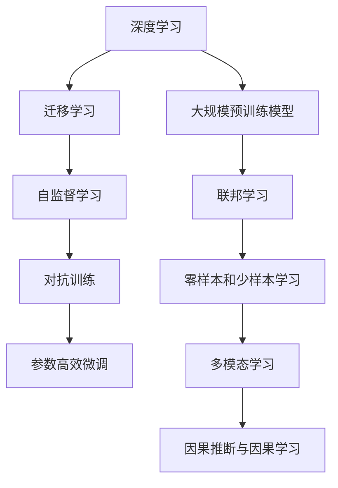

                 

# AI领域的最新技术进展

## 1. 背景介绍

### 1.1 问题由来

近年来，人工智能技术迅速发展，逐步渗透到各个行业和领域。从最初的专家系统、神经网络，到深度学习、生成对抗网络(GANs)，再到今天的深度强化学习、大规模预训练模型，技术不断进步，应用领域也不断扩大。在这一过程中，AI领域涌现出了许多新的技术和算法，使得AI系统变得更加强大和智能。

### 1.2 问题核心关键点

当前AI领域的研究热点主要集中在以下几个方面：

1. **深度学习模型的优化**：如迁移学习、自监督学习、对抗训练、参数高效微调等方法，使得模型可以在更少的标注数据上取得优异性能。
2. **大规模预训练模型**：如GPT-3、BERT等模型，通过在大规模无标签数据上进行预训练，学习到丰富的语言知识和表示能力。
3. **强化学习与决策优化**：通过智能体与环境交互，学习最优策略，应用于游戏、机器人等领域。
4. **联邦学习与隐私保护**：在不共享原始数据的情况下，通过模型参数的联合训练，实现分布式协作。
5. **零样本和少样本学习**：利用大模型的先验知识，通过提示学习等方法，在少量或零样本情况下，生成高质量的输出。
6. **多模态学习**：结合视觉、音频、文本等多模态数据，提高模型对现实世界的理解能力。
7. **因果推断与因果学习**：通过引入因果关系，提高模型的鲁棒性和可靠性。

这些核心技术相互交织，共同推动了AI领域的快速发展。本文将对其中的几个关键技术进行深入探讨，并给出相应的项目实践案例，以帮助读者更好地理解和使用这些前沿技术。

## 2. 核心概念与联系

### 2.1 核心概念概述

1. **深度学习**：通过多层神经网络结构，自动学习输入和输出之间的关系。
2. **迁移学习**：利用已有的知识，在新任务上进行学习，减少标注数据的依赖。
3. **自监督学习**：利用数据的固有结构，如掩码语言模型、自回归模型等，进行无监督学习。
4. **对抗训练**：通过引入对抗样本，提高模型的鲁棒性和泛化能力。
5. **参数高效微调**：只调整模型中少量的参数，减少计算资源消耗。
6. **大规模预训练模型**：通过在大规模数据集上进行预训练，学习到丰富的语言知识和表示能力。
7. **联邦学习**：在不共享原始数据的情况下，通过模型参数的联合训练，实现分布式协作。
8. **零样本和少样本学习**：利用大模型的先验知识，通过提示学习等方法，在少量或零样本情况下，生成高质量的输出。
9. **多模态学习**：结合视觉、音频、文本等多模态数据，提高模型对现实世界的理解能力。
10. **因果推断与因果学习**：通过引入因果关系，提高模型的鲁棒性和可靠性。

### 2.2 概念间的关系

这些核心概念之间存在着紧密的联系，形成了AI技术的完整生态系统。以下通过几个Mermaid流程图来展示这些概念之间的关系：

这些核心概念之间相互作用，共同构成了AI技术的发展脉络。通过理解这些概念及其关系，我们可以更好地把握AI技术的演进方向和应用潜力。

## 3. 核心算法原理 & 具体操作步骤

### 3.1 算法原理概述

#### 3.1.1 深度学习模型

深度学习模型通过多层神经网络结构，自动学习输入和输出之间的关系。其核心思想是通过大量数据训练，使得模型能够捕捉输入数据的复杂结构和特征。深度学习模型的训练过程通常包括前向传播、损失计算、反向传播和参数更新等步骤。

#### 3.1.2 迁移学习

迁移学习是一种利用已有知识，在新任务上进行学习的方法。其核心思想是通过将预训练模型作为初始化参数，在新任务上微调模型参数，从而减少对标注数据的依赖，提高模型的泛化能力。

#### 3.1.3 自监督学习

自监督学习是一种无监督学习方法，利用数据的固有结构进行学习。其核心思想是通过数据自身的规律，如掩码语言模型、自回归模型等，自动生成学习任务，使得模型能够在没有标注数据的情况下进行学习。

#### 3.1.4 对抗训练

对抗训练是一种通过引入对抗样本，提高模型鲁棒性和泛化能力的方法。其核心思想是在训练过程中，增加对抗性样本的训练，使得模型能够更好地处理输入数据中的噪声和干扰。

#### 3.1.5 参数高效微调

参数高效微调是一种只调整模型中少量参数的方法，以减少计算资源消耗。其核心思想是在微调过程中，冻结预训练模型的某些层，只更新顶层或少量的参数，从而在保持模型整体性能的同时，降低微调的开销。

#### 3.1.6 大规模预训练模型

大规模预训练模型通过在大规模数据集上进行预训练，学习到丰富的语言知识和表示能力。其核心思想是通过大规模数据集进行训练，使得模型能够捕捉语言的通用规律和特征，从而在新任务上表现更好。

#### 3.1.7 联邦学习

联邦学习是一种在不共享原始数据的情况下，通过模型参数的联合训练，实现分布式协作的方法。其核心思想是多个节点在不共享数据的情况下，通过联合优化模型参数，实现模型训练和更新。

#### 3.1.8 零样本和少样本学习

零样本和少样本学习是一种利用大模型的先验知识，通过提示学习等方法，在少量或零样本情况下，生成高质量的输出。其核心思想是在没有标注数据的情况下，通过大模型的先验知识，生成提示信息，引导模型生成合理输出。

#### 3.1.9 多模态学习

多模态学习是一种结合视觉、音频、文本等多模态数据，提高模型对现实世界的理解能力的方法。其核心思想是利用不同模态的数据，丰富模型的特征表示，从而提高模型的性能和泛化能力。

#### 3.1.10 因果推断与因果学习

因果推断与因果学习是一种通过引入因果关系，提高模型鲁棒性和可靠性的方法。其核心思想是在模型训练和推理过程中，考虑输入和输出之间的因果关系，从而提高模型的预测能力和稳定性。

### 3.2 算法步骤详解

#### 3.2.1 深度学习模型的训练

1. **数据准备**：收集和处理数据集，分为训练集、验证集和测试集。
2. **模型选择**：选择合适的深度学习模型，如卷积神经网络(CNN)、循环神经网络(RNN)、变压器(Transformer)等。
3. **模型训练**：使用训练集对模型进行前向传播、损失计算、反向传播和参数更新。
4. **模型评估**：使用验证集和测试集评估模型性能，选择合适的超参数。
5. **模型保存**：保存训练好的模型，方便后续使用。

#### 3.2.2 迁移学习的微调

1. **数据准备**：收集和处理新任务的标注数据集。
2. **模型选择**：选择合适的预训练模型，如BERT、GPT-3等。
3. **微调参数**：在新任务上微调模型参数，通常使用较小的学习率。
4. **模型评估**：在新任务上评估模型性能，调整超参数。
5. **模型保存**：保存微调后的模型，方便后续使用。

#### 3.2.3 自监督学习的训练

1. **数据准备**：收集和处理自监督学习的训练数据。
2. **模型选择**：选择合适的自监督学习模型，如掩码语言模型、自回归模型等。
3. **模型训练**：在自监督任务上训练模型，学习模型的潜在表示。
4. **模型评估**：在自监督任务上评估模型性能，调整超参数。
5. **模型保存**：保存训练好的模型，方便后续使用。

#### 3.2.4 对抗训练的优化

1. **数据准备**：收集和处理对抗性样本数据集。
2. **模型选择**：选择合适的对抗性样本生成方法，如FGSM、PGD等。
3. **对抗样本生成**：生成对抗性样本，增加训练集。
4. **模型训练**：在对抗性样本上训练模型，增加模型鲁棒性。
5. **模型评估**：在测试集上评估模型性能，调整超参数。
6. **模型保存**：保存训练好的模型，方便后续使用。

#### 3.2.5 参数高效微调的优化

1. **数据准备**：收集和处理新任务的标注数据集。
2. **模型选择**：选择合适的预训练模型，如BERT、GPT-3等。
3. **微调参数**：在新任务上微调模型参数，通常冻结预训练模型的某些层。
4. **模型评估**：在新任务上评估模型性能，调整超参数。
5. **模型保存**：保存微调后的模型，方便后续使用。

#### 3.2.6 大规模预训练模型的训练

1. **数据准备**：收集和处理大规模数据集。
2. **模型选择**：选择合适的预训练模型，如BERT、GPT-3等。
3. **模型训练**：在大规模数据集上训练模型，学习丰富的语言知识和表示能力。
4. **模型评估**：在测试集上评估模型性能，调整超参数。
5. **模型保存**：保存训练好的模型，方便后续使用。

#### 3.2.7 联邦学习的优化

1. **数据准备**：收集和处理各节点的数据集。
2. **模型选择**：选择合适的联邦学习算法，如FedAvg、FedMix等。
3. **模型训练**：在各节点上训练模型，通过联合优化模型参数。
4. **模型评估**：在测试集上评估模型性能，调整超参数。
5. **模型保存**：保存训练好的模型，方便后续使用。

#### 3.2.8 零样本和少样本学习的优化

1. **数据准备**：收集和处理零样本或少样本任务的数据集。
2. **模型选择**：选择合适的预训练模型，如BERT、GPT-3等。
3. **生成提示**：根据任务生成提示信息，引导模型生成合理输出。
4. **模型训练**：在提示信息下训练模型，生成高质量的输出。
5. **模型评估**：在测试集上评估模型性能，调整超参数。
6. **模型保存**：保存训练好的模型，方便后续使用。

#### 3.2.9 多模态学习的优化

1. **数据准备**：收集和处理多模态数据集。
2. **模型选择**：选择合适的多模态学习模型，如MM-Transformer等。
3. **模型训练**：在多模态数据集上训练模型，学习多模态特征表示。
4. **模型评估**：在测试集上评估模型性能，调整超参数。
5. **模型保存**：保存训练好的模型，方便后续使用。

#### 3.2.10 因果推断与因果学习的优化

1. **数据准备**：收集和处理因果数据集。
2. **模型选择**：选择合适的因果推断模型，如CausalGraphNet等。
3. **模型训练**：在因果数据集上训练模型，学习因果关系。
4. **模型评估**：在测试集上评估模型性能，调整超参数。
5. **模型保存**：保存训练好的模型，方便后续使用。

### 3.3 算法优缺点

#### 3.3.1 深度学习模型

优点：
1. 能够自动学习输入和输出之间的关系。
2. 能够处理高维度数据。
3. 在大规模数据上表现优异。

缺点：
1. 需要大量标注数据。
2. 容易过拟合。
3. 训练和推理计算量大。

#### 3.3.2 迁移学习

优点：
1. 能够利用已有知识，减少标注数据的依赖。
2. 能够提高模型的泛化能力。
3. 能够加快模型训练速度。

缺点：
1. 需要选择合适的预训练模型。
2. 微调过程中容易破坏预训练权重。
3. 微调数据量不足时效果可能不佳。

#### 3.3.3 自监督学习

优点：
1. 不需要标注数据。
2. 能够利用数据的固有结构进行学习。
3. 能够学习到模型的潜在表示。

缺点：
1. 自监督任务设计复杂。
2. 需要大量计算资源。
3. 难以评估模型性能。

#### 3.3.4 对抗训练

优点：
1. 能够提高模型的鲁棒性。
2. 能够提高模型的泛化能力。
3. 能够避免过拟合。

缺点：
1. 需要生成对抗样本。
2. 对抗样本生成复杂。
3. 可能增加计算成本。

#### 3.3.5 参数高效微调

优点：
1. 能够减少计算资源消耗。
2. 能够保持预训练模型的整体性能。
3. 能够提高微调效率。

缺点：
1. 微调数据量不足时效果可能不佳。
2. 可能影响模型泛化能力。
3. 需要冻结预训练模型的某些层。

#### 3.3.6 大规模预训练模型

优点：
1. 能够学习到丰富的语言知识和表示能力。
2. 能够在多个任务上表现优异。
3. 能够在少样本情况下表现良好。

缺点：
1. 需要大量计算资源。
2. 训练和推理计算量大。
3. 可能存在数据偏差。

#### 3.3.7 联邦学习

优点：
1. 能够在不共享原始数据的情况下进行分布式协作。
2. 能够保护用户隐私。
3. 能够提高模型的泛化能力。

缺点：
1. 需要各节点协同工作。
2. 需要选择合适的联邦学习算法。
3. 可能存在通信开销。

#### 3.3.8 零样本和少样本学习

优点：
1. 能够在少量或零样本情况下生成高质量的输出。
2. 能够利用大模型的先验知识。
3. 能够减少标注数据的需求。

缺点：
1. 需要合适的提示信息。
2. 可能存在输出质量不稳定。
3. 需要选择合适的预训练模型。

#### 3.3.9 多模态学习

优点：
1. 能够结合多种模态数据进行学习。
2. 能够提高模型对现实世界的理解能力。
3. 能够提高模型的泛化能力。

缺点：
1. 需要处理多模态数据的复杂性。
2. 需要合适的多模态模型。
3. 可能存在数据偏差。

#### 3.3.10 因果推断与因果学习

优点：
1. 能够提高模型的鲁棒性和可靠性。
2. 能够处理因果关系复杂的数据。
3. 能够提高模型的预测能力。

缺点：
1. 需要合适的因果推断模型。
2. 需要处理因果关系的复杂性。
3. 可能存在因果关系难以建模的问题。

### 3.4 算法应用领域

这些核心算法在AI领域有着广泛的应用，以下列举几个典型的应用场景：

#### 3.4.1 图像识别

图像识别是深度学习领域的重要应用之一，广泛应用于医疗、安防、自动驾驶等领域。深度学习模型可以通过训练学习到图像特征，实现对图像的分类、分割、检测等任务。

#### 3.4.2 自然语言处理

自然语言处理是AI领域的重要分支，包括文本分类、情感分析、机器翻译、对话系统等任务。深度学习模型可以通过训练学习到文本特征，实现对文本的分类、情感分析、翻译、对话生成等任务。

#### 3.4.3 语音识别

语音识别是AI领域的重要应用之一，广泛应用于智能助手、语音控制、语音翻译等领域。深度学习模型可以通过训练学习到语音特征，实现对语音的识别、翻译等任务。

#### 3.4.4 机器人控制

机器人控制是AI领域的重要应用之一，广泛应用于工业自动化、家庭服务、教育娱乐等领域。深度学习模型可以通过训练学习到机器人行为，实现对机器人的控制和调度。

#### 3.4.5 推荐系统

推荐系统是AI领域的重要应用之一，广泛应用于电商、社交媒体、新闻推荐等领域。深度学习模型可以通过训练学习到用户行为特征，实现对用户兴趣的推荐。

#### 3.4.6 游戏AI

游戏AI是AI领域的重要应用之一，广泛应用于游戏开发、游戏优化等领域。深度学习模型可以通过训练学习到游戏策略，实现对游戏角色的控制和优化。

## 4. 数学模型和公式 & 详细讲解 & 举例说明

### 4.1 数学模型构建

#### 4.1.1 深度学习模型

深度学习模型通常由多个神经网络层组成，每层包含多个神经元，神经元之间通过连接权重进行信息传递。模型的输入是原始数据，输出是预测结果。模型通过反向传播算法训练，最小化损失函数，从而优化模型参数。

#### 4.1.2 迁移学习

迁移学习通常包括预训练模型和微调模型两部分。预训练模型在大量数据上进行训练，学习到通用的特征表示。微调模型在目标任务上进行微调，通过较小的学习率更新模型参数，从而适应新任务。

#### 4.1.3 自监督学习

自监督学习通常包括自监督任务和模型训练两部分。自监督任务是利用数据的固有结构进行设计的，如掩码语言模型、自回归模型等。模型通过自监督任务进行训练，学习到模型的潜在表示。

#### 4.1.4 对抗训练

对抗训练通常包括对抗性样本生成和模型训练两部分。对抗性样本是利用对抗攻击算法生成的，可以欺骗模型。模型通过对抗性样本进行训练，学习到鲁棒性特征表示。

#### 4.1.5 参数高效微调

参数高效微调通常包括微调模型和冻结预训练模型两部分。微调模型在目标任务上进行微调，通过较小的学习率更新模型参数。冻结预训练模型的某些层，只更新顶层或少量的参数，从而减少计算资源消耗。

#### 4.1.6 大规模预训练模型

大规模预训练模型通常由大量的数据集和深度神经网络组成。模型通过在大规模数据集上进行预训练，学习到丰富的语言知识和表示能力。

#### 4.1.7 联邦学习

联邦学习通常包括模型训练和模型评估两部分。模型在多个节点上进行训练，通过联合优化模型参数。模型在测试集上进行评估，调整超参数。

#### 4.1.8 零样本和少样本学习

零样本和少样本学习通常包括提示生成和模型训练两部分。提示生成是利用大模型的先验知识生成提示信息，引导模型生成合理输出。模型通过提示信息进行训练，生成高质量的输出。

#### 4.1.9 多模态学习

多模态学习通常包括多模态数据集和模型训练两部分。多模态数据集是结合视觉、音频、文本等多种模态的数据进行构建的。模型通过多模态数据集进行训练，学习到多模态特征表示。

#### 4.1.10 因果推断与因果学习

因果推断与因果学习通常包括因果数据集和模型训练两部分。因果数据集是包含因果关系的标注数据。模型通过因果数据集进行训练，学习到因果关系特征表示。

### 4.2 公式推导过程

#### 4.2.1 深度学习模型

深度学习模型的训练过程可以表示为：
$$
\theta = \arg\min_{\theta} \frac{1}{N}\sum_{i=1}^N \ell(y_i,f(x_i;\theta))
$$
其中，$\theta$是模型参数，$\ell$是损失函数，$f(x_i;\theta)$是模型的预测结果。

#### 4.2.2 迁移学习

迁移学习的微调过程可以表示为：
$$
\theta = \arg\min_{\theta} \frac{1}{N}\sum_{i=1}^N \ell(y_i,f(x_i;\theta))
$$
其中，$\theta$是微调后的模型参数，$\ell$是损失函数，$f(x_i;\theta)$是微调后的模型预测结果。

#### 4.2.3 自监督学习

自监督学习的训练过程可以表示为：
$$
\theta = \arg\min_{\theta} \frac{1}{N}\sum_{i=1}^N \ell(\hat{y_i},y_i)
$$
其中，$\theta$是模型参数，$\ell$是损失函数，$\hat{y_i}$是模型的预测结果，$y_i$是真实结果。

#### 4.2.4 对抗训练

对抗训练的优化过程可以表示为：
$$
\theta = \arg\min_{\theta} \frac{1}{N}\sum_{i=1}^N \ell(y_i,f(x_i+\delta;\theta))
$$
其中，$\theta$是模型参数，$\ell$是损失函数，$f(x_i+\delta;\theta)$是对抗性样本的预测结果。

#### 4.2.5 参数高效微调

参数高效微调的过程可以表示为：
$$
\theta = \arg\min_{\theta} \frac{1}{N}\sum_{i=1}^N \ell(y_i,f(x_i;\theta))
$$
其中，$\theta$是微调后的模型参数，$\ell$是损失函数，$f(x_i;\theta)$是微调后的模型预测结果。

#### 4.2.6 大规模预训练模型

大规模预训练模型的训练过程可以表示为：
$$
\theta = \arg\min_{\theta} \frac{1}{N}\sum_{i=1}^N \ell(y_i,f(x_i;\theta))
$$
其中，$\theta$是预训练模型参数，$\ell$是损失函数，$f(x_i;\theta)$是预训练模型的预测结果。

#### 4.2.7 联邦学习

联邦学习的优化过程可以表示为：
$$
\theta = \arg\min_{\theta} \frac{1}{N}\sum_{i=1}^N \ell(y_i,f(x_i;\theta))
$$
其中，$\theta$是联邦学习后的模型参数，$\ell$是损失函数，$f(x_i;\theta)$是联邦学习后的模型预测结果。

#### 4.2.8 零样本和少样本学习

零样本和少样本学习的生成过程可以表示为：
$$
\hat{y} = f(x;\theta)
$$
其中，$\hat{y}$是模型的预测结果，$f(x;\theta)$是模型的生成结果。

#### 4.2.9 多模态学习

多模态学习的训练过程可以表示为：
$$
\theta = \arg\min_{\theta} \frac{1}{N}\sum_{i=1}^N \ell(y_i,f(x_i;\theta))
$$
其中，$\theta$是多模态模型参数，$\ell$是损失函数，$f(x_i;\theta)$是多模态模型的预测结果。

#### 4.2.10 因果推断与因果学习

因果推断与因果学习的训练过程可以表示为：
$$
\theta = \arg\min_{\theta} \frac{1}{N}\sum_{i=1}^N \ell(y_i,f(x_i;\theta))
$$
其中，$\theta$是因果模型参数，$\ell$是损失函数，$f(x_i;\theta)$是因果模型的预测结果。

### 4.3 案例分析与讲解

#### 4.3.1 图像识别

图像识别是深度学习领域的重要应用之一，广泛应用于医疗、安防、自动驾驶等领域。例如，在医疗领域，可以通过深度学习模型对医学影像进行分类、分割、检测等任务。

#### 4.3.2 自然语言处理

自然语言处理是AI领域的重要分支，包括文本分类、情感分析、机器翻译、对话系统等任务。例如，在情感分析任务中，可以通过深度学习模型对用户评论进行情感分类，从而实现舆情监测和客户满意度分析。

#### 4.3.3 语音识别

语音识别是AI领域的重要应用之一，广泛应用于智能助手、语音控制、语音翻译等领域。例如，在智能助手中，可以通过深度学习模型对语音进行识别，实现语音指令和自然对话。

#### 4.3.4 机器人控制

机器人控制是AI领域的重要应用之一，广泛应用于工业自动化、家庭服务、教育娱乐等领域。例如，在工业自动化中，可以通过深度学习模型对机器人进行行为控制和调度，实现自动化生产线。

#### 4.3.5 推荐系统

推荐系统是AI领域的重要应用之一，广泛应用于电商、社交媒体、新闻推荐等领域。例如，在电商推荐系统中，可以通过深度学习模型对用户行为进行分析和推荐，实现个性化推荐。

#### 4.3.6 游戏AI

游戏AI是AI领域的重要应用之一，广泛应用于游戏开发、游戏优化等领域。例如，在游戏开发中，可以通过深度学习模型对游戏角色进行智能控制和优化，实现游戏AI。

## 5. 项目实践：代码实例和详细解释说明

### 5.1 开发环境搭建

在进行深度学习项目实践时，首先需要搭建开发环境。以下是使用Python进行TensorFlow开发的环境配置流程：

1. 安装Anaconda：从官网下载并安装Anaconda，用于创建

