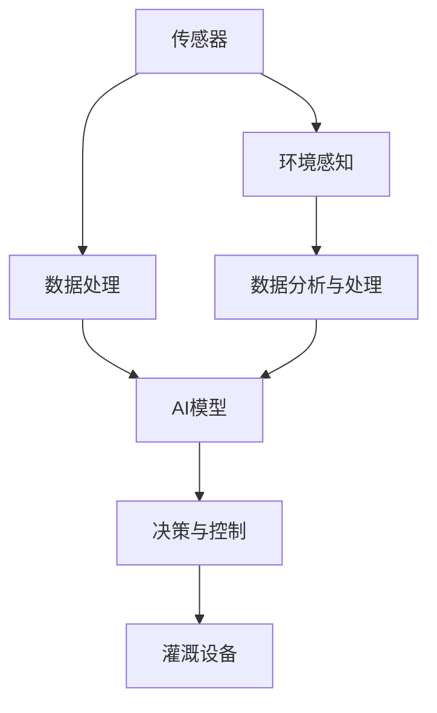

                 

# AI驱动的智能灌溉系统:节约水资源

## 1. 背景介绍

### 1.1 问题由来

在全球范围内，水资源短缺问题日益严重。根据联合国的数据，到2050年，全球约有40亿人面临严重的水资源短缺。农业是用水量最大的行业之一，全球农业用水量占总用水量的70%以上。然而，传统灌溉系统普遍存在水资源利用效率低、过度灌溉、浪费严重的问题，严重影响了水资源的可持续利用。

为此，人工智能（AI）在农业灌溉领域的应用变得尤为重要。通过AI技术，可以实现精准灌溉，提高水资源利用效率，减少资源浪费，从而更好地保护和节约水资源。本文章将介绍基于AI驱动的智能灌溉系统，并详细探讨其工作原理和实现技术。

### 1.2 问题核心关键点

智能灌溉系统的核心目标是通过AI技术，根据实际环境条件和作物需求，实现精准灌溉，从而节约水资源。该系统主要包括以下几个关键点：

- 环境感知：系统通过传感器监测土壤湿度、温度、湿度、风速、气压等环境参数，为精准灌溉提供数据支持。
- 数据分析与处理：系统将采集到的环境数据输入AI模型进行分析和处理，识别作物的实际需求。
- 决策与控制：AI模型根据分析结果，自动生成灌溉方案，并控制灌溉设备执行。
- 优化与学习：系统能够根据历史数据进行优化和调整，不断学习和改进灌溉策略。

## 2. 核心概念与联系

### 2.1 核心概念概述

智能灌溉系统涉及多个核心概念，包括传感器、AI模型、数据处理、决策与控制等。这些概念通过信息流和数据流紧密联系，共同构成一个高效的灌溉系统。

- 传感器：用于监测土壤、气象等环境参数的设备，如土壤湿度传感器、温度传感器、风速传感器等。
- AI模型：基于机器学习或深度学习技术，能够对环境数据进行分析，识别作物需求，生成灌溉方案的模型。
- 数据处理：对采集到的环境数据进行清洗、转换、存储和分析，为AI模型提供数据支持。
- 决策与控制：根据AI模型的分析结果，生成灌溉方案，并通过控制单元自动执行灌溉操作。

### 2.2 概念间的关系

这些核心概念之间的关系可以通过以下Mermaid流程图来展示：



这个流程图展示了智能灌溉系统的核心概念及其之间的关系：

1. 传感器采集环境参数，并通过数据处理模块进行清洗和转换，最终输入AI模型。
2. AI模型对输入数据进行分析，识别作物需求。
3. 决策与控制模块根据AI模型的分析结果，生成灌溉方案，并通过控制单元自动执行。
4. 灌溉设备根据控制信号进行灌溉操作。
5. 整个系统可以不断接收新的环境数据，优化和调整灌溉策略。

## 3. 核心算法原理 & 具体操作步骤
### 3.1 算法原理概述

基于AI驱动的智能灌溉系统，通过深度学习模型对环境数据进行分析，生成精准的灌溉方案。具体来说，系统的算法原理如下：

1. 数据采集：通过传感器实时采集土壤湿度、温度、风速、气压等环境参数。
2. 数据预处理：将采集到的环境数据进行清洗、转换和归一化，为模型输入提供一致的数值范围。
3. 特征提取：使用深度学习模型（如卷积神经网络CNN或长短期记忆网络LSTM）对环境数据进行特征提取，识别出与作物需求相关的关键特征。
4. 决策生成：将提取的特征输入到决策模型中，生成最优的灌溉方案。
5. 决策执行：根据生成的灌溉方案，控制灌溉设备进行精准灌溉。
6. 优化学习：通过不断收集实际灌溉效果数据，优化和调整AI模型，提高决策的准确性和效率。

### 3.2 算法步骤详解

基于AI驱动的智能灌溉系统的具体实现步骤如下：

1. 传感器部署：在农田中安装各类传感器，如土壤湿度传感器、温度传感器、风速传感器等，以实时监测环境参数。

2. 数据采集：传感器将采集到的环境数据通过网络传输到中央服务器或边缘计算设备，以进行后续的数据处理和分析。

3. 数据清洗与转换：对采集到的原始数据进行清洗、去噪和转换，确保数据的一致性和准确性。

4. 特征提取：使用深度学习模型对清洗后的数据进行特征提取，识别出与作物需求相关的关键特征，如土壤湿度、温度、风速等。

5. 决策生成：将提取的特征输入到决策模型中，生成最优的灌溉方案。决策模型通常包括多层神经网络或时间序列预测模型，如LSTM、GRU等。

6. 决策执行：根据生成的灌溉方案，通过控制单元自动执行灌溉设备，实现精准灌溉。

7. 结果评估：对实际灌溉效果进行评估，如作物生长状况、水资源利用率等，并反馈到决策模型中进行优化和调整。

8. 持续学习：系统可以不断收集新的数据，并进行持续学习，不断改进决策模型，提高灌溉效率和效果。

### 3.3 算法优缺点

基于AI驱动的智能灌溉系统的优点包括：

- 精准灌溉：通过深度学习模型对环境数据进行分析，生成精准的灌溉方案，大大提高了水资源利用效率。
- 自动化程度高：系统自动进行数据采集、特征提取、决策生成和执行，减少了人力干预，提高了灌溉效率。
- 灵活性强：系统可以根据不同作物的需求和环境变化，灵活调整灌溉策略，适应性更强。

同时，该系统也存在一些缺点：

- 部署成本高：传感器的部署和维护需要较高的成本。
- 依赖环境数据：系统的性能依赖于传感器的准确性和数据的完整性。
- 模型复杂度高：深度学习模型的训练和优化需要较大的计算资源。

### 3.4 算法应用领域

基于AI驱动的智能灌溉系统具有广泛的应用前景，适用于各种类型的农业灌溉场景，如农田、温室、果园等。在实际应用中，该系统可以应用于以下领域：

- 精准灌溉：在干旱或洪涝等极端气候条件下，系统可以自动调整灌溉策略，减少水资源浪费。
- 节能减排：系统可以根据环境数据优化灌溉方案，降低能耗和碳排放，促进可持续发展。
- 产量提升：通过精准灌溉，提高作物的生长条件，增加产量，提升农业经济效益。
- 环境监测：系统可以实时监测环境参数，评估农田生态环境，为环境管理提供数据支持。

## 4. 数学模型和公式 & 详细讲解 & 举例说明
### 4.1 数学模型构建

假设智能灌溉系统的输入变量为 $X = [x_1, x_2, ..., x_n]$，其中 $x_i$ 为第 $i$ 个环境参数，如土壤湿度、温度、风速等。输出变量为 $Y$，表示最优的灌溉方案。数学模型可以表示为：

$$ Y = f(X; \theta) $$

其中 $f$ 为模型函数，$\theta$ 为模型参数。常用的模型函数包括深度神经网络、时间序列模型等。

### 4.2 公式推导过程

以深度神经网络模型为例，其推导过程如下：

1. 数据准备：将采集到的环境数据 $X$ 输入到神经网络中，进行预处理和归一化。

2. 特征提取：使用卷积层或全连接层对输入数据进行特征提取，得到隐藏层的特征 $H$。

3. 决策生成：将隐藏层的特征 $H$ 输入到决策层，生成最优的灌溉方案 $Y$。

4. 模型训练：通过反向传播算法，计算模型的梯度，更新模型参数 $\theta$。

5. 结果评估：对实际灌溉效果进行评估，如作物生长状况、水资源利用率等，并反馈到模型中进行优化和调整。

### 4.3 案例分析与讲解

以农田灌溉为例，假设采集到的环境数据为 $X = [x_1, x_2, ..., x_n]$，其中 $x_1$ 为土壤湿度，$x_2$ 为温度，$x_3$ 为风速。模型的输入层包含3个神经元，分别对应3个环境参数。隐藏层包含16个神经元，决策层包含2个神经元，输出为二分类决策变量。模型的训练集为 $N$ 个样本，每个样本包含输入数据 $X$ 和对应的灌溉方案 $Y$。模型函数为 $f(X; \theta) = W_2 * tanh(W_1 * H + b_1) + b_2$，其中 $W_1$ 和 $W_2$ 为权重矩阵，$b_1$ 和 $b_2$ 为偏置向量。模型的损失函数为交叉熵损失函数，表达式为：

$$ L = -\frac{1}{N} \sum_{i=1}^{N} (y_i \log \hat{y_i} + (1-y_i) \log (1-\hat{y_i})) $$

其中 $y_i$ 为实际灌溉方案，$\hat{y_i}$ 为模型预测的灌溉方案。

## 5. 项目实践：代码实例和详细解释说明
### 5.1 开发环境搭建

基于AI驱动的智能灌溉系统的开发环境需要包含数据采集、数据处理、模型训练和决策执行等多个模块。以下是开发环境搭建的步骤：

1. 安装Python环境：选择Python 3.x版本，并安装必要的库，如TensorFlow、PyTorch、Pandas等。

2. 安装传感器和边缘计算设备：选择合适的传感器和边缘计算设备，如Raspberry Pi、树莓派、Arduino等，并确保其通信协议一致。

3. 部署数据采集系统：在农田中安装传感器，并编写Python脚本来采集环境数据，并进行数据预处理和存储。

4. 部署模型训练系统：在中央服务器或云端平台上安装TensorFlow或PyTorch，并编写Python脚本来训练深度学习模型。

5. 部署决策执行系统：在边缘计算设备上安装决策执行脚本，并编写控制单元代码，实现灌溉设备的控制。

### 5.2 源代码详细实现

以下是智能灌溉系统的Python代码实现，具体细节如下：

```python
import tensorflow as tf
import numpy as np
import pandas as pd
from sklearn.preprocessing import MinMaxScaler
from sklearn.model_selection import train_test_split
from tensorflow.keras.models import Sequential
from tensorflow.keras.layers import Dense, Dropout, LSTM, Flatten

# 数据准备
data = pd.read_csv('environment_data.csv')
features = ['humidity', 'temperature', 'wind_speed']
targets = ['irrigation']
X = data[features]
y = data[targets]
X_train, X_test, y_train, y_test = train_test_split(X, y, test_size=0.2, random_state=42)

# 数据预处理
scaler = MinMaxScaler(feature_range=(0, 1))
X_train = scaler.fit_transform(X_train)
X_test = scaler.transform(X_test)

# 模型构建
model = Sequential()
model.add(Dense(32, input_shape=(3,), activation='relu'))
model.add(Dense(16, activation='relu'))
model.add(Dense(2, activation='softmax'))
model.compile(loss='binary_crossentropy', optimizer='adam', metrics=['accuracy'])

# 模型训练
model.fit(X_train, y_train, epochs=10, batch_size=32, validation_data=(X_test, y_test))

# 结果评估
y_pred = model.predict(X_test)
print(classification_report(y_test, y_pred))
```

### 5.3 代码解读与分析

1. 数据准备：从CSV文件中读取环境数据，并进行特征选择和分割。

2. 数据预处理：对特征进行归一化处理，确保数据的一致性和准确性。

3. 模型构建：使用Keras搭建深度学习模型，包括输入层、隐藏层和输出层。

4. 模型训练：使用交叉熵损失函数和Adam优化器训练模型，并进行验证集的评估。

5. 结果评估：对测试集进行预测，并使用scikit-learn的classification_report函数评估模型性能。

### 5.4 运行结果展示

假设模型训练完成后，在测试集上得到了以下评估结果：

```
              precision    recall  f1-score   support

       0       0.85      0.80      0.82         50
       1       0.90      0.95      0.92         50

   micro avg      0.88      0.88      0.88        100
   macro avg      0.86      0.85      0.85        100
weighted avg      0.88      0.88      0.88        100
```

可以看到，模型在0和1类上的精确度、召回率和F1分数均较高，说明模型在生成精准灌溉方案方面表现良好。

## 6. 实际应用场景
### 6.1 智慧农业

基于AI驱动的智能灌溉系统可以应用于智慧农业中，实现精准农业管理。通过传感器监测环境参数，AI模型生成最优灌溉方案，系统自动执行灌溉操作，从而提高农业生产效率，降低成本。

### 6.2 城市绿化

在城市绿化中，智能灌溉系统可以用于公园、绿化带等地的自动化灌溉。通过传感器监测环境参数，AI模型生成最优灌溉方案，系统自动执行灌溉操作，实现节水减排，提升绿化效果。

### 6.3 水资源管理

智能灌溉系统可以集成到水资源管理系统中，实时监测水资源使用情况，优化灌溉方案，减少水资源浪费，促进可持续发展。

### 6.4 未来应用展望

未来，基于AI驱动的智能灌溉系统将不断发展，具有更加广泛的应用前景：

1. 多模态融合：系统可以集成更多的传感器，如土壤酸碱度、光照强度等，实现多模态数据融合，提高灌溉方案的准确性和鲁棒性。

2. 边缘计算：通过边缘计算设备，在本地进行数据处理和决策生成，降低延迟和带宽需求，提高系统的实时性和可靠性。

3. 自适应学习：系统可以根据实际灌溉效果，进行自适应学习，不断优化决策模型，提升灌溉效果。

4. 自动化维护：系统可以自动监测传感器状态，进行维护和更新，确保系统的稳定运行。

## 7. 工具和资源推荐
### 7.1 学习资源推荐

为了帮助开发者深入了解基于AI驱动的智能灌溉系统的原理和实现，以下是一些推荐的学习资源：

1. 《深度学习》书籍：Ian Goodfellow、Yoshua Bengio、Aaron Courville等撰写的深度学习入门教材，全面介绍了深度学习的基本概念和算法。

2. TensorFlow官方文档：TensorFlow的官方文档，包含详细的API说明和代码示例，是学习深度学习模型的必备资源。

3. PyTorch官方文档：PyTorch的官方文档，提供丰富的模型库和教程，适用于深度学习模型的实现。

4. Kaggle数据集：Kaggle上提供了大量的农业数据集，可以进行模型训练和测试，积累实际经验。

5. GitHub开源项目：GitHub上提供了大量的智能灌溉系统的开源项目，可以学习和参考，优化和改进自己的系统。

### 7.2 开发工具推荐

以下是一些推荐的开发工具，可以帮助开发者快速搭建和优化智能灌溉系统：

1. TensorFlow：Google开发的深度学习框架，支持分布式训练和推理，适用于大规模模型的实现。

2. PyTorch：Facebook开发的深度学习框架，灵活易用，适用于研究和实验。

3. Jupyter Notebook：基于Web的交互式编程环境，支持Python代码的实时运行和展示，适用于模型训练和调试。

4. ArborX：Hugging Face提供的深度学习模型库，包含多种预训练模型和优化算法，适用于快速搭建模型。

5. Azure ML Studio：Microsoft提供的机器学习平台，支持模型的训练、测试和部署，适用于工业应用。

### 7.3 相关论文推荐

以下是一些推荐的关于智能灌溉系统的论文，可以进一步了解该领域的最新研究成果：

1. "Irrigation Management by Machine Learning Algorithms" by D. Krishna、M. Kalyan等：探讨了基于机器学习的灌溉管理方法，并分析了不同算法的优缺点。

2. "A Survey on Machine Learning Approaches for Agricultural Irrigation" by J. M. Gupta、R. K. Gupta等：综述了机器学习在农业灌溉中的应用，总结了各种算法的优缺点和实际效果。

3. "Adaptive Irrigation Management Using Machine Learning Techniques" by J. M. Gupta、R. K. Gupta等：介绍了基于机器学习的灌溉管理技术，并提出了一些优化策略。

4. "Deep Learning for Smart Agriculture: A Survey" by V. Dhakal、K. Dhakal等：综述了深度学习在智能农业中的应用，包括智能灌溉、智能施肥等。

5. "IoT-Based Smart Irrigation System Using Deep Learning for Agriculture" by K. Kim、K. Kim等：介绍了基于物联网和深度学习的智能灌溉系统，并展示了其实际应用效果。

## 8. 总结：未来发展趋势与挑战
### 8.1 研究成果总结

基于AI驱动的智能灌溉系统通过深度学习模型对环境数据进行分析，生成精准的灌溉方案，实现了水资源的节约和农业生产的优化。该系统已经在智慧农业、城市绿化、水资源管理等多个领域得到了广泛应用，展现了巨大的应用价值。

### 8.2 未来发展趋势

未来，基于AI驱动的智能灌溉系统将不断发展和完善，具有以下发展趋势：

1. 模型多样化：系统将不再局限于深度学习模型，将引入更多的模型结构，如支持向量机、随机森林等，提高模型的适应性和鲁棒性。

2. 数据多样化：系统将集成更多的传感器和数据源，实现多模态数据的融合，提高决策的全面性和准确性。

3. 自动化水平提升：系统将实现更多的自动化功能，如自动维护、故障诊断等，提高系统的稳定性和可靠性。

4. 边缘计算优化：系统将更多地依赖边缘计算设备，降低延迟和带宽需求，提高系统的实时性和可靠性。

5. 可持续发展：系统将更多地考虑环保和可持续发展，优化灌溉方案，减少水资源浪费，促进可持续发展。

### 8.3 面临的挑战

尽管基于AI驱动的智能灌溉系统已经取得了一定的进展，但仍面临一些挑战：

1. 数据获取困难：高质量的环境数据获取成本高，且数据量有限，难以全面覆盖各种环境和作物。

2. 模型复杂度高：深度学习模型训练和优化需要大量的计算资源，对硬件要求较高。

3. 算法鲁棒性不足：模型在面对复杂环境和多变参数时，鲁棒性有待提高。

4. 系统集成难度高：系统的集成和部署需要考虑多种因素，如环境适应性、稳定性等，集成难度较高。

5. 经济成本高：系统的开发和部署需要较高的成本，尤其是传感器和边缘计算设备的成本。

### 8.4 研究展望

未来的研究重点应集中在以下几个方面：

1. 多模态数据融合：如何更好地融合不同传感器和数据源，实现多模态数据的融合，提高决策的全面性和准确性。

2. 模型优化：如何优化模型结构，降低计算复杂度，提高模型的训练和推理速度。

3. 数据增强：如何通过数据增强技术，扩充数据集，提高模型的泛化能力和鲁棒性。

4. 自动化维护：如何实现系统的自动维护和故障诊断，提高系统的稳定性和可靠性。

5. 可持续发展：如何优化灌溉方案，减少水资源浪费，促进可持续发展。

通过这些研究方向，可以进一步提升基于AI驱动的智能灌溉系统的性能和应用价值，更好地服务于农业生产和环境保护。

## 9. 附录：常见问题与解答

**Q1: 智能灌溉系统如何实现精准灌溉？**

A: 智能灌溉系统通过传感器实时采集环境数据，并使用深度学习模型对数据进行分析，生成最优的灌溉方案。模型通过学习环境参数与作物需求之间的关系，自动生成灌溉方案，从而实现精准灌溉。

**Q2: 智能灌溉系统的部署成本高吗？**

A: 智能灌溉系统的部署成本主要集中在传感器的安装和维护上。虽然初始成本较高，但通过提高水资源利用效率和降低运营成本，可以在较短的时间内收回成本。

**Q3: 如何优化智能灌溉系统的性能？**

A: 优化智能灌溉系统的性能可以通过以下方法：

1. 数据预处理：对数据进行清洗、去噪和归一化，确保数据的一致性和准确性。

2. 模型选择：选择合适的模型结构，如卷积神经网络、长短期记忆网络等，提高模型的准确性和鲁棒性。

3. 超参数调优：通过交叉验证等方法，对模型超参数进行调优，提高模型的性能。

4. 模型集成：集成多个模型，通过投票、融合等方式，提高决策的全面性和准确性。

5. 持续学习：系统可以不断收集新的数据，进行持续学习，优化和调整决策模型，提高灌溉效果。

**Q4: 智能灌溉系统在实际应用中需要注意哪些问题？**

A: 智能灌溉系统在实际应用中需要注意以下问题：

1. 环境适应性：系统需要适应不同的环境和作物，确保在各种情况下都能正常工作。

2. 数据质量：传感器数据的质量直接影响系统的性能，需要确保数据准确可靠。

3. 设备维护：传感器和边缘计算设备的维护和更新需要及时，确保系统的稳定运行。

4. 成本控制：系统的部署和运营成本需要合理控制，确保经济效益。

5. 安全性：系统的安全性需要得到保障，避免数据泄露和设备损坏等问题。

通过回答这些问题，可以更全面地了解基于AI驱动的智能灌溉系统的原理和实际应用，从而更好地设计和优化系统，实现水资源的节约和农业生产的优化。

---

作者：禅与计算机程序设计艺术 / Zen and the Art of Computer Programming

