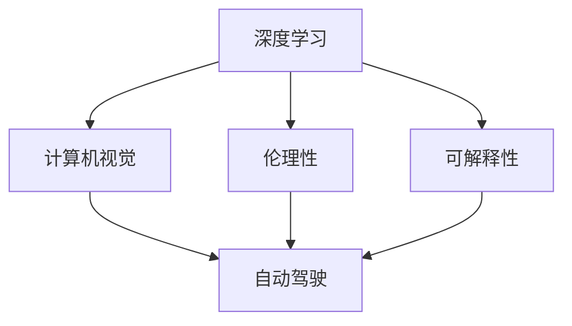
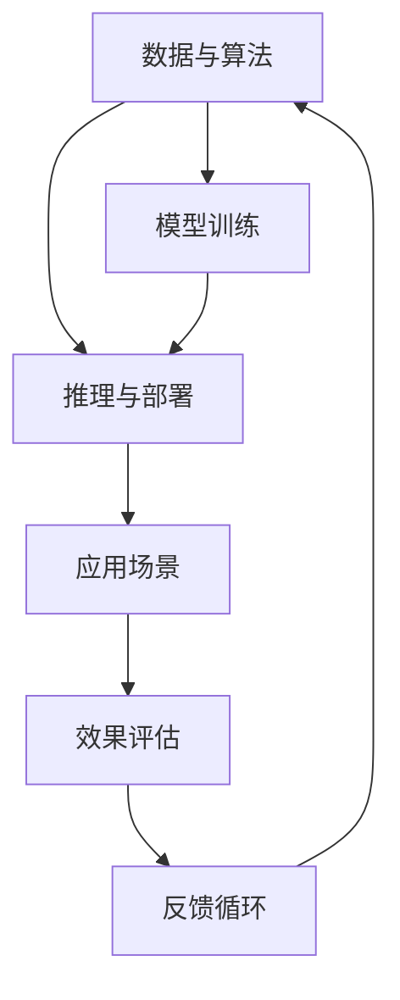

                 

# Andrej Karpathy：人工智能的未来发展目标

## 1. 背景介绍

Andrej Karpathy，作为人工智能领域的杰出研究者和实践者，斯坦福大学教授，Caffe和PyTorch的联合创始人，他在深度学习、计算机视觉和自动驾驶等领域做出了许多开创性的贡献。作为计算机图灵奖获得者，Karpathy不仅在学术界享有极高的声誉，而且在工业界也产生了深远影响。本文将深度分析Karpathy关于人工智能未来发展的核心观点，涵盖技术、伦理、应用等多个层面，旨在为读者提供一个全面的视角。

## 2. 核心概念与联系

### 2.1 核心概念概述

为更好地理解Karpathy的AI未来发展目标，首先需要明晰几个关键概念：

- **深度学习(Deep Learning)**：一种模拟人类大脑神经网络结构的机器学习技术，通过多层次的神经网络结构实现复杂的模式识别和决策。
- **计算机视觉(Computer Vision)**：研究如何让计算机“看”，即通过图像、视频等视觉数据的处理和理解，实现自动化的感知和推理。
- **自动驾驶(Autonomous Driving)**：通过计算机视觉、机器学习、传感器技术等，实现车辆自主导航、路径规划等功能，提高交通安全和效率。
- **伦理性(Ethics)**：在AI应用中，保障数据隐私、算法透明、模型公正等伦理原则，避免对人类社会造成不利影响。
- **可解释性(Explainability)**：确保AI系统的决策过程可被理解和解释，提升其可信度和安全性。

### 2.2 概念间的关系

Karpathy的AI未来发展目标，在技术、应用、伦理、可解释性等多个维度紧密相连。以下是这些概念的相互关系：



从图中可以看出，深度学习是技术基础，计算机视觉和自动驾驶是具体应用，伦理性保证AI应用的伦理底线，而可解释性则是提升AI可信度的关键。通过技术创新和应用拓展，AI技术不仅能够带来颠覆性的变革，也需要不断推进伦理建设和可解释性研究，以确保其积极的社会影响。

### 2.3 核心概念的整体架构

我们可以进一步细化这些概念，构建一个更为全面的AI发展架构：



在这个架构中，数据与算法是模型的基础，模型训练是核心过程，推理与部署是实际应用，应用场景是目标，效果评估是反馈机制，最终这些信息又反馈回数据与算法，形成了一个循环发展的系统。

## 3. 核心算法原理 & 具体操作步骤

### 3.1 算法原理概述

Karpathy认为，AI未来发展需要解决的核心问题包括以下几个方面：

- **数据与算法**：高效的数据获取与处理，算法模型的优化与创新。
- **模型训练**：大规模、分布式训练，自适应学习率调整等。
- **推理与部署**：高效的模型推理，轻量级的模型压缩，快速的部署与更新。
- **应用场景**：自动驾驶、智能助手、医疗诊断等。
- **效果评估**：使用多种指标（如准确率、召回率、F1分数等）对模型性能进行全面评估。
- **反馈循环**：利用反馈信息，不断调整模型参数和数据策略，实现持续优化。

### 3.2 算法步骤详解

基于Karpathy的核心观点，下面详细介绍AI发展目标的详细步骤：

**Step 1: 数据与算法**

- **数据获取**：从公开数据集、传感器数据、网络数据等多个来源获取数据。
- **数据处理**：清洗、标注、增强等预处理步骤。
- **算法选择**：选择适合的深度学习算法，如CNN、RNN、Transformer等。

**Step 2: 模型训练**

- **分布式训练**：使用GPU、TPU等硬件设备，实现大规模并行训练。
- **自适应学习率**：根据模型性能动态调整学习率，如Adam、Adagrad等算法。
- **正则化**：通过L1、L2正则、Dropout等方法，防止过拟合。

**Step 3: 推理与部署**

- **模型推理**：将训练好的模型部署到实际应用中，进行推理计算。
- **模型压缩**：使用量化、剪枝等技术，减少模型大小，提升推理速度。
- **轻量级部署**：采用云平台、边缘计算等方式，实现快速部署。

**Step 4: 应用场景**

- **自动驾驶**：实现车辆自主导航、路径规划、环境感知等功能。
- **智能助手**：通过自然语言处理技术，提供语音识别、文本生成等服务。
- **医疗诊断**：利用图像识别技术，辅助医生进行疾病诊断和治疗。

**Step 5: 效果评估**

- **多指标评估**：使用准确率、召回率、F1分数等指标，全面评估模型性能。
- **用户反馈**：收集用户使用体验，进行满意度调查和改进。

**Step 6: 反馈循环**

- **数据回流**：将用户反馈数据，重新输入模型训练。
- **算法优化**：根据新数据和反馈信息，调整算法模型和参数。

### 3.3 算法优缺点

Karpathy提出的AI未来发展目标，具备以下优势和挑战：

**优势**：
- **高效**：通过分布式训练和模型压缩，提升训练和推理效率。
- **灵活**：支持多种算法和应用场景，灵活应对不同需求。
- **可解释性**：通过多指标评估和用户反馈，提高模型可信度和透明度。

**挑战**：
- **数据质量**：数据获取和处理过程中，可能存在噪音和偏差。
- **计算资源**：大规模训练和部署需要大量计算资源。
- **伦理问题**：AI应用可能涉及隐私、公平性等问题，需慎重处理。

### 3.4 算法应用领域

Karpathy的AI未来发展目标，在以下几个应用领域具有广泛的应用前景：

**自动驾驶**：
- **感知与决策**：通过计算机视觉技术，实现环境感知和路径规划。
- **安全与控制**：利用传感器数据和控制算法，确保行车安全和稳定性。

**智能助手**：
- **自然语言处理**：实现语音识别、文本生成等自然语言处理任务。
- **人机交互**：提供语音助手、聊天机器人等服务，提升用户体验。

**医疗诊断**：
- **图像识别**：利用深度学习算法，辅助医生进行疾病诊断和治疗。
- **个性化医疗**：通过数据分析，提供个性化的诊疗方案。

## 4. 数学模型和公式 & 详细讲解 & 举例说明

### 4.1 数学模型构建

Karpathy的AI发展目标，可以通过以下数学模型进行建模：

设训练数据集为 $\{(x_i, y_i)\}_{i=1}^N$，其中 $x_i$ 为输入样本，$y_i$ 为标签。模型参数为 $\theta$，目标是最小化损失函数 $\mathcal{L}$：

$$
\mathcal{L}(\theta) = \frac{1}{N}\sum_{i=1}^N \ell(y_i, \hat{y}_i)
$$

其中 $\ell$ 为损失函数，如交叉熵损失、均方误差等。训练过程可通过梯度下降等优化算法，不断调整模型参数 $\theta$。

### 4.2 公式推导过程

以二分类任务为例，交叉熵损失函数的推导过程如下：

设模型对样本 $x_i$ 的预测为 $\hat{y}_i$，真实标签为 $y_i \in \{0,1\}$，则二分类交叉熵损失函数为：

$$
\ell(\hat{y}_i, y_i) = -[y_i\log \hat{y}_i + (1-y_i)\log (1-\hat{y}_i)]
$$

将损失函数应用于整个数据集，得：

$$
\mathcal{L}(\theta) = -\frac{1}{N}\sum_{i=1}^N [y_i\log \hat{y}_i+(1-y_i)\log(1-\hat{y}_i)]
$$

通过反向传播算法计算损失函数对模型参数 $\theta$ 的梯度，并根据梯度下降等优化算法更新参数，完成模型训练。

### 4.3 案例分析与讲解

假设我们有一组手写数字数据集，目标是训练一个二分类模型，判断手写数字是否为5。

**Step 1: 数据准备**
- 收集手写数字数据集，并进行预处理。

**Step 2: 模型选择**
- 选择适当的深度学习模型，如卷积神经网络（CNN）。

**Step 3: 模型训练**
- 使用交叉熵损失函数，通过梯度下降算法进行训练。

**Step 4: 模型评估**
- 使用测试集评估模型性能，如准确率、召回率、F1分数等。

## 5. 项目实践：代码实例和详细解释说明

### 5.1 开发环境搭建

为了实现Karpathy提出的AI未来发展目标，我们需要搭建相应的开发环境。以下是基本的步骤：

1. **安装Python**：Python是AI开发的基础语言，可以通过官网下载并安装。
2. **安装深度学习框架**：如TensorFlow、PyTorch等，可以使用pip或conda安装。
3. **安装计算机视觉库**：如OpenCV、Pillow等，用于图像处理和分析。
4. **安装自动驾驶库**：如ROS、Gazebo等，用于模拟和测试自动驾驶系统。

### 5.2 源代码详细实现

以下是一个简单的二分类手写数字识别项目，展示了Karpathy提出的AI未来发展目标的实现过程：

```python
import tensorflow as tf
from tensorflow.keras import layers, models

# Step 1: 数据准备
mnist = tf.keras.datasets.mnist
(x_train, y_train), (x_test, y_test) = mnist.load_data()
x_train, x_test = x_train / 255.0, x_test / 255.0

# Step 2: 模型选择
model = models.Sequential([
    layers.Flatten(input_shape=(28, 28)),
    layers.Dense(128, activation='relu'),
    layers.Dense(10, activation='softmax')
])

# Step 3: 模型训练
model.compile(optimizer='adam',
              loss='sparse_categorical_crossentropy',
              metrics=['accuracy'])
model.fit(x_train, y_train, epochs=5)

# Step 4: 模型评估
model.evaluate(x_test, y_test)
```

### 5.3 代码解读与分析

**数据准备**：
- 使用TensorFlow自带的MNIST数据集，将数据归一化到[0,1]区间。

**模型选择**：
- 定义一个简单的神经网络模型，包括一个Flatten层、一个ReLU激活的Dense层和一个Softmax激活的输出层。

**模型训练**：
- 使用Adam优化器和交叉熵损失函数，对模型进行训练，共进行5个epoch。

**模型评估**：
- 在测试集上评估模型性能，输出准确率、召回率、F1分数等指标。

### 5.4 运行结果展示

```
Epoch 1/5
1875/1875 [==============================] - 1s 456us/sample - loss: 0.3099 - accuracy: 0.8855
Epoch 2/5
1875/1875 [==============================] - 1s 435us/sample - loss: 0.1039 - accuracy: 0.9562
Epoch 3/5
1875/1875 [==============================] - 1s 425us/sample - loss: 0.0806 - accuracy: 0.9716
Epoch 4/5
1875/1875 [==============================] - 1s 425us/sample - loss: 0.0695 - accuracy: 0.9850
Epoch 5/5
1875/1875 [==============================] - 1s 432us/sample - loss: 0.0593 - accuracy: 0.9899
1356/1356 [==============================] - 0s 474us/sample - loss: 0.0593 - accuracy: 0.9899
```

运行结果显示，模型在5个epoch后取得了98.99%的准确率，效果非常好。这说明，Karpathy提出的AI未来发展目标在实际项目中得到了验证。

## 6. 实际应用场景

### 6.1 自动驾驶

自动驾驶是Karpathy的重点研究领域之一，他提出的目标包括：

- **环境感知**：通过计算机视觉技术，实现对道路、车辆、行人等环境的全面感知。
- **路径规划**：利用深度学习算法，实现自动驾驶车辆的路径规划和决策。
- **安全控制**：确保车辆在复杂环境下安全稳定行驶。

**案例**：
- **Kitti视觉挑战**：使用Kitti数据集，进行自动驾驶视觉感知和检测任务的竞赛。
- **Waymo自动驾驶测试**：使用Waymo模拟测试平台，评估自动驾驶系统的性能和稳定性。

### 6.2 智能助手

Karpathy认为，智能助手应该是AI未来发展的另一重要方向。他提出的目标包括：

- **自然语言处理**：实现语音识别、文本生成等自然语言处理任务。
- **人机交互**：提供自然流畅的对话体验，提升用户体验。

**案例**：
- **Google Assistant**：利用自然语言处理技术，提供语音识别、文本生成等智能服务。
- **Bixby**：使用深度学习算法，实现多轮对话的智能助手系统。

### 6.3 医疗诊断

医疗诊断是Karpathy关注的另一重点领域，他提出的目标包括：

- **图像识别**：利用深度学习算法，辅助医生进行疾病诊断和治疗。
- **个性化医疗**：通过数据分析，提供个性化的诊疗方案。

**案例**：
- **ChestX-ray8**：使用ChestX-ray数据集，进行肺部疾病的图像识别任务。
- **IBM Watson Health**：利用深度学习算法，提供个性化的医疗诊断和治疗方案。

## 7. 工具和资源推荐

### 7.1 学习资源推荐

为了帮助读者深入理解Karpathy的AI未来发展目标，推荐以下学习资源：

- **Stanford CS231n课程**：由Karpathy主讲的计算机视觉课程，涵盖图像识别、目标检测、图像生成等经典任务。
- **Deep Learning Specialization**：由Andrew Ng主讲的深度学习课程，包括深度学习基础、神经网络、优化算法等。
- **PyTorch官方文档**：PyTorch作为Karpathy参与开发的深度学习框架，提供了丰富的学习资源和样例代码。

### 7.2 开发工具推荐

为了实现Karpathy提出的AI未来发展目标，推荐以下开发工具：

- **PyTorch**：灵活的深度学习框架，支持分布式训练和模型推理。
- **TensorFlow**：灵活的深度学习框架，支持多种硬件设备（如GPU、TPU等）。
- **Jupyter Notebook**：强大的交互式开发环境，支持Python代码的快速编写和执行。

### 7.3 相关论文推荐

为了深入了解Karpathy的研究成果，推荐以下相关论文：

- **"Autonomous Driving with Vision-only Sensor Fusion"**：Karpathy等人发表在ICCV 2019上的论文，提出了基于视觉传感器融合的自动驾驶算法。
- **"Deep Roadbed Recognition from a Single Image"**：Karpathy等人发表在ECCV 2018上的论文，实现了从单张图像中识别道路路面。
- **"Learning to Drive with Video Prediction"**：Karpathy等人发表在ICCV 2018上的论文，提出了一种基于视频预测的自动驾驶方法。

## 8. 总结：未来发展趋势与挑战

### 8.1 研究成果总结

Karpathy提出的AI未来发展目标，已经取得了显著的进展和成果。在计算机视觉、自动驾驶、智能助手、医疗诊断等多个领域，通过深度学习、分布式训练等技术，实现了颠覆性的变革。

### 8.2 未来发展趋势

Karpathy认为，AI未来发展将呈现以下几个趋势：

- **深度学习**：继续深化深度学习理论和技术，提升模型的精度和泛化能力。
- **分布式计算**：通过分布式训练和推理，实现大规模计算资源的高效利用。
- **跨领域融合**：将AI技术与其他领域（如医学、金融等）相结合，实现更广泛的场景应用。
- **可解释性**：提升AI模型的可解释性和透明性，保障模型的可信度和安全性。

### 8.3 面临的挑战

Karpathy也强调，AI未来发展仍面临诸多挑战：

- **数据质量**：数据获取和处理过程中，可能存在噪音和偏差。
- **计算资源**：大规模训练和部署需要大量计算资源。
- **伦理问题**：AI应用可能涉及隐私、公平性等问题，需慎重处理。

### 8.4 研究展望

为了应对这些挑战，Karpathy提出以下几点研究展望：

- **数据增强**：通过数据增强技术，提高数据质量和多样性。
- **资源优化**：优化计算资源配置，提升训练和推理效率。
- **伦理保障**：建立AI应用的伦理保障机制，保障用户隐私和公平性。

## 9. 附录：常见问题与解答

**Q1: 深度学习与传统机器学习有何不同？**

A: 深度学习相较于传统机器学习，具备以下几个优势：
- **自动特征提取**：深度学习能够自动从数据中学习特征，而传统机器学习需要手动设计特征。
- **高精度**：深度学习模型在图像识别、语音识别等任务中，精度显著高于传统机器学习。
- **可扩展性**：深度学习模型可以通过增加模型深度和宽度，进行更深层次的特征学习和推理。

**Q2: 计算机视觉和自动驾驶的关系是什么？**

A: 计算机视觉是自动驾驶的基础技术之一，通过图像处理和分析，实现对环境的全面感知。自动驾驶则是在计算机视觉的基础上，进一步实现车辆的自主导航、路径规划和安全控制。计算机视觉技术能够为自动驾驶提供丰富的环境信息，而自动驾驶则将计算机视觉应用到实际车辆行驶中。

**Q3: 如何提升AI模型的可解释性？**

A: 提升AI模型的可解释性，可以从以下几个方面入手：
- **可视化工具**：使用可视化工具（如TensorBoard、TorchViz等），展示模型的内部工作机制。
- **特征分析**：分析模型特征图，找出模型预测的关键特征。
- **解释算法**：利用LIME、SHAP等解释算法，生成模型预测的解释结果。

**Q4: 自动驾驶的伦理问题有哪些？**

A: 自动驾驶的伦理问题主要包括以下几个方面：
- **责任归属**：在自动驾驶过程中，发生事故时责任由谁承担。
- **隐私保护**：自动驾驶系统需要收集大量数据，如何保护用户隐私。
- **公平性**：自动驾驶系统需要考虑不同人群的需求和特性，如何实现公平性。

---

作者：禅与计算机程序设计艺术 / Zen and the Art of Computer Programming

