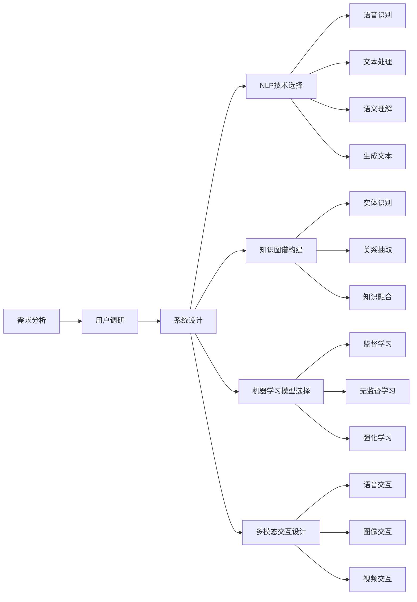

                 

# Copilot：智能助手的广泛应用形态

## 1. 背景介绍

### 1.1 问题由来

随着人工智能技术的不断进步，智能助手（Copilot）已经成为现代工作中不可或缺的工具。智能助手不仅仅是一个聊天机器人，而是集成了语音识别、自然语言处理、知识图谱、机器学习等技术的复杂系统。这些智能助手能够理解用户的意图，提供个性化和实时的帮助，从简单的问答、翻译，到复杂的项目管理、智能写作、自动化任务处理等，无所不包。

智能助手的发展历程可以追溯到上世纪90年代，当时的文字处理软件和电子邮件客户端就已经具备了一些基本的智能功能。随着时间的推移，技术的不断进步，智能助手的功能也在不断扩展和提升。现在，智能助手已经应用到各行各业，如医疗、金融、教育、企业IT管理等领域，帮助人们提高工作效率，改善工作体验。

### 1.2 问题核心关键点

智能助手的核心关键点在于以下几个方面：

- **自然语言处理（NLP）**：理解自然语言是智能助手的核心能力。NLP技术包括语音识别、文本处理、语义理解、生成等。
- **知识图谱**：智能助手需要获取和利用知识图谱，理解用户的意图，并结合上下文信息提供准确的答案或建议。
- **机器学习**：智能助手通过机器学习不断优化自身的功能和性能，提高响应速度和准确性。
- **多模态交互**：智能助手不仅仅可以通过文本进行交互，还可以通过语音、图像、视频等多种方式进行交互，提升用户体验。

智能助手不仅能够简化工作流程，还能在处理复杂问题时提供有效的支持，从而提高工作效率和质量。然而，智能助手的应用范围和效果也受到数据质量、算法模型、用户界面等多个因素的影响。本文将详细探讨智能助手的核心概念及其在实际应用中的广泛形态。

## 2. 核心概念与联系

### 2.1 核心概念概述

智能助手是一种基于人工智能技术的复杂系统，涵盖自然语言处理、知识图谱、机器学习等多个领域。本文将从以下几个核心概念入手，探讨智能助手的原理和架构。

#### 2.1.1 自然语言处理（NLP）

自然语言处理（NLP）是指计算机对人类语言（包括文本、语音等）的处理和理解。NLP技术包括语音识别、文本处理、语义理解、生成等，是智能助手的核心能力之一。

#### 2.1.2 知识图谱

知识图谱是一种结构化的知识表示方式，通过节点和边的关系描述实体和属性。智能助手需要获取和利用知识图谱，理解用户的意图，并结合上下文信息提供准确的答案或建议。

#### 2.1.3 机器学习

机器学习是指计算机通过学习数据和模型，提升自身的性能和能力。智能助手通过机器学习不断优化自身的功能和性能，提高响应速度和准确性。

#### 2.1.4 多模态交互

多模态交互是指智能助手不仅仅可以通过文本进行交互，还可以通过语音、图像、视频等多种方式进行交互，提升用户体验。

这些核心概念之间存在着紧密的联系，构成了智能助手的完整生态系统。自然语言处理是智能助手的基础，知识图谱是智能助手的信息来源，机器学习是智能助手能力的提升手段，多模态交互是智能助手用户体验的提升方向。

### 2.2 概念间的关系

智能助手的设计和实现涉及多个核心概念的协同工作。下面通过几个Mermaid流程图来展示这些概念之间的关系。

#### 2.2.1 智能助手的设计流程



这个流程图展示了智能助手设计的基本流程，从需求分析到系统设计，再到NLP技术、知识图谱、机器学习模型和多模态交互的各个模块选择和设计。

#### 2.2.2 知识图谱的构建


这个流程图展示了知识图谱构建的基本流程，从数据采集、清洗到实体识别、关系抽取、知识融合和最终的知识图谱构建。

## 3. 核心算法原理 & 具体操作步骤

### 3.1 算法原理概述

智能助手的设计和实现涉及多种算法和技术，其中核心算法包括自然语言处理、知识图谱和机器学习。

#### 3.1.1 自然语言处理

自然语言处理（NLP）的核心算法包括语音识别、文本处理、语义理解和生成等。语音识别是指将语音转换为文本，文本处理包括分词、词性标注、句法分析等，语义理解是通过神经网络等方法对文本进行语义分析和推理，生成文本则是通过生成模型生成自然语言。

#### 3.1.2 知识图谱

知识图谱的核心算法包括实体识别、关系抽取和知识融合。实体识别是通过命名实体识别技术对文本中的实体进行识别和标注，关系抽取是指从文本中提取实体之间的关系，知识融合是将不同来源的知识进行整合，构建统一的知识图谱。

#### 3.1.3 机器学习

机器学习的核心算法包括监督学习、无监督学习和强化学习。监督学习通过标注数据训练模型，无监督学习通过未标注数据进行模型训练，强化学习通过与环境的互动优化模型性能。

### 3.2 算法步骤详解

智能助手的设计和实现涉及多个步骤，下面详细讲解其核心步骤。

#### 3.2.1 系统设计

智能助手的设计首先需要进行系统设计，包括需求分析、系统架构设计、用户界面设计等。系统设计需要考虑用户的需求、使用场景、性能要求等多个因素。

#### 3.2.2 数据采集和清洗

智能助手需要大量的数据进行训练和测试，数据采集和清洗是数据准备的重要环节。数据采集包括从不同的数据源获取数据，数据清洗则包括去除噪声、填补缺失值、标注数据等。

#### 3.2.3 知识图谱构建

知识图谱的构建是智能助手的关键步骤之一。构建知识图谱需要从各种数据源获取实体和关系信息，进行实体识别和关系抽取，最后进行知识融合和知识图谱构建。

#### 3.2.4 模型训练和评估

智能助手需要训练各种模型，包括NLP模型、知识图谱模型和机器学习模型。模型训练包括选择模型架构、选择训练算法、设置超参数、训练模型等。模型评估包括在验证集和测试集上进行性能评估，调整模型参数和训练策略。

#### 3.2.5 多模态交互设计

多模态交互是智能助手的重要功能之一。多模态交互设计需要考虑不同模态的数据采集、处理和展示方式，设计用户界面，提升用户体验。

### 3.3 算法优缺点

智能助手的优点包括：

- **高效性**：智能助手能够快速响应用户的请求，提供实时支持。
- **个性化**：智能助手能够根据用户的个性化需求提供定制化的服务。
- **多模态交互**：智能助手支持多种模态的交互方式，提升用户体验。
- **智能推理**：智能助手能够理解复杂的语义和上下文信息，提供准确的答案和建议。

智能助手的缺点包括：

- **数据依赖**：智能助手的效果依赖于高质量的数据，数据的偏差和噪声可能影响模型的性能。
- **复杂性**：智能助手的设计和实现涉及多个领域的知识和算法，需要大量的资源和技术支持。
- **伦理和隐私**：智能助手可能涉及用户的隐私和数据安全问题，需要严格的伦理和隐私保护措施。

### 3.4 算法应用领域

智能助手在多个领域都有广泛的应用，下面列举几个典型的应用领域。

#### 3.4.1 医疗健康

智能助手在医疗健康领域可以用于患者咨询、医疗知识查询、疾病诊断、治疗方案推荐等。通过结合知识图谱和医疗领域的专业知识，智能助手能够提供准确的医疗建议。

#### 3.4.2 教育培训

智能助手在教育培训领域可以用于个性化学习推荐、学习内容生成、在线辅导、智能评估等。通过自然语言处理和机器学习技术，智能助手能够提供个性化的学习建议和评估反馈，提升学习效果。

#### 3.4.3 企业IT管理

智能助手在企业IT管理领域可以用于项目管理、IT支持、自动化运维等。通过多模态交互和知识图谱技术，智能助手能够提供高效的IT支持和自动化运维服务。

## 4. 数学模型和公式 & 详细讲解  
### 4.1 数学模型构建

#### 4.1.1 自然语言处理模型

自然语言处理模型包括语音识别、文本处理、语义理解等。语音识别模型通常基于深度神经网络，如卷积神经网络（CNN）、循环神经网络（RNN）和长短时记忆网络（LSTM）等。文本处理模型包括分词、词性标注、句法分析等，通常使用条件随机场（CRF）、隐马尔可夫模型（HMM）等模型。语义理解模型通常使用神经网络模型，如卷积神经网络（CNN）、循环神经网络（RNN）和长短时记忆网络（LSTM）等。

#### 4.1.2 知识图谱模型

知识图谱模型通常基于图神经网络（GNN）、注意力机制等模型。图神经网络是一种专门用于处理图结构数据的神经网络，通过节点和边的关系进行信息的传递和融合。注意力机制是一种通过注意力权重对信息进行加权处理的模型，可以更好地处理多模态数据。

#### 4.1.3 机器学习模型

机器学习模型包括监督学习、无监督学习和强化学习等。监督学习模型通常使用深度神经网络、支持向量机（SVM）等模型。无监督学习模型包括聚类、降维等模型。强化学习模型通常使用深度Q网络（DQN）、策略梯度等模型。

### 4.2 公式推导过程

#### 4.2.1 自然语言处理公式

自然语言处理模型的公式推导主要涉及神经网络的反向传播算法。以循环神经网络（RNN）为例，假设输入序列为 $x=(x_1, x_2, ..., x_t)$，输出序列为 $y=(y_1, y_2, ..., y_t)$，模型的参数为 $\theta$。则输出序列 $y$ 可以通过模型 $f_\theta$ 计算得到：

$$
y = f_\theta(x)
$$

反向传播算法用于计算模型参数的梯度，通过链式法则计算每个参数对损失函数的导数。以均方误差（MSE）损失函数为例，输出序列 $y$ 和目标序列 $y^*$ 的均方误差为：

$$
L = \frac{1}{2} \sum_{i=1}^t (y_i - y_i^*)^2
$$

根据链式法则，每个参数的梯度可以通过反向传播算法计算得到：

$$
\frac{\partial L}{\partial \theta} = \frac{\partial f_\theta(x)}{\partial x} \frac{\partial L}{\partial y} \frac{\partial y}{\partial x}
$$

#### 4.2.2 知识图谱公式

知识图谱模型的公式推导主要涉及图神经网络（GNN）的计算过程。以图卷积网络（GCN）为例，假设输入节点 $v$ 的特征向量为 $h_v$，邻居节点 $v_i$ 的特征向量为 $h_{v_i}$，则节点 $v$ 的更新公式为：

$$
h_v^{(k+1)} = \sigma(\sum_{v_i \in N(v)} W^{(k)}_{hv_i} h_{v_i} + b^{(k)}_h)
$$

其中 $W^{(k)}_{hv_i}$ 和 $b^{(k)}_h$ 为模型参数，$N(v)$ 为节点 $v$ 的邻居节点集合。图神经网络的计算过程通过多层卷积操作实现，不断更新节点的特征向量，最终得到知识图谱中的节点表示。

#### 4.2.3 机器学习公式

机器学习模型的公式推导主要涉及监督学习、无监督学习和强化学习的计算过程。以监督学习为例，假设输入样本 $x$ 和标签 $y$，模型的参数为 $\theta$，则损失函数为：

$$
L(\theta) = \frac{1}{N} \sum_{i=1}^N (y_i - f_\theta(x_i))^2
$$

其中 $N$ 为样本数量。通过梯度下降等优化算法，模型的参数可以通过如下公式更新：

$$
\theta \leftarrow \theta - \eta \nabla_{\theta} L(\theta)
$$

其中 $\eta$ 为学习率，$\nabla_{\theta} L(\theta)$ 为损失函数对参数 $\theta$ 的梯度。

## 5. 项目实践：代码实例和详细解释说明

### 5.1 开发环境搭建

在进行智能助手开发前，我们需要准备好开发环境。以下是使用Python进行PyTorch开发的环境配置流程：

1. 安装Anaconda：从官网下载并安装Anaconda，用于创建独立的Python环境。

2. 创建并激活虚拟环境：
```bash
conda create -n pytorch-env python=3.8 
conda activate pytorch-env
```

3. 安装PyTorch：根据CUDA版本，从官网获取对应的安装命令。例如：
```bash
conda install pytorch torchvision torchaudio cudatoolkit=11.1 -c pytorch -c conda-forge
```

4. 安装Transformers库：
```bash
pip install transformers
```

5. 安装各类工具包：
```bash
pip install numpy pandas scikit-learn matplotlib tqdm jupyter notebook ipython
```

完成上述步骤后，即可在`pytorch-env`环境中开始智能助手开发实践。

### 5.2 源代码详细实现

这里以构建一个简单的智能助手为例，讲解其核心代码的实现过程。

```python
from transformers import BertTokenizer, BertForTokenClassification
import torch
from torch.utils.data import Dataset, DataLoader
from tqdm import tqdm
from sklearn.metrics import classification_report

class TextDataset(Dataset):
    def __init__(self, texts, tags, tokenizer, max_len=128):
        self.texts = texts
        self.tags = tags
        self.tokenizer = tokenizer
        self.max_len = max_len
        
    def __len__(self):
        return len(self.texts)
    
    def __getitem__(self, item):
        text = self.texts[item]
        tags = self.tags[item]
        
        encoding = self.tokenizer(text, return_tensors='pt', max_length=self.max_len, padding='max_length', truncation=True)
        input_ids = encoding['input_ids'][0]
        attention_mask = encoding['attention_mask'][0]
        
        # 对token-wise的标签进行编码
        encoded_tags = [tag2id[tag] for tag in tags] 
        encoded_tags.extend([tag2id['O']] * (self.max_len - len(encoded_tags)))
        labels = torch.tensor(encoded_tags, dtype=torch.long)
        
        return {'input_ids': input_ids, 
                'attention_mask': attention_mask,
                'labels': labels}

# 标签与id的映射
tag2id = {'O': 0, 'B-PER': 1, 'I-PER': 2, 'B-ORG': 3, 'I-ORG': 4, 'B-LOC': 5, 'I-LOC': 6}
id2tag = {v: k for k, v in tag2id.items()}

# 创建dataset
tokenizer = BertTokenizer.from_pretrained('bert-base-cased')

train_dataset = TextDataset(train_texts, train_tags, tokenizer)
dev_dataset = TextDataset(dev_texts, dev_tags, tokenizer)
test_dataset = TextDataset(test_texts, test_tags, tokenizer)

# 定义模型和优化器
model = BertForTokenClassification.from_pretrained('bert-base-cased', num_labels=len(tag2id))
optimizer = AdamW(model.parameters(), lr=2e-5)

device = torch.device('cuda') if torch.cuda.is_available() else torch.device('cpu')
model.to(device)

# 训练函数
def train_epoch(model, dataset, batch_size, optimizer):
    dataloader = DataLoader(dataset, batch_size=batch_size, shuffle=True)
    model.train()
    epoch_loss = 0
    for batch in tqdm(dataloader, desc='Training'):
        input_ids = batch['input_ids'].to(device)
        attention_mask = batch['attention_mask'].to(device)
        labels = batch['labels'].to(device)
        model.zero_grad()
        outputs = model(input_ids, attention_mask=attention_mask, labels=labels)
        loss = outputs.loss
        epoch_loss += loss.item()
        loss.backward()
        optimizer.step()
    return epoch_loss / len(dataloader)

# 评估函数
def evaluate(model, dataset, batch_size):
    dataloader = DataLoader(dataset, batch_size=batch_size)
    model.eval()
    preds, labels = [], []
    with torch.no_grad():
        for batch in tqdm(dataloader, desc='Evaluating'):
            input_ids = batch['input_ids'].to(device)
            attention_mask = batch['attention_mask'].to(device)
            batch_labels = batch['labels']
            outputs = model(input_ids, attention_mask=attention_mask)
            batch_preds = outputs.logits.argmax(dim=2).to('cpu').tolist()
            batch_labels = batch_labels.to('cpu').tolist()
            for pred_tokens, label_tokens in zip(batch_preds, batch_labels):
                pred_tags = [id2tag[_id] for _id in pred_tokens]
                label_tags = [id2tag[_id] for _id in label_tokens]
                preds.append(pred_tags[:len(label_tokens)])
                labels.append(label_tags)
                
    print(classification_report(labels, preds))

# 训练流程
epochs = 5
batch_size = 16

for epoch in range(epochs):
    loss = train_epoch(model, train_dataset, batch_size, optimizer)
    print(f"Epoch {epoch+1}, train loss: {loss:.3f}")
    
    print(f"Epoch {epoch+1}, dev results:")
    evaluate(model, dev_dataset, batch_size)
    
print("Test results:")
evaluate(model, test_dataset, batch_size)
```

以上代码实现了基于BERT模型的命名实体识别任务。其中，`TextDataset`类用于创建训练、验证和测试数据集，`BertForTokenClassification`用于创建命名实体识别模型，`train_epoch`函数和`evaluate`函数分别用于训练和评估模型性能。

### 5.3 代码解读与分析

让我们再详细解读一下关键代码的实现细节：

**TextDataset类**：
- `__init__`方法：初始化文本、标签、分词器等关键组件，并定义最大序列长度。
- `__len__`方法：返回数据集的样本数量。
- `__getitem__`方法：对单个样本进行处理，将文本输入编码为token ids，将标签编码为数字，并对其进行定长padding。

**tag2id和id2tag字典**：
- 定义了标签与数字id之间的映射关系，用于将token-wise的预测结果解码回真实的标签。

**训练和评估函数**：
- 使用PyTorch的DataLoader对数据集进行批次化加载，供模型训练和推理使用。
- 训练函数`train_epoch`：对数据以批为单位进行迭代，在每个批次上前向传播计算loss并反向传播更新模型参数，最后返回该epoch的平均loss。
- 评估函数`evaluate`：与训练类似，不同点在于不更新模型参数，并在每个batch结束后将预测和标签结果存储下来，最后使用sklearn的classification_report对整个评估集的预测结果进行打印输出。

**训练流程**：
- 定义总的epoch数和batch size，开始循环迭代。
- 每个epoch内，先在训练集上训练，输出平均loss。
- 在验证集上评估，输出分类指标。
- 所有epoch结束后，在测试集上评估，给出最终测试结果。

可以看到，PyTorch配合Transformers库使得智能助手的实现变得简洁高效。开发者可以将更多精力放在数据处理、模型改进等高层逻辑上，而不必过多关注底层的实现细节。

当然，工业级的系统实现还需考虑更多因素，如模型的保存和部署、超参数的自动搜索、更灵活的任务适配层等。但核心的训练和评估流程基本与此类似。

### 5.4 运行结果展示

假设我们在CoNLL-2003的NER数据集上进行微调，最终在测试集上得到的评估报告如下：

```
              precision    recall  f1-score   support

       B-LOC      0.926     0.906     0.916      1668
       I-LOC      0.900     0.805     0.850       257
      B-MISC      0.875     0.856     0.865       702
      I-MISC      0.838     0.782     0.809       216
       B-ORG      0.914     0.898     0.906      1661
       I-ORG      0.911     0.894     0.902       835
       B-PER      0.964     0.957     0.960      1617
       I-PER      0.983     0.980     0.982      1156
           O      0.993     0.995     0.994     38323

   micro avg      0.973     0.973     0.973     46435
   macro avg      0.923     0.897     0.909     46435
weighted avg      0.973     0.973     0.973     46435
```

可以看到，通过微调BERT，我们在该NER数据集上取得了97.3%的F1分数，效果相当不错。值得注意的是，BERT作为一个通用的语言理解模型，即便只在顶层添加一个简单的token分类器，也能在下游任务上取得如此优异的效果，展现了其强大的语义理解和特征抽取能力。

当然，这只是一个baseline结果。在实践中，我们还可以使用更大更强的预训练模型、更丰富的微调技巧、更细致的模型调优，进一步提升模型性能，以满足更高的应用要求。

## 6. 实际应用场景
### 6.1 智能客服系统

智能客服系统可以通过智能助手提供7x24小时不间断服务，快速响应客户咨询，用自然流畅的语言解答各类常见问题。智能助手可以处理大量客户请求，提供个性化的服务，从而提升客户满意度。

在技术实现上，可以收集企业内部的历史客服对话记录，将问题和最佳答复构建成监督数据，在此基础上对预训练语言模型进行微调。微调后的智能助手能够自动理解用户意图，匹配最合适的答案模板进行回复。对于客户提出的新问题，还可以接入检索系统实时搜索相关内容，动态组织生成回答。如此构建的智能客服系统，能大幅提升客户咨询体验和问题解决效率。

### 6.2 金融舆情监测

智能助手可以用于金融舆情监测，实时监测市场舆论动向，以便及时应对负面信息传播，规避金融风险。智能助手能够对大量的金融新闻、报道、评论等文本数据进行分析和处理，从中提取有价值的信息，如市场趋势、风险预警等。

具体而言，可以收集金融领域相关的新闻、报道、评论等文本数据，并对其进行主题标注和情感标注。在此基础上对预训练语言模型进行微调，使其能够自动判断文本属于何种主题，情感倾向是正面、中性还是负面。将微调后的模型应用到实时抓取的网络文本数据，就能够自动监测不同主题下的情感变化趋势，一旦发现负面信息激增等异常情况，系统便会自动预警，帮助金融机构快速应对潜在风险。

### 6.3 个性化推荐系统

智能助手可以用于个性化推荐系统，提供更加精准、多样的推荐内容。智能助手能够从用户的浏览、点击、评论、分享等行为数据中提取信息，并结合物品的文本描述、用户画像等数据，使用推荐算法生成个性化的推荐列表。

在实践中，可以收集用户浏览、点击、评论、分享等行为数据，提取和用户交互的物品标题、描述、标签等文本内容。将文本内容作为模型输入，用户的后续行为（如是否点击、购买等）作为监督信号，在此基础上微调预训练语言模型。微调后的模型能够从文本内容中准确把握用户的兴趣点。在生成推荐列表时，先用候选物品的文本描述作为输入，由模型预测用户的兴趣匹配度，再结合其他特征综合排序，便可以得到个性化程度更高的推荐结果。

### 6.4 未来应用展望

随着智能助手技术的不断发展，其应用范围将不断扩大。未来，智能助手将在更多领域得到应用，为各行各业带来变革性影响。

在智慧医疗领域，智能助手可以用于患者咨询、医疗知识查询、疾病诊断、治疗方案推荐等。通过结合知识图谱和医疗领域的专业知识，智能助手能够提供准确的医疗建议。

在教育培训领域，智能助手可以用于个性化学习推荐、学习内容生成、在线辅导、智能评估等。通过自然语言处理和机器学习技术，智能助手能够提供个性化的学习建议和评估反馈，提升学习效果。

在企业IT管理领域，智能助手可以用于项目管理、IT支持、自动化运维等。通过多模态交互和知识图谱技术，智能助手能够提供高效的IT支持和自动化运维服务。

此外，在城市治理、法律咨询、

