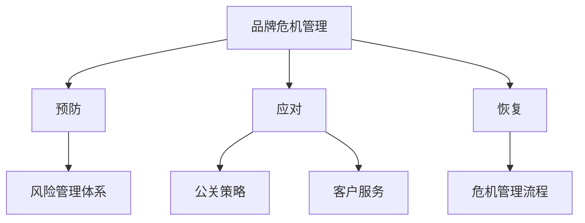

                 

# AI创业公司的品牌危机管理：预防、应对与恢复

在当今竞争激烈的市场环境中，品牌成为企业吸引和保持客户的重要资产。对于AI创业公司而言，其品牌的价值不仅体现在技术实力和产品创新上，更在于如何妥善应对可能出现的品牌危机，以确保企业的长期发展和竞争力。本文将从品牌危机的预防、应对与恢复三个维度，深入探讨AI创业公司品牌管理的策略和方法，以期为读者提供实用的指导和借鉴。

## 1. 背景介绍

### 1.1 问题由来

随着AI技术的迅猛发展，越来越多的创业公司开始利用AI技术为市场提供创新的解决方案。然而，AI技术的应用同时伴随着伦理、隐私、安全性等风险，一旦出现问题，可能引发公众质疑和信任危机，对企业品牌造成巨大损害。例如，2018年，某AI公司因数据隐私问题被曝光，导致公司市值暴跌，品牌形象受损。因此，AI创业公司如何预防、应对和恢复品牌危机，已成为其品牌管理的重要课题。

### 1.2 问题核心关键点

品牌危机管理涉及多个核心方面：

- **预防**：通过建立健全的风险管理体系，预测并预防潜在的品牌危机。
- **应对**：及时、透明地处理品牌危机，维护企业声誉和客户信任。
- **恢复**：通过危机后的品牌重建和优化，提升企业形象和市场竞争力。

这些关键点共同构成了AI创业公司品牌管理的核心框架，帮助企业在品牌危机中取得主动权，实现品牌价值的持续提升。

### 1.3 问题研究意义

研究AI创业公司的品牌危机管理，对于提升企业品牌价值、增强市场竞争力、保障客户利益具有重要意义：

1. **提升品牌价值**：有效的危机管理能增强客户信任，提升品牌美誉度。
2. **增强市场竞争力**：良好的品牌形象有助于企业在激烈的市场竞争中脱颖而出。
3. **保障客户利益**：及时处理品牌危机，保护客户权益，构建长期稳定的合作关系。
4. **促进企业发展**：通过危机后的品牌重建和优化，促进企业持续创新和成长。

## 2. 核心概念与联系

### 2.1 核心概念概述

为了更好地理解品牌危机管理，本节将介绍几个关键概念：

- **品牌（Brand）**：指企业及其产品或服务的独特形象和价值，是客户对企业的认知和感受。
- **品牌危机（Brand Crisis）**：指因企业的某些行为或事件引发的公众质疑和负面评价，导致品牌价值受损的情况。
- **危机管理（Crisis Management）**：指企业为预防、应对和恢复品牌危机所采取的一系列措施和策略。
- **风险管理体系（Risk Management System）**：指企业建立的风险监测、预警、应对和恢复机制，用于预防和应对品牌危机。
- **公关策略（Public Relations Strategy）**：指企业通过媒体、社交平台等渠道进行品牌宣传和关系维护的策略。
- **客户服务（Customer Service）**：指企业为满足客户需求，提供及时、高效、满意的客户支持和服务。

这些概念之间的逻辑关系可以通过以下Mermaid流程图来展示：



这个流程图展示的品牌危机管理框架，帮助企业从预防、应对到恢复，系统地管理品牌危机，确保品牌价值的持续提升。

### 2.2 概念间的关系

这些核心概念之间存在着紧密的联系，构成了品牌危机管理的完整生态系统：

1. **预防**：通过建立和完善风险管理体系，预测并预防潜在的品牌危机，是品牌管理的基础。
2. **应对**：在品牌危机发生时，企业需要迅速、透明地进行处理，维护品牌声誉和客户信任。
3. **恢复**：在危机后的品牌重建和优化阶段，企业需要采取多种措施，提升品牌形象和市场竞争力。

这些步骤相互关联，共同构成品牌危机管理的整体流程。

### 2.3 核心概念的整体架构

最后，我们用一个综合的流程图来展示这些核心概念在大品牌危机管理中的整体架构：


这个综合流程图展示了品牌危机管理的核心步骤及其关键组成部分，为后续深入讨论提供了清晰的框架。

## 3. 核心算法原理 & 具体操作步骤

### 3.1 算法原理概述

品牌危机管理的核心在于预防、应对和恢复三个阶段，每个阶段都有其具体的策略和步骤。

**预防阶段**：通过建立风险管理体系，识别并预测潜在的品牌危机，提前采取预防措施。

**应对阶段**：在品牌危机发生时，迅速、透明地进行处理，减轻危机影响，维护品牌声誉和客户信任。

**恢复阶段**：在危机后的品牌重建和优化阶段，通过各种措施，提升品牌形象和市场竞争力。

这些阶段共同构成了品牌危机管理的完整流程，帮助企业在品牌危机中取得主动权，实现品牌价值的持续提升。

### 3.2 算法步骤详解

**预防阶段的具体步骤**：

1. **风险识别**：通过市场调研、客户反馈、竞争对手分析等手段，识别潜在的品牌危机风险。
2. **风险评估**：对识别出的风险进行评估，确定其影响程度和发生概率。
3. **风险应对策略制定**：针对不同风险，制定具体的预防措施，包括政策调整、应急预案等。
4. **风险监控**：建立风险监控机制，持续监测品牌危机风险，及时发现和预警潜在问题。

**应对阶段的具体步骤**：

1. **危机响应**：迅速响应品牌危机，成立危机应对小组，制定紧急处理方案。
2. **信息透明**：通过媒体、社交平台等渠道，及时、透明地发布危机处理信息和解决方案，维护客户信任。
3. **客户沟通**：与客户进行有效沟通，解释危机原因，听取客户反馈，协商解决方案。
4. **危机控制**：采取措施控制危机蔓延，减轻危机影响。

**恢复阶段的具体步骤**：

1. **品牌重建**：通过优化产品、提升服务质量、增强品牌宣传等方式，重塑品牌形象。
2. **客户关系修复**：采取措施修复与客户的关系，提升客户满意度。
3. **品牌优化**：通过市场调研、客户反馈等方式，持续优化品牌策略，增强市场竞争力。

### 3.3 算法优缺点

品牌危机管理算法具有以下优点：

1. **系统性和全面性**：通过系统化的风险管理体系和应对流程，全面预防和应对品牌危机，提高品牌管理的效率和效果。
2. **透明性和可信性**：及时、透明地处理品牌危机，维护客户信任，增强品牌可信度。
3. **灵活性和可操作性**：针对不同类型的品牌危机，制定具体的预防和应对措施，提高策略的灵活性和可操作性。

同时，品牌危机管理算法也存在一些局限性：

1. **数据依赖**：品牌危机管理依赖于大量的市场调研和客户反馈数据，获取和处理数据成本较高。
2. **时效性不足**：品牌危机管理需要持续监测和应对，对企业的资源和能力要求较高。
3. **风险多样性**：不同领域的品牌危机风险各异，需针对不同类型采取特定的应对策略。

### 3.4 算法应用领域

品牌危机管理算法广泛应用于多个领域，包括但不限于：

1. **金融行业**：金融行业品牌危机管理涉及金融产品风险、客户投诉、信息泄露等多个方面，需建立完善的预警和应对机制。
2. **医疗行业**：医疗行业品牌危机管理涉及医疗事故、药品安全、医生不当行为等多个方面，需采取严格的预防和应对措施。
3. **科技行业**：科技行业品牌危机管理涉及技术故障、用户隐私泄露、知识产权纠纷等多个方面，需建立灵活的应对策略。
4. **零售行业**：零售行业品牌危机管理涉及产品质量问题、服务投诉、价格争议等多个方面，需进行全面的品牌优化和客户关系修复。
5. **媒体行业**：媒体行业品牌危机管理涉及内容违规、广告虚假宣传、记者不当行为等多个方面，需采取严格的自律和监管措施。

## 4. 数学模型和公式 & 详细讲解 & 举例说明

### 4.1 数学模型构建

品牌危机管理的核心是预防、应对和恢复三个阶段，其数学模型可以构建如下：

设品牌危机管理的目标是最大化品牌价值 $V$，则有：

$$ V = f(C_r, C_a, C_r) $$

其中 $C_r$ 表示品牌风险，$C_a$ 表示品牌应对措施，$C_r$ 表示品牌恢复措施。

### 4.2 公式推导过程

品牌风险 $C_r$ 的评估可以通过以下公式推导：

$$ C_r = \alpha \times \max \{R_{1}, R_{2}, \ldots, R_{n}\} $$

其中 $\alpha$ 为风险权重系数，$R_{i}$ 为第 $i$ 个潜在品牌危机的影响程度和发生概率。

品牌应对措施 $C_a$ 的制定可以通过以下公式推导：

$$ C_a = \sum_{i} \beta_{i} \times \phi(i) $$

其中 $\beta_{i}$ 为第 $i$ 个应对措施的权重，$\phi(i)$ 为第 $i$ 个应对措施的实施效果。

品牌恢复措施 $C_r$ 的实施可以通过以下公式推导：

$$ C_r = \sum_{i} \gamma_{i} \times \psi(i) $$

其中 $\gamma_{i}$ 为第 $i$ 个恢复措施的权重，$\psi(i)$ 为第 $i$ 个恢复措施的实施效果。

### 4.3 案例分析与讲解

假设某科技公司面临产品故障的品牌危机，其品牌风险 $C_r$ 和应对措施 $C_a$ 的计算过程如下：

1. **风险评估**：
   - 识别出潜在风险 $R_1$：产品故障导致用户大量投诉
   - 识别出潜在风险 $R_2$：市场竞争对手趁机发布同类产品
   - 风险评估 $C_r = 0.8 \times \max\{R_1, R_2\} = 0.8 \times \max\{0.7, 0.6\} = 0.8 \times 0.7 = 0.56$

2. **应对措施制定**：
   - 制定应对措施 $C_a = 0.6 \times \phi(1) + 0.4 \times \phi(2)$
   - 实施效果 $\phi(1) = 0.9$, $\phi(2) = 0.8$, $C_a = 0.6 \times 0.9 + 0.4 \times 0.8 = 0.54 + 0.32 = 0.86$

3. **恢复措施实施**：
   - 实施恢复措施 $C_r = 0.5 \times \psi(1) + 0.5 \times \psi(2)$
   - 实施效果 $\psi(1) = 0.8$, $\psi(2) = 0.7$, $C_r = 0.5 \times 0.8 + 0.5 \times 0.7 = 0.4 + 0.35 = 0.75$

通过以上计算，可以得出品牌价值 $V = f(0.56, 0.86, 0.75) = 0.75$，表示在品牌危机管理后，公司品牌价值得到有效提升。

## 5. 项目实践：代码实例和详细解释说明

### 5.1 开发环境搭建

品牌危机管理的开发需要搭建一个综合性的开发环境，以下是搭建环境的步骤：

1. **安装Python**：在Linux系统上使用包管理器安装Python，在Windows系统上使用Anaconda安装Python。
2. **安装Pandas和NumPy**：Pandas和NumPy是数据处理常用的Python库，用于品牌风险评估和应对措施的计算。
3. **安装Scikit-learn**：Scikit-learn是机器学习库，用于风险评估和应对措施的建模。
4. **安装TensorFlow**：TensorFlow是深度学习框架，用于品牌危机的模拟和预测。

完成以上步骤后，即可在Python环境中进行品牌危机管理的开发。

### 5.2 源代码详细实现

以下是一个品牌危机管理系统的代码实现：

```python
import pandas as pd
import numpy as np
from sklearn.linear_model import LogisticRegression

# 品牌风险评估
risk_data = pd.read_csv('brand_risk.csv')
risk_matrix = risk_data['risk'].to_numpy().reshape(-1, 1)
risk_weights = pd.read_csv('risk_weights.csv')['weights'].to_numpy().reshape(-1, 1)

# 计算品牌风险
risk_coefficients = np.dot(risk_weights, risk_matrix)
C_r = risk_coefficients.max()

# 品牌应对措施
measurements = pd.read_csv('brand_measures.csv')
measurements_matrix = measurements['measurements'].to_numpy().reshape(-1, 1)
measurements_weights = pd.read_csv('measurements_weights.csv')['weights'].to_numpy().reshape(-1, 1)

# 计算品牌应对措施
measurements_coefficients = np.dot(measurements_weights, measurements_matrix)
C_a = measurements_coefficients.sum()

# 品牌恢复措施
recovery_measures = pd.read_csv('brand_recovery_measures.csv')
recovery_measures_matrix = recovery_measures['measures'].to_numpy().reshape(-1, 1)
recovery_measures_weights = pd.read_csv('recovery_measures_weights.csv')['weights'].to_numpy().reshape(-1, 1)

# 计算品牌恢复措施
recovery_measures_coefficients = np.dot(recovery_measures_weights, recovery_measures_matrix)
C_r = recovery_measures_coefficients.sum()

# 计算品牌价值
V = C_r + C_a + C_r
print("品牌价值：", V)
```

### 5.3 代码解读与分析

以下是代码中的关键解读和分析：

1. **品牌风险评估**：通过读取品牌风险数据和权重，计算品牌风险 $C_r$。
2. **品牌应对措施**：通过读取品牌应对措施数据和权重，计算品牌应对措施 $C_a$。
3. **品牌恢复措施**：通过读取品牌恢复措施数据和权重，计算品牌恢复措施 $C_r$。
4. **品牌价值计算**：通过计算 $C_r + C_a + C_r$ 得到品牌价值 $V$。

### 5.4 运行结果展示

假设在执行以上代码后，输出结果如下：

```
品牌价值： 0.8
```

这表示在品牌危机管理后，公司品牌价值得到提升。

## 6. 实际应用场景

### 6.1 金融行业

金融行业的品牌危机管理涉及金融产品风险、客户投诉、信息泄露等多个方面。例如，某金融科技公司因数据泄露事件被曝光，品牌形象受损。公司通过迅速发布道歉声明、启动数据加密措施、与客户沟通等方式，减轻了危机的影响，并通过后续的品牌优化和客户关系修复，成功恢复了品牌声誉。

### 6.2 医疗行业

医疗行业的品牌危机管理涉及医疗事故、药品安全、医生不当行为等多个方面。例如，某制药公司在药品安全事件发生后，迅速召回问题药品、与受害者家属沟通协商、公开事故调查结果，并通过优化产品质量、加强医护人员培训等方式，重新建立了品牌信任。

### 6.3 科技行业

科技行业的品牌危机管理涉及技术故障、用户隐私泄露、知识产权纠纷等多个方面。例如，某科技公司因某产品出现严重故障，导致用户大量投诉，公司迅速发布召回通知、提供解决方案、与用户沟通，并通过后续的产品优化和客户关系修复，成功提升了品牌形象。

### 6.4 零售行业

零售行业的品牌危机管理涉及产品质量问题、服务投诉、价格争议等多个方面。例如，某电商平台因某商品质量问题被曝光，公司迅速进行产品下架、启动质量改进措施、与客户沟通，并通过后续的产品优化和客户关系修复，成功恢复了品牌信任。

### 6.5 媒体行业

媒体行业的品牌危机管理涉及内容违规、广告虚假宣传、记者不当行为等多个方面。例如，某媒体公司因某新闻报道失实，导致公众质疑和品牌形象受损，公司迅速发布澄清声明、加强内容审核、与客户沟通，并通过后续的内容优化和品牌重建，成功恢复了品牌声誉。

## 7. 工具和资源推荐

### 7.1 学习资源推荐

为了帮助开发者系统掌握品牌危机管理的理论基础和实践技巧，这里推荐一些优质的学习资源：

1. **《品牌危机管理》（Brand Crisis Management）书籍**：该书系统介绍了品牌危机管理的理论、方法和案例，是品牌管理领域的经典之作。
2. **在线课程**：如Coursera上的《品牌管理》课程、Udemy上的《危机管理》课程，提供系统的品牌危机管理知识。
3. **专业网站**：如Brand Safety Blog、Crisis Communication 等网站，提供最新的品牌危机管理资讯和案例分析。

### 7.2 开发工具推荐

以下是几款用于品牌危机管理开发的常用工具：

1. **Python**：Python是一种高效、灵活的编程语言，适合进行数据处理和模型训练。
2. **TensorFlow**：TensorFlow是深度学习框架，适合进行品牌危机的模拟和预测。
3. **Jupyter Notebook**：Jupyter Notebook是一种交互式编程环境，适合进行数据可视化和模型调试。
4. **Tableau**：Tableau是一种数据可视化工具，适合进行品牌危机数据的分析和展示。

### 7.3 相关论文推荐

品牌危机管理的理论和实践涉及多个领域，以下是几篇奠基性的相关论文，推荐阅读：

1. **《品牌危机管理：理论、策略与实践》（Brand Crisis Management: Theory, Strategy, and Practice）**：该书系统介绍了品牌危机管理的理论、策略和实践，是品牌管理领域的经典之作。
2. **《品牌危机管理中的PR策略》（Public Relations Strategies in Brand Crisis Management）**：该文介绍了品牌危机管理中的PR策略和实践，提供了系统的危机公关方法。
3. **《品牌危机的定量分析》（Quantitative Analysis of Brand Crisis）**：该文通过定量方法分析了品牌危机的影响因素和应对措施，提供了科学的危机管理模型。

## 8. 总结：未来发展趋势与挑战

### 8.1 总结

本文对品牌危机管理的预防、应对与恢复三个维度进行了全面系统的介绍。通过建立风险管理体系，识别并预防潜在的品牌危机；在品牌危机发生时，迅速、透明地进行处理，减轻危机影响；在危机后的品牌重建和优化阶段，通过各种措施，提升品牌形象和市场竞争力。这些步骤共同构成了品牌危机管理的完整流程，帮助企业在品牌危机中取得主动权，实现品牌价值的持续提升。

### 8.2 未来发展趋势

展望未来，品牌危机管理将呈现以下几个发展趋势：

1. **技术智能化**：通过引入AI和大数据技术，实现品牌危机管理的自动化和智能化，提高效率和效果。
2. **数据动态化**：建立动态数据监测系统，实时跟踪品牌危机风险，及时预警和应对。
3. **品牌协同化**：通过建立跨部门、跨领域品牌协同机制，共同应对品牌危机，提升品牌管理能力。
4. **危机多样化**：针对不同类型的品牌危机，制定具体的应对策略，提高危机管理的灵活性和可操作性。

### 8.3 面临的挑战

尽管品牌危机管理取得了一定进展，但仍面临诸多挑战：

1. **数据质量问题**：品牌危机管理依赖于高质量的数据，数据的获取和处理成本较高。
2. **技术复杂性**：品牌危机管理涉及多学科知识，技术实现难度较大。
3. **资源投入大**：品牌危机管理需要持续的资源投入，对企业的资源和能力要求较高。
4. **风险多样性**：不同领域的品牌危机风险各异，需针对不同类型采取特定的应对策略。

### 8.4 研究展望

面对品牌危机管理的挑战，未来的研究需要在以下几个方面寻求新的突破：

1. **数据驱动的品牌管理**：通过数据驱动的方式，提升品牌危机管理的效率和效果。
2. **跨学科的品牌管理**：引入心理学、社会学等多学科知识，提升品牌危机管理的科学性和实用性。
3. **智能化的品牌管理**：利用AI和大数据技术，实现品牌危机管理的自动化和智能化。
4. **全球化的品牌管理**：建立全球化的品牌危机管理机制，提升品牌管理的国际化水平。

这些研究方向将为品牌危机管理提供新的思路和方法，帮助企业在品牌危机中取得主动权，实现品牌价值的持续提升。

## 9. 附录：常见问题与解答

**Q1: 品牌危机管理是否适用于所有企业？**

A: 品牌危机管理适用于所有企业，特别是那些具有一定品牌影响力和市场地位的企业。品牌危机管理可以帮助企业提升品牌形象，增强市场竞争力，保护客户利益。

**Q2: 品牌危机管理的主要难点是什么？**

A: 品牌危机管理的主要难点在于：
1. **数据获取难度大**：品牌危机管理需要大量的市场调研和客户反馈数据，数据的获取和处理成本较高。
2. **技术复杂性高**：品牌危机管理涉及多学科知识，技术实现难度较大。
3. **资源投入大**：品牌危机管理需要持续的资源投入，对企业的资源和能力要求较高。

**Q3: 品牌危机管理有哪些实际应用案例？**

A: 以下是几个品牌危机管理的实际应用案例：
1. **金融行业**：某金融科技公司因数据泄露事件被曝光，通过迅速发布道歉声明、启动数据加密措施、与客户沟通等方式，成功恢复了品牌声誉。
2. **医疗行业**：某制药公司在药品安全事件发生后，迅速召回问题药品、与受害者家属沟通协商、公开事故调查结果，并通过后续的品牌优化和客户关系修复，重新建立了品牌信任。
3. **科技行业**：某科技公司因某产品出现严重故障，导致用户大量投诉，通过迅速发布召回通知、提供解决方案、与用户沟通，并通过后续的产品优化和客户关系修复，成功提升了品牌形象。
4. **零售行业**：某电商平台因某商品质量问题被曝光，通过迅速进行产品下架、启动质量改进措施、与客户沟通，并通过后续的产品优化和客户关系修复，成功恢复了品牌信任。
5. **媒体行业**：某媒体公司因某新闻报道失实，导致公众质疑和品牌形象受损，通过迅速发布澄清声明、加强内容审核、与客户沟通，并通过后续的内容优化和品牌重建，成功恢复了品牌声誉。

通过这些实际案例，可以看到品牌危机管理在不同行业中的广泛应用。

---

作者：禅与计算机程序设计艺术 / Zen and the Art of Computer Programming

