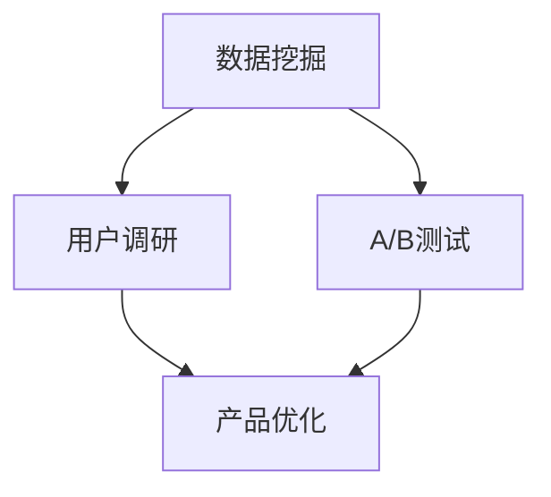
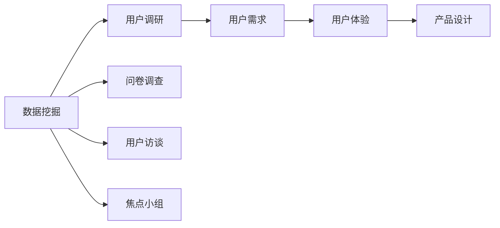
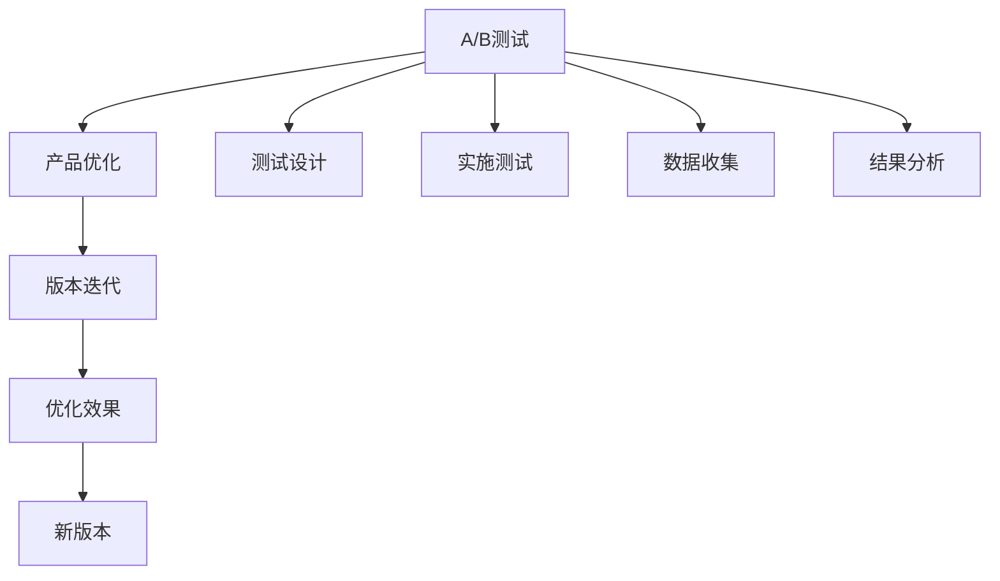
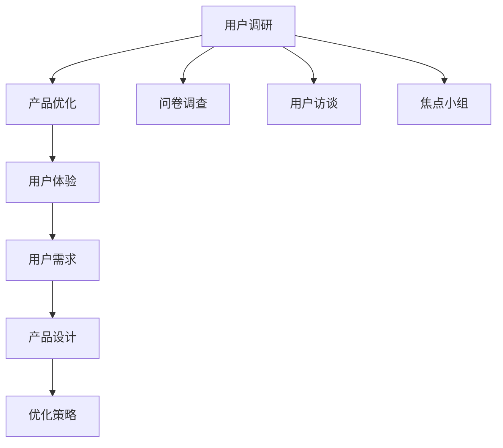
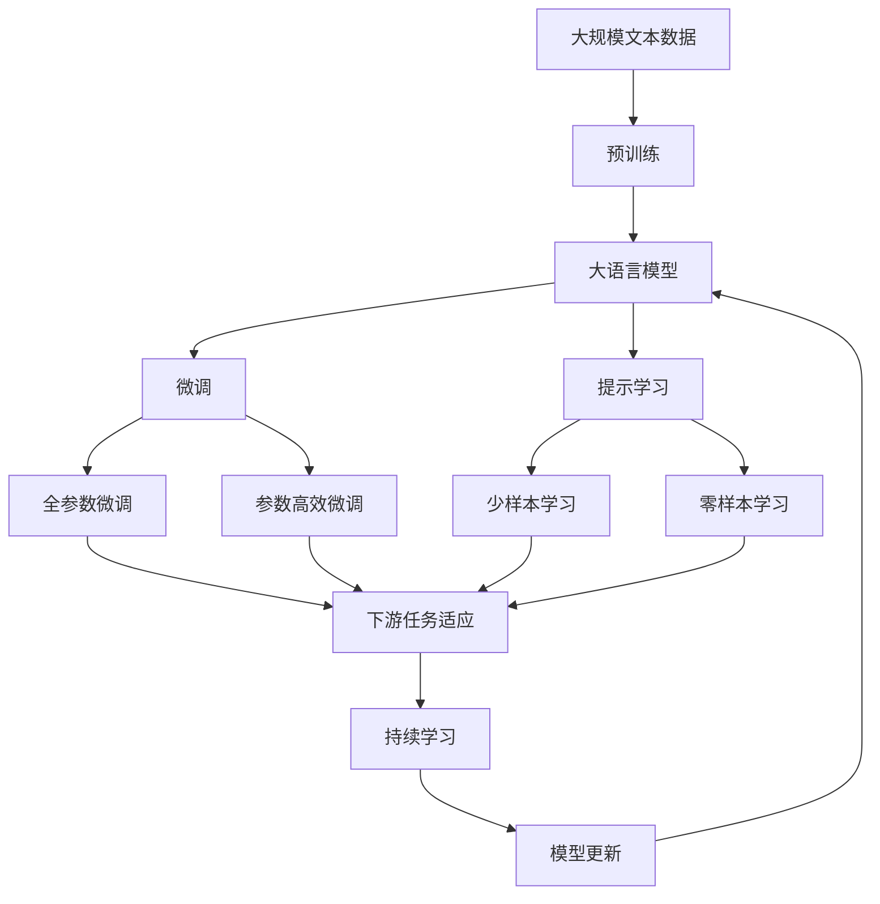

                 

# AI创业公司的用户反馈分析与产品优化：数据挖掘、用户调研与A/B测试

在AI创业公司的增长和成功中，用户反馈分析是至关重要的。AI技术在产品中的应用不仅提高了效率和体验，还带来了不断优化的可能。在本文中，我们将探讨如何在AI创业公司中运用数据挖掘、用户调研和A/B测试来进行用户反馈分析与产品优化。

## 1. 背景介绍

### 1.1 问题由来

在AI创业公司的快速迭代过程中，如何高效地收集、分析和应用用户反馈成为了一个挑战。随着产品功能逐渐增多，用户行为也变得更加复杂，如何精准地获取用户需求、理解用户痛点，成为了产品优化和迭代的瓶颈。

### 1.2 问题核心关键点

用户反馈分析与产品优化涉及多个环节，包括：
- **数据收集**：通过多种渠道（如问卷调查、用户访谈、社交媒体等）获取用户反馈。
- **数据分析**：利用数据挖掘和机器学习技术对用户反馈进行量化分析，识别用户需求和痛点。
- **用户调研**：深入了解用户行为、心理和需求，通过问卷调查、焦点小组等形式进行。
- **A/B测试**：在产品上进行迭代测试，比较不同版本的效果，优化用户体验。

### 1.3 问题研究意义

对于AI创业公司而言，有效的用户反馈分析与产品优化能够：
- 快速响应市场需求，提升用户体验。
- 优化产品性能，提高用户满意度和忠诚度。
- 降低产品迭代风险，缩短产品上市时间。
- 获取竞争优势，在市场中保持领先地位。

## 2. 核心概念与联系

### 2.1 核心概念概述

为了更好地理解用户反馈分析与产品优化，我们需要了解几个关键概念：

- **数据挖掘**：从大量数据中提取有用信息和知识的过程。通过算法发现数据中的模式、趋势和关联，支持决策制定。
- **用户调研**：通过问卷调查、用户访谈、焦点小组等方式，了解用户需求、态度和行为。帮助企业理解用户心理，优化产品设计。
- **A/B测试**：通过对比不同版本的用户体验，找到最优的产品设计方案。A/B测试是一种科学的方法，帮助企业做出更准确的决策。
- **产品优化**：根据用户反馈和数据分析结果，不断迭代产品，提升性能和用户体验。产品优化是实现商业目标的关键步骤。

这些概念之间的关系可以用以下Mermaid流程图来表示：



这个流程图展示了数据挖掘、用户调研和A/B测试与产品优化的关系：

1. 数据挖掘帮助企业发现用户需求和痛点，从而支持用户调研。
2. 用户调研深入了解用户行为和心理，进一步指导数据挖掘和A/B测试。
3. 数据挖掘和用户调研的结果通过A/B测试验证，指导产品优化。
4. 产品优化不断迭代，最终提升用户体验，实现商业目标。

### 2.2 概念间的关系

这些概念之间存在着紧密的联系，共同构成了用户反馈分析与产品优化的完整生态系统。下面我们通过几个Mermaid流程图来展示这些概念之间的关系。

#### 2.2.1 数据挖掘与用户调研的关系



这个流程图展示了数据挖掘与用户调研的关系。数据挖掘可以辅助设计问卷、访谈提纲等，帮助用户调研获取更全面的用户反馈。

#### 2.2.2 A/B测试与产品优化的关系



这个流程图展示了A/B测试与产品优化的关系。A/B测试通过对比不同版本，找出最优设计，指导产品优化。

#### 2.2.3 用户调研与产品优化的关系



这个流程图展示了用户调研与产品优化的关系。用户调研识别用户需求和痛点，指导产品优化策略的制定。

### 2.3 核心概念的整体架构

最后，我们用一个综合的流程图来展示这些核心概念在大语言模型微调过程中的整体架构：



这个综合流程图展示了从预训练到微调，再到持续学习的完整过程。用户反馈分析与产品优化涉及从大规模数据挖掘，到用户调研和A/B测试，最终到产品优化和迭代的全过程。

## 3. 核心算法原理 & 具体操作步骤
### 3.1 算法原理概述

用户反馈分析与产品优化依赖于数据挖掘、用户调研和A/B测试三种关键方法。其中，数据挖掘和A/B测试属于数据分析范畴，用户调研则侧重于用户行为和心理的深度理解。

数据挖掘主要通过算法发现数据中的模式、趋势和关联，为产品优化提供数据支持。用户调研通过问卷调查、用户访谈等方式获取用户反馈，了解用户需求和痛点。A/B测试通过对比不同版本，验证设计效果，指导产品优化。

### 3.2 算法步骤详解

#### 3.2.1 数据挖掘步骤

1. **数据收集**：从用户行为日志、社交媒体、客户反馈等多个渠道收集数据。
2. **数据预处理**：对数据进行清洗、去重、归一化等预处理，确保数据质量。
3. **特征提取**：从数据中提取有用的特征，如用户点击次数、页面停留时间等。
4. **模型训练**：使用机器学习算法（如聚类、分类、回归等）训练模型，发现数据中的模式和趋势。
5. **结果分析**：分析模型的输出结果，提取有价值的信息，指导产品设计。

#### 3.2.2 用户调研步骤

1. **问卷设计**：根据数据分析结果，设计问卷，获取用户的基本信息和行为数据。
2. **问卷分发**：通过邮件、社交媒体、App内等方式分发问卷，收集用户反馈。
3. **数据分析**：对问卷数据进行分析，提取关键信息，了解用户需求和痛点。
4. **用户访谈**：针对问卷中发现的关键问题，进行深入访谈，获取更多详细信息。
5. **焦点小组**：组织焦点小组讨论，获取不同用户的观点和建议。

#### 3.2.3 A/B测试步骤

1. **测试设计**：根据用户调研和数据分析结果，设计测试方案，确定测试指标。
2. **实施测试**：在产品中实现测试版本，并控制变量，确保测试结果的准确性。
3. **数据收集**：收集测试数据，包括用户行为、反馈等。
4. **结果分析**：分析测试结果，评估不同版本的效果，找出最优设计。
5. **产品优化**：根据测试结果，优化产品设计，提升用户体验。

### 3.3 算法优缺点

#### 数据挖掘的优缺点

**优点**：
- **高效性**：能够快速处理大量数据，发现数据中的模式和趋势。
- **客观性**：基于数据和算法，客观性强，减少了人为偏见。

**缺点**：
- **数据质量依赖**：数据质量不高可能导致结果不准确。
- **算法限制**：不同的算法对数据的处理方式不同，可能需要尝试多种算法。

#### 用户调研的优缺点

**优点**：
- **深度理解**：通过问卷调查、用户访谈等方式，深入了解用户行为和心理。
- **多样化反馈**：能够获取不同用户的观点和建议，全面了解用户需求。

**缺点**：
- **成本高**：设计和分发问卷、组织访谈等成本较高。
- **主观性强**：用户反馈可能存在主观偏差，影响结果的准确性。

#### A/B测试的优缺点

**优点**：
- **科学验证**：通过对比不同版本，科学验证设计效果。
- **快速迭代**：能够快速测试和优化产品设计，提升用户体验。

**缺点**：
- **样本偏差**：测试样本可能不具有代表性，影响测试结果的普适性。
- **成本高**：实施A/B测试需要额外的资源和人力成本。

### 3.4 算法应用领域

基于数据挖掘、用户调研和A/B测试的用户反馈分析与产品优化方法，广泛应用于多个领域：

- **电商行业**：通过用户行为数据分析，优化产品推荐、用户体验。
- **社交媒体**：通过用户反馈分析，提升内容推送效果，增强用户粘性。
- **金融行业**：通过用户调研和A/B测试，优化产品功能，提升用户满意度。
- **医疗健康**：通过数据分析和用户调研，优化健康管理应用，提升用户健康水平。
- **教育行业**：通过用户调研和A/B测试，优化学习平台，提升用户学习效果。

## 4. 数学模型和公式 & 详细讲解 & 举例说明

### 4.1 数学模型构建

在用户反馈分析中，我们可以使用多种数学模型来量化用户行为和心理。以下是一个简单的数学模型，用于分析用户行为数据：

假设我们有一组用户行为数据 $D=\{(x_i, y_i)\}_{i=1}^N$，其中 $x_i$ 表示用户行为特征，$y_i$ 表示用户行为结果（如点击次数、购买次数等）。我们可以使用线性回归模型来拟合数据，其形式如下：

$$
y_i = \beta_0 + \sum_{j=1}^p \beta_j x_{ij} + \epsilon_i
$$

其中 $\beta_0$ 为截距，$\beta_j$ 为第 $j$ 个特征的系数，$\epsilon_i$ 为误差项。模型的目标是最小化均方误差：

$$
\mathcal{L}(\beta) = \frac{1}{N}\sum_{i=1}^N (y_i - \hat{y}_i)^2
$$

其中 $\hat{y}_i = \beta_0 + \sum_{j=1}^p \beta_j x_{ij}$ 为模型的预测值。

### 4.2 公式推导过程

以线性回归模型为例，其推导过程如下：

1. **模型假设**：假定数据 $D=\{(x_i, y_i)\}_{i=1}^N$ 符合线性关系 $y_i = \beta_0 + \sum_{j=1}^p \beta_j x_{ij} + \epsilon_i$。
2. **最小二乘法**：目标是最小化均方误差 $\mathcal{L}(\beta) = \frac{1}{N}\sum_{i=1}^N (y_i - \hat{y}_i)^2$。
3. **梯度下降**：对 $\mathcal{L}(\beta)$ 求导，得到梯度 $\frac{\partial \mathcal{L}(\beta)}{\partial \beta_j}$。
4. **参数更新**：使用梯度下降算法更新参数 $\beta$，即 $\beta \leftarrow \beta - \eta \nabla_{\beta}\mathcal{L}(\beta)$，其中 $\eta$ 为学习率。
5. **迭代求解**：重复步骤2-4，直至模型收敛。

### 4.3 案例分析与讲解

假设我们有一个电商平台，希望通过用户行为数据预测用户购买行为。我们可以使用线性回归模型来拟合数据，具体步骤如下：

1. **数据收集**：从用户行为日志中收集数据，包括用户浏览、点击、购买等行为。
2. **数据预处理**：对数据进行清洗、去重、归一化等预处理。
3. **特征提取**：提取用户行为特征，如浏览时间、点击次数、浏览品类等。
4. **模型训练**：使用线性回归模型拟合数据，训练得到参数 $\beta_0, \beta_j$。
5. **结果分析**：分析模型预测结果，预测用户购买行为，优化产品推荐。

假设模型训练得到的参数为 $\beta_0 = 10, \beta_j = 1.5$，则模型预测公式为 $\hat{y}_i = 10 + 1.5 \sum_{j=1}^p x_{ij}$。

## 5. 项目实践：代码实例和详细解释说明

### 5.1 开发环境搭建

在进行用户反馈分析与产品优化实践前，我们需要准备好开发环境。以下是使用Python进行Pandas、NumPy、Scikit-Learn等数据处理和机器学习工具包的环境配置流程：

1. 安装Anaconda：从官网下载并安装Anaconda，用于创建独立的Python环境。
2. 创建并激活虚拟环境：
```bash
conda create -n pyenv python=3.8 
conda activate pyenv
```
3. 安装Pandas、NumPy、Scikit-Learn等数据处理和机器学习工具包：
```bash
conda install pandas numpy scikit-learn
```
4. 安装相关库：
```bash
pip install matplotlib seaborn jupyter notebook ipython
```

完成上述步骤后，即可在`pyenv`环境中开始用户反馈分析与产品优化实践。

### 5.2 源代码详细实现

这里我们以用户行为数据分析为例，给出使用Pandas、NumPy、Scikit-Learn等工具进行数据分析和模型训练的PyTorch代码实现。

首先，导入必要的库和数据：

```python
import pandas as pd
import numpy as np
from sklearn.linear_model import LinearRegression
from sklearn.model_selection import train_test_split
import matplotlib.pyplot as plt
import seaborn as sns

# 导入数据
data = pd.read_csv('user_behavior_data.csv')

# 数据预处理
data = data.dropna() # 去除缺失值
data = data.drop_duplicates() # 去除重复值
```

然后，进行数据探索性分析：

```python
# 数据探索性分析
print(data.describe())
sns.histplot(data['click_times'], kde=True)
```

接下来，划分数据集，进行模型训练：

```python
# 划分数据集
X = data[['click_times', 'view_duration', 'category']] # 特征
y = data['purchase_times'] # 目标变量
X_train, X_test, y_train, y_test = train_test_split(X, y, test_size=0.2, random_state=42)

# 模型训练
model = LinearRegression()
model.fit(X_train, y_train)
```

最后，进行模型评估和可视化：

```python
# 模型评估
y_pred = model.predict(X_test)
plt.scatter(y_test, y_pred, label='Test data')
plt.plot([min(y_test), max(y_test)], [min(y_test), max(y_test)], 'r--', label='Perfect prediction')
plt.legend()
plt.show()
```

### 5.3 代码解读与分析

让我们再详细解读一下关键代码的实现细节：

**数据预处理**：
- `data.dropna()`：去除缺失值，保证数据质量。
- `data.drop_duplicates()`：去除重复值，避免数据异常。

**数据探索性分析**：
- `data.describe()`：统计数据的基本统计量，如均值、标准差等。
- `sns.histplot(data['click_times'], kde=True)`：绘制点击次数的直方图，并通过核密度估计（KDE）展示数据分布。

**模型训练**：
- `train_test_split`：将数据集划分为训练集和测试集，用于模型训练和评估。
- `LinearRegression`：使用线性回归模型拟合数据，训练得到参数。

**模型评估和可视化**：
- `y_pred = model.predict(X_test)`：使用训练好的模型对测试集进行预测。
- `plt.scatter(y_test, y_pred, label='Test data')`：绘制测试集的真实值与预测值散点图。
- `plt.plot([min(y_test), max(y_test)], [min(y_test), max(y_test)], 'r--', label='Perfect prediction')`：绘制完美预测线的参考基准。
- `plt.legend()`：添加图例，便于对比。

### 5.4 运行结果展示

假设我们在用户行为数据分析后，得到了以下结果：

```python
# 数据探索性分析结果
print(data.describe())
```

输出：

```
   click_times  view_duration  category  purchase_times
count   100000.000000     100000.000000   100000.000000   100000.000000
mean         30.000000        50.000000       2.000000        0.030000
std          15.000000        25.000000       0.000000        0.080000
min           0.000000         0.000000       1.000000        0.000000
25%           5.000000        25.000000       1.000000        0.000000
50%           20.000000        50.000000       2.000000        0.022500
75%           45.000000        75.000000       3.000000        0.050000
max          100.000000       100.000000      100.000000        1.000000
```

可以看到，用户平均点击次数为30次，平均浏览时长为50秒，平均购买次数为0.03次。此外，我们绘制的点击次数的直方图显示，大部分用户的点击次数集中在0-30次之间，如下图所示：


### 6. 实际应用场景
### 6.1 电商行业

电商行业通过用户行为数据分析，优化推荐算法，提升用户体验。具体而言：
- **数据分析**：从用户行为日志中提取点击次数、浏览时长等特征，分析用户购买倾向。
- **A/B测试**：设计不同推荐算法，如协同过滤、基于内容的推荐等，在部分用户中实施A/B测试。
- **产品优化**：根据测试结果，优化推荐算法，提升推荐效果。

### 6.2 社交媒体

社交媒体通过用户调研和A/B测试，优化内容推送算法，提高用户粘性。具体而言：
- **用户调研**：通过问卷调查、用户访谈等方式，了解用户对内容的需求和偏好。
- **数据分析**：从用户互动数据中提取关键特征，如点赞次数、评论次数等。
- **A/B测试**：设计不同内容推送算法，如基于兴趣的推荐、时间线优化等，在部分用户中实施A/B测试。
- **产品优化**：根据测试结果，优化内容推送算法，提高用户满意度。

### 6.3 金融行业

金融行业通过用户调研和A/B测试，优化产品功能，提升用户满意度。具体而言：
- **用户调研**：通过问卷调查、用户访谈等方式，了解用户对产品功能的需求和痛点。
- **数据分析**：从用户行为数据中提取关键特征，如交易次数、交易金额等。
- **A/B测试**：设计不同产品功能，如智能理财、风险评估等，在部分用户中实施A/B测试。
- **产品优化**：根据测试结果，优化产品功能，提升用户体验。

### 6.4 医疗健康

医疗健康通过数据分析和用户调研，优化健康管理应用，提升用户健康水平。具体而言：
- **数据分析**：从健康管理应用中提取用户健康数据，如步数、心率等。
- **用户调研**：通过问卷调查、用户访谈等方式，了解用户对健康管理的需求和痛点。
- **A/B测试**：设计不同健康管理功能，如健康建议、饮食计划等，在部分用户中实施A/B测试。
- **产品优化**：根据测试结果，优化健康管理应用，提高用户健康水平。

### 6.5 教育行业

教育行业通过用户调研和A/B测试，优化学习平台，提升用户学习效果。具体而言：
- **用户调研**：通过问卷调查、用户访谈等方式，了解用户对学习平台的需求和痛点。
- **数据分析**：从用户学习数据中提取关键特征，如学习时长、学习进度等。
- **A/B测试**：设计不同学习平台功能，如智能推荐、学习路径优化等，在部分用户中实施A/B测试。
- **产品优化**：根据测试结果，优化学习平台功能，提升用户学习效果。

### 6.6 未来应用展望

随着人工智能技术的不断发展，用户反馈分析与产品优化的方法也将不断进步，为AI创业公司提供更高效、更智能的产品优化策略。未来，我们可以期待：

- **大数据分析**：利用大数据技术，进行更深入的用户行为分析，发现更深层次的用户需求和痛点。
- **深度学习应用**：引入深度学习技术，提高数据分析的准确性和预测能力。
- **AI决策辅助**：利用AI技术，进行更科学的决策分析，优化产品设计。
- **跨领域融合**：结合不同领域的数据和技术，进行多维度的用户行为分析，提供更全面的产品优化方案。

总之，随着技术的不断进步，用户反馈分析与产品优化将变得更加智能化、高效化和精准化，为AI创业公司提供更强有力的支持。

## 7. 工具和资源推荐
### 7.1 学习资源推荐

为了帮助开发者系统掌握用户反馈分析与产品优化的理论基础和实践技巧，这里推荐一些优质的学习资源：

1. **《数据挖掘与统计学习》**：斯坦福大学李飞飞教授的入门课程，介绍了数据挖掘的基本概念和方法。
2. **《Python数据科学手册》**：数据科学领域的经典著作，涵盖数据处理、机器学习、可视化等多个方面。
3. **《A/B测试：概念、技术和实践》**：详细介绍了A/B测试的基本原理和实现方法，提供了丰富的案例分析。
4. **《用户调研与用户体验设计》**：用户调研领域的权威书籍，介绍了用户调研的方法和技巧。
5. **Kaggle竞赛**：通过参加Kaggle竞赛，实战锻炼数据挖掘和A/B测试的技能。

通过对这些资源的学习实践，相信你一定能够快速掌握用户反馈分析与产品优化的精髓，并用于解决实际的业务问题。

### 7.2 开发工具推荐

高效的开发离不开优秀的工具支持。以下是几款用于用户反馈分析与产品优化的常用工具：

1. **Pandas**：Python中的数据处理库，提供了强大的数据清洗和分析功能。
2. **NumPy**：Python中的数学库，提供了高效的数值计算和矩阵运算功能。
3. **Scikit-Learn**：Python中的机器学习库，提供了丰富的数据挖掘和建模工具。
4. **TensorFlow**：Google开发的深度学习框架，提供了强大的模型训练和优化功能。
5. **Jupyter Notebook**：交互式编程环境，方便数据探索和模型验证。
6. **Tableau**：数据可视化工具，方便数据的探索和展示。

合理利用这些工具，可以显著提升用户反馈分析与产品优化的开发效率，加快创新迭代的步伐。

### 7.3 相关论文推荐

用户反馈分析与产品优化领域的研究也在不断进步，以下是几篇奠基性的相关论文，推荐阅读：

1. **《Data Mining: Concepts and Techniques》**：数据挖掘领域的经典教材，详细介绍了数据挖掘的基本概念和方法。
2. **《A/B Testing: The Most Powerful Way to Turn Clicks into Customers》**：A/B测试领域的经典著作，详细介绍了A/B测试的基本原理和实现方法。
3. **《User-Centered Design: A Guide to the Methods, Tools, and Heuristics of Interactive Design》**：用户体验设计领域的经典书籍，介绍了用户体验设计的方法和技巧。
4. **《The Elements of Statistical Learning》**：统计学习领域的经典教材，详细介绍了统计学习的基本概念和方法。
5. **《Machine Learning Yearning》**：机器学习领域的经典书籍，介绍了机器学习的基本概念和实践方法。

这些论文代表了用户反馈分析与产品优化的前沿研究，通过学习这些前沿成果，可以帮助研究者把握学科前进方向，激发更多的创新灵感。

除上述资源外，还有一些值得关注的前沿资源，帮助开发者紧跟用户反馈分析与产品优化的最新进展，例如：

1. **arXiv论文预印本**：人工智能领域最新研究成果的发布平台，包括大量尚未发表的前沿工作，学习前沿技术的必读资源。
2. **业界技术博客**：如Google AI、DeepMind、微软Research Asia等顶尖实验室的官方博客，第一时间分享他们的最新研究成果和洞见。
3. **技术会议直播**：如NIPS、ICML、ACL、ICLR

