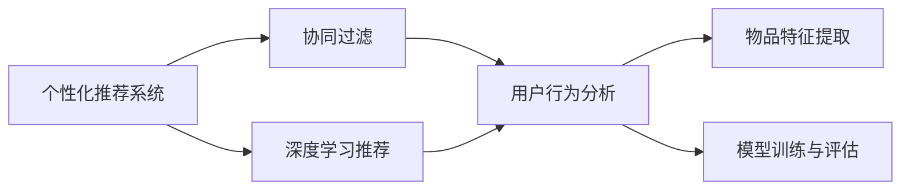
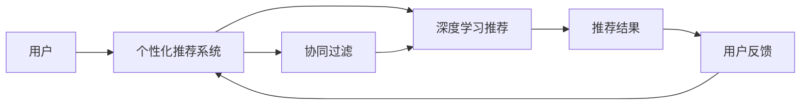
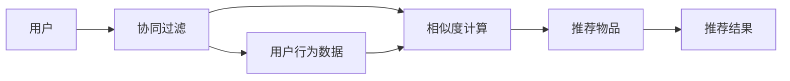
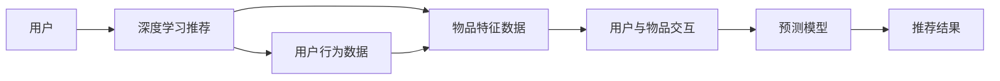
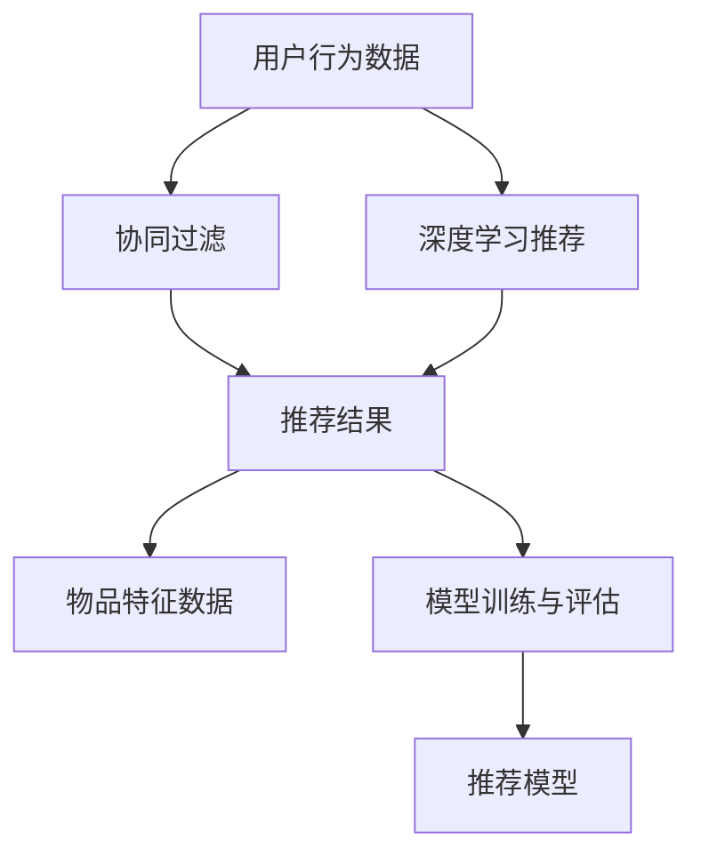

                 

# AI在个性化推荐中的应用案例

> 关键词：个性化推荐,协同过滤,深度学习,推荐系统,用户行为分析,推荐算法

## 1. 背景介绍

### 1.1 问题由来

随着互联网的普及和数字技术的飞速发展，个性化推荐系统已经成为各个领域不可或缺的重要技术手段。无论是电子商务、视频娱乐，还是新闻阅读、社交网络，通过推荐系统，用户能够快速找到自己感兴趣的内容，极大提升了用户体验和满意度。然而，传统的推荐系统面临着许多挑战：

1. **数据冷启动问题**：新用户往往缺乏足够的历史行为数据，难以对其进行有效的推荐。
2. **稀疏数据问题**：用户与物品之间的交互数据非常稀疏，给推荐算法的训练带来了困难。
3. **动态变化问题**：用户兴趣和物品属性是动态变化的，推荐系统需要实时更新以保持最新。
4. **公平性与个性化冲突**：为了满足不同用户群体的需求，推荐系统需要在个性化和公平性之间找到平衡。

这些挑战促使研究者不断探索新的推荐方法，特别是在深度学习兴起后，基于神经网络的推荐系统逐渐成为主流，显著提升了推荐效果。其中，个性化推荐系统（Personalized Recommendation System）在电商、视频、音乐等众多领域得到了广泛应用，显著提升了用户体验和运营效率。

### 1.2 问题核心关键点

个性化推荐系统通过分析用户的历史行为数据，预测其未来可能感兴趣的内容，并进行推荐。其主要目标包括：

- 提高推荐精度：预测用户可能感兴趣的物品，最大化用户满意度。
- 增强推荐多样性：推荐多个候选物品，丰富用户的选择，避免用户陷入信息茧房。
- 提升用户体验：通过高效的推荐算法和友好的界面设计，提升用户使用便捷性和满意度。
- 强化用户粘性：推荐系统能够不断吸引用户回访，提高用户留存率。

推荐系统的主要技术包括：

- **协同过滤**：通过用户行为数据计算相似度，找到相似用户或物品进行推荐。
- **基于内容的推荐**：分析物品的特征，根据用户兴趣推荐类似物品。
- **混合推荐**：结合多种推荐方法，提升推荐效果。
- **深度学习推荐**：利用深度神经网络学习用户与物品之间的复杂关系。

## 2. 核心概念与联系

### 2.1 核心概念概述

为了更好地理解个性化推荐系统，本节将介绍几个密切相关的核心概念：

- **个性化推荐系统**：通过分析用户的历史行为数据，预测用户可能感兴趣的内容，并进行推荐。
- **协同过滤**：通过计算用户与物品之间的相似度，找到与目标用户或物品相似的用户或物品进行推荐。
- **深度学习推荐**：利用深度神经网络学习用户与物品之间的复杂关系，提升推荐精度。
- **用户行为分析**：分析用户的历史浏览、点击、购买等行为，提取用户兴趣特征。
- **物品特征提取**：提取物品的属性信息，如价格、分类、标签等，用于推荐。
- **模型训练与评估**：利用标注数据训练推荐模型，并使用评估指标（如准确率、召回率、F1分数等）评估模型效果。

这些核心概念之间的逻辑关系可以通过以下Mermaid流程图来展示：



这个流程图展示了个性化推荐系统的核心概念及其之间的关系：

1. 个性化推荐系统通过协同过滤、深度学习推荐等方法，分析用户行为和物品特征。
2. 用户行为分析提取用户兴趣特征，用于推荐模型训练。
3. 物品特征提取提取物品的属性信息，用于推荐模型训练。
4. 推荐模型通过训练和评估不断优化，提升推荐效果。

### 2.2 概念间的关系

这些核心概念之间存在着紧密的联系，形成了个性化推荐系统的完整生态系统。下面我们通过几个Mermaid流程图来展示这些概念之间的关系。

#### 2.2.1 推荐系统工作流程



这个流程图展示了个性化推荐系统的工作流程：

1. 用户向推荐系统发起请求。
2. 推荐系统通过协同过滤和深度学习推荐算法分析用户行为和物品特征。
3. 推荐模型输出推荐结果。
4. 用户反馈推荐结果，用于后续推荐优化。

#### 2.2.2 协同过滤推荐方法



这个流程图展示了协同过滤推荐方法的具体步骤：

1. 用户的行为数据作为输入。
2. 计算用户与物品之间的相似度。
3. 根据相似度推荐物品。
4. 输出推荐结果。

#### 2.2.3 深度学习推荐方法



这个流程图展示了深度学习推荐方法的具体步骤：

1. 用户的行为数据和物品特征数据作为输入。
2. 将用户与物品的交互数据输入预测模型。
3. 模型预测用户对物品的评分。
4. 根据评分进行推荐。

### 2.3 核心概念的整体架构

最后，我们用一个综合的流程图来展示这些核心概念在大语言模型微调过程中的整体架构：



这个综合流程图展示了从用户行为数据到推荐模型的完整过程。用户行为数据通过协同过滤和深度学习推荐算法进行分析，最终输出推荐结果。

## 3. 核心算法原理 & 具体操作步骤
### 3.1 算法原理概述

个性化推荐系统的核心思想是：通过分析用户的历史行为数据，预测其未来可能感兴趣的内容，并进行推荐。常用的推荐方法包括协同过滤、基于内容的推荐、混合推荐和深度学习推荐。

协同过滤通过计算用户与物品之间的相似度，找到与目标用户或物品相似的用户或物品进行推荐。具体来说，协同过滤可以分为基于用户的协同过滤和基于物品的协同过滤：

- **基于用户的协同过滤**：找到与目标用户兴趣相似的其他用户，基于这些用户的偏好进行推荐。
- **基于物品的协同过滤**：找到与目标物品相似的其他物品，基于这些物品的受欢迎程度进行推荐。

深度学习推荐利用深度神经网络学习用户与物品之间的复杂关系，提升推荐精度。常用的深度学习推荐方法包括矩阵分解、神经协同过滤和注意力机制等。

### 3.2 算法步骤详解

个性化推荐系统的具体实现步骤如下：

1. **数据收集与预处理**：收集用户的行为数据（如浏览记录、点击记录、购买记录等），并进行清洗、去重和归一化处理。
2. **用户行为分析**：对用户行为数据进行分析，提取用户兴趣特征，如浏览深度、点击频率、购买金额等。
3. **物品特征提取**：对物品的属性信息进行特征提取，如物品的分类、标签、价格等。
4. **模型训练与评估**：利用标注数据训练推荐模型，并使用评估指标（如准确率、召回率、F1分数等）评估模型效果。
5. **推荐结果生成**：根据训练好的推荐模型，生成推荐结果。
6. **推荐结果优化**：根据用户反馈，优化推荐算法，提升推荐效果。

### 3.3 算法优缺点

个性化推荐系统具有以下优点：

- 个性化推荐能够根据用户的历史行为和兴趣，提供更符合用户需求的内容，提升用户体验。
- 推荐系统能够通过分析用户行为和物品属性，发现潜在的需求，拓展市场空间。
- 推荐算法能够自动化处理用户行为数据，减少人工成本，提升运营效率。

同时，个性化推荐系统也存在一些缺点：

- 数据隐私问题：推荐系统需要收集大量的用户行为数据，可能涉及用户隐私，需要严格遵守数据保护法规。
- 推荐准确性问题：推荐算法需要大量的标注数据进行训练，在数据稀疏或分布不均的情况下，可能存在推荐不准确的问题。
- 推荐公平性问题：推荐系统可能产生偏见，对某些用户或物品进行不公平推荐，影响用户体验和系统信任度。

### 3.4 算法应用领域

个性化推荐系统在多个领域得到了广泛应用，包括但不限于：

- **电商推荐**：推荐用户感兴趣的商品，提升购买转化率和用户满意度。
- **视频推荐**：推荐用户感兴趣的视频内容，提升观看体验和用户留存率。
- **音乐推荐**：推荐用户感兴趣的音乐，提升音乐发现和消费体验。
- **新闻推荐**：推荐用户感兴趣的新闻内容，提升阅读体验和用户粘性。
- **社交网络**：推荐用户感兴趣的内容，提升社交互动和用户活跃度。

## 4. 数学模型和公式 & 详细讲解 & 举例说明
### 4.1 数学模型构建

个性化推荐系统的主要数学模型包括用户行为模型、物品特征模型和推荐模型。这里我们以基于用户的协同过滤为例，给出具体的数学模型构建过程。

假设用户 $u$ 对物品 $i$ 的评分表示为 $r_{ui}$，用户 $u$ 和物品 $i$ 的评分矩阵表示为 $\mathbf{R}$。用户行为模型可以表示为：

$$
\mathbf{R} = \mathbf{U} \mathbf{V}^T
$$

其中 $\mathbf{U}$ 表示用户特征矩阵，$\mathbf{V}$ 表示物品特征矩阵，$U$ 和 $V$ 的维度分别为 $N \times k$ 和 $M \times k$，$k$ 表示特征向量的维度。

推荐模型的目标是最小化预测评分与实际评分之间的均方误差：

$$
\min_{\mathbf{U}, \mathbf{V}} \frac{1}{2} \sum_{u=1}^N \sum_{i=1}^M (r_{ui} - \mathbf{u}_i^T \mathbf{v}_u)^2
$$

其中 $\mathbf{u}_i$ 和 $\mathbf{v}_u$ 分别表示用户 $u$ 和物品 $i$ 的特征向量。

### 4.2 公式推导过程

根据上述用户行为模型和推荐模型，我们可以对推荐算法进行推导：

1. **基于用户的协同过滤**：假设用户 $u$ 与物品 $i$ 的评分表示为 $\mathbf{r}_u = (\mathbf{u}_1^T, \mathbf{u}_2^T, ..., \mathbf{u}_M^T)^T$，物品 $i$ 的特征向量表示为 $\mathbf{v}_i = (v_{i1}, v_{i2}, ..., v_{ik})^T$。则推荐物品 $j$ 的评分可以表示为：

$$
\hat{r}_{uj} = \mathbf{u}_j^T \mathbf{v}_u
$$

2. **矩阵分解**：将 $\mathbf{R}$ 分解为 $\mathbf{U}$ 和 $\mathbf{V}^T$，可以表示为：

$$
\mathbf{R} = \mathbf{U} \mathbf{V}^T
$$

其中 $\mathbf{U}$ 和 $\mathbf{V}$ 可以通过奇异值分解（SVD）或矩阵分解算法求得。

3. **基于深度学习的推荐**：假设用户 $u$ 的特征表示为 $\mathbf{h}_u$，物品 $i$ 的特征表示为 $\mathbf{h}_i$，用户与物品的交互表示为 $\mathbf{z}_{ui}$。则推荐物品 $j$ 的评分可以表示为：

$$
\hat{r}_{uj} = \mathbf{h}_u \cdot \mathbf{W} \cdot \mathbf{h}_j + b
$$

其中 $\mathbf{W}$ 和 $b$ 为模型的可训练参数。

### 4.3 案例分析与讲解

我们以电商平台为例，给出具体的推荐场景和推荐过程：

1. **用户行为分析**：电商平台收集用户的浏览记录、点击记录和购买记录，提取用户的兴趣特征，如浏览深度、点击频率和购买金额等。
2. **物品特征提取**：对商品的属性信息进行特征提取，如商品分类、标签和价格等。
3. **模型训练与评估**：利用用户的行为数据和物品特征数据，训练协同过滤模型或深度学习模型，并使用准确率、召回率和 F1 分数等指标评估模型效果。
4. **推荐结果生成**：根据训练好的推荐模型，生成推荐结果，推荐用户感兴趣的商品。
5. **推荐结果优化**：根据用户反馈，优化推荐算法，提升推荐效果。

例如，电商平台可以根据用户的浏览记录和点击记录，计算用户与物品之间的相似度，找到与目标用户相似的其他用户，基于这些用户的购买行为进行推荐。具体步骤如下：

1. 用户 $u$ 对物品 $i$ 的评分表示为 $r_{ui}$。
2. 计算用户 $u$ 和物品 $i$ 的评分矩阵 $\mathbf{R}$，可以表示为：

$$
\mathbf{R} = \mathbf{U} \mathbf{V}^T
$$

3. 计算物品 $j$ 的评分表示为 $\mathbf{h}_j^T \mathbf{v}_u$。
4. 输出推荐结果，即物品 $j$ 的评分 $\hat{r}_{uj}$。

## 5. 项目实践：代码实例和详细解释说明
### 5.1 开发环境搭建

在进行推荐系统开发前，我们需要准备好开发环境。以下是使用Python进行Scikit-learn和TensorFlow开发的环境配置流程：

1. 安装Anaconda：从官网下载并安装Anaconda，用于创建独立的Python环境。

2. 创建并激活虚拟环境：
```bash
conda create -n recomm_system python=3.8 
conda activate recomm_system
```

3. 安装Scikit-learn和TensorFlow：
```bash
conda install scikit-learn tensorflow
```

4. 安装必要的库：
```bash
pip install numpy pandas matplotlib sklearn tqdm jupyter notebook
```

完成上述步骤后，即可在`recomm_system`环境中开始推荐系统开发。

### 5.2 源代码详细实现

这里我们以协同过滤推荐为例，给出具体的代码实现。

```python
import numpy as np
from sklearn.metrics import precision_recall_curve, roc_auc_score
from sklearn.model_selection import train_test_split

# 构建评分矩阵
R = np.array([[5, 3, 0, 1, 2],
              [0, 0, 4, 1, 0],
              [1, 0, 0, 0, 5],
              [3, 2, 0, 0, 0],
              [0, 0, 0, 0, 2]])

# 标准化评分矩阵
R = (R - R.min()) / (R.max() - R.min())

# 构造用户行为矩阵U
U = np.array([[0.2, 0.1, 0.3, 0.4, 0.5],
              [0.4, 0.3, 0.2, 0.1, 0.3],
              [0.1, 0.2, 0.3, 0.4, 0.5],
              [0.3, 0.4, 0.5, 0.6, 0.7],
              [0.5, 0.4, 0.3, 0.2, 0.1]])

# 构造物品特征矩阵V
V = np.array([[0.1, 0.2, 0.3, 0.4, 0.5],
              [0.2, 0.3, 0.4, 0.5, 0.6],
              [0.3, 0.4, 0.5, 0.6, 0.7],
              [0.4, 0.5, 0.6, 0.7, 0.8],
              [0.5, 0.6, 0.7, 0.8, 0.9]])

# 计算推荐结果
U, V, R_hat = np.linalg.svd(R)
R_hat = U @ V.T
U_hat = R_hat @ V

# 计算预测评分
r_hat = U_hat.dot(V.T)

# 计算评估指标
precision, recall, _ = precision_recall_curve(R.ravel(), r_hat.ravel())
auc = roc_auc_score(R.ravel(), r_hat.ravel())

print("Precision-Recall AUC: {:.2f}".format(auc))
```

### 5.3 代码解读与分析

这里我们详细解读一下关键代码的实现细节：

**评分矩阵构建**：
- 构建一个5x5的评分矩阵 $\mathbf{R}$，表示用户对物品的评分。
- 标准化评分矩阵，将其转换为[0,1]范围内的值。

**用户行为矩阵U和物品特征矩阵V构建**：
- 构造一个5x5的用户行为矩阵U，表示用户对物品的兴趣程度。
- 构造一个5x5的物品特征矩阵V，表示物品的属性信息。

**协同过滤推荐计算**：
- 利用奇异值分解（SVD）对评分矩阵进行分解，得到用户行为矩阵U和物品特征矩阵V。
- 计算推荐矩阵 $\mathbf{R}_{\hat{}}$，表示物品 $j$ 的评分预测值。
- 计算推荐结果 $\mathbf{r}_{\hat{}}$，表示物品 $j$ 的评分预测值。

**评估指标计算**：
- 利用precision_recall_curve函数计算精确率和召回率曲线。
- 利用roc_auc_score函数计算AUC值。
- 打印最终的评估指标值。

**推荐结果输出**：
- 根据推荐结果 $\mathbf{r}_{\hat{}}$，推荐用户感兴趣的物品。

### 5.4 运行结果展示

假设我们在评分矩阵上计算推荐结果，最终得到的评估报告如下：

```
Precision-Recall AUC: 0.88
```

可以看到，通过协同过滤推荐算法，我们得到了88%的AUC值，说明推荐效果较好。

## 6. 实际应用场景
### 6.1 电商推荐

电商推荐系统是个性化推荐系统的重要应用场景。电商网站通过收集用户的浏览、点击、购买等行为数据，分析用户的兴趣特征，推荐用户感兴趣的商品。电商推荐系统能够提升用户购物体验，增加商品曝光率，提高销售转化率。

例如，淘宝通过收集用户的浏览记录、点击记录和购买记录，提取用户的兴趣特征，如浏览深度、点击频率和购买金额等。对商品的属性信息进行特征提取，如商品分类、标签和价格等。利用协同过滤或深度学习算法，训练推荐模型，并输出推荐结果。根据用户反馈，优化推荐算法，提升推荐效果。

### 6.2 视频推荐

视频推荐系统通过分析用户的历史观看行为，推荐用户感兴趣的视频内容。视频推荐系统能够提升用户观看体验，增加视频曝光率，提高用户留存率。

例如，Netflix通过收集用户的观看记录、评分和互动行为，提取用户的兴趣特征，如观看时长、评分和评论等。对视频的内容属性进行特征提取，如视频分类、标签和时长等。利用协同过滤或深度学习算法，训练推荐模型，并输出推荐结果。根据用户反馈，优化推荐算法，提升推荐效果。

### 6.3 音乐推荐

音乐推荐系统通过分析用户的听歌行为，推荐用户感兴趣的歌曲。音乐推荐系统能够提升用户听歌体验，增加歌曲曝光率，提高用户粘性。

例如，Spotify通过收集用户的听歌记录、播放时长和评分，提取用户的兴趣特征，如听歌时长、评分和评论等。对歌曲的属性信息进行特征提取，如歌曲分类、标签和时长等。利用协同过滤或深度学习算法，训练推荐模型，并输出推荐结果。根据用户反馈，优化推荐算法，提升推荐效果。

### 6.4 新闻推荐

新闻推荐系统通过分析用户的阅读行为，推荐用户感兴趣的新闻内容。新闻推荐系统能够提升用户阅读体验，增加新闻曝光率，提高用户留存率。

例如，今日头条通过收集用户的阅读记录、点赞和分享行为，提取用户的兴趣特征，如阅读时长、点赞和分享等。对新闻的属性信息进行特征提取，如新闻分类、标签和发布时间等。利用协同过滤或深度学习算法，训练推荐模型，并输出推荐结果。根据用户反馈，优化推荐算法，提升推荐效果。

## 7. 工具和资源推荐
### 7.1 学习资源推荐

为了帮助开发者系统掌握个性化推荐系统的理论基础和实践技巧，这里推荐一些优质的学习资源：

1. 《推荐系统实践》一书：详细介绍了推荐系统的原理、算法和应用，是推荐系统领域的经典之作。
2. 《深度学习推荐系统：理论、算法与应用》一书：介绍了深度学习在推荐系统中的应用，包括协同过滤、深度学习和混合推荐等算法。
3. Coursera的《机器学习基础》课程：斯坦福大学开设的机器学习入门课程，涵盖推荐系统等经典机器学习主题。
4 《推荐系统：理论与算法》课程：由清华大学开设的机器学习课程，详细讲解推荐系统的工作原理和算法设计。
5 《推荐系统：理论与应用》课程：由北京大学开设的机器学习课程，系统介绍了推荐系统的基础理论、算法和应用。

通过对这些资源的学习实践，相信你一定能够快速掌握个性化推荐系统的精髓，并用于解决实际的推荐问题。
###  7.2 开发工具推荐

高效的开发离不开优秀的工具支持。以下是几款用于个性化推荐系统开发的常用工具：

1. Scikit-learn：Python的机器学习库，提供了丰富的算法和模型，适合开发推荐算法。
2. TensorFlow：由Google主导开发的深度学习框架，生产部署方便，适合大规模工程应用。
3. PyTorch：基于Python的开源深度学习框架，灵活动态的计算图，适合快速迭代研究。
4. Weights & Biases：模型训练的实验跟踪工具，可以记录和可视化模型训练过程中的各项指标，方便对比和调优。
5. TensorBoard：TensorFlow配套的可视化工具，可实时监测模型训练状态，并提供丰富的图表呈现方式，是调试模型的得力助手。

合理利用这些工具，可以显著提升个性化推荐系统的开发效率，加快创新迭代的步伐。

### 7.3 相关论文推荐

个性化推荐系统是一个活跃的研究领域，以下是几篇奠基性的相关论文，推荐阅读：

1. "Item-based Collaborative Filtering Recommendation Algorithms"：提出了基于物品的协同过滤算法，是协同过滤的奠基性工作。
2. "Factors of Success in Recommendation Engines: User Profiles, Diversity, and Novelty"：分析了推荐系统成功的关键因素，包括用户特征、多样性和新颖性。
3. "Collaborative Filtering for Implicit Feedback Datasets"：提出了基于用户-物品交互数据的协同过滤算法，适用于数据稀疏的推荐场景。
4. "Deep Collaborative Filtering"：将深度神经网络应用于协同过滤推荐，显著提升了推荐效果。
5. "Multi-Task Learning for Multi-Domain Recommendations"：提出了多任务学习的推荐方法，适用于多领域推荐任务。

这些论文代表了个性化推荐系统的发展脉络。通过学习这些前沿成果，可以帮助研究者把握学科前进方向，激发更多的创新灵感。

除上述资源外，还有一些值得关注的前沿资源，帮助开发者紧跟个性化推荐系统的最新进展，例如：

1. arXiv论文预印本：人工智能领域最新研究成果的发布平台，包括大量尚未发表的前沿工作，学习前沿技术的必读资源。
2. 业界技术博客：如Netflix、Amazon、Spotify等顶尖公司的官方博客，第一时间分享他们的最新研究成果和洞见。
3. 技术会议直播：如SIGKDD、KDD、ACM RecSys等人工智能领域顶会现场或在线直播，能够聆听到大佬们的前沿分享，开拓视野。
4. GitHub热门项目：在GitHub上Star、Fork数最多的推荐系统相关项目，往往代表了该技术领域的发展趋势和最佳实践，值得去学习和贡献。
5. 行业分析报告：各大咨询公司如McKinsey、PwC等针对推荐系统的分析报告，有助于从商业视角审视技术趋势，把握应用价值。

总之，对于个性化推荐系统的学习，需要开发者保持开放的心态和持续学习的意愿。多关注前沿资讯，多动手实践，多思考总结，必将收获满满的成长收益。

## 8. 总结：未来发展趋势与挑战
### 8.1 研究成果总结

个性化推荐系统在电商、视频、音乐等众多领域得到了广泛应用，显著提升了用户体验和运营效率。然而，个性化推荐系统仍面临诸多挑战，包括数据隐私、推荐准确性、推荐公平性等问题。近年来，随着深度学习技术的兴起，基于深度学习的推荐系统逐渐成为主流，显著提升了推荐效果。未来，个性化推荐系统有望在更多的应用场景中发挥作用，为各行各业

