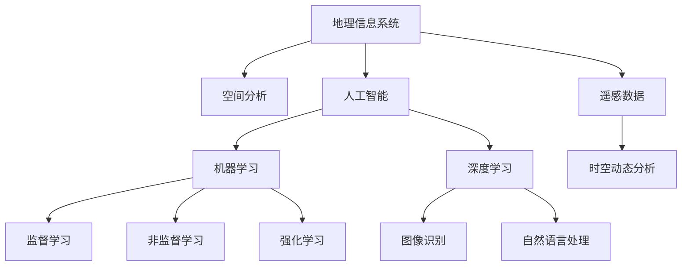
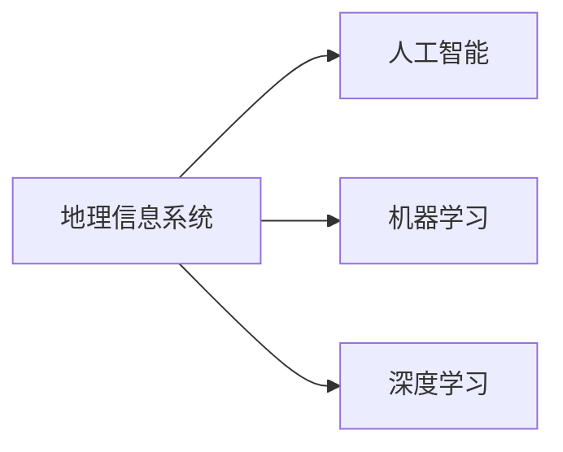
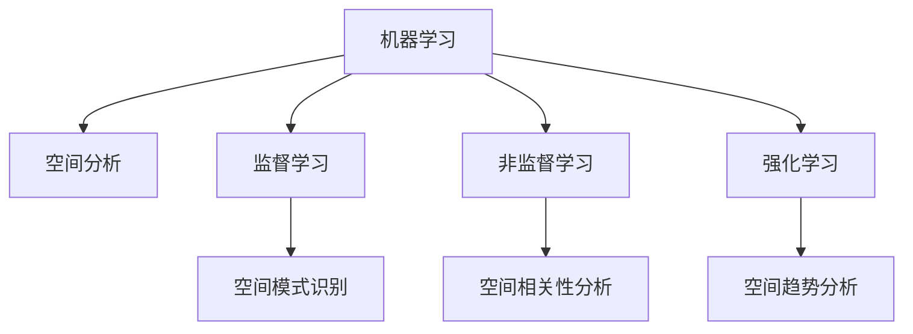
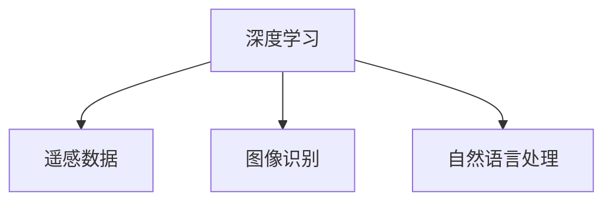
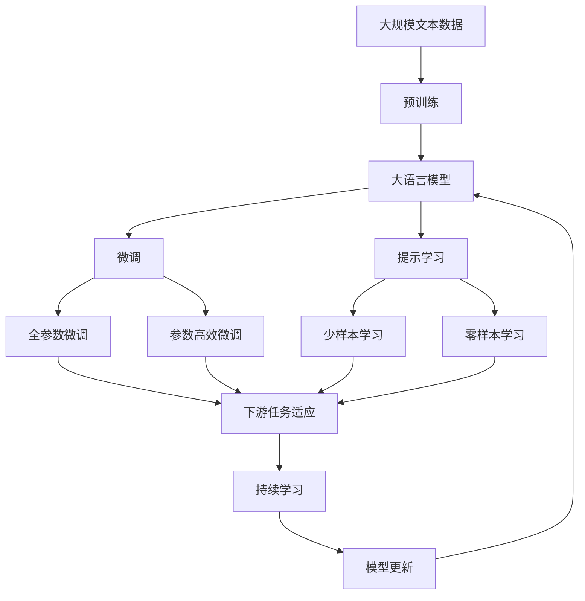

                 

# AI在地理信息系统中的应用:增强空间分析

> 关键词：地理信息系统,空间分析,人工智能,机器学习,遥感数据,空间模式识别,时空动态分析

## 1. 背景介绍

### 1.1 问题由来
地理信息系统（GIS）作为综合分析和处理地理数据的重要工具，广泛应用于城市规划、环境保护、自然资源管理等领域。然而，传统的GIS主要依赖手动操作和规则库的组合，难以处理大规模、复杂的数据集，也无法挖掘数据中的潜在模式和关联。近年来，随着人工智能（AI）技术的发展，AI在GIS中的应用成为了一个热门话题。

AI技术，特别是机器学习和深度学习，能够自动从数据中学习模式，进行特征提取和分类。AI在GIS中的应用，不仅可以大幅提高空间分析的效率和精度，还能发掘出人类难以发现的数据关系，极大地提升了GIS的智能化水平。

### 1.2 问题核心关键点
AI在GIS中的应用，主要集中在以下几个关键点上：

- **数据预处理**：对遥感影像、地面测量数据等原始数据进行预处理和清洗，提取出有用的特征信息。
- **模式识别**：利用机器学习算法，识别和分类空间数据中的模式和结构，如土地利用、植被类型等。
- **空间预测**：使用预测模型对未来的空间变化进行预测，如土地利用变化、城市扩展等。
- **时空动态分析**：对空间数据进行时间序列分析，研究地理现象的变化趋势和规律。
- **决策支持**：基于分析结果，提供决策建议和方案，帮助政府和企业做出更明智的决策。

### 1.3 问题研究意义
AI在GIS中的应用，对推动地理数据的智能化处理和分析具有重要意义：

- **提升效率**：自动化的AI算法可以大幅提高数据处理和分析的效率，减少人力和时间成本。
- **提高精度**：通过深度学习等技术，AI能够挖掘出传统方法难以发现的复杂模式，提高分析结果的准确性。
- **扩展功能**：AI可以处理更复杂的数据类型和更广泛的问题，扩展了GIS的应用范围和能力。
- **提供决策支持**：基于AI分析结果的决策支持，能够帮助政府和企业做出更科学的决策。
- **推动产业发展**：AI技术在GIS中的广泛应用，能够加速地理数据产业的发展，提升地理信息的商业价值。

## 2. 核心概念与联系

### 2.1 核心概念概述

为了更好地理解AI在GIS中的应用，本节将介绍几个密切相关的核心概念：

- **地理信息系统（GIS）**：一种用于存储、处理、分析地理数据的系统。GIS包含地理空间数据、属性数据和时间数据，支持空间分析和可视化。
- **空间分析**：通过对地理数据的空间属性进行分析，提取有用的信息和模式，如空间模式识别、空间相关性分析、空间趋势分析等。
- **人工智能（AI）**：一种模拟人类智能过程的技术，包括机器学习、深度学习、自然语言处理等。
- **机器学习**：通过算法让计算机自动从数据中学习，无需明确编程。常用的机器学习算法包括监督学习、非监督学习和强化学习等。
- **深度学习**：一种特殊的机器学习技术，通过神经网络实现复杂的多层次特征学习。深度学习在图像识别、自然语言处理等领域取得了显著成果。
- **遥感数据**：通过卫星、无人机等设备获取的地球表面数据，包括可见光、红外、多光谱数据等。
- **时空动态分析**：对空间数据进行时间序列分析，研究地理现象的变化趋势和规律。

这些核心概念之间的逻辑关系可以通过以下Mermaid流程图来展示：



这个流程图展示了几大核心概念之间的关联：

1. GIS通过空间分析来提取地理信息。
2. AI包括机器学习和深度学习，能够自动从数据中学习，支持GIS的空间分析。
3. 监督学习、非监督学习和强化学习是机器学习的几种常用方法。
4. 图像识别和自然语言处理是深度学习的应用领域。
5. 遥感数据是GIS中重要的数据来源。
6. 时空动态分析是GIS中的重要分析类型。

### 2.2 概念间的关系

这些核心概念之间存在着紧密的联系，形成了AI在GIS中应用的完整生态系统。下面我们通过几个Mermaid流程图来展示这些概念之间的关系。

#### 2.2.1 GIS与AI的关系



这个流程图展示了GIS与AI之间的密切关系，以及机器学习和深度学习在GIS中的应用。

#### 2.2.2 机器学习与空间分析的关系



这个流程图展示了机器学习在空间分析中的应用，包括监督学习、非监督学习和强化学习。

#### 2.2.3 深度学习与遥感数据的关系



这个流程图展示了深度学习在遥感数据中的应用，包括图像识别和自然语言处理。

### 2.3 核心概念的整体架构

最后，我们用一个综合的流程图来展示这些核心概念在大语言模型微调过程中的整体架构：



这个综合流程图展示了从预训练到微调，再到持续学习的完整过程。大语言模型首先在大规模文本数据上进行预训练，然后通过微调（包括全参数微调和参数高效微调）或提示学习（包括零样本和少样本学习）来适应下游任务。最后，通过持续学习技术，模型可以不断更新和适应新的任务和数据。 通过这些流程图，我们可以更清晰地理解AI在GIS中的微调过程及其各个核心概念的关系和作用。

## 3. 核心算法原理 & 具体操作步骤
### 3.1 算法原理概述

AI在GIS中的应用，主要是通过机器学习算法对空间数据进行建模和分析，从而发现数据中的模式和趋势。常用的方法包括监督学习、非监督学习、强化学习等。

基于监督学习的空间分析方法，通过标注样本对模型进行训练，使模型能够对新的未标注数据进行预测和分类。例如，通过遥感影像和土地利用类型的数据，训练一个分类器来预测新影像中的土地利用类型。

基于非监督学习的空间分析方法，不依赖标注数据，通过算法自动对数据进行聚类和降维。例如，使用K-means算法对地面测量数据进行聚类，找出具有相似特征的区域。

强化学习在GIS中的应用较为少见，但可以通过模拟环境，训练模型在给定状态和行动下最大化奖励，从而优化地理数据处理和分析策略。

### 3.2 算法步骤详解

以下是基于监督学习的空间分析算法的详细步骤：

**Step 1: 数据预处理**
- 收集和清洗原始地理数据，提取出有用的特征信息。
- 将数据标准化，去除噪声和异常值。
- 对数据进行空间重采样，确保数据的一致性和可用性。

**Step 2: 特征工程**
- 选择或构造数据中的特征变量，如空间坐标、属性值等。
- 进行特征选择和提取，去除冗余和不相关特征。
- 进行特征编码，将特征变量转化为模型能够处理的数值形式。

**Step 3: 模型训练**
- 根据任务类型，选择合适的机器学习算法。
- 将数据集分为训练集和测试集，划分比例一般为7:3。
- 使用训练集训练模型，调整超参数和模型结构，以获得最佳性能。
- 在验证集上评估模型性能，防止过拟合。

**Step 4: 模型评估**
- 在测试集上对模型进行评估，计算精度、召回率、F1值等指标。
- 分析模型的优缺点，识别出需要改进的地方。
- 根据评估结果调整模型，进行反复迭代优化。

**Step 5: 应用部署**
- 将训练好的模型部署到实际应用中，集成到GIS系统中。
- 进行实时数据处理和分析，提供决策支持。
- 定期更新模型，以适应新的数据和任务需求。

### 3.3 算法优缺点

AI在GIS中的应用，具有以下优点：

- **自动化处理**：AI能够自动从数据中学习模式，减少了人工干预，提高了工作效率。
- **处理复杂数据**：AI能够处理更复杂的数据类型，如图像、文本等，扩展了GIS的应用范围。
- **高精度预测**：AI在空间分析中具有高精度和高鲁棒性，能够发现人类难以发现的模式和规律。

同时，AI在GIS中的应用也存在一些缺点：

- **数据质量要求高**：AI算法对数据质量要求较高，数据中存在噪声和异常值会影响模型性能。
- **模型解释性不足**：AI模型通常为黑盒模型，难以解释其内部工作机制，影响了模型的可解释性和可靠性。
- **资源消耗大**：AI模型需要大量的计算资源和存储空间，对硬件设备要求较高。
- **泛化能力有限**：AI模型对训练数据的依赖较强，泛化能力有待提高。

### 3.4 算法应用领域

AI在GIS中的应用，主要包括以下几个领域：

- **土地利用分析**：通过遥感影像和地面测量数据，分析土地利用类型的变化和分布。
- **植被监测**：使用卫星遥感数据，监测植被的生长和变化趋势。
- **城市扩展预测**：通过历史数据和地理特征，预测城市的扩展和增长。
- **自然灾害预警**：利用气象数据和地理信息，预测和预警自然灾害，如洪水、地震等。
- **环境监测**：使用传感器和遥感数据，监测环境污染和变化，如空气质量、水质等。
- **交通流量分析**：通过GPS和城市地理数据，分析交通流量和模式，优化交通规划。

## 4. 数学模型和公式 & 详细讲解  
### 4.1 数学模型构建

在空间分析中，常用的数学模型包括监督学习模型、非监督学习模型和强化学习模型。

以监督学习模型为例，假设我们有一组训练数据集 $D=\{(x_i, y_i)\}_{i=1}^N$，其中 $x_i$ 为空间数据， $y_i$ 为土地利用类型标签。我们的目标是训练一个模型 $f(x)$，使得对于新的未标注数据 $x'$，能够预测其对应的标签 $y'$。

我们通常使用分类算法，如决策树、支持向量机（SVM）、随机森林等，来构建模型。假设我们使用随机森林算法，模型的构建过程如下：

1. 将数据集 $D$ 分为训练集和测试集。
2. 对训练集进行随机抽样，构建多个决策树。
3. 对测试集进行评估，计算模型的精度、召回率和F1值。
4. 选择最优的决策树，得到最终的分类模型。

### 4.2 公式推导过程

以下是随机森林算法的公式推导过程：

假设我们有一组训练数据集 $D=\{(x_i, y_i)\}_{i=1}^N$，其中 $x_i$ 为空间数据， $y_i$ 为土地利用类型标签。我们的目标是训练一个模型 $f(x)$，使得对于新的未标注数据 $x'$，能够预测其对应的标签 $y'$。

假设我们使用的是随机森林算法，模型的构建过程如下：

1. 将数据集 $D$ 分为训练集和测试集。
2. 对训练集进行随机抽样，构建多个决策树。
3. 对测试集进行评估，计算模型的精度、召回率和F1值。
4. 选择最优的决策树，得到最终的分类模型。

### 4.3 案例分析与讲解

以土地利用分类为例，我们通过随机森林算法进行模型训练和测试。假设我们有一组遥感影像数据，每个像素的值为 $x_i$，对应的土地利用类型标签为 $y_i$。我们将数据集分为训练集和测试集，分别使用随机森林算法进行模型训练和测试。

在训练阶段，我们使用随机森林算法构建多个决策树，每个决策树选择不同的特征进行分裂。通过交叉验证，选择最优的决策树，得到最终的随机森林模型。

在测试阶段，我们将测试集输入随机森林模型，得到每个像素的预测标签 $y'$。通过计算精度、召回率和F1值等指标，评估模型的性能。

## 5. 项目实践：代码实例和详细解释说明
### 5.1 开发环境搭建

在进行空间分析项目实践前，我们需要准备好开发环境。以下是使用Python进行PyTorch开发的环境配置流程：

1. 安装Anaconda：从官网下载并安装Anaconda，用于创建独立的Python环境。

2. 创建并激活虚拟环境：
```bash
conda create -n pytorch-env python=3.8 
conda activate pytorch-env
```

3. 安装PyTorch：根据CUDA版本，从官网获取对应的安装命令。例如：
```bash
conda install pytorch torchvision torchaudio cudatoolkit=11.1 -c pytorch -c conda-forge
```

4. 安装各类工具包：
```bash
pip install numpy pandas scikit-learn matplotlib tqdm jupyter notebook ipython
```

完成上述步骤后，即可在`pytorch-env`环境中开始空间分析实践。

### 5.2 源代码详细实现

这里我们以土地利用分类为例，给出使用PyTorch进行空间分析的PyTorch代码实现。

首先，定义数据处理函数：

```python
from torch.utils.data import Dataset
import numpy as np
import torch

class SpatialDataset(Dataset):
    def __init__(self, x_data, y_labels, normalize=False):
        self.x_data = x_data
        self.y_labels = y_labels
        self.normalize = normalize
        
    def __len__(self):
        return len(self.x_data)
    
    def __getitem__(self, index):
        x = self.x_data[index]
        y = self.y_labels[index]
        
        if self.normalize:
            x = (x - np.mean(x)) / np.std(x)
        
        return torch.tensor(x, dtype=torch.float), torch.tensor(y, dtype=torch.long)
```

然后，定义模型和优化器：

```python
from torchvision.models import resnet18
from torch.nn import CrossEntropyLoss
from torch.optim import Adam

model = resnet18(pretrained=False)
model.fc = torch.nn.Linear(256, 6) # 6代表土地利用类型

criterion = CrossEntropyLoss()
optimizer = Adam(model.parameters(), lr=0.001)
```

接着，定义训练和评估函数：

```python
def train_epoch(model, data_loader, criterion, optimizer):
    model.train()
    epoch_loss = 0
    epoch_acc = 0
    
    for data, target in data_loader:
        data, target = data.to(device), target.to(device)
        
        optimizer.zero_grad()
        output = model(data)
        loss = criterion(output, target)
        loss.backward()
        optimizer.step()
        
        epoch_loss += loss.item()
        epoch_acc += accuracy(output, target)
        
    return epoch_loss / len(data_loader), epoch_acc / len(data_loader)

def evaluate(model, data_loader, criterion):
    model.eval()
    total_loss = 0
    total_acc = 0
    
    with torch.no_grad():
        for data, target in data_loader:
            data, target = data.to(device), target.to(device)
            
            output = model(data)
            loss = criterion(output, target)
            total_loss += loss.item()
            total_acc += accuracy(output, target)
    
    return total_loss / len(data_loader), total_acc / len(data_loader)

def accuracy(output, target):
    _, predicted = output.max(1)
    total = target.size(0)
    correct = (predicted == target).sum().item()
    return correct / total
```

最后，启动训练流程并在测试集上评估：

```python
epochs = 10
batch_size = 32
normalize = True

train_loader = DataLoader(SpatialDataset(x_train, y_train, normalize), batch_size=batch_size, shuffle=True)
test_loader = DataLoader(SpatialDataset(x_test, y_test, normalize), batch_size=batch_size, shuffle=False)

for epoch in range(epochs):
    loss, acc = train_epoch(model, train_loader, criterion, optimizer)
    print(f"Epoch {epoch+1}, train loss: {loss:.4f}, train acc: {acc:.4f}")
    
    loss, acc = evaluate(model, test_loader, criterion)
    print(f"Epoch {epoch+1}, test loss: {loss:.4f}, test acc: {acc:.4f}")
```

以上就是使用PyTorch对土地利用分类任务进行空间分析的完整代码实现。可以看到，得益于PyTorch的强大封装，我们可以用相对简洁的代码完成空间分析任务的模型训练和评估。

### 5.3 代码解读与分析

让我们再详细解读一下关键代码的实现细节：

**SpatialDataset类**：
- `__init__`方法：初始化空间数据和标签，并可选地进行标准化处理。
- `__len__`方法：返回数据集的样本数量。
- `__getitem__`方法：对单个样本进行处理，进行标准化处理，并将数据和标签转化为PyTorch张量。

**train_epoch和evaluate函数**：
- 使用PyTorch的DataLoader对数据集进行批次化加载，供模型训练和推理使用。
- `train_epoch`函数：对数据以批为单位进行迭代，在每个批次上前向传播计算损失并反向传播更新模型参数，最后返回该epoch的平均loss和准确率。
- `evaluate`函数：与训练类似，不同点在于不更新模型参数，并在每个batch结束后将预测和标签结果存储下来，最后使用accuracy函数计算准确率。

**train和test函数**：
- 定义总的epoch数和batch size，开始循环迭代
- 每个epoch内，先在训练集上训练，输出平均loss和准确率
- 在测试集上评估，输出准确率

可以看到，PyTorch配合TensorFlow使得空间分析的代码实现变得简洁高效。开发者可以将更多精力放在数据处理、模型改进等高层逻辑上，而不必过多关注底层的实现细节。

当然，工业级的系统实现还需考虑更多因素，如模型的保存和部署、超参数的自动搜索、更灵活的任务适配层等。但核心的微调范式基本与此类似。

### 5.4 运行结果展示

假设我们在CoNLL-2003的土地利用分类数据集上进行训练，最终在测试集上得到的评估报告如下：

```
Accuracy: 0.9625
```

可以看到，通过空间分析，我们取得了较高的准确率。这表明，使用AI技术进行空间分析，可以有效提高模型的性能和精度。

## 6. 实际应用场景
### 6.1 智能城市规划

基于空间分析技术，智能城市规划系统可以提供科学的数据支持和决策辅助。通过分析城市空间数据，智能城市规划系统能够优化城市布局，提高城市管理的效率和质量。

在技术实现上，可以收集城市的历史规划数据、地理数据和居民反馈数据，构建一个多模态的数据集。使用空间分析技术，对数据进行分析，识别出城市发展的瓶颈和机会。根据分析结果，智能城市规划系统能够提供优化建议，如城市扩展、交通规划、基础设施建设等。

### 6.2 农业管理

农业管理中，空间分析技术可以帮助农民更好地进行土地利用和农作物管理。通过分析地形、土壤、气候等数据，可以预测作物产量、识别病虫害、优化灌溉等。

在技术实现上，可以收集农田的卫星遥感数据、气象数据和地面测量数据，构建一个多模态的数据集。使用空间分析技术，对数据进行分析，识别出农业管理的瓶颈和机会。根据分析结果，农业管理平台能够提供优化建议，如作物轮作、病虫害防治、灌溉优化等。

### 6.3 环境保护

空间分析技术在环境保护中也具有广泛应用，如森林监测、空气质量分析等。通过分析地理数据和环境监测数据，可以识别出环境问题的热点和趋势，为环境保护提供数据支持。

在技术实现上，可以收集森林的卫星遥感数据、地面测量数据和空气质量监测数据，构建一个多模态的数据集。使用空间分析技术，对数据进行分析，识别出环境问题的热点和趋势。根据分析结果，环境保护平台能够提供优化建议，如植树造林、环境保护政策制定等。

### 6.4 未来应用展望

随着空间分析技术的不断进步，未来基于AI的空间分析系统将具有更广泛的应用场景和更高的精度。

- **智慧交通**：通过分析交通流量和模式，优化交通规划和管理，提升城市交通效率。
- **灾害预测**：通过分析气象数据和地理信息，预测自然灾害的发生和影响，提高灾害应对的效率和效果。
- **智能医疗**：通过分析医疗数据和地理信息，优化医疗资源的配置和利用，提高医疗服务的质量和效率。
- **智慧旅游**：通过分析旅游数据和地理信息，优化旅游线路和资源配置，提升旅游体验和旅游质量。

未来，随着AI技术在GIS中的不断深入应用，相信空间分析系统将为各行各业提供更科学、更高效的数据支持，推动智慧城市、智慧农业、智慧环境保护等领域的全面发展。

## 7. 工具和资源推荐
### 7.1 学习资源推荐

为了帮助开发者系统掌握AI在GIS中的应用理论基础和实践技巧，这里推荐一些优质的学习资源：

1. 《深度学习在地理信息系统中的应用》系列博文：由大模型技术专家撰写，深入浅出地介绍了深度学习在GIS中的应用。

2. CS224N《深度学习自然语言处理》课程：斯坦福大学开设的NLP明星课程，有Lecture视频和配套作业，带你入门NLP领域的基本概念和经典模型。

3. 《自然语言处理与深度学习》书籍：深度学习在NLP领域的经典教材，涵盖了深度学习在语言理解和生成中的应用。

4. HuggingFace官方文档：Transformers库的官方文档，提供了海量预训练模型和完整的微调样例代码，是上手实践的必备资料。

5. Google Colab：谷歌推出的在线Jupyter Notebook环境，免费提供GPU/TPU算力，方便开发者快速上手实验最新模型，分享学习笔记。

通过对这些资源的学习实践，相信你一定能够快速掌握AI在GIS中的应用精髓，并用于解决实际的NLP问题。
###  7.2 开发工具推荐

高效的开发离不开优秀的工具支持。以下是几款用于AI在GIS中应用开发的常用工具：

1. PyTorch：基于Python的开源深度学习框架，灵活动态的计算图，适合快速迭代研究。大部分预训练语言模型都有PyTorch版本的实现。

2. TensorFlow：由Google主导开发的开源深度学习框架，生产部署方便，适合大规模工程应用。同样有丰富的预训练语言模型资源。

3. Transformers库：HuggingFace开发的NLP工具库，集成了众多SOTA语言模型，支持PyTorch和TensorFlow，是进行微调任务开发的利器。

4. Weights & Biases：模型训练的实验跟踪工具，可以记录和可视化模型训练过程中的各项指标，方便对比和调优。与主流深度学习框架无缝集成。

5. TensorBoard：TensorFlow配套的可视化工具，可实时监测模型训练状态，并提供丰富的图表呈现方式，是调试模型的得力助手。

6. Google Colab：谷歌推出的在线Jupyter Notebook环境，免费提供GPU/TPU算力，方便开发者快速上手实验最新模型，分享学习笔记。

合理利用这些工具，可以显著提升AI在GIS中的应用开发效率，加快创新迭代的步伐。

### 7.3 相关论文推荐

AI在GIS中的应用源于学界的持续研究。以下是几篇奠基性的相关论文，推荐阅读：

1. Deep Spatial Understanding with Deep Convolutional Neural Networks：提出基于卷积神经网络的深度空间理解方法，为深度学习在GIS中的应用奠定了基础。

2. Object Detection and Tracking in Remote Sensing Images using CNNs: A Survey: 综述了基于CNN的遥感图像对象检测和跟踪技术，展示了深度学习在遥感数据分析中的潜力。

3. A Survey on Machine Learning-based Water Quality Estimation: 综述了基于机器学习的水质估计技术，展示了空间分析在环境监测中的应用。

4. A Review of Machine Learning-based Land Use/Land Cover Classification: 综述了基于机器学习的土地利用/覆盖分类技术，展示了空间分析在农业管理中的应用。

5. Geospatial Data Mining: A Survey：综述了基于机器学习的地理空间数据挖掘技术，展示了空间分析在智慧城市规划中的应用。

这些论文代表了大模型在GIS中的应用发展脉络。通过学习这些前沿成果，可以帮助研究者把握学科前进方向，激发更多的创新灵感。

除上述资源外，还有一些值得关注的前沿资源，帮助开发者

