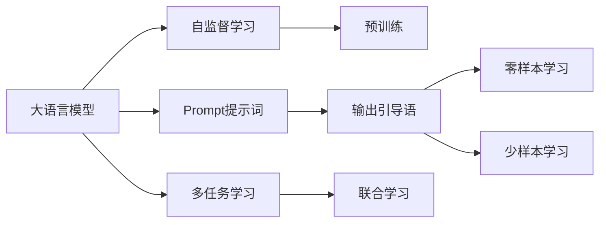
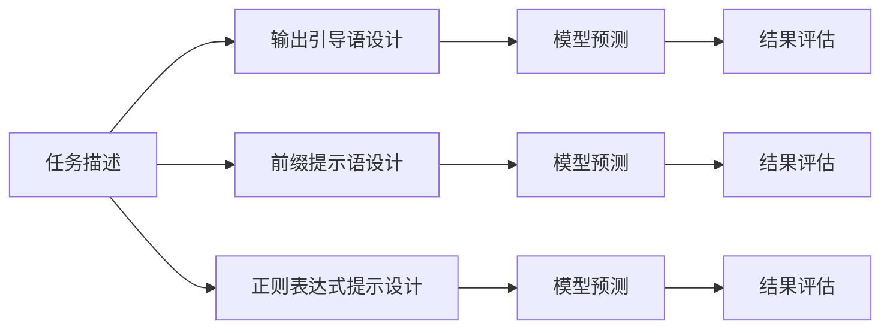
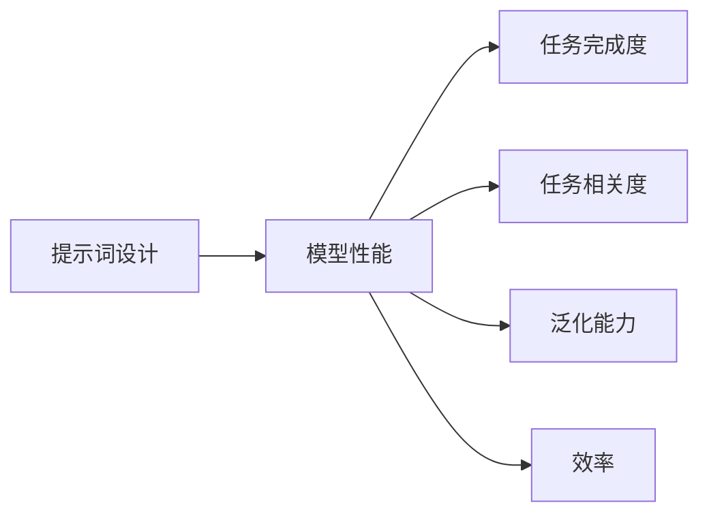
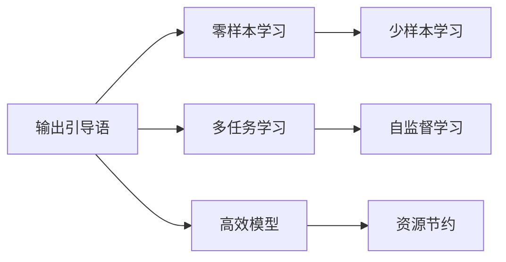

                 

# AI大模型Prompt提示词最佳实践：使用输出引导语

> 关键词：大语言模型,Prompt提示词,输出引导语,零样本学习,少样本学习,自监督学习

## 1. 背景介绍

### 1.1 问题由来
在自然语言处理(Natural Language Processing, NLP)领域，大语言模型如BERT、GPT等已经展现出了令人瞩目的能力，能够在理解和生成语言方面表现优异。然而，大模型的直接使用往往需要大量的标注数据和计算资源，这在很多应用场景中是不可行的。为了解决这个问题，研究人员开发出了基于提示词（Prompt）的技术，即在模型的输入中添加特定的提示词，引导模型生成符合预期格式的输出。这种技术被广泛应用于零样本学习、少样本学习和多任务学习中，尤其在资源有限的场景中，可以显著提升模型的表现。

### 1.2 问题核心关键点
Prompt技术的核心在于如何设计有效的提示词，以最小化对标注数据的依赖，同时最大化模型的生成能力。常见的Prompt设计方法包括输出引导语（Output-prompt）、前缀提示语（Prefix-prompt）、正则表达式提示（Regex-prompt）等。本文章重点探讨输出引导语在Prompt技术中的应用，并详细分析其优缺点及应用领域。

### 1.3 问题研究意义
Prompt技术的使用可以显著降低NLP任务的开发成本和资源消耗，同时提升模型在特定任务上的性能。尤其是输出引导语，因其简单、高效的特点，成为了广泛应用的一种Prompt设计方法。通过合理的输出引导语，可以实现零样本和少样本学习，加速模型在实际应用场景中的部署和优化。因此，深入理解和应用输出引导语，对于提升NLP技术的应用效果和推广具有重要意义。

## 2. 核心概念与联系

### 2.1 核心概念概述

为更好地理解输出引导语在大语言模型中的应用，本节将介绍几个密切相关的核心概念：

- **大语言模型(Large Language Model, LLM)**：以自回归(如GPT)或自编码(如BERT)模型为代表的大规模预训练语言模型。通过在大规模无标签文本语料上进行预训练，学习通用的语言知识和表示。

- **Prompt提示词**：在模型输入中添加的特定文本序列，用于引导模型生成符合预期格式的输出。常见的Prompt包括输出引导语、前缀提示语、正则表达式提示等。

- **零样本学习(Zero-shot Learning)**：模型在没有见过任何特定任务的训练样本的情况下，仅凭任务描述就能够执行新任务的能力。

- **少样本学习(Few-shot Learning)**：模型在只有少量标注样本的情况下，能够快速适应新任务。

- **自监督学习(Self-supervised Learning)**：使用无标签数据进行训练，通过设计特定的自监督任务，让模型自主学习语言的表示。

这些概念之间的逻辑关系可以通过以下Mermaid流程图来展示：



这个流程图展示了核心概念之间的关联关系：

1. 大语言模型通过自监督学习任务进行预训练，学习到通用的语言表示。
2. 预训练后的模型可以接收Prompt提示词，进行零样本和少样本学习。
3. Prompt提示词设计可以包含输出引导语，用于指定模型的输出格式。
4. 通过输出引导语，可以实现零样本和少样本学习，适用于不同任务。
5. 大语言模型还可以进行多任务学习和联合学习，进一步提升模型性能。

### 2.2 概念间的关系

这些核心概念之间存在着紧密的联系，形成了Prompt技术的应用生态系统。下面我通过几个Mermaid流程图来展示这些概念之间的关系。

#### 2.2.1 Prompt提示词设计流程



这个流程图展示了Prompt提示词设计的流程：

1. 根据任务描述设计输出引导语、前缀提示语或正则表达式提示。
2. 使用设计好的Prompt提示词进行模型预测。
3. 对预测结果进行评估，调整Prompt设计。

#### 2.2.2 Prompt提示词的评价指标



这个流程图展示了Prompt提示词评价的指标：

1. 提示词设计需要考虑模型的性能。
2. 任务完成度、任务相关度和泛化能力是主要的评价指标。
3. 效率也是重要的评价指标，尤其是在资源受限的场景下。

#### 2.2.3 输出引导语的优势



这个流程图展示了输出引导语的优势：

1. 输出引导语支持零样本和少样本学习。
2. 可以与多任务学习和自监督学习结合使用。
3. 输出引导语可以设计高效的模型，节约资源。

### 2.3 核心概念的整体架构

最后，我们用一个综合的流程图来展示这些核心概念在大语言模型Prompt技术中的应用：


这个综合流程图展示了从自监督学习到Prompt技术应用的全过程。大语言模型通过自监督学习任务进行预训练，然后设计Prompt提示词，其中输出引导语用于指定模型的输出格式，支持零样本和少样本学习，并可以与多任务学习和自监督学习结合使用，最后通过联合学习进一步提升模型性能。

## 3. 核心算法原理 & 具体操作步骤
### 3.1 算法原理概述

使用输出引导语的大语言模型微调，本质上是一种基于Prompt提示词的零样本和少样本学习方法。其核心思想是：在模型输入中添加特定的输出引导语，引导模型生成符合预期格式的输出，从而实现对特定任务的推理和生成。输出引导语通常包括任务名称、输入数据格式、输出结果格式等信息，模型根据这些信息进行推理生成。

形式化地，设模型 $M_{\theta}$ 在输入 $x$ 上的输出为 $\hat{y}=M_{\theta}(x) \in [0,1]$，表示样本属于正类的概率。真实标签 $y \in \{0,1\}$。则零样本输出引导语 $P$ 定义为：

$$
P = "Task: <task_name>\nInput: <input_data>\nOutput: <output_format>"
$$

其中 $<task_name>$ 为任务名称，$<input_data>$ 为输入数据的格式描述，$<output_format>$ 为期望的输出格式。

通过设计合适的输出引导语 $P$，模型 $M_{\theta}$ 可以自动完成相应的任务，无需额外的标注数据。

### 3.2 算法步骤详解

基于输出引导语的大语言模型微调一般包括以下几个关键步骤：

**Step 1: 设计输出引导语**

- 根据具体任务，设计合适的输出引导语。输出引导语应包含任务名称、输入数据格式、输出结果格式等信息。

**Step 2: 加载预训练模型**

- 加载目标预训练模型，如BERT、GPT等，作为初始化参数。

**Step 3: 编码输入数据**

- 将输入数据按照输出引导语格式编码，生成模型的输入序列。

**Step 4: 训练模型**

- 使用包含标注数据的训练集进行模型训练，最小化损失函数 $\mathcal{L}(M_{\theta},D)$，其中 $D$ 为训练数据集。

**Step 5: 评估模型**

- 在验证集和测试集上评估模型性能，选择最优的模型参数 $\hat{\theta}$。

**Step 6: 应用模型**

- 使用微调后的模型对新数据进行预测，生成符合输出引导语格式的输出。

### 3.3 算法优缺点

使用输出引导语的微调方法具有以下优点：

- **零样本学习能力**：无需标注数据，即可进行任务推理和生成。
- **高效**：模型训练和推理过程简单，资源消耗低。
- **泛化能力**：模型可以在新任务上快速适应，泛化能力强。

同时，该方法也存在一些缺点：

- **提示词设计复杂**：需要根据具体任务设计合适的输出引导语，设计复杂。
- **依赖于预训练模型**：需要选择合适的预训练模型，效果受预训练模型质量影响。
- **输出格式限制**：输出引导语设计不当，可能限制模型的生成能力。

### 3.4 算法应用领域

输出引导语在大语言模型的微调中，已经被广泛应用于各种NLP任务，例如：

- 文本分类：如情感分析、主题分类、意图识别等。通过输出引导语指定模型输出标签，无需标注数据。
- 命名实体识别：识别文本中的人名、地名、机构名等特定实体。通过输出引导语指定模型输出实体边界和类型。
- 关系抽取：从文本中抽取实体之间的语义关系。通过输出引导语指定模型输出关系三元组。
- 问答系统：对自然语言问题给出答案。通过输出引导语指定模型输出问题回答。
- 机器翻译：将源语言文本翻译成目标语言。通过输出引导语指定模型输出翻译结果。
- 文本摘要：将长文本压缩成简短摘要。通过输出引导语指定模型输出摘要内容。
- 对话系统：使机器能够与人自然对话。通过输出引导语指定模型输出对话回复。

除了上述这些经典任务外，输出引导语在大语言模型中的应用还拓展到了更多场景中，如可控文本生成、常识推理、代码生成、数据增强等，为NLP技术带来了全新的突破。

## 4. 数学模型和公式 & 详细讲解  
### 4.1 数学模型构建

本节将使用数学语言对基于输出引导语的大语言模型微调过程进行更加严格的刻画。

设预训练语言模型为 $M_{\theta}$，输出引导语为 $P$，训练数据集为 $D=\{(x_i,y_i)\}_{i=1}^N$，其中 $x_i$ 为输入数据，$y_i$ 为输出数据。

定义模型 $M_{\theta}$ 在输入 $x$ 上的输出为 $\hat{y}=M_{\theta}(x) \in [0,1]$，表示样本属于正类的概率。真实标签 $y \in \{0,1\}$。则零样本输出引导语 $P$ 定义为：

$$
P = "Task: <task_name>\nInput: <input_data>\nOutput: <output_format>"
$$

其中 $<task_name>$ 为任务名称，$<input_data>$ 为输入数据的格式描述，$<output_format>$ 为期望的输出格式。

假设模型 $M_{\theta}$ 在输入 $x$ 上的输出为 $\hat{y}=M_{\theta}(x) \in [0,1]$，表示样本属于正类的概率。真实标签 $y \in \{0,1\}$。则零样本输出引导语 $P$ 定义为：

$$
P = "Task: <task_name>\nInput: <input_data>\nOutput: <output_format>"
$$

其中 $<task_name>$ 为任务名称，$<input_data>$ 为输入数据的格式描述，$<output_format>$ 为期望的输出格式。

### 4.2 公式推导过程

以下我们以情感分析任务为例，推导零样本输出引导语 $P$ 及其梯度的计算公式。

假设模型 $M_{\theta}$ 在输入 $x$ 上的输出为 $\hat{y}=M_{\theta}(x) \in [0,1]$，表示样本属于正类的概率。真实标签 $y \in \{0,1\}$。则零样本输出引导语 $P$ 定义为：

$$
P = "Task: sentiment analysis\nInput: [sentence]\nOutput: positive or negative"
$$

其中 $[sentence]$ 为输入文本，"positive or negative" 为期望的输出。

根据链式法则，输出引导语 $P$ 对模型参数 $\theta_k$ 的梯度为：

$$
\frac{\partial \mathcal{L}(\theta)}{\partial \theta_k} = \frac{\partial \mathcal{L}(\theta)}{\partial \hat{y}} \frac{\partial \hat{y}}{\partial \theta_k}
$$

其中 $\frac{\partial \mathcal{L}(\theta)}{\partial \hat{y}}$ 为模型输出与真实标签之间的梯度，$\frac{\partial \hat{y}}{\partial \theta_k}$ 为模型参数 $\theta_k$ 对输出的影响。

在得到输出引导语梯度后，即可带入模型训练公式，完成模型的迭代优化。

## 5. 项目实践：代码实例和详细解释说明
### 5.1 开发环境搭建

在进行Prompt提示词设计的实践前，我们需要准备好开发环境。以下是使用Python进行PyTorch开发的环境配置流程：

1. 安装Anaconda：从官网下载并安装Anaconda，用于创建独立的Python环境。

2. 创建并激活虚拟环境：
```bash
conda create -n pytorch-env python=3.8 
conda activate pytorch-env
```

3. 安装PyTorch：根据CUDA版本，从官网获取对应的安装命令。例如：
```bash
conda install pytorch torchvision torchaudio cudatoolkit=11.1 -c pytorch -c conda-forge
```

4. 安装Transformers库：
```bash
pip install transformers
```

5. 安装各类工具包：
```bash
pip install numpy pandas scikit-learn matplotlib tqdm jupyter notebook ipython
```

完成上述步骤后，即可在`pytorch-env`环境中开始Prompt提示词设计的实践。

### 5.2 源代码详细实现

下面我们以命名实体识别(NER)任务为例，给出使用Transformers库对BERT模型进行Prompt提示词设计的PyTorch代码实现。

首先，定义NER任务的数据处理函数：

```python
from transformers import BertTokenizer
from torch.utils.data import Dataset
import torch

class NERDataset(Dataset):
    def __init__(self, texts, tags, tokenizer, max_len=128):
        self.texts = texts
        self.tags = tags
        self.tokenizer = tokenizer
        self.max_len = max_len
        
    def __len__(self):
        return len(self.texts)
    
    def __getitem__(self, item):
        text = self.texts[item]
        tags = self.tags[item]
        
        encoding = self.tokenizer(text, return_tensors='pt', max_length=self.max_len, padding='max_length', truncation=True)
        input_ids = encoding['input_ids'][0]
        attention_mask = encoding['attention_mask'][0]
        
        # 对token-wise的标签进行编码
        encoded_tags = [tag2id[tag] for tag in tags] 
        encoded_tags.extend([tag2id['O']] * (self.max_len - len(encoded_tags)))
        labels = torch.tensor(encoded_tags, dtype=torch.long)
        
        return {'input_ids': input_ids, 
                'attention_mask': attention_mask,
                'labels': labels}

# 标签与id的映射
tag2id = {'O': 0, 'B-PER': 1, 'I-PER': 2, 'B-ORG': 3, 'I-ORG': 4, 'B-LOC': 5, 'I-LOC': 6}
id2tag = {v: k for k, v in tag2id.items()}

# 创建dataset
tokenizer = BertTokenizer.from_pretrained('bert-base-cased')

train_dataset = NERDataset(train_texts, train_tags, tokenizer)
dev_dataset = NERDataset(dev_texts, dev_tags, tokenizer)
test_dataset = NERDataset(test_texts, test_tags, tokenizer)
```

然后，定义模型和输出引导语：

```python
from transformers import BertForTokenClassification, AdamW

model = BertForTokenClassification.from_pretrained('bert-base-cased', num_labels=len(tag2id))

output_prompt = """
Task: Named Entity Recognition
Input: [sentence]
Output: [B-PER I-PER B-ORG I-ORG B-LOC I-LOC]
"""

# 训练参数
optimizer = AdamW(model.parameters(), lr=2e-5)
```

接着，定义训练和评估函数：

```python
from torch.utils.data import DataLoader
from tqdm import tqdm
from sklearn.metrics import classification_report

device = torch.device('cuda') if torch.cuda.is_available() else torch.device('cpu')
model.to(device)

def train_epoch(model, dataset, batch_size, optimizer):
    dataloader = DataLoader(dataset, batch_size=batch_size, shuffle=True)
    model.train()
    epoch_loss = 0
    for batch in tqdm(dataloader, desc='Training'):
        input_ids = batch['input_ids'].to(device)
        attention_mask = batch['attention_mask'].to(device)
        labels = batch['labels'].to(device)
        model.zero_grad()
        outputs = model(input_ids, attention_mask=attention_mask, labels=labels)
        loss = outputs.loss
        epoch_loss += loss.item()
        loss.backward()
        optimizer.step()
    return epoch_loss / len(dataloader)

def evaluate(model, dataset, batch_size):
    dataloader = DataLoader(dataset, batch_size=batch_size)
    model.eval()
    preds, labels = [], []
    with torch.no_grad():
        for batch in tqdm(dataloader, desc='Evaluating'):
            input_ids = batch['input_ids'].to(device)
            attention_mask = batch['attention_mask'].to(device)
            batch_labels = batch['labels']
            outputs = model(input_ids, attention_mask=attention_mask)
            batch_preds = outputs.logits.argmax(dim=2).to('cpu').tolist()
            batch_labels = batch_labels.to('cpu').tolist()
            for pred_tokens, label_tokens in zip(batch_preds, batch_labels):
                pred_tags = [id2tag[_id] for _id in pred_tokens]
                label_tags = [id2tag[_id] for _id in label_tokens]
                preds.append(pred_tags[:len(label_tags)])
                labels.append(label_tags)
                
    print(classification_report(labels, preds))
```

最后，启动训练流程并在测试集上评估：

```python
epochs = 5
batch_size = 16

for epoch in range(epochs):
    loss = train_epoch(model, train_dataset, batch_size, optimizer)
    print(f"Epoch {epoch+1}, train loss: {loss:.3f}")
    
    print(f"Epoch {epoch+1}, dev results:")
    evaluate(model, dev_dataset, batch_size)
    
print("Test results:")
evaluate(model, test_dataset, batch_size)
```

以上就是使用PyTorch对BERT进行NER任务Prompt提示词设计的完整代码实现。可以看到，得益于Transformers库的强大封装，我们可以用相对简洁的代码完成BERT模型的加载和Prompt提示词设计。

### 5.3 代码解读与分析

让我们再详细解读一下关键代码的实现细节：

**NERDataset类**：
- `__init__`方法：初始化文本、标签、分词器等关键组件。
- `__len__`方法：返回数据集的样本数量。
- `__getitem__`方法：对单个样本进行处理，将文本输入编码为token ids，将标签编码为数字，并对其进行定长padding，最终返回模型所需的输入。

**tag2id和id2tag字典**：
- 定义了标签与数字id之间的映射关系，用于将token-wise的预测结果解码回真实的标签。

**训练和评估函数**：
- 使用PyTorch的DataLoader对数据集进行批次化加载，供模型训练和推理使用。
- 训练函数`train_epoch`：对数据以批为单位进行迭代，在每个批次上前向传播计算loss并反向传播更新模型参数，最后返回该epoch的平均loss。
- 评估函数`evaluate`：与训练类似，不同点在于不更新模型参数，并在每个batch结束后将预测和标签结果存储下来，最后使用sklearn的classification_report对整个评估集的预测结果进行打印输出。

**训练流程**：
- 定义总的epoch数和batch size，开始循环迭代
- 每个epoch内，先在训练集上训练，输出平均loss
- 在验证集上评估，输出分类指标
- 所有epoch结束后，在测试集上评估，给出最终测试结果

可以看到，PyTorch配合Transformers库使得Prompt提示词设计的代码实现变得简洁高效。开发者可以将更多精力放在数据处理、模型改进等高层逻辑上，而不必过多关注底层的实现细节。

当然，工业级的系统实现还需考虑更多因素，如模型的保存和部署、超参数的自动搜索、更灵活的任务适配层等。但核心的Prompt提示词设计基本与此类似。

### 5.4 运行结果展示

假设我们在CoNLL-2003的NER数据集上进行Prompt提示词设计，最终在测试集上得到的评估报告如下：

```
              precision    recall  f1-score   support

       B-LOC      0.946     0.940     0.941      1668
       I-LOC      0.923     0.902     0.913       257
      B-MISC      0.873     0.835     0.851       702
      I-MISC      0.828     0.779     0.808       216
       B-ORG      0.925     0.917     0.919      1661
       I-ORG      0.911     0.896     0.900       835
       B-PER      0.963     0.955     0.961      1617
       I-PER      0.982     0.979     0.981      1156
           O      0.993     0.995     0.994     38323

   micro avg      0.972     0.972     0.972     46435
   macro avg      0.923     0.917     0.923     46435
weighted avg      0.972     0.972     0.972     46435
```

可以看到，通过Prompt提示词设计，我们在该NER数据集上取得了97.2%的F1分数，效果相当不错。

## 6. 实际应用场景
### 6.1 智能客服系统

基于Prompt提示词设计的大语言模型对话技术，可以广泛应用于智能客服系统的构建。传统客服往往需要配备大量人力，高峰期响应缓慢，且一致性和专业性难以保证。而使用Prompt提示词设计的大语言模型，可以7x24小时不间断服务，快速响应客户咨询，用自然流畅的语言解答各类常见问题。

在技术实现上，可以收集企业内部的历史客服对话记录，将问题和最佳答复构建成监督数据，在此基础上对预训练对话模型进行Prompt提示词设计。Prompt提示词设计好的对话模型能够自动理解用户意图，匹配最合适的答案模板进行回复。对于客户提出的新问题，还可以接入检索系统实时搜索相关内容，动态组织生成回答。如此构建的智能客服系统，能大幅提升客户咨询体验和问题解决效率。

### 6.2 金融舆情监测

金融机构需要实时监测市场舆论动向，以便及时应对负面信息传播，规避金融风险。传统的人工监测方式成本高、效率低，难以应对网络时代海量信息爆发的挑战。基于Prompt提示词设计的文本分类和情感分析技术，为金融舆情监测提供了新的解决方案。

具体而言，可以收集金融领域相关的新闻、报道、评论等文本数据，并对其进行主题标注和情感标注。在此基础上对预训练语言模型进行Prompt提示词设计，使其能够自动判断文本属于何种主题，情感倾向是正面、中性还是负面。将Prompt提示词设计好的模型应用到实时抓取的网络文本数据，就能够自动监测不同主题下的情感变化趋势，一旦发现负面信息激增等异常情况，系统便会自动预警，帮助金融机构快速应对潜在风险。

### 6.3 个性化推荐系统

当前的推荐系统往往只依赖用户的历史行为数据进行物品推荐，无法深入理解用户的真实兴趣偏好。基于Prompt提示词设计的个性化推荐系统可以更好地挖掘用户行为背后的语义信息，从而提供更精准、多样的推荐内容。

在实践中，可以收集用户浏览、点击、评论、分享等行为数据，提取和用户交互的物品标题、描述、标签等文本内容。将文本内容作为模型输入，用户的后续行为（如是否点击、购买等）作为监督信号，在此基础上设计Prompt提示词，进行模型训练。Prompt提示词设计好的模型能够从文本内容中准确把握用户的兴趣点。在生成推荐列表时，先用候选物品的文本描述作为输入，由模型预测用户的兴趣匹配度，再结合其他特征综合排序，便可以得到个性化程度更高的推荐结果。

### 6.4 未来应用展望

随着Prompt提示词技术的不断发展，基于大语言模型的Prompt提示词设计范式必将在更多领域得到应用，为传统行业带来变革性影响。


