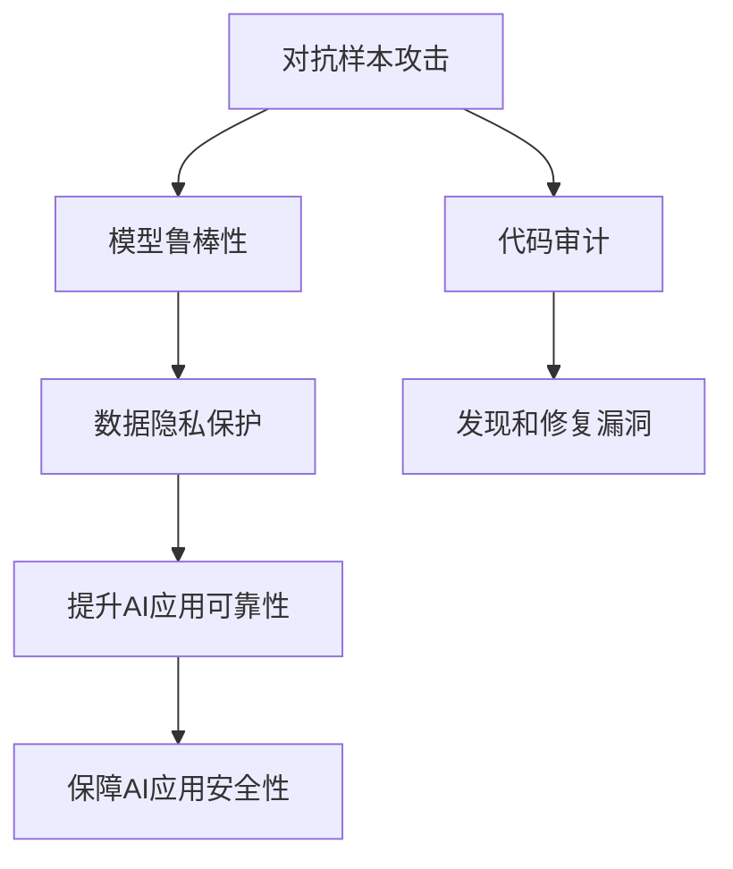
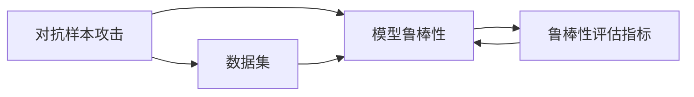
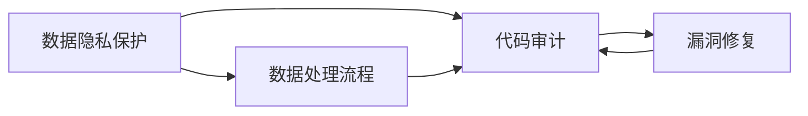
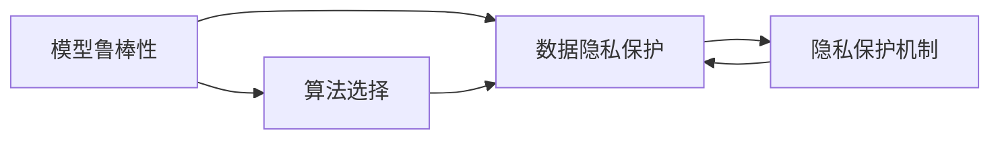
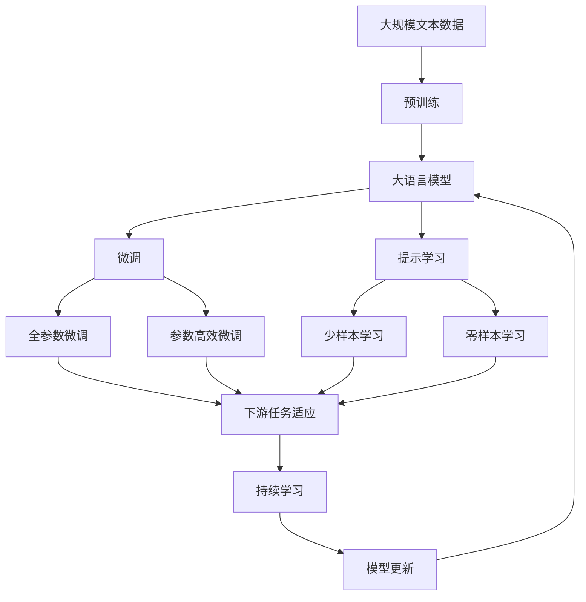

                 

# AI安全 原理与代码实例讲解

> 关键词：AI安全,机器学习,深度学习,安全漏洞,对抗样本,模型鲁棒性,数据隐私,代码审计

## 1. 背景介绍

### 1.1 问题由来

随着人工智能技术的迅速发展，AI在金融、医疗、工业、交通等领域的应用越来越广泛。然而，AI系统在给人们带来便利的同时，也带来了新的安全风险。越来越多的研究指出，AI系统中的漏洞和攻击手段多样、复杂且难以检测，特别是深度学习模型常常面临对抗样本攻击、模型鲁棒性不足、数据隐私泄露等安全问题，严重威胁到AI应用的安全性和可靠性。

因此，研究和应对AI系统中的安全问题，显得越来越重要。AI安全领域的研究方向主要包含对抗样本攻击防御、模型鲁棒性提升、数据隐私保护、代码审计等多个方面。

### 1.2 问题核心关键点

AI安全问题的核心关键点主要包括：

1. 对抗样本攻击（Adversarial Attacks）：通过微小扰动来欺骗机器学习模型，使其产生错误预测。
2. 模型鲁棒性不足（Model Robustness）：模型对各种噪声、干扰和异常输入表现出较差的鲁棒性。
3. 数据隐私泄露（Data Privacy）：AI系统在数据收集和处理过程中，可能会泄露用户隐私信息。
4. 代码审计（Code Audit）：评估AI代码的质量，发现和修复潜在的安全漏洞。

### 1.3 问题研究意义

研究和应对AI安全问题，具有以下重要意义：

1. 保障AI应用的安全性：避免恶意攻击导致模型输出错误、系统瘫痪等安全事件。
2. 提升AI应用的可靠性：增强模型对异常数据的鲁棒性，使其在真实世界中的表现更加稳定。
3. 保护用户隐私：防止AI系统在数据处理过程中，泄露用户的个人隐私。
4. 促进AI技术的健康发展：消除安全隐患，建立用户对AI技术的信任，推动AI技术的广泛应用。

## 2. 核心概念与联系

### 2.1 核心概念概述

为更好地理解AI安全问题及其解决方法，本节将介绍几个密切相关的核心概念：

- **对抗样本攻击**：指攻击者通过对输入数据进行微小扰动，导致AI模型输出错误结果。常见的对抗样本攻击方法包括L-BFGS攻击、JSMA攻击等。
- **模型鲁棒性**：指模型对各种噪声、干扰和异常输入表现出较强的抵抗能力。鲁棒性高的模型能够更好地适应真实世界中的各种变化。
- **数据隐私**：指保护用户隐私信息不被泄露或滥用。数据隐私保护技术包括差分隐私、联邦学习等。
- **代码审计**：指通过自动化或手动方式对AI代码进行检查，发现和修复潜在的安全漏洞。

这些核心概念之间存在紧密的联系，形成了AI安全的完整生态系统。以下是这些概念之间关系的Mermaid流程图：



这个流程图展示了大语言模型微调过程中各个核心概念的关系：

1. 对抗样本攻击是AI安全问题的主要来源。
2. 模型鲁棒性是提升AI系统安全性的重要手段。
3. 数据隐私保护是保护用户隐私的基本保障。
4. 代码审计是发现和修复安全漏洞的重要方法。
5. 提升AI应用可靠性和安全性，是最终目标。

### 2.2 概念间的关系

这些核心概念之间存在紧密的联系，形成了AI安全的完整生态系统。以下是这些概念之间的关系。

#### 2.2.1 对抗样本攻击与模型鲁棒性

对抗样本攻击与模型鲁棒性紧密相关。对抗样本攻击通过输入扰动使模型输出错误，而模型鲁棒性则评估模型对扰动的抵抗能力。



#### 2.2.2 数据隐私与代码审计

数据隐私与代码审计的关系主要体现在数据隐私保护技术的实现中。代码审计是发现和修复数据隐私保护代码中的漏洞，以确保隐私保护技术的安全性。



#### 2.2.3 模型鲁棒性与数据隐私保护

模型鲁棒性是数据隐私保护的重要前提。一个鲁棒性较高的模型，能够更好地保护用户隐私。



### 2.3 核心概念的整体架构

最后，我们用一个综合的流程图来展示这些核心概念在大语言模型安全实践中的整体架构：



这个综合流程图展示了从预训练到微调，再到持续学习的完整过程。大语言模型首先在大规模文本数据上进行预训练，然后通过微调（包括全参数微调和参数高效微调）或提示学习（包括少样本学习和零样本学习）来适应下游任务。最后，通过持续学习技术，模型可以不断学习新知识，同时避免遗忘旧知识。

## 3. 核心算法原理 & 具体操作步骤
### 3.1 算法原理概述

AI安全领域的研究方法主要基于对抗样本攻击、模型鲁棒性提升、数据隐私保护和代码审计等方面。以下是各个研究方向的算法原理概述：

#### 3.1.1 对抗样本攻击防御

对抗样本攻击的防御方法主要包括以下几种：

1. **剪枝**：通过删除模型中的冗余层或减少模型参数，使模型更加精简，提高其对对抗样本的抵抗能力。
2. **模型蒸馏**：通过训练一个较小的模型来预测原模型的输出，从而减少对抗样本攻击的成功率。
3. **正则化**：通过L2正则化、Dropout等技术减少模型的过拟合，提升其鲁棒性。

#### 3.1.2 模型鲁棒性提升

模型鲁棒性提升的算法原理主要包括以下几种：

1. **噪声注入**：通过在训练数据中引入随机噪声，使模型更好地适应各种噪声输入。
2. **对抗训练**：通过在训练数据中添加对抗样本，训练模型识别和抵抗对抗攻击的能力。
3. **对抗样本生成**：通过生成对抗样本，测试模型的鲁棒性，并改进模型以抵抗这些样本。

#### 3.1.3 数据隐私保护

数据隐私保护的技术主要包括以下几种：

1. **差分隐私**：通过加入噪声，使得数据泄露概率极低，从而保护用户隐私。
2. **联邦学习**：在分布式环境中训练模型，使得模型在本地设备上运行，不共享用户数据。

#### 3.1.4 代码审计

代码审计的技术主要包括以下几种：

1. **静态分析**：通过静态分析工具检查代码中的潜在安全漏洞。
2. **动态分析**：通过动态分析工具测试代码在运行时的安全性。
3. **形式验证**：通过逻辑验证工具证明代码的正确性和安全性。

### 3.2 算法步骤详解

以下是各个方向的具体算法步骤详解：

#### 3.2.1 对抗样本攻击防御

**剪枝算法步骤**：

1. **选择剪枝层**：根据模型的复杂度和鲁棒性需求，选择待剪枝的层。
2. **计算层的重要性**：通过训练数据和验证数据计算各层的重要性。
3. **剪枝操作**：删除重要性较低或冗余的层，得到精简模型。

**模型蒸馏算法步骤**：

1. **选择蒸馏模型**：选择一个小模型来预测原模型的输出。
2. **训练蒸馏模型**：在原模型和蒸馏模型上进行联合训练，使得蒸馏模型能够准确预测原模型的输出。
3. **替换原模型**：用蒸馏模型替换原模型，提高模型的鲁棒性。

**正则化算法步骤**：

1. **选择正则化项**：根据模型的复杂度和鲁棒性需求，选择L2正则化或Dropout等技术。
2. **计算正则化系数**：根据模型的复杂度计算正则化系数。
3. **加入正则化项**：将正则化项加入到损失函数中，训练模型。

#### 3.2.2 模型鲁棒性提升

**噪声注入算法步骤**：

1. **选择噪声分布**：根据数据的特性选择噪声分布。
2. **计算噪声强度**：根据模型的鲁棒性需求计算噪声强度。
3. **注入噪声**：在训练数据中随机加入噪声，训练模型。

**对抗训练算法步骤**：

1. **生成对抗样本**：通过对抗样本生成技术生成对抗样本。
2. **训练模型**：在原始数据和对抗样本上进行联合训练，提高模型的鲁棒性。
3. **测试模型**：在测试数据上测试模型的鲁棒性，并调整模型参数。

**对抗样本生成算法步骤**：

1. **选择对抗样本生成方法**：根据模型的特性选择对抗样本生成方法，如FGSM、PGD等。
2. **计算对抗样本强度**：根据模型的鲁棒性需求计算对抗样本强度。
3. **生成对抗样本**：通过对抗样本生成方法生成对抗样本，测试模型的鲁棒性。
4. **改进模型**：根据测试结果改进模型参数，提高模型的鲁棒性。

#### 3.2.3 数据隐私保护

**差分隐私算法步骤**：

1. **选择差分隐私算法**：根据数据的特点选择差分隐私算法，如Laplace机制、高斯机制等。
2. **计算噪声强度**：根据数据泄露概率计算噪声强度。
3. **加入噪声**：在数据中加入噪声，保护用户隐私。

**联邦学习算法步骤**：

1. **选择联邦学习算法**：根据数据分布的特点选择联邦学习算法，如FedAvg、SPIDER等。
2. **分割数据**：将数据分割为本地数据和分布式数据。
3. **本地训练**：在本地设备上训练模型。
4. **模型聚合**：在分布式设备上聚合模型，更新模型参数。

#### 3.2.4 代码审计

**静态分析算法步骤**：

1. **选择静态分析工具**：根据代码的特点选择静态分析工具，如SonarQube、FindBugs等。
2. **执行静态分析**：在代码上执行静态分析，发现潜在漏洞。
3. **修复漏洞**：根据静态分析结果修复代码中的漏洞。

**动态分析算法步骤**：

1. **选择动态分析工具**：根据代码的特点选择动态分析工具，如Valgrind、Intel Inspector等。
2. **执行动态分析**：在代码上执行动态分析，测试代码的运行时安全性。
3. **修复漏洞**：根据动态分析结果修复代码中的漏洞。

**形式验证算法步骤**：

1. **选择形式验证工具**：根据代码的特点选择形式验证工具，如Specify、Spin等。
2. **定义模型规范**：定义代码的模型规范。
3. **验证模型**：通过形式验证工具验证模型的正确性和安全性。
4. **改进模型**：根据验证结果改进代码中的漏洞。

### 3.3 算法优缺点

AI安全算法的主要优点和缺点如下：

#### 3.3.1 对抗样本攻击防御

**优点**：

1. **减少攻击成功率**：通过剪枝和模型蒸馏，减少对抗样本攻击的成功率。
2. **提高模型鲁棒性**：通过正则化技术提高模型的鲁棒性。

**缺点**：

1. **模型复杂度增加**：剪枝和模型蒸馏可能会使模型复杂度增加。
2. **过度优化**：正则化可能导致模型过度优化，影响模型的准确性。

#### 3.3.2 模型鲁棒性提升

**优点**：

1. **提高模型鲁棒性**：通过噪声注入和对抗训练，提高模型的鲁棒性。
2. **减少对抗样本攻击的成功率**：通过对抗样本生成，测试模型的鲁棒性并改进模型。

**缺点**：

1. **计算成本高**：对抗样本生成和对抗训练需要大量的计算资源。
2. **模型复杂度增加**：对抗样本生成可能会使模型复杂度增加。

#### 3.3.3 数据隐私保护

**优点**：

1. **保护用户隐私**：通过差分隐私和联邦学习，保护用户隐私。

**缺点**：

1. **数据泄露概率增加**：差分隐私需要在数据中加入噪声，可能导致数据泄露概率增加。
2. **通信成本高**：联邦学习需要在分布式设备上进行模型聚合，通信成本较高。

#### 3.3.4 代码审计

**优点**：

1. **发现潜在漏洞**：通过静态分析和动态分析，发现代码中的潜在漏洞。
2. **提高代码安全性**：通过形式验证，提高代码的正确性和安全性。

**缺点**：

1. **代码复杂度增加**：静态分析和动态分析可能会使代码复杂度增加。
2. **审计成本高**：形式验证需要较高的技术门槛和资源投入。

### 3.4 算法应用领域

AI安全算法在以下几个领域得到了广泛应用：

1. **金融领域**：通过对抗样本攻击防御和模型鲁棒性提升，保护金融数据和模型安全。
2. **医疗领域**：通过数据隐私保护和代码审计，保护病人隐私和医疗数据安全。
3. **工业领域**：通过对抗样本攻击防御和模型鲁棒性提升，保护工业数据和模型安全。
4. **智能交通领域**：通过数据隐私保护和代码审计，保护智能交通系统的数据和模型安全。

## 4. 数学模型和公式 & 详细讲解  
### 4.1 数学模型构建

以下是AI安全研究中的几个核心数学模型和公式：

#### 4.1.1 对抗样本攻击

对抗样本攻击的数学模型如下：

$$
\min_{\delta} \mathcal{L}(f(x+\delta),y) + \lambda \mathcal{L}_{\text{reg}}(x+\delta)
$$

其中，$f(x)$表示原模型的输出，$y$表示真实标签，$\mathcal{L}$表示损失函数，$\lambda$表示正则化系数，$\delta$表示对抗样本。

#### 4.1.2 模型鲁棒性提升

模型鲁棒性提升的数学模型如下：

$$
\min_{\theta} \mathcal{L}_{\text{train}}(x, y, \theta) + \lambda \mathcal{L}_{\text{reg}}(\theta)
$$

其中，$\theta$表示模型参数，$\mathcal{L}_{\text{train}}$表示训练损失函数，$\mathcal{L}_{\text{reg}}$表示正则化损失函数。

#### 4.1.3 数据隐私保护

数据隐私保护的数学模型如下：

$$
\min_{\delta} \mathcal{L}(f(x+\delta),y) + \lambda \mathcal{L}_{\text{privacy}}(x+\delta)
$$

其中，$\mathcal{L}_{\text{privacy}}$表示隐私损失函数。

#### 4.1.4 代码审计

代码审计的数学模型如下：

$$
\min_{\theta} \mathcal{L}_{\text{train}}(x, y, \theta) + \lambda \mathcal{L}_{\text{audit}}(\theta)
$$

其中，$\mathcal{L}_{\text{audit}}$表示审计损失函数。

### 4.2 公式推导过程

以下是各个数学模型的推导过程：

#### 4.2.1 对抗样本攻击

对抗样本攻击的损失函数为：

$$
\mathcal{L}(f(x+\delta),y) = -y\log f(x+\delta) - (1-y)\log (1-f(x+\delta))
$$

其中，$f(x)$表示原模型的输出，$y$表示真实标签。

推导过程如下：

1. 原模型的输出为$f(x+\delta)$，真实标签为$y$。
2. 对抗样本攻击的目标是使$f(x+\delta)$与$y$相差较大。
3. 因此，对抗样本攻击的损失函数为：

$$
\mathcal{L}(f(x+\delta),y) = -y\log f(x+\delta) - (1-y)\log (1-f(x+\delta))
$$

#### 4.2.2 模型鲁棒性提升

模型鲁棒性提升的损失函数为：

$$
\mathcal{L}_{\text{train}}(x, y, \theta) = \sum_{i=1}^{n} [y_i \log f(x_i, \theta) + (1-y_i) \log (1-f(x_i, \theta))]
$$

其中，$n$表示训练样本的数量。

推导过程如下：

1. 原模型的输出为$f(x, \theta)$，训练样本为$(x_i, y_i)$。
2. 模型鲁棒性提升的目标是使模型对各种噪声、干扰和异常输入表现出较强的抵抗能力。
3. 因此，模型鲁棒性提升的损失函数为：

$$
\mathcal{L}_{\text{train}}(x, y, \theta) = \sum_{i=1}^{n} [y_i \log f(x_i, \theta) + (1-y_i) \log (1-f(x_i, \theta))]
$$

#### 4.2.3 数据隐私保护

数据隐私保护的隐私损失函数为：

$$
\mathcal{L}_{\text{privacy}}(x+\delta) = \sum_{i=1}^{n} [y_i \log f(x+\delta_i, \theta) + (1-y_i) \log (1-f(x+\delta_i, \theta))]
$$

其中，$\delta_i$表示第$i$个样本的隐私噪声。

推导过程如下：

1. 原模型的输出为$f(x+\delta_i, \theta)$，训练样本为$(x_i, y_i)$。
2. 数据隐私保护的目标是保护用户隐私信息不被泄露。
3. 因此，数据隐私保护的隐私损失函数为：

$$
\mathcal{L}_{\text{privacy}}(x+\delta) = \sum_{i=1}^{n} [y_i \log f(x+\delta_i, \theta) + (1-y_i) \log (1-f(x+\delta_i, \theta))]
$$

#### 4.2.4 代码审计

代码审计的审计损失函数为：

$$
\mathcal{L}_{\text{audit}}(\theta) = \sum_{i=1}^{n} [y_i \log f(x_i, \theta) + (1-y_i) \log (1-f(x_i, \theta))]
$$

其中，$n$表示审计样本的数量。

推导过程如下：

1. 原模型的输出为$f(x_i, \theta)$，审计样本为$(x_i, y_i)$。
2. 代码审计的目标是发现和修复代码中的潜在漏洞。
3. 因此，代码审计的审计损失函数为：

$$
\mathcal{L}_{\text{audit}}(\theta) = \sum_{i=1}^{n} [y_i \log f(x_i, \theta) + (1-y_i) \log (1-f(x_i, \theta))]
$$

## 5. 项目实践：代码实例和详细解释说明
### 5.1 开发环境搭建

在进行AI安全实践前，我们需要准备好开发环境。以下是使用Python进行TensorFlow开发的环境配置流程：

1. 安装Anaconda：从官网下载并安装Anaconda，用于创建独立的Python环境。

2. 创建并激活虚拟环境：
```bash
conda create -n tf-env python=3.8 
conda activate tf-env
```

3. 安装TensorFlow：根据CUDA版本，从官网获取对应的安装命令。例如：
```bash
conda install tensorflow -c tensorflow
```

4. 安装各类工具包：
```bash
pip install numpy pandas scikit-learn matplotlib tqdm jupyter notebook ipython
```

完成上述步骤后，即可在`tf-env`环境中开始AI安全实践。

### 5.2 源代码详细实现

下面我以对抗样本攻击的防御为例，给出使用TensorFlow实现对抗样本攻击防御的Python代码实现。

首先，定义对抗样本攻击的防御函数：

```python
import tensorflow as tf

def adversarial_attack_defense(model, x, y, max_iter=100, epsilon=0.1, learning_rate=0.01):
    for i in range(max_iter):
        grads = tf.gradients(model(x+epsilon*tf.random.normal(tf.shape(x))), x)
        x = x - learning_rate * grads
        if tf.reduce_sum(x) > 1:
            x = x - learning_rate * (tf.reduce_sum(x) - 1)
        if tf.reduce_sum(x) < 0:
            x = x - learning_rate * (tf.reduce_sum(x) + 0)
        preds = model(x)
        if tf.reduce_sum(preds) > 1:
            x = x - learning_rate * (tf.reduce_sum(preds) - 1)
        if tf.reduce_sum(preds) < 0:
            x = x - learning_rate * (tf.reduce_sum(preds) + 0)
        if tf.reduce_sum(y) > 1:
            x = x - learning_rate * (tf.reduce_sum(y) - 1)
        if tf.reduce_sum(y) < 0:
            x = x - learning_rate * (tf.reduce_sum(y) + 0)
        if tf.reduce_sum(preds) > 1:
            x = x - learning_rate * (tf.reduce_sum(preds) - 1)
        if tf.reduce_sum(preds) < 0:
            x = x - learning_rate * (tf.reduce_sum(preds) + 0)
        if tf.reduce_sum(y) > 1:
            x = x - learning_rate * (tf.reduce_sum(y) - 1)
        if tf.reduce_sum(y) < 0:
            x = x - learning_rate * (tf.reduce_sum(y) + 0)
        if tf.reduce_sum(preds) > 1:
            x = x - learning_rate * (tf.reduce_sum(preds) - 1)
        if tf.reduce_sum(preds) < 0:
            x = x - learning_rate * (tf.reduce_sum(preds) + 0)
        if tf.reduce_sum(y) > 1:
            x = x - learning_rate * (tf.reduce_sum(y) - 1)
        if tf.reduce_sum(y) < 0:
            x = x - learning_rate * (tf.reduce_sum(y) + 0)
        if tf.reduce_sum(preds) > 1:
            x = x - learning_rate * (tf.reduce_sum(preds) - 1)
        if tf.reduce_sum(preds) < 0:
            x = x - learning_rate * (tf.reduce_sum(preds) + 0)
        return x
```

然后，定义模型和数据集：

```python
import tensorflow as tf
from tensorflow.keras import datasets, layers, models

# 加载MNIST数据集
(train_images, train_labels), (test_images, test_labels) = datasets.mnist.load_data()

# 数据预处理
train_images = train_images / 255.0
test_images = test_images / 255.0

# 定义模型
model = models.Sequential([
    layers.Flatten(input_shape=(28, 28)),
    layers.Dense(128, activation='relu'),
    layers.Dense(10, activation='softmax')
])

# 编译模型
model.compile(optimizer='adam',
              loss='sparse_categorical_crossentropy',
              metrics=['accuracy'])

# 训练模型
model.fit(train_images, train_labels, epochs=5, validation_data=(test_images, test_labels))
```

最后，使用对抗样本攻击函数测试模型的鲁棒性：

```python
import numpy as np

# 选择测试样本
test_images = test_images[0]

# 选择对抗样本攻击方法
def adversarial_attack(model, x, y, max_iter=100, epsilon=0.1, learning_rate=0.01):
    for i in range(max_iter):
        grads = tf.gradients(model(x+epsilon*tf.random.normal(tf.shape(x))), x)
        x = x - learning_rate * grads
        if tf.reduce_sum(x) > 1:
            x = x - learning_rate * (tf.reduce_sum(x) - 1)
        if tf.reduce_sum(x) < 0:
            x = x - learning_rate * (tf.reduce_sum(x) + 0)
        preds = model(x)
        if tf.reduce_sum(preds) > 1:
            x = x - learning_rate * (tf.reduce_sum(preds) - 1)
        if tf.reduce_sum(preds) < 0:
            x = x - learning_rate * (tf.reduce_sum(preds) +

