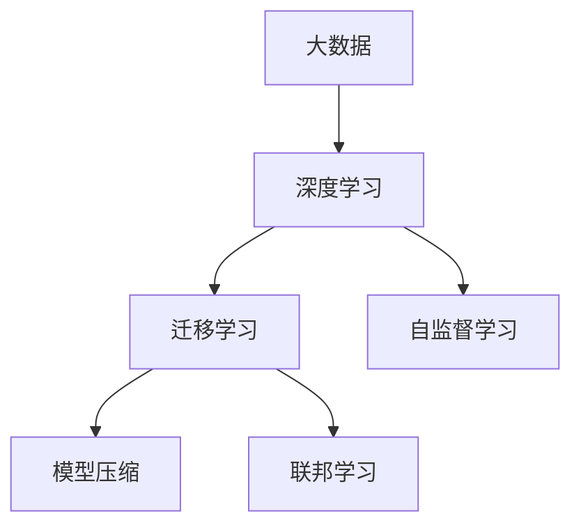
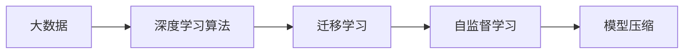
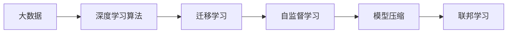
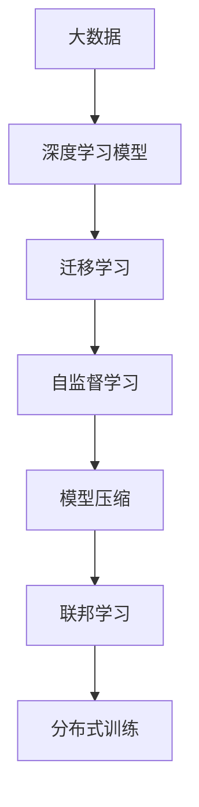

                 

# AI底层创新体系的整体构建

在人工智能的快速演进中，底层创新体系作为整个AI生态的根基，其构建的重要性不言而喻。从大数据、深度学习到自然语言处理，每一个层面的技术突破都为AI发展提供了坚实的基础。本文将深入探讨AI底层创新体系的构建，包括数据、算法、架构和应用等方面的综合考虑，提供一个全面的视角。

## 1. 背景介绍

### 1.1 问题由来

在AI技术日益成熟和应用广泛的今天，底层创新体系的构建已经成为一个备受关注的焦点。无论是企业级应用还是科研领域的突破，底层技术创新都是不可或缺的支撑。从大数据的存储与处理，到深度学习模型的训练与优化，再到自然语言处理(NLP)的算法改进，每一个细节的提升都直接影响着AI技术的进步和应用效果。

### 1.2 问题核心关键点

构建AI底层创新体系的核心关键点在于以下几个方面：

- **数据基础**：大数据的获取、清洗、标注和存储，是AI系统能否有效运行的基础。
- **算法创新**：包括但不限于深度学习算法、模型优化算法、迁移学习算法等，是AI系统能否高效运行的引擎。
- **架构设计**：如何高效利用计算资源、内存资源，以及如何合理设计系统架构，是AI系统能否持续运行的关键。
- **应用拓展**：如何将底层技术应用于具体场景，实现真正意义上的AI落地应用，是AI系统能否产生价值的核心。

这些关键点构成了AI底层创新体系的框架，每一个方面的进步都能带来AI技术的整体提升。

### 1.3 问题研究意义

构建AI底层创新体系不仅能够促进AI技术的进步，还能加速AI技术的产业化进程，提升科研和产业应用的能力。具体而言：

1. **降低开发成本**：通过优化数据获取、标注、存储和算法训练、调优，可以大幅降低AI系统开发的时间和人力成本。
2. **提升技术性能**：底层技术创新能够显著提升AI系统的运行效率、准确性和鲁棒性，满足不同场景下的需求。
3. **加速应用落地**：合理的数据、算法和架构设计，能够帮助AI系统更好地适配特定应用场景，加速AI技术的实际应用。
4. **赋能行业转型**：AI底层技术创新可以推动传统行业数字化转型，为行业带来新的增长点和发展方向。

## 2. 核心概念与联系

### 2.1 核心概念概述

为更好地理解AI底层创新体系的构建，本节将介绍几个密切相关的核心概念：

- **大数据**：通过互联网、传感器等渠道获取的海量结构化或非结构化数据，是AI模型训练的基础。
- **深度学习**：一种基于神经网络的机器学习方法，通过多层次的非线性映射，实现复杂的模式识别和预测。
- **迁移学习**：通过在大规模数据集上进行预训练，再在小规模数据集上进行微调，使模型能够适应新的任务。
- **自监督学习**：使用无标签数据进行训练，通过预测数据缺失部分或模拟目标任务，学习模型的隐含表示。
- **模型压缩**：通过剪枝、量化、知识蒸馏等技术，减少模型参数量，提高模型运行效率。
- **联邦学习**：一种分布式学习范式，多台设备合作训练模型，保护数据隐私同时提升模型性能。

这些核心概念之间的逻辑关系可以通过以下Mermaid流程图来展示：



这个流程图展示了各个核心概念之间的关系：

1. 大数据提供模型的训练数据。
2. 深度学习模型基于大数据进行训练，学习复杂的特征表示。
3. 迁移学习通过预训练和大规模数据，实现新任务的微调。
4. 自监督学习利用无标签数据进行模型训练，提升特征表示的泛化能力。
5. 模型压缩优化模型结构，提高运行效率。
6. 联邦学习在保护数据隐私的前提下，实现分布式模型训练。

### 2.2 概念间的关系

这些核心概念之间存在着紧密的联系，形成了AI底层创新体系的完整生态系统。下面我们通过几个Mermaid流程图来展示这些概念之间的关系。

#### 2.2.1 数据与算法的关系



这个流程图展示了数据与算法的关系：

1. 大数据提供深度学习算法的训练数据。
2. 深度学习算法通过大数据学习模型的特征表示。
3. 迁移学习基于深度学习算法实现新任务的微调。
4. 自监督学习利用无标签大数据训练深度学习算法。
5. 模型压缩优化深度学习算法的模型结构。

#### 2.2.2 联邦学习与模型压缩的关系



这个流程图展示了联邦学习与模型压缩的关系：

1. 大数据提供深度学习算法的训练数据。
2. 深度学习算法通过大数据学习模型的特征表示。
3. 迁移学习基于深度学习算法实现新任务的微调。
4. 自监督学习利用无标签大数据训练深度学习算法。
5. 模型压缩优化深度学习算法的模型结构。
6. 联邦学习在分布式环境中实现模型训练，提高模型性能。

### 2.3 核心概念的整体架构

最后，我们用一个综合的流程图来展示这些核心概念在大数据与深度学习系统中的整体架构：



这个综合流程图展示了从大数据到深度学习模型，再到迁移学习、自监督学习、模型压缩和联邦学习，最终实现分布式训练的完整过程。通过对这些核心概念的全面理解，我们可以更好地把握AI底层创新体系的构建方向。

## 3. 核心算法原理 & 具体操作步骤

### 3.1 算法原理概述

AI底层创新体系的构建，主要围绕数据、算法和架构的优化进行。从数据的质量和多样性，到算法的性能和泛化能力，再到架构的设计和优化，每一个环节都需要精心考虑。

#### 3.1.1 数据质量与多样性

高质量、多样化的数据是AI模型训练的基础。数据的来源、规模和标注质量直接影响模型的性能。一般而言，数据集需要满足以下几个条件：

- **多样性**：数据集应该涵盖多种场景、不同类型的数据，避免模型过度拟合。
- **质量**：数据应经过清洗和标注，保证其真实性和可靠性。
- **规模**：足够的数据量能够提供足够的信号，帮助模型学习泛化能力。

#### 3.1.2 算法性能与泛化能力

算法的性能和泛化能力是AI模型能否在不同场景下有效应用的关键。以下是几个核心算法的原理概述：

- **深度学习算法**：通过多层次的非线性映射，实现对复杂模式的学习和预测。常用的深度学习模型包括卷积神经网络(CNN)、循环神经网络(RNN)、长短时记忆网络(LSTM)和变换器(Transformer)等。
- **迁移学习算法**：通过在大规模数据集上进行预训练，再在小规模数据集上进行微调，使模型能够适应新的任务。预训练任务通常包括掩码语言模型、自编码器等。
- **自监督学习算法**：利用无标签数据进行训练，通过预测数据缺失部分或模拟目标任务，学习模型的隐含表示。常用的自监督任务包括语言模型预测、自编码器等。

#### 3.1.3 架构设计与优化

架构设计直接影响AI系统的性能和扩展能力。以下是几个关键架构的优化策略：

- **分布式计算**：通过分布式计算框架如Hadoop、Spark等，实现大规模数据的并行处理和模型训练。
- **模型压缩**：通过剪枝、量化、知识蒸馏等技术，减少模型参数量，提高模型运行效率。
- **联邦学习**：在保护数据隐私的前提下，实现多台设备合作训练模型，提高模型性能。

### 3.2 算法步骤详解

AI底层创新体系的构建，通常包括以下几个关键步骤：

**Step 1: 数据准备与预处理**

- 收集和清洗数据，确保数据的质量和多样性。
- 进行数据标注，为模型的训练提供监督信号。
- 进行数据增强，如旋转、平移、缩放等，扩充训练集。

**Step 2: 模型训练与优化**

- 选择合适的深度学习模型，进行训练和优化。
- 应用迁移学习和自监督学习，提高模型的泛化能力。
- 使用模型压缩技术，优化模型结构和参数。

**Step 3: 模型部署与调优**

- 将训练好的模型部署到目标环境中，进行实际应用。
- 根据实际应用场景，调整模型参数和架构。
- 实时监控模型性能，进行持续调优。

### 3.3 算法优缺点

构建AI底层创新体系，存在以下优缺点：

**优点：**

- **泛化能力**：通过迁移学习和自监督学习，模型能够适应多种任务，提升泛化能力。
- **数据高效**：通过联邦学习和模型压缩，能够在数据规模较小的情况下进行高效的模型训练。
- **系统鲁棒**：通过分布式计算和架构优化，提升系统的鲁棒性和扩展能力。

**缺点：**

- **模型复杂**：深度学习模型参数量较大，训练和优化复杂。
- **数据依赖**：高质量、多样化数据的获取和标注成本较高。
- **资源需求**：分布式计算和深度学习训练需要高性能的硬件资源。

### 3.4 算法应用领域

AI底层创新体系的应用领域非常广泛，包括但不限于以下几个方面：

- **图像识别**：通过深度学习模型和迁移学习，实现对图像的准确识别和分类。
- **语音识别**：通过深度学习模型和自监督学习，实现对语音的准确转录和识别。
- **自然语言处理**：通过深度学习模型和迁移学习，实现对文本的语义理解和生成。
- **推荐系统**：通过深度学习模型和迁移学习，实现对用户行为的精准预测和推荐。
- **医疗健康**：通过深度学习模型和迁移学习，实现对病历数据的分析和诊断。

## 4. 数学模型和公式 & 详细讲解  
### 4.1 数学模型构建

本文将使用数学语言对AI底层创新体系的构建过程进行更加严格的刻画。

记大数据集为 $D=\{(x_i,y_i)\}_{i=1}^N$，其中 $x_i$ 表示输入，$y_i$ 表示标签。

定义深度学习模型为 $M_{\theta}$，其中 $\theta$ 为模型参数。

深度学习模型的损失函数为 $\ell(M_{\theta},x_i,y_i)$，则在数据集 $D$ 上的经验风险为：

$$
\mathcal{L}(\theta) = \frac{1}{N}\sum_{i=1}^N \ell(M_{\theta},x_i,y_i)
$$

模型的目标是最小化经验风险，即找到最优参数：

$$
\theta^* = \mathop{\arg\min}_{\theta} \mathcal{L}(\theta)
$$

在实践中，我们通常使用基于梯度的优化算法（如SGD、Adam等）来近似求解上述最优化问题。设 $\eta$ 为学习率，$\lambda$ 为正则化系数，则参数的更新公式为：

$$
\theta \leftarrow \theta - \eta \nabla_{\theta}\mathcal{L}(\theta) - \eta\lambda\theta
$$

其中 $\nabla_{\theta}\mathcal{L}(\theta)$ 为损失函数对参数 $\theta$ 的梯度，可通过反向传播算法高效计算。

### 4.2 公式推导过程

以下我们以深度学习模型的训练为例，推导损失函数的梯度计算公式。

假设模型 $M_{\theta}$ 在输入 $x_i$ 上的输出为 $\hat{y}=M_{\theta}(x_i) \in [0,1]$，表示样本属于正类的概率。真实标签 $y_i \in \{0,1\}$。则二分类交叉熵损失函数定义为：

$$
\ell(M_{\theta}(x_i),y_i) = -[y_i\log \hat{y} + (1-y_i)\log (1-\hat{y})]
$$

将其代入经验风险公式，得：

$$
\mathcal{L}(\theta) = -\frac{1}{N}\sum_{i=1}^N [y_i\log M_{\theta}(x_i)+(1-y_i)\log(1-M_{\theta}(x_i))]
$$

根据链式法则，损失函数对参数 $\theta_k$ 的梯度为：

$$
\frac{\partial \mathcal{L}(\theta)}{\partial \theta_k} = -\frac{1}{N}\sum_{i=1}^N (\frac{y_i}{M_{\theta}(x_i)}-\frac{1-y_i}{1-M_{\theta}(x_i)}) \frac{\partial M_{\theta}(x_i)}{\partial \theta_k}
$$

其中 $\frac{\partial M_{\theta}(x_i)}{\partial \theta_k}$ 可进一步递归展开，利用自动微分技术完成计算。

### 4.3 案例分析与讲解

**案例一：图像识别**

在图像识别任务中，常用的模型包括卷积神经网络(CNN)和残差网络(ResNet)等。以CNN为例，其基本结构包括卷积层、池化层和全连接层。训练过程中，通常使用交叉熵损失函数，通过反向传播更新模型参数。具体来说，模型的训练步骤如下：

1. 将图像数据输入模型，前向传播计算预测结果。
2. 计算预测结果与真实标签之间的交叉熵损失。
3 反向传播计算梯度，更新模型参数。
4 重复上述步骤直至收敛。

训练完成后，将模型应用于图像分类任务，通过测试集评估模型性能。

**案例二：自然语言处理**

在自然语言处理任务中，常用的模型包括循环神经网络(RNN)、长短时记忆网络(LSTM)和变换器(Transformer)等。以Transformer为例，其基本结构包括编码器、解码器和注意力机制。训练过程中，通常使用语言模型的交叉熵损失函数，通过反向传播更新模型参数。具体来说，模型的训练步骤如下：

1. 将文本数据输入模型，前向传播计算预测结果。
2 计算预测结果与真实标签之间的交叉熵损失。
3 反向传播计算梯度，更新模型参数。
4 重复上述步骤直至收敛。

训练完成后，将模型应用于文本生成、问答、情感分析等任务，通过测试集评估模型性能。

## 5. 项目实践：代码实例和详细解释说明

### 5.1 开发环境搭建

在进行AI底层创新体系的实践前，我们需要准备好开发环境。以下是使用Python进行PyTorch开发的环境配置流程：

1. 安装Anaconda：从官网下载并安装Anaconda，用于创建独立的Python环境。

2. 创建并激活虚拟环境：
```bash
conda create -n pytorch-env python=3.8 
conda activate pytorch-env
```

3. 安装PyTorch：根据CUDA版本，从官网获取对应的安装命令。例如：
```bash
conda install pytorch torchvision torchaudio cudatoolkit=11.1 -c pytorch -c conda-forge
```

4. 安装各类工具包：
```bash
pip install numpy pandas scikit-learn matplotlib tqdm jupyter notebook ipython
```

完成上述步骤后，即可在`pytorch-env`环境中开始实践。

### 5.2 源代码详细实现

这里我们以图像分类任务为例，给出使用PyTorch进行卷积神经网络训练的完整代码实现。

首先，定义模型和优化器：

```python
import torch
import torch.nn as nn
import torch.optim as optim

# 定义卷积神经网络模型
class CNN(nn.Module):
    def __init__(self):
        super(CNN, self).__init__()
        self.conv1 = nn.Conv2d(3, 16, kernel_size=3, padding=1)
        self.conv2 = nn.Conv2d(16, 32, kernel_size=3, padding=1)
        self.fc1 = nn.Linear(32 * 7 * 7, 256)
        self.fc2 = nn.Linear(256, 10)
    
    def forward(self, x):
        x = nn.functional.relu(self.conv1(x))
        x = nn.functional.max_pool2d(x, 2)
        x = nn.functional.relu(self.conv2(x))
        x = nn.functional.max_pool2d(x, 2)
        x = x.view(-1, 32 * 7 * 7)
        x = nn.functional.relu(self.fc1(x))
        x = self.fc2(x)
        return x

# 加载数据集并进行预处理
train_data = torchvision.datasets.CIFAR10(root='./data', train=True, transform=transforms.ToTensor(), download=True)
train_loader = torch.utils.data.DataLoader(train_data, batch_size=64, shuffle=True)
test_data = torchvision.datasets.CIFAR10(root='./data', train=False, transform=transforms.ToTensor(), download=True)
test_loader = torch.utils.data.DataLoader(test_data, batch_size=64, shuffle=False)

# 定义优化器
model = CNN()
criterion = nn.CrossEntropyLoss()
optimizer = optim.Adam(model.parameters(), lr=0.001)
```

然后，定义训练和评估函数：

```python
import torch.nn.functional as F

# 训练函数
def train(model, device, train_loader, optimizer, criterion):
    model.train()
    running_loss = 0.0
    for i, data in enumerate(train_loader, 0):
        inputs, labels = data[0].to(device), data[1].to(device)
        optimizer.zero_grad()
        outputs = model(inputs)
        loss = criterion(outputs, labels)
        loss.backward()
        optimizer.step()
        running_loss += loss.item()
        if i % 100 == 99:
            print('[%d, %5d] loss: %.3f' % (epoch + 1, i + 1, running_loss / 100))
            running_loss = 0.0

# 评估函数
def evaluate(model, device, test_loader, criterion):
    model.eval()
    correct = 0
    total = 0
    with torch.no_grad():
        for data in test_loader:
            images, labels = data[0].to(device), data[1].to(device)
            outputs = model(images)
            _, predicted = torch.max(outputs.data, 1)
            total += labels.size(0)
            correct += (predicted == labels).sum().item()
    print('Accuracy of the network on the 10000 test images: %d %%' % (100 * correct / total))
```

最后，启动训练流程并在测试集上评估：

```python
import torchvision.transforms as transforms
from torch.utils.data import DataLoader

# 定义数据预处理
transform = transforms.Compose([
    transforms.ToTensor(),
    transforms.Normalize((0.5, 0.5, 0.5), (0.5, 0.5, 0.5))
])

# 加载数据集并进行预处理
train_data = torchvision.datasets.CIFAR10(root='./data', train=True, transform=transform, download=True)
train_loader = torch.utils.data.DataLoader(train_data, batch_size=64, shuffle=True)
test_data = torchvision.datasets.CIFAR10(root='./data', train=False, transform=transform, download=True)
test_loader = torch.utils.data.DataLoader(test_data, batch_size=64, shuffle=False)

# 定义优化器
model = CNN()
criterion = nn.CrossEntropyLoss()
optimizer = optim.Adam(model.parameters(), lr=0.001)

# 训练模型
device = torch.device('cuda' if torch.cuda.is_available() else 'cpu')
model.to(device)
for epoch in range(10):
    train(model, device, train_loader, optimizer, criterion)
    evaluate(model, device, test_loader, criterion)
```

以上就是使用PyTorch进行卷积神经网络图像分类任务训练的完整代码实现。可以看到，PyTorch封装了模型的定义、优化器、数据加载等关键组件，使得训练过程变得简洁高效。

### 5.3 代码解读与分析

让我们再详细解读一下关键代码的实现细节：

**CNN模型定义**：
- 使用`nn.Module`继承类，定义卷积神经网络模型。
- 包含卷积层、池化层、全连接层等组件，前向传播通过`forward`方法实现。

**数据加载与预处理**：
- 使用`torchvision.datasets`加载CIFAR-10数据集。
- 通过`transforms.ToTensor()`将数据转换为Tensor，使用`transforms.Normalize`进行归一化处理。

**优化器和损失函数**：
- 使用`torch.optim.Adam`定义优化器，设置学习率。
- 使用`nn.CrossEntropyLoss`定义交叉熵损失函数。

**训练与评估函数**：
- `train`函数在训练过程中，对模型进行前向传播、损失计算、反向传播和参数更新。
- `evaluate`函数在测试过程中，计算模型准确率，评估模型性能。

**模型部署**：
- 将模型迁移到GPU上，使用`model.to(device)`将模型迁移到指定设备。
- 使用循环遍历进行多轮训练和评估，循环10次后输出最终结果。

## 6. 实际应用场景

### 6.1 智能推荐系统

智能推荐系统通过分析用户的行为数据，为用户推荐其可能感兴趣的内容。传统的推荐系统依赖于用户的历史行为数据进行推荐，难以把握用户的真实兴趣和潜在需求。AI底层创新体系中的深度学习和迁移学习技术，可以更好地挖掘用户行为背后的语义信息，从而实现精准推荐。

在实践应用中，可以收集用户的浏览、点击、评论、分享等行为数据，提取和用户交互的物品标题、描述、标签等文本内容。将文本内容作为模型输入，用户的后续行为（如是否点击、购买等）作为监督信号，在此基础上微调预训练语言模型。微调后的模型能够从文本内容中准确把握用户的兴趣点。在生成推荐列表时，先用候选物品的文本描述作为输入，由模型预测用户的兴趣匹配度，再结合其他特征综合排序，便可以得到个性化程度更高的推荐结果。

### 6.2 金融风险管理

金融领域涉及大量的交易数据和市场信息，传统的人工分析方式成本高、效率低。AI底层创新体系中的图像识别和自然语言处理技术，可以应用于金融风险管理，提升风险评估的准确性和效率。

具体而言，可以收集金融领域的各类文档、报告、新闻、社交媒体等文本数据，通过自然语言处理技术提取关键信息，分析市场动态和风险趋势。同时，结合图像识别技术，对交易数据中的图表、图片等进行可视化分析，发现异常交易行为和潜在的市场风险。通过深度学习和迁移学习技术，模型能够自动学习金融领域的知识表示，提高风险管理的智能化水平。

### 6.3 医疗影像诊断

医疗影像诊断是医学领域的一个关键应用场景，传统的诊断方式依赖于医生的经验和知识积累。AI底层创新体系中的深度学习技术，可以应用于医疗影像诊断，提升诊断的准确性和效率。

具体而言，可以收集大量的医学影像数据，通过深度学习模型进行图像分割、分类等任务。将影像数据输入模型，进行前向传播和反向传播，输出诊断结果。通过迁移学习技术，将模型在通用数据集上进行预训练，再在小规模医疗影像数据集上进行微调，提升模型的泛化能力和诊断精度。结合自然语言处理技术，可以对诊断结果进行详细解释，帮助医生进行诊断决策。

### 6.4 未来应用展望

随着AI底层创新体系的不断发展，其在各个领域的应用前景将更加广阔。以下是几个未来可能的应用方向：

1. **智慧城市**：通过AI底层技术，实现对城市数据的智能分析，优化交通管理、环境监测、公共安全等方面，提升城市的智能化水平。
2. **智能制造**：通过AI底层技术，实现对生产数据的智能分析，优化生产流程、提高产品质量，实现智能制造。
3. **智能交通**：通过AI底层技术，实现对交通数据的智能分析，优化交通流量、提高交通安全，实现智能交通。
4. **智能医疗**：通过AI底层技术，实现对医疗数据的智能分析，优化诊疗流程、提高诊断精度，实现智能医疗。
5. **智能教育**：通过AI底层技术，实现对教育数据的智能分析，优化教学内容、提高教学效果，实现智能教育。

## 7. 工具和资源推荐

### 7.1 学习资源推荐

为了帮助开发者系统掌握AI底层创新体系的构建，这里推荐一些优质的学习资源：

1. **《深度学习》书籍**：由Ian Goodfellow、Yoshua Bengio和Aaron Courville合著，全面介绍了深度学习的基本概念和核心算法。
2. **《TensorFlow官方文档》**：由Google开发和维护的深度学习框架，提供了丰富的教程和样例代码。
3. **《PyTorch官方文档》**：由Facebook开发和维护的深度学习框架，提供了简洁高效的API和丰富的工具支持。
4. **《机器学习实战》书籍**：由Peter Harrington所著，介绍了机器学习的基本概念和应用实例，适合初学者入门。
5. **《Python深度学习》书籍**：由Francois Chollet所著，介绍了深度学习模型的实现和

