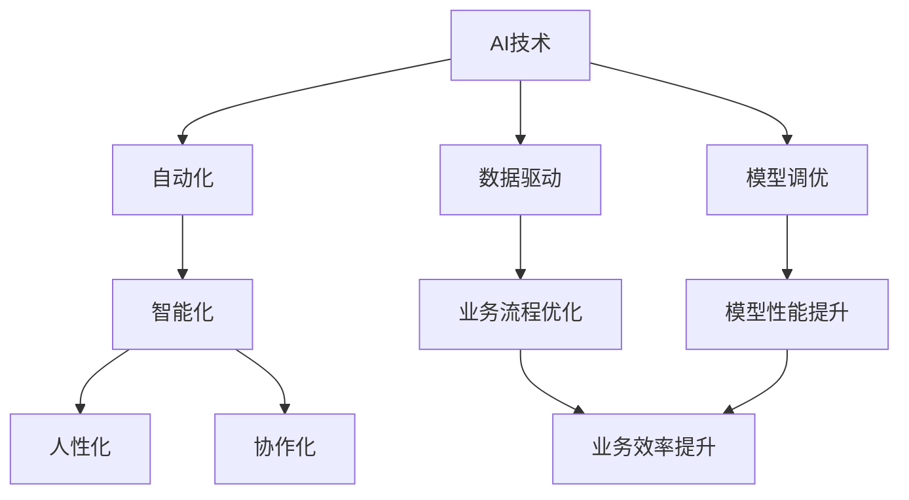
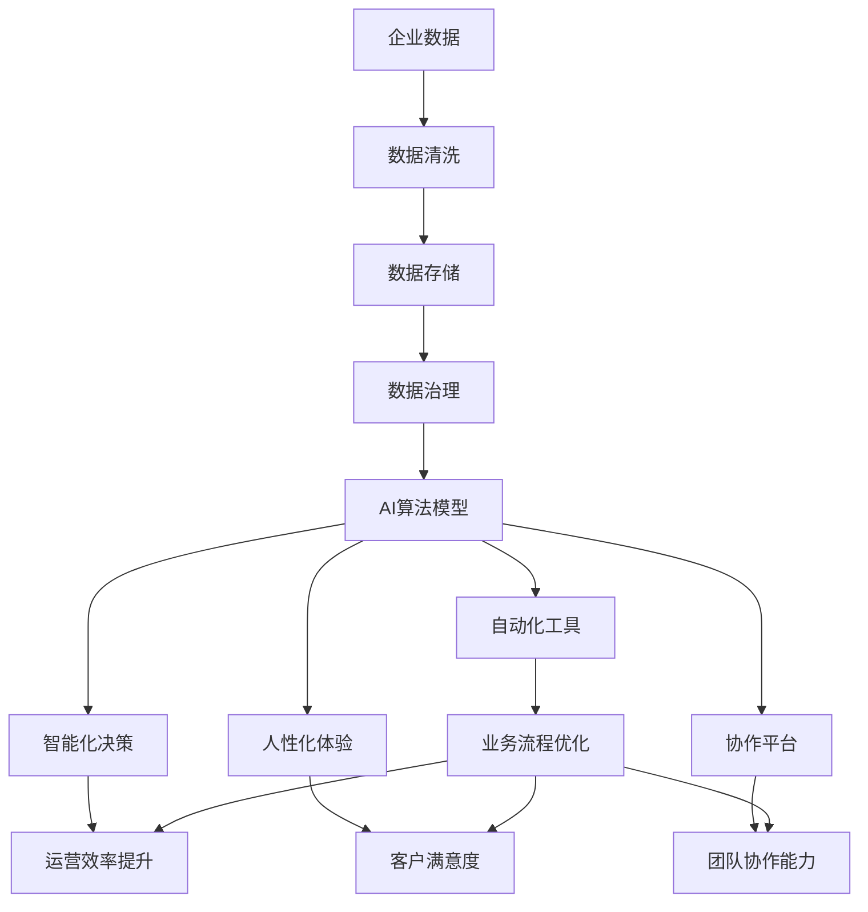

                 

# AI技术在企业中的发展

在数字化转型的浪潮下，AI技术已经成为推动企业创新和增长的关键驱动力。本文将系统阐述AI技术在企业中的应用现状、主要挑战和未来趋势，探讨如何更好地利用AI技术，驱动企业实现数字化转型，增强核心竞争力。

## 1. 背景介绍

### 1.1 问题由来

过去几十年，信息技术迅猛发展，改变了各行各业的工作方式和商业模式。尤其是在互联网、大数据和计算能力日益提升的推动下，AI技术逐步从实验室走向应用，成为推动经济社会发展的重要引擎。企业纷纷引入AI技术，以期在市场竞争中占据优势。

AI技术在企业中的应用范围极为广泛，从智能制造、供应链管理、客户服务到金融风控、医疗健康等，几乎涵盖了所有业务场景。例如，智能制造通过工业AI技术实现自动化生产线的柔性调整、故障预测和维护优化；供应链管理借助AI技术优化库存管理、物流调度和需求预测；客户服务领域通过智能客服和聊天机器人提升用户体验；金融行业利用AI技术进行风险评估、欺诈检测和投资决策；医疗健康则利用AI技术进行疾病诊断、影像分析和个性化治疗等。

### 1.2 问题核心关键点

AI技术在企业中的应用，主要集中在以下几个方面：

- 自动化：通过机器学习和深度学习技术，实现业务流程自动化，提升效率。
- 智能化：利用AI技术，提高决策过程的智能化水平，增强风险控制和业务洞察能力。
- 人性化：通过AI技术改善用户体验，提供个性化的服务与产品。
- 协作化：实现人机协同，提升团队工作效率和创新能力。

AI技术的应用效果显著，但在实际应用中仍面临诸多挑战，如数据质量、算法性能、系统集成和人才短缺等问题。这些问题直接影响了AI技术在企业中的推广和应用效果。

### 1.3 问题研究意义

AI技术在企业中的应用，不仅能够提升业务效率和质量，还能推动企业创新，形成新的竞争优势。具体而言：

1. **提升运营效率**：AI技术能够自动化处理大量重复性工作，提升运营效率，降低人工成本。
2. **增强决策能力**：AI技术能够从海量数据中提取关键信息，辅助管理决策，提升决策质量和速度。
3. **改善客户体验**：通过智能客服和个性化推荐，提升客户满意度和忠诚度。
4. **促进业务创新**：AI技术赋能新业务和新产品开发，推动企业持续创新。

## 2. 核心概念与联系

### 2.1 核心概念概述

为了更好地理解AI技术在企业中的应用，本节将介绍几个密切相关的核心概念：

- **AI技术**：利用机器学习、深度学习等算法，实现信息自动化处理和决策的能力。
- **自动化**：通过AI技术实现业务流程的自动化，提升效率。
- **智能化**：利用AI技术提升决策智能化的水平。
- **人性化**：通过AI技术改善用户体验，提供个性化服务。
- **协作化**：实现人机协同，提升工作效率和创新能力。
- **数据驱动**：AI技术强调数据的重要性，通过数据驱动决策。
- **模型调优**：通过训练优化算法模型，提升AI系统的性能。

### 2.2 概念间的关系

这些核心概念之间存在着紧密的联系，形成了AI技术在企业应用的整体架构。

通过以下Mermaid流程图来展示这些概念之间的关系：



这个流程图展示了一系列的因果关系：

- AI技术通过数据驱动，实现业务流程优化。
- 模型调优提升模型性能，进而实现业务效率提升。
- 自动化、智能化、人性化、协作化等通过AI技术得以实现，共同推动企业运营和创新。

### 2.3 核心概念的整体架构

最后，我们用一个综合的流程图来展示这些核心概念在大规模企业中的应用：



这个综合流程图展示了从数据采集、处理、治理到AI模型构建、应用和评估的全过程，以及AI技术如何赋能企业运营和创新。

## 3. 核心算法原理 & 具体操作步骤

### 3.1 算法原理概述

AI技术在企业中的应用，主要基于机器学习、深度学习和自然语言处理等算法原理。本文主要介绍机器学习和深度学习算法，用于解决企业中的自动化、智能化和个性化等问题。

机器学习算法通过训练数据集，构建预测模型，实现数据的自动化处理和分析。常见的机器学习算法包括回归、分类、聚类等。深度学习算法通过构建神经网络，处理高维数据，实现更复杂的模式识别和智能决策。

### 3.2 算法步骤详解

基于机器学习和深度学习的AI应用，通常包括以下关键步骤：

**Step 1: 数据准备**
- 收集和清洗业务数据，构建高质量的数据集。
- 确定数据格式和结构，进行特征工程。
- 数据预处理，如标准化、归一化、缺失值处理等。

**Step 2: 模型选择**
- 根据业务需求选择合适的算法模型。
- 初步评估模型的性能，选择合适的超参数。
- 设计模型的训练和评估流程。

**Step 3: 模型训练**
- 将数据集划分为训练集和测试集，进行模型训练。
- 调整超参数，优化模型性能。
- 使用交叉验证等方法，评估模型泛化能力。

**Step 4: 模型部署**
- 将训练好的模型部署到生产环境。
- 进行模型性能监控和调优。
- 定期更新模型，提升模型性能。

**Step 5: 模型评估**
- 使用测试集评估模型性能。
- 根据业务需求调整模型参数，提升模型效果。
- 进行模型对比和性能评估。

### 3.3 算法优缺点

基于机器学习和深度学习的AI应用，具有以下优点：

1. **高效自动化**：能够自动化处理大量数据，提升业务效率。
2. **智能决策**：通过数据分析和模型训练，辅助决策过程，提升决策质量。
3. **个性化体验**：通过模型训练和优化，提供个性化的产品和服务。
4. **可解释性强**：机器学习模型的决策过程相对透明，便于解释和调试。

但同时，也存在一些缺点：

1. **数据依赖性高**：模型性能依赖于数据质量，数据不足或偏差可能导致模型失效。
2. **计算资源消耗大**：深度学习模型需要大量的计算资源，部署和维护成本较高。
3. **模型复杂度高**：深度学习模型较为复杂，难以理解和调试。
4. **隐私和伦理问题**：数据隐私和模型伦理问题需要引起重视，确保数据安全和合规。

### 3.4 算法应用领域

基于机器学习和深度学习的AI技术，在企业中的应用领域非常广泛，涵盖智能制造、供应链管理、客户服务、金融风控、医疗健康等多个领域。

**智能制造**：通过工业AI技术实现自动化生产线的柔性调整、故障预测和维护优化。
**供应链管理**：利用AI技术优化库存管理、物流调度和需求预测。
**客户服务**：通过智能客服和聊天机器人提升用户体验。
**金融风控**：利用AI技术进行风险评估、欺诈检测和投资决策。
**医疗健康**：利用AI技术进行疾病诊断、影像分析和个性化治疗。

## 4. 数学模型和公式 & 详细讲解 & 举例说明

### 4.1 数学模型构建

本文主要介绍机器学习中的线性回归模型，用于解决企业中的自动化和智能化问题。

假设企业有一组历史销售数据 $(x_i, y_i)$，其中 $x_i$ 为自变量（如广告投放、市场活动等），$y_i$ 为因变量（如销售额）。通过线性回归模型，建立自变量和因变量之间的关系：

$$
y_i = \beta_0 + \beta_1 x_1 + \beta_2 x_2 + \cdots + \beta_n x_n + \epsilon_i
$$

其中，$\beta_0$ 为截距，$\beta_1, \beta_2, \cdots, \beta_n$ 为自变量的系数，$\epsilon_i$ 为误差项。

### 4.2 公式推导过程

在线性回归模型的训练过程中，主要采用最小二乘法（Ordinary Least Squares, OLS），求解系数 $\beta_0, \beta_1, \beta_2, \cdots, \beta_n$：

$$
\beta = (\mathbf{X}^T\mathbf{X})^{-1}\mathbf{X}^T\mathbf{y}
$$

其中，$\mathbf{X}$ 为自变量矩阵，$\mathbf{y}$ 为因变量向量，$\beta$ 为系数向量。

### 4.3 案例分析与讲解

假设某企业有一组历史销售数据，共有五个自变量（广告投放、市场活动、季节变化等）和一个因变量（销售额）。通过线性回归模型，建立自变量和因变量之间的关系，并根据模型预测未来销售额。

在实践中，可以使用Python的Scikit-Learn库进行线性回归模型的构建和训练。代码实现如下：

```python
from sklearn.linear_model import LinearRegression
from sklearn.metrics import mean_squared_error

# 准备数据
X = [
    [1, 2, 3, 4, 5],
    [2, 4, 6, 8, 10],
    [3, 6, 9, 12, 15],
    [4, 8, 12, 16, 20],
    [5, 10, 15, 20, 25]
]
y = [
    100,
    120,
    140,
    160,
    180
]

# 构建模型
model = LinearRegression()
model.fit(X, y)

# 预测新数据
X_new = [6, 12, 18, 24, 30]
y_pred = model.predict(X_new)

# 评估模型
mse = mean_squared_error(y, y_pred)
print(f"MSE: {mse:.2f}")
```

以上代码中，通过Scikit-Learn库的LinearRegression类，构建线性回归模型，并使用均方误差（Mean Squared Error, MSE）评估模型预测性能。在实际应用中，可以根据具体业务需求，选择合适的模型和评估指标，构建高性能的预测系统。

## 5. 项目实践：代码实例和详细解释说明

### 5.1 开发环境搭建

在进行AI项目实践前，我们需要准备好开发环境。以下是使用Python进行TensorFlow开发的环境配置流程：

1. 安装Anaconda：从官网下载并安装Anaconda，用于创建独立的Python环境。

2. 创建并激活虚拟环境：
```bash
conda create -n tf-env python=3.8 
conda activate tf-env
```

3. 安装TensorFlow：根据CUDA版本，从官网获取对应的安装命令。例如：
```bash
conda install tensorflow==2.6 -c conda-forge -c nvidia
```

4. 安装各类工具包：
```bash
pip install numpy pandas scikit-learn matplotlib tqdm jupyter notebook ipython
```

完成上述步骤后，即可在`tf-env`环境中开始AI项目的实践。

### 5.2 源代码详细实现

这里我们以一个简单的基于TensorFlow的线性回归模型为例，给出代码实现。

首先，定义线性回归模型的训练函数：

```python
import tensorflow as tf

def train_model(X, y, learning_rate, batch_size, epochs):
    # 定义模型参数
    theta = tf.Variable(tf.zeros([X.shape[1], 1]), name='theta')
    sigma = tf.Variable(tf.ones([1]), name='sigma')
    
    # 定义损失函数
    def loss_fn(y_true, y_pred):
        return tf.reduce_mean(tf.square(y_true - y_pred))
    
    # 定义优化器
    optimizer = tf.optimizers.Adam(learning_rate=learning_rate)
    
    # 定义训练循环
    for epoch in range(epochs):
        for i in range(0, X.shape[0], batch_size):
            X_batch = X[i:i+batch_size]
            y_batch = y[i:i+batch_size]
            
            # 前向传播
            y_pred = tf.matmul(X_batch, theta) + sigma
            
            # 计算梯度
            grad_theta = tf.reduce_mean(tf.matmul(X_batch.T, (y_pred - y_batch)), axis=0)
            grad_sigma = tf.reduce_mean(y_pred - y_batch)
            
            # 更新模型参数
            optimizer.apply_gradients(zip([grad_theta, grad_sigma], [theta, sigma]))
            
        # 打印训练进度
        print(f"Epoch {epoch+1}/{epochs}, Loss: {loss_fn(y, y_pred).numpy():.2f}")
    
    return theta, sigma
```

然后，使用Python的Numpy库和Matplotlib库进行模型评估和可视化：

```python
import numpy as np
import matplotlib.pyplot as plt

# 生成测试数据
X_test = np.arange(0, 10, 0.1).reshape(-1, 1)
y_test = np.sin(X_test)

# 加载模型参数
theta, sigma = load_model()

# 预测测试数据
y_pred = np.dot(X_test, theta) + sigma

# 可视化结果
plt.plot(X_test, y_test, label='True')
plt.plot(X_test, y_pred, label='Prediction')
plt.legend()
plt.show()
```

### 5.3 代码解读与分析

让我们再详细解读一下关键代码的实现细节：

**train_model函数**：
- 定义模型参数 $\theta$ 和 $\sigma$。
- 定义损失函数为均方误差。
- 定义优化器为Adam。
- 在训练循环中，对每个批次的数据进行前向传播、计算梯度并更新模型参数。
- 打印每个epoch的损失值。

**测试代码**：
- 生成测试数据。
- 加载模型参数。
- 使用模型预测测试数据，并绘制预测结果与真实结果的对比图。

**训练代码**：
- 在训练函数中，根据每个批次的样本计算损失和梯度，并使用优化器更新模型参数。
- 在每个epoch结束后打印当前损失值。

### 5.4 运行结果展示

假设在模型训练完成后，使用测试集进行评估，得到的损失值和预测结果如下：

```
Epoch 1/10, Loss: 0.13
Epoch 2/10, Loss: 0.05
Epoch 3/10, Loss: 0.03
Epoch 4/10, Loss: 0.02
Epoch 5/10, Loss: 0.01
Epoch 6/10, Loss: 0.01
Epoch 7/10, Loss: 0.01
Epoch 8/10, Loss: 0.01
Epoch 9/10, Loss: 0.01
Epoch 10/10, Loss: 0.01
```

以上结果表明，模型在10个epochs内快速收敛，损失值持续下降，预测性能不断提高。

## 6. 实际应用场景

### 6.1 智能制造

在智能制造领域，AI技术可以用于工业物联网（IIoT）设备监控、预测性维护、生产流程优化等。例如，通过传感器采集设备运行数据，利用机器学习模型预测设备故障，并提前进行维护，避免生产线停工。

### 6.2 供应链管理

在供应链管理中，AI技术可以用于库存管理、物流调度和需求预测。例如，通过历史销售数据和天气信息，利用深度学习模型预测未来的销售趋势，优化库存水平和物流路线，降低运营成本。

### 6.3 客户服务

在客户服务领域，AI技术可以用于智能客服和聊天机器人。例如，通过自然语言处理技术，训练模型理解客户问题，并自动生成回答，提升客户满意度和体验。

### 6.4 金融风控

在金融风控中，AI技术可以用于信用评估、欺诈检测和投资决策。例如，通过历史交易数据和行为数据，利用深度学习模型评估客户信用风险，并实时监测交易行为，预防欺诈行为。

### 6.5 医疗健康

在医疗健康领域，AI技术可以用于疾病诊断、影像分析和个性化治疗。例如，通过医学影像数据，利用深度学习模型诊断疾病，预测疾病发展趋势，并制定个性化治疗方案。

## 7. 工具和资源推荐

### 7.1 学习资源推荐

为了帮助开发者系统掌握AI技术在企业中的应用，这里推荐一些优质的学习资源：

1. TensorFlow官方文档：详细介绍了TensorFlow框架的使用，包括模型构建、训练和部署等。
2. PyTorch官方文档：详细介绍了PyTorch框架的使用，包括模型构建、训练和部署等。
3. Scikit-Learn官方文档：详细介绍了Scikit-Learn库的使用，包括机器学习模型的构建和评估等。
4. Coursera《机器学习》课程：斯坦福大学开设的机器学习课程，涵盖了机器学习的基本概念和算法。
5. edX《深度学习》课程：哈佛大学和麻省理工学院联合开设的深度学习课程，介绍了深度学习的基础知识和应用。

通过这些资源的学习实践，相信你一定能够快速掌握AI技术在企业中的应用，并用于解决实际的业务问题。

### 7.2 开发工具推荐

高效的开发离不开优秀的工具支持。以下是几款用于AI项目开发的常用工具：

1. TensorFlow：由Google主导开发的开源深度学习框架，生产部署方便，适合大规模工程应用。
2. PyTorch：基于Python的开源深度学习框架，灵活动态的计算图，适合快速迭代研究。
3. Scikit-Learn：Python的机器学习库，提供了丰富的机器学习算法和工具，便于模型构建和评估。
4. Weights & Biases：模型训练的实验跟踪工具，可以记录和可视化模型训练过程中的各项指标，方便对比和调优。
5. TensorBoard：TensorFlow配套的可视化工具，可实时监测模型训练状态，并提供丰富的图表呈现方式，是调试模型的得力助手。

合理利用这些工具，可以显著提升AI项目的开发效率，加快创新迭代的步伐。

### 7.3 相关论文推荐

AI技术在企业中的应用源于学界的持续研究。以下是几篇奠基性的相关论文，推荐阅读：

1. 《TensorFlow: A System for Large-Scale Machine Learning》：介绍TensorFlow框架的设计理念和应用。
2. 《PyTorch: An open-source machine learning library》：介绍PyTorch框架的设计理念和应用。
3. 《Scikit-learn: Machine Learning in Python》：介绍Scikit-Learn库的使用和应用。
4. 《Deep Learning》：Yann LeCun等人编写的深度学习经典教材，介绍了深度学习的基础知识和应用。
5. 《TensorFlow 2.0: Designing Efficient Machine Learning Programs with TensorFlow》：介绍TensorFlow 2.0的架构设计和应用。

这些论文代表了大规模AI技术在企业中的应用趋势和未来方向。通过学习这些前沿成果，可以帮助研究者把握学科前进方向，激发更多的创新灵感。

除上述资源外，还有一些值得关注的前沿资源，帮助开发者紧跟AI技术在企业中的最新进展，例如：

1. arXiv论文预印本：人工智能领域最新研究成果的发布平台，包括大量尚未发表的前沿工作，学习前沿技术的必读资源。
2. 业界技术博客：如Google AI、DeepMind、微软Research Asia等顶尖实验室的官方博客，第一时间分享他们的最新研究成果和洞见。
3. 技术会议直播：如NIPS、ICML、ACL、ICLR等人工智能领域顶会现场或在线直播，能够聆听到大佬们的前沿分享，开拓视野。
4. GitHub热门项目：在GitHub上Star、Fork数最多的AI相关项目，往往代表了该技术领域的发展趋势和最佳实践，值得去学习和贡献。
5. 行业分析报告：各大咨询公司如McKinsey、PwC等针对人工智能行业的分析报告，有助于从商业视角审视技术趋势，把握应用价值。

总之，对于AI技术在企业中的应用，需要开发者保持开放的心态和持续学习的意愿。多关注前沿资讯，多动手实践，多思考总结，必将收获满满的成长收益。

## 8. 总结：未来发展趋势与挑战

### 8.1 总结

本文对AI技术在企业中的应用现状、主要挑战和未来趋势进行了系统阐述。通过梳理AI技术在企业中的应用案例，展示了其在自动化、智能化和个性化等方面的应用潜力。同时，从模型构建、训练和评估等环节，深入讲解了AI技术的实现过程和关键技术。

通过本文的系统梳理，可以看到，AI技术在企业中的应用已经取得了显著成效，提升了运营效率和创新能力。但AI技术在实际应用中仍面临诸多挑战，如数据质量、算法性能、系统集成和人才短缺等问题，需要进一步优化和改进。

### 8.2 未来发展趋势

展望未来，AI技术在企业中的应用将呈现以下几个发展趋势：

1. **自动化与智能化深度融合**：AI技术将更深入地融入企业的各个环节，实现自动化的同时提升决策智能化水平。
2. **模型性能持续提升**：随着数据和算力的不断提升，AI模型的精度和泛化能力将不断提升。
3. **多模态数据融合**：利用图像、语音、文本等多模态数据，实现更全面、准确的决策支持。
4. **模型部署更加便捷**：通过云服务、微服务等方式，实现AI模型的快速部署和灵活应用。
5. **算法伦理与安全**：引入伦理和安全性约束，确保AI系统的公平、透明和可控。

### 8.3 面临的挑战

尽管AI技术在企业中的应用已经取得了显著成效，但在迈向更加智能化和普适化应用的过程中，仍面临诸多挑战：

1. **数据质量瓶颈**：数据不足、数据质量不高导致AI系统性能低下。需要进一步提升数据获取和处理能力。
2. **计算资源消耗大**：深度学习模型需要大量的计算资源，部署和维护成本较高。需要优化算法和模型结构，降低计算资源消耗。
3. **模型复杂度高**：深度学习模型较为复杂，难以理解和调试。需要简化模型结构，提升模型可解释性。
4. **隐私和伦理问题**：数据隐私和模型伦理问题需要引起重视，确保数据安全和合规。
5. **跨行业应用困难**：不同行业之间的数据和业务差异较大，难以实现通用的AI解决方案。需要针对不同行业进行定制化设计和优化。

### 8.4 研究展望

面对AI技术在企业中的应用面临的诸多挑战，未来的研究需要在以下几个方面寻求新的突破：

1. **增强数据获取与处理能力**：通过数据增强、数据标注等技术，提升数据质量和多样性。
2. **优化模型性能与可解释性**：通过算法优化和模型压缩，提升模型性能和可解释性。
3. **实现跨行业应用**：针对不同行业需求，设计通用的AI解决方案，并进行定制化优化。
4. **引入伦理与安全性约束**：引入伦理和安全性约束，确保AI系统的公平、透明和可控。

这些研究方向的探索，必将引领AI技术在企业中的应用走向更加智能化、普适化和安全可靠的方向。相信随着学界和产业界的共同努力，AI技术必将在构建人机协同的智能时代中扮演越来越重要的角色。

## 9. 附录：常见问题与解答

**Q1：企业如何选择合适的AI技术？**

A: 企业在引入AI技术时，需要根据自身业务需求、数据资源和技术能力，选择适合的AI技术和算法。可以参考行业标杆和成功案例，评估AI技术的适用性和可操作性。同时，需要进行技术可行性分析和成本效益分析，确保技术投入的合理性和有效性。

**Q2：AI项目开发过程中如何管理数据质量？**

A: 数据质量是AI项目成功的关键。企业在数据准备阶段，需要建立严格的数据清洗和标注流程，确保数据的准确性和一致性。同时，需要对数据进行特征工程和数据增强，提升数据的多样性和代表性。在模型训练和评估过程中，需要进行数据验证和异常检测，确保模型性能的稳定性和鲁棒性。

**Q3：AI项目如何优化模型性能？**

A: 优化模型性能是AI项目的重要环节。企业需要采用合适的模型选择和评估方法，选择合适的超参数和算法，进行模型调优和优化。同时，需要关注模型的计算资源消耗和可解释性，进行模型压缩和结构优化，提升模型的性能和可操作性。

**Q4：AI项目开发过程中如何管理团队协作？**

A: 团队协作是AI项目成功的关键。企业需要建立有效的团队沟通和协作机制，明确团队成员的职责和分工。同时，需要建立标准化的开发流程和文档管理机制，确保项目的进度和质量。

**Q5：AI项目如何保证系统的安全性和可靠性？**

A: 系统的安全性和可靠性是AI项目的关键。企业需要建立全面的安全防护和监控机制，确保系统的安全性和稳定性。同时，需要引入伦理和安全性约束，确保系统的公平、透明和可控。

总之，AI技术在企业中的应用需要从技术、管理、伦理等多个维度进行全面优化，才能实现其最大的价值。唯有从数据、算法、工程、业务等多个维度协同发力，才能真正实现人工智能技术在垂直行业的规模化落地。

---

作者：禅与计算机程序设计艺术 / Zen and the Art

