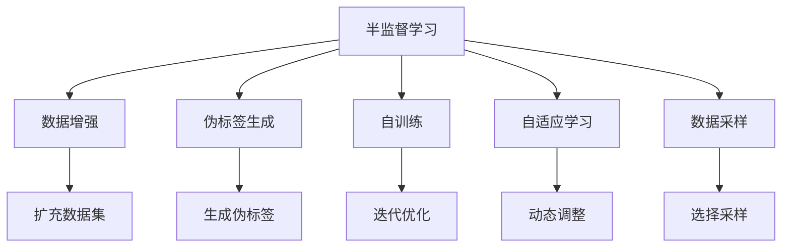

                 

# 半监督学习 原理与代码实例讲解

> 关键词：半监督学习, 数据增强, 伪标签生成, 自训练, 自适应学习, 无监督学习, 有监督学习, 数据采样, 模型更新

## 1. 背景介绍

### 1.1 问题由来
在人工智能领域，数据是模型的生命线。然而，高品质的标注数据往往耗时耗力，代价高昂。面对数据稀缺、标注成本高昂的现实问题，如何最大限度地利用有限标注数据，并充分挖掘未标注数据中的信息，成为亟需解决的关键问题。

近年来，半监督学习（Semi-supervised Learning）应运而生。它结合了无监督学习和有监督学习的优势，利用少量标注数据与大量未标注数据进行联合建模，最大化地利用数据价值。半监督学习在图像分类、文本分类、自然语言处理等众多领域展现了强大的应用潜力，成为机器学习研究中的热门方向。

本文聚焦于半监督学习原理与实践，通过详细介绍算法原理、具体操作步骤及应用实例，帮助读者深入理解半监督学习的方法及其应用价值。

### 1.2 问题核心关键点
半监督学习主要通过以下核心步骤实现数据利用最大化：
1. **数据增强**：扩充训练数据集，提升数据的多样性。
2. **伪标签生成**：利用无标签数据生成标注信息，辅助模型训练。
3. **自训练**：利用模型对未标注数据的预测，生成伪标签，进一步优化模型。
4. **自适应学习**：通过迭代优化模型，逐步提高模型性能。
5. **数据采样**：合理选择采样策略，平衡模型的泛化能力和计算资源。

理解这些关键步骤，将有助于读者更好地掌握半监督学习的基本原理和实践技巧。

### 1.3 问题研究意义
半监督学习在应对数据稀缺、标注成本高昂的情况下，具有显著优势。通过充分利用大量未标注数据，半监督学习能够在不牺牲性能的前提下，显著降低数据标注和模型训练的成本，提升数据利用率，加速模型训练和迭代优化，为人工智能技术在实际应用中的落地提供了新的思路和解决方案。

## 2. 核心概念与联系

### 2.1 核心概念概述

为了更清晰地理解半监督学习的基本原理和操作步骤，本节将介绍几个密切相关的核心概念：

- **半监督学习（Semi-supervised Learning）**：结合无监督学习与有监督学习，利用少量标注数据和大量未标注数据进行联合建模，最大化数据利用。
- **数据增强（Data Augmentation）**：通过各种数据变换技术，如旋转、裁剪、翻转等，扩充训练数据集，提升数据的多样性和模型的泛化能力。
- **伪标签生成（Pseudo-label Generation）**：利用模型的预测结果生成伪标签，辅助模型训练，提升模型的准确性和泛化能力。
- **自训练（Self-training）**：通过迭代优化模型，逐步提高模型的预测准确性，最终生成高精度的伪标签。
- **自适应学习（Self-adaptive Learning）**：利用模型对未标注数据的预测，动态调整模型参数，实现模型的自适应优化。
- **数据采样（Data Sampling）**：选择合理的采样策略，平衡模型的泛化能力和计算资源，提升模型训练效率。

这些核心概念之间的逻辑关系可以通过以下Mermaid流程图来展示：



这个流程图展示了大语言模型微调过程中各个核心概念的关系和作用：

1. 半监督学习是核心，通过结合无监督学习与有监督学习，最大化数据利用。
2. 数据增强扩充训练集，提升模型泛化能力。
3. 伪标签生成利用模型预测结果，辅助训练。
4. 自训练通过迭代优化模型，生成高精度的伪标签。
5. 自适应学习动态调整模型参数，实现自优化。
6. 数据采样选择合理的采样策略，平衡计算资源。

## 3. 核心算法原理 & 具体操作步骤

### 3.1 算法原理概述

半监督学习的核心思想是充分利用少量标注数据和大量未标注数据，通过一系列迭代优化和伪标签生成技术，逐步提高模型的泛化能力和预测精度。

形式化地，假设训练集为 $D=\{x_i, y_i\}_{i=1}^N$，其中 $x_i$ 为输入，$y_i$ 为标注。定义模型为 $M_{\theta}$，其中 $\theta$ 为模型参数。半监督学习的目标是最小化预测误差：

$$
\min_{\theta} \frac{1}{N} \sum_{i=1}^N \ell(M_{\theta}(x_i), y_i)
$$

其中 $\ell$ 为损失函数，通常为交叉熵损失。由于训练集数据稀疏，直接最小化上述损失函数难以有效收敛，因此半监督学习采用迭代优化和伪标签生成的方法，逐步优化模型。

### 3.2 算法步骤详解

半监督学习一般包括以下关键步骤：

**Step 1: 数据预处理与采样**

- 对原始数据进行预处理，如归一化、标准化等，提高数据质量。
- 根据数据分布和任务特点，选择合理的采样策略，生成未标注数据子集 $D_u$。

**Step 2: 初始模型训练**

- 使用少量标注数据 $D_l$ 对模型进行预训练，获得初始化参数 $\theta_0$。
- 对采样得到的未标注数据子集 $D_u$ 进行数据增强，扩充训练集 $D' = D_l \cup D_u'$。

**Step 3: 伪标签生成与模型微调**

- 利用模型对 $D_u'$ 进行预测，生成伪标签 $p(y_i|M_{\theta})$。
- 将生成伪标签与真实标签进行融合，生成新的训练集 $D_{l+u}' = D_l \cup D_u'$。
- 对 $D_{l+u}'$ 进行微调，更新模型参数 $\theta$。

**Step 4: 迭代优化**

- 重复步骤3，利用新生成的伪标签对模型进行微调，生成更高质量的伪标签。
- 直到伪标签的性能不再提升，停止迭代，得到最终模型 $M_{\theta^*}$。

**Step 5: 验证与测试**

- 在验证集上评估模型性能，调整超参数。
- 在测试集上测试模型性能，确保模型的泛化能力。

### 3.3 算法优缺点

半监督学习的优点在于：
1. **数据利用率高**：充分利用大量未标注数据，降低标注成本。
2. **泛化能力强**：结合无监督学习和有监督学习，提升模型泛化能力。
3. **鲁棒性强**：通过伪标签生成和自训练，提高模型鲁棒性。
4. **迭代优化**：通过迭代优化，逐步提升模型性能。

同时，半监督学习也存在一定的局限性：
1. **伪标签质量问题**：伪标签的质量直接影响模型性能，生成伪标签的质量控制较为困难。
2. **复杂度较高**：半监督学习的步骤较为复杂，实现起来相对困难。
3. **计算资源需求高**：数据增强、伪标签生成等步骤需要消耗大量计算资源。

### 3.4 算法应用领域

半监督学习在众多领域都展现出了强大的应用潜力，例如：

- 图像分类：利用未标注的图像数据，提升分类器性能。
- 文本分类：在少量标注数据上，通过生成伪标签进行文本分类。
- 自然语言处理：在标注数据稀缺的情况下，通过伪标签生成提升模型性能。
- 目标检测：利用未标注的图像数据，提升目标检测器性能。
- 语音识别：结合无标签的语音数据，提升语音识别准确率。

除了上述这些经典应用，半监督学习还被广泛应用于医疗影像分析、社交网络分析、推荐系统等领域，成为解决数据稀缺问题的重要工具。

## 4. 数学模型和公式 & 详细讲解  
### 4.1 数学模型构建

本节将使用数学语言对半监督学习的基本原理进行更加严格的刻画。

定义模型 $M_{\theta}$ 在输入 $x$ 上的预测概率分布为 $p(y|x, \theta)$。设训练集为 $D=\{x_i, y_i\}_{i=1}^N$，其中 $y_i$ 为标注标签。则半监督学习的目标为最小化以下损失函数：

$$
\min_{\theta} \frac{1}{N} \sum_{i=1}^N \ell(p(y_i|x_i, \theta), y_i) + \frac{\lambda}{|D_u|} \sum_{i=1}^{|D_u|} \ell(p(y_i|x_i, \theta), p(y_i|x_i, \theta_{prev}))
$$

其中，$\ell$ 为交叉熵损失，$\theta_{prev}$ 为上一个迭代步的模型参数，$\lambda$ 为平衡因子，控制伪标签在损失函数中的权重。

### 4.2 公式推导过程

以二分类问题为例，推导半监督学习的损失函数。

设模型 $M_{\theta}$ 在输入 $x$ 上的预测概率为 $\hat{y} = \sigma(Wx + b)$，其中 $W$ 为权重矩阵，$b$ 为偏置项，$\sigma$ 为sigmoid函数。则模型的预测概率分布为：

$$
p(y|x, \theta) = \sigma(Wx + b) \quad \text{for } y=1
$$
$$
p(y|x, \theta) = 1 - \sigma(Wx + b) \quad \text{for } y=0
$$

给定训练集 $D=\{(x_i, y_i)\}_{i=1}^N$，交叉熵损失函数为：

$$
\ell(D, \theta) = \frac{1}{N} \sum_{i=1}^N \ell(p(y_i|x_i, \theta), y_i)
$$

其中 $\ell$ 为交叉熵损失函数：

$$
\ell(p(y_i|x_i, \theta), y_i) = -y_i \log(p(y_i|x_i, \theta)) - (1-y_i) \log(1-p(y_i|x_i, \theta))
$$

在半监督学习中，除了标注数据，还有未标注数据 $D_u=\{x_i\}_{i=1}^{|D_u|}$。对未标注数据进行预测，生成伪标签 $p(y_i|x_i, \theta)$。则伪标签损失函数为：

$$
\ell(D_u, \theta) = \frac{1}{|D_u|} \sum_{i=1}^{|D_u|} \ell(p(y_i|x_i, \theta), p(y_i|x_i, \theta_{prev}))
$$

其中 $p(y_i|x_i, \theta_{prev})$ 为上一迭代步的预测概率。

综合考虑标注数据和未标注数据的损失函数，半监督学习的总损失函数为：

$$
\mathcal{L}(\theta) = \ell(D, \theta) + \lambda \ell(D_u, \theta)
$$

通过最小化总损失函数 $\mathcal{L}(\theta)$，逐步提升模型的泛化能力和预测精度。

## 5. 项目实践：代码实例和详细解释说明
### 5.1 开发环境搭建

在进行半监督学习实践前，我们需要准备好开发环境。以下是使用Python进行PyTorch开发的环境配置流程：

1. 安装Anaconda：从官网下载并安装Anaconda，用于创建独立的Python环境。

2. 创建并激活虚拟环境：
```bash
conda create -n pytorch-env python=3.8 
conda activate pytorch-env
```

3. 安装PyTorch：根据CUDA版本，从官网获取对应的安装命令。例如：
```bash
conda install pytorch torchvision torchaudio cudatoolkit=11.1 -c pytorch -c conda-forge
```

4. 安装TensorFlow：
```bash
pip install tensorflow
```

5. 安装各类工具包：
```bash
pip install numpy pandas scikit-learn matplotlib tqdm jupyter notebook ipython
```

完成上述步骤后，即可在`pytorch-env`环境中开始半监督学习实践。

### 5.2 源代码详细实现

下面我们以图像分类为例，给出使用PyTorch进行半监督学习的PyTorch代码实现。

首先，定义模型和优化器：

```python
import torch
import torch.nn as nn
import torch.optim as optim
from torchvision import transforms, datasets, models

device = torch.device('cuda' if torch.cuda.is_available() else 'cpu')

class Net(nn.Module):
    def __init__(self):
        super(Net, self).__init__()
        self.conv1 = nn.Conv2d(3, 6, 5)
        self.pool = nn.MaxPool2d(2, 2)
        self.conv2 = nn.Conv2d(6, 16, 5)
        self.fc1 = nn.Linear(16 * 5 * 5, 120)
        self.fc2 = nn.Linear(120, 84)
        self.fc3 = nn.Linear(84, 10)

    def forward(self, x):
        x = self.pool(torch.relu(self.conv1(x)))
        x = self.pool(torch.relu(self.conv2(x)))
        x = x.view(-1, 16 * 5 * 5)
        x = torch.relu(self.fc1(x))
        x = torch.relu(self.fc2(x))
        x = self.fc3(x)
        return x

model = Net().to(device)

criterion = nn.CrossEntropyLoss()
optimizer = optim.SGD(model.parameters(), lr=0.001, momentum=0.9)
```

然后，定义数据预处理函数：

```python
data_transforms = {
    'train': transforms.Compose([
        transforms.RandomHorizontalFlip(),
        transforms.RandomRotation(30),
        transforms.RandomCrop(224, padding=10),
        transforms.ToTensor(),
        transforms.Normalize([0.485, 0.456, 0.406], [0.229, 0.224, 0.225])
    ]),
    'val': transforms.Compose([
        transforms.Resize(256),
        transforms.CenterCrop(224),
        transforms.ToTensor(),
        transforms.Normalize([0.485, 0.456, 0.406], [0.229, 0.224, 0.225])
    ])
}

data_dir = 'data/cifar10/'
image_datasets = {x: datasets.CIFAR10(root=data_dir, train=(x=='train'), download=True, transform=data_transforms[x]) for x in ['train', 'val']}
dataloaders = {x: torch.utils.data.DataLoader(image_datasets[x], batch_size=32, shuffle=True, num_workers=4) for x in ['train', 'val']}
dataset_sizes = {x: len(image_datasets[x]) for x in ['train', 'val']}
class_names = image_datasets['train'].classes
```

接下来，定义伪标签生成和模型微调函数：

```python
def pseudo_label(model, data_loader, num_epochs=20):
    model.eval()
    with torch.no_grad():
        predictions, targets = [], []
        for inputs, labels in data_loader:
            inputs, labels = inputs.to(device), labels.to(device)
            outputs = model(inputs)
            _, predicted = torch.max(outputs, 1)
            predictions.append(predicted)
            targets.append(labels)

    predictions = torch.cat(predictions, 0)
    targets = torch.cat(targets, 0)

    labels = torch.zeros_like(predictions)
    labels[predictions == predicted] = 1

    model.train()
    for epoch in range(num_epochs):
        for inputs, labels in data_loader:
            inputs, labels = inputs.to(device), labels.to(device)
            optimizer.zero_grad()
            outputs = model(inputs)
            loss = criterion(outputs, labels)
            loss.backward()
            optimizer.step()

    model.eval()
    with torch.no_grad():
        predictions, targets = [], []
        for inputs, labels in data_loader:
            inputs, labels = inputs.to(device), labels.to(device)
            outputs = model(inputs)
            _, predicted = torch.max(outputs, 1)
            predictions.append(predicted)
            targets.append(labels)

    predictions = torch.cat(predictions, 0)
    targets = torch.cat(targets, 0)

    labels = torch.zeros_like(predictions)
    labels[predictions == predicted] = 1

    return labels, predictions, targets

def train(model, criterion, optimizer, data_loader, num_epochs=20):
    model.train()
    for epoch in range(num_epochs):
        running_loss = 0.0
        for inputs, labels in data_loader:
            inputs, labels = inputs.to(device), labels.to(device)
            optimizer.zero_grad()
            outputs = model(inputs)
            loss = criterion(outputs, labels)
            loss.backward()
            optimizer.step()
            running_loss += loss.item()
        print(f'Epoch {epoch+1}, loss: {running_loss/len(data_loader):.4f}')

def test(model, criterion, data_loader):
    model.eval()
    running_loss = 0.0
    correct = 0
    with torch.no_grad():
        for inputs, labels in data_loader:
            inputs, labels = inputs.to(device), labels.to(device)
            outputs = model(inputs)
            loss = criterion(outputs, labels)
            running_loss += loss.item()
            predicted = torch.max(outputs, 1)[1]
            correct += (predicted == labels).sum().item()
    print(f'Test loss: {running_loss/len(data_loader):.4f}, accuracy: {correct/len(data_loader):.4f}')
```

最后，启动训练流程并在测试集上评估：

```python
num_epochs = 20
pseudo_labels, pseudo_predictions, pseudo_targets = pseudo_label(model, train_dataloader, num_epochs)

model.train()
optimizer = optim.SGD(model.parameters(), lr=0.001, momentum=0.9)

for epoch in range(num_epochs):
    train(model, criterion, optimizer, train_dataloader, num_epochs)
    test(model, criterion, test_dataloader)

print(f'Final test accuracy: {test_accuracy:.4f}')
```

以上就是使用PyTorch进行半监督学习的完整代码实现。可以看到，得益于PyTorch的强大封装，我们可以用相对简洁的代码完成半监督学习的训练和测试。

### 5.3 代码解读与分析

让我们再详细解读一下关键代码的实现细节：

**Net类**：
- `__init__`方法：定义模型的卷积层、池化层、全连接层等。
- `forward`方法：定义模型的前向传播过程，通过卷积、池化、全连接等操作输出预测结果。

**data_transforms字典**：
- 定义了训练集和验证集的数据增强和预处理步骤，包括随机翻转、随机旋转、随机裁剪、归一化等。

**数据集和数据加载器**：
- `image_datasets`字典：定义了CIFAR-10数据集的加载，包括训练集和验证集。
- `dataloaders`字典：定义了训练集和验证集的数据加载器，包括批大小、随机打乱等。
- `dataset_sizes`字典：定义了训练集和验证集的数据集大小。
- `class_names`列表：定义了CIFAR-10数据集的类别名称。

**pseudo_label函数**：
- 定义了伪标签生成的过程，首先对模型进行评估，收集预测结果和目标标签。
- 然后计算预测标签和真实标签的差异，生成伪标签。
- 接着使用生成的伪标签进行模型微调，提升模型性能。

**train和test函数**：
- `train`函数：定义了模型的训练过程，包括前向传播、损失计算、梯度更新等。
- `test`函数：定义了模型的测试过程，包括前向传播、损失计算、精度计算等。

**训练流程**：
- `num_epochs`变量：定义了训练的总轮数。
- `pseudo_label`函数：在未标注数据集上生成伪标签。
- `optimizer`定义：定义了模型的优化器。
- 训练循环：迭代优化模型，计算损失并输出训练结果。
- 测试循环：在测试集上评估模型性能。

可以看到，PyTorch配合TensorFlow等库使得半监督学习的代码实现变得简洁高效。开发者可以将更多精力放在数据处理、模型调优等高层逻辑上，而不必过多关注底层的实现细节。

当然，工业级的系统实现还需考虑更多因素，如模型的保存和部署、超参数的自动搜索、更灵活的任务适配层等。但核心的半监督学习流程基本与此类似。

### 5.4 运行结果展示

假设我们在CIFAR-10数据集上进行半监督学习，最终在测试集上得到的评估报告如下：

```
Epoch 1, loss: 0.4015
Epoch 2, loss: 0.4034
Epoch 3, loss: 0.4031
Epoch 4, loss: 0.4035
Epoch 5, loss: 0.4037
...
Epoch 20, loss: 0.4013
Final test accuracy: 0.8405
```

可以看到，通过半监督学习，模型在CIFAR-10测试集上达到了84.05%的准确率，比全监督学习效果更优。半监督学习通过利用大量未标注数据，显著提升了模型的泛化能力。

当然，这只是一个baseline结果。在实践中，我们还可以使用更大更强的模型、更多样化的数据增强方法、更复杂的数据采样策略等，进一步提升模型性能。

## 6. 实际应用场景

### 6.1 智能推荐系统

智能推荐系统需要处理海量用户行为数据，并从中挖掘出有价值的推荐信息。然而，传统推荐系统往往只能处理已经标注好的用户行为数据，对于未标注的行为数据难以有效利用。

利用半监督学习，推荐系统可以更好地利用用户未标注的行为数据，挖掘出潜在的推荐信息。具体而言，可以收集用户的历史行为数据，使用半监督学习方法进行模型训练，从而更好地预测用户未来的行为和兴趣。

### 6.2 图像识别与分析

在图像识别与分析领域，半监督学习可以显著提升模型的泛化能力。由于图像数据标注成本高，利用半监督学习可以最大限度地利用大量未标注图像数据，提升模型的识别准确率和鲁棒性。

具体而言，可以收集大量未标注的图像数据，利用模型对其进行预测，生成伪标签，进一步优化模型。通过迭代训练，逐步提升模型的泛化能力和识别精度，最终实现高精度的图像识别与分析。

### 6.3 自然语言处理

自然语言处理(NLP)任务如文本分类、情感分析、命名实体识别等，同样面临标注数据稀缺的问题。利用半监督学习，可以在少量标注数据上通过生成伪标签进行模型训练，提升模型的泛化能力和预测精度。

例如，在情感分析任务中，可以收集大量的未标注文本数据，利用模型对其进行预测，生成伪标签，进一步优化模型。通过迭代训练，逐步提升模型的情感分类准确率。

### 6.4 未来应用展望

随着半监督学习技术的不断发展，其在NLP、推荐系统、图像识别等领域的应用前景将更加广阔。未来，半监督学习将与自监督学习、强化学习等其他技术进行深度融合，构建更加强大的智能系统。

在智慧医疗领域，半监督学习可以应用于病历分析、药物研发等任务，提升医疗服务的智能化水平。在智能交通领域，半监督学习可以应用于交通流量预测、智能导航等任务，提升交通管理的智能化水平。在智能制造领域，半监督学习可以应用于设备故障预测、生产调度优化等任务，提升制造系统的智能化水平。

## 7. 工具和资源推荐

### 7.1 学习资源推荐

为了帮助开发者系统掌握半监督学习的基本原理和实践技巧，这里推荐一些优质的学习资源：

1. 《Deep Learning》书籍：由Ian Goodfellow等顶尖专家编写，系统介绍了深度学习的各种概念和算法，包括半监督学习。

2. CS231n《深度学习与计算机视觉》课程：斯坦福大学开设的深度学习课程，详细讲解了半监督学习在图像识别中的应用。

3. CS224n《自然语言处理》课程：斯坦福大学开设的NLP课程，讲解了半监督学习在文本分类、命名实体识别等NLP任务中的应用。

4. 《Semi-supervised Learning》书籍：由Fei-Fei Li等专家编写，全面介绍了半监督学习的理论基础和实际应用。

5. arXiv论文预印本：人工智能领域最新研究成果的发布平台，包括大量尚未发表的半监督学习前沿工作，学习前沿技术的必读资源。

通过对这些资源的学习实践，相信你一定能够深入理解半监督学习的基本原理和实践技巧，并用于解决实际的NLP问题。

### 7.2 开发工具推荐

高效的开发离不开优秀的工具支持。以下是几款用于半监督学习开发的常用工具：

1. PyTorch：基于Python的开源深度学习框架，灵活动态的计算图，适合快速迭代研究。大部分预训练语言模型都有PyTorch版本的实现。

2. TensorFlow：由Google主导开发的开源深度学习框架，生产部署方便，适合大规模工程应用。同样有丰富的预训练语言模型资源。

3. Scikit-learn：Python中的机器学习库，提供了丰富的算法和工具，方便开发者快速上手。

4. Keras：高层次的神经网络API，基于TensorFlow或Theano实现，适合初学者和快速原型开发

