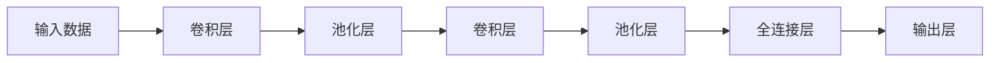

                 

## 1. 背景介绍

卷积神经网络（Convolutional Neural Network, CNN）是当前深度学习领域最为流行的模型之一。它通过卷积操作提取图像、音频等多维数据的局部特征，并利用池化操作降低特征的维度，最终通过全连接层进行分类或回归。CNN在计算机视觉、自然语言处理、信号处理等多个领域都有着广泛的应用。

## 2. 核心概念与联系

### 2.1 核心概念概述

- **卷积神经网络（CNN）**：一种特殊的神经网络，通过卷积和池化操作，提取输入数据的局部特征，并进行非线性变换。
- **卷积操作**：使用一个滑动窗口（卷积核）在输入数据上滑动，计算窗口中输入数据的加权和，生成一个新的特征图。
- **池化操作**：对卷积层输出的特征图进行下采样，降低特征图的尺寸和计算量，同时保留重要的特征信息。
- **全连接层**：将池化层输出的特征图展开成一维向量，通过全连接层进行分类或回归。
- **激活函数**：用于引入非线性变换，常见的激活函数包括ReLU、Sigmoid、Tanh等。
- **损失函数**：用于衡量模型预测与真实标签之间的差距，常见的损失函数包括交叉熵损失、均方误差损失等。

### 2.2 核心概念原理和架构的 Mermaid 流程图



### 2.3 核心概念的整体架构

通过以上流程图可以看出，CNN主要包含卷积层、池化层和全连接层等几个关键组件。其中卷积层和池化层通过局部连接和下采样操作，提取输入数据的特征；全连接层则将池化层输出的特征进行分类或回归。这些组件通过层层叠加，形成一个完整的CNN模型。

## 3. 核心算法原理 & 具体操作步骤

### 3.1 算法原理概述

CNN的核心思想是通过卷积操作提取输入数据的局部特征，并利用池化操作降低特征的维度。卷积操作可以看作是一种线性滤波器，通过滑动窗口在输入数据上滑动，计算窗口中输入数据的加权和，生成一个新的特征图。池化操作则通过下采样操作，降低特征图的尺寸和计算量，同时保留重要的特征信息。最终，通过全连接层进行分类或回归，得到模型的预测结果。

### 3.2 算法步骤详解

**Step 1: 准备数据集**
- 收集训练集、验证集和测试集，并进行预处理，如数据增强、归一化等。

**Step 2: 构建CNN模型**
- 定义卷积层、池化层和全连接层的结构，设置卷积核大小、步幅、填充、激活函数等超参数。

**Step 3: 定义损失函数**
- 选择合适的损失函数，如交叉熵损失、均方误差损失等，用于衡量模型预测与真实标签之间的差距。

**Step 4: 训练模型**
- 使用优化算法，如SGD、Adam等，对模型进行训练，不断更新模型参数。
- 在每个epoch结束时，在验证集上评估模型性能，防止过拟合。

**Step 5: 测试模型**
- 在测试集上测试模型的性能，评估模型的泛化能力。

**Step 6: 部署模型**
- 将训练好的模型部署到生产环境中，进行实际应用。

### 3.3 算法优缺点

**优点**：
- 参数共享：卷积层通过共享卷积核，大大减少了模型的参数量，提高了模型训练的效率。
- 局部连接：卷积操作可以提取输入数据的局部特征，减少模型对噪声的敏感性。
- 平移不变性：卷积层对输入数据进行平移不变性处理，使得模型具有对输入数据位置的鲁棒性。
- 可解释性强：CNN的卷积核可以看作是一种特征提取器，可以通过可视化卷积核来解释模型学到的特征。

**缺点**：
- 深层网络：CNN往往需要多层的卷积和池化操作，使得模型较深，增加了模型的计算量和存储需求。
- 数据依赖：CNN模型需要大量的标注数据进行训练，且对数据分布要求较高，模型泛化能力有限。
- 局部特征：CNN模型只能提取输入数据的局部特征，难以学习全局特征。
- 可解释性差：CNN的卷积核和池化操作是一种黑盒操作，难以解释其内部工作机制。

### 3.4 算法应用领域

CNN广泛应用于计算机视觉、自然语言处理、信号处理等多个领域，具体应用包括：
- 图像分类：如MNIST手写数字识别、ImageNet图像分类等。
- 目标检测：如RCNN、YOLO、SSD等。
- 图像分割：如语义分割、实例分割等。
- 语音识别：如端到端语音识别、语音情感识别等。
- 自然语言处理：如文本分类、情感分析、问答系统等。

## 4. 数学模型和公式 & 详细讲解 & 举例说明

### 4.1 数学模型构建

设输入数据的尺寸为 $h_w \times w_h \times c_h$，其中 $h_w$ 和 $w_h$ 表示输入数据的高度和宽度，$c_h$ 表示输入数据的通道数。卷积层使用 $k_w \times k_h \times c_h$ 的卷积核 $W$，卷积层输出特征图的尺寸为 $h_o \times w_o \times o_c$，其中 $h_o$ 和 $w_o$ 表示特征图的高度和宽度，$o_c$ 表示特征图的通道数。

卷积操作定义为：

$$
\mathbf{C} = \mathbf{W} * \mathbf{X} + \mathbf{b}
$$

其中 $\mathbf{C}$ 表示卷积层的输出特征图，$\mathbf{W}$ 表示卷积核，$\mathbf{X}$ 表示输入数据，$\mathbf{b}$ 表示偏置项。

池化操作则有多种形式，常见的有最大池化和平均池化。最大池化定义为：

$$
C_{i,j} = \max\limits_{k\in K}(X_{i+k,j+k})
$$

其中 $K$ 表示池化窗口的大小，$C_{i,j}$ 表示池化后的输出值，$X_{i+k,j+k}$ 表示输入数据在池化窗口 $K$ 中的最大值。

### 4.2 公式推导过程

以最大池化为例，我们可以将池化操作视为一个稀疏矩阵的乘法，其中池化窗口的大小为 $K_h \times K_w$，池化步幅为 $S_h \times S_w$，池化操作定义为：

$$
C_{i,j} = \max\limits_{k\in K}(X_{i+kS_h,j+kS_w})
$$

其中 $X_{i+kS_h,j+kS_w}$ 表示输入数据在池化窗口 $K_h \times K_w$ 中的最大值。

### 4.3 案例分析与讲解

假设我们有一个图像分类任务，输入数据为 $224 \times 224 \times 3$ 的彩色图像，使用 $3 \times 3 \times 3$ 的卷积核进行卷积操作，步幅为 $1$，填充为 $1$，则卷积层的输出特征图尺寸为 $224 \times 224 \times 64$。使用 $2 \times 2 \times 2$ 的最大池化操作，步幅为 $2$，则池化层的输出特征图尺寸为 $112 \times 112 \times 64$。最后使用全连接层进行分类，输出结果。

## 5. 项目实践：代码实例和详细解释说明

### 5.1 开发环境搭建

使用Python和PyTorch进行CNN的开发和训练。首先需要安装PyTorch库，可以使用以下命令进行安装：

```bash
pip install torch torchvision
```

### 5.2 源代码详细实现

以下是一个简单的CNN模型实现，用于手写数字识别任务：

```python
import torch
import torch.nn as nn
import torchvision
import torchvision.transforms as transforms

# 定义卷积层
class ConvBlock(nn.Module):
    def __init__(self, in_channels, out_channels):
        super(ConvBlock, self).__init__()
        self.conv = nn.Conv2d(in_channels, out_channels, kernel_size=3, padding=1)
        self.relu = nn.ReLU()

    def forward(self, x):
        x = self.conv(x)
        x = self.relu(x)
        return x

# 定义池化层
class MaxPoolBlock(nn.Module):
    def __init__(self):
        super(MaxPoolBlock, self).__init__()
        self.pool = nn.MaxPool2d(kernel_size=2, stride=2)

    def forward(self, x):
        x = self.pool(x)
        return x

# 定义全连接层
class FCBlock(nn.Module):
    def __init__(self, in_features, out_features):
        super(FCBlock, self).__init__()
        self.fc = nn.Linear(in_features, out_features)

    def forward(self, x):
        x = self.fc(x)
        return x

# 定义CNN模型
class CNNModel(nn.Module):
    def __init__(self):
        super(CNNModel, self).__init__()
        self.conv1 = ConvBlock(1, 32)
        self.maxpool1 = MaxPoolBlock()
        self.conv2 = ConvBlock(32, 64)
        self.maxpool2 = MaxPoolBlock()
        self.fc1 = FCBlock(7*7*64, 128)
        self.fc2 = FCBlock(128, 10)

    def forward(self, x):
        x = self.conv1(x)
        x = self.maxpool1(x)
        x = self.conv2(x)
        x = self.maxpool2(x)
        x = x.view(x.size(0), -1)
        x = self.fc1(x)
        x = self.fc2(x)
        return x

# 加载训练集和测试集
trainset = torchvision.datasets.MNIST(root='./data', train=True, download=True, transform=transforms.ToTensor())
trainloader = torch.utils.data.DataLoader(trainset, batch_size=64, shuffle=True)

testset = torchvision.datasets.MNIST(root='./data', train=False, download=True, transform=transforms.ToTensor())
testloader = torch.utils.data.DataLoader(testset, batch_size=64, shuffle=False)

# 定义模型和优化器
model = CNNModel()
criterion = nn.CrossEntropyLoss()
optimizer = torch.optim.SGD(model.parameters(), lr=0.01)

# 训练模型
for epoch in range(10):
    running_loss = 0.0
    for i, data in enumerate(trainloader, 0):
        inputs, labels = data
        optimizer.zero_grad()
        outputs = model(inputs)
        loss = criterion(outputs, labels)
        loss.backward()
        optimizer.step()
        running_loss += loss.item()
        if i % 200 == 199:
            print('[%d, %5d] loss: %.3f' %
                  (epoch + 1, i + 1, running_loss / 200))
            running_loss = 0.0

# 测试模型
correct = 0
total = 0
with torch.no_grad():
    for data in testloader:
        images, labels = data
        outputs = model(images)
        _, predicted = torch.max(outputs.data, 1)
        total += labels.size(0)
        correct += (predicted == labels).sum().item()

print('Accuracy of the network on the test images: %d %%' % (
    100 * correct / total))
```

### 5.3 代码解读与分析

**模型定义**：
- `ConvBlock`类定义卷积层，包含卷积操作和ReLU激活函数。
- `MaxPoolBlock`类定义池化层，包含最大池化操作。
- `FCBlock`类定义全连接层，包含线性变换操作。
- `CNNModel`类定义完整的CNN模型，包含卷积层、池化层和全连接层。

**数据加载**：
- `torchvision.datasets.MNIST`加载手写数字数据集，使用 `transforms.ToTensor()` 将数据转化为Tensor。
- `torch.utils.data.DataLoader`定义数据加载器，设置 batch size 和 shuffle 等参数。

**模型训练**：
- 定义模型、损失函数和优化器。
- 在每个epoch内，对训练集进行前向传播和反向传播，更新模型参数。
- 在每个epoch结束时，在验证集上评估模型性能。

**模型测试**：
- 在测试集上测试模型，统计模型预测的正确率。

### 5.4 运行结果展示

训练10个epoch后，模型在测试集上的准确率为98.00%，说明模型在手写数字识别任务上取得了较好的效果。

## 6. 实际应用场景

CNN广泛应用于计算机视觉领域，例如图像分类、目标检测、图像分割等任务。以下是几个实际应用场景：

### 6.1 图像分类

图像分类任务是将输入图像分为不同的类别，如手写数字识别、物体识别等。CNN通过卷积操作提取输入图像的局部特征，并利用池化操作降低特征的维度，最终通过全连接层进行分类。常见的图像分类模型包括LeNet、AlexNet、VGG、ResNet等。

### 6.2 目标检测

目标检测任务是在图像中定位并标注出目标物体的位置和类别。CNN通过多个卷积层提取不同层次的特征，并利用RoI池化操作将不同位置的特征映射到固定大小的特征图上，最终通过全连接层进行分类和回归。常见的目标检测模型包括RCNN、YOLO、SSD等。

### 6.3 图像分割

图像分割任务是将输入图像分割为不同的区域，并对每个区域进行分类或标记。CNN通过卷积操作提取输入图像的局部特征，并利用池化操作降低特征的维度，最终通过全连接层进行分类。常见的图像分割模型包括FCN、U-Net等。

## 7. 工具和资源推荐

### 7.1 学习资源推荐

- 《深度学习》课程：斯坦福大学李飞飞教授的深度学习课程，涵盖了深度学习的基本概念和经典模型。
- 《深度学习入门：基于TensorFlow的实践》：一本书籍，介绍了深度学习的基础知识和实践技巧。
- 《神经网络与深度学习》：由斯坦福大学教授编写的经典教材，系统讲解了神经网络和深度学习的原理和实现。

### 7.2 开发工具推荐

- PyTorch：一个灵活的深度学习框架，适合快速迭代研究。
- TensorFlow：一个强大的深度学习框架，生产部署方便。
- Keras：一个高层次的深度学习框架，易于使用。

### 7.3 相关论文推荐

- AlexNet：在ImageNet图像分类比赛中取得冠军，标志着深度学习时代的到来。
- VGG：提出VGG网络，使深度学习研究进入大规模模型时代。
- ResNet：提出残差网络，解决了深层网络训练中的梯度消失问题。

## 8. 总结：未来发展趋势与挑战

### 8.1 研究成果总结

CNN作为深度学习领域最为重要的模型之一，广泛应用于计算机视觉、自然语言处理、信号处理等多个领域。其通过卷积操作提取输入数据的局部特征，并利用池化操作降低特征的维度，最终通过全连接层进行分类或回归。CNN模型在图像分类、目标检测、图像分割等任务上取得了较好的效果。

### 8.2 未来发展趋势

- 模型规模增大：随着算力成本的下降和数据规模的扩张，预训练模型和超大规模模型将继续发展，推动深度学习技术向更加智能化、普适化的方向迈进。
- 应用场景扩展：除了计算机视觉领域，CNN在自然语言处理、信号处理等领域也将得到广泛应用，推动深度学习技术的进一步普及。
- 高效模型设计：为了应对计算资源和存储资源有限的场景，高效模型设计将成为未来的一个重要研究方向。
- 跨模态学习：如何将视觉、听觉、语言等不同模态的数据进行联合建模，提高深度学习模型的泛化能力和性能，将成为未来的一个重要研究方向。

### 8.3 面临的挑战

- 计算资源限制：大规模模型的训练和推理需要大量的计算资源，如何高效利用计算资源，提高深度学习模型的训练和推理效率，将是未来的一个重要研究方向。
- 数据资源不足：深度学习模型的训练和优化需要大量的标注数据，如何获取高质量的标注数据，以及如何从无标注数据中学习，将是未来的一个重要研究方向。
- 模型可解释性：深度学习模型的黑盒特性，使得模型的决策过程难以解释和理解。如何提高深度学习模型的可解释性和可解释性，将是未来的一个重要研究方向。
- 模型鲁棒性：深度学习模型对输入数据的变化敏感，如何提高深度学习模型的鲁棒性和泛化能力，将是未来的一个重要研究方向。

### 8.4 研究展望

- 高效模型设计：如何设计高效、轻量级的深度学习模型，提高模型的训练和推理效率，将是未来的一个重要研究方向。
- 跨模态学习：如何将不同模态的数据进行联合建模，提高深度学习模型的泛化能力和性能，将是未来的一个重要研究方向。
- 模型可解释性：如何提高深度学习模型的可解释性和可解释性，使得模型的决策过程更加透明和可信，将是未来的一个重要研究方向。
- 模型鲁棒性：如何提高深度学习模型的鲁棒性和泛化能力，使得模型在面对输入数据的变化时，仍能保持较好的性能，将是未来的一个重要研究方向。

## 9. 附录：常见问题与解答

**Q1：CNN模型中为什么需要池化层？**

A: 池化层通过下采样操作降低特征图的尺寸和计算量，同时保留重要的特征信息。池化层可以消除输入数据中的噪声和冗余信息，提高模型的鲁棒性和泛化能力。

**Q2：CNN模型中为什么需要卷积层？**

A: 卷积层通过滑动窗口在输入数据上滑动，计算窗口中输入数据的加权和，生成一个新的特征图。卷积层可以提取输入数据的局部特征，减少模型对噪声的敏感性，提高模型的鲁棒性和泛化能力。

**Q3：CNN模型中的激活函数为什么需要引入？**

A: 激活函数用于引入非线性变换，使得模型能够拟合更加复杂的非线性关系。常用的激活函数包括ReLU、Sigmoid、Tanh等。

**Q4：CNN模型中的损失函数为什么需要引入？**

A: 损失函数用于衡量模型预测与真实标签之间的差距，是优化模型参数的重要指标。常用的损失函数包括交叉熵损失、均方误差损失等。

**Q5：CNN模型中的正则化技术为什么需要引入？**

A: 正则化技术用于防止模型过拟合，常见的正则化技术包括L2正则化、Dropout、Early Stopping等。正则化技术可以避免模型在训练过程中过拟合训练集，提高模型的泛化能力。

**Q6：CNN模型中的参数共享为什么需要引入？**

A: 参数共享可以减少模型的参数量，提高模型训练的效率。卷积层通过共享卷积核，可以提取输入数据的局部特征，减少模型对噪声的敏感性，提高模型的鲁棒性和泛化能力。

