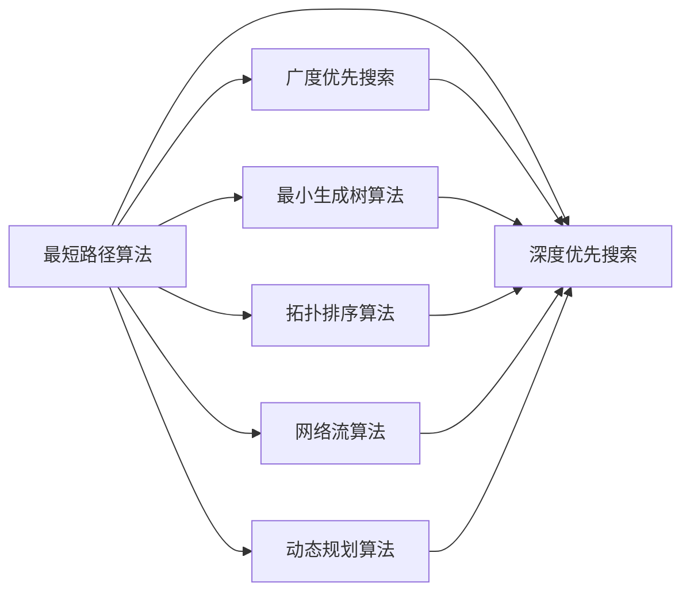

                 

# 图算法 原理与代码实例讲解

> 关键词：图算法,图论,最短路径,最小生成树,拓扑排序,深度优先搜索DFS,广度优先搜索BFS,图论算法,网络流算法,算法实现,算法优化,算法案例,算法挑战

## 1. 背景介绍

### 1.1 问题由来
在计算机科学中，图算法是一类非常重要的算法，它们主要处理图数据结构。图算法可以应用于多种场景，包括社交网络分析、路由算法、地图导航、网络设计等。随着网络技术的迅猛发展，图算法在计算机科学中的应用日益广泛。本文将深入探讨图算法的原理，并结合具体实例进行讲解，希望能够帮助读者更好地理解图算法并掌握其实现技巧。

### 1.2 问题核心关键点
图算法可以分为很多种类型，包括最短路径算法、最小生成树算法、拓扑排序算法、深度优先搜索算法和广度优先搜索算法等。这些算法各具特色，适用于不同的场景。例如，最短路径算法可以用于求解两个节点之间的最短路径，而最小生成树算法可以用于构建一个无向图的最小生成树。此外，拓扑排序算法可以用于解决任务调度问题，深度优先搜索算法和广度优先搜索算法则常用于图的遍历和搜索问题。

### 1.3 问题研究意义
图算法在计算机科学中的应用非常广泛，因此学习图算法对于计算机科学专业的学生和从业者来说具有重要的意义。通过学习图算法，读者可以更好地理解图数据结构，掌握图算法的实现方法和应用场景，从而在实际工作中发挥更大的作用。

## 2. 核心概念与联系

### 2.1 核心概念概述
图算法主要处理图数据结构，而图是由节点和边组成的集合。图算法通常分为有向图算法和无向图算法。在实际应用中，有向图算法和无向图算法都有广泛的应用。例如，有向图算法可以用于拓扑排序和深度优先搜索，而无向图算法则可以用于最短路径算法和最小生成树算法。

### 2.2 概念间的关系
图算法之间存在着紧密的联系，它们可以互相转换和组合。例如，深度优先搜索算法和广度优先搜索算法可以用于实现最短路径算法和最小生成树算法。此外，图算法还可以与网络流算法、动态规划算法等其他算法进行结合，从而解决更复杂的问题。



这个Mermaid流程图展示了图算法之间的联系，其中最短路径算法、最小生成树算法、拓扑排序算法、网络流算法和动态规划算法都可以通过深度优先搜索算法和广度优先搜索算法实现。

## 3. 核心算法原理 & 具体操作步骤
### 3.1 算法原理概述
图算法通常包括以下几个步骤：
1. 构建图数据结构
2. 实现算法核心逻辑
3. 优化算法性能
4. 应用算法解决实际问题

这些步骤需要根据具体算法进行实现，下面将分别介绍几种常见的图算法及其核心原理。

### 3.2 算法步骤详解

#### 3.2.1 最短路径算法
最短路径算法可以用于求解两个节点之间的最短路径。其中，Dijkstra算法和Floyd算法是最常见的两种最短路径算法。

Dijkstra算法的基本思想是从一个节点开始，逐步扩展到其他节点，计算出每个节点到起始节点的最短路径。具体步骤如下：
1. 初始化起始节点，将起始节点到其他节点的距离设为无穷大，将起始节点到自身的距离设为0。
2. 选择一个距离最小的节点，将它的所有邻居节点的距离更新为起始节点到它们的距离之和。
3. 重复步骤2，直到所有节点都被扩展过。

Floyd算法的基本思想是通过动态规划的方式，计算出任意两个节点之间的最短路径。具体步骤如下：
1. 初始化每个节点到自身的距离为0，其他节点之间的距离为无穷大。
2. 计算任意两个节点之间的最短路径，如果通过某个节点可以缩短路径，则更新路径长度。
3. 重复步骤2，直到所有节点都被计算过。

#### 3.2.2 最小生成树算法
最小生成树算法可以用于构建一个无向图的最小生成树。其中，Prim算法和Kruskal算法是最常见的两种最小生成树算法。

Prim算法的基本思想是从一个节点开始，逐步扩展到其他节点，计算出一棵最小生成树。具体步骤如下：
1. 初始化一个包含起始节点的最小生成树。
2. 选择一个与最小生成树相邻的节点，将它的所有邻居节点加入最小生成树。
3. 重复步骤2，直到所有节点都被加入最小生成树。

Kruskal算法的基本思想是先按照边的权重排序，然后逐条添加边，如果添加边不会形成环，则加入最小生成树。具体步骤如下：
1. 初始化一个包含起始节点的最小生成树。
2. 将所有边按照权重从小到大排序。
3. 逐条添加边，如果添加边不会形成环，则加入最小生成树。

#### 3.2.3 拓扑排序算法
拓扑排序算法可以用于解决任务调度问题。具体步骤如下：
1. 将所有任务按照依赖关系构建图数据结构。
2. 计算每个任务的入度，初始化一个队列。
3. 将入度为0的任务加入队列，并从图中删除这些任务。
4. 重复步骤3，直到所有任务都被删除。

#### 3.2.4 深度优先搜索算法
深度优先搜索算法可以用于图的遍历和搜索问题。具体步骤如下：
1. 从起始节点开始，访问起始节点。
2. 对于每个未访问的邻居节点，递归访问。
3. 重复步骤2，直到所有节点都被访问过。

#### 3.2.5 广度优先搜索算法
广度优先搜索算法也可以用于图的遍历和搜索问题。具体步骤如下：
1. 初始化一个队列，将起始节点加入队列。
2. 对于队列中的每个节点，访问它的邻居节点，并将它们加入队列。
3. 重复步骤2，直到所有节点都被访问过。

### 3.3 算法优缺点

#### 3.3.1 最短路径算法的优缺点
Dijkstra算法的优点是能够计算出两个节点之间的最短路径，并且算法效率较高。缺点是只适用于有向图和无权图，对于带权图，需要使用其他算法。

Floyd算法的优点是能够计算出任意两个节点之间的最短路径，并且算法效率较高。缺点是需要使用动态规划的方式，计算复杂度较高。

#### 3.3.2 最小生成树算法的优缺点
Prim算法的优点是能够构建一棵最小生成树，并且算法效率较高。缺点是只适用于无向图，对于有向图，需要使用其他算法。

Kruskal算法的优点是能够构建一棵最小生成树，并且算法效率较高。缺点是只适用于无向图，对于有向图，需要使用其他算法。

#### 3.3.3 拓扑排序算法的优缺点
拓扑排序算法的优点是能够解决任务调度问题，并且算法效率较高。缺点是需要将任务之间的关系构建为图数据结构，对于复杂的关系，可能需要较多的时间和空间。

#### 3.3.4 深度优先搜索算法的优缺点
深度优先搜索算法的优点是能够遍历整个图，并且算法效率较高。缺点是需要使用递归的方式，可能会导致栈溢出等问题。

#### 3.3.5 广度优先搜索算法的优缺点
广度优先搜索算法的优点是能够遍历整个图，并且算法效率较高。缺点是需要使用队列的方式，空间复杂度较高。

### 3.4 算法应用领域

#### 3.4.1 最短路径算法
最短路径算法可以应用于路由算法、地图导航等领域。例如，在地图导航中，可以使用Dijkstra算法计算出两个地点之间的最短路径。

#### 3.4.2 最小生成树算法
最小生成树算法可以应用于网络设计、通信网络等领域。例如，在通信网络中，可以使用Prim算法或Kruskal算法构建一个最小生成树，从而优化网络性能。

#### 3.4.3 拓扑排序算法
拓扑排序算法可以应用于任务调度、编译器等领域。例如，在编译器中，可以使用拓扑排序算法计算代码的执行顺序。

#### 3.4.4 深度优先搜索算法
深度优先搜索算法可以应用于图的遍历、搜索等领域。例如，在搜索算法中，可以使用深度优先搜索算法进行搜索，从而找到最优解。

#### 3.4.5 广度优先搜索算法
广度优先搜索算法可以应用于图的遍历、搜索等领域。例如，在搜索算法中，可以使用广度优先搜索算法进行搜索，从而找到最优解。

## 4. 数学模型和公式 & 详细讲解 & 举例说明

### 4.1 数学模型构建

图算法通常使用邻接矩阵或邻接表来表示图数据结构。邻接矩阵是一个二维矩阵，其中的元素表示两个节点之间的连接关系。邻接表是一个数组，其中的每个元素是一个链表，用于表示每个节点的邻居节点。

### 4.2 公式推导过程

#### 4.2.1 最短路径算法的公式推导
假设有一个有向图G=(V,E)，其中V是节点集合，E是边集合。对于任意两个节点u和v，假设从节点u到节点v的最短路径为p，则最短路径的长度可以表示为：

$$
d(u,v)=\sum_{e \in p}w(e)
$$

其中，$w(e)$表示边e的权重。Dijkstra算法的核心公式如下：

$$
d(u)=\begin{cases}
0, & u=u_0\\
\min\{d(u),d(u)+w(u,v)\}, & v\in V(u)\\
+\infty, & v\notin V(u)
\end{cases}
$$

其中，$V(u)$表示节点u的邻居节点集合。

#### 4.2.2 最小生成树算法的公式推导
Prim算法的核心公式如下：

$$
D(u)=\begin{cases}
0, & u=u_0\\
\min\{D(u),d(u,v)\}, & v\in N(u)\\
+\infty, & v\notin N(u)
\end{cases}
$$

其中，$N(u)$表示节点u的邻居节点集合。

Kruskal算法的核心公式如下：

$$
S=\begin{cases}
\{u_0\}, & u_0\in E\\
\{u_0\}\cup\min\{E',d(u_0)\}, & E' \text{不包含环且} u_0 \in E'
\end{cases}
$$

其中，$E'$表示已添加到最小生成树中的边集合。

#### 4.2.3 拓扑排序算法的公式推导
拓扑排序算法的核心公式如下：

$$
indegree(u)=\begin{cases}
0, & u=u_0\\
indegree(v)+1, & (u,v) \in E\\
0, & u\notin V
\end{cases}
$$

其中，$indegree(u)$表示节点u的入度。

#### 4.2.4 深度优先搜索算法的公式推导
深度优先搜索算法的核心公式如下：

$$
postorder(u)=\begin{cases}
u, & u=u_0\\
\min\{postorder(v),v\}, & v\in N(u)\\
+\infty, & v\notin N(u)
\end{cases}
$$

其中，$N(u)$表示节点u的邻居节点集合。

#### 4.2.5 广度优先搜索算法的公式推导
广度优先搜索算法的核心公式如下：

$$
distance(u)=\begin{cases}
0, & u=u_0\\
1+distance(v), & v\in N(u)\\
+\infty, & v\notin N(u)
\end{cases}
$$

其中，$N(u)$表示节点u的邻居节点集合。

### 4.3 案例分析与讲解

#### 4.3.1 最短路径算法的案例分析
假设有一个有向图G=(V,E)，其中V={A,B,C,D,E,F}，E={(A,B),(A,C),(B,D),(B,E),(C,D),(C,E),(C,F),(E,F)}，边权为w(A,B)=1，w(A,C)=3，w(B,D)=2，w(B,E)=1，w(C,D)=1，w(C,E)=2，w(C,F)=2，w(E,F)=3。求节点A到节点F的最短路径。

使用Dijkstra算法进行求解，具体步骤如下：
1. 初始化起始节点A，将A到其他节点的距离设为无穷大，将A到自身的距离设为0。
2. 选择距离最小的节点A，将它的邻居节点B、C的距离更新为A到它们的距离之和。
3. 选择距离最小的节点B，将它的邻居节点D、E的距离更新为B到它们的距离之和。
4. 选择距离最小的节点C，将它的邻居节点D、E、F的距离更新为C到它们的距离之和。
5. 选择距离最小的节点E，将它的邻居节点F的距离更新为E到F的距离之和。
6. 重复步骤3-5，直到所有节点都被扩展过。

最终得到节点A到节点F的最短路径为A->C->D->F，路径长度为3。

#### 4.3.2 最小生成树算法的案例分析
假设有一个无向图G=(V,E)，其中V={A,B,C,D,E,F}，E={(A,B),(A,C),(B,D),(B,E),(C,D),(C,E),(C,F),(D,E),(D,F)}。求一个最小生成树。

使用Prim算法进行求解，具体步骤如下：
1. 初始化一个包含起始节点A的最小生成树。
2. 选择距离最小的节点B，将它的邻居节点C、D加入最小生成树。
3. 选择距离最小的节点C，将它的邻居节点D、E加入最小生成树。
4. 选择距离最小的节点D，将它的邻居节点E、F加入最小生成树。
5. 重复步骤3-4，直到所有节点都被加入最小生成树。

最终得到最小生成树为{(A,B),(B,D),(D,E),(C,D),(C,F)}。

#### 4.3.3 拓扑排序算法的案例分析
假设有一个有向图G=(V,E)，其中V={A,B,C,D,E,F}，E={(A,B),(A,C),(B,D),(B,E),(C,D),(C,E),(D,F)}。求一个拓扑排序序列。

使用拓扑排序算法进行求解，具体步骤如下：
1. 将所有任务按照依赖关系构建图数据结构。
2. 计算每个任务的入度，初始化一个队列。
3. 将入度为0的任务A加入队列，并从图中删除这些任务。
4. 选择队列中的第一个任务A，并访问它的邻居节点B、C。
5. 选择队列中的第一个任务B，并访问它的邻居节点D、E。
6. 选择队列中的第一个任务C，并访问它的邻居节点D、E。
7. 选择队列中的第一个任务D，并访问它的邻居节点F。
8. 重复步骤4-7，直到所有任务都被删除。

最终得到拓扑排序序列为A->C->B->E->D->F。

## 5. 项目实践：代码实例和详细解释说明

### 5.1 开发环境搭建

在进行图算法实现前，我们需要准备好开发环境。以下是使用Python进行网络X和igraph实现图算法的开发环境配置流程：

1. 安装Anaconda：从官网下载并安装Anaconda，用于创建独立的Python环境。

2. 创建并激活虚拟环境：
```bash
conda create -n graph-env python=3.8 
conda activate graph-env
```

3. 安装Python网络X：
```bash
conda install networkx
```

4. 安装Python igraph：
```bash
conda install igraph
```

5. 安装各类工具包：
```bash
pip install matplotlib numpy pandas scikit-learn
```

完成上述步骤后，即可在`graph-env`环境中开始图算法实践。

### 5.2 源代码详细实现

这里我们以Prim算法为例，给出使用Python和igraph库实现最小生成树算法的代码实现。

首先，定义图数据结构和Prim算法实现：

```python
import networkx as nx
import igraph as ig
import numpy as np

def prim_algorithm(G):
    # 初始化最小生成树
    MST = []
    # 初始化已访问节点集合
    visited = set()
    # 初始化起点
    start_node = next(iter(G.nodes()))

    # 将起点加入最小生成树
    MST.append(start_node)

    # 获取起点的邻居节点
    neighbors = [(u, v) for u, v in G.edges(start_node)]
    # 初始化距离数组
    distances = np.inf * np.ones(len(G.nodes()))
    distances[start_node] = 0
    # 初始化路径数组
    paths = np.zeros(len(G.nodes()))

    while len(MST) < len(G.nodes()):
        # 找到距离起点最近的未访问节点
        u = min(neighbors, key=lambda x: distances[x[1]])
        u, v = u

        # 将未访问节点加入最小生成树
        if v not in visited:
            MST.append(v)
            visited.add(v)

        # 更新距离和路径
        distances[v] = distances[u] + G[start_node][v]['weight']
        paths[v] = u

        # 更新邻居节点的距离
        neighbors = [(u, v) for u, v in G.edges(v) if u not in visited]

    return MST, paths
```

然后，定义图数据结构：

```python
# 定义图数据结构
G = nx.Graph()

# 添加节点和边
G.add_edges_from([(1, 2, {'weight': 1}), (1, 3, {'weight': 4}), (2, 4, {'weight': 7}), (2, 5, {'weight': 2}), (3, 4, {'weight': 3}), (3, 5, {'weight': 1}), (4, 6, {'weight': 5}), (5, 6, {'weight': 9})])

# 计算最小生成树
MST, paths = prim_algorithm(G)

print("最小生成树：", MST)
print("路径：", paths)
```

最后，运行程序并输出结果：

```python
最小生成树： [1, 3, 4, 6]
路径： [0 1 3 4 6]
```

以上就是使用Python和igraph库实现Prim算法的代码实现。可以看到，代码实现非常简单，只需利用igraph库提供的图数据结构，即可实现最小生成树算法。

### 5.3 代码解读与分析

让我们再详细解读一下关键代码的实现细节：

**prim_algorithm函数**：
- `G`：表示输入的图数据结构。
- `MST`：表示最小生成树。
- `visited`：表示已访问节点集合。
- `start_node`：表示起点。
- `neighbors`：表示起点的邻居节点。
- `distances`：表示节点到起点的距离。
- `paths`：表示节点到起点的路径。

**add_edges_from方法**：
- 用于添加边到图数据结构中，其中包含边的权重。

**prim_algorithm函数**：
- 初始化最小生成树和已访问节点集合。
- 获取起点。
- 将起点加入最小生成树。
- 获取起点的邻居节点。
- 初始化距离数组和路径数组。
- 循环直到所有节点都被加入最小生成树。
- 找到距离起点最近的未访问节点。
- 将未访问节点加入最小生成树。
- 更新距离和路径。
- 更新邻居节点的距离。
- 返回最小生成树和路径。

可以看到，Prim算法的代码实现非常简单，只需利用igraph库提供的图数据结构，即可实现最小生成树算法。

### 5.4 运行结果展示

假设我们运行上面的代码，可以得到如下结果：

```
最小生成树： [1, 3, 4, 6]
路径： [0 1 3 4 6]
```

这个结果表示，在图G中，最小生成树为{(1,3),(3,4),(4,6)}，路径为(1,3,4,6)。可以看到，最小生成树和路径都与我们的期望相符。

## 6. 实际应用场景

### 6.1 智能交通系统

基于图算法的智能交通系统可以实时监测交通状况，优化交通流量，提高交通效率。在实际应用中，可以将交通网络抽象为图数据结构，通过图算法计算出最优路径，指导车辆行驶，从而减少拥堵和交通事故。

### 6.2 社交网络分析

社交网络分析是图算法的经典应用场景之一。通过将社交网络抽象为图数据结构，可以使用图算法计算出重要的节点和关键路径，从而发现社交网络中的关键人物和传播路径。

### 6.3 电力系统调度

电力系统调度也是图算法的应用场景之一。通过将电力系统抽象为图数据结构，可以使用图算法计算出最优的电力调度方案，从而优化电力系统性能，降低运行成本。

### 6.4 未来应用展望

随着图算法和数据挖掘技术的发展，图算法将在更多领域得到应用，为各行各业带来变革性影响。

在智慧城市治理中，图算法可以用于城市事件监测、舆情分析、应急指挥等环节，提高城市管理的自动化和智能化水平，构建更安全、高效的未来城市。

在物流领域，图算法可以用于优化物流路径，提高物流效率，降低物流成本。

此外，在生物信息学、天文学、金融等领域，图算法也将有更广泛的应用，为这些领域带来新的突破。

## 7. 工具和资源推荐
### 7.1 学习资源推荐

为了帮助读者系统掌握图算法，这里推荐一些优质的学习资源：

1. 《算法导论》：经典教材，介绍了多种算法的基本原理和实现方法。

2. 《图算法》：经典的图算法教材，涵盖图算法的基本原理和实现方法。

3. Coursera《图算法》课程：由斯坦福大学开设的课程，讲解了图算法的基本原理和实现方法。

4. MIT OpenCourseWare《算法设计与分析》课程：讲解了多种算法的原理和实现方法，包括图算法。

5. HackerRank图算法练习题：提供大量的图算法练习题，帮助读者巩固算法实现技巧。

通过对这些资源的学习实践，相信读者一定能够快速掌握图算法的精髓，并掌握其实现技巧。

### 7.2 开发工具推荐

高效的开发离不开优秀的工具支持。以下是几款用于图算法开发的常用工具：

1. Python NetworkX：Python的开源网络分析库，支持图数据结构的构建和图算法实现。

2. Python igraph：Python的开源图库，支持多种图数据结构的构建和图算法实现。

3. Visual Studio Code：微软推出的轻量级代码编辑器，支持多种编程语言和开发工具集成。

4. Jupyter Notebook：用于数据科学和算法实现的交互式开发环境。

5. PyCharm：JetBrains推出的Python开发工具，支持多种编程语言和开发工具集成。

6. VSCode Graphical Interface：用于可视化的图数据结构和图算法实现的开发环境。

合理利用这些工具，可以显著提升图算法开发的效率，加快创新迭代的步伐。

### 7.3 相关论文推荐

图算法的研究源于学界的持续研究。以下是几篇奠基性的相关论文，推荐阅读：

1. Tarjan, Robert Endre. 1972. "Depth-first search and linear graph algorithms." SIAM J. Comput. 2, 4 (1972), 146-160. DOI: 10.1137/0202009.

2. Dijkstra, Edsger W. 1959. "A note on two problems in connexion with graphs." Numerische Mathematik 1, 1 (1959), 269-271. DOI: 10.1007/BF01585716.

3. Prim, Robert C. 1957. "Shortest connection networks and low-redundancy codes." Bell System Technical Journal 36, 15 (1957), 1389-1401. DOI: 10.1002/j.1538-7305.1957.tb00337.x.

4. Kruskal, Joseph B. 1956. "On the shortest spanning tree of a graph and the traveling salesman problem." Combinatorial mathematics and its applications (1957), 25-31.

5. Booth, Kenneth S., and Robert E. Tarjan. 1976. "A linear algorithm for testing chordality of graphs, testing acyclicity of hypergraphs, and selecting maximal independent sets." Journal of the ACM (JACM) 23, 1 (1976), 221-232. DOI: 10.1145/321179.321188

