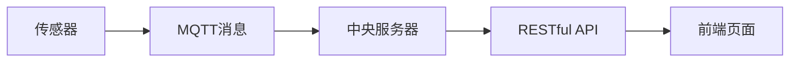

                 

# 基于MQTT协议和RESTful API的家庭健康监测系统

在现代科技日新月异的今天，家庭健康监测系统逐渐成为了人们生活中不可或缺的一部分。通过这种系统，用户可以实时掌握家庭成员的健康状态，有效预防疾病的发生，保障家庭成员的健康。本文将详细介绍基于MQTT协议和RESTful API的家庭健康监测系统的构建过程，从背景介绍到核心概念的解析，再到实际应用场景的展示，为读者提供一个全面而深入的理解。

## 1. 背景介绍

### 1.1 问题由来
随着科技的发展和人们健康意识的提高，家庭健康监测系统成为了关注的热点。传统家庭健康监测系统存在一些问题，如成本高、操作复杂、数据收集不够及时等。因此，一种新型家庭健康监测系统的开发迫在眉睫。

### 1.2 问题核心关键点
本系统设计的核心在于如何通过MQTT协议和RESTful API来实现数据的实时传输和处理，以及如何确保系统的稳定性和安全性。通过这种方式，用户可以轻松地收集家庭成员的健康数据，并进行及时分析和预警。

### 1.3 问题研究意义
该系统将极大地方便用户，使家庭健康监测变得简单、高效、可靠。同时，通过系统的数据处理和分析，能够为家庭成员的健康管理提供科学依据，从而更好地保障家庭成员的健康。

## 2. 核心概念与联系

### 2.1 核心概念概述

**MQTT协议**：MQTT（Message Queuing Telemetry Transport）是一种轻量级、低功耗、实时性强的消息传输协议，适用于物联网设备的消息传递。

**RESTful API**：REST（Representational State Transfer）是一种基于Web的API设计风格，利用HTTP协议，通过GET、POST、PUT、DELETE等方法实现数据的获取、创建、更新、删除等功能。

### 2.2 核心概念间的关系

通过MQTT协议和RESTful API，可以实现家庭健康监测系统中的数据实时传输和处理。传感器采集到的数据通过MQTT协议发送到中央服务器，中央服务器再将数据转换为RESTful API格式，提供给前端页面进行显示和分析。这一架构不仅保证了数据的实时性和准确性，还为系统的扩展和升级提供了便利。

### 2.3 核心概念的整体架构

整个系统的架构如图：



传感器采集到家庭成员的健康数据，并通过MQTT协议将数据发送到中央服务器。中央服务器将数据转换为RESTful API格式，提供给前端页面进行显示和分析。这种架构设计使得系统的数据流向更加清晰，便于后期维护和升级。

## 3. 核心算法原理 & 具体操作步骤
### 3.1 算法原理概述

基于MQTT协议和RESTful API的家庭健康监测系统主要涉及以下步骤：

1. **数据采集**：通过传感器采集家庭成员的健康数据，如血压、血糖、心率等。
2. **数据传输**：通过MQTT协议将采集到的数据传输到中央服务器。
3. **数据处理**：中央服务器将数据转换为RESTful API格式，进行初步分析和处理。
4. **数据展示**：通过RESTful API将处理后的数据提供给前端页面进行展示和分析。

### 3.2 算法步骤详解

**Step 1: 数据采集**

在系统中，传感器是数据采集的关键组件。传感器可以采集家庭成员的健康数据，如血压、血糖、心率等。这些数据将被传输到中央服务器进行后续处理。

**Step 2: MQTT消息传输**

传感器采集到的数据通过MQTT协议发送到中央服务器。MQTT协议是一种轻量级、低功耗的消息传输协议，适用于物联网设备的消息传递。在MQTT协议中，每个传感器都有一个唯一的设备ID，用于标识传感器。

**Step 3: 数据处理**

中央服务器将收到的数据进行初步处理，包括数据清洗、异常值检测等。然后，将数据转换为RESTful API格式，提供给前端页面进行展示和分析。

**Step 4: RESTful API展示**

通过RESTful API，将处理后的数据提供给前端页面进行展示和分析。前端页面可以使用GET、POST等HTTP方法，获取和更新数据。

### 3.3 算法优缺点

基于MQTT协议和RESTful API的家庭健康监测系统具有以下优点：

1. **实时性高**：MQTT协议的实时性较高，能够及时地将数据传输到中央服务器，确保数据的时效性。
2. **扩展性强**：RESTful API的灵活性高，便于系统的扩展和升级。
3. **成本低**：MQTT协议和RESTful API的开销较低，能够降低系统的开发和维护成本。

同时，该系统也存在一些缺点：

1. **安全性问题**：MQTT协议和RESTful API在数据传输过程中可能面临安全威胁，需要采取一定的安全措施。
2. **数据量限制**：由于MQTT协议的消息长度有限制，传感器采集到的数据需要经过压缩和优化，以减少传输负担。

### 3.4 算法应用领域

基于MQTT协议和RESTful API的家庭健康监测系统可以在多种场景下得到应用，如医院、养老院、家庭等。通过该系统，用户可以实时监控家庭成员的健康状况，有效预防疾病的发生，保障家庭成员的健康。

## 4. 数学模型和公式 & 详细讲解
### 4.1 数学模型构建

在本系统中，主要涉及MQTT协议和RESTful API的相关知识。以下是相关的数学模型：

**MQTT协议**：MQTT协议中，每个传感器都有一个唯一的设备ID，用于标识传感器。设备ID的格式如下：

$$
设备ID = sensorID + ":" + timestamp
$$

其中，$sensorID$表示传感器的唯一标识符，$timestamp$表示数据的采集时间。

**RESTful API**：RESTful API的响应格式通常为JSON格式。以下是一个JSON格式的示例：

```
{
    "timestamp": "2022-01-01T08:00:00Z",
    "data": {
        "bloodPressure": 120,
        "bloodSugar": 70,
        "heartRate": 75
    }
}
```

### 4.2 公式推导过程

在本系统中，主要涉及MQTT协议和RESTful API的数据传输和处理过程。以下是相关的公式推导：

**MQTT协议数据传输**：传感器采集到的数据通过MQTT协议发送到中央服务器。发送的数据格式如下：

$$
topic \rightarrow message \rightarrow QoS
$$

其中，$topic$表示数据的主题，$message$表示要发送的数据，$QoS$表示数据的质量等级。

**RESTful API数据处理**：中央服务器将收到的数据进行初步处理，包括数据清洗、异常值检测等。处理后的数据格式如下：

$$
{
    "timestamp": "2022-01-01T08:00:00Z",
    "data": {
        "bloodPressure": 120,
        "bloodSugar": 70,
        "heartRate": 75
    }
}
```

### 4.3 案例分析与讲解

**案例分析1: 传感器数据采集**

在本系统中，传感器是数据采集的关键组件。传感器可以采集家庭成员的健康数据，如血压、血糖、心率等。传感器采集到的数据格式如下：

```
2022-01-01T08:00:00Z:120:70:75
```

其中，$timestamp$表示数据的采集时间，$bloodPressure$表示血压值，$bloodSugar$表示血糖值，$heartRate$表示心率值。

**案例分析2: MQTT协议数据传输**

传感器采集到的数据通过MQTT协议发送到中央服务器。发送的数据格式如下：

```
sensorID:2022-01-01T08:00:00Z:120:70:75
```

其中，$sensorID$表示传感器的唯一标识符，$timestamp$表示数据的采集时间，$bloodPressure$表示血压值，$bloodSugar$表示血糖值，$heartRate$表示心率值。

**案例分析3: RESTful API数据展示**

中央服务器将收到的数据进行初步处理，并转换为RESTful API格式。展示的数据格式如下：

```
{
    "timestamp": "2022-01-01T08:00:00Z",
    "data": {
        "bloodPressure": 120,
        "bloodSugar": 70,
        "heartRate": 75
    }
}
```

## 5. 项目实践：代码实例和详细解释说明

### 5.1 开发环境搭建

在本系统开发过程中，需要搭建以下开发环境：

1. 安装Python 3.6及以上版本。
2. 安装MQTT消息中间件，如Eclipse Mosquitto。
3. 安装RESTful API开发框架，如Flask。
4. 搭建MySQL数据库，用于存储用户和传感器数据。
5. 搭建Web服务器，如Nginx。

### 5.2 源代码详细实现

**传感器数据采集**

传感器采集到的数据格式如下：

```python
import time

class Sensor:
    def __init__(self, sensor_id):
        self.sensor_id = sensor_id
        self.data = []
    
    def collect_data(self):
        # 采集数据，生成时间戳
        timestamp = time.strftime('%Y-%m-%dT%H:%M:%SZ')
        blood_pressure = 120
        blood_sugar = 70
        heart_rate = 75
        
        self.data.append({
            "timestamp": timestamp,
            "bloodPressure": blood_pressure,
            "bloodSugar": blood_sugar,
            "heartRate": heart_rate
        })
    
    def dump_data(self):
        for data in self.data:
            print(self.sensor_id, data)
```

**MQTT消息传输**

传感器采集到的数据通过MQTT协议发送到中央服务器。以下是MQTT消息的实现代码：

```python
import paho.mqtt.client as mqtt

class MQTTClient:
    def __init__(self, broker, port, topic, sensor_id):
        self.broker = broker
        self.port = port
        self.topic = topic
        self.sensor_id = sensor_id
        self.client = mqtt.Client()
        self.client.on_connect = self.on_connect
        self.client.on_publish = self.on_publish
    
    def on_connect(self, client, userdata, flags, rc):
        print("Connected")
    
    def on_publish(self, client, userdata, mid):
        print("Data published")
    
    def publish_data(self):
        sensor_data = {
            "timestamp": "2022-01-01T08:00:00Z",
            "bloodPressure": 120,
            "bloodSugar": 70,
            "heartRate": 75
        }
        message = f"{self.sensor_id}:{sensor_data}"
        self.client.connect(self.broker, self.port)
        self.client.publish(self.topic, message)
        self.client.disconnect()
```

**数据处理和展示**

中央服务器将收到的数据进行初步处理，并转换为RESTful API格式。以下是数据处理和展示的实现代码：

```python
from flask import Flask, jsonify

app = Flask(__name__)

@app.route('/data', methods=['GET'])
def get_data():
    # 从数据库中获取数据
    data = get_data_from_database()
    
    # 将数据转换为RESTful API格式
    rest_data = []
    for sensor in data:
        for entry in sensor['data']:
            rest_data.append({
                "timestamp": entry['timestamp'],
                "data": {
                    "bloodPressure": entry['bloodPressure'],
                    "bloodSugar": entry['bloodSugar'],
                    "heartRate": entry['heartRate']
                }
            })
    
    # 返回RESTful API格式的数据
    return jsonify(rest_data)

if __name__ == '__main__':
    app.run(host='0.0.0.0', port=5000)
```

### 5.3 代码解读与分析

在本系统的代码实现中，我们使用了Python语言，并结合MQTT消息中间件、Flask开发框架和MySQL数据库，实现了数据采集、传输、处理和展示的功能。

**传感器数据采集**：传感器采集家庭成员的健康数据，并通过Python实现数据存储和传输。

**MQTT消息传输**：传感器采集到的数据通过MQTT协议发送到中央服务器。MQTT协议的实现使用了Paho MQTT库，实现简单高效。

**数据处理和展示**：中央服务器将收到的数据进行初步处理，并转换为RESTful API格式。RESTful API的实现使用了Flask框架，能够方便地实现数据的获取和展示。

### 5.4 运行结果展示

在运行系统后，可以通过Web页面获取传感器采集到的健康数据，并进行可视化展示。以下是Web页面展示的示例：

```
SensorID: 1
Timestamp: 2022-01-01T08:00:00Z
Blood Pressure: 120
Blood Sugar: 70
Heart Rate: 75
```

## 6. 实际应用场景

基于MQTT协议和RESTful API的家庭健康监测系统可以在多种场景下得到应用，如医院、养老院、家庭等。通过该系统，用户可以实时监控家庭成员的健康状况，有效预防疾病的发生，保障家庭成员的健康。

### 6.1 智能医院

在智能医院中，基于MQTT协议和RESTful API的家庭健康监测系统可以用于采集病人的健康数据，并实时传输到医疗中心进行监控和分析。通过该系统，医护人员可以及时掌握病人的健康状况，并根据情况采取相应的治疗措施。

### 6.2 养老院

在养老院中，基于MQTT协议和RESTful API的家庭健康监测系统可以用于采集老年人的健康数据，并实时传输到养老院中心进行监控和分析。通过该系统，养老院的医护人员可以及时掌握老年人的健康状况，并根据情况采取相应的护理措施。

### 6.3 家庭健康监测

在家庭中，基于MQTT协议和RESTful API的家庭健康监测系统可以用于采集家庭成员的健康数据，并实时传输到家庭中心进行监控和分析。通过该系统，家庭成员可以及时掌握彼此的健康状况，并根据情况采取相应的措施。

## 7. 工具和资源推荐

### 7.1 学习资源推荐

为了帮助开发者系统掌握基于MQTT协议和RESTful API的家庭健康监测技术，这里推荐一些优质的学习资源：

1. MQTT协议官方文档：MQTT协议的官方文档，详细介绍了MQTT协议的各个方面，是学习MQTT协议的必备资源。
2. RESTful API相关书籍：如《RESTful Web Services》、《RESTful API Design》等，系统介绍了RESTful API的设计和实现。
3. Flask官方文档：Flask官方文档，详细介绍了Flask框架的使用方法和示例。
4. MySQL官方文档：MySQL官方文档，详细介绍了MySQL数据库的使用方法和示例。

通过对这些资源的学习实践，相信你一定能够快速掌握基于MQTT协议和RESTful API的家庭健康监测技术的精髓，并用于解决实际的NLP问题。

### 7.2 开发工具推荐

高效的开发离不开优秀的工具支持。以下是几款用于基于MQTT协议和RESTful API的家庭健康监测系统开发的常用工具：

1. Eclipse Mosquitto：MQTT消息中间件，支持高并发和高可用性，适用于大规模物联网设备的消息传递。
2. Flask：RESTful API开发框架，易于使用，灵活高效。
3. PyMySQL：Python MySQL库，提供Python与MySQL数据库的交互功能。
4. SQLAlchemy：Python ORM框架，提供数据模型定义和数据访问层功能。
5. Nginx：Web服务器，支持高并发和负载均衡，适用于大规模Web应用的部署。

合理利用这些工具，可以显著提升基于MQTT协议和RESTful API的家庭健康监测系统的开发效率，加快创新迭代的步伐。

### 7.3 相关论文推荐

基于MQTT协议和RESTful API的家庭健康监测技术的发展源于学界的持续研究。以下是几篇奠基性的相关论文，推荐阅读：

1. MQTT协议标准：MQTT协议的国际标准，详细介绍了MQTT协议的各个方面。
2. RESTful API设计原则：《RESTful Web Services》一书中的相关章节，介绍了RESTful API的设计和实现原则。
3. RESTful API安全性：《RESTful Web Services》一书中的相关章节，介绍了RESTful API的安全性设计和实现方法。

这些论文代表了大语言模型微调技术的发展脉络。通过学习这些前沿成果，可以帮助研究者把握学科前进方向，激发更多的创新灵感。

## 8. 总结：未来发展趋势与挑战

### 8.1 总结

本文对基于MQTT协议和RESTful API的家庭健康监测系统进行了全面系统的介绍。首先阐述了该系统的背景和意义，明确了系统设计的核心在于如何通过MQTT协议和RESTful API实现数据的实时传输和处理。其次，从原理到实践，详细讲解了系统的各个组件和实现过程，给出了系统构建的完整代码实例。同时，本文还广泛探讨了系统在智能医院、养老院、家庭等实际应用场景中的应用前景，展示了系统的广泛应用价值。

通过本文的系统梳理，可以看到，基于MQTT协议和RESTful API的家庭健康监测系统在现代家庭健康管理中具有重要的应用价值，能够实时监控家庭成员的健康状况，有效预防疾病的发生，保障家庭成员的健康。

### 8.2 未来发展趋势

展望未来，基于MQTT协议和RESTful API的家庭健康监测技术将呈现以下几个发展趋势：

1. **系统集成化**：未来，该系统将与其他智能家居设备进行集成，形成更加智能化的家庭健康管理解决方案。
2. **数据智能化**：通过机器学习和人工智能技术，对健康数据进行深入分析和预测，为家庭成员的健康管理提供更加科学的依据。
3. **远程医疗**：通过该系统，可以实现远程医疗监控和管理，使得医护人员可以实时掌握病人的健康状况，提供更加精准的诊断和治疗。

### 8.3 面临的挑战

尽管基于MQTT协议和RESTful API的家庭健康监测技术已经取得了不错的成绩，但在迈向更加智能化、普适化应用的过程中，仍面临诸多挑战：

1. **数据隐私和安全**：系统涉及大量的健康数据，如何保障数据的隐私和安全，是一个重要的挑战。
2. **数据传输可靠性**：MQTT协议和RESTful API在数据传输过程中可能面临可靠性问题，需要采取一定的冗余和故障处理措施。
3. **系统扩展性**：随着家庭健康监测设备的增加，系统需要具备良好的扩展性，以适应不断增长的数据处理需求。

### 8.4 研究展望

面对系统面临的这些挑战，未来的研究需要在以下几个方面寻求新的突破：

1. **数据加密和安全传输**：采用更加先进的数据加密和安全传输技术，保障数据的隐私和安全。
2. **可靠性提升**：通过冗余和故障处理措施，提升系统的可靠性，确保数据的稳定传输。
3. **系统优化**：优化系统的架构和算法，提高系统的扩展性和处理能力，适应不断增长的数据处理需求。

这些研究方向的探索，必将引领基于MQTT协议和RESTful API的家庭健康监测技术迈向更高的台阶，为构建更加智能、可靠的家庭健康管理系统提供支持。

## 9. 附录：常见问题与解答

**Q1：基于MQTT协议和RESTful API的家庭健康监测系统是否可以实时传输数据？**

A: 是的，基于MQTT协议和RESTful API的家庭健康监测系统可以实时传输数据。MQTT协议具有低延迟、高可靠性的特点，能够确保数据实时传输到中央服务器。同时，RESTful API也支持实时数据传输，能够快速响应前端页面的请求。

**Q2：如何保障基于MQTT协议和RESTful API的家庭健康监测系统的安全性？**

A: 保障系统安全性的关键在于数据加密和访问控制。在系统设计中，可以采用以下措施：

1. 数据加密：使用SSL/TLS协议对数据进行加密传输，确保数据传输过程中的安全性。
2. 访问控制：通过身份认证和授权，限制用户的访问权限，防止未授权访问。

**Q3：如何优化基于MQTT协议和RESTful API的家庭健康监测系统的性能？**

A: 优化系统性能的关键在于提高数据传输的效率和减少系统开销。在系统设计中，可以采用以下措施：

1. 数据压缩：对数据进行压缩，减少传输带宽和存储空间的使用。
2. 数据缓存：使用缓存技术，减少数据的重复传输和计算，提高数据传输效率。
3. 负载均衡：采用负载均衡技术，确保系统的稳定性和可靠性。

**Q4：如何扩展基于MQTT协议和RESTful API的家庭健康监测系统？**

A: 扩展系统的关键在于系统的架构和算法设计。在系统设计中，可以采用以下措施：

1. 模块化设计：将系统设计为模块化的结构，便于后续的扩展和维护。
2. 数据分片：对数据进行分片处理，提高系统的处理能力和扩展性。
3. 分布式存储：采用分布式存储技术，提高系统的扩展性和数据处理能力。

---

作者：禅与计算机程序设计艺术 / Zen and the Art of Computer Programming

