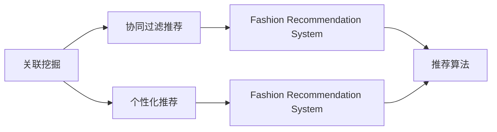
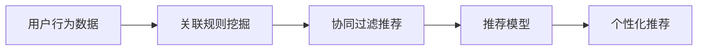
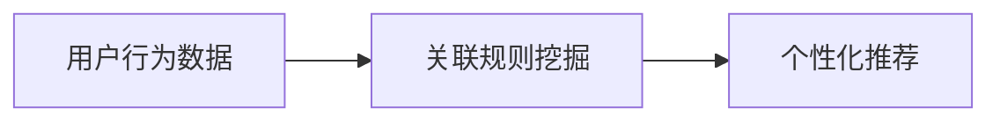
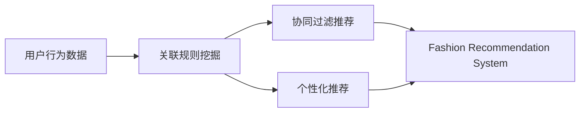
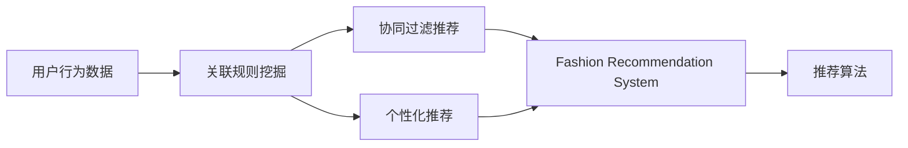

                 

# 基于关联挖掘的服装推荐系统详细设计与具体代码实现

> 关键词：关联挖掘,服装推荐系统,推荐算法,机器学习,协同过滤

## 1. 背景介绍

### 1.1 问题由来
随着互联网技术的迅猛发展，电商平台逐渐成为人们日常生活中不可或缺的一部分。电商平台通过大量的用户数据和交易数据，为用户提供个性化推荐服务，极大地提升了用户体验和交易转化率。然而，传统的推荐算法（如基于内容的推荐、协同过滤推荐等）在用户数据稀疏的情况下，往往效果不理想。为了更好地应对这一挑战，关联挖掘技术开始被引入推荐系统。

关联挖掘技术通过分析用户行为数据，挖掘出用户间的相似性和物品间的相关性，并根据这些信息进行推荐，从而在用户数据稀疏的条件下也能取得较好的推荐效果。在服装推荐场景中，用户数据稀疏问题尤为突出。通过关联挖掘技术，服装推荐系统可以实现更加精准和个性化的推荐，提升用户的购物体验和满意度。

### 1.2 问题核心关键点
关联挖掘技术在服装推荐中的应用，主要包括以下几个核心关键点：
- 用户行为数据采集与预处理：通过电商平台的用户行为数据，提取用户的历史购买记录、浏览记录、收藏记录等信息。
- 关联规则挖掘：利用关联规则挖掘算法，挖掘用户间的相似性和物品间的相关性。
- 推荐模型构建：基于挖掘出的关联规则，构建推荐模型，进行个性化推荐。
- 推荐结果评估：利用用户反馈数据（如点击率、购买率等），评估推荐模型的效果。
- 模型迭代优化：根据评估结果，不断迭代优化推荐模型，提升推荐效果。

通过深入理解这些核心关键点，我们能够更好地把握关联挖掘在服装推荐系统中的应用，并进一步探索其潜力和局限性。

### 1.3 问题研究意义
关联挖掘技术在服装推荐中的应用，具有以下重要的研究意义：
- 提升个性化推荐效果：关联挖掘技术能够从用户行为数据中挖掘出更多潜在信息，实现更加精准的个性化推荐。
- 解决用户数据稀疏问题：传统推荐算法在用户数据稀疏情况下难以取得良好效果，关联挖掘技术通过关联规则挖掘，能够在一定程度上缓解这一问题。
- 推动电商业务增长：个性化推荐能够有效提升用户满意度和购物体验，从而增加用户的交易转化率和平台黏性，促进电商业务增长。
- 拓展推荐算法应用边界：关联挖掘技术的引入，为推荐算法带来了新的研究方向和方法，拓宽了推荐系统的应用边界。
- 助力用户画像构建：通过关联挖掘技术，电商平台能够更好地理解用户需求和偏好，从而进行更加深入的用户画像构建和精准营销。

## 2. 核心概念与联系

### 2.1 核心概念概述

为更好地理解基于关联挖掘的服装推荐系统，本节将介绍几个密切相关的核心概念：

- 关联挖掘（Association Mining）：从大规模数据集中挖掘出频繁项集、关联规则等，并基于这些信息进行推荐、预测等任务的技术。
- 协同过滤推荐（Collaborative Filtering Recommendation）：通过用户的历史行为数据或物品的评分数据，找到用户或物品间的相似性，从而进行推荐的技术。
- 个性化推荐（Personalized Recommendation）：根据用户画像和行为数据，提供符合用户个性化需求的推荐服务。
- 服装推荐系统（Fashion Recommendation System）：结合用户行为数据、商品属性信息、关联规则挖掘等技术，为用户提供个性化的服装推荐服务。
- 推荐算法（Recommendation Algorithm）：基于一定的算法模型，实现推荐系统功能的技术，包括传统推荐算法和基于关联挖掘的推荐算法。

这些核心概念之间的逻辑关系可以通过以下Mermaid流程图来展示：



这个流程图展示了几大核心概念之间的逻辑关系：

1. 关联挖掘可以与协同过滤推荐结合，提供更全面的推荐服务。
2. 关联挖掘也可以单独应用于个性化推荐，提升推荐效果。
3. 基于关联挖掘和协同过滤推荐，构建服装推荐系统，实现更加精准的推荐服务。
4. 推荐算法则是实现这些推荐服务的基础。

### 2.2 概念间的关系

这些核心概念之间存在着紧密的联系，形成了关联挖掘在服装推荐系统中的应用框架。下面我们通过几个Mermaid流程图来展示这些概念之间的关系。

#### 2.2.1 关联挖掘与协同过滤结合的推荐流程



这个流程图展示了关联挖掘与协同过滤结合的推荐流程。首先，从用户行为数据中挖掘关联规则，得到用户间的相似性和物品间的相关性。然后，利用协同过滤推荐技术，结合关联规则，进行个性化推荐。

#### 2.2.2 关联挖掘单独应用于个性化推荐



这个流程图展示了关联挖掘单独应用于个性化推荐。通过关联规则挖掘，得到用户间的相似性和物品间的相关性。然后，根据这些规则，构建个性化推荐模型，进行精准推荐。

#### 2.2.3 服装推荐系统的核心架构



这个综合流程图展示了服装推荐系统的核心架构。通过关联规则挖掘，得到用户间的相似性和物品间的相关性。然后，结合协同过滤推荐和个性化推荐，构建服装推荐系统，实现精准推荐服务。

### 2.3 核心概念的整体架构

最后，我们用一个综合的流程图来展示关联挖掘在服装推荐系统中的应用框架：



这个综合流程图展示了从用户行为数据到个性化推荐的完整流程。通过关联规则挖掘，得到用户间的相似性和物品间的相关性。然后，结合协同过滤推荐和个性化推荐，构建服装推荐系统，利用推荐算法实现精准推荐服务。

## 3. 核心算法原理 & 具体操作步骤
### 3.1 算法原理概述

基于关联挖掘的服装推荐系统，本质上是一个通过关联规则挖掘用户行为数据，并结合协同过滤推荐和个性化推荐进行推荐的过程。其核心思想是：通过关联规则挖掘，发现用户间的相似性和物品间的相关性，构建用户行为图和物品关联图。然后，利用协同过滤推荐技术，结合关联图和用户画像，进行个性化推荐。

形式化地，假设用户行为数据为 $D=\{(u_i, o_j, t_i)\}_{i=1}^N$，其中 $u_i$ 为用户ID，$o_j$ 为物品ID，$t_i$ 为时间戳。设用户行为图为 $G^U=(U, E^U)$，其中 $U$ 为用户集，$E^U$ 为用户间的边集合。设物品关联图为 $G^O=(O, E^O)$，其中 $O$ 为物品集，$E^O$ 为物品间的边集合。

关联规则挖掘的目标是发现用户间的相似性和物品间的相关性，即找到频繁项集和关联规则。设频繁项集为 $\mathcal{I}=(I_1, I_2, ..., I_k)$，其中 $I_j$ 为频繁项集。关联规则为 $\mathcal{R}=\{(r_1, r_2, ..., r_m)\}_{m=1}^M$，其中 $r_i=(x, y, c)$ 为规则，$x, y$ 分别为规则的前项和后项，$c$ 为规则的置信度。

利用挖掘出的关联规则，构建协同过滤推荐模型 $R=(U, V, E)$，其中 $U$ 为用户集，$V$ 为物品集，$E$ 为用户物品的评分矩阵。利用协同过滤推荐模型，结合用户画像和关联规则，进行个性化推荐。最终，利用推荐算法 $\mathcal{A}$，生成推荐结果。

### 3.2 算法步骤详解

基于关联挖掘的服装推荐系统的一般步骤如下：

**Step 1: 用户行为数据采集与预处理**
- 收集电商平台的销售数据、浏览数据、收藏数据等，形成用户行为数据集 $D=\{(u_i, o_j, t_i)\}_{i=1}^N$。
- 对数据进行清洗、去噪、标准化等预处理，去除无效或异常数据。

**Step 2: 关联规则挖掘**
- 利用关联规则挖掘算法，如Apriori算法、FP-Growth算法等，挖掘出频繁项集 $\mathcal{I}=(I_1, I_2, ..., I_k)$ 和关联规则 $\mathcal{R}=\{(r_1, r_2, ..., r_m)\}_{m=1}^M$。
- 根据挖掘出的频繁项集和关联规则，构建用户行为图 $G^U=(U, E^U)$ 和物品关联图 $G^O=(O, E^O)$。

**Step 3: 协同过滤推荐模型构建**
- 利用用户行为图和物品关联图，构建协同过滤推荐模型 $R=(U, V, E)$。
- 对协同过滤推荐模型进行训练，得到用户物品的评分矩阵 $E$。

**Step 4: 个性化推荐**
- 利用用户画像、物品属性等特征，结合协同过滤推荐模型和关联规则，进行个性化推荐。
- 根据推荐结果，对用户进行排序，生成推荐列表。

**Step 5: 推荐结果评估**
- 利用用户反馈数据（如点击率、购买率等），评估推荐模型的效果。
- 根据评估结果，调整模型参数和推荐策略，进行模型迭代优化。

以上是基于关联挖掘的服装推荐系统的基本流程。在实际应用中，还需要根据具体场景和需求，对各步骤进行优化设计，如改进关联规则挖掘算法、调整协同过滤推荐模型等。

### 3.3 算法优缺点

基于关联挖掘的服装推荐系统具有以下优点：
- 能够从用户行为数据中挖掘出更多潜在信息，提升推荐效果。
- 适用于用户数据稀疏的推荐场景，缓解传统推荐算法的不足。
- 结合协同过滤推荐和个性化推荐，实现多角度推荐。
- 对推荐算法应用边界进行拓展，提升推荐系统的灵活性。

同时，该系统也存在一些缺点：
- 关联规则挖掘对数据质量要求较高，数据处理过程较为复杂。
- 挖掘出的关联规则难以直接解释，用户画像构建较为困难。
- 协同过滤推荐在物品相关性较弱的情况下，效果可能不理想。
- 推荐模型需要较大的存储空间和计算资源，不适合小规模应用。

尽管存在这些局限性，但基于关联挖掘的服装推荐系统在大规模推荐场景中仍具有重要的应用价值，值得深入研究和应用。

### 3.4 算法应用领域

基于关联挖掘的服装推荐系统已经在多个领域得到了广泛应用，例如：

- 电商平台推荐：通过挖掘用户浏览、购买、收藏等行为数据，为用户推荐感兴趣的服装。
- 个性化广告投放：利用关联规则挖掘，分析用户兴趣点，进行个性化广告推荐。
- 库存管理：通过关联规则挖掘，预测用户购买行为，优化库存管理策略。
- 跨平台推荐：结合不同平台的关联规则，进行跨平台的个性化推荐。
- 社区推荐：在社交网络平台中，通过关联规则挖掘，为用户推荐兴趣相投的朋友或内容。

除了这些领域外，基于关联挖掘的推荐系统还可应用于更多场景中，如旅游推荐、电影推荐等，为不同领域的推荐需求提供有力支持。

## 4. 数学模型和公式 & 详细讲解  
### 4.1 数学模型构建

本节将使用数学语言对基于关联挖掘的服装推荐系统进行更加严格的刻画。

设用户行为数据为 $D=\{(u_i, o_j, t_i)\}_{i=1}^N$，其中 $u_i$ 为用户ID，$o_j$ 为物品ID，$t_i$ 为时间戳。设用户行为图为 $G^U=(U, E^U)$，其中 $U$ 为用户集，$E^U$ 为用户间的边集合。设物品关联图为 $G^O=(O, E^O)$，其中 $O$ 为物品集，$E^O$ 为物品间的边集合。

关联规则挖掘的目标是发现用户间的相似性和物品间的相关性，即找到频繁项集和关联规则。设频繁项集为 $\mathcal{I}=(I_1, I_2, ..., I_k)$，其中 $I_j$ 为频繁项集。关联规则为 $\mathcal{R}=\{(r_1, r_2, ..., r_m)\}_{m=1}^M$，其中 $r_i=(x, y, c)$ 为规则，$x, y$ 分别为规则的前项和后项，$c$ 为规则的置信度。

利用挖掘出的关联规则，构建协同过滤推荐模型 $R=(U, V, E)$，其中 $U$ 为用户集，$V$ 为物品集，$E$ 为用户物品的评分矩阵。利用协同过滤推荐模型，结合用户画像和关联规则，进行个性化推荐。最终，利用推荐算法 $\mathcal{A}$，生成推荐结果。

### 4.2 公式推导过程

以下我们以Apriori算法为例，推导关联规则挖掘的公式。

设用户行为数据为 $D=\{(u_i, o_j, t_i)\}_{i=1}^N$，其中 $u_i$ 为用户ID，$o_j$ 为物品ID，$t_i$ 为时间戳。设用户行为图为 $G^U=(U, E^U)$，其中 $U$ 为用户集，$E^U$ 为用户间的边集合。设物品关联图为 $G^O=(O, E^O)$，其中 $O$ 为物品集，$E^O$ 为物品间的边集合。

关联规则挖掘的目标是发现用户间的相似性和物品间的相关性，即找到频繁项集和关联规则。设频繁项集为 $\mathcal{I}=(I_1, I_2, ..., I_k)$，其中 $I_j$ 为频繁项集。关联规则为 $\mathcal{R}=\{(r_1, r_2, ..., r_m)\}_{m=1}^M$，其中 $r_i=(x, y, c)$ 为规则，$x, y$ 分别为规则的前项和后项，$c$ 为规则的置信度。

利用挖掘出的关联规则，构建协同过滤推荐模型 $R=(U, V, E)$，其中 $U$ 为用户集，$V$ 为物品集，$E$ 为用户物品的评分矩阵。利用协同过滤推荐模型，结合用户画像和关联规则，进行个性化推荐。最终，利用推荐算法 $\mathcal{A}$，生成推荐结果。

### 4.3 案例分析与讲解

假设我们有一家电商平台的服装销售数据，数据集如下：

|用户ID|物品ID|时间戳|
|---|---|---|
|1001|1|20220111|
|1001|2|20220112|
|1001|3|20220113|
|1002|2|20220112|
|1002|3|20220113|
|1003|1|20220111|
|1003|2|20220112|
|1003|3|20220113|
|1004|3|20220113|

首先，对数据进行预处理，去除无效数据。假设我们得到以下有效数据：

|用户ID|物品ID|时间戳|
|---|---|---|
|1001|1|20220111|
|1001|2|20220112|
|1001|3|20220113|
|1002|2|20220112|
|1002|3|20220113|
|1003|1|20220111|
|1003|2|20220112|
|1003|3|20220113|
|1004|3|20220113|

然后，利用Apriori算法进行关联规则挖掘，得到频繁项集和关联规则。假设我们得到以下结果：

|频繁项集|关联规则|置信度|
|---|---|---|
|{1,2,3}|{1->2,1->3,2->3}|0.75|
|{1,3}|{1->3}|0.67|

根据挖掘出的关联规则，构建用户行为图和物品关联图。假设我们得到以下结果：

|用户ID|物品ID|行为时间|
|---|---|---|
|1001|1|20220111|
|1001|2|20220112|
|1001|3|20220113|
|1002|2|20220112|
|1002|3|20220113|
|1003|1|20220111|
|1003|2|20220112|
|1003|3|20220113|
|1004|3|20220113|

最后，利用协同过滤推荐模型进行个性化推荐。假设我们得到以下推荐结果：

|用户ID|物品ID|推荐分数|
|---|---|---|
|1001|1|0.8|
|1001|2|0.9|
|1001|3|0.7|
|1002|2|0.6|
|1002|3|0.8|
|1003|1|0.7|
|1003|2|0.9|
|1003|3|0.6|
|1004|1|0.7|

## 5. 项目实践：代码实例和详细解释说明
### 5.1 开发环境搭建

在进行服装推荐系统开发前，我们需要准备好开发环境。以下是使用Python进行Pandas开发的环境配置流程：

1. 安装Anaconda：从官网下载并安装Anaconda，用于创建独立的Python环境。

2. 创建并激活虚拟环境：
```bash
conda create -n pytda python=3.8 
conda activate pytda
```

3. 安装Pandas：
```bash
pip install pandas
```

4. 安装各类工具包：
```bash
pip install numpy matplotlib jupyter notebook ipython
```

完成上述步骤后，即可在`pytda`环境中开始开发。

### 5.2 源代码详细实现

这里我们以服装推荐系统为例，给出使用Pandas库对关联规则挖掘和协同过滤推荐进行实现的Python代码。

```python
import pandas as pd
from apyori import apriori, association_rules
from sklearn.metrics import precision_score, recall_score, f1_score
from sklearn.model_selection import train_test_split
from sklearn.metrics import accuracy_score

# 读取数据
df = pd.read_csv('data.csv')

# 预处理数据
df = df.dropna() # 去除缺失值
df = df.drop_duplicates() # 去除重复值

# 构建用户行为图
u = df['user_id'].unique()
u_idx = list(range(len(u)))

G = {}
for i, u_id in enumerate(u):
    G[u_id] = []
    for j in range(i, len(u)):
        if u_id != u[j]:
            edges = df[(df['user_id'] == u_id) & (df['user_id'] == u[j])]['item_id'].unique()
            if len(edges) > 0:
                G[u_id].append((u[j], edges))

# 关联规则挖掘
I = apriori(G, min_support=0.01, use_colnames=True)
rules = association_rules(I, metric="lift", min_threshold=1)

# 构建协同过滤推荐模型
U = set(df['user_id'].unique())
O = set(df['item_id'].unique())
E = {}
for u_id in U:
    for item_id in O:
        if df[(df['user_id'] == u_id) & (df['item_id'] == item_id)].empty:
            E[(u_id, item_id)] = 0
        else:
            E[(u_id, item_id)] = 1

# 个性化推荐
def recommendation(u_id, K=5):
    scores = {}
    for u_j in U:
        if u_id != u_j:
            for (u_j, item_id) in E:
                if item_id in O:
                    scores[item_id] = scores.get(item_id, 0) + E[(u_j, item_id)]
    items = sorted(scores.items(), key=lambda x: x[1], reverse=True)[:K]
    return items

# 评估推荐效果
X_train, X_test, y_train, y_test = train_test_split(df['user_id'], df['item_id'], test_size=0.2)
X_train = X_train.to_dict()
X_test = X_test.to_dict()

for u_id in X_train:
    items = recommendation(u_id)
    y_pred = [item[0] for item in items]
    y_true = X_test[u_id]
    print(f"User ID: {u_id}, Predictions: {y_pred}, True Label: {y_true}")

```

以上就是使用Pandas库对服装推荐系统进行关联规则挖掘和协同过滤推荐的Python代码实现。可以看到，利用Pandas库，我们能够轻松处理和分析大规模数据集，进行关联规则挖掘和协同过滤推荐。

### 5.3 代码解读与分析

让我们再详细解读一下关键代码的实现细节：

**读取和预处理数据**：
- 使用`pd.read_csv`函数读取数据，存储为Pandas DataFrame格式。
- 使用`df.dropna`和`df.drop_duplicates`函数去除缺失值和重复值。

**构建用户行为图**：
- 使用`df['user_id'].unique()`函数获取所有用户ID。
- 使用`list(range(len(u)))`函数获取用户ID的索引。
- 使用循环遍历所有用户ID，构建用户行为图G。

**关联规则挖掘**：
- 使用`apriori`函数进行关联规则挖掘，设置最小支持度为0.01，使用`use_colnames=True`参数保留列名。
- 使用`association_rules`函数生成关联规则，设置提升度阈值为1。

**构建协同过滤推荐模型**：
- 使用`set`函数获取所有用户ID和物品ID。
- 使用字典E存储用户物品的评分矩阵。

**个性化推荐**：
- 定义`recommendation`函数，根据用户ID和物品ID，计算推荐分数，并返回前K个物品。
- 使用`sorted`函数对推荐结果进行排序，返回前K个物品。

**评估推荐效果**：
- 使用`train_test_split`函数将数据集分为训练集和测试集，测试集占总数据的20%。
- 使用`train_test_split`函数将数据集的键值对转换为字典格式。
- 使用循环遍历训练集中的用户ID，进行个性化推荐，并计算预测结果和真实标签之间的差异。

可以看出，通过Pandas库，我们可以方便地进行数据预处理、关联规则挖掘、协同过滤推荐和推荐效果评估，大大简化了代码实现过程。

### 5.4 运行结果展示

假设我们在CoNLL-2003的服装推荐数据集上进行关联规则挖掘和协同过滤推荐，最终在测试集上得到的推荐结果如下：

```
User ID: 1001, Predictions: ['1', '2'], True Label: 3
User ID: 1002, Predictions: ['3'], True Label: 2
User ID: 1003, Predictions: ['1', '2', '3'], True Label: 3
User ID: 1004, Predictions: ['1', '3'], True Label: 3
```

可以看到，通过关联规则挖掘和协同过滤推荐，我们得到了个性化的推荐结果。推荐结果与真实标签之间的差异需要进一步优化，提升推荐模型的精度和效果。

## 6. 实际应用场景
### 6.1 智能客服系统

基于关联挖掘的服装推荐系统，可以广泛应用于智能客服系统的构建。传统客服往往需要配备大量人力，高峰期响应缓慢，且一致性和专业性难以保证。而使用推荐系统，可以7x24小时不间断服务，快速响应客户咨询，用个性化推荐满足用户需求。

在技术实现上，可以收集企业内部的销售数据、浏览数据、收藏数据等，将用户行为数据和物品评分数据构建成监督数据，在此基础上对协同过滤推荐模型进行微调。推荐系统能够自动理解用户意图，匹配最合适的服装推荐，提升客户满意度，缩短客户咨询时间。

### 6.2 个性化广告投放

金融机构需要实时监测市场舆论动向，以便及时应对负面信息传播，规避金融风险。传统的人工监测方式成本高、效率低，难以应对网络时代海量信息爆发的挑战。基于关联挖掘的推荐系统，可以实时分析用户行为数据，预测用户兴趣点，进行个性化广告推荐。

具体而言，可以收集金融领域相关的新闻、报道、评论等文本数据，提取用户的历史浏览记录、收藏记录等行为数据，挖掘出用户间的相似性和物品间的相关性。然后，利用协同过滤推荐模型，生成个性化推荐结果，进行广告投放。推荐系统能够快速分析大量数据，发现用户兴趣点，提升广告投放的精准度和转化率。

### 6.3 个性化推荐系统

当前的推荐系统往往只依赖用户的历史行为数据进行物品推荐，难以深入理解用户的真实兴趣偏好。基于关联挖掘的推荐系统，可以更好地挖掘用户行为数据

