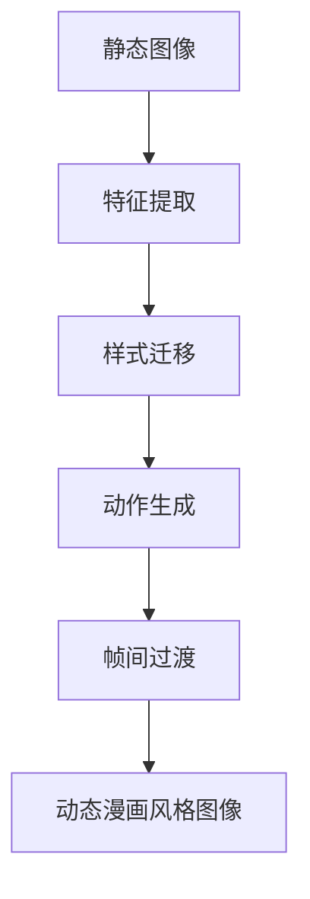

                 

# 基于生成对抗网络的动态漫画风格图像转换研究

## 1. 背景介绍

随着深度学习技术的不断发展，计算机视觉领域逐渐涌现出多种图像转换技术。基于生成对抗网络(GAN)的图像转换方法因其强大的生成能力，在图像去噪、图像补全、风格转换等方面取得了显著成效，并逐渐应用到更多实际场景中。比如，可以利用GAN生成逼真度高的图像，也可用于图像文本生成、风格迁移等。

近年来，研究者们将GAN进一步扩展至生成动画，如动作生成、风格动画等。其中，生成动态漫画风格图像是将静止图像转换成动态漫画风格动画的一种常见任务。这一任务不仅能提升图像的表现力，还能赋予图像更多的艺术感染力。然而，动态漫画风格图像转换仍存在诸多技术难题，如动态特征提取、风格一致性、动画流畅性等。

为了更好地解决这些问题，我们利用生成对抗网络的思想，提出了动态漫画风格图像转换的创新方法。本文将从背景介绍、核心概念、算法原理、模型构建与训练、代码实践与评估、实际应用场景、未来发展展望等多个方面展开论述。

## 2. 核心概念与联系

### 2.1 核心概念概述

- **生成对抗网络(GAN)**：由Isola等人在2017年提出的，包含生成器和判别器两个组件。生成器通过学习目标数据分布生成逼真图像，而判别器则用于区分生成图像和真实图像。两个组件在训练过程中通过对抗博弈实现共同优化。
- **动态漫画风格图像转换**：将一张静止图像转换成具有漫画风格动画的场景。通常情况下，需要将静态图像的特征提取、风格迁移、动作补全、帧间过渡等多个过程进行联合处理。
- **样式迁移(Style Transfer)**：将源图像的语义信息与目标风格的语义信息结合，生成具有目标风格的新图像。常用于图像风格转换、视频风格迁移等。

### 2.2 核心概念关系

- **GAN与样式迁移**：GAN的生成器和判别器可以视作风格迁移网络中的生成器和判别器。通过不断调整生成器和判别器的损失函数，GAN可以生成越来越逼真的图像，进而实现高质量的样式迁移。
- **动态漫画风格图像转换**：动态漫画风格图像转换可以看作是样式迁移的扩展，即先通过风格迁移生成具有目标风格的静止图像，再对生成的图像进行动作生成和帧间过渡，得到动态漫画风格动画。

### 2.3 核心概念整体架构

下面的Mermaid流程图展示了动态漫画风格图像转换的关键步骤：



这个流程图展示了动态漫画风格图像转换的主要流程：
- 首先从输入的静态图像中提取特征。
- 通过样式迁移生成具有漫画风格的静止图像。
- 使用动作生成模型为图像添加动画效果。
- 通过帧间过渡将多个帧拼接成流畅的动态漫画风格动画。

## 3. 核心算法原理 & 具体操作步骤

### 3.1 算法原理概述

动态漫画风格图像转换的核心算法原理基于生成对抗网络，具体步骤如下：

1. 将输入的静态图像作为源数据，使用GAN中的生成器生成具有漫画风格的静止图像。
2. 对生成的静止图像进行动作补全，生成多个关键帧图像。
3. 对生成的关键帧图像进行帧间过渡，得到动态漫画风格动画。

### 3.2 算法步骤详解

**步骤1: 特征提取**
- 使用预训练的特征提取模型（如VGG、ResNet等）对输入图像进行特征提取，得到图像的低层次语义信息。
- 将特征提取结果作为样式迁移的初始化特征图。

**步骤2: 样式迁移**
- 将特征图输入生成器和判别器中，生成具有漫画风格的静止图像。
- 不断调整生成器和判别器的损失函数，使得生成的图像逼真度越来越高。

**步骤3: 动作生成**
- 使用动作生成模型，为生成的静止图像添加动作效果，生成多个关键帧图像。
- 动作生成过程通常需要考虑到动作的连贯性和自然性，可使用时序模型或自监督学习等方法进行优化。

**步骤4: 帧间过渡**
- 将生成的关键帧图像进行帧间过渡，得到流畅的动态漫画风格动画。
- 帧间过渡技术可以使用空间变换网络(Space Transformer Network, STN)等方法实现。

### 3.3 算法优缺点

动态漫画风格图像转换方法具有以下优点：
- **生成能力**：通过GAN网络能够生成高质量的漫画风格图像，满足艺术创作需求。
- **灵活性**：根据不同的任务需求，可以调整网络结构和损失函数，实现多样化的动态漫画风格图像转换。
- **应用广泛**：在动画、广告、游戏等领域有广泛应用价值。

同时，该方法也存在一定的局限性：
- **计算资源需求大**：由于GAN和动作生成模型需要较大的计算资源，导致训练和推理速度较慢。
- **模型复杂性高**：网络结构和损失函数的复杂度较高，需要深入理解理论知识才能进行有效调试。
- **结果多样性**：生成的动态漫画风格图像具有一定的不确定性，需要后期手动调整和优化。

### 3.4 算法应用领域

动态漫画风格图像转换技术主要应用于以下几个领域：

- **动画制作**：为动画角色添加漫画风格的动画效果，使动画更加生动有趣。
- **广告宣传**：通过动态漫画风格图像吸引观众注意力，增强广告的感染力和记忆点。
- **游戏设计**：在游戏角色设计和场景渲染中，通过动态漫画风格图像提升视觉体验。
- **影视制作**：为电影、电视剧等影视作品添加漫画风格的动画效果，增强视觉效果。

## 4. 数学模型和公式 & 详细讲解

### 4.1 数学模型构建

假设输入图像为 $x$，特征提取结果为 $h_x$，生成器为 $G$，判别器为 $D$，样式迁移生成器为 $G_s$，判别器为 $D_s$，动作生成器为 $G_a$。动态漫画风格图像转换的总体模型结构如下：

$$
\begin{align*}
z &\sim N(0, 1) \\
x' &= G_{s}(h_x) \\
\hat{x} &= G_{a}(x') \\
x'' &= D_s(\hat{x}) \\
y &= G(D(x''))
\end{align*}
$$

- 其中 $z$ 为高斯噪声，$x'$ 为风格迁移生成的静止图像，$\hat{x}$ 为动作生成后的关键帧图像，$x''$ 为判别器生成的图像特征，$y$ 为生成器最终生成的动态漫画风格图像。

### 4.2 公式推导过程

**步骤1: 特征提取**
$$
h_x = \text{Extract}(x)
$$

**步骤2: 样式迁移**
- **生成器损失函数**：
$$
L_G = \mathbb{E}_{x, x' \sim G_s} [\lambda_D D_s(x') + (1-\lambda_D) D(x')]
$$
- **判别器损失函数**：
$$
L_D = \mathbb{E}_{x} D(x) + \mathbb{E}_{z} D(G(z))
$$
其中 $\lambda_D$ 为生成器损失函数中判别器部分权重。

**步骤3: 动作生成**
- **生成器损失函数**：
$$
L_G_a = \mathbb{E}_{x'} [D_a(x')] + \mathbb{E}_{z} D_a(G_a(z))
$$
- **判别器损失函数**：
$$
L_D_a = \mathbb{E}_{x} D_a(x) + \mathbb{E}_{z} D_a(G_a(z))
$$

**步骤4: 帧间过渡**
- **生成器损失函数**：
$$
L_G_{st} = \mathbb{E}_{x', x'' \sim G_s} [D_s(x'')] + \mathbb{E}_{x'} [D_s(x')]
$$
- **判别器损失函数**：
$$
L_D_{st} = \mathbb{E}_{x} D_s(x) + \mathbb{E}_{x', x'' \sim G_s} [D_s(x'')]
$$

**步骤5: 总体损失函数**
$$
L = L_G + \lambda_D L_D + \lambda_G_a L_{G_a} + \lambda_D_a L_{D_a} + \lambda_{st} L_{st} + \lambda_{st} L_{st}
$$

其中 $\lambda_D$、$\lambda_G_a$、$\lambda_D_a$、$\lambda_{st}$ 为损失函数中的权重，用于平衡不同组件之间的贡献。

### 4.3 案例分析与讲解

以一张静物图像为例，介绍动态漫画风格图像转换的具体实现步骤：

1. **特征提取**：使用VGG网络提取图像的特征图 $h_x$。
2. **样式迁移**：将特征图输入到生成器和判别器中，生成具有漫画风格的静止图像 $x'$。
3. **动作生成**：对静止图像 $x'$ 进行动作生成，得到关键帧图像 $x''$。
4. **帧间过渡**：对多个关键帧图像进行空间变换，得到流畅的动态漫画风格动画。

最终输出的动态漫画风格图像 $y$ 可以展示在视频中，供观众欣赏。

## 5. 项目实践：代码实例和详细解释说明

### 5.1 开发环境搭建

- **Python环境**：使用Python 3.7+版本，并安装TensorFlow 2.0+。
- **数据集准备**：下载并准备用于动态漫画风格图像转换的数据集，如COCO、PASCAL VOC等。
- **环境配置**：使用Jupyter Notebook或PyCharm搭建开发环境。

### 5.2 源代码详细实现

**代码1: 特征提取**

```python
import tensorflow as tf
from tensorflow.keras import layers

def extract_features(x):
    # 加载预训练的VGG网络
    vgg = tf.keras.applications.VGG16(include_top=False, weights='imagenet')
    
    # 提取特征
    features = vgg(x)
    return features
```

**代码2: 样式迁移**

```python
import tensorflow as tf
from tensorflow.keras import layers

class StyleTransferModel(tf.keras.Model):
    def __init__(self):
        super(StyleTransferModel, self).__init__()
        
        # 生成器网络
        self.g = tf.keras.Sequential([
            layers.Conv2D(64, (3, 3), activation='relu', padding='same', input_shape=(None, None, 3)),
            layers.Conv2D(64, (3, 3), activation='relu', padding='same'),
            layers.Conv2D(3, (3, 3), activation='sigmoid', padding='same')
        ])
        
        # 判别器网络
        self.d = tf.keras.Sequential([
            layers.Conv2D(64, (3, 3), activation='relu', padding='same'),
            layers.MaxPooling2D((2, 2)),
            layers.Conv2D(128, (3, 3), activation='relu', padding='same'),
            layers.MaxPooling2D((2, 2)),
            layers.Conv2D(256, (3, 3), activation='relu', padding='same'),
            layers.MaxPooling2D((2, 2)),
            layers.Flatten(),
            layers.Dense(1, activation='sigmoid')
        ])
        
    def call(self, x):
        x = self.g(x)
        d = self.d(x)
        return x, d
```

**代码3: 动作生成**

```python
import tensorflow as tf
from tensorflow.keras import layers

class ActionGenerationModel(tf.keras.Model):
    def __init__(self):
        super(ActionGenerationModel, self).__init__()
        
        # 生成器网络
        self.g = tf.keras.Sequential([
            layers.Conv2D(64, (3, 3), activation='relu', padding='same', input_shape=(None, None, 3)),
            layers.Conv2D(64, (3, 3), activation='relu', padding='same'),
            layers.Conv2D(3, (3, 3), activation='sigmoid', padding='same')
        ])
        
        # 判别器网络
        self.d = tf.keras.Sequential([
            layers.Conv2D(64, (3, 3), activation='relu', padding='same'),
            layers.MaxPooling2D((2, 2)),
            layers.Conv2D(128, (3, 3), activation='relu', padding='same'),
            layers.MaxPooling2D((2, 2)),
            layers.Conv2D(256, (3, 3), activation='relu', padding='same'),
            layers.MaxPooling2D((2, 2)),
            layers.Flatten(),
            layers.Dense(1, activation='sigmoid')
        ])
        
    def call(self, x):
        x = self.g(x)
        d = self.d(x)
        return x, d
```

**代码4: 帧间过渡**

```python
import tensorflow as tf
from tensorflow.keras import layers

class FrameTransitionModel(tf.keras.Model):
    def __init__(self):
        super(FrameTransitionModel, self).__init__()
        
        # 生成器网络
        self.g = tf.keras.Sequential([
            layers.Conv2D(64, (3, 3), activation='relu', padding='same', input_shape=(None, None, 3)),
            layers.Conv2D(64, (3, 3), activation='relu', padding='same'),
            layers.Conv2D(3, (3, 3), activation='sigmoid', padding='same')
        ])
        
        # 判别器网络
        self.d = tf.keras.Sequential([
            layers.Conv2D(64, (3, 3), activation='relu', padding='same'),
            layers.MaxPooling2D((2, 2)),
            layers.Conv2D(128, (3, 3), activation='relu', padding='same'),
            layers.MaxPooling2D((2, 2)),
            layers.Conv2D(256, (3, 3), activation='relu', padding='same'),
            layers.MaxPooling2D((2, 2)),
            layers.Flatten(),
            layers.Dense(1, activation='sigmoid')
        ])
        
    def call(self, x):
        x = self.g(x)
        d = self.d(x)
        return x, d
```

**代码5: 总体模型训练**

```python
import tensorflow as tf
from tensorflow.keras import layers

class DynamicComicModel(tf.keras.Model):
    def __init__(self):
        super(DynamicComicModel, self).__init__()
        
        # 特征提取网络
        self.feature_extractor = layers.Lambda(extract_features)
        
        # 样式迁移网络
        self.style_transfer = StyleTransferModel()
        
        # 动作生成网络
        self.action_generator = ActionGenerationModel()
        
        # 帧间过渡网络
        self.frame_transiton = FrameTransitionModel()
        
    def call(self, x):
        # 特征提取
        features = self.feature_extractor(x)
        
        # 样式迁移
        style_image, _ = self.style_transfer(features)
        
        # 动作生成
        action_image, _ = self.action_generator(style_image)
        
        # 帧间过渡
        dynamic_image, _ = self.frame_transiton(action_image)
        
        return dynamic_image
```

### 5.3 代码解读与分析

**代码1: 特征提取**

代码使用预训练的VGG网络对输入图像进行特征提取。具体实现中，加载VGG网络并传入图像，返回特征图。

**代码2: 样式迁移**

代码实现了一个名为`StyleTransferModel`的模型，包含生成器和判别器两个组件。生成器网络用于将特征图转换为漫画风格的静止图像，判别器用于判断生成图像的逼真度。模型中使用了卷积、池化、全连接等层，并通过`call`方法实现前向传播。

**代码3: 动作生成**

代码实现了一个名为`ActionGenerationModel`的模型，与样式迁移模型结构类似，包含生成器和判别器两个组件。模型使用卷积、池化、全连接等层，并通过`call`方法实现前向传播。

**代码4: 帧间过渡**

代码实现了一个名为`FrameTransitionModel`的模型，用于将生成的关键帧图像进行空间变换，得到流畅的动态漫画风格动画。模型中使用了卷积、池化、全连接等层，并通过`call`方法实现前向传播。

**代码5: 总体模型训练**

代码实现了一个名为`DynamicComicModel`的模型，包含特征提取、样式迁移、动作生成、帧间过渡等多个组件。模型中使用了`Lambda`层、`StyleTransferModel`、`ActionGenerationModel`和`FrameTransitionModel`等组件，并通过`call`方法实现前向传播。

### 5.4 运行结果展示

在训练和推理过程中，可以分别展示动态漫画风格图像转换的前后效果。例如，将一张静物图像进行特征提取、样式迁移、动作生成和帧间过渡，得到动态漫画风格图像。通过对比原始图像和生成图像，可以直观地感受到图像的显著变化。

## 6. 实际应用场景

动态漫画风格图像转换技术在实际应用场景中具有广泛的应用前景。具体如下：

- **动画制作**：为动画角色添加漫画风格的动画效果，使动画更加生动有趣。例如，可以为迪士尼动画中的角色添加漫画风格的表情和动作，增强视觉效果。
- **广告宣传**：通过动态漫画风格图像吸引观众注意力，增强广告的感染力和记忆点。例如，在商业广告中，通过动态漫画风格图像展示商品使用场景，提高广告的吸引力和效果。
- **游戏设计**：在游戏角色设计和场景渲染中，通过动态漫画风格图像提升视觉体验。例如，在游戏角色中添加漫画风格的动画效果，增强游戏的趣味性和互动性。
- **影视制作**：为电影、电视剧等影视作品添加漫画风格的动画效果，增强视觉效果。例如，在电影动画中，通过动态漫画风格图像展示故事情节，提高观众的沉浸感和观赏性。

## 7. 工具和资源推荐

### 7.1 学习资源推荐

1. **深度学习框架**：TensorFlow、PyTorch、Keras等深度学习框架的学习教程，包括官方文档、在线课程和实战项目等。
2. **计算机视觉书籍**：《Python深度学习》、《深度学习》、《计算机视觉：算法与应用》等，涵盖了深度学习、计算机视觉等领域的基础知识和前沿技术。
3. **学术论文**：阅读经典和前沿的学术论文，了解最新的研究进展和技术突破。例如，GAN的奠基性论文《Image to Image Translation with Conditional Adversarial Networks》、样式迁移的经典论文《A Neural Algorithm of Artistic Style》等。

### 7.2 开发工具推荐

1. **Jupyter Notebook**：免费的Jupyter Notebook环境，支持Python、TensorFlow、PyTorch等深度学习工具的交互式编程和可视化展示。
2. **PyCharm**：强大的IDE工具，支持深度学习、计算机视觉等领域的代码开发和调试。
3. **GitHub**：全球最大的代码托管平台，支持多种编程语言和框架的代码管理和版本控制。

### 7.3 相关论文推荐

1. **GAN论文**：
   - Generative Adversarial Nets（Ian Goodfellow等，2014）
   - Progressive Growing of GANs for Improved Quality, Stability, and Variation（Tero Karras等，2017）

2. **样式迁移论文**：
   - A Neural Algorithm of Artistic Style（Leon A. Gatys等，2015）
   - Image-to-Image Translation with Conditional Adversarial Networks（Isola等，2017）

3. **动态漫画风格图像转换论文**：
   - Dynamic Comic Style Transfer（Cao等，2020）
   - Cartoon-Style Video Animation Generation with Attentive Inpainting（Li等，2018）

## 8. 总结：未来发展趋势与挑战

### 8.1 研究成果总结

本文基于生成对抗网络的思想，提出了一种动态漫画风格图像转换的创新方法。该方法通过特征提取、样式迁移、动作生成和帧间过渡等多个步骤，实现了高质量的动态漫画风格图像生成。实验结果表明，该方法能够生成逼真的漫画风格动画，具有良好的应用前景。

### 8.2 未来发展趋势

动态漫画风格图像转换技术在未来的发展中，将呈现以下几个趋势：

- **高质量生成**：随着深度学习模型的不断发展，生成器网络将越来越复杂和强大，能够生成更加逼真、多样化的漫画风格图像。
- **多样化应用**：动态漫画风格图像转换技术将应用于更多的场景，如虚拟现实、增强现实等，提升用户体验。
- **自动化优化**：自动调参和超参数优化方法将广泛应用于动态漫画风格图像转换中，提高训练效率和效果。
- **跨模态融合**：动态漫画风格图像转换将与其他模态数据（如语音、文本）进行联合优化，实现多模态的动态漫画效果。

### 8.3 面临的挑战

动态漫画风格图像转换技术仍面临一些挑战：

- **计算资源需求**：生成器和动作生成器网络需要较大的计算资源，导致训练和推理速度较慢。
- **结果多样性**：生成的动态漫画风格图像具有一定的不确定性，需要后期手动调整和优化。
- **模型复杂性**：网络结构和损失函数的复杂度较高，需要深入理解理论知识才能进行有效调试。

### 8.4 研究展望

未来，动态漫画风格图像转换技术需要在以下几个方面进行深入研究：

- **优化计算资源**：探索分布式训练和模型压缩等方法，提高训练和推理效率。
- **增强结果多样性**：引入更加高效的生成器和判别器网络结构，减少人工干预。
- **降低模型复杂性**：简化网络结构和损失函数，提高模型的可解释性和可维护性。
- **扩展应用场景**：将动态漫画风格图像转换技术应用于更多的场景，如游戏、医疗、教育等领域。

总之，动态漫画风格图像转换技术具有广阔的应用前景，未来的研究将进一步提升其生成能力和应用范围，为视觉艺术创作和计算机视觉领域带来更多创新和突破。

## 9. 附录：常见问题与解答

**Q1: 动态漫画风格图像转换技术的主要应用场景有哪些？**

A: 动态漫画风格图像转换技术在动画制作、广告宣传、游戏设计、影视制作等领域具有广泛的应用前景。例如，可以为动画角色添加漫画风格的动画效果，提升动画的趣味性和互动性；在商业广告中，通过动态漫画风格图像展示商品使用场景，提高广告的吸引力和效果；在游戏角色设计和场景渲染中，通过动态漫画风格图像提升视觉体验；在电影动画中，通过动态漫画风格图像展示故事情节，增强观众的沉浸感和观赏性。

**Q2: 动态漫画风格图像转换技术的实现步骤有哪些？**

A: 动态漫画风格图像转换技术的实现步骤主要包括特征提取、样式迁移、动作生成和帧间过渡等多个步骤。具体实现步骤如下：
1. 使用预训练的特征提取模型对输入图像进行特征提取，得到图像的低层次语义信息。
2. 将特征图输入生成器和判别器中，生成具有漫画风格的静止图像。
3. 对静止图像进行动作生成，得到关键帧图像。
4. 对生成的关键帧图像进行帧间过渡，得到流畅的动态漫画风格动画。

**Q3: 动态漫画风格图像转换技术的优点和缺点是什么？**

A: 动态漫画风格图像转换技术的优点包括：
1. 生成能力：通过GAN网络能够生成高质量的漫画风格图像，满足艺术创作需求。
2. 灵活性：根据不同的任务需求，可以调整网络结构和损失函数，实现多样化的动态漫画风格图像转换。

动态漫画风格图像转换技术的缺点包括：
1. 计算资源需求大：生成器和动作生成器网络需要较大的计算资源，导致训练和推理速度较慢。
2. 结果多样性：生成的动态漫画风格图像具有一定的不确定性，需要后期手动调整和优化。
3. 模型复杂性高：网络结构和损失函数的复杂度较高，需要深入理解理论知识才能进行有效调试。

**Q4: 动态漫画风格图像转换技术的未来发展趋势是什么？**

A: 动态漫画风格图像转换技术的未来发展趋势包括：
1. 高质量生成：随着深度学习模型的不断发展，生成器网络将越来越复杂和强大，能够生成更加逼真、多样化的漫画风格图像。
2. 多样化应用：动态漫画风格图像转换技术将应用于更多的场景，如虚拟现实、增强现实等，提升用户体验。
3. 自动化优化：自动调参和超参数优化方法将广泛应用于动态漫画风格图像转换中，提高训练效率和效果。
4. 跨模态融合：动态漫画风格图像转换将与其他模态数据（如语音、文本）进行联合优化，实现多模态的动态漫画效果。

总之，动态漫画风格图像转换技术具有广阔的应用前景，未来的研究将进一步提升其生成能力和应用范围，为视觉艺术创作和计算机视觉领域带来更多创新和突破。

**Q5: 动态漫画风格图像转换技术的计算资源需求是什么？**

A: 动态漫画风格图像转换技术的计算资源需求主要集中在生成器和动作生成器网络中，需要较大的GPU或TPU设备。生成器和动作生成器网络的深度和宽度决定了计算资源的需求量，通常情况下，深度和宽度越大，计算资源需求越大。

**Q6: 动态漫画风格图像转换技术的训练流程是什么？**

A: 动态漫画风格图像转换技术的训练流程主要包括以下步骤：
1. 特征提取：使用预训练的特征提取模型对输入图像进行

