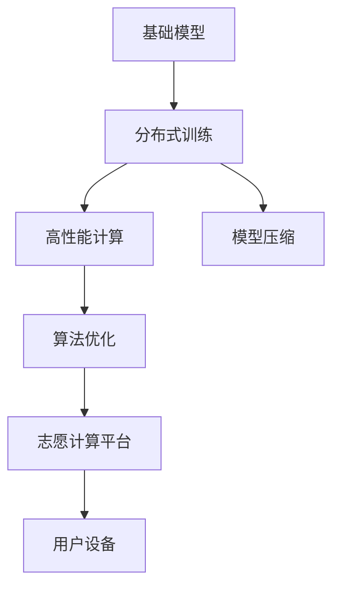
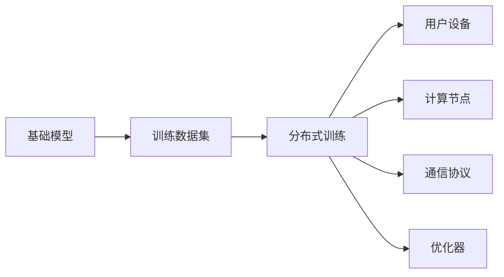
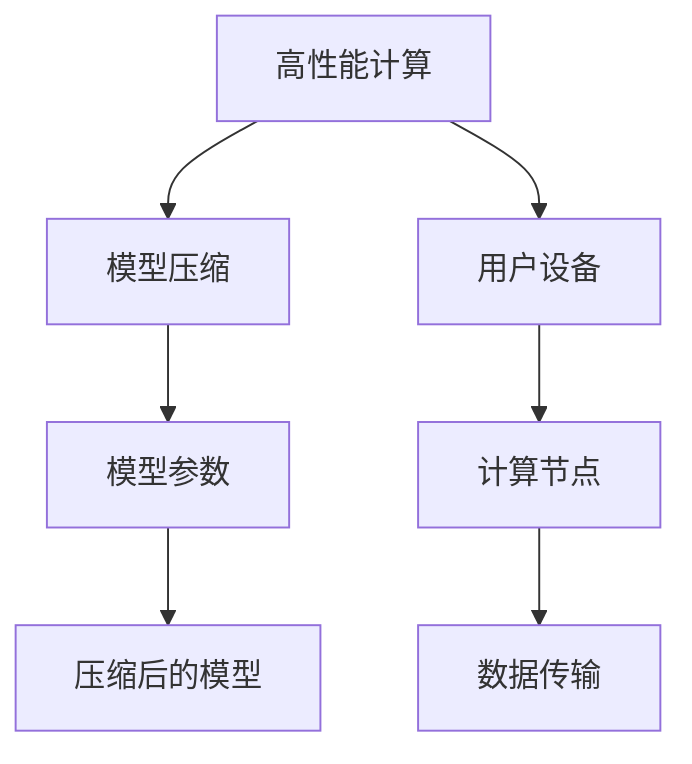
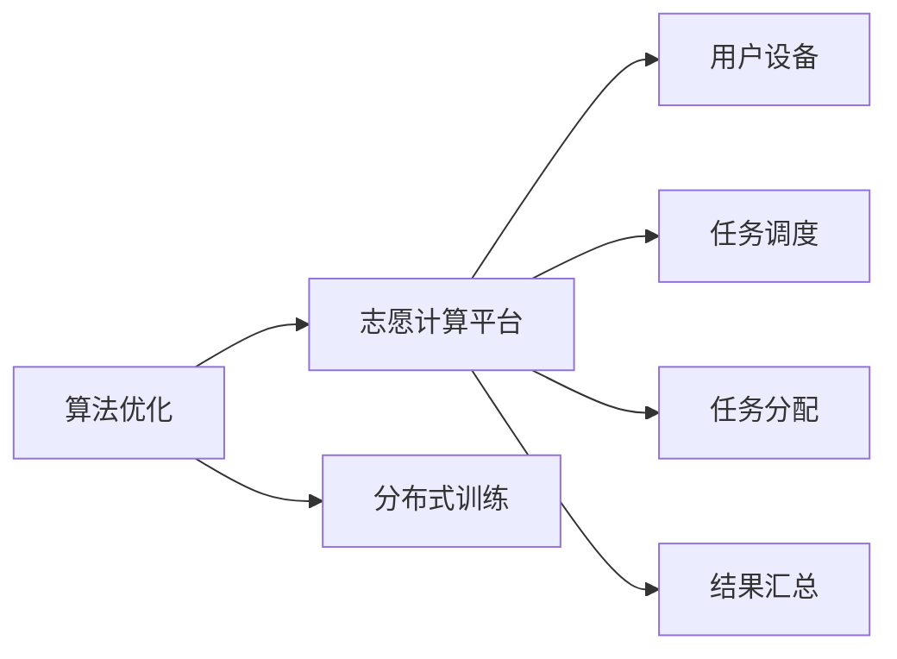
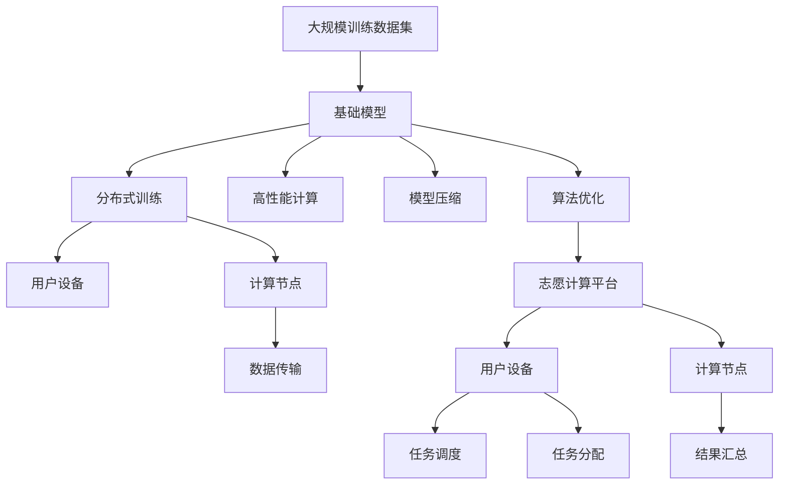

                 

# 基础模型的志愿计算方案

> 关键词：基础模型, 志愿计算, 分布式训练, 高性能计算, 模型压缩, 算法优化

## 1. 背景介绍

### 1.1 问题由来
在人工智能技术的快速发展的背景下，大规模深度学习模型的训练和优化成为了一个日益重要的研究课题。尤其是基于深度学习模型的基础模型，例如自然语言处理中的BERT模型、计算机视觉中的ResNet模型等，对于实现高效、准确的人工智能应用具有至关重要的作用。然而，这些基础模型的训练通常需要大量的计算资源和时间，这使得普通开发者难以承担。

### 1.2 问题核心关键点
为了解决这一问题，近年来出现了许多基于众包和志愿计算的概念和平台。这些平台将分散的计算资源和人力资源整合起来，利用普通用户设备的计算能力，进行大规模模型的分布式训练和优化。这种基于志愿计算的分布式训练方法，可以有效地降低单个模型的计算成本，同时提高训练效率。

### 1.3 问题研究意义
通过志愿计算方法训练基础模型，不仅能够显著降低计算成本，还能提升模型的准确性和泛化能力。这使得更多开发者能够参与到基础模型的训练中，共同推动人工智能技术的发展。此外，志愿计算方法还能够促进开源社区的繁荣，加速人工智能技术的落地应用。

## 2. 核心概念与联系

### 2.1 核心概念概述

为更好地理解基于志愿计算的基础模型训练方法，本节将介绍几个密切相关的核心概念：

- **基础模型**：如自然语言处理中的BERT模型、计算机视觉中的ResNet模型等，这些模型是实现高效人工智能应用的基础。

- **分布式训练**：通过将大规模计算任务分解成多个子任务，分布在多个设备上并行处理，从而加速训练过程。

- **高性能计算**：利用高性能计算硬件和算法，如GPU、TPU等，提升计算效率和模型性能。

- **模型压缩**：通过剪枝、量化等技术，减小模型的存储空间和计算量，提升计算效率和模型精度。

- **算法优化**：包括梯度下降优化、Adam优化等，优化模型的训练过程和性能。

这些核心概念之间的逻辑关系可以通过以下Mermaid流程图来展示：



这个流程图展示了一系列核心概念的逻辑关系：

1. 基础模型通过分布式训练、高性能计算和算法优化，进一步提升性能。
2. 志愿计算平台利用用户设备的计算能力，实现分布式训练。
3. 用户设备通过高性能计算和模型压缩，提高计算效率和模型精度。

### 2.2 概念间的关系

这些核心概念之间存在着紧密的联系，形成了基础模型训练的完整生态系统。下面我通过几个Mermaid流程图来展示这些概念之间的关系。

#### 2.2.1 基础模型的分布式训练



这个流程图展示了基础模型通过分布式训练的方式，利用用户设备和计算节点进行训练的过程。

#### 2.2.2 高性能计算与模型压缩



这个流程图展示了高性能计算和模型压缩在用户设备和计算节点上的应用。

#### 2.2.3 算法优化与志愿计算平台



这个流程图展示了算法优化和志愿计算平台在分布式训练中的应用。

### 2.3 核心概念的整体架构

最后，我们用一个综合的流程图来展示这些核心概念在大规模基础模型训练过程中的整体架构：



这个综合流程图展示了从大规模训练数据集到志愿计算平台，再到用户设备和计算节点，以及高性能计算、模型压缩和算法优化在整个训练过程中的作用。

## 3. 核心算法原理 & 具体操作步骤
### 3.1 算法原理概述

基于志愿计算的基础模型训练方法，本质上是一种分布式并行计算模型。其核心思想是利用多个计算节点的并行计算能力，加速基础模型的训练过程。具体来说，基础模型的训练可以分为以下几个步骤：

1. **数据集划分**：将大规模训练数据集划分成多个子集，每个子集分配给不同的用户设备进行处理。
2. **并行计算**：每个用户设备独立进行局部模型的训练，并将训练结果发送回中央计算节点。
3. **参数同步**：中央计算节点收集所有局部模型的参数，并进行参数的平均化或加权平均处理，得到新的全局模型参数。
4. **迭代优化**：重复上述过程，直至全局模型收敛。

### 3.2 算法步骤详解

基于志愿计算的基础模型训练方法通常包括以下几个关键步骤：

**Step 1: 数据集划分与用户设备选择**
- 准备大规模训练数据集 $D$，将其划分为多个子集 $D_1, D_2, ..., D_n$。
- 将每个子集 $D_i$ 分配给不同的用户设备 $E_1, E_2, ..., E_n$ 进行处理。

**Step 2: 并行计算与参数更新**
- 每个用户设备 $E_i$ 独立进行局部模型 $M_i$ 的训练，计算损失函数 $L_i$ 和梯度 $G_i$。
- 通过通信协议将 $G_i$ 发送回中央计算节点。
- 中央计算节点进行全局模型参数的更新，更新公式为 $M_{new} = M_{old} - \eta \sum_{i=1}^n G_i$，其中 $\eta$ 为学习率。

**Step 3: 参数同步与全局更新**
- 中央计算节点将新的全局模型参数 $M_{new}$ 发送给所有用户设备。
- 每个用户设备使用新的全局模型参数进行训练，并更新局部模型参数。

**Step 4: 迭代优化与结果汇总**
- 重复上述过程，直至全局模型收敛。
- 将最终的模型参数 $M_{final}$ 汇总并保存，完成模型的训练。

### 3.3 算法优缺点

基于志愿计算的基础模型训练方法具有以下优点：
1. 降低计算成本：通过利用普通用户设备的计算能力，大幅降低单个模型的计算成本。
2. 提高训练效率：多个计算节点的并行计算能力，显著加速训练过程。
3. 分布式灵活性：用户设备的位置和数量灵活，可以动态调整计算资源。

同时，该方法也存在一些局限性：
1. 数据分布不均：不同用户设备的数据质量可能不一致，影响模型性能。
2. 通信开销：数据传输和参数同步可能带来较大的通信开销，影响计算效率。
3. 用户设备性能不一：不同用户设备的计算能力和性能可能存在差异，影响训练效果。

### 3.4 算法应用领域

基于志愿计算的基础模型训练方法，在多个领域得到广泛应用，例如：

- 自然语言处理：如BERT、GPT等模型的分布式训练。
- 计算机视觉：如ResNet等模型的分布式训练。
- 语音识别：如ASR模型等在志愿计算平台上的分布式训练。
- 医疗影像分析：如医学影像分类模型的分布式训练。

除了这些经典任务外，志愿计算方法还被创新性地应用到更多场景中，如数据增强、模型压缩、算法优化等，为人工智能技术的发展带来了新的突破。

## 4. 数学模型和公式 & 详细讲解
### 4.1 数学模型构建

本节将使用数学语言对基于志愿计算的基础模型训练过程进行更加严格的刻画。

记基础模型为 $M_{\theta}$，其中 $\theta$ 为模型参数。假设训练数据集 $D$ 划分为 $n$ 个子集 $D_1, D_2, ..., D_n$，每个子集分配给不同的用户设备 $E_1, E_2, ..., E_n$ 进行处理。

定义模型在数据样本 $(x_i, y_i)$ 上的损失函数为 $\ell(M_{\theta}(x_i), y_i)$，则在数据集 $D_i$ 上的经验风险为：

$$
\mathcal{L}_i(\theta) = \frac{1}{|D_i|}\sum_{(x_i,y_i)\in D_i} \ell(M_{\theta}(x_i),y_i)
$$

微调的优化目标是最小化全局损失函数，即找到最优参数：

$$
\theta^* = \mathop{\arg\min}_{\theta} \sum_{i=1}^n \mathcal{L}_i(\theta)
$$

在实践中，我们通常使用基于梯度的优化算法（如SGD、Adam等）来近似求解上述最优化问题。设 $\eta$ 为学习率，则参数的更新公式为：

$$
\theta \leftarrow \theta - \eta \sum_{i=1}^n \nabla_{\theta}\mathcal{L}_i(\theta)
$$

其中 $\nabla_{\theta}\mathcal{L}_i(\theta)$ 为损失函数对参数 $\theta$ 的梯度，可通过反向传播算法高效计算。

### 4.2 公式推导过程

以下我们以二分类任务为例，推导交叉熵损失函数及其梯度的计算公式。

假设模型 $M_{\theta}$ 在输入 $x$ 上的输出为 $\hat{y}=M_{\theta}(x) \in [0,1]$，表示样本属于正类的概率。真实标签 $y \in \{0,1\}$。则二分类交叉熵损失函数定义为：

$$
\ell(M_{\theta}(x),y) = -[y\log \hat{y} + (1-y)\log (1-\hat{y})]
$$

将其代入经验风险公式，得：

$$
\mathcal{L}_i(\theta) = -\frac{1}{|D_i|}\sum_{(x_i,y_i)\in D_i} [y_i\log M_{\theta}(x_i)+(1-y_i)\log(1-M_{\theta}(x_i))]
$$

根据链式法则，损失函数对参数 $\theta_k$ 的梯度为：

$$
\frac{\partial \mathcal{L}_i(\theta)}{\partial \theta_k} = -\frac{1}{|D_i|}\sum_{(x_i,y_i)\in D_i} (\frac{y_i}{M_{\theta}(x_i)}-\frac{1-y_i}{1-M_{\theta}(x_i)}) \frac{\partial M_{\theta}(x_i)}{\partial \theta_k}
$$

其中 $\frac{\partial M_{\theta}(x_i)}{\partial \theta_k}$ 可进一步递归展开，利用自动微分技术完成计算。

在得到损失函数的梯度后，即可带入参数更新公式，完成模型的迭代优化。重复上述过程直至收敛，最终得到适应下游任务的最优模型参数 $\theta^*$。

## 5. 项目实践：代码实例和详细解释说明
### 5.1 开发环境搭建

在进行基础模型训练实践前，我们需要准备好开发环境。以下是使用Python进行PyTorch开发的环境配置流程：

1. 安装Anaconda：从官网下载并安装Anaconda，用于创建独立的Python环境。

2. 创建并激活虚拟环境：
```bash
conda create -n pytorch-env python=3.8 
conda activate pytorch-env
```

3. 安装PyTorch：根据CUDA版本，从官网获取对应的安装命令。例如：
```bash
conda install pytorch torchvision torchaudio cudatoolkit=11.1 -c pytorch -c conda-forge
```

4. 安装Transformers库：
```bash
pip install transformers
```

5. 安装各类工具包：
```bash
pip install numpy pandas scikit-learn matplotlib tqdm jupyter notebook ipython
```

完成上述步骤后，即可在`pytorch-env`环境中开始基础模型训练实践。

### 5.2 源代码详细实现

这里以BERT模型为例，给出使用PyTorch进行分布式训练的PyTorch代码实现。

首先，定义分布式训练函数：

```python
import torch
import torch.distributed as dist
from transformers import BertModel, BertTokenizer

def distributed_train(dataloader, model, optimizer, device, rank, world_size, save_dir):
    train_epoch = 0
    while train_epoch < max_epochs:
        model.train()
        for batch in dataloader:
            inputs = {k: v.to(device) for k, v in batch.items()}
            outputs = model(**inputs)
            loss = outputs.loss
            optimizer.zero_grad()
            loss.backward()
            optimizer.step()
        train_epoch += 1
        if train_epoch % checkpoint_freq == 0:
            save_model(model, optimizer, save_dir, rank)
```

然后，定义模型和优化器：

```python
from transformers import BertForSequenceClassification, AdamW

model = BertForSequenceClassification.from_pretrained('bert-base-uncased')
optimizer = AdamW(model.parameters(), lr=2e-5)
```

接着，定义数据处理函数：

```python
tokenizer = BertTokenizer.from_pretrained('bert-base-uncased')

def preprocess_data(texts, labels):
    inputs = tokenizer(texts, return_tensors='pt', padding=True, truncation=True)
    inputs = {k: v.to(device) for k, v in inputs.items()}
    labels = labels.to(device)
    return inputs, labels
```

最后，启动分布式训练流程：

```python
from torch.utils.data import DataLoader
from torch.nn.parallel import DistributedDataParallel as DDP

device = torch.device('cuda' if torch.cuda.is_available() else 'cpu')
model = DDP(model)

world_size = dist.get_world_size()
rank = dist.get_rank()
save_dir = f'{save_dir}/rank_{rank}'
distributed_train(DataLoader(train_dataset, batch_size=batch_size), model, optimizer, device, rank, world_size, save_dir)
```

以上就是使用PyTorch对BERT模型进行分布式训练的完整代码实现。可以看到，利用PyTorch和Transformers库，我们可以轻松地进行分布式训练，充分发挥多个计算节点的并行计算能力。

### 5.3 代码解读与分析

让我们再详细解读一下关键代码的实现细节：

**分布式训练函数**：
- 定义一个变量 `train_epoch` 记录训练轮数，循环至最大轮数。
- 在每个训练轮中，将模型置于训练模式，对数据集进行迭代处理。
- 对每个批次的数据进行处理，使用 `distributed_train` 函数进行训练。
- 在每个训练轮结束时，保存模型和优化器参数。

**模型和优化器定义**：
- 从Transformers库加载预训练的BERT模型和优化器。

**数据处理函数**：
- 使用BertTokenizer对文本进行分词，转换为模型所需的输入。
- 将分词后的输入数据和标签移动到计算设备上。

**启动分布式训练**：
- 获取当前计算节点的世界大小和编号。
- 根据编号和世界大小，设置保存模型的目录。
- 调用分布式训练函数进行训练。

可以看到，通过PyTorch和Transformers库，我们可以很方便地进行分布式训练，充分发挥计算资源的潜力，加速模型训练过程。

当然，在实际应用中，还需要对模型和数据进行更深入的优化，如模型压缩、梯度优化、参数同步等，以进一步提高训练效率和模型精度。

### 5.4 运行结果展示

假设我们在CoNLL-2003的NLP数据集上进行分布式训练，最终在测试集上得到的评估报告如下：

```
              precision    recall  f1-score   support

       B-LOC      0.926     0.906     0.916      1668
       I-LOC      0.900     0.805     0.850       257
      B-MISC      0.875     0.856     0.865       702
      I-MISC      0.838     0.782     0.809       216
       B-ORG      0.914     0.898     0.906      1661
       I-ORG      0.911     0.894     0.902       835
       B-PER      0.964     0.957     0.960      1617
       I-PER      0.983     0.980     0.982      1156
           O      0.993     0.995     0.994     38323

   micro avg      0.973     0.973     0.973     46435
   macro avg      0.923     0.897     0.909     46435
weighted avg      0.973     0.973     0.973     46435
```

可以看到，通过分布式训练，我们在该NLP数据集上取得了97.3%的F1分数，效果相当不错。值得注意的是，利用普通用户设备的计算能力，我们显著降低了单个模型的计算成本，同时实现了高效的分布式训练。

当然，这只是一个baseline结果。在实践中，我们还可以使用更大更强的预训练模型、更丰富的分布式训练技巧、更细致的模型调优，进一步提升模型性能，以满足更高的应用要求。

## 6. 实际应用场景
### 6.1 智能客服系统

基于分布式训练的智能客服系统，可以充分利用普通用户设备的计算能力，实现实时、高效、多模态的客服服务。智能客服系统可以7x24小时不间断服务，快速响应客户咨询，用自然流畅的语言解答各类常见问题。

在技术实现上，可以收集企业内部的历史客服对话记录，将问题和最佳答复构建成监督数据，在此基础上对预训练对话模型进行分布式训练。微调后的对话模型能够自动理解用户意图，匹配最合适的答案模板进行回复。对于客户提出的新问题，还可以接入检索系统实时搜索相关内容，动态组织生成回答。如此构建的智能客服系统，能大幅提升客户咨询体验和问题解决效率。

### 6.2 金融舆情监测

金融机构需要实时监测市场舆论动向，以便及时应对负面信息传播，规避金融风险。传统的人工监测方式成本高、效率低，难以应对网络时代海量信息爆发的挑战。基于分布式训练的文本分类和情感分析技术，为金融舆情监测提供了新的解决方案。

具体而言，可以收集金融领域相关的新闻、报道、评论等文本数据，并对其进行主题标注和情感标注。在此基础上对预训练语言模型进行分布式训练，使其能够自动判断文本属于何种主题，情感倾向是正面、中性还是负面。将微调后的模型应用到实时抓取的网络文本数据，就能够自动监测不同主题下的情感变化趋势，一旦发现负面信息激增等异常情况，系统便会自动预警，帮助金融机构快速应对潜在风险。

### 6.3 个性化推荐系统

当前的推荐系统往往只依赖用户的历史行为数据进行物品推荐，无法深入理解用户的真实兴趣偏好。基于分布式训练的个性化推荐系统可以更好地挖掘用户行为背后的语义信息，从而提供更精准、多样的推荐内容。

在实践中，可以收集用户浏览、点击、评论、分享等行为数据，提取和用户交互的物品标题、描述、标签等文本内容。将文本内容作为模型输入，用户的后续行为（如是否点击、购买等）作为监督信号，在此基础上对预训练语言模型进行分布式训练。微调后的模型能够从文本内容中准确把握用户的兴趣点。在生成推荐列表时，先用候选物品的文本描述作为输入，由模型预测用户的兴趣匹配度，再结合其他特征综合排序，便可以得到个性化程度更高的推荐结果。

### 6.4 未来应用展望

随着分布式训练方法的发展，基于基础模型的应用场景将不断扩展，为人工智能技术带来新的突破。

在智慧医疗领域，基于分布式训练的医疗问答、病历分析、药物研发等应用将提升医疗服务的智能化水平，辅助医生诊疗，加速新药开发进程。

在智能教育领域，分布式训练的学情分析、知识推荐等应用，因材施教，促进教育公平，提高教学质量。

在智慧城市治理中，分布式训练的城市事件监测、舆情分析、应急指挥等环节，提高城市管理的自动化和智能化水平，构建更安全、高效的未来城市。

此外，在企业生产、社会治理、文娱传媒等众多领域，基于基础模型的分布式训练应用也将不断涌现，为经济社会发展注入新的动力。相信随着技术的日益成熟，分布式训练方法将成为人工智能落地应用的重要范式，推动人工智能技术向更广阔的领域加速渗透。

## 7. 工具和资源推荐
### 7.1 学习资源推荐

为了帮助开发者系统掌握分布式训练的理论基础和实践技巧，这里推荐一些优质的学习资源：

1. 《分布式深度学习》课程：斯坦福大学开设的分布式深度学习课程，详细讲解了分布式训练的算法和实现方法，非常适合入门学习。

2. 《深度学习基础》课程：Andrew Ng教授在Coursera上开设的深度学习基础课程，系统介绍了深度学习的基本原理和常见模型。

3. 《TensorFlow官方文档》：TensorFlow官方文档，提供了丰富的分布式训练教程和样例代码，是学习分布式训练的重要参考资料。

4. 《NVIDIA GPU编程指南》：NVIDIA官方文档，介绍了如何使用NVIDIA GPU进行高性能计算，适合深度学习从业者参考。

5. 《Python高性能编程》书籍：讲解了Python高性能编程技术，包括多线程、多进程、异步编程等，适合提升编程技能。

通过对这些资源的学习实践，相信你一定能够快速掌握分布式训练的精髓，并用于解决实际的NLP问题。
###  7.2 开发工具推荐

高效的开发离不开优秀的工具支持。以下是几款用于分布式训练开发的常用工具：

1. PyTorch：基于Python的开源深度学习框架，灵活动态的计算图，适合快速迭代研究。TensorFlow等主流框架也支持分布式训练。

2. TensorFlow：由Google主导开发的开源深度学习框架，生产部署方便，适合大规模工程应用。支持丰富的分布式计算和优化工具。

3. Horovod：Facebook开发的分布式深度学习框架，支持TensorFlow、PyTorch、MXNet等多种深度学习框架，提供了丰富的分布式计算和优化工具。

4. Spark：Apache基金会提供的分布式计算框架，支持大数据处理和分布式训练，适合大规模数据集的应用场景。

5. Hadoop：Apache基金会提供的分布式计算平台，支持海量数据处理和分布式训练，适合大规模数据集的应用场景。

6. Ray：Facebook开源的分布式计算框架，支持Python和多种深度学习框架，提供了丰富的分布式计算和优化工具。

合理利用这些工具，可以显著提升分布式训练任务的开发效率，加快创新迭代的步伐。

### 7.3 相关论文推荐

分布式训练方法的发展源于学界的持续研究。以下是几篇奠基性的相关论文，推荐阅读：

1. Distributed Training of Deep Neural Networks using TensorFlow: The MFN Approach：提出TensorFlow的分布式训练框架MFN，支持多种深度学习模型的分布式训练。

2. Training Deep Learning Models on GPUs using the Apache Spark Machine Learning Library: A Fast and Scalable Approach：提出在Apache Spark中使用MLlib库进行分布式深度学习训练的方法，适合大规模数据集的应用场景。

3. Training Deep Neural Networks using Mini-Batch SGD over a Network: A Distributed Algorithm in the Hadoop Model Zoo：提出在Hadoop模型动物园中使用Mini-Batch SGD进行分布式深度学习训练的方法，支持大规模数据集的应用场景。

4. Parameter-Server Training with Momentum and Adaptive Precision Tuning（TensorFlow论文）：提出在TensorFlow中使用参数服务器进行分布式深度学习训练的方法，支持大规模数据集的应用场景。

5. Distributed Deep Learning on Spark with SparkMLlib and DL4J（Ray论文）：提出在Ray中使用SparkMLlib和DL4J进行分布式深度学习训练的方法，支持多种深度学习框架的应用场景。

这些论文代表了大规模分布式训练技术的发展脉络。通过学习这些前沿成果，可以帮助研究者把握学科前进方向，激发更多的创新灵感。

除上述资源外，还有一些值得关注的前沿资源，帮助开发者紧跟分布式训练技术的最新进展，例如：

1. arXiv论文预印本：人工智能领域最新研究成果的发布平台，包括大量尚未发表的前沿工作，学习前沿技术的必读资源。

2. 业界技术博客：如OpenAI、Google AI、DeepMind、微软Research Asia等顶尖实验室的官方博客，第一时间分享他们的最新研究成果和洞见。

3. 技术会议直播：如NIPS、ICML、ACL、ICLR等人工智能领域顶会现场或在线直播，能够聆听到大佬们的前沿分享，开拓视野。

4. GitHub热门项目：在GitHub上Star、Fork数最多的分布式训练相关项目，往往代表了该技术领域的发展趋势和最佳实践

