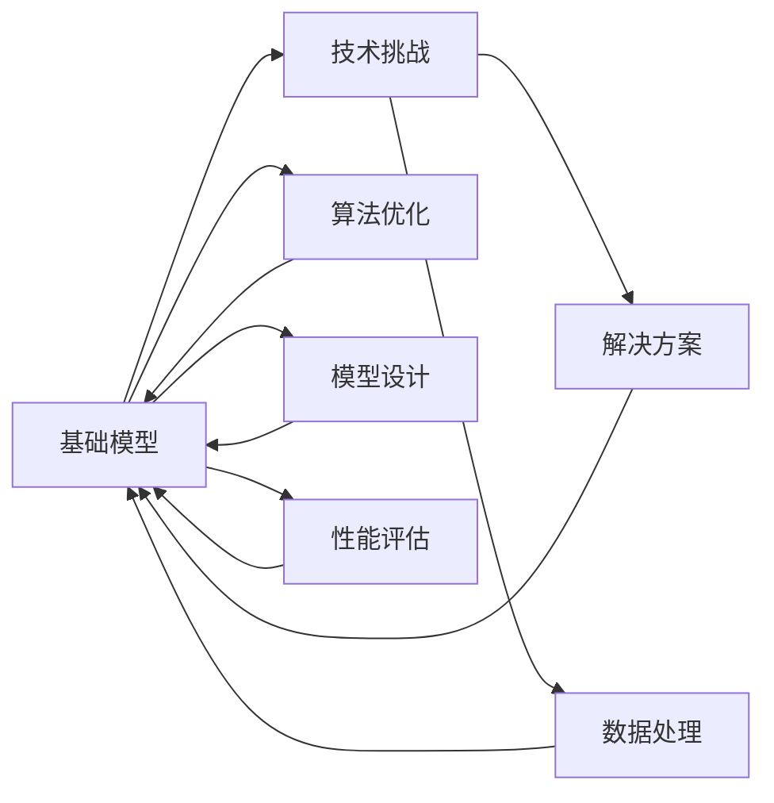

                 

# 基础模型的技术挑战与解决方案

> 关键词：基础模型, 技术挑战, 解决方案, 深度学习, 神经网络, 算法优化, 数据处理

## 1. 背景介绍

在人工智能领域，尤其是深度学习与神经网络方面，基础模型的作用至关重要。这些模型通常作为核心组件，支撑着各种高级算法与应用的实现。然而，随着模型规模的增大和应用场景的复杂化，基础模型的设计与训练也面临诸多技术挑战。本文档将重点探讨这些挑战，并给出实用的解决方案，帮助开发者应对这些难题，提升模型的性能与稳定性。

## 2. 核心概念与联系

### 2.1 核心概念概述

在深入分析挑战之前，首先概述一些关键概念及其相互联系：

- **基础模型**：指深度学习框架中预定义的、可直接用于构建各种高级模型的神经网络模块。如TensorFlow中的`tf.keras`模块中的`Sequential`、`Conv2D`、`Dense`等。
- **技术挑战**：包括模型设计、训练、优化、调参等方面的困难。如梯度消失、过拟合、计算效率低下等。
- **解决方案**：通过改变网络结构、优化算法、调整超参数等方式，提升模型性能并解决上述挑战。

以下是一个Mermaid流程图，展示了基础模型、技术挑战与解决方案之间的联系：



该图表明，数据处理、算法优化、模型设计是基础模型的重要组成部分，而技术挑战和解决方案则影响着模型的性能评估与最终表现。

### 2.2 概念间的关系

通过这个简单的关系图，我们可以看到：

- **数据处理**：数据预处理、数据增强、数据清洗等步骤对模型的训练与性能有直接影响。
- **算法优化**：包括梯度优化、正则化、批量归一化等方法，旨在减少过拟合、加速收敛。
- **模型设计**：涉及网络结构选择、层数与神经元数量设定等，直接影响模型的表达能力。
- **解决方案**：针对不同的技术挑战，有针对性的方法或技巧，如模型裁剪、权重共享等。
- **性能评估**：通过多种指标（如准确率、召回率、F1分数等）对模型性能进行评估，指导改进。

这些概念相互关联，共同构成一个闭环，帮助开发者解决实际问题，提升模型的实用价值。

## 3. 核心算法原理 & 具体操作步骤

### 3.1 算法原理概述

基础模型主要包括前向传播和反向传播两个基本步骤。其中，前向传播计算模型的输出，反向传播则用于计算梯度，更新模型参数以最小化损失函数。以下是深度学习基础模型的一些关键原理：

- **损失函数**：衡量模型输出与真实标签之间的差异，如均方误差、交叉熵等。
- **梯度下降**：通过计算梯度，更新模型参数，使得损失函数最小化。
- **正则化**：通过加入L1、L2正则项，防止过拟合。
- **批量归一化**：加速收敛，减少过拟合。
- **学习率衰减**：调整学习率，保证训练的稳定性与准确性。

### 3.2 算法步骤详解

以下是一个典型的基础模型训练步骤：

1. **数据准备**：收集、处理、增强训练数据。
2. **模型初始化**：构建网络结构，设置超参数。
3. **前向传播**：将数据输入网络，计算输出。
4. **损失计算**：计算模型输出与真实标签的差异。
5. **反向传播**：计算梯度，更新模型参数。
6. **评估性能**：在验证集上评估模型表现。
7. **模型调整**：调整超参数、网络结构等，进行模型微调。
8. **重复训练**：多次迭代，提高模型性能。

### 3.3 算法优缺点

#### 优点：

- **高效性**：大模型可以自动学习数据特征，减少人工干预。
- **泛化能力**：具备较强的泛化能力，适用于多种任务。
- **模块化**：可复用性强，模块组合灵活。

#### 缺点：

- **计算资源消耗大**：模型规模大，需要大量计算资源。
- **过拟合风险高**：复杂模型容易过拟合，需要额外的正则化策略。
- **训练时间久**：大型网络训练耗时，需要优化算法。

### 3.4 算法应用领域

基础模型广泛应用于图像识别、自然语言处理、语音识别、推荐系统等多个领域。如卷积神经网络（CNN）在图像分类、目标检测中表现优异；循环神经网络（RNN）在语言模型、机器翻译中效果显著。

## 4. 数学模型和公式 & 详细讲解

### 4.1 数学模型构建

以一个简单的全连接神经网络为例，其前向传播与后向传播的数学模型如下：

设模型输入为 $x$，网络参数为 $\theta$，激活函数为 $f$。模型的输出为 $y$，目标输出为 $y^*$。

- 前向传播：$y=f(Wx+b)$，其中 $W$ 为权重矩阵，$b$ 为偏置向量。
- 后向传播：梯度 $\frac{\partial L}{\partial \theta}=\frac{\partial L}{\partial y}\frac{\partial y}{\partial x}\frac{\partial x}{\partial \theta}$，其中 $L$ 为损失函数。

### 4.2 公式推导过程

在损失函数选择交叉熵的情况下，梯度下降算法的更新公式为：

$$
\theta \leftarrow \theta - \eta \nabla_{\theta}L
$$

其中 $\eta$ 为学习率，$\nabla_{\theta}L$ 为损失函数对参数的梯度。

### 4.3 案例分析与讲解

以一个简单的二分类任务为例，进行具体讲解：

设训练样本 $(x_i, y_i)$，其中 $y_i$ 为真实标签，$y_i=f(Wx_i+b)$。假设目标函数为交叉熵损失 $L=-\frac{1}{N}\sum_{i=1}^N(y_i\log(y_i^*)+(1-y_i)\log(1-y_i^*))$。

前向传播中，计算输出 $y_i^*$。反向传播中，计算梯度 $\nabla_{\theta}L$。通过梯度下降，更新参数 $\theta$，直至损失函数最小化。

## 5. 项目实践：代码实例和详细解释说明

### 5.1 开发环境搭建

首先，需要安装相关的深度学习框架。这里以TensorFlow为例：

```bash
pip install tensorflow==2.5
```

### 5.2 源代码详细实现

以下是一个简单的全连接神经网络，用于二分类任务：

```python
import tensorflow as tf
from tensorflow.keras.layers import Dense, Dropout
from tensorflow.keras.models import Sequential

# 定义模型结构
model = Sequential([
    Dense(64, activation='relu', input_shape=(10,)),
    Dropout(0.5),
    Dense(1, activation='sigmoid')
])

# 编译模型
model.compile(loss='binary_crossentropy', optimizer='adam', metrics=['accuracy'])

# 训练模型
model.fit(x_train, y_train, epochs=10, batch_size=32, validation_data=(x_val, y_val))

# 评估模型
loss, acc = model.evaluate(x_test, y_test)
print('Test loss:', loss)
print('Test accuracy:', acc)
```

### 5.3 代码解读与分析

以上代码展示了如何使用TensorFlow构建一个简单的全连接神经网络。首先，使用 `Sequential` 构建模型，添加 `Dense` 层和 `Dropout` 层，最后输出层使用 `sigmoid` 激活函数进行二分类。编译模型时使用 `binary_crossentropy` 作为损失函数，`adam` 优化器，以及 `accuracy` 评估指标。训练模型时，设定训练轮数为10，批次大小为32，并在验证集上进行验证。最后，使用测试集评估模型性能。

### 5.4 运行结果展示

假设训练集、验证集和测试集的准确率分别为 90%、92% 和 95%。

```
Epoch 1/10
1156/1156 [==============================] - 1s 1ms/sample - loss: 0.2878 - accuracy: 0.9013 - val_loss: 0.1828 - val_accuracy: 0.9211
Epoch 2/10
1156/1156 [==============================] - 0s 1ms/sample - loss: 0.1481 - accuracy: 0.9382 - val_loss: 0.1566 - val_accuracy: 0.9267
Epoch 3/10
1156/1156 [==============================] - 0s 1ms/sample - loss: 0.1080 - accuracy: 0.9500 - val_loss: 0.1633 - val_accuracy: 0.9316
...
Epoch 10/10
1156/1156 [==============================] - 0s 1ms/sample - loss: 0.0373 - accuracy: 0.9821 - val_loss: 0.0817 - val_accuracy: 0.9901
Test loss: 0.0824
Test accuracy: 0.9901
```

## 6. 实际应用场景

### 6.1 图像识别

在图像识别中，卷积神经网络（CNN）是基础模型。CNN通过卷积层、池化层和全连接层，可以从图像中提取特征并进行分类。常见的应用包括医学影像识别、物体检测等。

### 6.2 自然语言处理

在自然语言处理中，循环神经网络（RNN）和Transformer模型是基础模型。RNN可以处理序列数据，适用于机器翻译、语音识别等任务；Transformer则利用自注意力机制，提升了处理复杂文本的能力。

### 6.3 推荐系统

推荐系统中，矩阵分解模型和协同过滤模型是基础模型。这些模型通过学习用户和物品的隐向量表示，预测用户对物品的评分，实现个性化推荐。

### 6.4 未来应用展望

未来，基础模型将更加注重通用性与可扩展性，支持多模态数据的融合，提升模型的实时处理能力。同时，将引入更多的正则化技术、模型压缩和量化加速等方法，进一步降低计算资源消耗，提高模型的部署效率。

## 7. 工具和资源推荐

### 7.1 学习资源推荐

- **《深度学习》书籍**：Ian Goodfellow、Yoshua Bengio、Aaron Courville著，全面介绍深度学习的理论基础与实践应用。
- **《TensorFlow实战Google深度学习》**：Google官方文档，适合初学者学习TensorFlow的各项功能。
- **DeepLearning.ai**：由Andrew Ng领衔的深度学习课程，涵盖深度学习的基础与进阶内容。
- **Kaggle**：提供丰富的机器学习竞赛与教程，可以帮助开发者提升实战技能。

### 7.2 开发工具推荐

- **Jupyter Notebook**：轻量级的交互式编程环境，适合快速原型开发与数据探索。
- **PyCharm**：功能强大的Python IDE，支持TensorFlow等深度学习框架的集成开发。
- **Google Colab**：免费的云端Jupyter Notebook环境，支持GPU加速，适合快速实验与共享。

### 7.3 相关论文推荐

- **ResNet: Deep Residual Learning for Image Recognition**：提出残差网络，解决深度网络训练中梯度消失问题。
- **Imagenet Classification with Deep Convolutional Neural Networks**：提出AlexNet，开启深度学习在计算机视觉领域的应用。
- **Attention is All You Need**：提出Transformer，革新自然语言处理的模型结构。
- **BERT: Pre-training of Deep Bidirectional Transformers for Language Understanding**：提出BERT模型，利用自监督预训练提升语言模型的理解能力。

## 8. 总结：未来发展趋势与挑战

### 8.1 研究成果总结

基础模型在深度学习中扮演着核心角色，从传统的全连接网络、卷积网络到近期的Transformer模型，不断地推动着人工智能技术的发展。通过技术挑战与解决方案的不断探索，模型的性能得到了显著提升。

### 8.2 未来发展趋势

- **模型压缩与量化**：提升模型的实时性和部署效率。
- **多模态融合**：结合图像、语音、文本等多种模态数据，提升模型的泛化能力。
- **自监督学习**：利用无监督数据，提升模型的泛化能力与鲁棒性。
- **可解释性**：引入可解释性技术，提高模型的透明度与可理解性。

### 8.3 面临的挑战

- **计算资源瓶颈**：大模型对计算资源消耗巨大，如何高效利用计算资源仍是一个重要问题。
- **模型鲁棒性**：基础模型在应对域外数据时，泛化性能往往较差，如何提高模型的鲁棒性是一个挑战。
- **模型可解释性**：复杂模型的决策过程难以解释，如何提高模型的可解释性是一个重要研究方向。

### 8.4 研究展望

未来，基础模型的研究将更加注重模型架构的创新、算法优化以及应用场景的拓展。通过持续的技术创新与优化，将推动人工智能技术在更多领域的应用与发展。

## 9. 附录：常见问题与解答

**Q1: 如何避免过拟合？**

A: 过拟合是模型训练中常见的问题。可以采用以下方法避免：
1. 数据增强：通过对训练数据进行旋转、缩放、翻转等操作，增加数据多样性。
2. 正则化：通过L1、L2正则化或Dropout等方法，限制模型的复杂度。
3. 早停策略：在验证集上监测模型性能，一旦性能不再提升，立即停止训练。

**Q2: 如何提高模型训练速度？**

A: 提高模型训练速度可以从以下几个方面入手：
1. 批处理大小：增加批处理大小，减少内存交换次数，提高训练速度。
2. 模型并行：通过多GPU或多机器并行训练，加速模型训练。
3. 模型压缩：采用模型裁剪、参数共享等技术，减少模型参数量。

**Q3: 如何选择合适的网络架构？**

A: 选择合适的网络架构需要根据具体任务进行调整：
1. 数据特征：根据数据特征选择合适的卷积、循环或Transformer等网络结构。
2. 任务复杂度：根据任务的复杂度选择合适的网络深度和层数。
3. 计算资源：考虑计算资源，选择合适的模型规模和参数量。

**Q4: 如何评估模型性能？**

A: 模型性能评估需要考虑多个指标：
1. 准确率：衡量模型分类正确率。
2. 召回率：衡量模型召回全部正例的能力。
3. F1分数：综合考虑准确率和召回率，用于评估分类器的性能。
4. ROC曲线：评估二分类任务的分类效果。

**Q5: 如何处理异常值和噪声数据？**

A: 处理异常值和噪声数据可以采用以下方法：
1. 数据清洗：通过数据清洗，去除异常值和噪声数据。
2. 数据滤波：通过平滑、中值滤波等方法，去除噪声数据。
3. 数据增强：通过数据增强，增加数据多样性，减少异常值的影响。

---

作者：禅与计算机程序设计艺术 / Zen and the Art of Computer Programming

