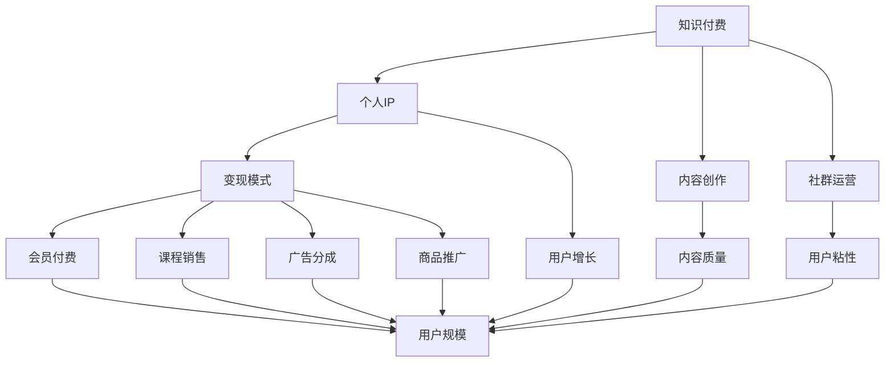
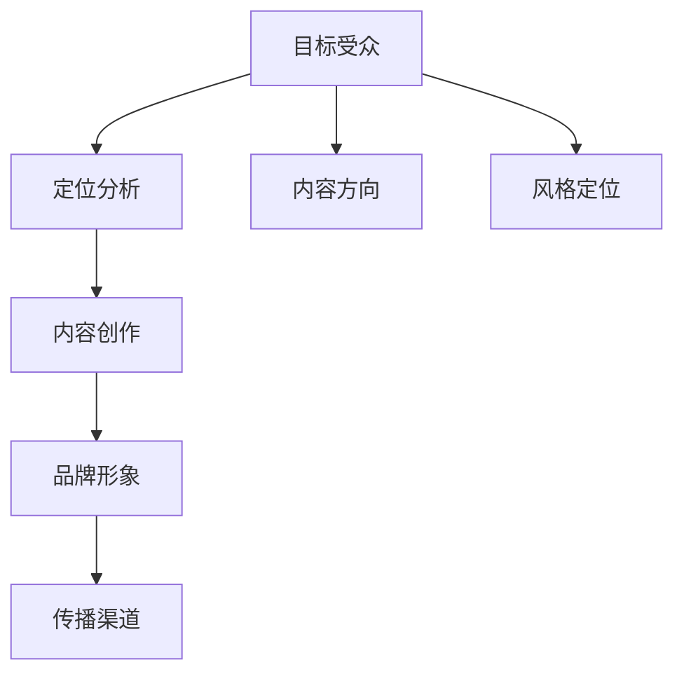
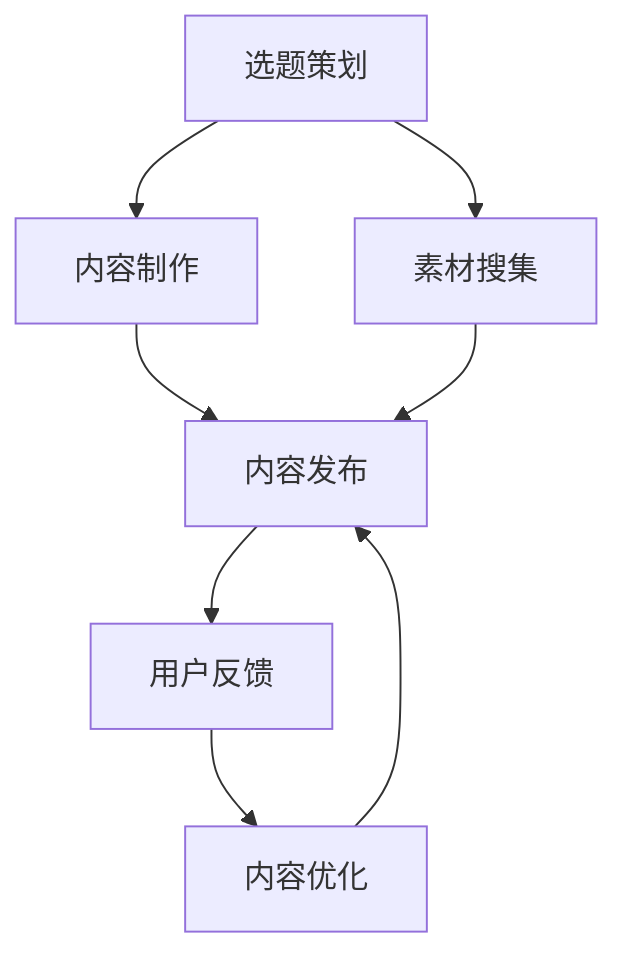
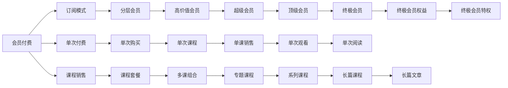
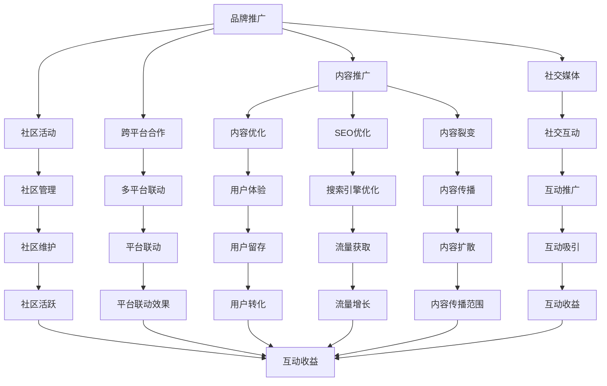

                 

# 如何打造个人知识付费生态圈

> 关键词：知识付费, 个人IP, 内容创作, 社群运营, 变现模式, 用户增长, 市场竞争

## 1. 背景介绍

### 1.1 问题由来
随着互联网的普及和信息技术的飞速发展，知识付费作为一种新型商业模式正逐渐兴起，并成为移动互联网领域的一大热门话题。知识付费的兴起，标志着互联网从“免费为王”的时期过渡到“付费为王”的阶段。知识付费模式不仅能够满足人们日益增长的知识需求，还能为内容创作者带来可观的经济回报。

在知识付费领域，个人IP（Influential Personality）作为知识付费生态圈的核心要素，扮演着至关重要的角色。通过构建个人IP，可以吸引大量忠实粉丝，提升品牌影响力，进而实现内容变现。同时，内容创作者需要面对激烈的市场竞争，如何在众多IP中脱颖而出，形成稳定的用户基础，成为其需要重点解决的问题。

### 1.2 问题核心关键点
打造个人知识付费生态圈的核心关键点包括：

- 内容定位：明确个人IP的定位，分析目标受众，制定内容方向和风格。
- 内容创作：保证内容质量，定期更新，吸引和保留用户。
- 用户运营：通过社群运营、粉丝互动等方式，增强用户粘性，提升用户忠诚度。
- 变现模式：选择合适的变现方式，如会员订阅、知识付费课程、广告分成等。
- 市场竞争：分析竞争对手，制定差异化策略，保持领先地位。
- 用户增长：通过多渠道推广，不断拓展用户规模，增加用户基数。

## 2. 核心概念与联系

### 2.1 核心概念概述

为更好地理解个人知识付费生态圈的构建，本节将介绍几个关键概念：

- 知识付费（Knowledge Pay）：用户为获取知识而支付费用的商业模式，主要包括在线教育、知识订阅、付费咨询等。
- 个人IP（Influential Personality）：个人品牌，即个人通过其专业知识和独特风格，在某一领域建立起一定的知名度和影响力。
- 内容创作（Content Creation）：个人IP通过不断创作高质量的内容，积累知识储备，提升个人品牌价值。
- 社群运营（Community Management）：通过建立线上社群，与粉丝互动，增强用户粘性，形成稳定社区。
- 变现模式（Monetization Model）：将内容价值转化为经济收益的渠道，主要包括会员付费、课程销售、广告分成、商品推广等。
- 用户增长（User Growth）：通过多种策略，扩大用户规模，提升用户基础。
- 市场竞争（Market Competition）：在知识付费领域，需要分析竞争对手，制定差异化策略，保持领先地位。

这些核心概念之间的逻辑关系可以通过以下Mermaid流程图来展示：



这个流程图展示了个人知识付费生态圈中各核心概念之间的关系：

1. 知识付费是个人IP得以实现的核心商业模式。
2. 内容创作是个人IP的根基，高质量的内容是吸引用户的关键。
3. 社群运营是增强用户粘性的重要手段。
4. 变现模式是实现知识付费商业价值的渠道。
5. 用户增长是扩大用户规模、提升用户基础的重要策略。
6. 市场竞争需要分析竞争对手，制定差异化策略，保持领先地位。

### 2.2 概念间的关系

这些核心概念之间存在着紧密的联系，形成了个人知识付费生态圈的基本框架。下面我们通过几个Mermaid流程图来展示这些概念之间的关系。

#### 2.2.1 个人IP的构建



这个流程图展示了个人IP构建的过程：

1. 首先确定目标受众，进行定位分析。
2. 根据受众特点，确定内容方向和风格定位。
3. 创作高质量的内容，提升品牌形象。
4. 通过各种传播渠道，扩大个人IP的影响力。

#### 2.2.2 内容创作的流程



这个流程图展示了内容创作的基本流程：

1. 选题策划阶段，确定创作主题和方向。
2. 素材搜集阶段，收集相关资料和素材。
3. 内容制作阶段，将素材转化为高质量的内容。
4. 内容发布阶段，将内容分享到目标平台上。
5. 用户反馈阶段，根据用户反馈进行内容优化。
6. 内容优化阶段，提升内容质量，增强用户体验。

#### 2.2.3 变现模式的分类



这个流程图展示了不同的变现模式及其应用场景：

1. 会员付费模式：用户可以订阅会员，享受各类优质内容。
2. 单次付费模式：用户购买单次内容，获得即时收益。
3. 课程销售模式：用户购买完整的课程内容，获取系统化知识。
4. 广告分成模式：内容平台通过广告分成，为内容创作者提供额外收益。
5. 商品推广模式：内容创作者推广相关商品，获得销售佣金。

#### 2.2.4 用户增长的策略



这个流程图展示了用户增长的基本策略：

1. 品牌推广策略，通过多渠道推广提升品牌知名度。
2. 内容推广策略，通过优化内容和裂变传播吸引用户。
3. 社交媒体策略，通过社交平台增强用户互动和传播效果。
4. SEO优化策略，通过搜索引擎优化提升流量获取。
5. 社区活动策略，通过社区管理增强用户粘性和活跃度。
6. 跨平台合作策略，通过多平台联动提升影响力。
7. 用户体验策略，通过提升用户体验增加用户留存率。
8. 平台联动策略，通过跨平台联动增加流量和互动。

## 3. 核心算法原理 & 具体操作步骤
### 3.1 算法原理概述

个人知识付费生态圈的构建，本质上是利用数据挖掘、机器学习和市场营销等技术手段，通过内容创作、社群运营、变现模式等多个环节的综合优化，实现用户增长和商业变现。具体来说，其核心算法原理包括以下几个方面：

- 用户行为分析：通过分析用户的浏览、点击、购买等行为，了解用户需求和偏好，优化内容创作和社群运营策略。
- 推荐算法：利用协同过滤、内容推荐等算法，为用户推荐个性化内容，提升用户满意度和留存率。
- 市场细分：通过用户数据分析，细分市场，制定差异化策略，提高市场占有率。
- 广告投放优化：通过A/B测试、回归模型等算法，优化广告投放策略，提升广告转化率。

### 3.2 算法步骤详解

个人知识付费生态圈的构建，通常包括以下几个关键步骤：

**Step 1: 确定内容定位**

- 通过市场调研，分析目标受众的需求和偏好。
- 根据受众特点，确定内容主题、风格和形式。

**Step 2: 内容创作与优化**

- 定期创作高质量内容，涵盖文章、视频、音频等多种形式。
- 通过数据分析，优化内容质量和结构，提升用户体验。

**Step 3: 社群运营与管理**

- 建立线上社群，加强与粉丝互动，增强用户粘性。
- 定期举办社群活动，增加用户活跃度，提升社群影响力。

**Step 4: 变现模式选择与实施**

- 根据内容特点和受众需求，选择合适的变现模式。
- 设计合理的付费策略，提供高性价比的内容和服务。

**Step 5: 用户增长与维护**

- 通过多渠道推广，扩大用户规模，提升用户基础。
- 通过数据分析，优化推广策略，提升用户留存率和转化率。

**Step 6: 市场竞争分析与策略制定**

- 分析竞争对手，了解市场动态和用户需求变化。
- 制定差异化策略，提升品牌竞争力。

### 3.3 算法优缺点

个人知识付费生态圈的构建，具有以下优点：

- 提升品牌价值：通过高质量的内容创作和社群运营，提升品牌知名度和影响力。
- 增强用户粘性：通过多渠道互动和社群管理，增强用户粘性和忠诚度。
- 实现商业变现：通过多样化的变现模式，实现内容价值最大化。

同时，该方法也存在一定的局限性：

- 内容创作成本高：高质量内容的创作和维护需要大量时间和精力。
- 用户需求多变：用户需求快速变化，内容创作者需要不断调整和优化策略。
- 市场竞争激烈：知识付费领域竞争激烈，需要持续创新和优化才能保持领先地位。

### 3.4 算法应用领域

个人知识付费生态圈的构建，已经在教育、健康、金融、科技等多个领域得到了广泛应用。以下是几个典型案例：

#### 3.4.1 教育领域

- 知识星球：通过知识付费模式，提供各类教育内容，覆盖K-12、大学、职业教育等多个领域。
- 得到App：提供各类高质量课程和讲座，涵盖编程、写作、管理等多个方向。

#### 3.4.2 健康领域

- 丁香园：提供各类健康科普和专业文章，覆盖医学、营养、心理等多个领域。
- 好大夫在线：提供各类医学咨询和健康管理服务，构建医生与患者之间的互动平台。

#### 3.4.3 金融领域

- 雪球网：提供各类金融资讯和分析，涵盖股票、基金、外汇等多个方向。
- 理财管家：提供各类理财规划和投资建议，帮助用户实现财富增值。

#### 3.4.4 科技领域

- 极客时间：提供各类科技领域内容，涵盖编程、设计、人工智能等多个方向。
- 腾讯课堂：提供各类IT技能培训课程，帮助用户提升技术水平。

## 4. 数学模型和公式 & 详细讲解 & 举例说明
### 4.1 数学模型构建

个人知识付费生态圈的构建，涉及多个复杂的数学模型和算法。下面我们将通过数学语言对其中的几个关键模型进行详细阐述。

- 用户行为分析模型：通过统计学和机器学习模型，分析用户行为数据，预测用户需求和偏好。
- 推荐算法模型：利用协同过滤、内容推荐等算法，为用户推荐个性化内容。
- 市场细分模型：通过聚类分析等方法，细分市场，制定差异化策略。
- 广告投放优化模型：通过回归模型和A/B测试，优化广告投放策略。

### 4.2 公式推导过程

以下我们将以推荐算法为例，进行详细推导。

假设用户集为 $U$，物品集为 $I$，用户对物品的评分矩阵为 $R \in \mathbb{R}^{U \times I}$。用户 $u$ 对物品 $i$ 的评分 $r_{ui}$ 为 $[0, 5]$ 内的整数，其中 $0$ 表示未评分，$5$ 表示最高评分。

推荐算法的目标是为用户 $u$ 推荐其未评分或低评分物品，最大化其评分期望。推荐算法的基本思路是通过用户历史评分，预测其对未评分物品的评分，从而找到用户最感兴趣的物品。

常用的推荐算法包括协同过滤和内容推荐。协同过滤算法基于用户历史评分矩阵，通过相似度度量，为用户推荐相似物品。内容推荐算法基于物品属性和用户属性，通过预测模型，为用户推荐相关物品。

协同过滤算法的核心公式为：

$$
\hat{r}_{ui} = \frac{\sum_{j=1}^N \alpha_j r_{uj} r_{ji}}{\sqrt{\sum_{j=1}^N \alpha_j^2 + \epsilon}}
$$

其中 $N$ 为相似物品的数目，$\alpha_j$ 为物品 $j$ 与物品 $i$ 的相似度，$\epsilon$ 为平滑项。

内容推荐算法的核心公式为：

$$
\hat{r}_{ui} = \alpha_1 x_i \cdot \hat{y}_u + \alpha_2 z_i + \beta
$$

其中 $x_i$ 为物品 $i$ 的属性向量，$y_u$ 为用户 $u$ 的属性向量，$\alpha_1, \alpha_2, \beta$ 为模型参数。

### 4.3 案例分析与讲解

假设我们有一个在线教育平台，需要为用户推荐适合的课程。我们可以采用协同过滤和内容推荐相结合的方法：

1. 协同过滤：通过分析用户历史评分，找到相似用户，推荐其评分较高的课程。
2. 内容推荐：通过分析课程内容和用户属性，预测用户对课程的评分，推荐评分较高的课程。
3. 结合使用：将协同过滤和内容推荐的预测结果综合，为用户推荐最适合的课程。

例如，一个用户 $u$ 对课程 $i$ 的评分未知，我们对用户历史评分矩阵 $R$ 进行分析，发现用户 $u$ 与用户 $v$ 相似度最高。通过对用户 $v$ 的评分矩阵进行分析，发现其对课程 $i$ 评分较高。此时，我们预测用户 $u$ 对课程 $i$ 的评分，根据预测结果推荐课程 $i$ 给用户 $u$。

## 5. 项目实践：代码实例和详细解释说明
### 5.1 开发环境搭建

在进行个人知识付费生态圈构建的开发实践前，我们需要准备好开发环境。以下是使用Python进行Flask框架开发的环境配置流程：

1. 安装Python：从官网下载并安装Python 3.x，确保其版本在3.7以上。
2. 安装Flask：使用pip安装Flask框架。
3. 安装SQLAlchemy：用于数据库操作。
4. 安装Flask-Login：用于用户认证。
5. 安装Flask-WTF：用于表单处理。

完成上述步骤后，即可在Python环境中开始开发实践。

### 5.2 源代码详细实现

下面我们将以一个简单的知识付费平台为例，实现用户登录、内容发布、课程推荐等功能。

```python
from flask import Flask, render_template, request
from flask_sqlalchemy import SQLAlchemy
from flask_login import LoginManager, login_user, logout_user, login_required
from flask_wtf import FlaskForm
from wtforms import StringField, PasswordField, SubmitField

app = Flask(__name__)
app.config['SECRET_KEY'] = 'secret key'
app.config['SQLALCHEMY_DATABASE_URI'] = 'sqlite:///user.db'
db = SQLAlchemy(app)
login_manager = LoginManager()
login_manager.init_app(app)

class User(db.Model):
    id = db.Column(db.Integer, primary_key=True)
    username = db.Column(db.String(64), index=True, unique=True)
    password_hash = db.Column(db.String(128))
    posts = db.relationship('Post', backref='author', lazy='dynamic')

    def __repr__(self):
        return '<User %r>' % self.username

@login_manager.user_loader
def load_user(user_id):
    return User.query.get(int(user_id))

class Post(db.Model):
    id = db.Column(db.Integer, primary_key=True)
    title = db.Column(db.String(64), index=True)
    body = db.Column(db.Text)
    timestamp = db.Column(db.DateTime, default=datetime.utcnow)
    user_id = db.Column(db.Integer, db.ForeignKey('user.id'))

    def __repr__(self):
        return '<Post %r>' % self.title

class LoginForm(FlaskForm):
    username = StringField('Username', render_kw={'placeholder': 'Username'})
    password = PasswordField('Password', render_kw={'placeholder': 'Password'})
    submit = SubmitField('Sign In')

@app.route('/')
def index():
    return render_template('index.html')

@app.route('/login', methods=['GET', 'POST'])
def login():
    form = LoginForm()
    if form.validate_on_submit():
        user = User.query.filter_by(username=form.username.data).first()
        if user is None or not user.check_password(form.password.data):
            flash('Invalid username or password')
            return redirect(url_for('login'))
        login_user(user)
        return redirect(url_for('index'))
    return render_template('login.html', title='Sign In', form=form)

@app.route('/logout')
@login_required
def logout():
    logout_user()
    return redirect(url_for('index'))

@app.route('/post', methods=['GET', 'POST'])
@login_required
def post():
    form = PostForm()
    if form.validate_on_submit():
        post = Post(title=form.title.data, body=form.body.data, author=current_user)
        db.session.add(post)
        db.session.commit()
        flash('Your post is now live!')
        return redirect(url_for('index'))
    return render_template('create_post.html', title='Post Your Message', form=form)

@app.route('/posts')
@login_required
def posts():
    posts = Post.query.all().order_by(Post.timestamp.desc())
    return render_template('posts.html', posts=posts)
```

### 5.3 代码解读与分析

下面我们对关键代码进行解读与分析：

- 用户模型 `User`：用于存储用户信息，包括用户名、密码等。
- 帖子模型 `Post`：用于存储用户发布的文章信息，包括标题、内容等。
- 登录表单 `LoginForm`：用于用户登录页面，接收用户名和密码，并验证其正确性。
- 文章发布表单 `PostForm`：用于文章发布页面，接收标题和内容，并保存至数据库。
- 登录、注销、发布、查看帖子等功能：通过Flask框架，实现用户交互和数据操作。

## 6. 实际应用场景
### 6.1 智能客服系统

个人知识付费生态圈在智能客服系统中具有广泛应用。通过建立知识库，将常见问题和解答形成文档，供客户查询和参考。同时，利用推荐算法为用户推荐相关问题，提升用户查询效率和体验。

例如，某电商平台可以通过用户查询历史，推荐可能感兴趣的问题，减少人工客服的响应量。还可以通过智能客服机器人，自动回答用户问题，提升服务效率和用户满意度。

### 6.2 金融服务

在金融领域，知识付费生态圈可以提供各类金融咨询和分析服务，帮助用户做出更明智的投资决策。通过推荐算法，为用户推荐最新的市场资讯、股票分析报告等，提升用户获取信息的质量和效率。

例如，某金融理财平台可以提供各类金融课程和咨询服务，帮助用户学习理财知识和技能，提升投资水平。通过社区运营，用户可以分享经验、交流心得，构建信任和社群。

### 6.3 教育培训

在教育培训领域，知识付费生态圈可以为用户提供各类在线课程和资源。通过推荐算法，为用户推荐适合的课程和学习路径，提升学习效率和效果。

例如，某在线教育平台可以提供各类课程和教材，帮助用户提升专业技能和知识储备。通过社群运营，用户可以参与讨论、分享经验，构建学习社区。

### 6.4 健康医疗

在健康医疗领域，知识付费生态圈可以提供各类健康科普和专业文章，帮助用户了解健康知识，提升自我保健能力。通过推荐算法，为用户推荐适合的健康方案和生活方式，提升健康水平。

例如，某健康服务平台可以提供各类健康资讯和专业文章，帮助用户了解健康知识。通过社区运营，用户可以分享健康经验、交流心得，构建信任和社群。

## 7. 工具和资源推荐
### 7.1 学习资源推荐

为了帮助开发者系统掌握个人知识付费生态圈的构建理论基础和实践技巧，这里推荐一些优质的学习资源：

1. Coursera《Python for Data Science》课程：介绍Python在数据科学中的应用，涵盖数据分析、机器学习、推荐算法等内容。
2. edX《Introduction to Machine Learning with PyTorch》课程：介绍PyTorch深度学习框架，涵盖神经网络、推荐算法等内容。
3. Udacity《Python for AI》课程：介绍Python在人工智能中的应用，涵盖机器学习、推荐算法等内容。
4. Flask官方文档：介绍Flask框架的使用和开发，涵盖路由、模板、表单等内容。
5. Flask-Login官方文档：介绍Flask-Login模块的使用和开发，涵盖用户认证、会话管理等内容。
6. Flask-WTF官方文档：介绍Flask-WTF模块的使用和开发，涵盖表单处理、验证等内容。

通过对这些资源的学习实践，相信你一定能够快速掌握个人知识付费生态圈的构建精髓，并用于解决实际的NLP问题。
### 7.2 开发工具推荐

高效的开发离不开优秀的工具支持。以下是几款用于个人知识付费生态圈开发的常用工具：

1. Flask：轻量级Web框架，易于上手，适合快速开发。
2. SQLAlchemy：ORM框架，方便数据库操作。
3. Flask-Login：用户认证模块，提供用户登录、注销等功能。
4. Flask-WTF：表单处理模块，提供表单验证、提交等功能。
5. Git：版本控制工具，方便代码管理和协作。
6. Docker：容器化技术，便于应用部署和扩展。
7. AWS/Azure/GCP：云服务提供商，提供计算、存储、网络等基础设施。

合理利用这些工具，可以显著提升个人知识付费生态圈开发的效率，加快创新迭代的步伐。

### 7.3 相关论文推荐

个人知识付费生态圈的构建，源于学界的持续研究。以下是几篇奠基性的相关论文，推荐阅读：

1. "A Survey on Recommendation Systems Based on Collaborative Filtering"：介绍协同过滤算法的原理和实现，推荐阅读。
2. "Deep Learning for Recommendation Systems"：介绍深度学习在推荐算法中的应用，推荐阅读。
3. "A Comparative Study of Content-based Filtering Algorithms"：比较内容过滤算法的优劣，推荐阅读。
4. "User Behavior Analysis in E-commerce"：介绍用户行为分析在电商领域的应用，推荐阅读。
5. "Machine Learning-Based Advertisement Optimization"：介绍机器学习在广告优化中的应用，推荐阅读。

这些论文代表了大语言模型微调技术的发展脉络。通过学习这些前沿成果，可以帮助研究者把握学科前进方向，激发更多的创新灵感。

除上述资源外，还有一些值得关注的前沿资源，帮助开发者紧跟个人知识付费生态圈构建技术的最新进展，例如：

1. arXiv论文预印本：人工智能领域最新研究成果的发布平台，包括大量尚未发表的前沿工作，学习前沿技术的必读资源。
2. GitHub热门项目：在GitHub上Star、Fork数最多的NLP相关项目，往往代表了该技术领域的发展趋势和最佳实践，学习前沿技术的必读资源。
3. 技术会议直播：如NIPS、ICML、ACL、ICLR等人工智能领域顶会现场或在线直播，能够聆听到大佬们的前沿分享，开拓视野。
4. 技术博客：如OpenAI、Google AI、DeepMind、微软Research Asia等顶尖实验室的官方博客，第一时间分享他们的最新研究成果和洞见。
5. 开源社区：如GitHub、Stack Overflow等开源社区，提供丰富的开源资源和开发者社区，有助于解决实际问题。

总之，对于个人知识付费生态圈的构建，需要开发者保持开放的心态和持续学习的意愿。多关注前沿资讯，多动手实践，多思考总结，必将收获满满的成长收益。

## 8. 总结：未来发展趋势与挑战
### 8.1 研究成果总结

本文对个人知识付费生态圈的构建方法进行了全面系统的介绍。通过分析用户行为、推荐算法、市场细分、广告投放优化等核心算法，详细讲解了内容创作、社群运营、变现模式等多个环节的综合优化策略。通过示例

